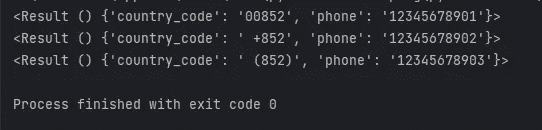
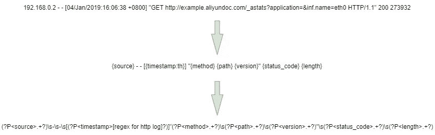
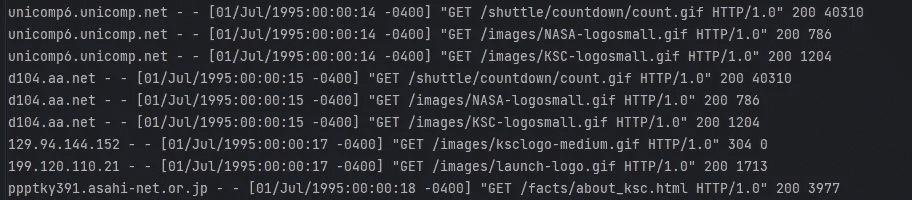
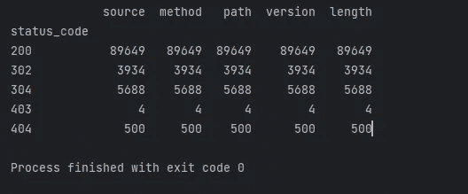

# 介绍 Python 的 Parse：**正则表达式的终极替代品**

> 原文：[`towardsdatascience.com/introducing-pythons-parse-the-ultimate-alternative-to-regular-expressions-3ae07e51b753`](https://towardsdatascience.com/introducing-pythons-parse-the-ultimate-alternative-to-regular-expressions-3ae07e51b753)

## [PYTHON TOOLBOX](https://medium.com/@qtalen/list/python-toolbox-4289824c6407)

## 使用最佳实践和实际案例来展示强大的文本解析库

[](https://qtalen.medium.com/?source=post_page-----3ae07e51b753--------------------------------)[](https://towardsdatascience.com/?source=post_page-----3ae07e51b753--------------------------------) [Peng Qian](https://qtalen.medium.com/?source=post_page-----3ae07e51b753--------------------------------)

·发表于 [Towards Data Science](https://towardsdatascience.com/?source=post_page-----3ae07e51b753--------------------------------) ·阅读时间 7 分钟·2023 年 6 月 19 日

--


[parse](https://pypi.org/project/parse/) 库非常简单易用。照片由 [Amanda Jones](https://unsplash.com/@amandagraphc?utm_source=medium&utm_medium=referral) 提供，来源于 [Unsplash](https://unsplash.com/?utm_source=medium&utm_medium=referral)

本文介绍了一个名为 `parse` 的 Python 库，用于快速、方便地解析和提取文本数据，是 Python 正则表达式的绝佳替代品。

并且涵盖了 `parse` 库的最佳实践和解析 nginx 日志文本的实际案例。

# 介绍

我有一个同事叫王。一天，他带着担忧的表情来到我面前，说他遇到了一个复杂的问题：他的老板要求他分析过去一个月的服务器日志，并提供访客流量统计。

我告诉他很简单，只需使用正则表达式。例如，要分析 nginx 日志，使用以下正则表达式，这很基础。

```py
content:
192.168.0.2 - - [04/Jan/2019:16:06:38 +0800] "GET http://example.aliyundoc.com/_astats?application=&inf.name=eth0 HTTP/1.1" 200 273932
regular expression:
(?<ip>\d+\.\d+\.\d+\.\d+)( - - \[)(?<datetime>[\s\S]+)(?<t1>\][\s"]+)(?<request>[A-Z]+) (?<url>[\S]*) (?<protocol>[\S]+)["] (?<code>\d+) (?<sendbytes>\d+)
```

但王依然担心，学习正则表达式太复杂了。虽然网上有很多现成的例子可以学习，但他在解析不常见的文本格式时需要帮助。

而且，即使这次他能解决问题，如果老板在提交分析时要求更改解析规则呢？难道他不会再费很长时间吗？

是否有更简单、更方便的方法？

我考虑了一下，说，当然有。今天我们介绍的主角是 Python `parse` 库。

# 安装与设置

如在 parse GitHub 页面上所述，它使用 Python 的 format() 语法来解析文本，本质上作为 Python f-strings 的逆操作。

在开始使用 `parse` 之前，让我们看看如何安装这个库。

直接使用 pip 安装：

```py
python -m pip install parse
```

使用 conda 安装可能更麻烦，因为 parse 不在默认的 conda 通道中，需要通过 conda-forge 安装：

```py
conda install -c conda-forge parse
```

安装后，你可以在代码中使用 `from parse import *` 直接使用库的方法。

# 特性与用法

`parse` API 类似于 Python 正则表达式，主要包括 `parse`、`search` 和 `findall` 方法。基本用法可以从 parse 文档中学习。

## 模式格式

parse 格式与 Python 格式语法非常相似。你可以使用 `{}` 或 `{field_name}` 捕获匹配的文本。

例如，在以下文本中，如果我想获取个人资料 URL 和用户名，我可以这样写：

```py
content:
Hello everyone, my Medium profile url is https://qtalen.medium.com,
and my username is @qtalen.

parse pattern:
Hello everyone, my Medium profile url is {profile},
and my username is {username}.
```

或者你想提取多个电话号码。电话号码的前面有不同格式的国家代码，且电话号码长度固定为 11 位。你可以这样写：

```py
compiler = Parser("{country_code}{phone:11.11},")
content = "0085212345678901, +85212345678902, (852)12345678903,"

results = compiler.findall(content)

for result in results:
    print(result)
```

或者如果你需要处理一段 HTML 标签中的文本，但该文本前后有不定长度的空白，你可以这样写：

```py
content:
<div>           Hello World               </div>

pattern:
<div>{:^}</div>
```

在上面的代码中，`{:11}` 指宽度，意味着捕获至少 11 个字符，相当于正则表达式 `(.{11,})?`。`{:.11}` 指精度，意味着最多捕获 11 个字符，相当于正则表达式 `(.{,11})?`。因此，当结合使用时，它表示 `(.{11, 11})?`。结果是：



捕获固定宽度的字符。图像由作者提供

parse 最强大的功能是处理时间文本，可以直接解析为 Python datetime 对象。例如，如果我们想解析 HTTP 日志中的时间：

```py
content:
[04/Jan/2019:16:06:38 +0800]

pattern:
[{:th}]
```

## 获取结果

有两种获取结果的方法：

1.  对于使用 `{}` 而没有字段名称的捕获方法，你可以直接使用 `result.fixed` 将结果获取为元组。

1.  对于使用 `{field_name}` 的捕获方法，你可以使用 `result.named` 将结果获取为字典。

## 自定义类型转换

尽管使用 `{field_name}` 已经非常简单，但源代码显示 `{field_name}` 在内部被转换为 `(?P<field_name>.+?)`。所以，`parse` 仍然使用正则表达式进行匹配。`.+?` 表示非贪婪模式下的一个或多个随机字符。



从 parse 格式到正则表达式的转换过程。图像由作者提供

然而，我们通常希望更精确地匹配。例如，文本“my email is xxx@xxx.com”，`“my email is {email}”` 可以捕获电子邮件。有时我们可能会得到脏数据，例如“my email is xxxx@xxxx”，我们不想抓取它。

是否有办法使用正则表达式进行更准确的匹配？

这时，`with_pattern` 装饰器就派上用场了。

例如，对于捕获电子邮件地址，我们可以这样编写：

```py
@with_pattern(r'\b[A-Za-z0-9._%+-]+@[A-Za-z0-9.-]+\.[A-Z|a-z]{2,}\b')
def email(text: str) -> str:
    return text

compiler = Parser("my email address is {email:Email}", dict(Email=email))

legal_result = compiler.parse("my email address is xx@xxx.com")  # legal email
illegal_result = compiler.parse("my email address is xx@xx")     # illegal email
```

使用 `with_pattern` 装饰器，我们可以定义一个自定义字段类型，在这种情况下是 `Email`，它将匹配文本中的电子邮件地址。我们还可以使用这种方法匹配其他复杂的模式。

# 现实世界的例子：解析 Nginx 日志

在了解解析的基本用法后，我们回到文章开头提到的王的困扰。让我们看看如果我们有过去一个月的服务器日志文件，如何解析日志。

**注意：** 我们选择了 [NASA 的 HTTP 日志数据集](https://ita.ee.lbl.gov/html/contrib/NASA-HTTP.html) 作为本实验的数据集，该数据集可以免费使用。

需要解析的文本片段如下：



文本片段是什么样的。作者截图

首先，我们需要预处理解析表达式。这样，在解析大型文件时，我们就不必为每一行文本编译正则表达式，从而提高性能。

接下来，`parse_line` 方法是这个例子的核心。它使用预处理的表达式来解析文本，如果有匹配则返回相应的匹配结果，如果没有则返回一个空字典。

然后，我们使用 `read_file` 方法逐行处理文本，使用生成器，这可以最小化内存使用。然而，由于磁盘的 4k 能力限制，这种方法可能无法保证性能。

由于我们需要对日志文件进行统计，我们必须使用 `from_records` 方法从匹配结果构造一个 `DataFrame`。

最后，在 `main` 方法中，我们将所有方法整合在一起，并尝试计算不同 `status_code` 的出现次数：



王的困扰已经轻松解决。作者图片

就这样。王的困扰已经轻松解决。

# 使用 `parse` 库的最佳实践

尽管 `parse` 库非常简单，以至于我在文章中只有一点要写，但仍然有一些最佳实践需要遵循，就像正则表达式一样。

## 可读性和可维护性

为了高效捕获文本并保持表达式，建议始终使用 `{field_name}` 而不是 `{}`。这样，你可以直接使用 `result.named` 获取键值结果。

推荐使用 `Parser(pattern)` 来预处理表达式，而不是 `parse(pattern, text)`。

一方面，这可以提高性能。另一方面，当使用 `Custom Type Conversions` 时，你可以将 `pattern` 和 `extra_type` 保持在一起，这使得维护更容易。

## 大数据集的性能优化

如果你查看源代码，你会发现`{}`和`{field_name}`分别使用正则表达式`(.+?)`和`(?P<field_name>.+?)`进行捕获。这两个表达式都使用了[非贪婪模式](https://docs.python.org/3/library/re.html#regular-expression-syntax)。所以当你使用`with_pattern`编写自己的表达式时，也应该尝试使用非贪婪模式。

同时，在编写`with_pattern`时，如果使用`()`进行捕获分组，请使用`regex_group_count`来指定具体的分组，如：`[@with_pattern](http://twitter.com/with_pattern)(r’((\d+))’, regex_group_count=2)`。

最后，如果在`with_pattern`中不需要分组，请使用`(?:x)`代替。`@with_pattern(r’(?:<input.*?>)(.*?)(?:</input>)’, regex_group_count=1)`表示你想要捕获输入标签之间的内容。输入标签不会被捕获。

# 结论

在这篇文章中，我改变了以往写长篇论文的方式。通过解决同事的问题，我简要介绍了`parse`库的使用。希望你喜欢这种风格。

这篇文章没有涵盖官方网站上的详细使用方法，但介绍了一些最佳实践和基于我经验的性能优化方案。

同时，我详细解释了如何使用`parse`库通过实际例子解析 nginx 日志。

正如新系列标题所示，除了提高代码执行速度和性能之外，使用各种工具提升工作效率也是性能提升的一部分。

这篇文章帮助数据科学家简化文本解析，将时间花在更重要的任务上。如果你对这篇文章有任何想法，请随时留言讨论。

我的上一系列文章是关于 Python 并发的，你可以在这里阅读：


[彭千](https://qtalen.medium.com/?source=post_page-----3ae07e51b753--------------------------------)

## Python 并发

[查看列表](https://qtalen.medium.com/list/python-concurrency-2c979347da3b?source=post_page-----3ae07e51b753--------------------------------)10 篇故事[](https://medium.com/@qtalen/membership?source=post_page-----3ae07e51b753--------------------------------) [## 通过我的推荐链接加入 Medium - 彭千

### 作为 Medium 会员，你的部分会费将分配给你阅读的作者，并且你可以完全访问每个故事……

medium.com](https://medium.com/@qtalen/membership?source=post_page-----3ae07e51b753--------------------------------)

本文最初发布于：[`www.dataleadsfuture.com/introducing-pythons-parse-the-ultimate-alternative-to-regular-expressions/`](https://www.dataleadsfuture.com/introducing-pythons-parse-the-ultimate-alternative-to-regular-expressions/)
