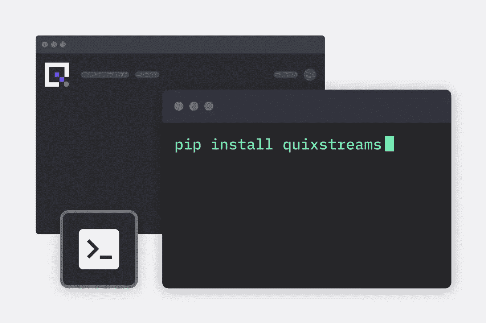

# 介绍 Quix Streams：一个开源的 Python Kafka 库

> 原文：[`towardsdatascience.com/introducing-quix-streams-an-open-source-python-library-for-kafka-9ab694c683c4?source=collection_archive---------18-----------------------#2023-03-06`](https://towardsdatascience.com/introducing-quix-streams-an-open-source-python-library-for-kafka-9ab694c683c4?source=collection_archive---------18-----------------------#2023-03-06)

## 轻松生成和消费类似 Pandas 接口的时间序列数据流

[](https://medium.com/@tomasatquix?source=post_page-----9ab694c683c4--------------------------------)[](https://towardsdatascience.com/?source=post_page-----9ab694c683c4--------------------------------) [Tomáš Neubauer](https://medium.com/@tomasatquix?source=post_page-----9ab694c683c4--------------------------------)

·

[关注](https://medium.com/m/signin?actionUrl=https%3A%2F%2Fmedium.com%2F_%2Fsubscribe%2Fuser%2Fd620afda25db&operation=register&redirect=https%3A%2F%2Ftowardsdatascience.com%2Fintroducing-quix-streams-an-open-source-python-library-for-kafka-9ab694c683c4&user=Tom%C3%A1%C5%A1+Neubauer&userId=d620afda25db&source=post_page-d620afda25db----9ab694c683c4---------------------post_header-----------) 发表在 [Towards Data Science](https://towardsdatascience.com/?source=post_page-----9ab694c683c4--------------------------------) · 7 分钟阅读 · 2023 年 3 月 6 日 [](https://medium.com/m/signin?actionUrl=https%3A%2F%2Fmedium.com%2F_%2Fvote%2Ftowards-data-science%2F9ab694c683c4&operation=register&redirect=https%3A%2F%2Ftowardsdatascience.com%2Fintroducing-quix-streams-an-open-source-python-library-for-kafka-9ab694c683c4&user=Tom%C3%A1%C5%A1+Neubauer&userId=d620afda25db&source=-----9ab694c683c4---------------------clap_footer-----------)

--

[](https://medium.com/m/signin?actionUrl=https%3A%2F%2Fmedium.com%2F_%2Fbookmark%2Fp%2F9ab694c683c4&operation=register&redirect=https%3A%2F%2Ftowardsdatascience.com%2Fintroducing-quix-streams-an-open-source-python-library-for-kafka-9ab694c683c4&source=-----9ab694c683c4---------------------bookmark_footer-----------)

作者提供的图片

你可能会好奇，为什么世界上还需要另一个用于 Kafka 的 Python 框架。毕竟，已有很多现有的库和框架可供选择，比如 [kafka-python](https://kafka-python.readthedocs.io/en/master/)、[Faust](https://faust.readthedocs.io/en/latest/)、[PySpark](https://spark.apache.org/docs/latest/api/python/) 等等。

然而，[Quix Streams](https://github.com/quixio/quix-streams) 的重点是时间序列和遥测数据，因此其功能被优化用于遥测相关的用例。这可能是设备遥测（最初是对 Formula 1 赛车的传感器数据进行道路测试）或其他类型的遥测数据，如指标、日志和跟踪。

它还旨在帮助你充分利用 Apache Kafka 的水平扩展能力。如果你需要处理大量的数据流（例如，每秒 60,000 个数据点），这尤其重要。

尽管如此，你不必在 Formula 1 遥测上进行实时机器学习才能发现 Quix Streams 的有用之处——我希望它的简洁性和性能能让你们变得更高效，我也很期待看到你们发现的其他用例。

# 你可以使用 Quix Streams 做些什么

为了帮助你了解如何使用这个库，这里列出了核心功能和简化的代码示例，演示了它们的工作原理：

## 使用 Pandas DataFrames 更高效地生成数据

时间序列参数会同时发出，因此它们共享一个时间戳。独立处理这些数据是浪费的。该库使用了一个表格系统，可以原生地与 Pandas DataFrames 配合使用。每一行都有一个时间戳和用户定义的标签作为索引。

+   要了解如何使用该库与 Pandas 从 CSV 中直接流式传输数据的完整可运行示例，请参阅 [这个 gist](https://gist.github.com/merlin-quix/e42594da530432cbd050bd83db97c857)。

## 生成时间序列数据时无需担心序列化或反序列化

Quix Streams 使用不同的编解码器和优化来序列化和反序列化时间序列数据，以最小化负载，从而提高吞吐量并减少延迟。

+   以下示例演示了如何使用 `add_value` 方法将数据追加到流中：

## 利用内置缓冲区来优化时间序列数据窗口的处理操作

如果你以高频率发送数据，每条消息的处理成本可能很高。该库提供了内置的时间序列缓冲区用于生成和消费，允许在延迟和成本之间进行多种配置。

+   例如，你可以配置库，在收集到 100 个时间戳数据项或经过一定数量的毫秒后（使用数据中的时间戳，而不是消费者机器的时钟）从缓冲区释放一个数据包。

```py
buffer.packet_size = 100
buffer.time_span_in_milliseconds = 100
```

+   然后你可以从缓冲区读取数据并使用 `on_read` 函数进行处理。

## 生产和消费不同类型的混合数据

该库允许你在同一时间戳下生成和消费不同类型的混合数据，如数字、字符串或二进制数据。

+   例如，你可以同时生成时间序列数据和大型二进制数据块。

+   通常，你会想将时间序列数据与二进制数据结合。在以下示例中，我们将公交车的车载摄像头与其 ECU 单元的遥测数据结合，以便在上下文中分析车载摄像头画面。

+   你还可以生成包含负载的事件：

+   例如，你可能需要监听时间序列或二进制流中的变化，并生成事件（如“超速”）。这些可能需要某种文件随事件消息一起发送（例如交易发票或带有照片证据的超速罚单）。这是一个关于测速摄像头的示例：

## 使用流上下文进行水平扩展

流上下文允许你将来自一个数据源的数据与补充元数据捆绑在同一范围内——这使工作负载可以通过多个副本进行水平扩展。

+   在以下示例中，`create_stream` 函数用于创建一个名为 **bus-123AAAV** 的流，该流分配给特定消费者，并将按正确顺序接收消息：

## 利用内置的状态处理以增强鲁棒性

该库包括一个易于使用的状态存储，结合了 blob 存储和 Kubernetes 持久卷，确保快速恢复任何故障或中断。

要使用它，你可以创建 `LocalFileStorage` 的实例或使用我们的帮助类之一来管理状态，如 `InMemoryStorage`。

这是一个对数据中选定列进行状态操作求和的示例：

## 其他性能和可用性增强

该库还包括许多其他增强功能，旨在简化与 Kafka 交互时配置和性能的管理过程：

+   **无需模式注册表**：该库不需要模式注册表来发送不同类型或参数的集合，这由协议内部处理。这意味着你可以在每个主题中发送多个模式。

+   **消息拆分**：Quix Streams 自动处理生产者端的大消息，必要时将其拆分。你不再需要担心 Kafka 消息限制。在消费者端，这些消息会自动合并。

+   **消息代理配置**：使用 Kafka 的最佳配置需要许多设置，而理想的配置需要时间。该库默认处理 Kafka 配置，但也支持自定义配置。

+   **检查点**：该库支持在从 Kafka 主题消费数据时进行手动或自动检查点。这使你能够通知消息代理你已经处理了某一点之前的消息（并且在未计划的重启情况下不会重复处理相同的消息）。

+   **水平扩展**：Quix Streams 使用流上下文功能处理水平扩展。你可以从一个副本扩展到多个副本，再缩减回一个副本，库确保数据负载始终在你的副本之间可靠地共享。

有关功能的详细概述，请参见[库文档](https://quix.io/docs/sdk-intro.html)。

# 入门

要快速尝试 Quix Streams，您只需安装库并设置本地 Kafka 实例。

## 安装 Quix Streams

使用以下命令安装 Quix Streams：

```py
python3 -m pip install quixstreams
```

+   要在配备 M1 或 M2 芯片的 Mac 上安装 Quix Streams，请参见此特殊安装指南：[在 M1/M2 Mac 上安装 Quix Streams](https://github.com/quixio/quix-streams/blob/main/mac-m1-m2-install.md)。

## 在本地安装 Kafka

该库需要利用消息代理来发送和接收数据。要在本地安装和测试 Kafka：

+   从[Apache Kafka 下载](https://kafka.apache.org/downloads)页面下载 Apache Kafka 二进制文件。

+   将文件内容提取到方便的位置（即`kafka_dir`），然后使用以下命令启动 Kafka 服务：

**Linux / macOS**

```py
<kafka_dir>/bin/zookeeper-server-start.sh config/zookeeper.properties 
<kafka_dir>/bin/zookeeper-server-start.sh config/server.properties
```

**Windows**

```py
<kafka_dir>\bin\windows\zookeeper-server-start.bat.\config\zookeeper.properties 
<kafka_dir>\bin\windows\kafka-server-start.bat .\config\server.properties
```

+   您可以在 Apache Kafka 的[官方文档](https://kafka.apache.org/quickstart)中找到更详细的说明。

+   您还可以在官方文档中找到 Quix Streams 的全面[快速入门指南](https://quix.io/docs/sdk/quickstart.html)。

以下示例将为您提供如何使用 Quix Streams 生产和消费数据的基本概念：

# 生产时间序列数据

这是一个如何使用 Python 将时间序列数据生产到 Kafka 主题的示例。

```py
import quixstreams as qx
import time
import datetime
import math

# Connect to your kafka client
client = qx.KafkaStreamingClient('127.0.0.1:9092')

# Open the output topic which is where data will be streamed out to
# If the topic does not exist, it will be created
topic_producer = client.get_topic_producer(topic_id_or_name = "mytesttopic")

# Set stream ID or leave parameters empty to get stream ID generated.
stream = topic_producer.create_stream()
stream.properties.name = "Hello World Python stream"

# Add metadata about time series data you are about to send. 
stream.timeseries.add_definition("ParameterA").set_range(-1.2, 1.2)
stream.timeseries.buffer.time_span_in_milliseconds = 100

print("Sending values for 30 seconds.")

for index in range(0, 3000):
    stream.timeseries \
        .buffer \
        .add_timestamp(datetime.datetime.utcnow()) \
        .add_value("ParameterA", math.sin(index / 200.0) + math.sin(index) / 5.0) \
        .publish()
    time.sleep(0.01)

print("Closing stream")
stream.close()
```

# 消费时间序列数据

这是一个如何使用 Python 从 Kafka 主题消费时间序列数据的示例：

```py
import quixstreams as qx
import pandas as pd

# Connect to your kafka client
client = qx.KafkaStreamingClient('127.0.0.1:9092')

# get the topic consumer for a specific consumer group
topic_consumer = client.get_topic_consumer(topic_id_or_name = "mytesttopic",
                                           consumer_group = "empty-destination")

def on_dataframe_received_handler(stream_consumer: qx.StreamConsumer, df: pd.DataFrame):
    # do something with the data here
    print(df)

def on_stream_received_handler(stream_consumer: qx.StreamConsumer):
    # subscribe to new DataFrames being received
    # if you aren't familiar with DataFrames there are other callbacks available
    # refer to the docs here: https://docs.quix.io/sdk/subscribe.html
    stream_consumer.timeseries.on_dataframe_received = on_dataframe_received_handler

# subscribe to new streams being received
topic_consumer.on_stream_received = on_stream_received_handler
print("Listening to streams. Press CTRL-C to exit.")
# Handle termination signals and provide a graceful exit
qx.App.run()
```

有关如何[消费](https://www.quix.io/docs/sdk/subscribe.html)和[生产](https://www.quix.io/docs/sdk/publish.html)时间序列和事件数据的完整文档，请[查看文档](https://www.quix.io/docs/sdk/introduction.html)。

# 下一步

这是 Quix Streams 的首次迭代，下一版本已经在开发中。

主要亮点是一个名为“**流数据帧**”的新特性，它简化了来自批处理环境的用户的有状态流处理。它消除了用户在内存中管理状态、更新滚动窗口、处理检查点和状态持久化以及在服务意外重启后管理状态恢复的需要。

通过引入熟悉的 Pandas DataFrames 接口，我和我的同事希望让流处理对新接触流数据的数据专业人士更具可及性。

以下示例展示了如何在流数据帧上执行滚动窗口计算：

请注意，这正是您在 Jupyter notebook 上对静态数据执行相同计算的方式——因此，对于习惯于批处理的人来说，学习起来会很容易。

你无需为流数据的有状态处理的复杂性而苦恼——这一切都会由库来管理。此外，虽然它仍然会像 Pandas 一样，但底层将使用二进制表——这相比传统的 Pandas DataFrames 带来了显著的性能提升。

要了解下一个版本何时准备好，请确保关注[Quix Streams GitHub 仓库](https://github.com/quixio/quix-streams)。

路线图也应由更广泛的数据社区的反馈和贡献来塑造：

+   如果你发现了 bug 或想要请求改进，请随时[报告 GitHub 问题](https://github.com/quixio/quix-streams/issues)。

+   如果你有问题、需要帮助，或只是想了解更多关于这个库的信息，可以尝试在 Slack 社区“[The Stream](https://quix.io/slack-invite)”（我帮忙进行管理）中发布消息，或查看[文档](https://quix.io/docs/)。

+   如果你想改进这个库，请查看[贡献指南](https://github.com/quixio/quix-streams/blob/main/CONTRIBUTING.md)。
