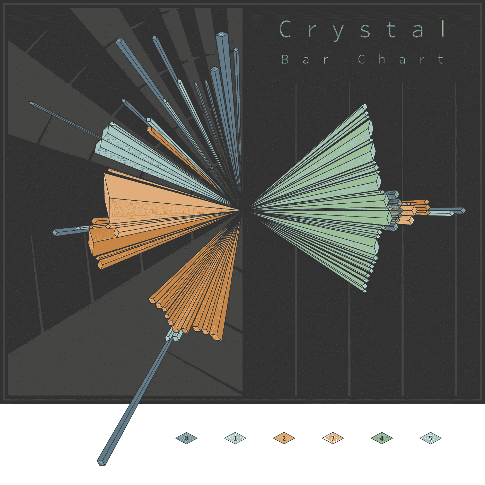

# 介绍水晶条形图：可视化序列差异聚类

> 原文：[`towardsdatascience.com/introducing-the-crystal-bar-chart-visualizing-sequential-differential-clustering-21faa4a3fed1?source=collection_archive---------2-----------------------#2023-12-29`](https://towardsdatascience.com/introducing-the-crystal-bar-chart-visualizing-sequential-differential-clustering-21faa4a3fed1?source=collection_archive---------2-----------------------#2023-12-29)

## 了解水晶条形图并用 Python 创建自己的图表

 [Nick Gerend](https://medium.com/@nickgerend?source=post_page-----21faa4a3fed1--------------------------------)

·

[关注](https://medium.com/m/signin?actionUrl=https%3A%2F%2Fmedium.com%2F_%2Fsubscribe%2Fuser%2Ffa23f7cc3eed&operation=register&redirect=https%3A%2F%2Ftowardsdatascience.com%2Fintroducing-the-crystal-bar-chart-visualizing-sequential-differential-clustering-21faa4a3fed1&user=Nick+Gerend&userId=fa23f7cc3eed&source=post_page-fa23f7cc3eed----21faa4a3fed1---------------------post_header-----------) 发表在 [Towards Data Science](https://towardsdatascience.com/?source=post_page-----21faa4a3fed1--------------------------------) ·12 分钟阅读·2023 年 12 月 29 日

--

水晶条形图 由 Nick Gerend

# 介绍

有许多方法可以更好地理解一系列数据。无论是温度数据、考试成绩、食品价格、步数还是 UFO 目击情况，通过数据分析和可视化的视角，总能学到关于数据本质的东西。

接下来，我将描述一种新的技术，用于可视化一系列数据，该技术使用简单的基于阈值的聚类。我希望你能将其视为与传统可视化方法（如直方图和箱线图）配对的全新方法，以便从中获取对感兴趣特征的新视角。

# 顺序差异聚类

## 数值上

如何使自己与众不同？假设单一数值属性的标准是一个简单的阈值，通过它对有序值进行比较，并将其分成不同的组。以以下序列为例：

[ 0 , 1 , 1 , 2 , 3 , 5 , 8 , 13 , 21 , 34 , 55 , 89 , 144 ]
