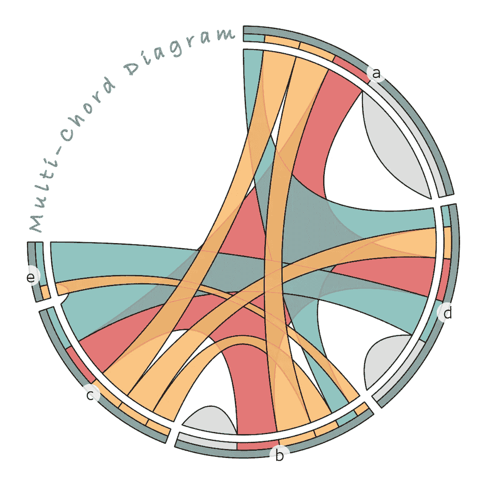
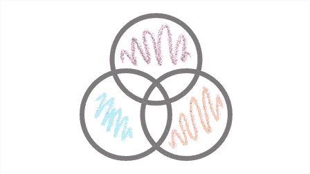
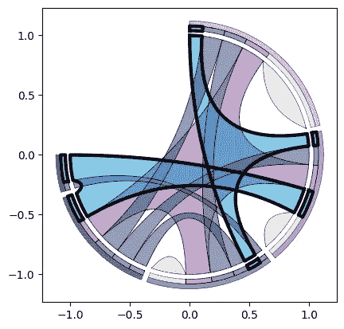
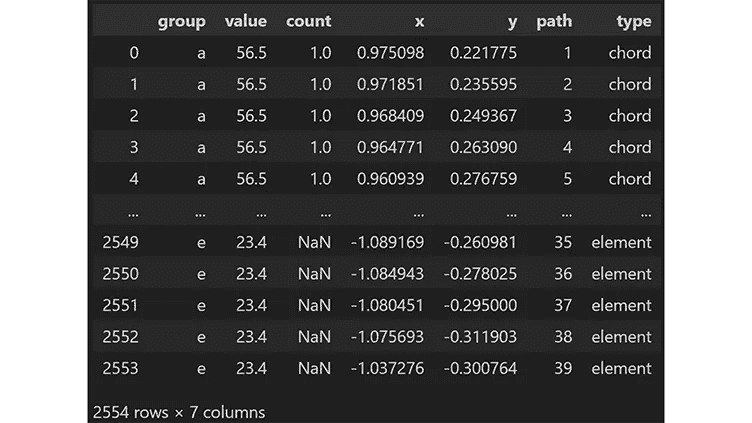
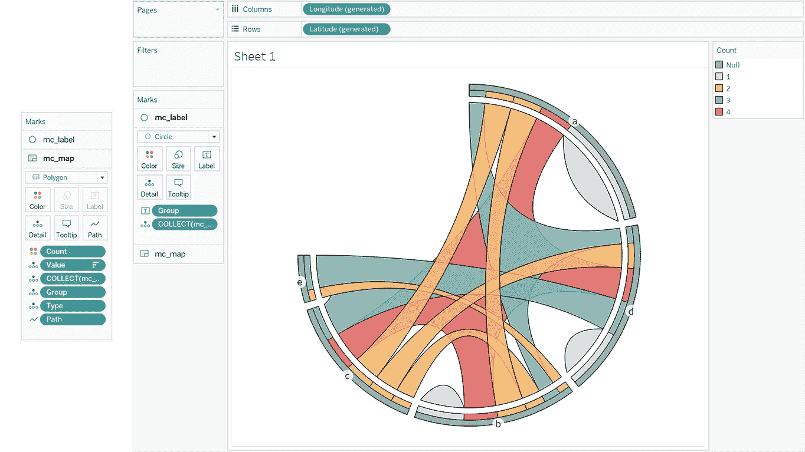
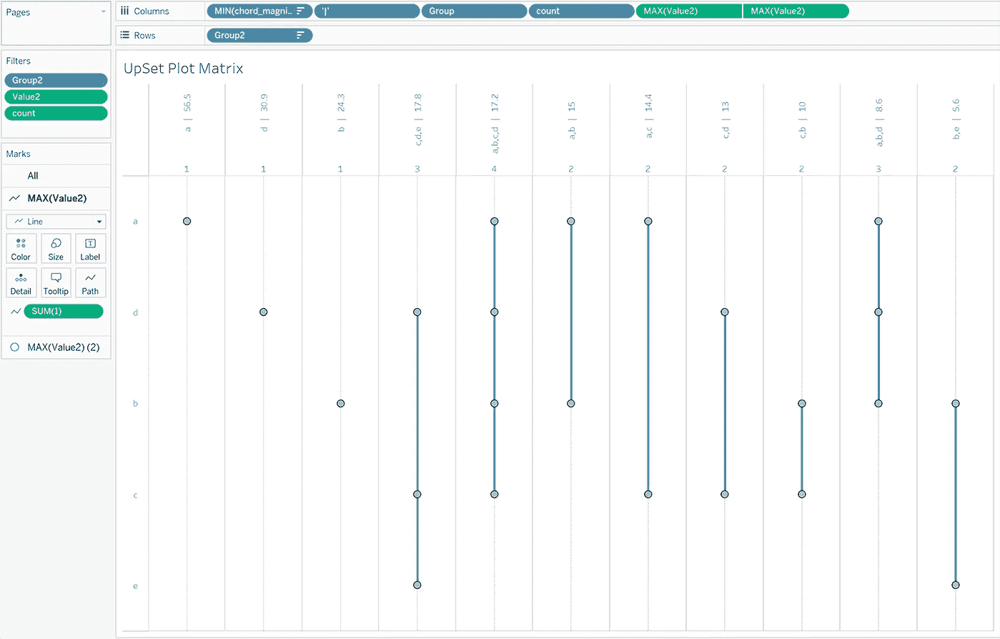
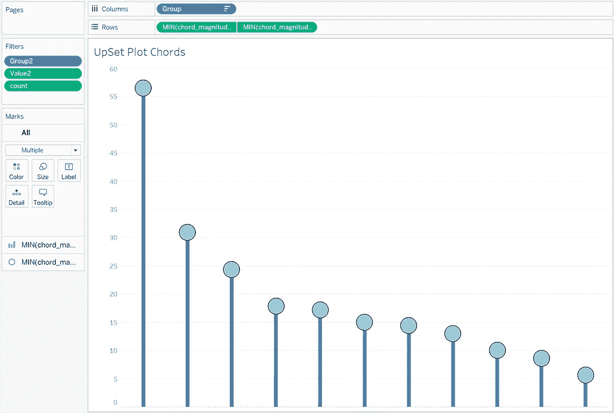
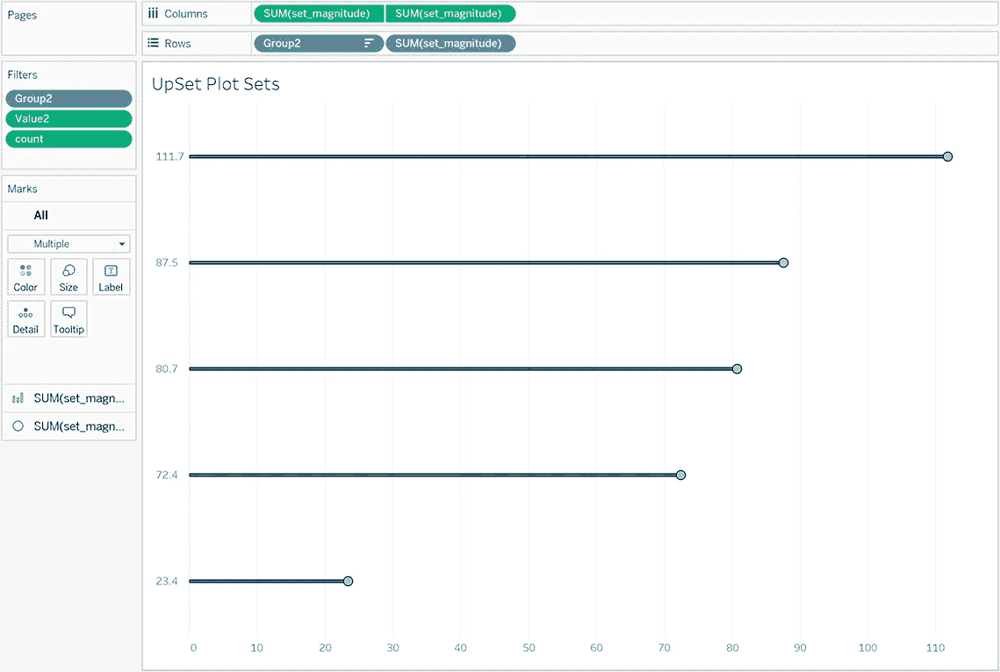
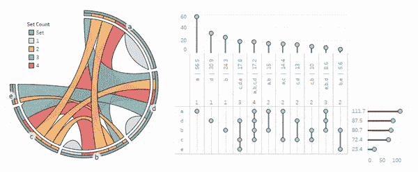

# 介绍多弦图：可视化复杂集合关系

> 原文：[`towardsdatascience.com/introducing-the-multi-chord-diagram-visualizing-complex-set-relationships-c6fe6cc1cb8b`](https://towardsdatascience.com/introducing-the-multi-chord-diagram-visualizing-complex-set-relationships-c6fe6cc1cb8b)

## 了解多弦图，并使用 Python 创建你自己的图表

[](https://medium.com/@nickgerend?source=post_page-----c6fe6cc1cb8b--------------------------------)[](https://towardsdatascience.com/?source=post_page-----c6fe6cc1cb8b--------------------------------) [Nick Gerend](https://medium.com/@nickgerend?source=post_page-----c6fe6cc1cb8b--------------------------------)

·发布于[Towards Data Science](https://towardsdatascience.com/?source=post_page-----c6fe6cc1cb8b--------------------------------) ·阅读时间 13 分钟·2023 年 11 月 17 日

--



Nick Gerend 的多弦图

# **背景**

## **前身**

在数据可视化的领域中，表示复杂集合关系的发展经历了重要的里程碑，尤其是简单而有效的韦恩图、现代弦图和 UpSet 图的创建。

## 韦恩图

韦恩图由约翰·韦恩于 1880 年代提出¹，是集合论和逻辑学中的基础工具，以其简单性和有效性而著称，能够直观地表示不同集合之间的关系。韦恩图由重叠的圆圈组成，每个圆圈通常代表一个集合，圆圈之间的重叠部分表示这些集合共有的元素。



韦恩图

它们在教育、商业分析和逻辑推理中特别有用，因为它们提供了一种清晰直观的方式来展示集合的交集、差异和并集。它们将复杂关系简化为易于理解的视觉效果，使其成为解决问题、数据分析和决策过程中的宝贵工具。

## 弦图

现代弦图在近期历史上尤为引人注目，尤其是在 2007 年《纽约时报》刊登的一篇文章中提到马丁·克日文斯基²（“Circos”³可视化工具的主要贡献者）的工作。如今，弦图的特点是其圆形布局，带有弯曲的多边形弦连接圆周上的集合，每个弦展示两个集合之间或一个集合内的独立人群之间的关系。


弦图

这些图表特别有效地揭示了数据集中的隐藏模式和连接。关系的强度通常通过弦的厚度来表示，其他元素（如颜色和形状）可以用于显示方向性，使得弦图不仅视觉上引人注目，而且信息量极大。

## **UpSet Plot**

UpSet Plot 由 Lex、Gehlenborg 等人于 2014 年介绍，成为可视化复杂集合交集的解决方案，克服了弦图和维恩图的一些固有缺点，能够可视化两个以上交集的集合关系。


UpSet Plot

它结合了矩阵的简洁性和条形图的定量表示，直接展示复杂的集合信息，这些信息可能超出了弦图仅限于成对集合关系的范围。

**改进空间**

虽然这三种方法各自以独特的方式提供信息，但每种方法都有一些明显的缺点：

+   维恩图由于多个重叠区域变得混乱，缺乏有效表示复杂关系的要素。

+   弦图局限于成对的集合关系，这大大限制了它们的应用。

+   UpSet Plot 的矩阵布局在集合组合增加时不容易扩展，因此可能难以立即洞察集合复杂性的某些方面或“全貌”。

# **多弦图**

## 灵感

为了解决维恩图和弦图上述提到的挑战，我在 2021 年 6 月提出了一种算法，将弦图推广到适应三个或更多集合交互，并称之为“多弦图”（或简称 multichord）。作为开发的副产品，我还独立提出了 UpSet Plot，以测试这种新方法，后来才知道它已经是一个成熟的图表！


维恩图 > 弦图 > UpSet Plot > 多弦图

相对于其三种前身，这种新可视化提供了以下功能：

+   提供了一种准确而令人愉悦的视觉布局，相对于缺乏精确度的维恩图来说，适用于复杂的集合关系。

+   消除了弦图的成对限制，同时保持了在方向性、间距等方面的创造潜力。

+   通过提供对网络复杂性的即时视觉洞察，补充了 UpSet Plot 的离散信息，同时不会在矩阵和条形图编码中迷失（正如我之前提到的，它们也可以很好地配合使用！）

多弦图不仅拓宽了弦图的应用范围，还提供了对复杂网络的更细致理解，这是当今数据驱动世界中的重要需求。

## **数学、算法与布局**

从数学原理开始，以下是多弦图构建中的基本项：

+   笛卡尔极坐标转换（CPC）：首先在笛卡尔空间中计算位置，为了简化

```py
# Input coordinates are in Cartesian, but represent Polar ingredients
#   > 'r' is the Cartesian height offset in this case
#   > the angle is calculated as a percentage along
#     the straight line in Cartesian space relative to 2*pi
x = r * cos(angle)
y = r * sin(angle)

# For converting points, I created this helper function:

from math import cos, sin, pi

def polarize(x, max_x, y, y_offset = 0.):
    angle = (2.*pi)*(((x)%(max_x))/(max_x))
    angle_deg = angle * 180./pi
    angle_rotated = (abs(angle_deg-360.)+90.) % 360\. 
    angle_new = angle_rotated * pi/180.
    y += y_offset
    x_out = (y)*cos(angle_new)
    y_out = (y)*sin(angle_new)
    return x_out, y_out
```

+   弦函数（CF）：生成沿圆周两点之间路径的一组点，一些常见的实现包括：

    - 直线（原始的！）

    - 从圆圈中产生的弧，其中点是接触弦

    - Bezier 曲线（具有 3 个或更多点）

    - 自定义函数（我为初始 Python 实现创建了一个）

```py
# Here's a custom chord function I created for use in the Multi-Chord Diagram
# chord(x0, y0, x1, y1, x2, y2, points, h_override=0.)
#   > x0, y0: the circle's center
#   > x1, y1, x2, y2: two points on a circle
#   > points: number of desired points along the chord path
#   > h_override: height constraint on the chord's apex

from math import cos, sin, pi, sqrt, atan2

def LnToPntDst(x0, y0, x1, y1, x2, y2):
    n = abs((y1-y2)*x0+(x2-x1)*y0+x1*y2-x2*y1)
    d = sqrt((x2-x1)**2+(y2-y1)**2)
    return n/d

def DistBtwTwoPnts(x1, y1, x2, y2):
    return sqrt((x2-x1)**2+(y2-y1)**2)

def Rotate(x, y, angledeg, x_offset, y_offset):
    xa = x*cos(angledeg*pi/180) + y*sin(angledeg*pi/180)
    ya = -x*sin(angledeg*pi/180) + y*cos(angledeg*pi/180)
    xa -= x_offset
    ya -= y_offset
    return xa, ya

def AngleByTwoPnts(x1, y1, x2, y2):
    return atan2(x2-x1, y2-y1)*180/pi - 90

def chord(x0, y0, x1, y1, x2, y2, points, h_override=0.):
    h = LnToPntDst(x0, y0, x1, y1, x2, y2)
    w = DistBtwTwoPnts(x1, y1, x2, y2)

    if h_override == 0.:
        new_h = (1.-(h/w)/10.)*h
        if new_h < h*0.01:
            h = h*0.01
        else:
            h = new_h
    else:
        h = h*h_override

    a = AngleByTwoPnts(x1, y1, x2, y2)
    xr = []
    yr = []
    for i in range(points+1):
        arc_percent = i/(points/2.)
        if i > points/2.:
            arc_percent = (points-i)/(points/2.)
        if i == 0 or i == points:
            arc = 0.
        else:
            arc = sqrt((h/2.)**2-((h/2.)-(h/2.)/((points)/2.)*i)**2.)
        percent = arc/(h/2.)

        y_1 = -percent*arc+(1-percent)*arc_percent
        y_2 = percent*arc+(1-percent)*arc_percent
        xr_1, yr_1 = Rotate(i/points*w, y_1, a, -x1, -y1)
        xr_2, yr_2 = Rotate(i/points*w, y_2, a, -x1, -y1)

        d1 =  DistBtwTwoPnts(x0, y0, xr_1, yr_1)
        d2 =  DistBtwTwoPnts(x0, y0, xr_2, yr_2)

        if d1 < d2:
            xr.append(xr_1)
            yr.append(yr_1)
        else:
            xr.append(xr_2)
            yr.append(yr_2)
    return list(zip(xr, yr))
```

+   重缩放函数（RF）：为了方便将图形缩放到单位正方形

```py
# 'x_o' is the original value
# 'x_min' is the current minimum of the values range
# 'x_max' is the current maximum of the values range
# 'x_r' is the rescaled value based on a new range, 'new_min' and 'new_max'
x_r = (new_max - new_min) * ((x_o - x_min)/(x_max - x_min)) + new_min
```

这是多弦图算法：

1.  从集合组合及其大小（或从原始数据中计算）开始，例如：({a}, 25.5)，({a, b}, 15)，({a, c}, 14.4) 等

1.  定义布局顺序和缓冲偏移量，用于间隔集合和嵌套集合组合，并提供可选的整体径向百分比填充

1.  布局一个数字线，表示数据范围，并按照指定的顺序排列每个集合组合，用给定的偏移量分隔

1.  向前和向后传播数字线的范围

1.  通过从 3 条可用数字线中将最接近的弦端点分组来收集弦端点

1.  定义用于绘图的点数，并继续计算每个部分中的点位置，利用（CPC）将直线部分和弦端点映射到圆形布局上，并利用（CF）为圆内的弦点

1.  使用（CPC）添加外部集合组合和集合多边形，并使用（RF）将其重缩放到单位圆

这是一个使用我称之为多弧图的另一种可视化的笛卡尔布局：


多弧图展示了多弦图的笛卡尔布局

最简化的多弦图布局版本由以下组件构成：

+   表示独立集合人口或连接 2 个或更多集合的弦，根据存在的集合到集合关系组合的数量

+   一个中环，由集合内唯一集合组合分割成多个部分，表示“专属”集合组合大小

+   一个外环，被集合分割成多个部分，每个部分包含“包含”集合组合（表示集合大小，减去来自中间环的缓冲间距）


多弦图

## Python 实现

我已通过我的 [dataoutsider](https://pypi.org/project/dataoutsider/) 包在 PyPI 上提供了该算法的初步 Python 实现。以下是使用示例：

```py
from dataoutsider import multi_chord as mc
import pandas as pd

data = [['a', 56.5], ['a,b', 15], ['a,c', 14.4], 
        ['a,b,d', 8.6], ['c,d', 13], ['d', 30.9], 
        ['c,b', 10], ['b', 24.3], ['a,b,c,d', 17.2],
        ['b,e',5.6], ['c,d,e',17.8]]
df = pd.DataFrame(data, columns = ['group', 'value'])
df_mc = mc.multi_chord_on_groups_alias(df, percent=75)
mc.multi_chord_plot(df_mc, level = 3, transparency = 0.5)
```



通过 Matplotlib 的 dataoutsider 包中的多弦图

这是基础输出（df_mc）：



来自 multi_chord_on_groups_alias 函数的输出

在下一节中，我将演示如何使用此输出创建一个互动可视化，以适应商业智能领域的专业人士。

## **Tableau Public 实现（包括 UpSet 图）**

在本节中，我将提供一个在 Tableau Public (v 2023.3.0) 中实现我的多弦图的教程，并与不同组件进行交互。

首先导出多弦图数据（在上一节中创建），包括用于构建 UpSet 图的数据。我将 UpSet 图的数据方法称为***multi_chord_venn***，以致敬维恩图，并且因为当时我不知道 UpSet 图已经存在。

```py
import os
df_mc.to_csv(os.path.dirname(__file__) + 
    '/multichord_diagram.csv', encoding='utf-8', index=False)
df_upset = mc.multi_chord_venn(df_mc).drop_duplicates()
df_upset.to_csv(os.path.dirname(__file__) + 
    '/upset_plot.csv', encoding='utf-8', index=False)
```

首先从***multichord_diagram.csv***开始。使用***文本文件***选项将文件导入 Tableau，导航到***Sheet 1***，并创建这些计算列：

> ***[mc_map]***：MAKEPOINT([Y], [X])
> 
> ***[mid_path]***：int({fixed [Group]: avg(if [Type] = ‘element’ then [Path] else null end)} * 3/2)
> 
> ***[mc_label]***：if [Type] = ‘element’ and [Path] = [mid_path] then MAKEPOINT([Y], [X]) else null end

首先将***[mc_map]***拖到***标记***下的***详细信息***中，以生成第一个地图图层，并通过右键点击地图区域并选择***背景图层***来调整这些选项：

+   取消选择所有***背景地图图层***（基础图层、土地覆盖等）

+   现在右键点击地图区域并选择***地图选项***，然后在面板中取消所有选项

关闭***背景图层***并继续以下步骤：

+   将***[Group]***、***[Type]***和***[Value]***拖到***标记***下的***详细信息***中

+   将***[Count]***拖到***标记***下的***详细信息***中

+   右键点击现在的***SUM(Value)*** 并选择***维度***，再次右键点击并选择***离散***

+   对***SUM(Count)***重复该过程

+   再次右键点击***Value***并选择***排序***，然后选择***降序***，并将***Value***拖到***标记***中的药丸顶部

+   在***标记***下拉菜单中选择***多边形***（如果此时看起来很奇怪，不用担心）

+   将***[Path]***拖到***标记***下的***路径***中，并重复将其转换为***维度***的过程

+   在***颜色***下选择黑色边框颜色，将透明度调整为 80%，并选择***编辑颜色***以根据需要编辑颜色选项

现在应该可以看到多弦图的结构。让我们添加一些标签：

+   将***[mc_label]***拖入地图区域，会出现一个弹出窗口：***添加标记图层*** - 将药丸拖入此处以创建一个新的地图图层

+   将[Group]拖到此新地图图层中的***标签***下

+   在***标记***下拉菜单中选择***圆形***，点击***标签***，并选择这些选项：{对齐：水平居中，垂直居中}

+   在菜单仍然打开的情况下，点击***文本*** - 高亮文本框中的文本，将字体大小更改为 12，并点击***确定***

+   点击***Color***，选择白色并将透明度更改为 80%

+   最后，点击***Size***并将大小调整到第二个哈希

你会看到右下角有一个空值警告，你可以右键点击并选择***Hide Indicator***。此时你应该看到类似于这样的内容（包括你选择的颜色）：



你会注意到集合按其大小顺时针递减排序，而弦按顺时针递增排序（算法的默认设置）。绘图顺序可以根据需要调整，就像我们之前对***Value***所做的那样。

现在让我们创建 UpSet 图。首先导入***upset_plot.csv***文件，选择***Data***选项卡并点击***New Data Source***。选择文本文件并导入数据。创建一个新工作表，点击底部面板上的第一个加号，并确保在右上角的***Data***下选择了新数据源。

现在添加这些计算列：

> ***[count]***：{fixed [Group]: sum(if [Group2] = ‘count’ then [Value2] else null end)}
> 
> ***[chord_magnitude]***：if not isnull([count]) then [Value] else null end
> 
> ***[set_magnitude]***：{fixed [Group2]: max(if [Group] = [Group2] then [Value] else null end)}

接着将***[Group2]***拖到***Filter***中，仅选择集合（a, b, c, d, e）。将***[Value2]***添加到过滤器中，并仅过滤值为 1。最后，将***[count]***添加到过滤器中，并在右下角取消勾选***Include Nulls Values***

继续按照这些步骤设置矩阵视图：

+   将***[chord_magnitude]***拖动到***Columns***，在其下拉菜单中选择***Minimum***作为其***Measure***，并选择***Discrete***

+   在这个标签旁双击以添加一个新标签并输入：‘|’

+   按 Enter 键将文本提交为新标签，并将***[Group]***拖动到其旁边，然后是***[count]***

+   将***[Group2]***拖动到***Rows***，从下拉菜单中选择***Sort***，并按以下条件排序：{Nested, Descending, set_magnitude, Maximum}

+   为***[chord_magnitude]***添加排序：{Nested, Descending, chord_magnitude, Minimum}

+   将***[Value2]***拖动到***Rows***的最后位置，并将***Measure***设置为***Maximum***

+   在***Marks***下拉菜单中，选择***Circle***

请注意，我发现当前版本在双轴模式下有一些错误，因此排序可能需要根据需要进行调整。现在我们进行一些格式化：

+   右键点击底部轴，选择***Edit Axis***，并将设置更改为：{Custom, Fixed start: 1, Fixed end: 1}

+   关闭，再次右键点击并取消勾选***Show Header***

+   在视图顶部，右键点击所有离散的***Columns***标题（视图标题中的任何位置），除了***[count]***，选择***Rotate Label***（你也可以调整每个标题容器的大小，以更好地适应标签）

+   通过右键点击外部标题并选择***Hide Field Labels for Columns/Rows***来隐藏外部标题

现在我们将创建一个双轴图，以便在点之间绘制一些线条：

+   将***[Value2]***（再次）拖到***Columns***中的最后一个位置，并设置为***Maximum***，如之前所述

+   从下拉菜单中选择***Dual Axis***，右键点击新轴，选择***Synchronize Axis***，然后通过取消选中每个轴上的***Show Header***来隐藏这两个轴

+   在新视图中，从***Marks***下拉菜单中选择***Line***，双击***Marks***内以创建一个新的药丸，并输入：1

+   按回车键，将这个药丸拖到***Path***

这是一个完成的视图，顶部的视图下拉选项设置为***Entire View***：



现在让我们为弦（特定于种群）和集合（包括种群）创建类似的视图。

这是弦图视图：



这是集合视图：



现在将它们添加到仪表板中，并在仪表板顶部菜单中的***Actions***下设置一个操作。点击***Add Action***下拉菜单并选择***Highlight***。在***Targeted Highlighting***下选择***Selected Fields***，并选择***[Group]***和***[Group2]***字段。最后，在右侧的***Run action on***菜单下选择***Hover***选项，现在整个仪表板将在悬停于集合和弦上时高亮显示！



多弦图和 Tableau Public 中的 UpSet 图交互

# **结论**

在本文中，我简要介绍了应用于集合之间关系的可视化历史以及我称之为“多弦图”的内容，这是一种我开发的可视化工具，用于增强一些现有方法，以便快速洞察具有复杂集合关系的数据。近年来，我有很多机会利用这一工具进行个人项目和各种业务应用，希望它能为其他人提供一些新的功能！

我相信数据可视化可以帮助解决探索性数据分析、建模和讲故事中的挑战，并且这是艺术与科学的真正交汇点，可以让所有人享受。

如果你遇到任何有趣或专业的用例，请告诉我，谢谢阅读！

**参考文献**

[1] John Venn, “[关于命题和推理的图示和机械表示](https://www.cis.upenn.edu/~bhusnur4/cit592_fall2014/venn%20diagrams.pdf)” (1880), 哲学杂志与科学期刊

[2] David Constantine, “[基因组的特写：物种逐个分析](https://archive.nytimes.com/www.nytimes.com/imagepages/2007/01/22/science/20070123_SCI_ILLO.html)” (2007), 纽约时报

[3] Martin Krzywinski, 等，[“Circos：比较基因组学的信息美学](https://genome.cshlp.org/content/early/2009/06/15/gr.092759.109.abstract)” (2009), 基因组研究

[4] Lex A, Gehlenborg N, Strobelt H, Vuillemot R, Pfister H. “[UpSet: 交集集的可视化](https://www.ncbi.nlm.nih.gov/pmc/articles/PMC4720993/)” (2014), IEEE 计算机图形学与可视化汇刊
