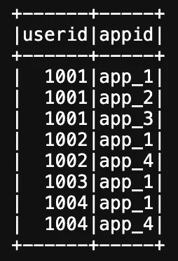
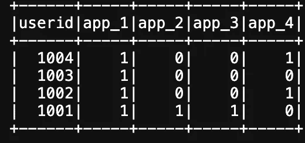
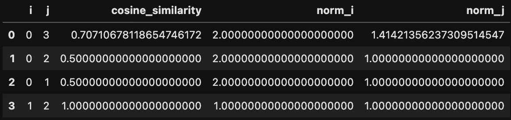
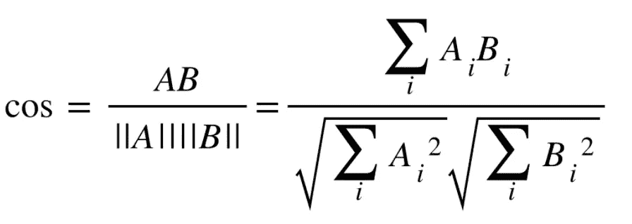
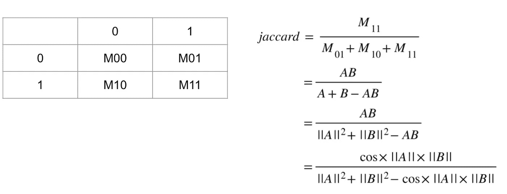
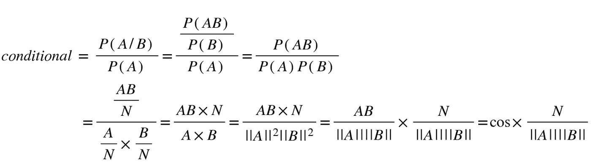
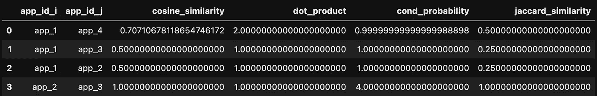

# 四种项目相似性度量的介绍

> 原文：[`towardsdatascience.com/introduction-of-four-types-of-item-similarity-measures-e0aea70da335`](https://towardsdatascience.com/introduction-of-four-types-of-item-similarity-measures-e0aea70da335)

## 数据挖掘

## 介绍如何选择项目嵌入可用时的相似性度量

 [Jiahui Wang](https://medium.com/@jhwang1992m?source=post_page-----e0aea70da335--------------------------------)

·发布于 [Towards Data Science](https://towardsdatascience.com/?source=post_page-----e0aea70da335--------------------------------) ·阅读时间 5 分钟·2023 年 2 月 17 日

--

图片由 [James Yarema](https://unsplash.com/@jamesyarema?utm_source=medium&utm_medium=referral) 提供，来源于 [Unsplash](https://unsplash.com/?utm_source=medium&utm_medium=referral)

推荐算法在我们日常生活中无处不在，从我们 Youtube 首页上出现的视频顺序，到沃尔玛商品货架的排列。这些算法学习用户的潜在偏好，并向用户推荐最相关的项目。为实现这一点，我们需要用数值向量来描述用户和项目，以便算法能够测量用户相似性和项目相似性，从而进行进一步的推荐。

学习用户和项目的数值向量表示有两种常见的方法：[基于内容的过滤和协同过滤](https://developers.google.com/machine-learning/recommendation/overview/candidate-generation)。在基于内容的过滤中，通过根据项目的专家知识手动构建特征来学习项目的向量表示。以移动应用为例，每个在 Google Play 上的应用都有一个应用名称、一个类别和开发者提供的一些文本描述。然后可以应用专家知识从这些信息中提取特征，以构建应用的向量表示。基于内容的过滤的优势在于它不依赖于现有的用户-项目数据。相反，协同过滤不需要对项目的专家知识，完全依赖现有的用户-项目数据。当涉及到协同过滤时，数据本身会说话。只要我们拥有足够的用户-项目数据，就可以通过矩阵分解来提取用户和项目的表示。

在获得项目的数值向量表示后，下一任务是测量项目之间的相似度以进行推荐。在这篇文章中，我们将关注各种相似度度量，并讨论如何选择合适的相似度度量。同时，将提供 Spark 代码示例，因推荐算法通常应用于大数据。

言归正传，让我们开始吧！

# 1\. 示例数据介绍

在这篇文章中，我们将通过分析大量用户的已安装应用列表来研究应用相似度。假设我们有 m 个用户，总共安装了 n 个应用，那么我们可以构建一个 m×n 的用户-项目矩阵。与协同过滤方法不同，协同过滤方法将学习用户和项目的低维表示，以进行实时推荐任务的快速计算，但在这个示例中，我们将直接使用每个应用的 m 维表示。协同过滤学习用户和项目的低维表示，以进行实时推荐任务的快速计算，但这里我们专注于演示如何在获得数值向量表示后计算相似度。因此，我们简化了获取项目向量的过程。

此外，为了演示目的，我们将仅使用一个包含 4 个用户和 4 个应用的虚拟示例，该示例可以通过以下代码生成：

生成已安装应用列表示例的代码

已安装应用列表示例

数据帧随后被转换为每个用户的安装列表行：

将已安装应用列表转换为 userid 作为键的代码

转换后的已安装应用列表结果

# 2\. 各种相似度度量

各种相似度度量的计算依赖于两个常见的统计结果：应用对的余弦相似度和应用向量的欧几里得量级，这些可以计算如下：

生成应用对的余弦相似度和欧几里得量级的代码

应用对的余弦相似度和欧几里得量级结果

## 2.1 余弦相似度

余弦相似度衡量两个向量之间的角度。可以通过调用 Spark 的原生函数轻松计算。

余弦相似度公式

## 2.2 点积

点积是余弦相似度乘以两个向量的欧几里得范数。它可以理解为一个向量在另一个向量上的投影。一个向量的欧几里得范数衡量了该应用在用户中的受欢迎程度。当更多用户安装一个应用时，该应用的欧几里得范数将变大。因此，与余弦相似度不同，点积受两个应用的受欢迎程度的影响。一个受欢迎的应用和一个不受欢迎的应用的点积会很小，就像我们想象短向量在长向量上的投影，投影长度不会很长。因此，在余弦相似度的基础上，点积考虑了两个应用的受欢迎程度。

生成点积的代码

## 2.3 Jaccard 相似度

Jaccard 相似度是用户集合的交集除以安装两个应用的用户集合的并集。用户集合的交集衡量了两个应用的相似度，而用户集合的并集衡量了两个应用的多样性。从这个意义上讲，我们可以将 Jaccard 相似度视为一个以两个应用的多样性为标准化的度量。

Jaccard 相似度的说明

通过使用两个向量的欧几里得范数和计算出的点积，可以轻松计算 Jaccard 相似度：

生成 Jaccard 相似度的代码

## 2.4 条件概率提升

条件概率提升衡量了应用 B 的安装在多大程度上有助于应用 A 的安装。

条件概率提升的方程

通过使用两个向量的欧几里得范数，可以轻松计算条件概率。

计算条件概率提升的代码

映射回 app_id 后，可以得到最终结果。

合并四个相似度结果的代码

合并的相似度结果

# 总结

在这篇文章中，我们介绍了嵌入中的四种相似度度量，即余弦相似度、点积、Jaccard 相似度和条件概率提升。根据嵌入相似度的定义，我们可以选择使用最合适的度量。
