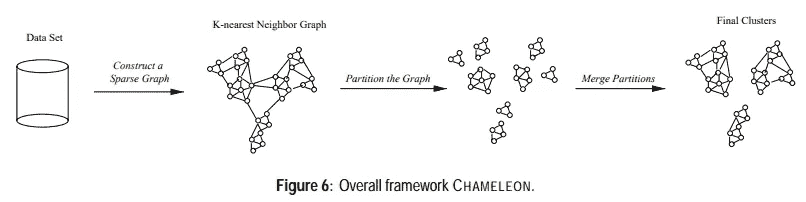

# 聚类算法简介

> 原文：[`towardsdatascience.com/introduction-to-clustering-algorithms-76da35b5670a`](https://towardsdatascience.com/introduction-to-clustering-algorithms-76da35b5670a)

## 一份关于 10 种常用于层次、划分和基于密度的聚类算法的全面指南

 [Kevin Babitz](https://kevindbabitz.medium.com/?source=post_page-----76da35b5670a--------------------------------)

·发表于[Towards Data Science](https://towardsdatascience.com/?source=post_page-----76da35b5670a--------------------------------) ·阅读时长 9 分钟·2023 年 11 月 12 日

--

由[Rod Long](https://unsplash.com/@rodlong?utm_content=creditCopyText&utm_medium=referral&utm_source=unsplash)拍摄的照片，来自[Unsplash](https://unsplash.com/photos/penguin-walking-on-gray-sand-during-daytime-BSz0jJ172vM?utm_content=creditCopyText&utm_medium=referral&utm_source=unsplash)

# 介绍

聚类算法在数据分析中扮演着重要角色。这些无监督学习、探索性数据分析工具通过将数据点根据共享特征分类到不同的组中，为知识发现提供了系统。这使得在原始数据中可能难以看清的关系和趋势得以识别。它们通过系统性地为复杂和精细的数据集增添理解，促进了更为明智的决策。

在本文中，我们将介绍三种类型的聚类算法的基础知识：层次聚类、划分聚类和基于密度的聚类模型。我们将从定义这些类别开始。接下来，我们将深入探讨 10 种不同的聚类算法，提供定义、原始或有趣的研究论文链接、算法的优缺点以及每种算法的 python 代码片段。

## **目录**

层次聚类算法

+   Birch

+   Cure

+   ROCK

+   Chameleon

划分聚类算法

+   K-Means

+   K-Medoids (PAM)

+   CLARANS

+   ISODATA

基于密度的聚类算法

+   DBSCAN

+   DENCLUE

# 层次聚类算法

**定义：** 层次聚类是一种聚类分析方法，建立一个簇的层次结构。它可以被可视化为一个树状结构（树状图），其中叶子表示单个数据点，根表示包含所有数据点的单一簇。

**使用案例：**

+   分类问题。

+   当垂直关系在数据中很重要时。

**优点：**

+   提供了一个簇的层次结构。

+   无需事先指定簇的数量。

**弱点：**

+   易受噪声和离群点的影响。

+   对大型数据集计算密集。

## Birch

**总结：**

Birch 算法，全称“Balanced Iterative Reducing and Clustering using Hierarchies”，是一种设计用于扩展性和效率的层次聚类算法，特别适合大型数据集。它使用两步过程来构建簇：

1.  构建一个基于特征的树，称为聚类特征（CF）树，用于总结数据集的分布。这个 CF 树允许高效的内存使用和增量更新。

1.  基于 CF 树的叶子节点应用聚类机制，形成紧密的簇。

**原始论文 / 有用的研究：**

 [## BIRCH：一种高效的数据聚类方法，适用于非常大的数据库：ACM SIGMOD Record: Vol 25, No…

### 在大型数据集中寻找有用的模式最近引起了相当大的兴趣，其中最广泛的…

dl.acm.org](https://dl.acm.org/doi/10.1145/235968.233324?source=post_page-----76da35b5670a--------------------------------)

**优点：**

Birch 以其处理大量数据的能力和对离群点的韧性而闻名。

**Python 代码：**

使用[sklearn](https://scikit-learn.org/stable/modules/generated/sklearn.cluster.Birch.html)的 Birch 算法

## Cure

**总结：**

CURE（Clustering Using Representatives）算法是一种[聚合层次聚类](https://en.wikipedia.org/wiki/Hierarchical_clustering#Agglomerative_clustering_example)方法，旨在解决传统基于中心点的算法如 K-Means 的局限性，尤其是在处理非球形和任意形状的簇时。CURE 采用独特的方法，通过用固定数量的点（称为代表点）来表示簇，这些代表点是从每个簇中随机选择的。然后这些代表点会“收缩”到质心附近，从而有效地捕捉簇的几何形状。CURE 以其对离群点的鲁棒性、处理不同形状和大小簇的能力，以及在传统中心点算法可能失败的情况下的改进性能而闻名。

**原始论文：**

 [## CURE：一种高效的大型数据库聚类算法：ACM SIGMOD Record: Vol 27, No 2

### 在数据挖掘中，聚类对于发现群组和识别有趣的分布模式非常有用…

[dl.acm.org](https://dl.acm.org/doi/10.1145/276305.276312?source=post_page-----76da35b5670a--------------------------------)

**优点：**

Cure 对离群点具有鲁棒性，并且能够识别形状多样的聚类。

**Python 代码：**

Cure 算法使用 [pyclustering](https://pyclustering.github.io/docs/0.8.2/html/dc/d6d/classpyclustering_1_1cluster_1_1cure_1_1cure.html)

## ROCK

**总结：**

ROCK（使用链接的鲁棒聚类）算法是一种聚合层次聚类方法，旨在解决带有分类属性的数据集聚类中的挑战。它引入了“链接”概念，用于测量具有分类属性的数据点之间的接近程度。通过利用“优度测量”，ROCK 旨在通过评估对象之间的相似性来识别聚类。该算法特别适用于具有混合属性类型的数据集，提供了全局的聚类方法。然而，如果静态模型中的参数选择与被聚类的数据集差异显著，ROCK 可能会产生模糊的结果，并且在准确定义不同大小和形状的聚类时可能会遇到困难。

**原始论文 / 有用的研究：**

[## Rock: A robust clustering algorithm for categorical attributes](https://www.sciencedirect.com/science/article/abs/pii/S0306437900000223?source=post_page-----76da35b5670a--------------------------------)

### 在数据挖掘中，聚类对于发现潜在数据中的分布模式非常有用。聚类算法…

[www.sciencedirect.com](https://www.sciencedirect.com/science/article/abs/pii/S0306437900000223?source=post_page-----76da35b5670a--------------------------------)

**优点：**

ROCK 在维度增加时扩展良好，并且可以使用全局方法测量聚类内的相似性。该算法适用于分类变量。

**Python 代码：**

ROCK 算法使用 [pyclustering](https://pyclustering.github.io/docs/0.8.2/html/d8/dde/classpyclustering_1_1cluster_1_1rock_1_1rock.html)

## Chameleon

**总结：**

Chameleon 是一种动态聚类算法，旨在基于动态模型测量两个聚类之间的相似性。它分为两个阶段：

1.  创建一个图，其中包含每个点及其 N 个最近邻之间的链接。

1.  通过图分割算法拆分图，结果是许多小的未连接子图。Chameleon 迭代地合并两个最相似的聚类，考虑它们的连通性和接近程度，这使得它在处理任意形状的聚类时比其他一些算法更具功能性。

原始 Chameleon 算法论文中的图像见下文链接

**原始论文 / 有用的研究：**

[`www.researchgate.net/publication/2955136_CHAMELEON_A_hierarchical_clustering_algorithm_using_dynamic_modeling`](https://www.researchgate.net/publication/2955136_CHAMELEON_A_hierarchical_clustering_algorithm_using_dynamic_modeling)

**优点：**

Chameleon 可以基于动态模型衡量簇的相似性，对处理任意形状的簇效果良好。

**Python 代码：**

目前没有现成的库来运行这个算法。然而，Moonpuck 已经实现了变色龙算法，他们的代码可以在[Github 上查看](https://github.com/Moonpuck/chameleon_cluster)。

# 分区聚类算法

**定义：** 分区聚类根据相似性将数据划分为不重叠的子集（分区）。最常见的方法是 K-Means 算法，在该方法中，数据点被分配给最近的质心。

**使用场景：**

+   大数据集，因为这些算法具有较低的计算需求。

+   当聚类的连贯性比层次结构更重要时。

**优点：**

+   对大数据集高效。

+   适合球形簇。

**弱点：**

+   对噪声和异常值敏感。

+   假设簇的形状为超椭球形。

## K-Means

**总结：**

K-Means 算法是一种基于分区的聚类技术，广泛用于将数据点分组到 K 个不同的簇中。算法的步骤如下：

1.  随机选择特征空间中的 K 个质心。

1.  将每个数据点分配给最近的质心。

1.  根据每个簇内点的均值迭代更新质心。

1.  继续以上步骤直到收敛，即质心不再显著变化。

K-Means 计算高效且易于实现，使其成为最受欢迎的聚类算法之一；然而，它的性能可能对质心的初始位置敏感，并受到异常值的影响。此外，K-Means 假设簇是球形的，对于大小和密度变化的簇表现不佳。

**原始论文 / 有用的研究：**

 [## [PDF] 最小二乘量化在 PCM 中 | Semantic Scholar

### 对于任何有限数量的量子，得出了相应的结果；即，找到了必要条件……

[www.semanticscholar.org](https://www.semanticscholar.org/paper/Least-squares-quantization-in-PCM-Lloyd/9241ea3d8cb85633d314ecb74b31567b8e73f6af?source=post_page-----76da35b5670a--------------------------------)

**优点：**

K-Means 高效，广泛研究并且易于理解，适用于各种领域，并且对球形簇（模型的假设）效果良好。

**Python 代码：**

K-Means 算法使用 [sklearn](https://scikit-learn.org/stable/modules/generated/sklearn.cluster.KMeans.html)

## K-Medoids (PAM)

**总结：**

K-Medoids 算法，也称为围绕中位数的划分（PAM），是一种类似于 K-Means 的聚类技术，但有一个关键区别：它不是使用均值（质心）来表示簇，而是采用实际数据点（中位数），这些点使得簇内所有其他点的平均差异最小。这使得 K-Medoids 对离群点更具鲁棒性，对极端值的影响也更小。该算法通过选择数据点作为中位数并进行更新，迭代地精炼簇分配，直到达到稳定配置。虽然 K-Medoids 对噪声比 K-Means 更具鲁棒性，但由于其全面搜索最佳中位数的特性，它仍可能计算开销较大。

**原始论文 / 有用研究：**

 [## 大数据的 K-Means 和 K-Medoids 算法分析

### 聚类在数据探索、预测创建以及克服数据异常方面发挥着至关重要的作用…

www.sciencedirect.com](https://www.sciencedirect.com/science/article/pii/S1877050916000971?source=post_page-----76da35b5670a--------------------------------)

**优点：**

与 K-Means 使用的质心相比，K-Medoids 对离群点更具鲁棒性，并且使用实际数据点来识别簇中心。

**Python 代码：**

K-Medoids 算法使用 [pyclustering](https://pyclustering.github.io/docs/0.9.0/html/d0/dd3/classpyclustering_1_1cluster_1_1kmedoids_1_1kmedoids.html)

## CLARANS

**总结：**

CLARANS（基于随机搜索的大规模应用聚类）是一种结合了采样技术和围绕中位数（PAM）方法的聚类算法。它通过随机搜索发现簇，而无需依赖额外的数据结构。CLARANS 在高维空间中特别鲁棒，因为它不假设特定的距离函数，并且可以有效识别具有非凸形状的簇。然而，它的效率以增加计算复杂度为代价，这使得它可能比其他划分方法更慢。

**原始论文 / 有用研究：**

[`ieeexplore.ieee.org/abstract/document/1033770`](https://ieeexplore.ieee.org/abstract/document/1033770)

**优点：**

CLARANS 对维度增加具有鲁棒性，并能有效识别多边形形状的对象。

**Python 代码：**

CLARANS 算法使用 [*pyclustering*](https://pyclustering.github.io/docs/0.9.0/html/d6/d42/classpyclustering_1_1cluster_1_1clarans_1_1clarans.html)

## **ISODATA**

**总结：**

ISODATA（迭代自组织数据分析技术）算法是一种迭代和自适应的聚类方法，被认为是 K-Means 算法的变体。它通过基于用户定义的阈值（如每个簇的最小点数、分裂簇的最大方差和合并簇的最小距离）动态调整簇。该适应性使得 ISODATA 通过其分裂过程有效处理异常值，并防止形成拉长的簇。尽管在处理噪声和不同形状的簇方面有其优势，但 ISODATA 对输入参数的敏感性和需要细致调整是需要注意的事项。

**原始论文/有用的研究：**

[`www.sciencedirect.com/topics/computer-science/isodata-algorithm?source=post_page-----76da35b5670a--------------------------------`](https://www.sciencedirect.com/topics/computer-science/isodata-algorithm?source=post_page-----76da35b5670a--------------------------------) [## Isodata 算法

### 第一个自动阈值选择方法可能是 ISODATA 算法，这一算法最初由…

[www.sciencedirect.com](https://www.sciencedirect.com/topics/computer-science/isodata-algorithm?source=post_page-----76da35b5670a--------------------------------)

**优点：**

ISODATA 比 k-means 更好地处理异常值，并在迭代过程中动态调整簇。

**Python 代码：**

ISODATA 是 K-Means 的一个变种，可以通过上面 K-Means 部分的代码实现，经过一些调整。你还可以使用这个 [Github 代码](https://github.com/PyRadar/pyradar/blob/master/pyradar/classifiers/isodata.py)。

# 基于密度的聚类算法

**定义：** 基于密度的聚类将簇识别为由高数据点密度的连续区域组成，这些区域被低密度的区域分隔开。它基于这样一个想法，即簇是相对于其周围区域的高密度区域。

**使用案例：**

+   处理任意形状的簇。

+   处理噪声数据。

**优点：**

+   能够发现任意形状的簇。

+   对噪声具有鲁棒性。

**缺点：**

+   对高维数据的效率和性能可能会受到影响。

## DBSCAN

**总结：**

基于密度的空间聚类算法（DBSCAN）是一种基于密度的聚类技术，通过数据点在特征空间中的密度来识别簇。它将点分类为三类：

1.  核心点：密集区域。

1.  边界点：簇的边缘上的点。

1.  噪声点：孤立点。

DBSCAN 高效地发现任意形状的簇，不需要预定义簇的数量，并且对噪声具有鲁棒性。然而，它的性能可能会受到参数选择的影响，例如邻域半径和形成密集区域所需的最小点数。

**原始论文/有用的研究：**

 [## 一种基于密度的算法，用于发现大空间数据库中的簇和噪声 | …]

### 聚类算法在空间数据库的类别识别任务中具有吸引力。然而，…

dl.acm.org](https://dl.acm.org/doi/10.5555/3001460.3001507?source=post_page-----76da35b5670a--------------------------------)

**优势：**

DBSCAN 对噪声有效，并且可以发现任意形状的簇。

**Python 代码：**

使用 [sklean](https://scikit-learn.org/stable/modules/generated/sklearn.cluster.DBSCAN.html) 的 DBSCAN 算法

## DENCLUE

**总结：**

DENCLUE（密度聚类）算法是一种基于密度的聚类技术，它根据局部密度吸引子来确定簇，这些吸引子代表总体密度函数中的局部最大值。它采用影响函数来计算数据点之间的距离，密度函数是这些影响的累积和。DENCLUE 旨在识别任意形状的簇，并且具有良好的可扩展性，使其适用于具有不可预测结构的数据集。然而，DENCLUE 对输入参数敏感，可能会受到维度诅咒的影响。

**原始论文 / 有用的研究：**

 [## DENCLUE 算法的各种改进概述 | 第二届国际会议论文集…]

### 关注通知：ACM 收到了对 DATA 的同行评审过程的完整性提出疑问的证据…

dl.acm.org](https://dl.acm.org/doi/10.1145/3368691.3368724?source=post_page-----76da35b5670a--------------------------------)

**优势：**

DENCLUE 具有可扩展性，可以发现形状不可预测的簇，并且对噪声有效。

**Python 代码：**

没有支持 DENCLUE 的库。请参阅 mgarrett57 在 [Github 上的实现](https://github.com/mgarrett57/DENCLUE/blob/master/denclue.py)。

# 结论

在本文中，我们涵盖了分层、划分和基于密度的聚类领域中最常用的 10 种聚类算法。虽然这篇文章旨在详尽介绍基本知识，我将深入探讨这些算法，并在未来专门针对每个算法的文章中提供更多背景，提供有关它们的文献综述。我们还为每种算法提供了研究论文的链接，作为进一步探索的有用起点。希望这篇文章能为你使用聚类进行数据探索项目提供一个良好的起点。
