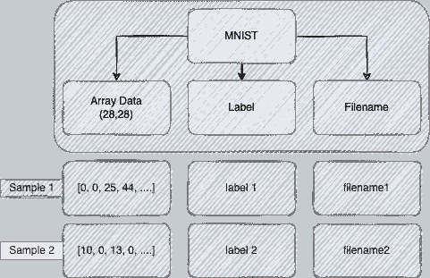

# 数据版本控制简介

> 原文：[`towardsdatascience.com/introduction-to-data-version-control-59fabf447a60`](https://towardsdatascience.com/introduction-to-data-version-control-59fabf447a60)

## PYTHON | DATA | PROGRAMMING

## 使用 Hangar 在 Python 中实现自己的 DVC 的逐步指南

[](https://david-farrugia.medium.com/?source=post_page-----59fabf447a60--------------------------------)[](https://towardsdatascience.com/?source=post_page-----59fabf447a60--------------------------------) [David Farrugia](https://david-farrugia.medium.com/?source=post_page-----59fabf447a60--------------------------------)

·发布于[Towards Data Science](https://towardsdatascience.com/?source=post_page-----59fabf447a60--------------------------------) ·阅读时间 7 分钟·2023 年 8 月 18 日

--


图片由[Florian Olivo](https://unsplash.com/@florianolv?utm_source=medium&utm_medium=referral)拍摄，来源于[Unsplash](https://unsplash.com/?utm_source=medium&utm_medium=referral)

# 什么是数据版本控制（DVC）？

任何生产级系统都需要某种形式的版本控制。

> **一个当前真实来源的单一来源。**

任何持续更新的资源，尤其是被多个用户同时更新的资源，都需要某种审计跟踪以记录所有更改。

在软件工程中，解决方案是[Git](https://git-scm.com/)。

如果你曾经编写过代码，那么你可能对 Git 的美妙之处非常熟悉。

Git 允许我们提交更改，从源创建不同的分支，并将我们的分支合并回原始分支，仅举几例。

DVC 完全是相同的范式，但适用于数据集。请看，实时数据系统不断吸收新的数据点，而不同的用户在相同的数据集上进行不同的实验。

这导致了同一数据集的多个版本，这显然不是单一的真实来源。

此外，在机器学习环境中，我们还会有多个版本的同一“模型”，这些模型是在相同数据集的不同版本上训练的（例如，重新训练模型以包括更新的数据点）。

如果没有适当的审计和版本控制，这将会创建一个复杂的数据集和实验网络。我们绝对不想要这种情况！

因此，DVC 是一个涉及通过注册特定数据集的更改来跟踪我们数据集的系统。既有免费的 DVC 解决方案，也有付费的解决方案。

我最近发现了[Hangar](https://github.com/tensorwerk/hangar-py)，这是一个完全开源的 Python DVC 包。我们来看看它能做些什么吧。

# 使用 Hangar

hangar 包是一个纯 Python 实现，可以通过 pip 安装。

它的核心功能也与 git 紧密相关，这极大地帮助了学习曲线的提升。

我们还可以选择通过命令行与 hangar 进行交互，或使用其专用的 Python 客户端。

可用的一些功能包括：

+   ***checkout*** *— 切换到新的分支或参考点*

+   ***commit*** *— 将当前更改添加到当前分支*

+   ***branch*** *— 创建一个指向特定提交的参考点*

+   ***merge*** *— 将一个分支的更改合并到另一个分支中*

+   ***diff*** *— 比较两个分支之间的更改*

+   ***push*** *— 将本地版本上传到远程仓库*

+   ***pull/fetch*** *— 从远程仓库更新数据集的本地版本*

+   ***log*** *— 显示提交历史*

> *注意：远程仓库是当前真实数据的唯一来源。*

需要注意的是，Hangar 不是基于 git 构建的，而是模拟 git 的功能。这使得它运行更快。

我们可以通过 pip 使用以下命令安装 hangar：

```py
pip install hangar
```

安装 Hangar 后，我们可以直接将该包导入 Python。

我们需要做的第一件事是创建一个数据仓库。

我们可以从 Hangar 包中导入 Repository 类并用它来定义我们的仓库。

如果这是我们第一次处理某个仓库，我们还需要使用 `init()` 函数来初始化它。

```py
from hangar import Repository
import os

repo_name = 'test'

if not os.path.isdir(repo_name):
    print(f'{repo_name} directory was not found. Creating an empty directory.')
    os.makedirs(repo_name)

repo = Repository(path=repo_name)
print(f'Connected to {repo_name}')

if not repo.initialized:
    print(f'Initialising {repo_name}')
    repo.init(
        user_name="David Farrugia", user_email="davidfarrugia@gmail.com", remove_old=True
    )
```

在我们继续数据版本控制的示例之前，让我们先讨论一下 Hangar 背后的方法论。

# 接触 Hangar

Hangar 的主要学习曲线在于理解如何与这个包进行最佳交互。Hangar 包含四个主要组件：

# 仓库

我们可以将仓库视为我们的项目仓库。仓库本质上是对所做提交的集合和历史记录。

**理想情况下，每个项目都有自己的仓库。**

例如，如果我们有两个主要任务——预测手写数字和预测欺诈——我们也会分别创建两个仓库。

# 数据集

这一个很简单。

数据集就是，你猜对了，就是我们的数据集。但是数据集究竟是什么呢？我们以 Titanic 数据集为例。数据集的组成是什么？

是指单个样本吗？是指监控的变量吗？在这里我们可以充分发挥创意。Hangar 将数据集描述为一个列的集合。我们接下来会深入探讨这个问题。

# 列

列可以是我们喜欢的任何数据属性或特征。它可以是特征数组、标签数组、特征名称数组，甚至是唯一标识符数组。

然而，列数组中的每个项目都应该对应于数据集中的单个样本。

目前，支持的列类型有：

+   *add_bytes_column — 字节*

+   *add_ndarray_column — 数组*

+   *add_str_column — 字符串*

例如，如果我们有一个 28x28 图像的数据集，我们会选择一个数组列（每个样本的形状为 28x28）来表示实际的数值数据。

我们可以使用字节或字符串列来存储其标签，并使用字符串列来存储图像文件名。



图片由作者提供。

当然，上述只是关于如何构建数据集的指南。

你所处理的数据类型以及要进行的实验类型都会影响 Hangar 的结构化策略。

例如，你也可以选择为训练数据和验证数据各自设立一个专门的列。

列应该是数据样本的集合。我们从一个空集合开始，样本添加后，集合索引会增加。

# 数据

最后是数据。一旦我们确定了需要哪些列，相应地处理数据就变成了一项相对简单的任务。

数据本身只是数字。它没有直接的意义，也没有任何结构。

完成这些后，让我们继续我们的示例。

假设我们有一个表格分类数据集——`df`——我们会将整个数据集作为字节存储在一个单独的列中。

我们开始时创建一个**WriterCheckout**。

WriterCheckout 对象允许我们启用一个特定的分支（在我们的例子中，我们只有一个分支：master），并具有写入访问权限（即能够写入和提交更改到活动分支）。

我们通过`master = repo.checkout(write=True)`来完成这一步。

然后，我们可以指示 Hangar 创建一个名为‘*data*’的字节列，通过调用`add_bytes_column`。由于这是我们的第一次提交，所以我们的列仍然是空的。

对于我们的第一次提交，我们可以在索引 0 处提交数据。

由于我们将列指定为字节对象，因此我们必须先将数据转换为字节对象。

我们可以最终调用`commit`函数来提交并保存我们的更改。下面，我们展示了刚刚讨论的代码示例。

```py
import pickle

# get the WriterCheckout
master = repo.checkout(write=True)

# Add a New Column
master.add_bytes_column(name='data')

# Add the Data
master['data'][0] = pickle.dumps(df, protocol=4)

# Commit
master.commit('This is our first commit!')

# Close the WriterCheckout Lock
master.close()
```

> 注意：Hangar 不允许有多个 WriterCheckouts 以避免冲突。因此，当不使用 WriterCheckout 时，请确保关闭它。如果写锁已经在流通中，我们只能以只读模式进行 checkout。

如果我们想对同一列添加另一个提交，我们按照相同的过程进行，但改为提交到`master['data'][1]`，以此类推进行未来的提交。

每个提交也会有一个绑定的哈希键。

# 在 Hangar 中分支

分支在我们想要获取某个特定点的数据副本以进行自定义实验而不实际更改数据时特别有用。

我们可以分支出去，并在确认我们的处理正确后，也可以将其合并回主流。

典型的分支流程大致如下：

```py
Create Branch -> Checkout Branch -> Make Changes -> Commit -> Merge
```

我们可以使用`repo.create_branch(name='test')`创建分支，并按如下方式进行合并：

```py
master.merge(message='message for merge', dev_branch='test')
```

每个 Hangar 中的提交都有一个哈希键。我们可以使用这个哈希来准确确定分支点：

```py
test_branch2 = repo.create_branch(name='test2', base_commit=<SOME_HASH_KEY>)
```

通过调用`repo.log()`，我们可以获得当前分支及其最新提交的日志摘要。一个示例日志可能如下所示：

```py
* a=cf94cf8b4c5758c885c6b84d58c4fbe22f379510 (test2): added new test branch
* a=a8fe61916764b873f13c80a14ce4fda610b74df9 (test) (master): Base Dataset
```

我们可以按如下方式获取分支之间的差异和冲突：

`repo.diff('master', 'test2')`

# 总结

在这篇文章中，我们讨论了 Hangar 包作为 Python 中 DVC 的开源解决方案。这就是 Hangar 提供的全部吗？绝对不是！我们介绍了基础知识，并发现如何开始使用 Hangar。正如以往，我强烈建议你查看他们的[文档](https://hangar-py.readthedocs.io/en/stable/readme.html)并在自己的用例中实践。

**你喜欢这篇文章吗？只需$5/月，你就可以成为会员，解锁对 Medium 的无限访问。你将直接支持我以及你在 Medium 上最喜欢的其他作者。非常感谢！**

[](https://david-farrugia.medium.com/membership?source=post_page-----59fabf447a60--------------------------------) [## 通过我的推荐链接加入 Medium - David Farrugia

### 作为 Medium 会员，你的部分会员费用会流向你阅读的作者，并且你可以全面访问每个故事……

[david-farrugia.medium.com](https://david-farrugia.medium.com/membership?source=post_page-----59fabf447a60--------------------------------)

# 想联系我吗？

我很想听听你对这个话题，或任何关于 AI 和数据的看法。

如果你希望联系我，可以发邮件至***davidfarrugia53@gmail.com***。

[Linkedin](https://www.linkedin.com/in/david-farrugia/)
