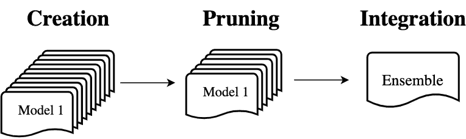
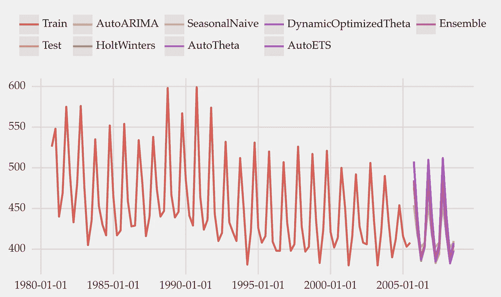
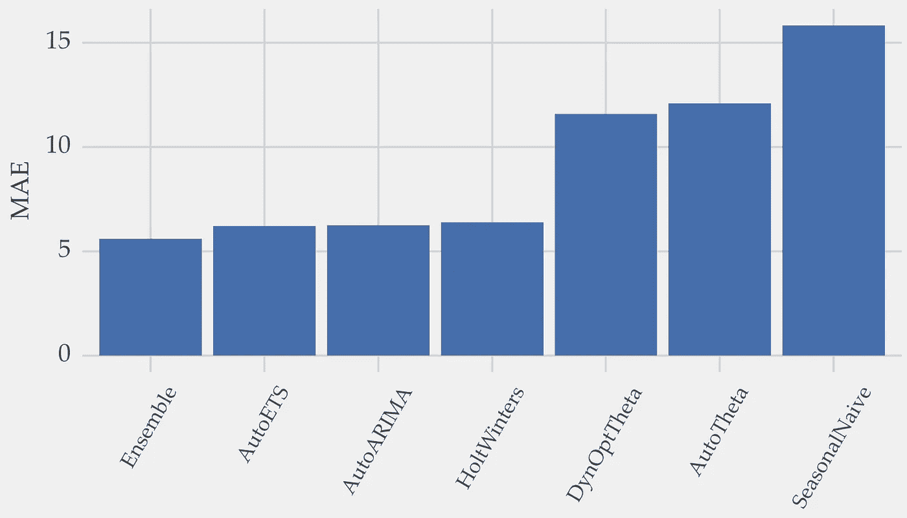

# 预测集成简介

> 原文：[`towardsdatascience.com/introduction-to-forecasting-ensembles-f63877a2498`](https://towardsdatascience.com/introduction-to-forecasting-ensembles-f63877a2498)

## **提升预测性能的廉价技巧**

[](https://vcerq.medium.com/?source=post_page-----f63877a2498--------------------------------)[](https://towardsdatascience.com/?source=post_page-----f63877a2498--------------------------------) [Vitor Cerqueira](https://vcerq.medium.com/?source=post_page-----f63877a2498--------------------------------)

·发表于[Towards Data Science](https://towardsdatascience.com/?source=post_page-----f63877a2498--------------------------------) ·阅读时间 5 分钟·2023 年 1 月 12 日

--


照片由[Natalie Pedigo](https://unsplash.com/@nataliepedigo?utm_source=medium&utm_medium=referral)提供，发布在[Unsplash](https://unsplash.com/?utm_source=medium&utm_medium=referral)上。

如果你需要挤出一点额外的性能，预测组合可能正是你所需要的。

预测组合是将多个模型的预测结果结合起来的过程。这种技术也被称为集成预测。

在这里，你将学习创建预测集成的 3 个主要步骤。

# 为什么使用集成模型？

没有任何预测方法是完美的。

创建预测模型有几种技术。例如，包括经典方法如 ARIMA 或指数平滑，或机器学习方法，如决策树或神经网络。你可以[查看我之前的文章](https://medium.com/towards-data-science/machine-learning-for-forecasting-transformations-and-feature-extraction-bbbea9de0ac2)了解如何使用时间序列进行监督学习。

每种方法都有其对数据的假设，这些假设并不总是成立。每种方法都有其优点和局限性。管理这两者是集成模型的关键动机。

将多个模型结合起来通常会导致更准确的预测。一个原因是这减少了选择错误模型的可能性。

此外，集成模型对传达未来观测的不确定性也很有用。模型之间的高预测变异性表明更大的不确定性。这一点对决策制定非常有价值。

那么，集成模型是如何工作的呢？

# 建立集成模型的 3 个阶段

建立集成模型是一个 3 阶段的过程：

+   创建：建立不同的单独模型；

+   剪枝：移除表现不佳或冗余的模型；

+   整合：将模型结合起来。



图 1：构建集成模型的步骤。首先，创建许多模型。然后，去除表现差或冗余的模型。其余模型用于预测。图片来源于作者。

让我们深入探讨每一步。

## 创建步骤


图片由[Mourizal Zativa](https://unsplash.com/@mourimoto?utm_source=medium&utm_medium=referral)拍摄，来源于[Unsplash](https://unsplash.com/?utm_source=medium&utm_medium=referral)

第一步是创建构成集成模型的模型。

模型之间的多样性是你应该关注的关键点。每个模型应提供与其他模型不同但优秀的预测。高度相关的模型会降低集成模型的效果。

那么，如何在构建集成模型时促进多样性呢？有两种主要策略：

1.  改变学习方法或其参数；

1.  操作训练数据。

不同的方法对数据有不同的假设。因此，这会在集成模型中产生自然的多样性。

如果一个集成模型的模型是使用不同算法训练的，则称为异质集成模型。例如线性模型和决策树。否则，称为同质集成模型。随机森林是同质决策树集成模型的一个例子。

在像随机森林这样的同质集成模型中，如何鼓励多样性？

随机森林的输入数据通过两种方式进行操作：

+   每棵树的训练数据都是通过替换抽样的。这一过程称为 bagging；

+   在每棵树中，每次分裂时都会选择一个随机特征子集。这进一步增加了多样性。

参考文献[3]中的文章提供了关于集成模型多样性的出色综述。

## 修剪步骤


图片由[Matt Briney](https://unsplash.com/@mbriney?utm_source=medium&utm_medium=referral)拍摄，来源于[Unsplash](https://unsplash.com/?utm_source=medium&utm_medium=referral)

在创建步骤中构建了许多模型。

这个过程有一定的随机性。但是，并不能保证所有模型都将有用或改善多样性。

解决这一问题的一种方法是修剪集成模型。这涉及到去除不必要的模型。模型应因表现不佳或冗余而被丢弃。

去除不必要的模型后，你会得到一个更好的集成模型。一个具有更好预测性能和更少维护模型的集成模型。

## 集成步骤

最终阶段是集成。这是当你结合各个模型的预测结果时。

最简单的方法是取预测值的平均值。或者，在分类情况下，通过多数投票。另一种方法是为每个模型分配不同的权重，并取加权平均值。一种确定权重的方法是基于过去的表现。如果模型表现良好，你可以给它更高的权重。

# 实践操作

让我们使用 Python 构建一个预测集成模型。

这是代码，注释中解释了它：

```py
import pandas as pd
from plotnine import *

from sklearn.model_selection import train_test_split
from sklearn.metrics import mean_absolute_error as mae
from pmdarima.datasets import load_ausbeer  # GPL>=2 licence

from statsforecast import StatsForecast
from statsforecast.models import (
    AutoARIMA,
    HoltWinters,
    AutoTheta,
    AutoETS,
    DynamicOptimizedTheta as DOT,
    SeasonalNaive
)

# https://github.com/vcerqueira/blog/tree/main/src/
from src.plots.forecasts import train_test_yhat_plot
from src.plots.barplots import err_barplot

# quarterly data
PERIOD = 4
# forecasting the final 3 years of data
TEST_SIZE = 12

# loading the beer time series
series = load_ausbeer(as_series=True).dropna()
series.index = pd.date_range(start='1956Q1', end='2008Q3', freq='QS')

# train/test split
train, test = train_test_split(series, test_size=TEST_SIZE, shuffle=False)

# transforming the train data to the required format for statsforecast
train_df = train.reset_index()
train_df.columns = ['ds', 'y']
train_df['unique_id'] = '1'

# setting up the models
models = [
    AutoARIMA(season_length=PERIOD),
    HoltWinters(season_length=PERIOD),
    SeasonalNaive(season_length=PERIOD),
    AutoTheta(season_length=PERIOD),
    DOT(season_length=PERIOD),
    AutoETS(season_length=PERIOD),
]

sf = StatsForecast(
    df=train_df,
    models=models,
    freq='Q',
    n_jobs=1,
    fallback_model=SeasonalNaive(season_length=PERIOD)
)

# training the models
sf.fit(train_df)

# forecasting
forecasts = sf.predict(h=TEST_SIZE)
forecasts = forecasts.reset_index(drop=True).set_index('ds')

# averaging the forecasts to make the ensemble predictions
forecasts['Ensemble'] = forecasts.mean(axis=1)
```

作为案例研究，目标是预测啤酒的生产。你可以在参考文献[3]中查看这些数据的来源。我们使用*statsforecast*库创建了 6 个预测模型。这些模型包括 AutoARIMA、Holt-Winters 或 AutoETS。

然后，将 6 个模型的预测结果进行平均，形成集成预测。

这是预测结果：



图 2：多个模型及其组合的预测。图片由作者提供。

现在，这是每种方法的平均绝对误差：



图 3：每种方法的平均绝对误差。图片由作者提供。

集成模型的表现优于任何单一模型。

在这个例子中，集成模型只包含 6 个模型。但集成模型通常包含更多模型（最多可达几百个）。然而，随着模型数量的增加，回报递减效应也会出现。

## 有什么陷阱？

虽然集成模型提升了预测表现，但它们也有一些局限性。

1.  你需要维护多个模型而不是一个。这会导致额外的计算成本。例如，如果需要在小型设备中部署这些模型，可能没有足够的存储空间。如果数据的采样频率很高，获取和整合所有预测的时间可能会过长。

1.  集成模型缺乏透明度。在某些领域，透明的模型对于可信度和从业者的采纳至关重要。

# 主要收获

+   集成模型结合了多个模型的预测结果。这通常会导致更好的预测表现；

+   集成模型分为 3 个阶段：创建、修剪和整合；

+   集成模型的主要局限性在于额外的计算成本和缺乏透明度。

感谢阅读，下次故事见！

## 参考文献

[1] Aiolfi, Marco, 和 Allan Timmermann. “预测表现的持续性和条件组合策略。” *经济计量学杂志* 135.1–2 (2006): 31–53。

[2] Brown, Gavin, 等. “多样性创建方法：调查与分类。” *信息融合* 6.1 (2005): 5–20。

[3] 季度澳大利亚啤酒生产 (GPL ≥ 2 许可证) [`www.rdocumentation.org/packages/fpp/versions/0.5/topics/ausbeer`](https://www.rdocumentation.org/packages/fpp/versions/0.5/topics/ausbeer)
