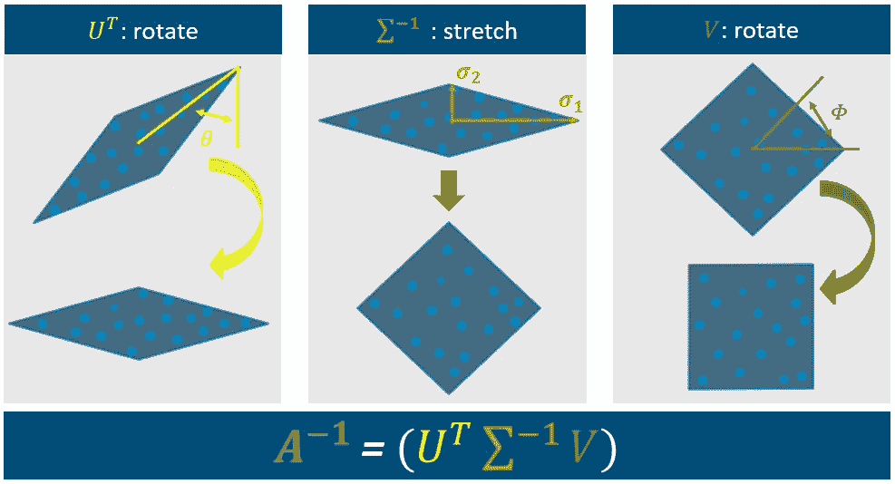

# ICA 简介：独立成分分析

> 原文：[`towardsdatascience.com/introduction-to-ica-independent-component-analysis-b2c3c4720cd9?source=collection_archive---------1-----------------------#2023-02-14`](https://towardsdatascience.com/introduction-to-ica-independent-component-analysis-b2c3c4720cd9?source=collection_archive---------1-----------------------#2023-02-14)

[](https://medium.com/@jonas_dieckmann?source=post_page-----b2c3c4720cd9--------------------------------)[](https://towardsdatascience.com/?source=post_page-----b2c3c4720cd9--------------------------------) [Jonas Dieckmann](https://medium.com/@jonas_dieckmann?source=post_page-----b2c3c4720cd9--------------------------------)

·

[关注](https://medium.com/m/signin?actionUrl=https%3A%2F%2Fmedium.com%2F_%2Fsubscribe%2Fuser%2F1c8d1cf684f2&operation=register&redirect=https%3A%2F%2Ftowardsdatascience.com%2Fintroduction-to-ica-independent-component-analysis-b2c3c4720cd9&user=Jonas+Dieckmann&userId=1c8d1cf684f2&source=post_page-1c8d1cf684f2----b2c3c4720cd9---------------------post_header-----------) 发布于 [Towards Data Science](https://towardsdatascience.com/?source=post_page-----b2c3c4720cd9--------------------------------) · 9 min read · 2023 年 2 月 14 日 [](https://medium.com/m/signin?actionUrl=https%3A%2F%2Fmedium.com%2F_%2Fvote%2Ftowards-data-science%2Fb2c3c4720cd9&operation=register&redirect=https%3A%2F%2Ftowardsdatascience.com%2Fintroduction-to-ica-independent-component-analysis-b2c3c4720cd9&user=Jonas+Dieckmann&userId=1c8d1cf684f2&source=-----b2c3c4720cd9---------------------clap_footer-----------)

--

[](https://medium.com/m/signin?actionUrl=https%3A%2F%2Fmedium.com%2F_%2Fbookmark%2Fp%2Fb2c3c4720cd9&operation=register&redirect=https%3A%2F%2Ftowardsdatascience.com%2Fintroduction-to-ica-independent-component-analysis-b2c3c4720cd9&source=-----b2c3c4720cd9---------------------bookmark_footer-----------)

你是否曾经遇到过试图分析复杂且高度相关的数据集时感到信息量庞大、不知所措的情况？这时，独立成分分析（ICA）就派上用场了。ICA 是数据分析领域中的一种强大技术，它可以帮助你在多变量数据集中分离和识别潜在的独立来源。


图片来源：[Unsplash](https://unsplash.com/)

ICA 很重要，因为它提供了一种理解数据集的隐藏结构的方法，并且可以在各种应用中使用，如信号处理、脑成像、金融等许多其他领域。此外，ICA 可以帮助从数据中提取最相关的信息，提供有价值的见解，否则这些见解将在各种相关性中迷失。 

在本文中，我们将深入讨论#1 ICA 的**基本原理**，讨论鸡尾酒派对与之有何关系，#2 **3 步 ICA 算法**，以及#3 如何在你的数据分析项目中**实施**它。所以，如果你准备解锁你的数据的全部潜力，就加入这场旅程吧！

# #1：介绍与主要内容

独立分量分析是多种无监督学习算法之一，这意味着我们在使用它之前不需要对模型进行监督。这种方法的起源来自信号处理，我们试图将多变量信号分离为加法子分量。让我们深入解释一下主要思想：


图片由作者提供

想象一些独立的信号或变量。这些信号可以用信号曲线表示，第一信号位于图像顶部，第二信号位于图像上方。由于测量的结果，我们没有收到包含这些信号本身的数据集，而是包含了这两个信号的测量结果，这些信号不幸地以不同的线性组合混合在一起。ICA 的目标是通过分离混合数据来恢复原始的未知信号。最终目标是重构数据，使每个维度相互独立。

为了使这个概念更加具体，将使用 ICA 中最著名的例子“鸡尾酒派对问题”。


图片由[Unsplash](https://unsplash.com/)提供

## 鸡尾酒派对问题

想象参加一个鸡尾酒派对，多个人同时说话，使得难以跟随单个对话。值得注意的是，人类具有在这种情况下分离个别语音流的能力。从技术上讲，这变得稍微具有挑战性。


鸡尾酒派对问题。作者提供的图片。

假设我们用两个麦克风记录派对上两组的对话。这导致两个混合信号，第一次测量对第一组影响更大，对第二组影响较小，而第二次测量对第二组的影响更大。


图片由作者提供

这一点的总体框架可以在灰色框中的向量表示中找到。**向量 X**中的测量实际上是**向量 S**的信号与一些**混合系数**相乘，混合系数表示在**矩阵 A**中。由于我们想要提取完整的对话（原始信号），因此我们需要解决向量 S 的问题。


作者提供的图片

## ICA 与 PCA

你可能已经猜到 ICA 在某种程度上与主成分分析（PCA）有关。这种假设并不完全错误。两者的基本理念相差不远，但它们在最后阶段有所不同，我们稍后将看到。

让我们总结一下 PCA 的基本功能：假设我们有两个看似相关的变量。通过最大化这些变量的方差，利用它们的特征向量和特征值，我们可以将它们转换为主成分。在这个具体例子中，PCA 很好地识别了这种关系的主要方向。

让我们以之前的鸡尾酒例子为例。在非常简单的表示中，我们可以想象从麦克风一和二获得的两个测量形成类似交叉的模式。如果在这种情况下应用 PCA，我们会得到错误的结果，因为 PCA 在具有多个主方向的数据集上表现不佳。


作者提供的图片

而 ICA 则通过关注独立成分而非主成分来解决这个问题。


作者提供的图片

重要的是回顾已建立的概念框架。从麦克风获得的读数对应于被混合矩阵 A 乘以的原始信号。通过根据向量 S 重新排列方程，确定原始变量所需的唯一信息是矩阵 A。然而，矩阵 A 是未知的。


作者提供的图片

因此，为了全面理解矩阵 A 并最终计算向量 S，有必要通过一系列步骤进行逆操作。这些顺序的逆操作组成了 ICA 算法的三个阶段，接下来将对此进行更详细的分析。

# #2：分离过程 | 3 步 ICA 算法

在进行 R 中的实际演示之前，了解算法的三个步骤非常重要。该算法的目标是执行向量 X 与矩阵 A 的乘法。矩阵 A 由三个组成部分构成，这些组成部分是不同因素之间乘法交互的结果：



作者提供的图片

**步骤 1：找到具有最大方差的角度以旋转 | 估计 U^T**

算法的第一个组件涉及使用基于第一个角度 Theta 的矩阵 U^T。角度 Theta 可以通过主成分分析（PCA）确定的数据主要方向来推导。这个步骤将图形旋转到上面所示的位置。

**步骤 2：找到主成分的缩放 | 估计 ∑^(-1)**

第二个组件涉及拉伸图形，这是通过 Sigma^-1 步骤实现的。这个步骤使用了来自数据的 sigma 1 和 sigma 2 的方差，类似于 PCA 中使用的方法。

**步骤 3：旋转的独立性和峰度假设 | 估计 *V***

最终的组件是当前算法与 PCA 的区别所在，它涉及围绕角度 Phi 的信号旋转。这个步骤旨在通过利用独立性和峰度假设进行旋转，从而重建信号的原始维度。

总结来说，该算法使用测量并围绕 theta 进行旋转，通过使用方差 sigma 1 和 2 进行拉伸，最后围绕 Phi 进行旋转。这些步骤的数学背景已在以下幻灯片中总结以供参考。

如你所见，我们可以仅使用这两个角度和数据的方差来确定**逆矩阵 A**，这实际上是我们处理 ICA 算法所需的全部内容。进行测量、旋转并缩放。最后，我们再次旋转以获得最终维度。

# #3：使用 fastICA()的 R 代码示例

我希望你到目前为止已经理解了 ICA 算法的基本思想。虽然不需要对每一个步骤都进行数学理解，但理解其背后的概念是有帮助的。有了这些知识，我希望与你一起完成一个实际的例子，展示如何使用 R 中的`fastICA`函数实际应用 ICA 算法。

```py
# install fastICA package in R
install.packages("fastICA")

# load required libraries
library(MASS) # To use mvrnorm()
library(fastICA)
```

我们创建了两个随机数据集：信号 1 和信号 2，可以想象成来自我们两个鸡尾酒小组的语音信号：

```py
# random data for signal 1 
s1=as.numeric(0.7*sin((1:1000)/19+0.57*pi) + mvrnorm(n = 1000, mu = 0, Sigma = 0.004))
plot(s1, col="red", main = "Signal 1", xlab = "Time", ylab = "Amplitude")

# random data for signal 1 
s2=as.numeric(sin((1:1000)/33) + mvrnorm(n = 1000, mu = 0.03, Sigma = 0.005)) 
plot(s2, col="blue", main = "Signal 2",xlab = "Time", ylab = "Amplitude")
```


R 输出的截图：原始信号。图片由作者提供

红色曲线代表第一个信号，蓝色曲线代表第二个信号。在这种情况下，形状并不重要。你应该看到的是两个信号彼此不同。现在我们将它们混合起来！

```py
# measurements with mixed data x1 and x2
x1 <- sine1-2*sine2
plot(x1, main = "Linearly Mixed Signal 1", xlab = "Time", ylab = "Amplitude")

x2 <- 1.73*sine1 +3.41*sine2
plot(x2, main = "Linearly Mixed Signal 2", xlab = "Time", ylab = "Amplitude")
```


R 输出的截图：测量。图片由作者提供

如上所示，我们使用两个信号模拟了两个测量。因此，测量中的信号不再是独立的。这两个混合信号可以想象成我们在鸡尾酒示例中的两个麦克风录音。现在我们忘记这两个原始信号，想象这些测量是我们关于此数据的唯一信息。

因此，我们希望将它们分离，最终得到两个独立的信号：

```py
# apply fastICA function to identify independent signals
measurements <- t(rbind(x1,x2))

estimation <- fastICA(measurements, 2, alg.typ = "parallel", fun = "logcosh", alpha = 1, method = "C", row.norm = FALSE, maxit = 200, tol = 0.0001, verbose = TRUE)

plot(estimation$S[,1], col="red", main = "Estimated signals", xlab = "Time", ylab = "Amplitude")
lines(estimation$S[,2], col="blue") 
mtext("Signal 1 estimation in red, Signal 2 estimation in blue")
```


来自 R 输出的截图：独立信号再次分离。图片由作者提供

该算法的结果如上所示。红色曲线是对信号 1 的估计，而蓝色曲线则估计了信号 2。毫无悬念的是，该算法几乎准确地估计了原始信号，如右侧所示。你可能已经注意到，红色曲线完美匹配了预期，而蓝色曲线似乎被反转了。这是因为算法无法恢复源活动的精确幅度。但除此之外，重建做得相当出色。

# 限制与结论

*让我们从坏消息开始：* ICA 只能分离线性混合的源，而且我们无法完美分离高斯分布的源，因为这会破坏我们算法的第三步。尽管我们期望独立源在进行线性组合后混合，ICA 仍会找到一个空间，即使是不独立的源也能在其中达到最大独立性。

*但现在来说些好消息：* ICA 算法是一种强大的方法，适用于不同领域，并且可以在 R、Mathlab 和其他系统的开源包中轻松使用。有各种示例，其中 ICA 算法被应用于：面部识别应用、股票市场预测等。因此，它在实际使用中是一个重要且备受尊敬的方法。

**简而言之：** 我们介绍了独立成分分析作为一种无监督学习算法。主要思想是将给定的线性组合测量值分离回原始信号。这称为 *重建*，并使用三步 ICA 算法。可视化该方法背后的问题的最流行示例再次是鸡尾酒会问题。但现在鸡尾酒问题就说到这里吧。

> 是时候享受真正的鸡尾酒派对了 🍹

[](https://medium.com/@jonas_dieckmann?source=post_page-----b2c3c4720cd9--------------------------------) [## Jonas Dieckmann - Medium

### 在 Medium 上阅读 Jonas Dieckmann 的文章。分析经理 & 产品负责人 @ philips | 热情并撰写有关…

medium.com](https://medium.com/@jonas_dieckmann?source=post_page-----b2c3c4720cd9--------------------------------)

我希望你觉得这有用。告诉我你的想法！也可以通过 LinkedIn 与我联系 [`www.linkedin.com/in/jonas-dieckmann/`](https://www.linkedin.com/in/jonas-dieckmann/) 或在 medium 上关注我。

# 另见我的其他文章：

[](/ensemble-learning-bagging-and-boosting-23f9336d3cb0?source=post_page-----b2c3c4720cd9--------------------------------) ## 集成学习：Bagging 和 Boosting

### 现在是探索 Bagging 和 Boosting 世界的时候了。借助这些强大的技术，你可以提高性能…

towardsdatascience.com [](/how-to-set-started-with-tensorflow-using-keras-api-and-google-colab-5421e5e4ef56?source=post_page-----b2c3c4720cd9--------------------------------) ## 如何使用 Keras API 和 Google Colab 开始 TensorFlow

### 分步教程以分析人类活动与神经网络

towardsdatascience.com

# 参考文献

[1]: Bell, AJ; Sejnowski, TJ (1997). “自然场景的独立成分是边缘滤波器”。《视觉研究》。37 (23): 3327–3338\. doi:10.1016/s0042–6989(97)00121–1\. PMC 2882863\. PMID 9425547\. 

[2]: Back, AD; Weigend, AS (1997). “独立成分分析在提取股票收益结构中的首次应用”。《国际神经系统期刊》。8 (4): 473–484\. doi:10.1142/s0129065797000458\. PMID 9730022\. 

[3]: Barlett, MS (2001). 无监督学习的面部图像分析。波士顿：Kluwer 国际工程与计算机科学系列。 

[4]: Comon, Pierre (1994). “独立成分分析，新概念？”《信号处理》，第 36 卷，第 3 期，页 287–314，ISSN 0165–1684，[`doi.org/10.1016/0165-1684(94)90029-9.`](https://doi.org/10.1016/0165-1684(94)90029-9.)
