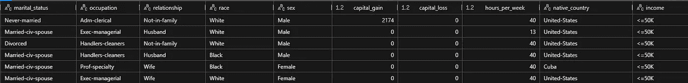
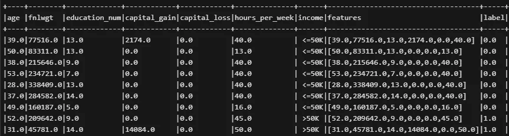
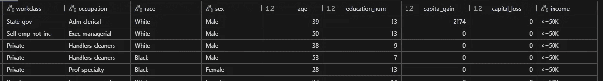
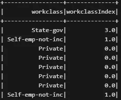
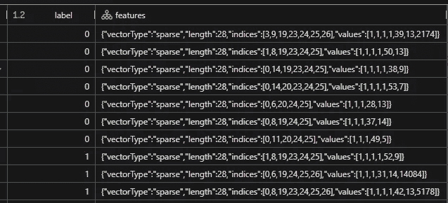
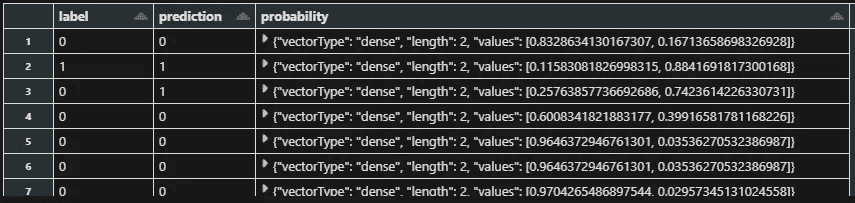
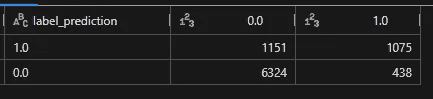
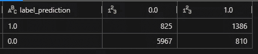
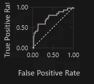

# PySpark 中的逻辑回归简介

> 原文：[`towardsdatascience.com/introduction-to-logistic-regression-in-pyspark-9f894299c32d`](https://towardsdatascience.com/introduction-to-logistic-regression-in-pyspark-9f894299c32d)

## 在 Databricks 中运行第一个分类模型的教程

[](https://gustavorsantos.medium.com/?source=post_page-----9f894299c32d--------------------------------)[](https://towardsdatascience.com/?source=post_page-----9f894299c32d--------------------------------) [Gustavo Santos](https://gustavorsantos.medium.com/?source=post_page-----9f894299c32d--------------------------------)

·发布于 [Towards Data Science](https://towardsdatascience.com/?source=post_page-----9f894299c32d--------------------------------) ·10 min 阅读·2023 年 11 月 4 日

--


图片由 [Ibrahim Rifath](https://unsplash.com/@ripeyyy_?utm_content=creditCopyText&utm_medium=referral&utm_source=unsplash) 提供，来源于 [Unsplash](https://unsplash.com/photos/stacked-round-gold-colored-coins-on-white-surface-OApHds2yEGQ?utm_content=creditCopyText&utm_medium=referral&utm_source=unsplash)

# 介绍

大数据。大数据集。云……

这些词无处不在，跟随我们，出现在客户、面试官、经理和主管的思维中。随着数据越来越丰富，数据集的规模也不断扩大，有时在本地环境中运行机器学习模型是不可能的——换句话说，就是在单台机器上。

这个问题要求我们适应并找到其他解决方案，例如使用 Spark 建模，这是最常用的大数据技术之一。Spark 接受 SQL、Python、Scala、R 等语言，并具有自己的方法和属性，包括自己的机器学习库 [MLlib]。例如，当你在 Spark 中使用 Python 时，这叫做 *PySpark*。

此外，还有一个平台叫做 *Databricks*，它将 Spark 包装在一个非常好的层中，使数据科学家可以像使用 Anaconda 一样使用它。

在 Databricks 中创建机器学习模型时，它也接受 Scikit Learn 模型，但由于我们更关注大数据，本教程完全使用 **Spark 的 MLlib** 创建，这更适合大数据集，同时也为我们的技能库添加了一种新工具。

开始吧。

# 数据集

本练习的数据集已经在 Databricks 中。这是一个 UCI 数据集中的**成人**数据，提取自人口普查，并标记为年收入低于或高于$50k。数据在以下地址以创作共享许可证公开提供：[`archive.ics.uci.edu/dataset/2/adult`](https://archive.ics.uci.edu/dataset/2/adult)

我们的教程是构建一个二元分类器，用于判断一个人年收入是否高于或低于$50k。



数据集摘录。图片由作者提供。

# 编码

在这一部分，我们将详细介绍我们模型的每一个步骤。

下面是我们需要导入的模块。

```py
from pyspark.sql.functions import col
from pyspark.ml.feature import UnivariateFeatureSelector
from pyspark.ml.feature import RFormula
from pyspark.ml.feature import StringIndexer, VectorAssembler
from pyspark.ml import Pipeline
from pyspark.ml.feature import OneHotEncoder
from pyspark.ml.classification import LogisticRegression
from pyspark.ml.evaluation import BinaryClassificationEvaluator
```

以及加载数据集。

```py
# Pulling a dataset
from pyspark.sql.types import DoubleType, StringType, StructField, StructType

schema = StructType([
  StructField("age", DoubleType(), False),
  StructField("workclass", StringType(), False),
  StructField("fnlwgt", DoubleType(), False),
  StructField("education", StringType(), False),
  StructField("education_num", DoubleType(), False),
  StructField("marital_status", StringType(), False),
  StructField("occupation", StringType(), False),
  StructField("relationship", StringType(), False),
  StructField("race", StringType(), False),
  StructField("sex", StringType(), False),
  StructField("capital_gain", DoubleType(), False),
  StructField("capital_loss", DoubleType(), False),
  StructField("hours_per_week", DoubleType(), False),
  StructField("native_country", StringType(), False),
  StructField("income", StringType(), False)
])

adults = spark.read.format("csv").schema(schema).load("/databricks-datasets/adult/adult.data")
```

## 准备数据

首先，我们需要准备数据。虽然这不是本教程的核心内容，但我们仍需处理空值，例如，这就是我们要做的。

从数据集文档中得知，NA 值实际上标记为“ ?”。我们将直接去掉它们，因为空值不多，因此不会影响我们模型的性能。因此，处理方法如下。任何列中出现“ ?”，我们都会去掉。

```py
adults = (
  adults
  .filter( (col('workclass') != ' ?') &
          (col('education') != ' ?') &
          (col('marital_status') != ' ?') &
          (col('occupation') != ' ?') &
          (col('relationship') != ' ?') &
          (col('race') != ' ?') &
          (col('sex') != ' ?') &
          (col('native_country') != ' ?')
          )
)
```

很好。现在让我们选择模型中使用的最佳变量。

## 特征工程

由于我们有分类变量和数值变量，第一步是将它们分开成不同的数据集，以便使用 Spark 的`UnivariateFeatureSelector`。该方法使用 Chi²检验选择具有分类标签的最佳分类变量，使用 ANOVA 选择具有分类标签的数值变量，这两种情况都适用。

首先选择最佳的分类变量。我们从隔离分类变量开始。然后我们使用`RFormula`函数创建数据集的向量化版本。

```py
# Adults cat only
adults_cat = adults.select('workclass', 'education', 'marital_status', 'occupation', 'relationship','race', 'sex','native_country', 'income')

# Creating a vector out of our dataset to be able to use Univariate Feature Selector
formula=RFormula(formula= "income ~ workclass + education + marital_status + occupation + relationship + race + sex + native_country", 
                 featuresCol= "features", labelCol= "label")
vector_df = formula.fit(adults_cat).transform(adults_cat)
```

结果`vector_df`看起来是这样的。注意最后几列`features`和`label`。这些是变量选择器所需的输入。



数据集的向量化版本。图片由作者提供。

然后我们创建一个选择器实例，输入`features`和`label`，如前所述。接着，我们设置特征和标签类型，并定义要提取多少个“最佳”变量，并将其拟合到数据的向量化版本中。

```py
# instance the selector
selector = UnivariateFeatureSelector(featuresCol='features', 
                                     outputCol="selectedFeatures", 
                                     labelCol= 'label')
# Set feature and label types and define how many K variables to fetch
selector.setFeatureType("categorical").setLabelType("categorical").setSelectionThreshold(4)
model = selector.fit(vector_df)

# selectedFeatures
print('Selected Features - Categorical')
print([name for i,name in enumerate(vector_df.columns) if i in model.selectedFeatures])

-----
[OUT]
Selected Features - Categorical
['workclass', 'relationship', 'race', 'sex']
```

对于数值特征，步骤是相同的。

```py
# Adults numerical only
adults_num = adults.select('age', 'fnlwgt', 'education_num', 'capital_gain', 'capital_loss', 'hours_per_week', 'income')

# Creating a vector out of our dataset to be able to use Univariate Feature Selector
formula=RFormula(formula= "income ~ age + fnlwgt + education_num + capital_gain + capital_loss + hours_per_week", featuresCol= "features", labelCol= "label")
vector_df = formula.fit(adults_num).transform(adults_num)

# # Using Variable selector for Feature Engineering (num)
selector = UnivariateFeatureSelector(featuresCol='features', outputCol="selectedFeatures", labelCol= 'label')
selector.setFeatureType("continuous").setLabelType("categorical").setSelectionThreshold(4)
model = selector.fit(vector_df)
#model.selectedFeatures
print('Selected Features - Numerical')
print([name for i,name in enumerate(vector_df.columns) if i in model.selectedFeatures])

-----
[OUT]
Selected Features - Numerical
['age', 'education_num', 'capital_gain', 'capital_loss']
```

好的。这是我们的最终数据集。

```py
df_sel = adults.select('workclass', 'occupation', 'race', 'sex', 'age', 'education_num', 'capital_gain', 'capital_loss', 'income')
```



只有选定变量的数据。图片由作者提供。

由于我们有分类变量，我们将不得不创建虚拟变量，因为 Spark MLlib 中的逻辑回归模型只接受数字输入。接下来，我们来看看如何做到这一点。

## 转换数据

虚拟变量是一种将类别转换为数字以用于机器学习输入的方式。因此，有不同的方法来实现这一点。这里应用的方法是针对多类变量的[独热编码](https://en.wikipedia.org/wiki/One-hot)。

这个过程将只应用于类别，因为数字已经是…好吧…数字。

为了使转换工作更方便，我们将利用 `Pipeline` 方法，该方法接受一个步骤列表并一次性执行所有步骤。

所以我们从列出我们选择的分类变量开始，然后创建一个空列表来存储 Pipeline 将要执行的阶段。接下来是一个循环，它将 `cat_cols` 列表中的每个变量传递给 `StringIndexer` 函数以进行类别索引。`OneHotEncoder` 进行最终转换。

这就是 `StringIndexer` 所做的：



应用于变量的字符串索引器。图片来源于作者。

这里是创建循环的代码。

```py
# Columns to transform
cat_cols = ['workclass', 'occupation', 'race', 'sex']

# List of stages for Pipeline
stages = []

for column in cat_cols:
    # Instance encoding with StringIndexer
    stringIndexer = StringIndexer(inputCol=column, outputCol=column + "Index")
    # Use OneHotEncoder to convert categorical variables into binary SparseVectors
    encoder = OneHotEncoder(inputCols=[stringIndexer.getOutputCol()], outputCols=[column + "classVec"])
    # Add stages.  These are not run here, but will run all at once later on.
    stages += [stringIndexer, encoder]
```

下一步是编码标签。在这种情况下，简单的字符串索引器就足够了，因为这是一个二分类标签。我们可以使用 `StringIndexer` 并将实例添加到 Pipeline 阶段。

```py
# Convert label income into label indices using the StringIndexer
label_encode = StringIndexer(inputCol="income", outputCol="label")

# Add to the Pipeline stages
stages += [label_encode]
```

最后，我们将数值和分类变量一起添加。我们只需将字符串 'classVec' 添加到每个独热编码变量，并将所有列名作为 `VectorAssembler` 的输入，然后将其添加到 Pipeline 的 `stages` 列表中。

```py
# Transform all features into a vector using VectorAssembler
num_cols = ['age', 'education_num', 'capital_gain', 'capital_loss']
assembler_cols = [c + "classVec" for c in cat_cols] + num_cols
assembler = VectorAssembler(inputCols=assembler_cols, outputCol="features")
stages += [assembler]
```

最后，我们一次性运行 Pipeline 转换。

```py
pipe = Pipeline().setStages(stages)
pipe_model = pipe.fit(df_sel)
prepared_df = pipe_model.transform(df_sel)
```

如果你想查看结果，结果看起来是这样的。



转换后的数据。图片来源于作者。

这些数据现在已准备好输入到逻辑回归模型中。

## 模型训练

在建模之前，让我们将数据拆分为训练集和测试集。

```py
# Split data into training and test sets
(train, test) = prepared_df.randomSplit([0.7, 0.3], seed=42)
print(train.count())
print(test.count())
```

现在我们可以将模型拟合到训练集。

```py
# Fit model to prepped data
lrModel = LogisticRegression(labelCol= 'label', 
                             featuresCol='features',
                             maxIter= 10).fit(train)
```

并创建一些预测。

```py
# predictions
predictions = lrModel.transform(test)
preds = predictions.select("label", "prediction", "probability")
```

输出看起来是这样的。



来自 MLlib 的 LR 模型预测。图片来源于作者。

## 评估

为了评估我们的模型，我们使用 `BinaryClassificationEvaluator` 函数。

我们模型的准确率是 85%，这显然是公平的。

```py
# Evaluate model
evaluator = BinaryClassificationEvaluator()
evaluator.evaluate(predictions)

Out[189]: 0.8526180736758168
```

这就是混淆矩阵。

```py
# Confusion Matrix
display(
  preds.crosstab('label', 'prediction')
)
```



模型的混淆矩阵。图片来源于作者。

在这里，我们已经看到**召回率**很低。或者说，*实际收入超过 50k 的人中，我正确预测了多少*。几乎是猜测，正确预测率只有 48%。尽管如此，真负率很高，为 93%。然而，这并不是我们模型的全部优点，因为类别不平衡，其中 75% 的观察被标记为类 0（<50k）。

```py
print(f'Precision: {1075/(1075+438)}')
print(f'Recall: {1075/(1075+1151)}')
print(f'Specificity: {6324/(6324+438)}')

Precision: 0.7105089226701917
Recall: 0.4829290206648697
Specificity: 0.935226264418811
```

让我们尝试改进这个模型。

一种方法是使用交叉验证方法。我们首先创建一个参数网格，使用下面的代码。

```py
from pyspark.ml.tuning import ParamGridBuilder, CrossValidator

logit = LogisticRegression(labelCol="label", featuresCol="features", maxIter=10)

# Create ParamGrid for Cross Validation
paramGrid = (ParamGridBuilder()
             .addGrid(logit.regParam, [0.01, 0.5, 2.0])
             .addGrid(logit.threshold, [0.35, 0.38])
             .build())
```

然后我们可以训练模型并打印最佳参数。

```py
# Create 5-fold CrossValidator
cv = CrossValidator(estimator=logit, estimatorParamMaps=paramGrid, evaluator=evaluator, numFolds=5)

# Run cross validations
cv_model = cv.fit(train)

print('cutoff:', cv_model.bestModel.getThreshold())
print('regParam:', cv_model.bestModel.getRegParam())

[OUT]
cutoff: 0.38
regParam: 0.01
```

我们可以使用最佳模型进行预测，或者如果你愿意，可以创建一个新模型。

```py
logit = LogisticRegression(labelCol="label", featuresCol="features", 
                           threshold=0.38, maxIter=100)
log_fit = logit.fit(train)

# Make predictions on test data using the transform() method.
preds2 = log_fit.transform(test)

# Confusion Matrix
display(
  preds2.crosstab('label', 'prediction')
)
```



调优后的模型。图片来源于作者。

我们能够稍微改进模型。带来最大变化的超参数是`threshold`，它将分类的截止点从 50%的概率切换开。查看第一个模型后，我们明显发现它的真正阳性率不高。因此，当我们将分类截止点调整到低于 50%的数值时，这意味着我们让分类观察为正样本变得“更容易”。另一方面，这种改变会增加假阳性率，但我们现在可以接受这种情况。以下是新的指标。

+   精确度: 0.63

+   召回率: 0.62

+   特异性: 0.88

我们还可以查看“ROC”指标。

```py
display(log_fit, test, 'ROC')
```



模型的 ROC 曲线。图片由作者提供。

到此，我们结束本教程。

# 离开前

在本教程中，我们介绍了如何使用 Spark 的 MLlib 创建逻辑回归模型。这个工具可以利用集群计算能力处理大数据。

了解如何进行一些转换，比如将数据集转换为输入算法的向量，是非常重要的。

这是本练习的完整代码：

[](https://github.com/gurezende/Studying/blob/master/PySpark/101_MyLearning%20ML%20on%20DataBricks.ipynb?source=post_page-----9f894299c32d--------------------------------) [## Studying/PySpark/101_MyLearning ML on DataBricks.ipynb at master · gurezende/Studying

### 这是一个包含我对新软件包测试和研究的代码库 - Studying/PySpark/101_MyLearning ML on DataBricks.ipynb……

github.com](https://github.com/gurezende/Studying/blob/master/PySpark/101_MyLearning%20ML%20on%20DataBricks.ipynb?source=post_page-----9f894299c32d--------------------------------)

我们也可以在 Databricks 中使用 Scikit Learn，但了解 MLlib，这一 Spark 模块，似乎更适合处理大数据。

如果你喜欢这些内容，不要忘记在这里以及在 [LinkedIn](https://www.linkedin.com/in/gurezende/) 上关注我。

[](https://gustavorsantos.medium.com/?source=post_page-----9f894299c32d--------------------------------) [## Gustavo Santos - Medium

### 在 Medium 上阅读 Gustavo Santos 的文章。数据科学家。我从数据中提取见解，帮助个人和公司……

gustavorsantos.medium.com](https://gustavorsantos.medium.com/?source=post_page-----9f894299c32d--------------------------------)

# 参考

[## 提取、转换和选择特征

### 本节涵盖了处理特征的算法，大致分为以下几组：提取：提取……

spark.apache.org](https://spark.apache.org/docs/latest/ml-features.html?source=post_page-----9f894299c32d--------------------------------#stringindexer)  [## One-hot - Wikipedia

### 来自维基百科，自由百科全书 在数字电路和机器学习中，one-hot 是一组位……

[en.wikipedia.org](https://en.wikipedia.org/wiki/One-hot?source=post_page-----9f894299c32d--------------------------------) [](https://docs.databricks.com/en/machine-learning/train-model/mllib.html?source=post_page-----9f894299c32d--------------------------------) [## 在 Databricks 上使用 Apache Spark MLlib

### 学习如何在 Databricks 中使用 Apache Spark MLlib Pipelines API 训练机器学习模型。分类…

[docs.databricks.com](https://docs.databricks.com/en/machine-learning/train-model/mllib.html?source=post_page-----9f894299c32d--------------------------------) [](https://docs.databricks.com/en/_extras/notebooks/source/binary-classification.html?source=post_page-----9f894299c32d--------------------------------) [## 在 Databricks 上使用 Apache Spark MLlib

### 学习如何在 Databricks 中使用 Apache Spark MLlib Pipelines API 训练机器学习模型。分类…

[docs.databricks.com](https://docs.databricks.com/en/_extras/notebooks/source/binary-classification.html?source=post_page-----9f894299c32d--------------------------------) [## LogisticRegression - PySpark 3.5.0 文档

### setParams(self, *, featuresCol="features", labelCol="label", predictionCol="prediction", maxIter=100, regParam=0.0…

[spark.apache.org](https://spark.apache.org/docs/latest/api/python/reference/api/pyspark.ml.classification.LogisticRegression.html?source=post_page-----9f894299c32d--------------------------------)
