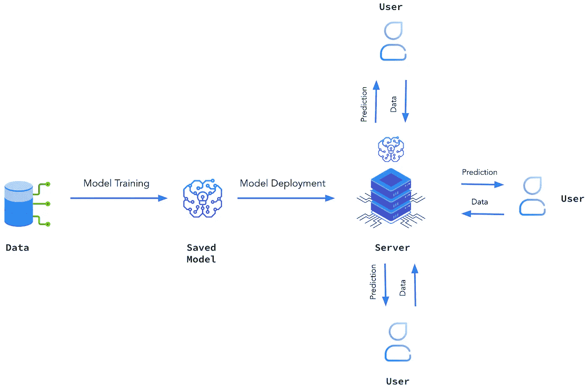
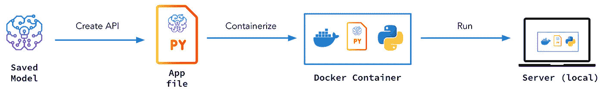
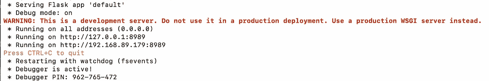
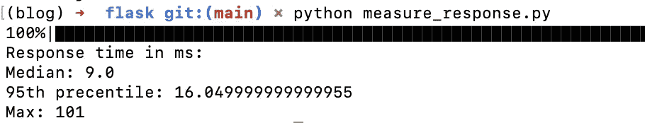
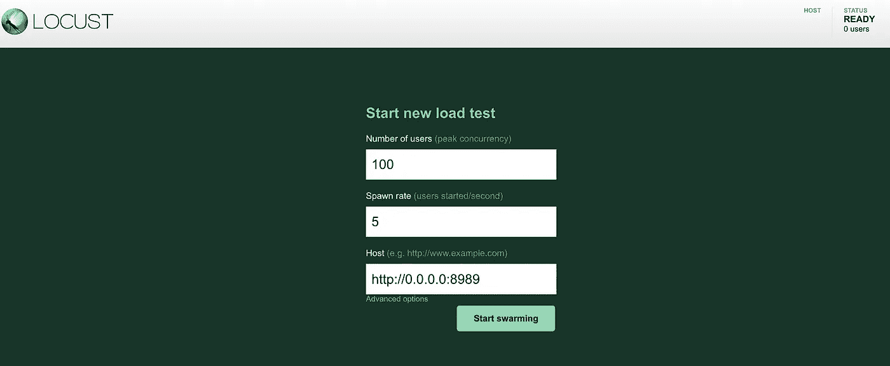
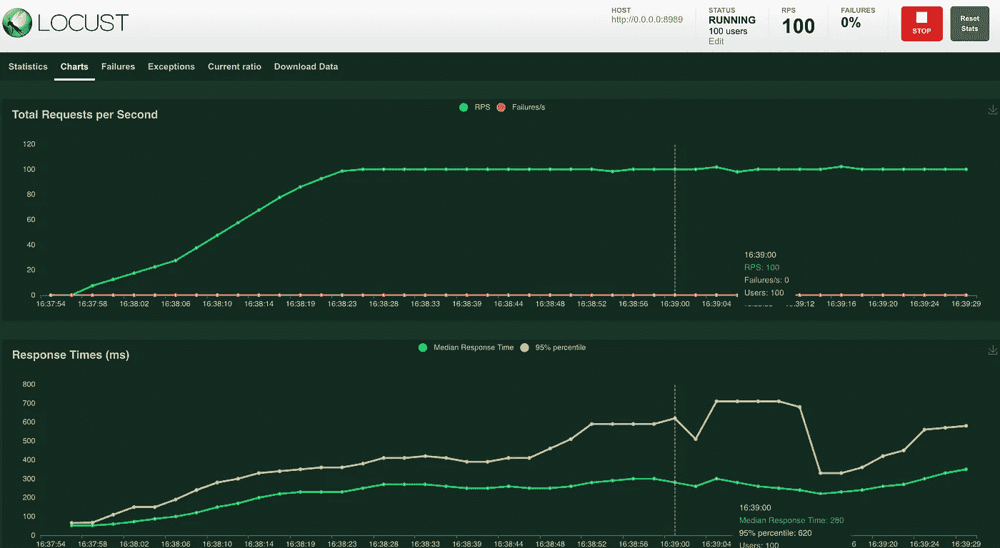
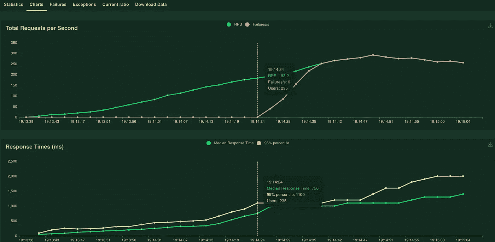

# 机器学习部署简介：Flask、Docker 与 Locust

> 原文：[`towardsdatascience.com/introduction-to-ml-deployment-flask-docker-locust-b87b5bd78a17`](https://towardsdatascience.com/introduction-to-ml-deployment-flask-docker-locust-b87b5bd78a17)

## 学习如何在 Python 中部署你的模型并使用 Locust 测量性能

[](https://medium.com/@antonsruberts?source=post_page-----b87b5bd78a17--------------------------------)[](https://towardsdatascience.com/?source=post_page-----b87b5bd78a17--------------------------------) [Antons Tocilins-Ruberts](https://medium.com/@antonsruberts?source=post_page-----b87b5bd78a17--------------------------------)

·发表于 [Towards Data Science](https://towardsdatascience.com/?source=post_page-----b87b5bd78a17--------------------------------) ·阅读时间 9 分钟·2023 年 2 月 27 日

--


摄影师 [İsmail Enes Ayhan](https://unsplash.com/@ismailenesayhan?utm_source=medium&utm_medium=referral) 在 [Unsplash](https://unsplash.com/?utm_source=medium&utm_medium=referral) 上的照片

# 介绍

你已经在 EDA 上花费了大量时间，精心设计了特征，调优了模型好几天，终于在测试集上得到了表现良好的结果。那么接下来呢？现在，朋友，我们需要部署这个模型。毕竟，任何停留在笔记本中的模型都没有价值，不论它有多好。

学习数据科学工作流的这一部分可能会让人感到不知所措，尤其是当你没有太多软件工程经验时。不过不用担心，这篇文章的主要目的是通过介绍 Python 中最流行的部署框架之一——Flask，帮助你入门。此外，你还将学习如何对部署进行容器化并测量其性能，这两个步骤常常被忽视。

# “部署”到底是什么？

首先，让我们澄清一下在这篇文章中“部署”是什么意思。机器学习部署是将训练好的模型整合到生产系统（下图中的服务器）中的过程，使其可以供最终用户或其他系统使用。



模型部署图。图片来源：作者。

请记住，实际的部署过程比简单地使模型对最终用户可用要复杂得多。它还涉及与其他系统的服务集成、选择适当的基础设施、负载均衡和优化，以及对所有这些组件的全面测试。这些步骤中的大多数超出了本帖的范围，理想情况下应由经验丰富的软件/ML 工程师处理。然而，了解这些领域的一些内容还是很重要的，这就是为什么本帖将涵盖容器化、推理速度测试和负载处理。

# 设置

所有代码可以在这个 GitHub [repo](https://github.com/aruberts/tutorials/tree/main/deployment) 中找到。我将展示其中的一些片段，但请确保拉取并进行实验，这才是最好的学习方式。要运行代码，你需要安装 `docker`、`flask`、`fastapi` 和 `locust`。根据你运行此代码的环境，可能还需要安装一些额外的依赖。

# 项目概述

为了使学习更加实际，本帖将展示一个简单的贷款违约预测模型的演示部署。模型训练过程不在本帖范围内，因此已经训练并序列化的 CatBoost 模型可以在 GitHub [repo](https://github.com/aruberts/tutorials/tree/main/deployment) 中找到。该模型在预处理过的 [美国小企业管理局数据集](https://www.kaggle.com/datasets/mirbektoktogaraev/should-this-loan-be-approved-or-denied)（CC BY-SA 4.0 许可证）上训练。请随意浏览数据字典以了解每一列的含义。

本项目主要集中在服务部分，即使模型对其他系统可用。因此，模型实际上将在你的本地机器上部署，这对于测试来说是好的，但在现实世界中并不理想。Flask 和 FastAPI 的部署将遵循以下主要步骤：

1.  创建 API 端点（使用 Flask 或 FastAPI）

1.  使用 Docker 对应用程序（端点）进行容器化

1.  在本地运行 Docker 镜像，创建一个服务器

1.  测试服务器性能



项目流程图。图片由作者提供。

听起来很激动人心，对吧？那么，我们开始吧！

# 什么是 Flask？

Flask 是一个流行且广泛采用的 Python 网络框架，由于其轻量级特性和最低的安装要求而受到青睐。它提供了一种简单的方法来开发 REST API，非常适合服务机器学习模型。

Flask 的典型工作流程包括定义一个预测 HTTP 端点，并将其链接到接收数据作为输入并生成预测作为输出的特定 Python 函数。用户和其他应用程序可以访问这个端点。

# 创建 Flask 应用

如果你只是想创建一个预测端点，那会非常简单。你需要做的就是反序列化模型，创建`Flask`应用对象，并用`POST`方法指定预测端点。关于`POST`和其他方法的更多信息，可以在[这里](https://pythonbasics.org/flask-http-methods/)找到。

上述代码中最重要的部分是`predict`函数。它读取 json 输入，在这个例子中是描述贷款申请的一堆属性。然后，它将这些数据转换为 DataFrame，并通过模型处理。最终的违约概率被格式化回 json 并返回。当这个应用程序在本地部署时，我们可以通过向`http://0.0.0.0:8989/predict`网址发送 json 格式的数据来获取预测。我们来试试吧！要启动服务器，我们可以简单地运行下面的 Python 文件。

```py
python app.py
```



预期输出。作者提供的截图。

当运行这个命令时，你应该会看到消息，显示你的应用程序正在`[`0.0.0.0:8989/`](http://0.0.0.0:8989/)`地址上运行。目前，我们暂时忽略那个大红色的警告，测试一下应用程序。为了检查应用程序是否按预期工作，我们可以向应用程序发送一个测试请求（贷款申请数据），看看是否会收到响应（违约概率预测）。

如果你成功获得了概率响应——恭喜！你已经使用自己的计算机作为服务器部署了模型。现在，让我们更进一步，使用 Docker 打包你的部署应用。

# 容器化 Flask 应用

容器化是将应用程序及其所有依赖项（包括 Python）封装到一个自包含、隔离的包中，以便在不同环境（例如本地、云端、朋友的笔记本电脑等）中一致运行的过程。你可以使用 Docker 来实现这一点，你需要做的就是正确指定 Dockerfile，构建镜像，然后运行它。Dockerfile 给你的容器提供指令，例如使用哪个版本的 Python、安装哪些包和运行哪些命令。如果你想了解更多，关于 Docker 有一个很棒的[视频教程](https://www.youtube.com/watch?v=0qG_0CPQhpg&t=138s)。

下面是 Flask 应用程序的可能外观。

现在，我们可以使用`docker build`命令构建镜像。

```py
docker build -t default-service:v01 .
```

`-t`选项允许你为你的 docker 镜像命名并提供一个标签，因此这个镜像的名称是`deafult-service`，标签是`v01`。末尾的点表示需要提供的 PATH 参数。它是模型、应用程序代码等的位置。由于我假设你是在包含所有代码的目录中构建这个镜像的，因此 PATH 设置为`.`，即当前目录。构建这个镜像可能需要一些时间，但完成后，你应该能够在运行`docker images`时看到它。

使用以下命令运行 Docker 化的应用：

```py
docker run -it --rm -p 8989:8989 default-service:v01
```

`-it`标志使 Docker 镜像以交互模式运行，这意味着你可以在 shell 中查看代码日志，并在需要时使用 Ctrl+C 停止镜像。`--rm` 确保在你停止镜像时容器会被自动移除。最后，`-p` 使 Docker 镜像内的端口对外部可用。上面的命令将 Docker 内部的 8989 端口映射到本地主机，使我们的端点在相同的地址上可用。

# 测试 Flask 应用

现在我们的模型已经成功部署，使用 Flask 部署容器已经启动并运行（至少在本地），是时候评估它的性能了。此时，我们的重点是服务指标，如响应时间和服务器处理请求的能力，而不是像 RMSE 或 F1 分数这样的机器学习指标。

## 使用脚本进行测试

为了获得响应延迟的大致估计，我们可以创建一个脚本，向服务器发送多个请求，并测量服务器返回预测的时间（通常以毫秒为单位）。然而，需要注意的是，响应时间不是恒定的，因此我们需要测量中位延迟，以估计用户通常等待响应的时间，以及 95th 延迟百分位数，以测量最坏情况。

这段代码位于 `measure_response.py` 文件中，因此我们可以简单地运行此 Python 文件来测量这些延迟指标。

```py
python measure_response.py
```



延迟指标。截图由作者提供。

中位响应时间为 9 毫秒，但最坏的情况是这个时间的 10 倍以上。这个性能是否令人满意由你和产品经理决定，但至少现在你已经了解了这些指标，并可以进一步改进它们。

## 使用 Locust 进行测试

[Locust](https://docs.locust.io/en/stable/what-is-locust.html) 是一个用于测试 web 应用性能和可扩展性的 Python 包。我们将使用 Locust 生成一个更高级的测试场景，因为它允许配置每秒用户数量（即贷款申请者）的参数。

首先，运行 `pip install locust` 可以安装该包。然后，我们需要定义一个测试场景，以指定我们的虚拟用户将如何与我们的服务器进行交互。在我们的案例中，这非常简单——用户将向我们发送一个包含其贷款申请的（JSON 格式的）信息请求，并从我们部署的模型中接收响应。

如你所见，Locust 任务与我们之前做的测试 ping 非常相似。唯一的区别是它需要被封装在一个继承自`locust.HttpUser`的类中，并且执行的任务（发送数据并获取响应）需要用`@task`进行装饰。

要开始负载测试，我们只需运行下面的命令。

```py
locust -f app_test.py
```

启动后，你将能够访问测试 UI，网址为 `http://0.0.0.0:8089`，在这里你需要指定应用的 URL、用户数量和生成速率。



Locust UI。截图由作者提供。

生成速率为 5，用户数为 100，意味着每秒将有 5 个新用户向你的应用发送请求，直到用户数量达到 100。这意味着在峰值时，我们的应用需要处理每秒 100 个请求。现在，让我们点击 **开始压力测试** 按钮并转到 UI 的图表部分。下面我将展示我机器上的结果，但它们肯定与你的不同，所以请确保也在你自己的机器上运行测试。



Locust 100 用户测试可视化。截图由作者提供。

你会发现，随着流量的增加，你的响应时间会变得越来越慢。还会有一些偶发的峰值，因此理解这些峰值发生的时间和原因是很重要的。最重要的是，Locust 帮助我们了解我们的本地服务器可以处理每秒 100 个请求，响应时间中位数约为 ~250ms。

我们可以继续对应用进行压力测试，并识别出它无法处理的负载。为此，我们将用户数量增加到 1000 以查看会发生什么。



Locust 1000 用户测试可视化。截图由作者提供。

看起来我本地服务器的崩溃点大约是 ~180 个并发用户。这是我们通过 Locust 提取出的重要信息。

# 摘要

做得好，已经走到这一步了！我希望这篇文章为你提供了一个实用且富有见地的模型部署介绍。通过跟随这个项目或将其调整到你的特定模型，你现在应该对模型部署的关键步骤有了全面的理解。具体来说，你已经掌握了使用 Flask 创建 REST API 端点、用 Docker 容器化这些端点，并使用 Locust 系统地测试这些端点的方法。

在下一篇文章中，我将介绍 FastAPI、BentoML、云部署以及更多内容，因此请确保订阅、点赞，并在有疑问时留下评论。
