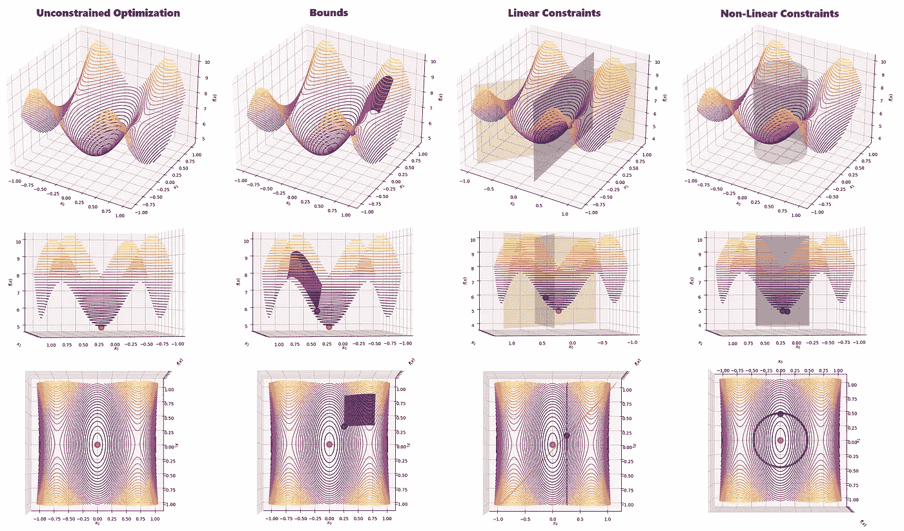

# SciPy 优化约束介绍

> 原文：[`towardsdatascience.com/introduction-to-optimization-constraints-with-scipy-7abd44f6de25?source=collection_archive---------2-----------------------#2023-01-31`](https://towardsdatascience.com/introduction-to-optimization-constraints-with-scipy-7abd44f6de25?source=collection_archive---------2-----------------------#2023-01-31)

## 探索界限、线性和非线性约束，通过实际的 Python 示例进行学习

 [Nicolo Cosimo Albanese](https://nicolo-albanese.medium.com/?source=post_page-----7abd44f6de25--------------------------------)

·

[关注](https://medium.com/m/signin?actionUrl=https%3A%2F%2Fmedium.com%2F_%2Fsubscribe%2Fuser%2F7430df412ec&operation=register&redirect=https%3A%2F%2Ftowardsdatascience.com%2Fintroduction-to-optimization-constraints-with-scipy-7abd44f6de25&user=Nicolo+Cosimo+Albanese&userId=7430df412ec&source=post_page-7430df412ec----7abd44f6de25---------------------post_header-----------) 发表在 [Towards Data Science](https://towardsdatascience.com/?source=post_page-----7abd44f6de25--------------------------------) ·8 分钟阅读·2023 年 1 月 31 日

--

图片作者提供。

# 目录

1.  介绍

1.  实现

    2.1 无约束优化

    2.2 界限

    2.3 线性约束

    2.4 非线性约束

    2.5 组合不同约束类型

1.  结论

# 1\. 介绍

优化是从一组潜在候选中选择最佳元素以达到特定目标的过程。

我们在日常生活中会执行许多优化任务：寻找到达目的地的最短或最快路线，准备按优先级排序的待办事项清单，购买杂货。

我们可以从定义**目标函数** `**f(x)**` 开始描述这些问题。

设想一下，我们正在组织一次到另一个城市的旅行，并试图评估一个合适的出发时间。在这个例子中，目标函数 `f(x)` 是出发时间 `x` 的旅行持续时间。

我们可以将优化问题公式化为**目标函数的最小值或最大值的确定**。在我们的……
