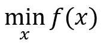

# 使用 SciPy 的优化约束介绍

> 原文：[`towardsdatascience.com/introduction-to-optimization-constraints-with-scipy-7abd44f6de25`](https://towardsdatascience.com/introduction-to-optimization-constraints-with-scipy-7abd44f6de25)

## 探索边界、线性和非线性约束，并结合实际 Python 示例

[](https://nicolo-albanese.medium.com/?source=post_page-----7abd44f6de25--------------------------------)[](https://towardsdatascience.com/?source=post_page-----7abd44f6de25--------------------------------) [Nicolo Cosimo Albanese](https://nicolo-albanese.medium.com/?source=post_page-----7abd44f6de25--------------------------------)

·发表于 [Towards Data Science](https://towardsdatascience.com/?source=post_page-----7abd44f6de25--------------------------------) ·8 分钟阅读·2023 年 1 月 31 日

--


图片由作者提供。

# 目录

1.  介绍

1.  实现

    2.1 无约束优化

    2.2 边界

    2.3 线性约束

    2.4 非线性约束

    2.5 同时应用不同约束类型

1.  结论

# 1\. 介绍

优化是从一组潜在候选元素中选择最佳元素以达到特定目标的过程。

我们在日常生活中执行许多优化任务：寻找最短或最快的到达目的地路线，准备按优先级排序的待办事项清单，购买杂货。

我们可以通过定义**目标函数**`**f(x)**`来描述此类问题。

让我们假设我们正在组织一次去另一座城市的旅行，并尝试评估一个合适的出发时间。在这个例子中，目标函数`f(x)`是出发时间`x`作为旅行持续时间的函数。

我们可以将优化问题表述为**目标函数的最小值或最大值的确定**。在我们的例子中，我们想要确定一个出发时间，以*最小化*旅行的持续时间：



在其他情况下，我们可能希望最大化`f(x)`。例如，当目标表示某种可能性或投资回报时。然而，最大化一个函数等同于最小化其负值。因此，人们可以仅关注最小化问题：


在实际应用中，我们可能需要对优化问题应用**约束**。例如，我们可能想找到最快的路线，但我们不愿意支付通行费或夜间旅行。我们将**受约束优化**定义为在一些逻辑条件下最小化目标函数，这些条件可能反映：

+   现实世界的限制；

+   输入变量的物理意义；

+   上下文情况。

在这篇文章中，我们分享了一个使用 `[SciPy](https://scipy.org/)` 的优化示例，这是一款流行的科学计算 Python 库。特别地，我们**探索最常见的约束类型**：界限、线性约束和非线性约束。

# 2\. 实现

## 2.1 无约束优化

我们从一个简单的无约束优化问题开始，然后在输入变量上添加约束。

导入所需的库：

```py
import numpy as np
import matplotlib.pyplot as plt
from scipy.optimize import minimize, Bounds, LinearConstraint, NonlinearConstraint
```

设想以下多变量目标函数：


关于`x₀`和`x₁`的梯度为


```py
def f(x):
    '''Objective function'''
    return 0.5*x[0]**2 + 2.5*x[1]**2 + 4 * x[0] * np.sin(np.pi * x[0]) + 5

def df(x):
    '''Gradient of the objective function'''
    return np.array([x[0] + 4 * np.sin(np.pi * x[0]) + 4 * np.pi * x[0] * np.cos(np.pi * x[0]), 5*x[1]])
```

让我们生成数据并观察`x₀, x₁ ∈ [-1, 1]`的函数值：

```py
# Generate data
X0, X1 = np.meshgrid(np.linspace(-1, 1, 100), np.linspace(-1, 1, 100))
Z = f(np.stack([X0, X1]))

# Plot
fig = plt.figure(figsize=(30, 20))

# First subplot
ax = fig.add_subplot(1, 3, 1, projection='3d')
ax.contour3D(X0, X1, Z, 70, cmap='plasma')
ax.set_xlabel('$x_{0}$')
ax.set_ylabel('$x_{1}$')
ax.set_zlabel('$f(x)$')

# Second subplot
ax = fig.add_subplot(1, 3, 2, projection='3d')
ax.contour3D(X0, X1, Z, 70, cmap='plasma')
ax.set_xlabel('$x_{0}$')
ax.set_ylabel('$x_{1}$')
ax.set_zlabel('$f(x)$')
ax.axes.yaxis.set_ticklabels([])
ax.view_init(0, 80)

# Third subplot
ax = fig.add_subplot(1, 3, 3, projection='3d')
ax.contour3D(X0, X1, Z, 70, cmap='plasma')
ax.set_xlabel('$x_{0}$')
ax.set_ylabel('$x_{1}$')
ax.set_zlabel('$f(x)$')
ax.axes.zaxis.set_ticklabels([])
ax.view_init(89, -90);
```


目标函数。图片由作者提供。

在我们的示例中，目标函数是**非凸**的，并且具有多个最小值。

这意味着，根据起点不同，问题可能会收敛到不同的最小化器。

我们可以利用有用的 `[scipy.optimize.minimize](https://docs.scipy.org/doc/scipy/reference/generated/scipy.optimize.minimize.html)` 函数来解决优化问题，具体如下：

```py
# Starting point
x_start = np.array([0.5, 0.5])

# Optimization
result = minimize(
    f, x_start, method='trust-constr', jac=df)

result.x.round(3)
```

值得注意的是，我们应用了 `trust-constr` 方法。它允许对受约束的函数进行优化。有关该方法的更多信息，请参见 [包文档](https://docs.scipy.org/doc/scipy/reference/optimize.minimize-trustconstr.html) 和 "*Trust-region methods*" ([Conn, Gould and Toint; 2000](https://doi.org/10.1137/1.9780898719857))。

上述代码片段返回找到的最小化器：

```py
array([-0.,  0.])
```

让我们绘制它：

```py
# Minimum from unconstrained optimization
min_x0, min_x1 = np.meshgrid(result.x[0], result.x[1])   
min_z = f(np.stack([min_x0, min_x1]))

# Plot
fig = plt.figure(figsize=(30, 20))

# First subplot
ax = fig.add_subplot(1, 3, 1, projection='3d')
ax.contour3D(X0, X1, Z, 40, cmap='plasma')
ax.scatter(min_x0, min_x1, min_z, marker='o', color='red', linewidth=10)
ax.set_xlabel('$x_{0}$')
ax.set_ylabel('$x_{1}$')
ax.set_zlabel('$f(x)$')

# Second subplot
ax = fig.add_subplot(1, 3, 2, projection='3d')
ax.contour3D(X0, X1, Z, 40, cmap='plasma')
ax.scatter(min_x0, min_x1, min_z, marker='o', color='red', linewidth=10)
ax.set_xlabel('$x_{0}$')
ax.set_ylabel('$x_{1}$')
ax.set_zlabel('$f(x)$')
ax.axes.yaxis.set_ticklabels([])
ax.view_init(0, 80)

# Third subplot
ax = fig.add_subplot(1, 3, 3, projection='3d')
ax.contour3D(X0, X1, Z, 40, cmap='plasma')
ax.scatter(min_x0, min_x1, min_z, marker='o', color='red', linewidth=10)
ax.set_xlabel('$x_{0}$')
ax.set_ylabel('$x_{1}$')
ax.set_zlabel('$f(x)$')
ax.axes.zaxis.set_ticklabels([])
ax.view_init(89, -90);
```


目标函数及其最小化器。图片由作者提供。

我们现在可以尝试添加约束。

## 2.2 界限

让我们考虑之前的示例，即在两个城市之间找到最快的旅行路线，出发时间作为输入变量。我们可能会根据一天中的时间预期找到更多或更少的交通。通过以最小化旅行时间为目标，模型也可能建议，例如，夜间旅行。

尽管这可能会导致最短的旅行时间，但我们可能更喜欢白天旅行。因此，我们可以要求模型在早上 7:00 到下午 6:00 之间的出发时间范围内找到最短的旅行时间。

这时界限就派上用场了。界限只是对输入变量的**等式或不等式约束**。它们允许仅**在指定范围之间**评估目标函数。

在我们的情况下，假设`x₀`和`x₁`有以下可接受的值：


我们可以轻松地将这些值传递给`[Bounds](https://docs.scipy.org/doc/scipy/reference/generated/scipy.optimize.Bounds.html)`对象，并进行新的优化实验，如下所示：

```py
lim = [0.25, 0.30, 0.75, 0.8]

bounds = Bounds([lim[0], lim[1]],  # [min x0, min x1]
                [lim[2], lim[3]])  # [max x0, max x1]

result = minimize(
    f, x_start, method='trust-constr', jac=df, bounds=bounds)

result.x.round(3)
```

优化任务现在导致了一个不同的解决方案，因为之前的点`array([0 , 0])`不在可行区域内：

```py
array([0.25, 0.301])
```

我们可以最终绘制新的最小值和可行区域，并观察`f(x)`被评估的区域：

```py
# Feasible region (bounds)
X0_bound, X1_bound = np.meshgrid(np.linspace(lim[0], lim[2], 20), np.linspace(lim[1], lim[3], 20))
Z_bound = f(np.stack([X0_bound, X1_bound]))

# New minimum within bounds
min_x0_bounds, min_x1_bounds = np.meshgrid(result.x[0], result.x[1])   
min_z_bounds = f(np.stack([min_x0_bounds, min_x0_bounds]))

# Plot
fig = plt.figure(figsize=(30, 20))

# First subplot
ax = fig.add_subplot(1, 3, 1, projection='3d')
ax.contour3D(X0, X1, Z, 40, cmap='plasma')
ax.scatter(min_x0, min_x1, min_z, marker='o', color='red', linewidth=10)
ax.scatter(min_x0_bounds, min_x1_bounds, min_z_bounds, marker='o', color='blue', linewidth=10)
ax.plot_surface(X0_bound, X1_bound, Z_bound, color='black', alpha=0.6)
ax.set_xlabel('$x_{0}$')
ax.set_ylabel('$x_{1}$')
ax.set_zlabel('$f(x)$')

# Second subplot
ax = fig.add_subplot(1, 3, 2, projection='3d')
ax.contour3D(X0, X1, Z, 40, cmap='plasma')
ax.scatter(min_x0, min_x1, min_z, marker='o', color='red', linewidth=10)
ax.scatter(min_x0_bounds, min_x1_bounds, min_z_bounds, marker='o', color='blue', linewidth=10)
ax.plot_surface(X0_bound, X1_bound, Z_bound, color='black', alpha=0.6)
ax.set_xlabel('$x_{0}$')
ax.set_ylabel('$x_{1}$')
ax.set_zlabel('$f(x)$')
ax.axes.yaxis.set_ticklabels([])
ax.view_init(0, 80)

# Third subplot
ax = fig.add_subplot(1, 3, 3, projection='3d')
ax.contour3D(X0, X1, Z, 40, cmap='plasma')
ax.scatter(min_x0, min_x1, min_z, marker='o', color='red', linewidth=10)
ax.scatter(min_x0_bounds, min_x1_bounds, min_z_bounds, marker='o', color='blue', linewidth=10)
ax.plot_surface(X0_bound, X1_bound, Z_bound, color='black', alpha=0.6)
ax.set_xlabel('$x_{0}$')
ax.set_ylabel('$x_{1}$')
ax.set_zlabel('$f(x)$')
ax.axes.zaxis.set_ticklabels([])
ax.view_init(89, -90);
```


目标函数的“无约束”最小值（红点）和应用边界后的最小值（蓝点）。应用的变量范围标识了灰色区域（可行区域）。

## 2.3 线性约束

线性约束定义了优化变量之间的线性关系。例如，假设`x₀`和`x₁`受到以下约束：


我们可以轻松地将这些条件重写为线性系统，并在运行优化任务之前将其传递给`[LinearConstraint](https://docs.scipy.org/doc/scipy/reference/generated/scipy.optimize.LinearConstraint.html)`对象：


线性约束。图片由作者提供。

```py
linear_constraint = LinearConstraint(
    [[1, 0], [1, -1]], [0.25, -np.inf], [np.inf, 0.1])

result = minimize(
    f, x_start, method='trust-constr', jac=df, constraints=linear_constraint)

result.x.round(3)
```

新解决方案是

```py
array([0.25, 0.15])
```

`f(x)`的可行区域对应于由超平面交集限定的空间的一部分。让我们绘制这些边界：

```py
# Linear constraints: first hyperplane
X0_lin_1 = np.repeat(0.25, 20)
X1_lin_1, Z_lin_1 = np.meshgrid(np.linspace(-1, 1, 20), np.linspace(4, 10, 20))

# Linear constraints: second hyperplane
X1_lin_2 = np.linspace(-1, 1, 20)
X0_lin_2 = X1_lin_2 + 0.1

# New minimum with linear constraints
min_x0_lin_constr, min_x1_lin_constr = np.meshgrid(result.x[0], result.x[1])   
min_z_lin_constr = f(np.stack([min_x0_lin_constr, min_x0_lin_constr]))

# Plot
fig = plt.figure(figsize=(30, 20))

# First subplot
ax = fig.add_subplot(1, 3, 1, projection='3d')
ax.contour3D(X0, X1, Z, 40, cmap='plasma')
ax.scatter(min_x0, min_x1, min_z, marker='o', color='red', linewidth=10)
ax.scatter(min_x0_lin_constr, min_x1_lin_constr, min_z_lin_constr, marker='o', color='blue', linewidth=10)
ax.plot_surface(X0_lin_1, X1_lin_1, Z_lin_1, color='green', alpha=0.3)
ax.plot_surface(X0_lin_2, X1_lin_2, Z_lin_1, color='yellow', alpha=0.2)
ax.set_xlabel('$x_{0}$')
ax.set_ylabel('$x_{1}$')
ax.set_zlabel('$f(x)$')

# Second subplot
ax = fig.add_subplot(1, 3, 2, projection='3d')
ax.contour3D(X0, X1, Z, 40, cmap='plasma')
ax.scatter(min_x0, min_x1, min_z, marker='o', color='red', linewidth=10)
ax.scatter(min_x0_lin_constr, min_x1_lin_constr, min_z_lin_constr, marker='o', color='blue', linewidth=10)
ax.plot_surface(X0_lin_1, X1_lin_1, Z_lin_1, color='green', alpha=0.2)
ax.plot_surface(X0_lin_2, X1_lin_2, Z_lin_1, color='yellow', alpha=0.2)
ax.set_xlabel('$x_{0}$')
ax.set_ylabel('$x_{1}$')
ax.set_zlabel('$f(x)$')
ax.axes.yaxis.set_ticklabels([])
ax.view_init(0, 80)

# Third subplot
ax = fig.add_subplot(1, 3, 3, projection='3d')
ax.contour3D(X0, X1, Z, 40, cmap='plasma')
ax.scatter(min_x0, min_x1, min_z, marker='o', color='red', linewidth=10)
ax.scatter(min_x0_lin_constr, min_x1_lin_constr, min_z_lin_constr, marker='o', color='blue', linewidth=10)
ax.plot_surface(X0_lin_1, X1_lin_1, Z_lin_1, color='green', alpha=1)
ax.plot_surface(X0_lin_2, X1_lin_2, Z_lin_1, color='yellow', alpha=1)
ax.set_xlabel('$x_{0}$')
ax.set_ylabel('$x_{1}$')
ax.set_zlabel('$f(x)$')
ax.axes.zaxis.set_ticklabels([])
ax.view_init(89, -90);
```


目标函数。蓝点是通过应用线性约束确定的最小值，其边界显示为超平面。图片由作者提供。

## 2.4 非线性约束

我们还可以使用`[NonlinearConstraint](https://docs.scipy.org/doc/scipy/reference/generated/scipy.optimize.NonlinearConstraint.html)`对象在非线性约束定义的区域内探索目标函数。假设`x₀`和`x₁`受到以下约束：


我们优化`f(x)`的方法如下：

```py
non_linear_eq= lambda x: x[0]**2 + x[1]**2

non_linear_constr = NonlinearConstraint(
    non_linear_eq, 0.2, np.inf)

result = minimize(
    f, np.array([0.5, 1]), method='trust-constr', jac=df, constraints=non_linear_constr)

result.x.round(3)
```

```py
array([-0., 0.447])
```

类似于之前的示例，我们可以观察到在当前约束下的目标函数和找到的最小值。


可行区域位于由非线性约束定义的圆柱体外部。图片由作者提供。

## 2.5 结合不同的约束类型

我们可以结合边界以及线性和非线性约束，如下所示：

```py
result = minimize(
    f, 
    x_start, 
    method='trust-constr', 
    jac=df, 
    bounds=bounds,
    constraints=[linear_constraint, non_linear_constr]
)

result.x.round(3)
```

```py
array([0.25, 0.371])
```

我们指出，并非所有优化方法都支持边界和/或约束。更多信息可以在[包文档](https://docs.scipy.org/doc/scipy/reference/generated/scipy.optimize.minimize.html)中找到。

# 3\. 结论

在这篇文章中，我们探索了不同类型的优化约束。特别是，我们分享了使用`SciPy`库的实际 Python 示例。这些示例配有图表，可以直观地检查不同的约束。

相关帖子：

[](/survival-analysis-optimize-the-partial-likelihood-of-the-cox-model-b56b8f112401?source=post_page-----7abd44f6de25--------------------------------) ## 生存分析：优化 Cox 模型的部分似然

### 在 Python 中寻找最大化对数部分似然的系数

[towardsdatascience.com
