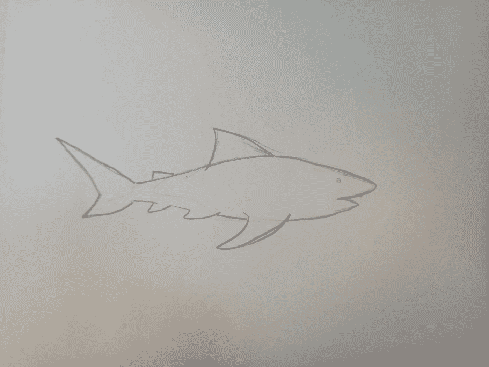
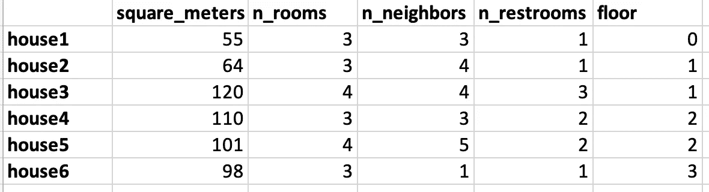
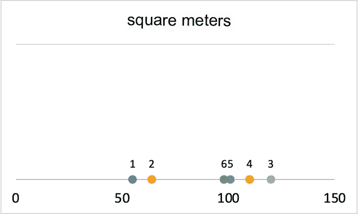
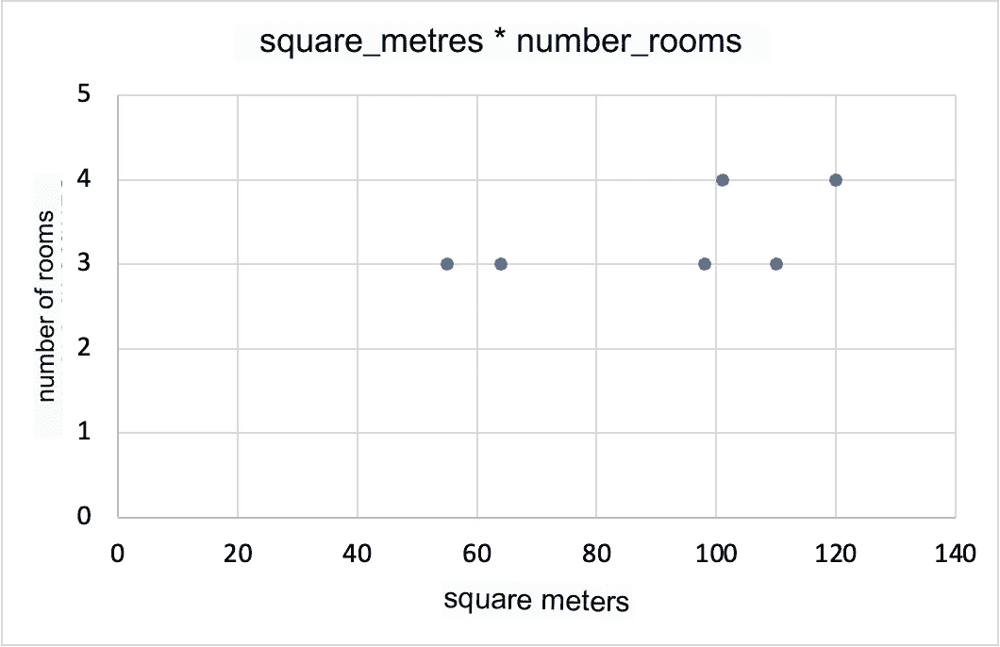
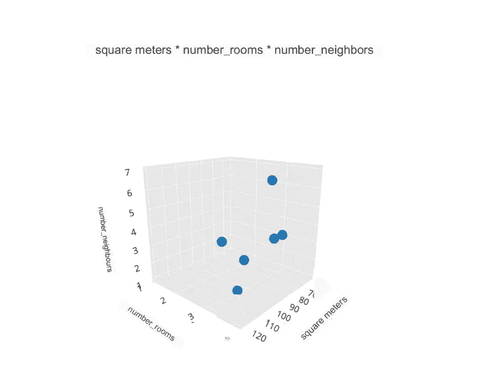
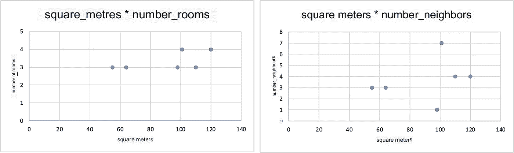
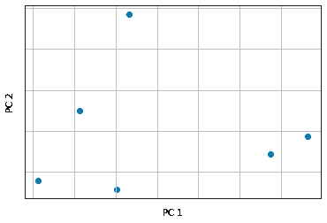
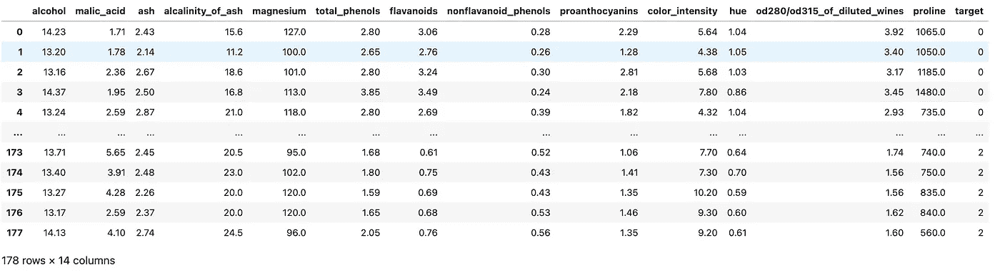
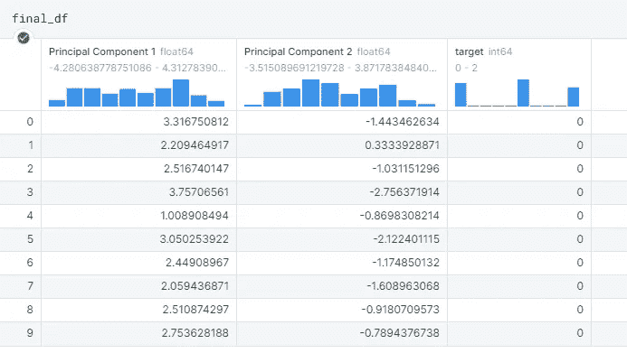
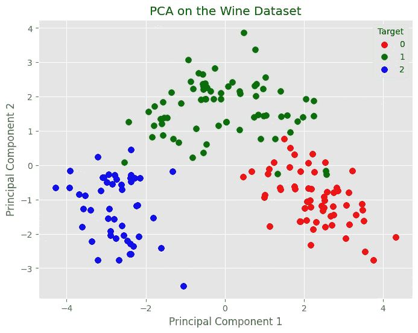

# 使用 Sklearn、Pandas 和 Matplotlib 进行 PCA 的介绍

> 原文：[`towardsdatascience.com/introduction-to-pca-in-python-with-sklearn-pandas-and-matplotlib-476880f30238`](https://towardsdatascience.com/introduction-to-pca-in-python-with-sklearn-pandas-and-matplotlib-476880f30238)

## *通过将多维数据集转换为任意数量的维度，并使用 Matplotlib 可视化降维数据，来学习 PCA 在 Python 和 Sklearn 中的直观感受*

[](https://medium.com/@theDrewDag?source=post_page-----476880f30238--------------------------------)[](https://towardsdatascience.com/?source=post_page-----476880f30238--------------------------------) [安德烈亚·达戈斯提诺](https://medium.com/@theDrewDag?source=post_page-----476880f30238--------------------------------)

·发表于[面向数据科学](https://towardsdatascience.com/?source=post_page-----476880f30238--------------------------------) ·13 分钟阅读·2023 年 9 月 6 日

--


图片由[Nivenn Lanos](https://unsplash.com/@nivenn?utm_source=medium&utm_medium=referral)提供，来源于[Unsplash](https://unsplash.com/?utm_source=medium&utm_medium=referral)

作为数据分析师和科学家，我们经常面临由于信息量不断增长而带来的复杂挑战。

不可否认，从各种来源积累的数据已经成为我们生活中的常态。不管是否是数据科学家，**几乎每个人都将现象描述为一组变量或属性**。

在解决分析挑战时，处理多维数据集是非常罕见的——这在今天尤其明显，因为数据收集越来越自动化，技术使我们能够从各种来源获取信息，包括**传感器、物联网设备、社交媒体、在线交易等等**。

但随着现象的复杂性增加，数据科学家面临的挑战也会增加，以实现他们的目标。

这些挑战可能包括…

+   **高维度**：拥有许多列可能导致高维度问题，这会使模型变得更加复杂且难以解释。

+   **噪声数据**：数据的自动收集可能会导致错误、缺失数据或不可靠的数据。

+   **解释**：高维度意味着低可解释性——很难理解某个问题的最有影响力的特征是什么。

+   **过拟合**：过于复杂的模型可能会遭遇过拟合，即对训练数据的过度适应，导致在新数据上的泛化能力低。

+   **计算资源**：分析大型复杂数据集通常需要大量计算资源。可扩展性是一个重要考虑因素。

+   **结果的沟通**：从多维数据集中得到的发现以易于理解的方式进行解释是一项重要挑战，尤其是在与非技术利益相关者沟通时。

我写了一篇与此话题相关的文章，你可以在这里阅读

[](/why-having-many-features-can-hinder-your-models-performance-865369b6b8b1?source=post_page-----476880f30238--------------------------------) ## 为什么特征过多会阻碍模型性能

### 特征工程的活动对于提升预测模型的性能非常有用。然而，它…

towardsdatascience.com

## 数据科学和机器学习中的多维性

在数据科学和机器学习中，多维数据集是一个组织化的数据集合，包括多个列或属性，每个列或属性表示现象研究对象的一个特征（或属性）。

包含有关房屋信息的数据集是一个具体的多维数据集的例子。事实上，每栋房屋可以用其平方米、房间数量、是否有车库等特征来描述。

在这篇文章中，**我们将探讨如何有效地使用 PCA 来简化和可视化多维数据**，使复杂的多维信息变得易于理解。

通过遵循本指南，你将学习：

+   **PCA 算法背后的直觉**

+   **在玩具数据集上应用 Sklearn 的 PCA**

+   使用 Matplotlib 来 **可视化减少的数据**

+   PCA 在数据科学中的**主要用例**

让我们开始吧！

# PCA 算法的基本直觉

主成分分析（*PCA*）是一种无监督统计技术，用于**多维数据的分解**。

其主要目的是将我们的多维数据集减少为若干个任意变量，以便于

+   **选择原始数据集中重要的特征**

+   **提高信噪比**

+   **创建新的特征**以提供给机器学习模型

+   **可视化多维数据**

根据我们选择的组件数量，PCA 算法通过保留那些*最能解释数据集总方差的变量*，实现对原始数据集中变量数量的减少。PCA 对抗着那个臭名昭著的*维度灾难*。

**维度灾难**是机器学习中的一个概念，指的是处理高维数据时遇到的困难。

随着尺寸的增加，为了可靠地表示一组数据所需的数据量呈指数增长。**这可能使得在数据中发现有趣的模式变得困难，并且可能在自动学习模型中导致过拟合问题。**

> PCA 应用的转换通过创建最能解释原始数据方差的组件来减少数据集的大小。这使得可以隔离最相关的变量，并减少数据集的复杂性。

**PCA 通常是一项难以理解的技术**，特别是对于数据科学和分析领域的新手。

这种困难的原因必须追溯到算法的严格数学基础。

*那么，从数学角度看，PCA 做了什么？*

> PCA 允许我们将一个 n 维数据集投影到一个低维平面上。

看起来很复杂，但实际上并不是。让我们用一个简单的例子试试：

> 当我们在纸上画东西时，我们实际上是在将一个心理表征（我们可以用三维表示）投影到纸上。**这样做会降低表征的质量和精确度。**

然而，纸上的表征仍然可以理解，甚至可以与我们的同龄人分享。

实际上，在绘制过程中，我们表示形式、线条和阴影，以便让观察者理解我们在脑海中想到的内容。

让我们以这张鲨鱼的图片为例：


Foto di [David Clode](https://unsplash.com/it/@davidclode?utm_source=unsplash&utm_medium=referral&utm_content=creditCopyText) su [Unsplash](https://unsplash.com/it/foto/OCWu7r9XP-Q?utm_source=unsplash&utm_medium=referral&utm_content=creditCopyText)

如果我们想在一张纸上绘制它，根据我们的技能水平（正如你所见，我的技能水平很低），我们可以这样表示：



作者提供的图像。

问题在于，尽管表征并不是完美的 1:1，**观察者仍然可以很容易理解这幅画代表了一只鲨鱼。**

实际上，我们使用的“心理”算法类似于 PCA——我们降低了维度，从而降低了摄影中的鲨鱼特征，并**仅使用了最相关的维度来在纸上传达“鲨鱼”的概念。**

从数学角度来说，我们不仅仅想把对象投影到一个低维平面上，**而且我们还希望尽可能保留最相关的信息。**

# 数据压缩

我们将使用一个简单的数据集进行示例。这个数据集包含了房屋的结构信息，例如平方米大小、房间数量等。



示例数据集。作者提供的图像。

这里的目标是展示在处理多维数据集时，**数据可视化的局限性**是多么容易接近，以及 PCA 如何帮助我们克服这些局限性。

> 数据集的维度可以简单地理解为其中列的数量。一列代表我们研究现象的一个属性或特征。维度越多，现象越复杂。

在这种情况下，我们有一个 5 维的数据集。

*但数据可视化中存在哪些局限性*？让我通过分析*平方米*变量来解释一下。



图片由作者提供。

房子 1 和 2 的*平方米*值较低，而其他房子的值都在 100 左右或更高。**这是一个一维图，因为我们只考虑了一个变量。**

现在让我们为图表添加一个维度。



图片由作者提供。

这种图表被称为*散点图*，显示了两个变量之间的关系。它非常有助于可视化变量之间的相关性和交互作用。

这种可视化已经开始引入较高的解释复杂性，因为即使是专家分析师也需要仔细检查才能理解变量之间的关系。

现在让我们再插入一个变量。



图片由作者提供。

**这绝对是一个复杂的图像处理问题**。然而，从数学角度来看，这种可视化是完全合理的。从感知和解释的角度来看，**我们已经达到了人类理解的极限。**

我们都知道，我们对世界的解释停留在三维。然而，我们也知道这个数据集具有 5 个维度。

*但我们如何查看所有这些？*

我们不能，除非我们将所有变量之间的二维关系并排可视化。

在下面的例子中，我们可以看到*平方米*与*n_rooms*和*n_neighbors*在两个维度上的关系。



图片由作者提供。

现在让我们想象将所有可能的组合放在一起……我们很快会被需要记住的大量信息所淹没。

这就是 PCA 发挥作用的地方。使用 Python（稍后会看到），我们可以对这个数据集应用 Sklearn 的 PCA 类，并获得这样的图表。



图片由作者提供。

我们看到的是一个显示 PCA 返回的主成分的图表。

实际上，PCA 算法**对数据执行线性变换，以找到最佳解释数据集总方差的特征线性组合。**

这种特征组合被称为**主成分**。这个过程会对每个主要成分重复，直到达到所需的成分数量。

> 使用 PCA 的优势在于，它允许我们通过保留最重要的信息来减少数据的维度，消除不相关的数据，使数据更容易可视化和用于构建机器学习模型。

如果你有兴趣深入了解 PCA 背后的数学，我建议以下英文资源：

+   [逐步解释 PCA 的 StatQuest](https://www.youtube.com/watch?v=FgakZw6K1QQ&ref=diariodiunanalista.it)

+   主成分分析 (PCA) 视觉解释，无需数学

# Python 实现

要在 Python 中应用 PCA，我们可以使用 scikit-learn，它提供了一个简单有效的实现。

在此链接中您可以阅读 [PCA 文档](https://scikit-learn.org/stable/modules/generated/sklearn.decomposition.PCA.html?ref=diariodiunanalista.it)。

我们将使用 *wine dataset* 作为示例的玩具数据集。wine dataset 是 Scikit-Learn 的一部分，并且在知识共享许可协议下，署名 4.0，免费使用和共享（[许可证可在这里查看](https://archive.ics.uci.edu/dataset/109/wine)）。

让我们开始必需的库

```py
# import the required libs
from sklearn.datasets import load_wine
from sklearn.decomposition import PCA
import matplotlib.pyplot as plt

# load the dataset
wine = load_wine()

# convert the object in a pandas dataframe
df = pd.DataFrame(data=wine.data, columns=wine.feature_names)
df["target"] = wine.target
df
>>>
```



图片来源于作者。

数据的维度是 (178, 14) —— 这意味着有 178 行（机器学习模型可以学习的示例），每行由 14 个维度描述。

我们需要在应用 PCA 之前进行数据标准化。您可以使用 Sklearn 完成这一步。

```py
# normalize data
from sklearn.preprocessing import StandardScaler
X_std = StandardScaler().fit_transform(df.drop(columns=["target"]))
```

***使用 PCA 时重要的是对数据进行标准化：*** *它计算数据集的新投影，新轴基于变量的标准差。*

我们现在准备好减少大小。我们可以这样简单地应用 PCA

```py
# PCA object specifying the number of principal components desired
pca = PCA(n_components=2) # we want to project two dimensions so that we can visualize them!

# We fit the PCA model on standardized data
vecs = pca.fit_transform(X_std)
```

我们可以指定任何数量的 PCA 输出维度，只要它们少于 14，这是原始数据集的总维度。

现在让我们将数据框的小版本组织成一个新的 Pandas Dataframe 对象：

```py
reduced_df = pd.DataFrame(data=vecs, columns=['Principal Component 1', 'Principal Component 2'])
final_df = pd.concat([reduced_df, df[['target']]], axis=1)
final_df
>>>
```



图片来源于作者。

主成分 1 和 2 是 PCA 的输出维度，现在可以用散点图进行可视化。

```py
plt.figure(figsize=(8, 6)) # set the size of the canvas
targets = list(set(final_df['target'])) # we create a list of possible targets (there are 3)
colors = ['r', 'g', 'b'] # we define a simple list of colors to differentiate the targets

# loop to assign each point to a target and color
for target, color in zip(targets, colors):
     idx = final_df['target'] == target
     plt.scatter(final_df.loc[idx, 'Principal Component 1'], final_df.loc[idx, 'Principal Component 2'], c=color, s=50)

# finally, we show the graph
plt.legend(targets, title="Target", loc='upper right')
plt.xlabel('Principal Component 1')
plt.ylabel('Principal Component 2')
plt.title('PCA on Wine Dataset')
plt.show()
```



减少数据集的效果图。图片来源于作者。

就这样。这个图表展示了由 14 个初始变量描述的葡萄酒之间的差异，但通过 PCA 减少到 2 个维度。**PCA 保留了相关信息，同时减少了数据集中的噪声。**

这是使用 Sklearn、Pandas 和 Matplotlib 在 Python 中应用 PCA 的完整代码。

```py
import pandas as pd
from sklearn.decomposition import PCA
import matplotlib.pyplot as plt

wine = load_wine()

df = pd.DataFrame(data=wine.data, columns=wine.feature_names)

df["target"] = wine.target

from sklearn.preprocessing import StandardScaler
X_std = StandardScaler().fit_transform(df.drop(columns=["target"]))

pca = PCA(n_components=2)

vecs = pca.fit_transform(X_std)

reduced_df = pd.DataFrame(data=vecs, columns=['Principal Component 1', 'Principal Component 2'])
final_df = pd.concat([reduced_df, df[['target']]], axis=1)

plt.figure(figsize=(8, 6))
targets = list(set(final_df['target']))
colors = ['r', 'g', 'b']

for target, color in zip(targets, colors):
    idx = final_df['target'] == target
    plt.scatter(final_df.loc[idx, 'Principal Component 1'], final_df.loc[idx, 'Principal Component 2'], c=color, s=50)

plt.legend(targets, title="Target", loc='upper right')
plt.xlabel('Principal Component 1')
plt.ylabel('Principal Component 2')
plt.title('PCA on the Wine Dataset')
plt.show()
```

# PCA 的应用场景

以下是数据科学中最常见的 PCA 用例列表。

## 提高机器学习模型训练速度

PCA 压缩的数据提供了重要信息，并且更容易被机器学习模型消化，现在模型基于少量特征进行学习，而不是原始数据集中所有的特征。

## 特征选择

PCA 本质上是一种特征选择工具。应用 PCA 时，我们寻找那些能最好地解释数据集方差的特征。

我们可以对主成分进行排名，并按重要性进行排序，第一主成分解释最多的方差，最后一个主成分解释最少的方差。

通过分析主成分，可以回到原始特征，并排除那些对保留 PCA 创建的降维平面中的信息没有贡献的特征。

## 异常检测

PCA 常用于异常识别，因为它可以帮助识别数据中用肉眼难以辨别的模式。

异常通常表现为在较低维空间中远离主要群体的数据点，使它们更容易被检测到。

## 信号检测

与异常识别相比，PCA 在信号检测中也非常有用。

确实，正如 PCA 可以突出异常值，它也可以去除不贡献于数据总变异性的“噪声”。在语音识别的背景下，这使得用户能够更好地隔离语音痕迹，并改进基于语音的人物识别系统。

## 图像压缩

如果我们有特定的约束，例如将图像保存为特定格式，那么处理图像可能很昂贵。简而言之，PCA 可以用于压缩图像，同时仍保持其中的信息。

这使得机器学习算法可以更快地训练，但会以压缩信息的某种质量为代价。

# 结论

感谢您的关注 🙏 我希望你享受阅读并学到了新的知识。

总结

+   你了解了数据集的维度意味着什么以及拥有多个维度所带来的局限性

+   你了解了 PCA 算法如何直观地一步步工作

+   你学会了如何使用 Sklearn 在 Python 中实现 PCA

+   最后，你了解了 PCA 在数据科学中的最常见应用场景

如果你觉得这篇文章有用，请与你的朋友或同事分享。

下次见，

安德鲁

**如果你想支持我的内容创作活动，请随意使用下面的推荐链接加入 Medium 的会员计划**。我将获得你投资的一部分，你将能够无缝地访问 Medium 上大量的数据科学及其他领域的文章。

[](https://medium.com/@theDrewDag/membership?source=post_page-----476880f30238--------------------------------) [## 使用我的推荐链接加入 Medium - 安德烈亚·达戈斯蒂诺]

### 作为 Medium 会员，你的会员费用的一部分将用于支持你阅读的作者，而你可以完全访问每一个故事……

medium.com](https://medium.com/@theDrewDag/membership?source=post_page-----476880f30238--------------------------------)

# 推荐阅读

对感兴趣的人，这里有一份我推荐的关于每个 ML 相关主题的书单。这些书在我看来是**必读**的，并且对我的职业生涯产生了重大影响。

*免责声明：这些是亚马逊的联盟链接。我将从亚马逊获得少量佣金作为推荐这些商品的回报。您的体验不会改变，您也不会多付费用，但这将帮助我扩大业务并制作更多与 AI 相关的内容。*

+   **机器学习简介:** [*自信的数据技能：掌握数据处理基础知识，提升职业生涯*](https://amzn.to/3ZzKTz6) 作者 **基里尔·埃雷门科**

+   **Sklearn / TensorFlow:** [*实战机器学习：使用 Scikit-Learn、Keras 和 TensorFlow*](https://amzn.to/433F4Nm) 作者 **奥雷利安·热龙**

+   **NLP:** [*文本作为数据：机器学习与社会科学的新框架*](https://amzn.to/3zvH43j) 作者 **贾斯廷·格里默**

+   **Sklearn / PyTorch:** [*使用 PyTorch 和 Scikit-Learn 进行机器学习：用 Python 开发机器学习和深度学习模型*](https://amzn.to/3Gcavve) 作者 **塞巴斯蒂安·拉什卡**

+   **数据可视化:** [*用数据讲故事：商业专业人士的数据可视化指南*](https://amzn.to/3HUtGtB) 作者 **科尔·克纳夫利克**

# 有用的链接（由我撰写）

+   **学习如何在 Python 中执行一流的探索性数据分析**: *Python 中的探索性数据分析——逐步过程*

+   **学习 TensorFlow 基础知识**: [*开始使用 TensorFlow 2.0 —— 深度学习入门*](https://medium.com/towards-data-science/a-comprehensive-introduction-to-tensorflows-sequential-api-and-model-for-deep-learning-c5e31aee49fa)

+   **使用 TF-IDF 在 Python 中进行文本聚类**: [*在 Python 中使用 TF-IDF 进行文本聚类*](https://medium.com/mlearning-ai/text-clustering-with-tf-idf-in-python-c94cd26a31e7)
