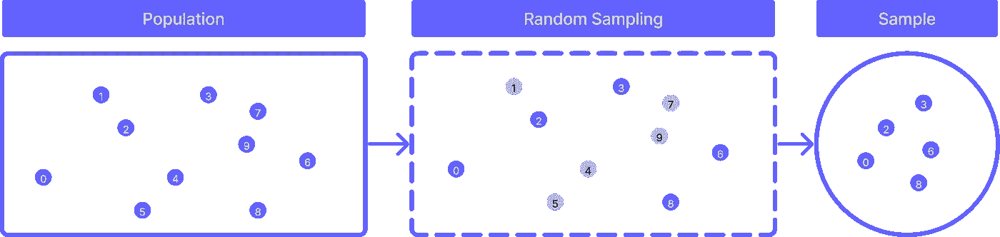
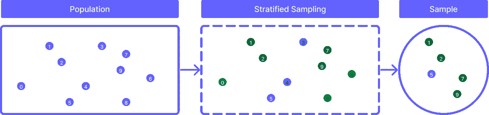
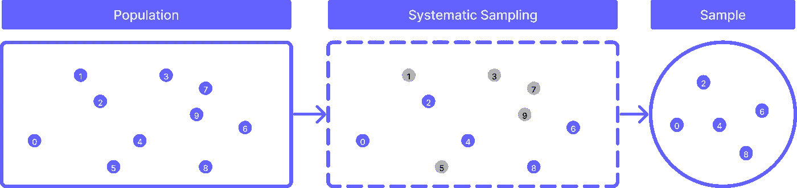
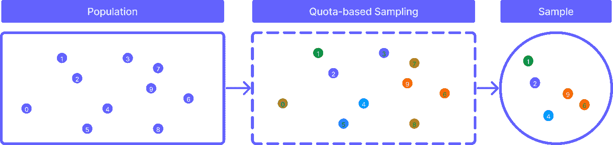
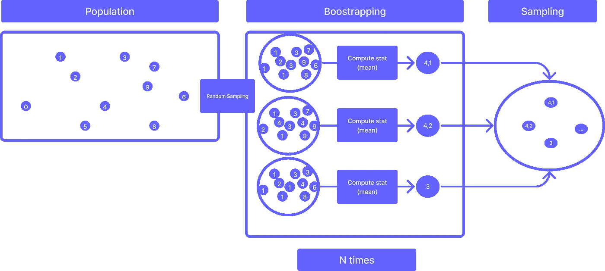

# 统计抽样与重抽样介绍

> 原文：[`towardsdatascience.com/introduction-to-statistical-sampling-and-resampling-1a6110965c3a`](https://towardsdatascience.com/introduction-to-statistical-sampling-and-resampling-1a6110965c3a)

## *统计抽样是统计学的一个基本组成部分，它使我们能够有效地获得感兴趣的群体的信息，而不需要直接研究它*

 [Andrea D'Agostino](https://medium.com/@theDrewDag?source=post_page-----1a6110965c3a--------------------------------)

·发表于 [Towards Data Science](https://towardsdatascience.com/?source=post_page-----1a6110965c3a--------------------------------) ·阅读时间 10 分钟·2023 年 5 月 16 日

--

图片来源：[Testalize.me](https://unsplash.com/@testalizeme?utm_source=medium&utm_medium=referral) 在 [Unsplash](https://unsplash.com/?utm_source=medium&utm_medium=referral)

任何研究人员最隐秘的愿望之一就是能够拥有他/她打算研究的整个群体的数据。

研究整个群体可以让研究人员对所研究的现象获得完整的理解，因为这可以收集该群体中所有个体的信息。

在大多数情况下，这在实践和理论上都是不现实的。

例如，考虑一下由意大利罗马市的人组成的群体。如果我们的研究需要包括这些个体的回应，由于现实世界的限制，可能不可能**找到并联系到他们所有人。**

我们需要找到这些人并请求他们的回应——这需要针对罗马的所有个体。

这可能会证明是过于昂贵和耗时的，无论是对于单独工作的研究人员还是团队。

因此，**通常需要使用样本作为对群体的近似。**

抽样并不像人们想象的那样简单。它有一些不明显的定义和细微差别是值得了解的。实际上，能够明确和深思熟虑地制定抽样策略对你的研究有着巨大的影响，无论是对你还是对团队。

> 在这篇文章中，你将了解统计抽样及其如何对你的研究和实验结果产生巨大影响。

通过阅读本文，你将学到以下内容

+   你将能够**定义样本是什么，以及它与群体在统计层面上有何不同**

+   理解**为什么抽样在大多数情况下是必要的**

+   什么使样本**代表总体，以及哪些因素影响这种属性**

+   你将学习一些**最相关的抽样技术**，以及如何在研究设计中考虑这些技术的示例和图像

让我们开始吧！

# 让我们定义什么是样本

**样本不过是你希望研究的总体的一个子集。** 与总体代表你要分析的整个个体或对象组不同，样本仅代表其中的一部分。

> 研究样本使我们能够通过接近我们期望在观察数据中发现的某种程度的真相来研究总体。

就这样。

现在，当提出问题时，细微差别就会出现，例如

+   我实验的**纳入标准**是什么？

+   适合这种情况的**抽样策略是什么**？

+   我如何**从这个样本中收集数据**？

还有其他方面。所以虽然定义样本是件简单的事，但抽样相当复杂，并且影响你正在进行的整个研究。

## 为什么研究一个总体会很困难？

原因可能有很多，但一些最常见的包括

+   **总体过于庞大**，你无法从所有个体那里获取数据

+   **缺乏资源**，例如时间和金钱，以收集整个总体的数据

+   **识别**所有属于总体的个体的难度

+   **无法收集某些个体的数据**，由于某种形式的不可接触性

以及许多其他取决于项目的方面。

在这些情况下，统计抽样成为一种实用且高效的解决方案**用于估计总体特征**。一旦从样本中收集了数据，就可以用它来推断更大总体的特征。

## “代表性”样本是什么意思？

代表性样本是一个总体的子集，预计会与总体本身共享一些特征。

给定某个度量（如个体的身高或他们在某个测试中的分数），

> 代表性样本是一个准确反映该度量分布的样本，如果整个总体被研究的话。

大多数时候**研究人员对给定度量的总体分布一无所知**，所以他/她可以使用抽样技术，例如*随机抽样*，这有助于确保总体中的每个个体都有相等的被纳入样本的概率。

但这并不简单，**因为验证抽样技术的唯一实证方法是通过观察和实验。**

例如，你可以使用随机抽样，因为你认为总体中的个体相似。如果情况如此，实验可能会揭示出实际上有多个彼此差异较大的独立群体，这些群体值得单独研究。

# 影响采样的因素

以下是影响采样质量及其正确估计总体能力的因素列表：

+   **参考总体**：样本的选择取决于对参考总体的了解，即从中提取样本的人群、物体、事件或数据组。

+   **采样方法**：有几种采样方法，包括简单随机抽样、分层抽样、聚类抽样、系统抽样和配额抽样。方法的选择取决于总体的特征和研究的目标。

+   **样本大小**：样本大小取决于估计所需的精度和可靠性水平。通常，样本越大，估计越准确。这是因为随着样本中个体数量的增加，参考总体越来越接近。

+   **纳入标准**：使用的纳入标准可能会影响样本的代表性和估计的准确性。重要的是使用适当的筛选程序以避免选择偏差。

+   **数据收集方式**：数据的收集方式（例如，电话采访、在线问卷、实地观察）会影响数据质量和样本的代表性。

+   **数据收集时间**：这可能会影响样本的代表性，因为总体的特征可能随时间变化。

# 采样技术

我们现在将看到一系列可供研究人员使用的采样技术，这些技术可以用来接近总体。同样，没有“最佳”技术——你应该理解并根据你正在处理的案例进行调整。

+   随机抽样

+   分层抽样

+   系统抽样

+   配额抽样

+   自助法

我们一个一个地来看。

# 随机抽样

简单随机抽样是最广泛使用的采样技术之一，涉及**从总体中随机选择个体，使每个个体有相等的机会被纳入样本。**

**当总体是同质的且没有理由将其划分为组时，这种采样技术很有用**。此外，简单随机抽样相对容易实施且不需要专业知识。

然而，简单随机抽样存在一些限制，例如**在总体高度异质的情况下，确保样本代表性的难度**。

在这种情况下，拥有领域特定的知识对于理解和正确处理这些现象非常重要。

这里有一张关于随机抽样如何工作的图像

随机抽样的工作原理。图像由作者提供。

# 层次抽样

层次抽样是一种 **将总体根据一个或多个特征划分为同质群体（称为层）的抽样技术。**

> 一旦确定了层次，就会在每个层次中选择一个简单随机样本。

当总体在感兴趣的特征上具有异质性，并且你希望确保每个层次在样本中得到适当代表时，这种技术非常有用。

例如，如果你想研究公司在不同地区的客户满意度，可以按地区划分总体，并从每个地区中选择一个简单随机样本。

层次抽样的工作原理。图像由作者提供。

# 系统抽样

系统抽样是一种抽样方法，其中总体项目按顺序排列，并从一个随机起始点开始，每隔 *k* 个项目选择一个项目（例如，每第十个项目）。

> 当总体项目的列表已经可用，并且需要随机选择样本时，可以使用这种抽样方法。

当总体较大且识别每个个体会需要过多时间或资源时，系统抽样非常有用。

然而，如果所选个体的范围与总体中的特定模式重合，则系统抽样可能会有偏差。

系统抽样的工作原理。图像由作者提供。

# 基于配额的抽样

配额抽样是一种非概率抽样方法，在这种方法中，个体的选择是 **为了获得参考总体特征的比例代表性。**

> 使用这种方法，总体基于某些感兴趣的特征（例如，性别、年龄、教育、地理区域）被划分为类别或“配额”，每个配额中要选择的个体数量是根据总体的比例确定的。

每个配额内的受试者选择可以使用随机或非随机抽样方法，根据研究的需要进行选择。

基于配额的抽样的优点是，即使每个配额内的受试者选择不是随机的，它也能获得一个按比例代表参考总体特征的样本。

这种抽样方法常用于 **民意调查，** 因为它能够相对快速且廉价地获得具有代表性的样本。然而，配额抽样可能会受到选择样本的招聘人员的知识和观点的影响，因此可能会存在选择偏差。

基于配额的抽样的工作原理。图像由作者提供。

# 自助法

自助法是一种重新抽样技术**，它通过从总体中随机选择并替换一定数量的元素来生成样本，从而近似总体。**

这个过程会重复多次，从而创建大量样本。从这些样本中提取任何统计量（如均值或中位数），这将成为最终样本的一部分，从而近似总体。

自助法在你想要估计样本统计量或机器学习模型的准确性时非常有用。**与其对总体分布做假设，自助法使用合成样本的分布来估计标准误差和置信区间**。

自助法（Bootstrapping）在总体分布未知或无法从原始总体中获取重复样本时特别有用。

自助法的工作原理。图片作者。

# 结论

在这篇文章中，我们已经看到统计抽样是研究过程中的一个基本概念。

我们已经看到，基于研究者在参考领域的知识以及他所面临的各种偏见，抽样可以比收集整个总体的数据更有效地获取目标总体的信息。

我们还讨论了常用的抽样技术，包括随机抽样、分层抽样、系统抽样和配额抽样，以及自助法（Bootstrapping）。

最后，我们强调了正确定义参考总体以及选择最合适的抽样方法对于研究目标的重要性。

希望这篇介绍能帮助你个人成长、领域知识的提升以及你的项目。

下一篇文章 👋

# 推荐阅读

对感兴趣的人来说，这里有我为每个机器学习相关主题推荐的书单。这些书在我看来是必读书籍，对我的职业生涯产生了巨大影响。

*免责声明：这些是亚马逊的附属链接。我将从亚马逊那里获得一小笔佣金，因为我向你推荐了这些商品。你的体验不会改变，也不会收取额外费用，但这将帮助我扩大业务，并制作更多关于人工智能的内容。*

+   **机器学习入门：** [*自信的数据技能：掌握数据工作的基础，提升你的职业生涯*](https://amzn.to/3ZzKTz6) 作者：Kirill Eremenko

+   **Sklearn / TensorFlow:** [*使用 Scikit-Learn、Keras 和 TensorFlow 的实用机器学习*](https://amzn.to/433F4Nm) 作者：Aurelien Géron

+   **NLP:** [*文本即数据：机器学习与社会科学的新框架*](https://amzn.to/3zvH43j) 作者：Justin Grimmer

+   **Sklearn / PyTorch:** [*使用 PyTorch 和 Scikit-Learn 的机器学习：使用 Python 开发机器学习和深度学习模型*](https://amzn.to/3Gcavve) 作者：Sebastian Raschka

+   **数据可视化:** [*用数据讲故事：为商业专业人士提供的数据可视化指南*](https://amzn.to/3HUtGtB) 作者 Cole Knaflic

# 有用的链接（由我编写）

+   **学习如何在 Python 中执行顶级探索性数据分析**: *Python 中的探索性数据分析 — 一步一步的过程*

+   **学习 PyTorch 的基础知识**: [*PyTorch 入门：从训练循环到预测*](https://medium.com/towards-data-science/introduction-to-pytorch-from-training-loop-to-prediction-a70372764432)

+   **学习 TensorFlow 的基础知识**: [*从 TensorFlow 2.0 开始 — 深度学习简介*](https://medium.com/towards-data-science/a-comprehensive-introduction-to-tensorflows-sequential-api-and-model-for-deep-learning-c5e31aee49fa)

+   **使用 Python 进行 TF-IDF 文本聚类**: [*Python 中的 TF-IDF 文本聚类*](https://medium.com/mlearning-ai/text-clustering-with-tf-idf-in-python-c94cd26a31e7)

**如果你想支持我的内容创作活动，请随时通过下面的推荐链接加入 Medium 的会员计划**。我将从你的投资中获得一部分，你将能够无缝访问 Medium 上大量的数据科学及其他领域的文章。

 [## 使用我的推荐链接加入 Medium - Andrea D'Agostino

### 作为 Medium 会员，你的会员费的一部分将转给你阅读的作者，你可以完全访问每一个故事…

medium.com](https://medium.com/@theDrewDag/membership?source=post_page-----1a6110965c3a--------------------------------)
