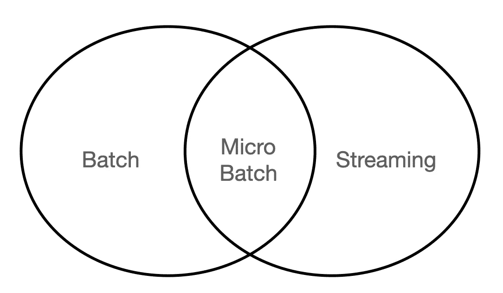

# 流媒体框架介绍

> 原文：[`towardsdatascience.com/introduction-to-streaming-frameworks-d612583a3246?source=collection_archive---------10-----------------------#2023-11-08`](https://towardsdatascience.com/introduction-to-streaming-frameworks-d612583a3246?source=collection_archive---------10-----------------------#2023-11-08)

## 理解和比较流媒体技术时需要考虑的一些关键特性。

 [皮埃尔·保罗·伊波利托](https://pierpaoloippolito28.medium.com/?source=post_page-----d612583a3246--------------------------------)

·

[关注](https://medium.com/m/signin?actionUrl=https%3A%2F%2Fmedium.com%2F_%2Fsubscribe%2Fuser%2Fb8391a6a5f1a&operation=register&redirect=https%3A%2F%2Ftowardsdatascience.com%2Fintroduction-to-streaming-frameworks-d612583a3246&user=Pier+Paolo+Ippolito&userId=b8391a6a5f1a&source=post_page-b8391a6a5f1a----d612583a3246---------------------post_header-----------) 发表在 [Towards Data Science](https://towardsdatascience.com/?source=post_page-----d612583a3246--------------------------------) ·6 分钟阅读·2023 年 11 月 8 日

--

Photo by [乔阿奥·布兰科](https://unsplash.com/@jfobranco?utm_source=medium&utm_medium=referral) on [Unsplash](https://unsplash.com/?utm_source=medium&utm_medium=referral)

# 简介

随着数据架构的逐渐成熟，流处理不再被视为奢侈品，而是广泛应用于各行各业的技术。由于技术和资源的限制，批处理实际上一直是处理和交付应用的首选方式，不过随着基于 Apache 的分布式系统中微批处理和原生流处理框架的发展，高规模流处理现在变得更加可及（见图 1）。

使用流处理系统的一些示例应用包括：处理事务数据以发现异常、天气数据、来自远程位置的物联网数据、地理位置跟踪等。

图 1：批处理与流处理（图片来源：作者）。

# 实时处理与微批处理

流处理系统有两种关键类型：微批处理和实时处理：

+   在实时流处理的过程中，每条记录都会被处理为…
