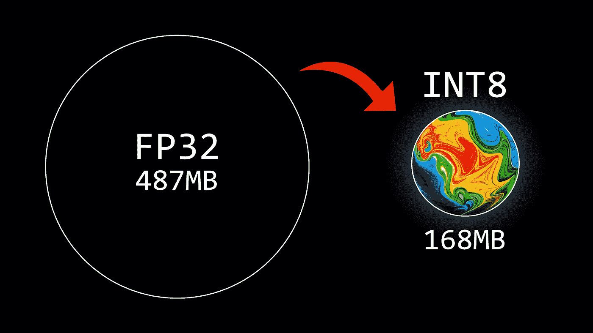
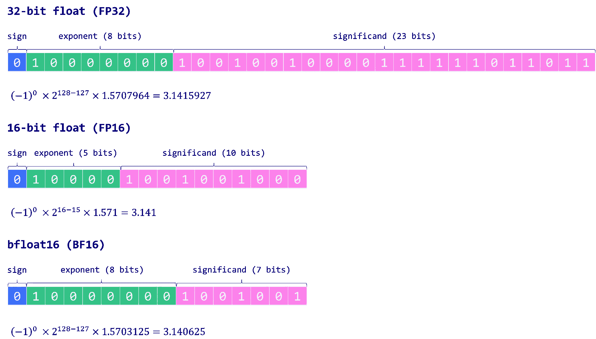
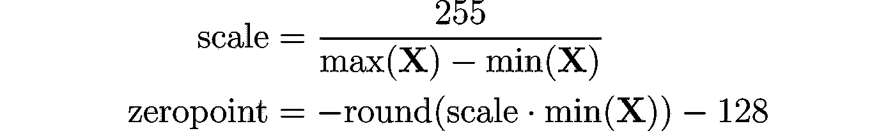
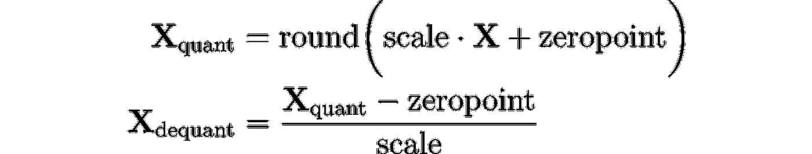
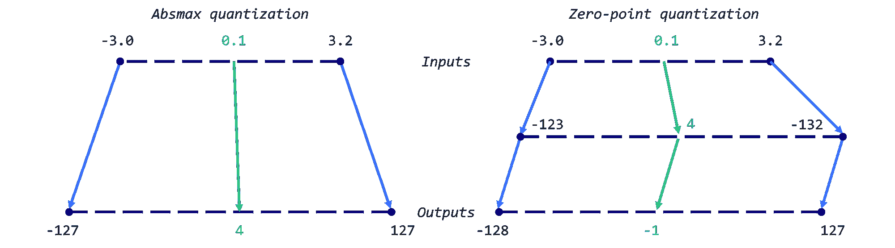
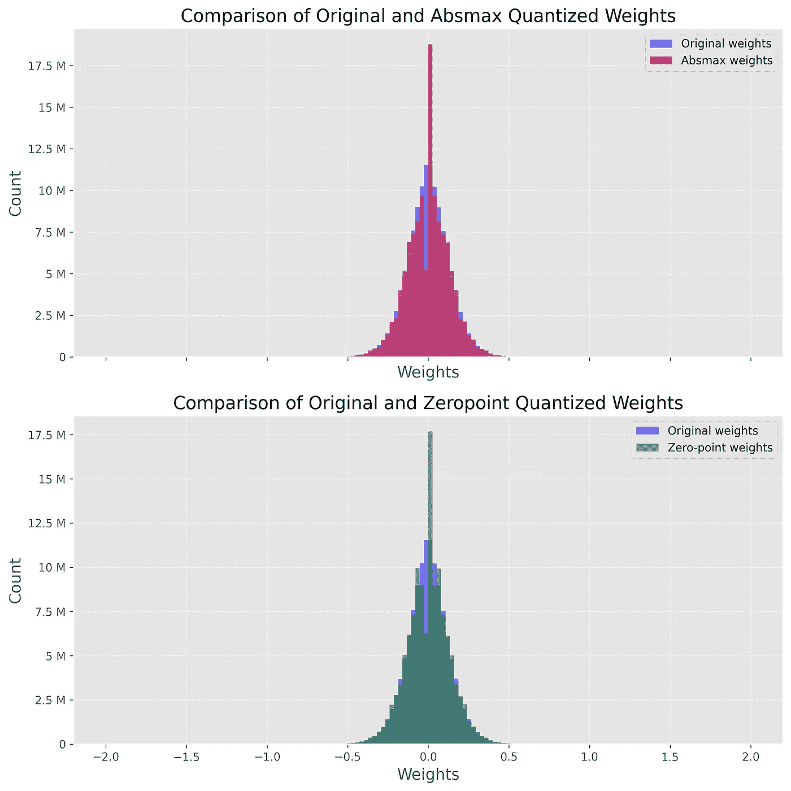
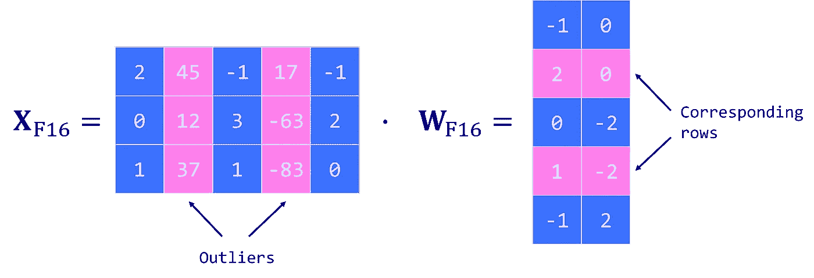
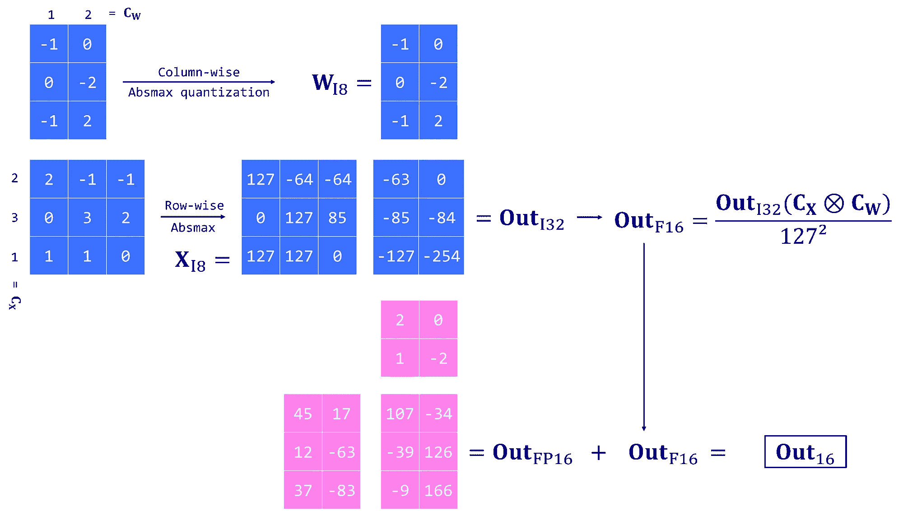
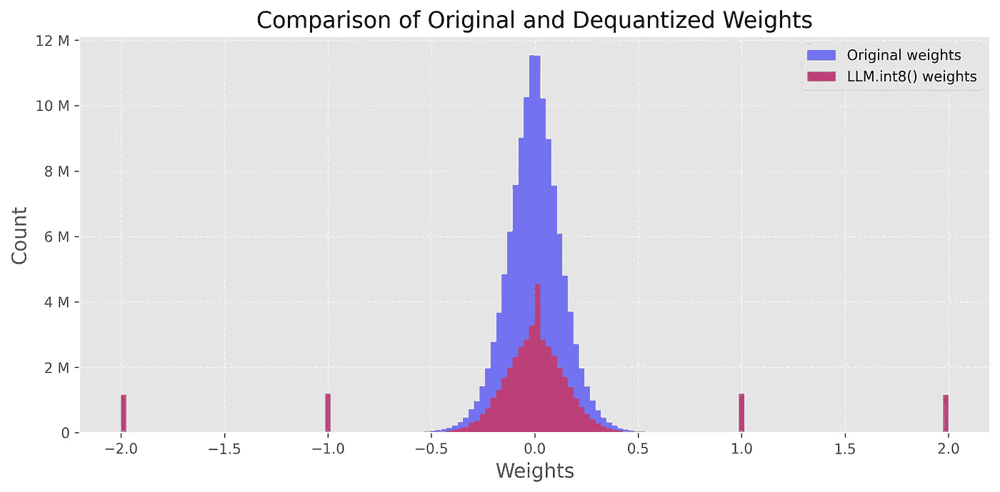

# 权重量化简介

> 原文：[`towardsdatascience.com/introduction-to-weight-quantization-2494701b9c0c?source=collection_archive---------0-----------------------#2023-07-07`](https://towardsdatascience.com/introduction-to-weight-quantization-2494701b9c0c?source=collection_archive---------0-----------------------#2023-07-07)

## 使用 8 位量化来减少大型语言模型的大小

[](https://medium.com/@mlabonne?source=post_page-----2494701b9c0c--------------------------------)[](https://towardsdatascience.com/?source=post_page-----2494701b9c0c--------------------------------) [Maxime Labonne](https://medium.com/@mlabonne?source=post_page-----2494701b9c0c--------------------------------)

·

[关注](https://medium.com/m/signin?actionUrl=https%3A%2F%2Fmedium.com%2F_%2Fsubscribe%2Fuser%2Fdc89da634938&operation=register&redirect=https%3A%2F%2Ftowardsdatascience.com%2Fintroduction-to-weight-quantization-2494701b9c0c&user=Maxime+Labonne&userId=dc89da634938&source=post_page-dc89da634938----2494701b9c0c---------------------post_header-----------) 发表在 [Towards Data Science](https://towardsdatascience.com/?source=post_page-----2494701b9c0c--------------------------------) ·14 分钟阅读·2023 年 7 月 7 日[](https://medium.com/m/signin?actionUrl=https%3A%2F%2Fmedium.com%2F_%2Fvote%2Ftowards-data-science%2F2494701b9c0c&operation=register&redirect=https%3A%2F%2Ftowardsdatascience.com%2Fintroduction-to-weight-quantization-2494701b9c0c&user=Maxime+Labonne&userId=dc89da634938&source=-----2494701b9c0c---------------------clap_footer-----------)

--

[](https://medium.com/m/signin?actionUrl=https%3A%2F%2Fmedium.com%2F_%2Fbookmark%2Fp%2F2494701b9c0c&operation=register&redirect=https%3A%2F%2Ftowardsdatascience.com%2Fintroduction-to-weight-quantization-2494701b9c0c&source=-----2494701b9c0c---------------------bookmark_footer-----------)

大型语言模型（LLMs）以其广泛的计算需求而闻名。通常，通过将参数数量（**大小**）乘以这些值的精度（**数据类型**），可以计算模型的大小。然而，为了节省内存，可以通过一种称为量化的过程使用较低精度的数据类型来存储权重。

我们在文献中区分了两大类权重量化技术：

+   **训练后量化**（PTQ）是一种直接的技术，其中已训练好的模型的权重被转换为较低的精度，而不需要进行任何重新训练。尽管实施起来简单，但 PTQ 可能会导致性能下降。

+   **量化感知训练**（QAT）在预训练或微调阶段纳入权重转换过程，从而提升模型性能。然而，QAT 计算成本高且需要代表性的训练数据。

本文聚焦于 PTQ 以减少参数的精度。为了获得良好的直觉，我们将应用简单和更复杂的技术于一个使用 GPT-2 模型的示例。

完整代码可以在[Google Colab](https://colab.research.google.com/drive/1DPr4mUQ92Cc-xf4GgAaB6dFcFnWIvqYi?usp=sharing)和[GitHub](https://github.com/mlabonne/llm-course/blob/main/Introduction_to_Weight_Quantization.ipynb)上自由获取。

# 📚 浮点表示的背景

数据类型的选择决定了所需的计算资源量，影响模型的速度和效率。在深度学习应用中，平衡精度和计算性能成为一个至关重要的任务，因为更高的精度通常意味着更大的计算需求。

在各种数据类型中，浮点数由于能够以高精度表示广泛的值范围，因此在深度学习中被广泛使用。通常，浮点数使用*n*位来存储数值。这些*n*位进一步被划分为三个不同的部分：

1.  **符号**：符号位指示数字的正负性质。它使用一个位，其中 0 表示正数，1 表示负数。

1.  **指数**：指数是一段位表示基数（在二进制表示中通常为 2）的幂。指数可以是正数或负数，从而使数字能够表示非常大或非常小的值。

1.  **尾数/有效数字**：剩余的位用于存储尾数，也称为有效数字。它表示数字的有效数字。数字的精度严重依赖于尾数的长度。

这种设计允许浮点数以不同精度覆盖广泛的值范围。用于这种表示的公式是：


为了更好地理解这一点，让我们深入探讨在深度学习中最常用的数据类型：float32（FP32）、float16（FP16）和 bfloat16（BF16）：

+   **FP32** 使用 32 位表示一个数字：一个位用于符号，八个位用于指数，其余 23 个位用于尾数。虽然它提供了较高的精度，但 FP32 的缺点是其计算和内存开销较大。

+   **FP16** 使用 16 位存储一个数字：一个用于符号，五个位用于指数，十个位用于尾数。虽然这使其在内存上更高效并加速计算，但减少的范围和精度可能会引入数值不稳定性，可能影响模型的准确性。

+   **BF16**也是一种 16 位格式，但有一个符号位，*八*个位用于指数，*七*个位用于尾数。BF16 扩展了表示范围，相较于 FP16，减少了下溢和溢出的风险。尽管由于尾数位数减少而精度降低，但 BF16 通常不会显著影响模型性能，是深度学习任务的一个有用折中方案。



作者提供的图片

在机器学习术语中，FP32 通常被称为“全精度”（4 字节），而 BF16 和 FP16 则被称为“半精度”（2 字节）。但我们是否可以更进一步，用一个字节来存储权重？答案是 INT8 数据类型，它由一个 8 位表示组成，能够存储 2⁸ = 256 种不同的值。在下一节中，我们将看到如何将 FP32 权重转换为 INT8 格式。

# 🔰 初步的 8 位量化

在这一部分，我们将实现两种量化技术：一种是具有**绝对最大值（absmax）量化**的对称量化，另一种是具有**零点量化**的非对称量化。在这两种情况下，目标是将 FP32 张量**X**（原始权重）映射到 INT8 张量**X_quant**（量化权重）。

使用**absmax 量化**，原始数值除以张量的绝对最大值，并乘以缩放因子（127），将输入映射到范围[-127, 127]。要检索原始 FP16 值，INT8 数值除以量化因子，承认由于四舍五入导致的一些精度损失。


例如，假设我们有一个绝对最大值为 3.2 的值。一个 0.1 的权重将被量化为*round(0.1 × 127/3.2) = 4*。如果我们想将其反量化，将得到*4 × 3.2/127 = 0.1008*，这意味着一个 0.008 的误差。以下是对应的 Python 实现：

```py
import torch

def absmax_quantize(X):
    # Calculate scale
    scale = 127 / torch.max(torch.abs(X))

    # Quantize
    X_quant = (scale * X).round()

    # Dequantize
    X_dequant = X_quant / scale

    return X_quant.to(torch.int8), X_dequant
```

使用**零点量化**，我们可以考虑非对称输入分布，这在考虑 ReLU 函数的输出（仅正值）时特别有用。输入值首先按值的总范围（255）除以最大值和最小值之间的差异进行缩放。然后通过零点偏移将这个分布映射到范围[-128, 127]（注意与 absmax 相比的额外值）。首先，我们计算缩放因子和零点值：



然后，我们可以使用这些变量来量化或反量化我们的权重：



例如：我们有一个最大值为 3.2 和一个最小值为-3.0。我们可以计算出缩放因子为*255/(3.2 + 3.0) = 41.13*，零点为*-round(41.13 × -3.0) - 128 = 123 -128 = -5*，因此我们之前的权重 0.1 将被量化为*round(41.13 × 0.1 -5) = -1*。这与之前使用 absmax 获得的值（4 与-1）差异很大。



作者提供的图片

Python 实现非常简单：

```py
def zeropoint_quantize(X):
    # Calculate value range (denominator)
    x_range = torch.max(X) - torch.min(X)
    x_range = 1 if x_range == 0 else x_range

    # Calculate scale
    scale = 255 / x_range

    # Shift by zero-point
    zeropoint = (-scale * torch.min(X) - 128).round()

    # Scale and round the inputs
    X_quant = torch.clip((X * scale + zeropoint).round(), -128, 127)

    # Dequantize
    X_dequant = (X_quant - zeropoint) / scale

    return X_quant.to(torch.int8), X_dequant
```

我们可以利用 `transformers` 库在真实模型上使用这两个函数，而不是依赖完整的玩具示例。

我们首先加载 GPT-2 的模型和分词器。这是一个非常小的模型，我们可能不想对其进行量化，但它对于本教程来说足够了。首先，我们想观察模型的大小，以便稍后进行比较，并评估由于 8 位量化而节省的**内存**。

```py
!pip install -q bitsandbytes>=0.39.0
!pip install -q git+https://github.com/huggingface/accelerate.git
!pip install -q git+https://github.com/huggingface/transformers.git
```

```py
from transformers import AutoModelForCausalLM, AutoTokenizer
import torch
torch.manual_seed(0)

# Set device to CPU for now
device = 'cpu'

# Load model and tokenizer
model_id = 'gpt2'
model = AutoModelForCausalLM.from_pretrained(model_id).to(device)
tokenizer = AutoTokenizer.from_pretrained(model_id)

# Print model size
print(f"Model size: {model.get_memory_footprint():,} bytes")
```

```py
Model size: 510,342,192 bytes
```

GPT-2 模型在 FP32 中的大小约为 487MB。下一步是使用零点和 absmax 量化权重。在以下示例中，我们将这些技术应用于 GPT-2 的第一个注意力层，以查看结果。

```py
# Extract weights of the first layer
weights = model.transformer.h[0].attn.c_attn.weight.data
print("Original weights:")
print(weights)

# Quantize layer using absmax quantization
weights_abs_quant, _ = absmax_quantize(weights)
print("\nAbsmax quantized weights:")
print(weights_abs_quant)

# Quantize layer using absmax quantization
weights_zp_quant, _ = zeropoint_quantize(weights)
print("\nZero-point quantized weights:")
print(weights_zp_quant)
```

```py
Original weights:
tensor([[-0.4738, -0.2614, -0.0978,  ...,  0.0513, -0.0584,  0.0250],
        [ 0.0874,  0.1473,  0.2387,  ..., -0.0525, -0.0113, -0.0156],
        [ 0.0039,  0.0695,  0.3668,  ...,  0.1143,  0.0363, -0.0318],
        ...,
        [-0.2592, -0.0164,  0.1991,  ...,  0.0095, -0.0516,  0.0319],
        [ 0.1517,  0.2170,  0.1043,  ...,  0.0293, -0.0429, -0.0475],
        [-0.4100, -0.1924, -0.2400,  ..., -0.0046,  0.0070,  0.0198]])

Absmax quantized weights:
tensor([[-21, -12,  -4,  ...,   2,  -3,   1],
        [  4,   7,  11,  ...,  -2,  -1,  -1],
        [  0,   3,  16,  ...,   5,   2,  -1],
        ...,
        [-12,  -1,   9,  ...,   0,  -2,   1],
        [  7,  10,   5,  ...,   1,  -2,  -2],
        [-18,  -9, -11,  ...,   0,   0,   1]], dtype=torch.int8)

Zero-point quantized weights:
tensor([[-20, -11,  -3,  ...,   3,  -2,   2],
        [  5,   8,  12,  ...,  -1,   0,   0],
        [  1,   4,  18,  ...,   6,   3,   0],
        ...,
        [-11,   0,  10,  ...,   1,  -1,   2],
        [  8,  11,   6,  ...,   2,  -1,  -1],
        [-18,  -8, -10,  ...,   1,   1,   2]], dtype=torch.int8)
```

原始（FP32）值和量化值（INT8）之间的差异很明显，但 absmax 和零点权重之间的差异则更微妙。在这种情况下，输入值看起来偏移了 -1。这表明这一层的权重分布相当对称。

我们可以通过对 GPT-2 中的每一层（线性层、注意力层等）进行量化，并创建两个新模型：`model_abs` 和 `model_zp`，来比较这些技术。准确地说，我们将实际用***去***量化的权重替换原始权重。这有两个好处：它使我们可以 1/ 比较权重的分布（相同的尺度），以及 2/ 实际运行这些模型。

确实，PyTorch 默认不允许 INT8 矩阵乘法。在实际场景中，我们会将其去量化以运行模型（例如 FP16），但以 INT8 存储。在下一部分，我们将使用 `[bitsandbytes](https://github.com/TimDettmers/bitsandbytes)` 库来解决这个问题。

```py
import numpy as np
from copy import deepcopy

# Store original weights
weights = [param.data.clone() for param in model.parameters()]

# Create model to quantize
model_abs = deepcopy(model)

# Quantize all model weights
weights_abs = []
for param in model_abs.parameters():
    _, dequantized = absmax_quantize(param.data)
    param.data = dequantized
    weights_abs.append(dequantized)

# Create model to quantize
model_zp = deepcopy(model)

# Quantize all model weights
weights_zp = []
for param in model_zp.parameters():
    _, dequantized = zeropoint_quantize(param.data)
    param.data = dequantized
    weights_zp.append(dequantized)
```

现在我们的模型已经被量化，我们想检查这一过程的影响。直观上，我们想确保量化的权重**接近原始权重**。一种直观的方法是绘制去量化和原始权重的分布。如果量化有损，它将极大地改变权重分布。

下图展示了这种比较，其中蓝色直方图表示原始（FP32）权重，红色直方图表示去量化后的（来自 INT8）权重。注意，我们仅在 -2 和 2 之间显示此图，因为有一些绝对值非常高的离群值（稍后会详细讨论）。



两个图表非常相似，都在 0 附近有一个惊人的峰值。这个峰值表明我们的量化相当有损，因为反转过程并没有输出原始值。这在 absmax 模型中尤为明显，该模型在 0 附近显示了一个更低的谷值和一个更高的峰值。

让我们比较原始模型和量化模型的性能。为此，我们定义了一个 `generate_text()` 函数来生成 50 个标记，并使用 [top-k 采样](https://mlabonne.github.io/blog/posts/2023-06-07-Decoding_strategies.html)。

```py
def generate_text(model, input_text, max_length=50):
    input_ids = tokenizer.encode(input_text, return_tensors='pt').to(device)
    output = model.generate(inputs=input_ids,
                            max_length=max_length,
                            do_sample=True,
                            top_k=30,
                            pad_token_id=tokenizer.eos_token_id,
                            attention_mask=input_ids.new_ones(input_ids.shape))
    return tokenizer.decode(output[0], skip_special_tokens=True)

# Generate text with original and quantized models
original_text = generate_text(model, "I have a dream")
absmax_text   = generate_text(model_abs, "I have a dream")
zp_text       = generate_text(model_zp, "I have a dream")

print(f"Original model:\n{original_text}")
print("-" * 50)
print(f"Absmax model:\n{absmax_text}")
print("-" * 50)
print(f"Zeropoint model:\n{zp_text}")
```

```py
Original model:
I have a dream, and it is a dream I believe I would get to live in my future. I love my mother, and there was that one time I had been told that my family wasn't even that strong. And then I got the
--------------------------------------------------
Absmax model:
I have a dream to find out the origin of her hair. She loves it. But there's no way you could be honest about how her hair is made. She must be crazy.

We found a photo of the hairstyle posted on
--------------------------------------------------
Zeropoint model:
I have a dream of creating two full-time jobs in America—one for people with mental health issues, and one for people who do not suffer from mental illness—or at least have an employment and family history of substance abuse, to work part
```

我们可以通过计算每个输出的**困惑度**来量化它，而不是尝试判断一个输出是否比其他输出更有意义。这是一个常用的评估语言模型的指标，用于测量模型在预测序列中下一个标记时的不确定性。在这个比较中，我们做了一个常见的假设，即分数越低，模型越好。实际上，高困惑度的句子也可能是正确的。

我们使用一个最小函数来实现它，因为不需要考虑上下文窗口的长度，因为我们的句子较短。

```py
def calculate_perplexity(model, text):
    # Encode the text
    encodings = tokenizer(text, return_tensors='pt').to(device)

    # Define input_ids and target_ids
    input_ids = encodings.input_ids
    target_ids = input_ids.clone()

    with torch.no_grad():
        outputs = model(input_ids, labels=target_ids)

    # Loss calculation
    neg_log_likelihood = outputs.loss

    # Perplexity calculation
    ppl = torch.exp(neg_log_likelihood)

    return ppl

ppl     = calculate_perplexity(model, original_text)
ppl_abs = calculate_perplexity(model_abs, absmax_text)
ppl_zp  = calculate_perplexity(model_zp, absmax_text)

print(f"Original perplexity:  {ppl.item():.2f}")
print(f"Absmax perplexity:    {ppl_abs.item():.2f}")
print(f"Zeropoint perplexity: {ppl_zp.item():.2f}")
```

```py
Original perplexity:  15.53
Absmax perplexity:    17.92
Zeropoint perplexity: 17.97
```

我们发现原始模型的困惑度**略低**于另外两个模型。一次实验并不十分可靠，但我们可以多次重复这个过程，以查看每个模型之间的差异。从理论上讲，零点量化应稍微优于 absmax，但计算成本也更高。

在这个例子中，我们将量化技术应用于整个层（每张量基础）。然而，我们可以在不同的粒度水平应用它：从整个模型到单个值。一次性量化整个模型会严重降低性能，而量化单个值会产生很大的开销。在实践中，我们通常更喜欢**逐向量量化**，它考虑了同一张量中行和列的值的变异性。

然而，即使是逐向量量化也不能解决离群特征的问题。离群特征是出现在所有变换器层中的极端值（负值或正值），当模型达到某个规模（>6.7B 参数）时。这是一个问题，因为一个离群值可以降低所有其他值的精度。但丢弃这些离群特征并不是一个选项，因为这会**大大降低**模型的性能。

# 🔢 8 位量化与 LLM.int8()

由[Dettmers et al. (2022)](https://arxiv.org/abs/2208.07339)引入的 LLM.int8() 是解决离群值问题的一个方案。它依赖于逐向量（absmax）量化方案，并引入了混合精度量化。这意味着离群特征以 FP16 格式处理以保持其精度，而其他值则以 INT8 格式处理。由于离群值约占 0.1% 的值，这有效地将 LLM 的内存占用减少了近 2 倍。



作者提供的图片

LLM.int8() 通过三个关键步骤进行矩阵乘法计算：

1.  从输入隐藏状态**X**中提取包含离群特征的列，使用自定义阈值。

1.  使用 FP16 对离群值进行矩阵乘法，并使用 INT8 进行逐向量量化（对隐藏状态**X**进行逐行量化，对权重矩阵**W**进行逐列量化）。

1.  对非离群结果进行反量化（从 INT8 到 FP16），并将其与离群结果相加，以获得完整的 FP16 结果。



作者提供的图片

这种方法是必要的，因为 8 位精度有限，当量化具有大值的向量时可能导致显著的误差。这些误差也会随着它们在多个层之间传播而放大。

由于 `bitsandbytes` 库已集成到 Hugging Face 生态系统中，我们可以轻松使用这项技术。我们只需在加载模型时指定 `load_in_8bit=True`（它还需要一个 GPU）。

```py
device = torch.device('cuda' if torch.cuda.is_available() else 'cpu')

model_int8 = AutoModelForCausalLM.from_pretrained(model_id,
                                             device_map='auto',
                                             load_in_8bit=True,
                                             )
print(f"Model size: {model_int8.get_memory_footprint():,} bytes")
```

```py
Model size: 176,527,896 bytes
```

通过这额外的一行代码，模型现在几乎缩小了三倍（168MB vs. 487MB）。我们甚至可以像之前那样比较原始权重和量化权重的分布：



在这种情况下，我们看到在 -2，-1，0，1，2 等值周围有尖峰。这些值对应于以 INT8 格式存储的参数（非异常值）。你可以通过使用 `model_int8.parameters()` 打印模型的权重来验证这一点。

我们还可以使用这个量化模型生成文本，并与原始模型进行比较。

```py
# Generate text with quantized model
text_int8 = generate_text(model_int8, "I have a dream")

print(f"Original model:\n{original_text}")
print("-" * 50)
print(f"LLM.int8() model:\n{text_int8}")
```

```py
Original model:
I have a dream, and it is a dream I believe I would get to live in my future. I love my mother, and there was that one time I had been told that my family wasn't even that strong. And then I got the
--------------------------------------------------
LLM.int8() model:
I have a dream. I don't know what will come of it, but I am going to have to look for something that will be right. I haven't thought about it for a long time, but I have to try to get that thing
```

再次强调，判断最佳输出是困难的，但我们可以依靠困惑度指标来给出一个（大致的）答案。

```py
print(f"Perplexity (original):   {ppl.item():.2f}")

ppl = calculate_perplexity(model_int8, text_int8)
print(f"Perplexity (LLM.int8()): {ppl.item():.2f}")
```

```py
Perplexity (original):   15.53
Perplexity (LLM.int8()): 7.93
```

在这种情况下，量化模型的困惑度是原始模型的两倍低。一般来说，这种情况并不常见，但它显示了这种量化技术的竞争力。实际上，LLM.int8()的作者展示了性能下降非常小，可以忽略不计（<1%）。然而，它在计算方面有额外的成本：对于大模型，LLM.int8()大约慢了 20%。

# 结论

本文概述了最流行的权重量化技术。我们首先了解了浮点表示，然后介绍了两种 8 位量化技术：**absmax** 和 **零点量化**。然而，它们的局限性，特别是在处理异常值时，导致了 **LLM.int8()** 技术，该技术还保留了模型的性能。这种方法突显了权重量化领域的进展，揭示了正确处理异常值的重要性。

展望未来，我们的下一篇文章将深入探讨 GPTQ 权重量化技术。这项技术由 [Frantar 等人](https://arxiv.org/abs/2210.17323) 提出，只使用了 4 位，并且代表了权重量化领域的重大进展。我们将提供如何使用 AutoGPTQ 库实现 GPTQ 的全面指南。

如果你对更多关于 LLM 的技术内容感兴趣，可以在 Twitter 上关注我 [@maximelabonne](https://twitter.com/maximelabonne)。

# 参考文献

+   T. Dettmers, M. Lewis, Y. Belkada, 和 L. Zettlemoyer，[LLM.int8(): 大规模变压器的 8 位矩阵乘法](https://arxiv.org/abs/2208.07339)。2022 年。

+   Y. Beldaka 和 T. Dettmers, [8 位矩阵乘法的简明介绍](https://huggingface.co/blog/hf-bitsandbytes-integration), Hugging Face Blog (2022)。

+   A. Gholami, S. Kim, Z. Dong, Z. Yao, M. W. Mahoney 和 K. Keutzer, [高效神经网络推理的量化方法综述](https://arxiv.org/abs/2103.13630)。2021 年。

+   H. Wu, P. Judd, X. Zhang, M. Isaev 和 P. Micikevicius, [深度学习推理的整数量化：原理与实证评估](https://arxiv.org/abs/2004.09602)。2020 年。

+   Lilian Weng, [大型变压器模型推理优化](https://lilianweng.github.io/posts/2023-01-10-inference-optimization/), Lil’Log (2023)。

+   Kamil Czarnogorski, [本地大型语言模型](https://int8.io/local-large-language-models-beginners-guide/), Int8 (2023)。
