# 逆物理信息化神经网络

> 原文：[`towardsdatascience.com/inverse-physics-informed-neural-net-3b636efeb37e?source=collection_archive---------2-----------------------#2023-03-27`](https://towardsdatascience.com/inverse-physics-informed-neural-net-3b636efeb37e?source=collection_archive---------2-----------------------#2023-03-27)

## iPINN ~with code

## 解决逆微分方程问题

 [John Morrow](https://medium.com/@john_morrow?source=post_page-----3b636efeb37e--------------------------------)

·

[关注](https://medium.com/m/signin?actionUrl=https%3A%2F%2Fmedium.com%2F_%2Fsubscribe%2Fuser%2Fb4bcd051bb38&operation=register&redirect=https%3A%2F%2Ftowardsdatascience.com%2Finverse-physics-informed-neural-net-3b636efeb37e&user=John+Morrow&userId=b4bcd051bb38&source=post_page-b4bcd051bb38----3b636efeb37e---------------------post_header-----------) 发表在 [Towards Data Science](https://towardsdatascience.com/?source=post_page-----3b636efeb37e--------------------------------) ·11 min read·2023 年 3 月 27 日

--

照片由 [Daniele Levis Pelusi](https://unsplash.com/@yogidan2012?utm_source=medium&utm_medium=referral) 提供，来源于 [Unsplash](https://unsplash.com/?utm_source=medium&utm_medium=referral)

**(1) 引言：什么是物理信息化？**

物理学、生物学、化学、经济学、工程学等许多领域的关系由微分方程定义。（请参见[这里](https://en.wikipedia.org/wiki/List_of_named_differential_equations)获取详细列表。）一般来说，微分方程（DE）描述了变量如何受到其他变量变化率的影响。例如，微分方程解释了当质量在弹簧上振动时，其位置如何随时间变化，这与质量的速度和加速度相关。物理信息神经网络（PINN）生成遵循微分方程描述的关系的响应（无论研究对象是物理学、工程学、经济学等）。相比之下，逆物理信息神经网络（iPINN）作用于响应并确定产生该响应的微分方程的参数。PINN 和 iPINN 通过在训练过程中包含一个约束来进行训练，该约束迫使神经网络的输入和输出之间的关系符合所建模的微分方程。

本文从 PINN 的实现开始，然后在 PINN 模型的基础上实现 iPINN。对建模微分方程的解析解包括在内，以便与 PINN 和 iPINN 产生的响应进行比较。

**(2) 二阶微分方程**

本文重点讨论描述阻尼谐波运动的 PINN 和 iPINN，例如带阻尼的弹簧-质量系统（图 1）和由电阻、电感和电容（RLC）串联连接的组件组成的电子电路（图 2）。

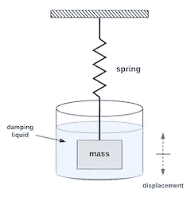

图 1：**振动质量与弹簧**

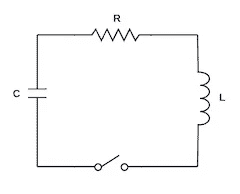

图 2：**RLC 电路**

这些应用由二阶微分方程（DE）定义，其中包括相对于时间的二阶导数。方程 1 是弹簧-质量系统的二阶微分方程，其中参数 m、c 和 k 分别是质量、阻尼系数和弹簧常数。质量的位移由 x 表示，时间由 t 表示。x 对 t 的二阶导数是质量的加速度，而一阶导数是质量的速度。

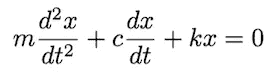

**方程 1**

方程 2 是 RLC 电路的二阶微分方程，其中 R、L 和 C 分别是电阻、电感和电容。电路中的电流由 i 表示，时间由 t 表示。

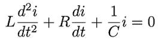

**方程 2**

这两个微分方程产生类似的响应，即质量从静止位置被位移后释放时的运动，以及在预充电电容器并施加初始电压后关闭开关时电流随时间的变化。下一节介绍 RLC 电路响应的详细信息。

**(3) RLC 电路响应**

以下是图 2 中 RLC 电路可能响应的概述，包括每个响应的方程 2 的解析解方程。（作者提供的解析解推导可以在 [这里](https://github.com/jmorrow1000/PINN-iPINN/blob/main/RLC_response_Laplace_solutions.pdf?raw=true) 下载。）解析响应将在后续与 PINN 生成的和 iPINN 生成的响应进行比较。

根据组件的值，这个 RLC 电路可以产生三种不同类型的响应：欠阻尼、临界阻尼和过阻尼。所有这三种响应都基于在开关关闭之前电容器充电到电压 V₀ 和以下初始条件：

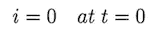

**方程 3**

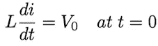

**方程 4**

**(3.1) 欠阻尼响应**

当 R、L 和 C 的值产生以下条件时，会发生欠阻尼响应：

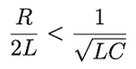

**方程 5**

例如，设 R = 1.2（欧姆），L = 1.5（亨利），C = 0.3（法拉），V₀ = 12（伏特）。这些值的方程 2 的解析响应为：

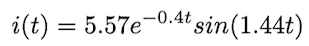

**方程 6**

以下是方程 6 的响应图。

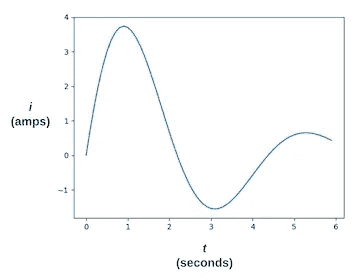

图 3: **欠阻尼响应**

**(3.2) 临界阻尼响应**

当 R、L 和 C 的值产生以下条件时，会发生临界阻尼响应：

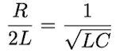

**方程 7**

例如，设 R = 4.47（欧姆），L = 1.5（亨利），C = 0.3（法拉），V₀ = 12（伏特）。这些值的方程 2 的解析响应为：

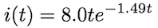

**方程 8**

以下是方程 8 的响应图。

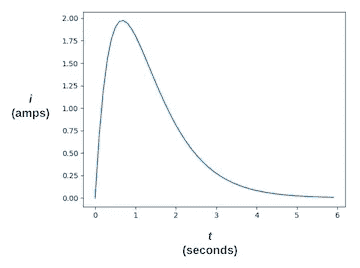

图 4: **临界阻尼响应**

**(3.3) 过阻尼响应**

当 R、L 和 C 的值产生以下条件时，会发生过阻尼响应：

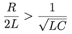

**方程 9**

例如，设 R = 6.0（欧姆），L = 1.5（亨利），C = 0.3（法拉），V₀ = 12（伏特）。这些值的方程 2 的解析响应为：

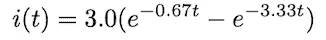

**方程 10**

以下是方程 10 的响应图。

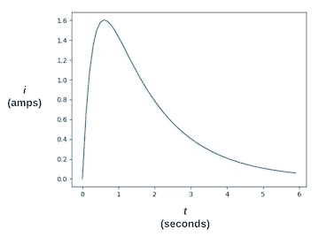

图 5: **过阻尼响应**

**(4) PINN 结构**

通常，神经网络使用已知的输入和输出数据对进行训练。训练输入数据被输入神经网络，产生的输出与训练输出数据通过损失函数进行比较。此函数返回的损失值通过反向传播调整网络权重，以减少损失。PINNs 和 iPINNs 使用自定义损失函数，包括额外的损失组件，以约束神经网络生成符合所建 DE 的输出。

一个 DE 的 PINN 模型在方程 2 中将时间 *t* 作为神经网络的输入，输出对应的电流 *i*。训练 PINN 以符合 DE 需要计算输出相对于输入的第一和第二导数，即 *di/dt* 和 *d²i/dt²*。这些导数在 TensorFlow 和 PyTorch 中通过各个平台的自动微分功能获得。本文中的 PINN 和 iPINN 是通过 TensorFlow 的[GradientTape](https://www.tensorflow.org/guide/autodiff)开发的。

对于每个 PINN 训练输入，GradientTape 计算的第一和第二导数与 *R*、*L* 和 *C* 按照方程 2 中的 DE 组合，产生的结果应为零。实际结果与零之间的差异称为残差。残差成为用于训练 PINN 的损失函数的一个组成部分。

二阶 DE，如方程 2，还要求解符合两个初始条件。在这种情况下，第一个条件是 *t = 0* 时 *i* 的值（方程 3），第二个条件是 *t = 0* 时 *di/dt* 的值（方程 4）。每个初始条件都作为损失函数的一个组成部分。

图 6 展示了总损失的组成。损失 2 来自残差。损失 1 和损失 3 来自初始条件。在训练过程中，反向传播用于减少总损失。PINN 的 *d²i/dt²* 和 *di/dt* 输出由 GradientTape 提供。

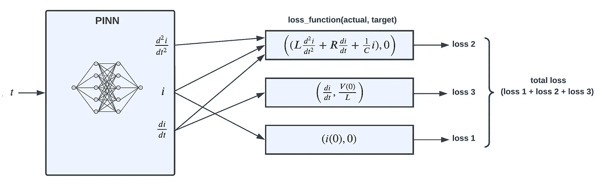

图 6: **PINN 损失函数**

**(5) PINN 实现**

以下是 PINN 实现的 python 代码。完整的 PINN 实现代码可以在[这里](https://github.com/jmorrow1000/PINN-iPINN)找到。

**(5.1) 神经网络模型定义**

PINN 的神经网络具有两个全连接的隐藏层，每层有 128 个神经元。时间点有一个输入，响应点有一个输出。

列表 1: **PINN TensorFlow 模型**

**(5.2) PINN 初始化**

在 PINN 模型中，*R*、*L*和*C*组件值以及初始电容电压（第 2-5 行）是决定 DE 响应的常数。共同位置点，指定在时间域中（第 8 行），是计算残差的点。初始条件（第 11 和 15 行）来自方程 3 和方程 4。

列表 2: **PINN 初始化**

**(5.3) PINN 训练步骤**

以下是训练步骤函数的 Python 代码。对于每个训练批次，步骤函数计算三部分损失，然后使用总损失更新神经网络中的权重。

**损失 1：** 方程 3 的初始条件与网络输出 *pred_y*（第 9 行）进行比较。差异的平方是 *model_loss1*（第 10 行）。

**损失 2：** 共定位点（第 30 行）计算残差。它使用来自 GradientTape 的一阶梯度 *dfdx*（第 17 行）和二阶梯度 *dfdx2*（第 26 行），以及网络输出 *pred_y*（第 29 行），来计算方程 2 的左侧。这一值的平方为 *model_loss2*（第 31 行）。

**损失 3：** 方程 4 的初始条件将 L 与一阶梯度 *dfdx*（第 17 行）的乘积与 v_init2 比较。差异的平方为 *model_loss3*（第 19 行）。

三个损失组件的总和，*model_loss*（第 35 行），用于计算损失相对于神经网络权重的梯度（第 38 行）。优化器随后更新权重（第 41 行）。

清单 3：**PINN 训练步骤**

**(6) PINN 结果**

下面是对三个测试案例训练 PINN 的结果。这些测试条件如第三部分所述：欠阻尼、临界阻尼和过阻尼。每个图展示了三个轨迹：

+   解析方程的响应（蓝色）

+   共定位点（绿色）

+   训练好的 PINN 的输出响应（红色）

**欠阻尼测试案例：**

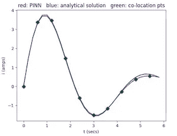

图 7：**欠阻尼响应**

**临界阻尼测试案例：**

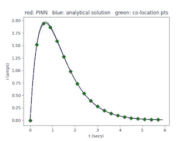

图 8：**临界阻尼响应**

**过阻尼测试案例：**

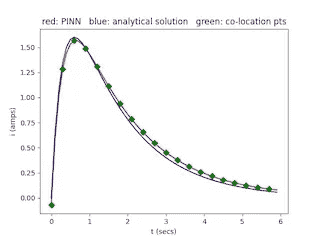

**(7) iPINN 结构**

图 10 说明了总损失的组成。与 PINN 模型类似，损失 2 来自残差，只是 *R*、*L* 和 *C* 是在训练过程中确定的变量。相比之下，在 PINN 模型中，*R*、*L* 和 *C* 是常数。与 PINN 一样，损失 1 和损失 3 强制遵守方程 3 和方程 4 的初始条件。

iPINN 模型包括一个额外的损失函数，损失 4，强制输出响应与待调查的微分方程响应匹配。

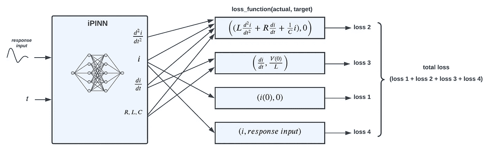

图 10：**iPINN 损失函数**

**(8) iPINN 实现**

以下是 PINN 实现的 Python 代码。iPINN 实现的完整代码可以在[这里](https://github.com/jmorrow1000/PINN-iPINN)找到。

iPINN 的神经网络模型定义与 PINN 网络（第 5.1 节）相同，即两个完全连接的隐藏层，每层有 128 个神经元。输入为时间点，输出为响应点。

**(8.1) iPINN 初始化**

被研究的微分方程的响应被加载在第 4 行。两个初始条件（第 9 行和第 13 行）与 PINN 模型中的相同。如上所述，*R*、*L*和*C*是 iPINN 模型中的可训练变量（第 18–20 行）。

**(8.2) iPINN 训练步骤**

**损失 1：** 方程 3 的初始条件与网络输出*pred_y*（第 10 行）进行比较。差异的平方为*model_loss1*（第 11 行）。

**损失 2：** 与 PINN 训练步骤函数一样，残差（第 34 行）在由*t_coloc*定义的共定位点处计算，产生*model_loss2*（第 35 行）。*R*、*L*和*C*是可训练变量。

**损失 3：** 方程 4 的初始条件将可训练变量*L*与一阶梯度*dfdx*（第 18 行）的乘积进行比较，以* v_init2*为标准。差异的平方为*model_loss3*（第 20 行）。

**损失 4：** 该损失组件将网络输出（第 39 行）与被研究的微分方程的响应*i_coloc*进行比较，产生*model_loss4*（第 40 行）。

四个损失组件的总和，*model_loss*（第 43 行），用于计算损失相对于神经网络权重和三个可训练变量：*R*、*L*和*C*（第 49 行）的梯度。然后优化器更新网络的权重（第 52 行），并在第 53–55 行更新*R*、*L*和*C*的值。

**(9) iPINN 结果**

以下是使用 iPINN 识别三个未知测试响应的结果。呈现给 iPINN 的测试响应是根据第三部分的条件生成的：欠阻尼、临界阻尼和过阻尼。下表比较了用于生成测试响应的*R*、*L*和*C*组件值与 iPINN 确定的值。每个图表呈现三个轨迹：

+   解析方程的响应曲线（蓝色）

+   需要由 iPINN 识别的响应数据（60 点）（绿色）

+   训练后的 iPINN 输出响应（红色）

**欠阻尼测试案例：**

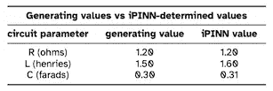

表 1：**欠阻尼测试案例**

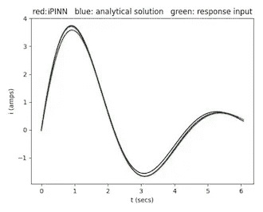

图 11：**欠阻尼响应**

**临界阻尼测试案例：**

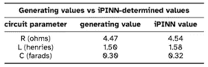

表 2：**临界阻尼测试案例**

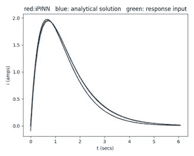

图 12：**临界阻尼响应**

**过阻尼测试案例：**

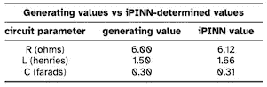

表 3：**过阻尼测试案例**

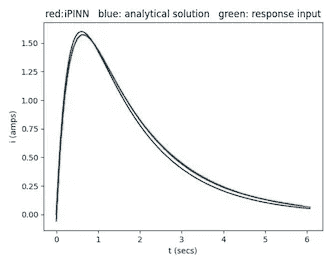

图 13：**过阻尼响应**

**(10) 结论**

这项研究展示了神经网络可以成功求解微分方程，这些方程描述了科学、工程和经济学众多领域中的许多关系。训练了一个物理信息神经网络来解决电子电路的二阶微分方程，结果是一个能够对输入信号产生与实际电路相同响应的神经网络。

这项研究还展示了神经网络能够确定未知微分方程的参数。具体而言，训练了一个逆物理信息神经网络，通过仅使用来自电路的样本响应来确定电子电路的未知组件值。此外，在确定未知组件值后，得到的神经网络能够对输入信号产生与实际电路相同的响应。

**参考文献**

[1] M. Raissi, P. Perdikaris, 和 G. E. Karniadakis, “物理信息深度学习（第一部分）：非线性偏微分方程的数据驱动解法”，2017\. [在线]. 网址: https://arxiv.org/abs/1711.10561

[2] M. Raissi, P. Perdikaris, 和 G. E. Karniadakis, “物理信息深度学习（第二部分）：非线性偏微分方程的数据驱动发现”，2017\. [在线]. 网址: [`arxiv.org/abs/1711.10566`](https://arxiv.org/abs/1711.10566)

**这篇文章的 pdf 版本可以** [**在这里**](https://github.com/jmorrow1000/PINN-iPINN/blob/main/inverse_physics_informed_neural_net.pdf?raw=true)**下载**。

*除非另有说明，所有图片均由作者提供。*
