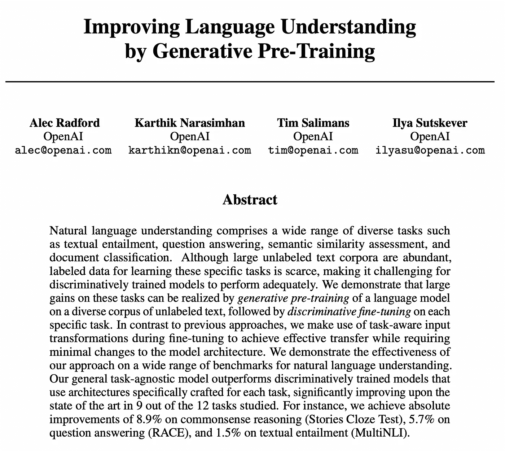
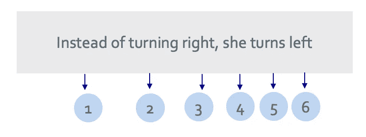
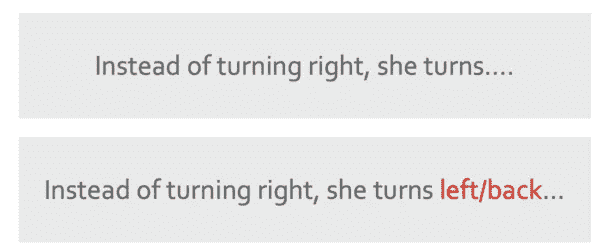
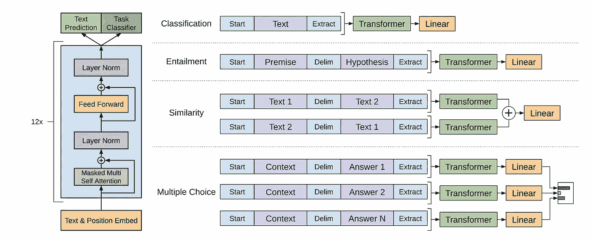
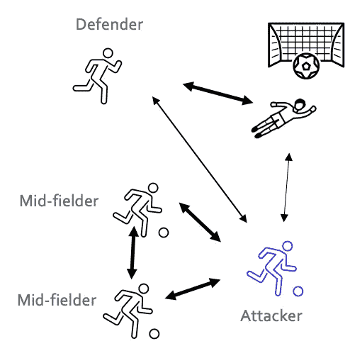
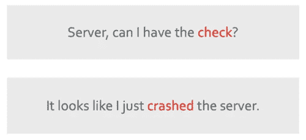
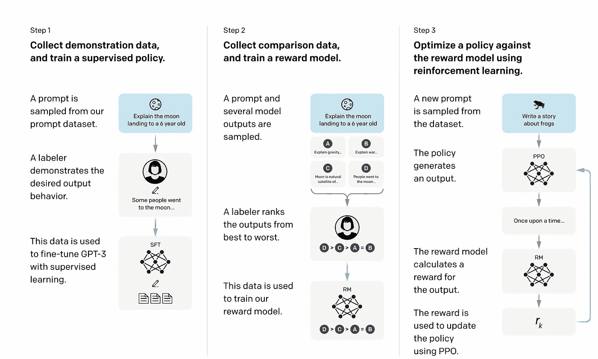

# ChatGPT 真的智能吗？

> 原文：[`towardsdatascience.com/is-chatgpt-actually-intelligent-42d07462fe59`](https://towardsdatascience.com/is-chatgpt-actually-intelligent-42d07462fe59)

## 也许不是……

 [兰楚](https://huonglanchu.medium.com/?source=post_page-----42d07462fe59--------------------------------)

·发表于 [Towards Data Science](https://towardsdatascience.com/?source=post_page-----42d07462fe59--------------------------------) ·阅读时间 12 分钟·2023 年 7 月 21 日

--

如果你在过去几个月里使用过任何社交媒体平台，我相信你一定听说过 ChatGPT、Google Bard、Microsoft Bing 和许多新的语言模型。所有这些新模型，有人可能会争辩说，比你我写得更好，他们的英语也确实比我的好 **🥲** 每隔几年，就会有人发明一些疯狂的东西，让你完全重新考虑可能性。而在这篇文章中，我们将讨论一种让全世界都在震撼的发明——是的，你猜对了——ChatGPT。

图片由 Bing 图像创建器生成。对人类智能的艺术表现。

随着我们越来越依赖 AI 为我们做事和做决策，提出 AI 是否真正智能的问题是自然的，特别是它对语言的理解是否反映了我们自己的理解，还是在本质上有所不同？

为了理解这一切，我们将首先探讨生成预训练变换器（GPT）和 ChatGPT 的工作原理，然后讨论 AI 智能的含义。

# 理解 GPT 模型

GPT 模型最初由 OpenAI 在其论文 [改进语言理解的生成预训练](https://s3-us-west-2.amazonaws.com/openai-assets/research-covers/language-unsupervised/language_understanding_paper.pdf) 中提出，使用无监督预训练，然后在各种语言任务上进行监督微调。

来源: [language_understanding_paper.pdf](https://s3-us-west-2.amazonaws.com/openai-assets/research-covers/language-unsupervised/language_understanding_paper.pdf)

该模型架构基于 Transformers，已在机器翻译和文档生成等任务中展现出强大的性能。该模型架构首次在 Google 研究人员的论文 “[Attention is all you need](https://arxiv.org/pdf/1706.03762.pdf)” 中提出。与[递归神经网络](https://en.wikipedia.org/wiki/Recurrent_neural_network)和[卷积神经网络](https://en.wikipedia.org/wiki/Convolutional_neural_network)相比，它提供了一个有组织的内存，用于管理文本中的长期依赖关系，从而在广泛的任务中实现了更好的性能。

## **这是一个预测游戏**

你可以将 GPT 模型视为一种擅长预测下一个内容的机器。例如，如果你给它短语“**她没有右转，而是转**……”，GPT 可能会预测“左转”或“回转”或其他作为下一个单词。它是如何学习到这一点的？它通过阅读大量现有文本，学习单词在与其他单词的上下文中如何出现，并预测可能出现的下一个最可能的单词。或者更准确地说，它学习如何解读数据中的位置编码。这意味着我们给句子中的每个单词打上一个编号，当你在大量文本上训练模型时，它学习如何解读句子中每个单词的位置编码。

图片由作者提供。

图片由作者提供。

## **Transformer**

但这不仅仅是一次猜一个词，它是在考虑整个句子甚至段落——这就是 transformer 架构发挥作用的地方。

帮助 GPT 做出这些预测的“魔法成分”是 transformer 架构中的自注意力机制。该机制帮助模型在预测下一个单词时确定句子中每个单词的重要性。例如，在句子“我每天都带着我的狗散步，因为它让我……”中，单词“狗”可能会提示 GPT 下一个单词很可能与狗和情感相关，如“快乐”或“放松”。

来源：[language_understanding_paper.pdf](https://s3-us-west-2.amazonaws.com/openai-assets/research-covers/language-unsupervised/language_understanding_paper.pdf)

**自注意力机制**

自注意力究竟是什么？让我们想象一群人（单词）正在玩一个游戏（句子）。在这个游戏中，每个玩家代表一个句子中的单词。现在，想象每个玩家需要确定他们应该多关注场上其他每个玩家，包括自己，以预测游戏中的下一个动作。

在这个上下文中，自注意力机制就像每个玩家与游戏中的其他所有玩家进行交流。这种交流使他们能够评估其他每个玩家的重要性。有些玩家对你可能显得非常重要（高注意力），而其他玩家可能显得不那么重要（低注意力）。

作者提供的图片。箭头的粗细代表了强注意力。

重要性的级别由每个玩家与个人对游戏理解的相关性决定。例如，如果你在足球比赛中是前锋，你可能会发现中场球员非常重要，因为他们支持你的进攻，而门将可能对你的即时行动看起来不那么重要。

现在，想象这一切同时发生，每一个玩家与所有其他玩家进行沟通，以了解他们在游戏中的相关性。由此，每个玩家计算出每个其他玩家的显著性分数，包括他们自己。

换句话说，每个玩家不仅仅是考虑一个其他玩家，而是同时考虑场上所有其他玩家。这种同时考虑是自注意力机制的一个关键特性，它使模型能够捕捉游戏中玩家之间复杂的关系和依赖。

作者提供的图片。

在上述例子中，“word”这个词的意思非常不同。自注意力机制允许模型在周围词语的上下文中理解一个词。当模型处理第一个句子中的“server”时，它可能会关注“check”这个词，而在第二个句子中，服务器可能会关注“crashed”这个词，因为模型理解第二个句子中“server”指的是计算机服务器/系统的唯一方式是通过“crashed”这个词。同时，在第一个句子中，词“server”关注“check”这个词，因为这是模型理解第一个句子中“server”指的是一个人的唯一方式。

自注意力机制允许 GPT 模型在预测下一个词时权衡句子中每个词的重要性，通过将每个词的权重输出为一个向量，这些向量将作为预测层的输入。

## **预测层**

Transformer 层顶部的最终部分是一个线性层，它将 Transformer 层的向量输出转换为一组 logits——机器学习模型分配的用于预测句子中下一个词的分数。每个可能的下一个词汇都获得一个 logit（一个分数）。这些 logits 随后通过 SoftMax 函数获得概率，具有最高概率的词被选择为预测词。

**这个过程类似于一个预测游戏。** 由于在我们的示例句子“Instead of turning right, she turns...”中，可能出现很多种接下来的单词，因此模型响应的方式中存在一定的随机性。在许多情况下，GPT 模型可以用不同的方式回答相同的问题——我认为我们所有人都在与 ChatGPT 互动时经历过这种情况。

# ChatGPT 的工作原理

## 微调 GPT 模型以进行对话

ChatGPT 是 GPT-3.5 的一个微调版本，并且已经以一种允许它理解和响应用户问题和指令的方式进行了开发。

## 训练数据

三个主要的信息来源是（1）互联网上公开可用的信息，（2）从第三方处获得的许可信息，以及（3）用户或人类训练师提供的信息。

## 训练过程

在这一部分，我将对 ChatGPT 的训练过程进行高层次的解释，其中包括监督微调、创建奖励模型用于强化学习以及使用邻近策略优化（PPO）进行微调。

来源：训练语言模型以遵循人类反馈的指令 OpenAI 等，2022 [`arxiv.org/pdf/2203.02155.pdf`](https://arxiv.org/pdf/2203.02155.pdf)。

**第 1 步：训练一个监督学习模型**

在这一步中，目标是向模型提供所需行为的示例。这是通过让人类 AI 训练师与模型进行互动来实现的。

这从收集用户的提示开始。这些提示然后交给 AI 训练师，AI 训练师生成展示所需输出行为的响应。然后，这些提示-响应标注数据被用来微调 GPT-3.5，目标是在未来面对类似提示时生成类似的响应。

**第 2 步：训练一个奖励模型以进行强化学习**

目标是训练一个奖励模型，该模型根据监督微调模型输出的结果对其进行评分，这些输出对于 AI 训练师来说是多么令人满意。换句话说，这个奖励模型根据 AI 训练师的偏好对输出的质量进行评估。

这就是它的工作原理：

+   选择一个提示列表，监督微调模型为每个提示生成多个输出。

+   AI 训练师对输出结果进行从最好到最差的排名。结果是一个新的标注数据集，其中的排名就是标签。

+   这些新数据用于训练一个奖励模型，该模型接受 SFT 模型的输出并按偏好顺序对其进行排名。

**第 3 步：使用 PPO 算法优化策略**

[**强化学习**](https://www.assemblyai.com/blog/reinforcement-learning-with-deep-q-learning-explained/)（RL）现在被应用于通过优化奖励模型来改进策略。在 RL 中，策略是代理在环境中做出决策时遵循的策略或规则集合。这是一种让代理根据当前状态确定采取何种行动的方法。

强化学习如何工作——以捉迷藏游戏为例

RL 是通过与环境的连续交互来优化长期目标的学习过程。根据当前输入，你做出决策，下一次输入取决于你的决策。[PPO](https://openai.com/research/openai-baselines-ppo)（近端策略优化）是 OpenAI 用来训练 RL 代理的算法。在 RL 中，**代理/AI** **直接从和更新当前策略中学习**，而不是仅仅从过去的经验（仅训练数据）中学习。这意味着 PPO 根据代理采取的行动和收到的奖励不断更新当前策略。

首先，在第 1 步中训练过的监督微调模型用于初始化 PPO 模型。它会在给定提示时生成一个响应。在下一阶段，奖励模型（在第 2 步中建立）为响应生成奖励分数。最后，奖励反馈给基准模型，以使用 PPO 算法更新参数，旨在提高未来更好响应的可能性。这个过程会重复多次，模型随着从奖励模型收到更多反馈而不断改进，并使用 PPO 调整其参数。这使得模型能够从人类反馈中学习，并提高生成未来更好响应的能力。

# GPT 模型真的“智能”吗？

尽管 GPT 模型生成类人文本的能力令人印象深刻，但它对语言的理解是否与人类的理解相同或有根本区别？

由 Dall-E 2 生成的图像。经典的智能概念。

一项来自斯坦福大学的[研究](https://web.stanford.edu/class/archive/cs/cs224n/cs224n.1224/reports/custom_116874134.pdf)尝试了解预训练语言模型（PTLM），如 BERT 或 RobBERTa，是否能够通过找出上下文与定义之间的语义相关性来理解定义。该方法是，在给定上下文句子**c**中的目标词**w**时，模型需要检测一个句子**g**是否可以被视为**w**定义的描述。PTLM 通过使用余弦相似度计算上下文嵌入与候选定义嵌入之间的语义相似性，余弦相似度计算两个嵌入之间角度的余弦值。余弦相似度越接近 1，两者的语义相似性越高。研究发现，PTLM 在定义抽象时难以理解。

所以，我想第一个需要解决的问题是“理解”和“智能”实际上是什么意思。

在这方面，[《随机鹦鹉的危险：语言模型是否过大？》](https://dl.acm.org/doi/10.1145/3442188.3445922) 的作者认为**由大型语言模型生成的文本缺乏实际的意义和意图**。

传统上，当两个人进行对话时，他们都会尽力理解对方的信仰、知识、经验和观点。我们选择使用的词语和**我们所说的内容取决于我们对对方的心理“图景”或理解**。无论是孩子还是成人，同事还是家庭成员，伴侣，还是我们在公交车站刚认识的人，我们对他们的思想和特征都有一定的假设。同样，当我们听别人讲话时，我们会根据对他们的心理理解，包括他们的信仰、知识、理解和意图，自动将他们的话语置于背景中。

图片来源：[Priscilla Du Preez](https://unsplash.com/@priscilladupreez?utm_source=unsplash&utm_medium=referral&utm_content=creditCopyText) 于 [Unsplash](https://unsplash.com/photos/nF8xhLMmg0c?utm_source=unsplash&utm_medium=referral&utm_content=creditCopyText)

**当语言模型生成文本时，它没有任何沟通的意图，也不会考虑阅读者的信仰或思想**。用于创建模型的训练数据并未涉及与听众互动或理解他们的观点。实际上，语言模型不能像人类一样理解和进行有意义的沟通。

然而，我们的人脑受到语言的影响很大，我们将与大型语言模型的沟通解释为它们试图传达有意义的意图。如果沟通的一方缺乏实际意义，我们对更深层次/推断意义的理解就变成了一种幻觉。

从 GPT 模型的构建方式来看，显然**这些语言模型并不以自觉的方式处理信息和生成文本**。这完全是一个预测游戏，根据模型从训练数据中看到的模式来预测接下来会出现哪些词。此外，像 ChatGPT 这样的语言模型有时会写出看似合理但实际上错误或无意义的答案，因为它并不像我们——人类一样拥有常识推理能力。

## 人工智能能获得意识吗？

**人类智能和理解与意识是密不可分的**——意识是感知事物、痛苦、快乐、爱和愤怒的能力。意识与有机体相关联，因此自然会有一个问题：非有机系统是否可能获得意识？因为我们对人类意识知之甚少，所以不能排除计算机发展意识的可能性。这仍然是一个正在进行的研究，无论 AI 是否能够拥有意识，我们可能在未来几十年中会看到。不过，也许有一个好消息是，至少目前我们不必面对科幻小说中的噩梦——AI 获得意识并决定奴役和消灭人类的情景 :).

我认为，机器智能要达到类似于人类智能的水平还需要很长时间。“想象 AI 系统拥有情感甚至人类水平的意识已经不再是科幻小说中的场景，”[BBC](https://www.bbc.com/news/technology-65401783)说道。大多数专家同意，AI 离这种复杂程度还很遥远，但它正以闪电般的速度发展，难以想象未来几年会是什么样子。

我相信我们可以相当有信心地说，当前的人工智能模型已经发展出一套与人类智能某些方面密切相关的技能。也许是时候让 AI 创造者更多地投资于理解意识。

# 参考文献

1.  [介绍 ChatGPT (openai.com)](https://openai.com/blog/chatgpt)

1.  [ChatGPT 和我们的语言模型如何开发 | OpenAI 帮助中心](https://help.openai.com/en/articles/7842364-how-chatgpt-and-our-language-models-are-developed)

1.  [ChatGPT 的幕后故事：由创建者讲述 | MIT 技术评论](https://www.technologyreview.com/2023/03/03/1069311/inside-story-oral-history-how-chatgpt-built-openai/)

1.  Brown, T., Mann, B., Ryder, N., Subbiah, M., Kaplan, J. D., Dhariwal, P., … & Amodei, D. (2020). 语言模型是少样本学习者。*神经信息处理系统的进展*, *33*, 1877–1901。

1.  Ouyang, L., Wu, J., Jiang, X., Almeida, D., Wainwright, C., Mishkin, P., … & Lowe, R. (2022). 通过人类反馈训练语言模型以遵循指令。*神经信息处理系统的进展*, *35*, 27730–27744。

1.  Radford, A., Narasimhan, K., Salimans, T., & Sutskever, I. (2018). 通过生成预训练提高语言理解能力。

1.  Bender, E. M., Gebru, T., McMillan-Major, A., & Shmitchell, S. (2021 年 3 月). 关于随机鹦鹉的危险：语言模型是否可能过大？🦜. 收录于*2021 年 ACM 公平性、问责制与透明度会议论文集*（第 610–623 页）。

1.  [人工智能真的智能吗？如果你曾经在任何社交媒体上… | 作者：Telmo Subira Rodriguez | 2023 年 7 月 | Medium](https://medium.com/@telmosubirar/are-ais-actually-intelligent-caacfb2fa7e8)

1.  Vaswani, A., Shazeer, N., Parmar, N., Uszkoreit, J., Jones, L., Gomez, A. N., … & Polosukhin, I. (2017). 注意力机制就是你所需的一切。*神经信息处理系统进展*, *30*
