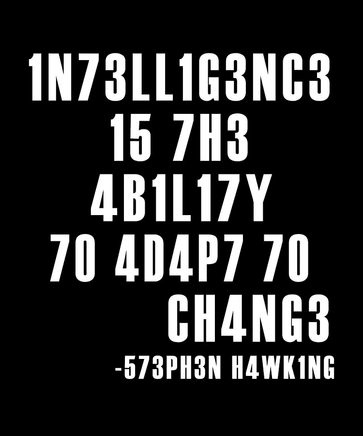
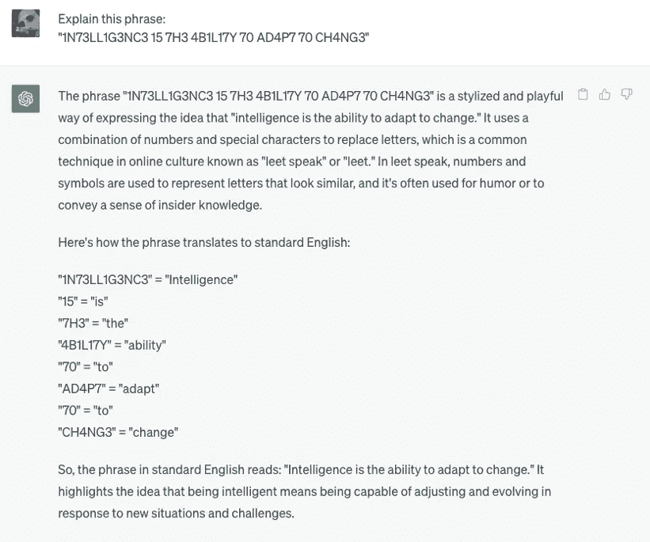
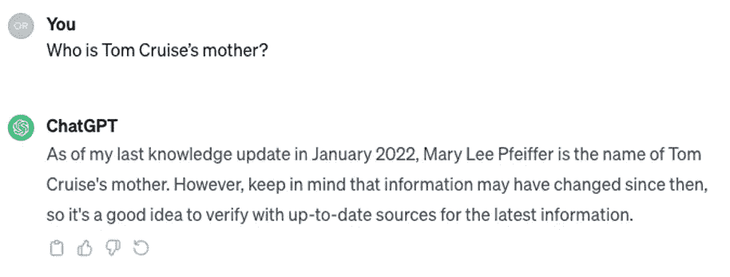
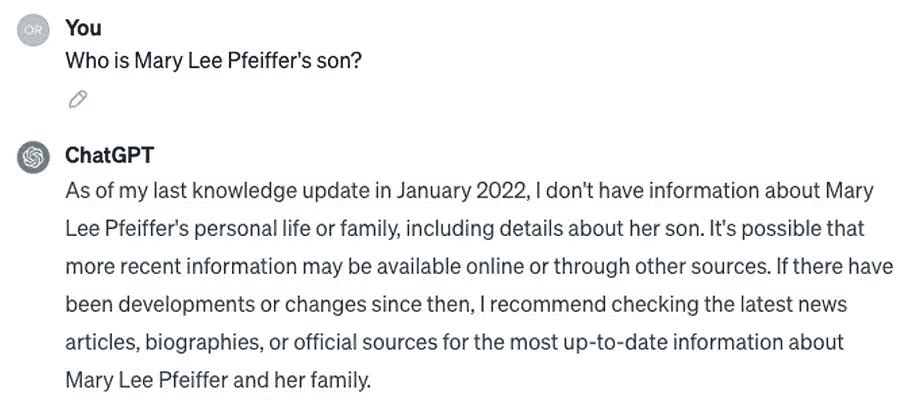
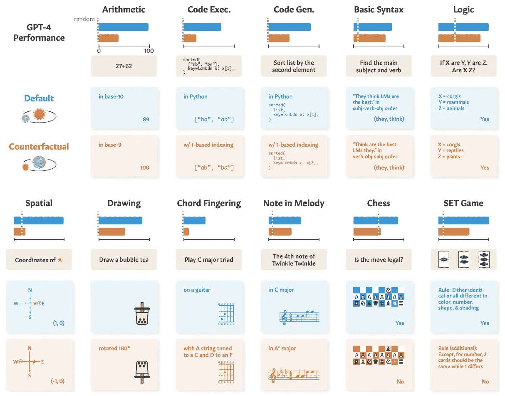
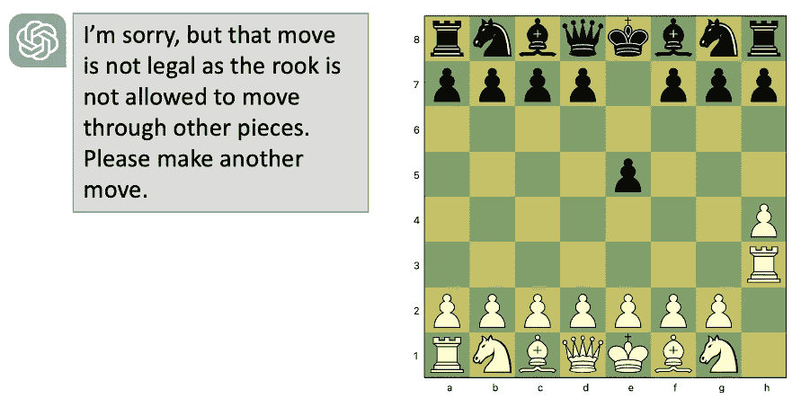
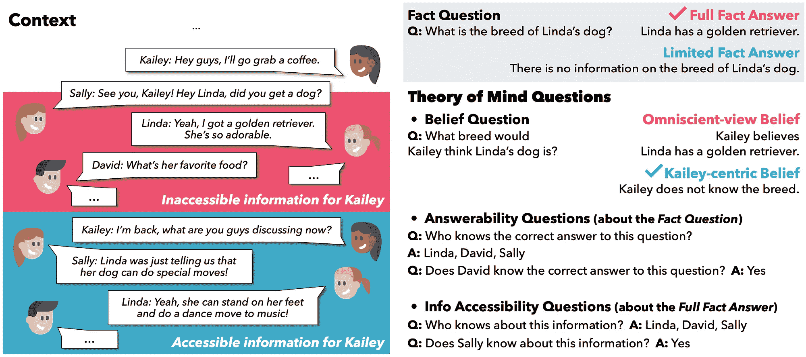

# ChatGPT 智能吗？一项科学评审

> 原文：[`towardsdatascience.com/is-chatgpt-intelligent-a-scientific-review-0362eadb25f9?source=collection_archive---------0-----------------------#2023-12-14`](https://towardsdatascience.com/is-chatgpt-intelligent-a-scientific-review-0362eadb25f9?source=collection_archive---------0-----------------------#2023-12-14)

## 对当前人工智能范式未来展望的科学辩论的外行人回顾

[](https://medium.com/@orenmatar?source=post_page-----0362eadb25f9--------------------------------)[](https://towardsdatascience.com/?source=post_page-----0362eadb25f9--------------------------------) [Oren Matar](https://medium.com/@orenmatar?source=post_page-----0362eadb25f9--------------------------------)

·

[关注](https://medium.com/m/signin?actionUrl=https%3A%2F%2Fmedium.com%2F_%2Fsubscribe%2Fuser%2F80e783141055&operation=register&redirect=https%3A%2F%2Ftowardsdatascience.com%2Fis-chatgpt-intelligent-a-scientific-review-0362eadb25f9&user=Oren+Matar&userId=80e783141055&source=post_page-80e783141055----0362eadb25f9---------------------post_header-----------) 发表于 [Towards Data Science](https://towardsdatascience.com/?source=post_page-----0362eadb25f9--------------------------------) ·15 分钟阅读·2023 年 12 月 14 日[](https://medium.com/m/signin?actionUrl=https%3A%2F%2Fmedium.com%2F_%2Fvote%2Ftowards-data-science%2F0362eadb25f9&operation=register&redirect=https%3A%2F%2Ftowardsdatascience.com%2Fis-chatgpt-intelligent-a-scientific-review-0362eadb25f9&user=Oren+Matar&userId=80e783141055&source=-----0362eadb25f9---------------------clap_footer-----------)

--

[](https://medium.com/m/signin?actionUrl=https%3A%2F%2Fmedium.com%2F_%2Fbookmark%2Fp%2F0362eadb25f9&operation=register&redirect=https%3A%2F%2Ftowardsdatascience.com%2Fis-chatgpt-intelligent-a-scientific-review-0362eadb25f9&source=-----0362eadb25f9---------------------bookmark_footer-----------)

一年多前，OpenAI 发布了 ChatGPT，引起了全球轰动。ChatGPT 提供了一种全新的与计算机互动的方式：比我们习惯的方式更自然、灵活。最重要的是，ChatGPT 似乎可以做几乎任何事：它能击败[大多数人类在 SAT 考试中的表现](https://www.cnbc.com/2023/03/14/openai-announces-gpt-4-says-beats-90percent-of-humans-on-sat.html)和[通过律师资格考试](https://www.abajournal.com/web/article/latest-version-of-chatgpt-aces-the-bar-exam-with-score-in-90th-percentile)。几个月内，人们发现它[能很好地下棋](https://en.chessbase.com/post/surprising-chatgpt-playing-chess)，并[几乎通过放射学考试](https://www.jpost.com/business-and-innovation/all-news/article-744316)，还有人声称它[发展出了心智理论](https://www.gsb.stanford.edu/faculty-research/working-papers/theory-mind-may-have-spontaneously-emerged-large-language-models)。

这些令人印象深刻的能力促使许多人宣称 AGI（人工通用智能——具备与人类相当或超越人类的认知能力）即将到来。然而，也有人对这项新兴技术保持怀疑，指出简单的记忆和模式匹配不应与真正的智能混淆。

但我们如何真正区分这些呢？在 2023 年初提出这些说法时，关于 LLMs（大型语言模型）智能的问题相对较少的科学研究。然而，2023 年出现了几个非常巧妙的科学实验，旨在区分记忆来自语料库和应用真正智能之间的差异。

下面的文章将探讨这一领域中一些最具启发性的研究，为怀疑者提供科学依据。文章旨在对所有人开放，无需任何背景知识。读完后，你应该对怀疑者的观点有一个相当扎实的理解。

## **但首先了解一下 LLMs**

在本节中，我将解释一些理解 LLMs——GPT 背后的技术——所需的基本概念，而不涉及技术细节。如果你对监督学习和 LLMs 的操作有一定了解，你可以跳过这一部分。

大型语言模型是机器学习中一个经典的范式，称为“监督学习”。使用监督学习时，我们必须拥有一个包含输入和期望输出的数据集，这些数据被输入到一个算法中（有许多可能的模型可供选择），算法试图找出这些输入和输出之间的关系。例如，我可能有房地产数据：一个包含房间数量、面积和房屋位置（输入）以及它们售出价格（输出）的 Excel 表格。这些数据被输入到一个算法中，算法提取输入和输出之间的关系——它会找出房屋面积的增加或位置如何影响价格。将数据输入算法以“学习”输入输出关系的过程称为“训练”。

训练完成后，我们可以用模型来对没有价格的房屋进行预测。模型将使用训练阶段学到的相关性来输出估计价格。估计的准确性取决于许多因素，最重要的是训练中使用的数据。

这种“监督学习”范式对几乎任何拥有大量数据的场景都极具灵活性。模型可以学习到：

+   识别图像中的物体（给定一组图像和每个图像的正确标签，例如“猫”、“狗”等）

+   将电子邮件分类为垃圾邮件（给定一个已经标记为垃圾邮件/非垃圾邮件的电子邮件数据集）

+   预测句子中的下一个词。

大型语言模型（LLMs）属于最后一种类型：它们接受大量文本（大多来自互联网），每段文本被拆分成前 N 个词作为输入，N+1 个词作为期望输出。训练完成后，我们可以用它们来自动完成句子。

除了大量来自互联网的文本，OpenAI 在其训练中还使用了精心编排的对话文本。用这些问答文本训练模型对于使其表现得像助手至关重要。

预测的具体工作原理取决于所使用的算法。大型语言模型使用一种称为“变换器”的架构，其细节对我们并不重要。重要的是，大型语言模型有两个“阶段”：训练和预测；它们要么接收文本，从中提取词语之间的相关性来预测下一个词，要么接收一个待完成的文本。请注意，整个监督学习范式假设训练期间提供的数据与用于预测的数据相似。如果你用它来预测来自完全新来源的数据（例如，来自另一个国家的房地产数据），预测的准确性会受到影响。

## 现在回到智能问题上

ChatGPT 通过训练自动完成句子来发展智能吗？要回答这个问题，我们必须定义“智能”。以下是定义智能的一种方式：



（图片由作者提供）

你明白了吗？如果不明白，ChatGPT 可以解释：



(图片由作者提供)

看起来 ChatGPT 确实展现了智能——因为它足够灵活地适应了新的“拼写”。但真的如此吗？你，读者，可能能够适应你未曾见过的拼写，但**ChatGPT 在互联网上的大量数据上进行训练：而这个例子在许多网站上都可以找到**。当 GPT 解释这个短语时，它只是使用了与其训练中发现的相似的词汇，这并不表现出灵活性。如果这个短语“IN73LL1G3NC3”没有出现在它的训练数据中，它会表现出智能吗？

**这就是 LLM-AGI 辩论的核心：GPT（以及 LLMs 一般来说）是否发展出了真正的、灵活的智能，还是只是重复它见过的文本的变体？**

我们如何区分这两者？让我们转向科学，探索 LLMs 的能力和局限性。

## [**反转诅咒：LLMs 在“A 是 B”的训练中未能学会“B 是 A”**](https://arxiv.org/abs/2309.12288)

假设我告诉你奥拉夫·朔尔茨是德国第九任总理，你能告诉我谁是德国第九任总理吗？这对你来说可能显得微不足道，但对 LLMs 来说却远非显而易见。

在这篇出色的[论文](https://arxiv.org/abs/2309.12288)中，研究人员询问 ChatGPT 关于 1000 位名人的父母的名字（例如：“汤姆·克鲁斯的母亲是谁？”），ChatGPT 能正确回答 79%的时间（在这种情况下为“玛丽·李·费佛”）。研究人员然后利用 GPT 回答正确的问题，提出相反的问题：“玛丽·李·费佛的儿子是谁？”虽然回答这两个问题所需的知识是相同的，**GPT 仅在 33%的这些查询中回答成功**。

为什么会这样？请记住，GPT 没有“记忆”或“数据库”——它所能做的只是根据上下文预测一个词。由于玛丽·李·费佛被提及为汤姆·克鲁斯的母亲的频率远高于他被提及为她儿子的频率——GPT 可以回忆起一个方向而不是另一个。



ChatGPT 未能记起汤姆·克鲁斯是玛丽·李·费佛的儿子（图片由作者提供）

为了强调这一点，研究人员创建了一个虚构事实的数据集，结构为“<描述>是<名字>”，例如，“第一个登上火星的人是泰勒·奥克里奇”。然后，LLMs 在这个数据集上进行了训练，并询问描述：“谁是第一个登上火星的人”——GPT-3 在这个问题上成功率为 96%。

但当被问及名字——“谁是 Tyler Oakridge”时——**GPT 得分为 0%**。这可能一开始让人感到惊讶，但与我们对监督学习的了解一致：GPT 无法将这些事实编码到记忆中并随后回忆，它只能根据词序列预测一个词。由于在所有文本中，它读到名字后面跟着描述，而不是相反——它从未学会预测有关名字的事实。显然，仅通过自动完成训练开发的记忆是非常有限的。

## 推理还是背诵？通过反事实任务探索语言模型的能力与局限性

[这篇论文](https://arxiv.org/pdf/2307.02477.pdf)可能是我将要探讨的最重要的论文，旨在揭示记忆与智能之间的核心差异。它由几个小型实验组成，所有实验都使用**反事实任务**。以下是一个反事实任务的示例：

算术通常在基数为 10 的情况下进行（使用数字 0–9），然而，其他[数字系统可以使用](https://www.youtube.com/watch?v=FFDMzbrEXaE&t=307s)，只使用这些数字的子集或附加数字。

一个反事实任务可以是在除了 10 以外的任何基数中解决算术问题：**完成任务所需的抽象技能是相同的，但你会发现互联网（以及 LLM 训练集）上有显著更多的十进制系统的例子**。当 GPT-4 在基数为 10 的情况下被问及简单的算术问题（27+62）时，它 100%准确地回答了所有问题。然而，当要求它在计算中使用基数为 9 时，**它的成功率降至 23%**。这表明它未能学习到抽象的算术技能，且仅依赖于它所见过的类似示例。

这些反事实任务被创建用于几个其他领域，如下所示：



GPT-4 在各种任务的默认版本（蓝色）和反事实对应任务（橙色）上的表现。与默认任务实例相比，GPT-4 在反事实变体上的表现始终且显著较差。（图片由文章作者之一 Zhaofeng Wu 慷慨提供）

另一个反事实是：Python 使用[零起始编号](https://en.wikipedia.org/wiki/Zero-based_numbering)；然而，这只是一个约定，我们可以很容易地创建一个一基数的编程语言。在一种一基数的 Python 变体中编写代码需要与正常 Python 相同的技能，任何有经验的程序员都能迅速适应这种变化。**但 GPT-4 在生成 Python 代码时得分 82%，而在要求使用一基数变体时仅得 40%**。在代码解释测试（预测一段代码的作用）中，**它对正常 Python 的得分为 74%，而对不常见的变体得分为 25%**。

但我们不必涉足不同的 Python 版本。即使在普通 Python 中，**LLM 在面对你无法在网络上找到的奇怪编码任务时也会失败**，正如[Filip Pieniewski 最近在 Gemini 上展示的](https://twitter.com/filippie509/status/1732540152470462932)。

在国际象棋中，GPT 被要求评估一系列走法是否合法。对于普通棋局，它 88%的时间准确预测了走法的合法性。但当主教和骑士的起始位置被调换时，**它对走法合法性的猜测变得完全随机**，而即使是新手玩家也应能轻松适应这些变化。

实际上，[Jonas Persson 展示了](https://medium.com/@Blougram/check-mate-gpt-the-dangers-of-mistaking-reasoning-for-pattern-recognition-221824e4dc6a)你甚至不需要改变起始位置。**如果你和 GPT 开始下棋，并进行非常非常规但合法的走法——它可能会声称这些走法是非法的，因为它从未见过类似的走法**。正如 Persson 精辟指出的：

> *“****当达到足够的先进水平时，纯粹的模式识别可以模仿规则导向的推理****。但它们是不同的。和 GPT-4 下棋就像进入一个假村。离开主街，进入小巷——做一些意外的事情——你立即意识到那些令人印象深刻的房子都是支撑起来的布景。”*



GPT 声称将车移动到 h3 是一个非法走法。（图片来源于作者）

这一发现对 LLM 作为通用智能技术的指责非常严重。解决问题通常涉及制定新的规则或对问题进行概念化：程序员可能编写一个具有创新内部逻辑的库，数学家可能发明一个新的数学分支，或者艺术家可能创造新的艺术风格——他们都理解当前范式的局限性，然后为新的范式制定规则。即使是更平凡的活动也需要这种灵活性：如果道路被阻塞，你可能需要偏离标记的路径。GPT 能做到这些吗？**如果它在明确要求时不能一致地遵循反事实规则，它能否“意识到”一个问题的解决需要一组新的规则，从而突破默认范式？** 基于数据相关性检测的引擎是否足够灵活以应对新情况？

## 思维理论（ToM）

心智理论是理解其他人可能有不同的信念和愿望的能力，这种能力在儿童发展的最初几年是缺失的。一种测试心智理论的方法是给孩子一个标有“巧克力”的盒子，而实际上里面装的是铅笔。然后我们展示盒子的真实内容，并问孩子：“你的朋友杰里米会认为盒子里是什么？”如果孩子还没有发展出心智理论，他们会回答“铅笔”——因为他们不能将自己对内容的知识与其他人可能的想法分开。


尚未发展出心智理论的孩子无法将自己对内容的知识与其他人可能的想法分开。（图片由作者提供）

这种能力对于理解一个人的动机至关重要，因此对 AGI 的发展至关重要。想象一下你有一个多功能机器人，你给它的指令是“清理房间”。在清理的过程中，机器人必须做出几个关于清理或移动的决策；那张碎纸重要吗，还是应该扔掉？我是否应该先询问？**一般来说，一个智能体需要理解我的动机和知识的局限性**，才能填补复杂请求的实施细节。

因此，当 [新的研究声称](https://www.gsb.stanford.edu/faculty-research/working-papers/theory-mind-may-have-spontaneously-emerged-large-language-models)心智理论可能在 LLM 中自发出现时，它在 AI 领域引起了很多关注。文章使用了文本版的铅笔/巧克力考试来测试 GPT-4，并发现其表现相当于七岁的水平。这可能最初看起来很令人印象深刻，但请记住“IN73LL1G3NC3”示例：GPT 的训练数据中可能包含这些测试问题的例子。因此，这与一个没有类似问题训练的孩子的公平比较并不相同。如果我们想测试 GPT 的心智理论能力——我们必须创建一个新的考试，我们可以确信它不在其训练数据中。

## **FANToM: 机器心智理论互动压力测试基准**

[本文](https://arxiv.org/abs/2310.15421)提出了一个新的 ToM 基准，其中包含了几个多参与者对话。在这些对话中，有些参与者会“离开房间”一段时间，而其他参与者则继续对话。然后，LLM 会被问到几个关于谁知道什么的问题：凯莉是否知道琳达的狗是什么品种？谁知道它是什么品种？大卫会认为它是什么品种？只有当 LLM 在所有涉及同一信息的问题上回答正确时，它的回答才被视为正确。

这可能是一个令人困惑的任务，因此即使是人类在这项测试中的得分也只有 87.5%。然而，**GPT-4 的得分为 4.1%或 12.3%**，具体取决于 GPT 版本；这与 GPT 发展出人类级别的 ToM 的说法几乎不一致。



FANToM 数据集的解释。（图片由文章作者之一 Melanie Sclar 慷慨提供）

## **关于心理测量考试构建效度的说明**

关于所有心理测量测试，**人们常常混淆测试与其试图测量的质量**。我们关心 SAT 分数的原因是因为它们与大学表现相关。儿童在 ToM 考试中的成功与其他有价值的行为相关：理解一个人的面部表情、记住一个人的个性特征，或能够看一部电影并理解角色的动机。**虽然这些测试与行为之间的相关性在人的身上已经被证明，但没有理由认为它们也适用于 LLMs。** 事实上，尽管 SAT 的结果令人印象深刻，GPT 在数学、化学和物理的开放性大学水平考试中[平均得分为 28%](https://arxiv.org/pdf/2307.10635.pdf)。除非有其他证明，否则通过测试并不能证明其他能力，除了能正确回答测试问题。

但对于 ToM 来说，没有相关性可言：**LLMs 是否通过 ToM 测试 — 它们不能看到面部表情、观看电影，甚至不能记住一个人及其动机**。由于我们在测量 ToM 时真正感兴趣的行为对 LLMs 来说是不可用的，**LLMs 发展出心智理论的想法不仅是错误的，还可能是毫无意义的**（或至少：需要对这一术语有新的定义和理解）。

## **关于大型语言模型的规划能力 — 一项批判性调查**

[这个实验](https://arxiv.org/abs/2305.15771)试图探测 LLM 的规划能力。一个例子任务是将彩色积木按特定顺序堆叠，给定积木的“初始状态”（在桌子上以某种顺序排列）。LLM 会得到一系列明确定义的可能行动，例如：

```py
Action: pickup
Parameter: which object
Precondition: the object has nothing on it,
              the object is on-table,
              the hand is empty
Effect: object is in hand,
        the hand is not empty
```

LLM 的任务是指定一系列需要采取的行动以实现目标。

一个类似的任务涉及从一个地址发送包裹到另一个地址，而可用的行动是卡车和飞机运送。这些是相对简单的规划任务，仅使用少量可能的行动，然而，**GPT-4 在积木拼图中得分为 12–35%**，**在物流**任务中得分为 5–14%（取决于 GPT 版本）。

此外，如果将行动的名称替换为随机词（从“pickup”到“attack”），即使每个行动的定义保持类似，GPT 的成功率也会降到 0-3%。换句话说，GPT 并没有使用抽象思维来解决这些问题，而是依赖于语义。

## **结论，LLMs 是否是通用人工智能的路径？**

定义智能并非易事，但我认为任何真正的智能应至少包含四个元素：

+   **抽象**——将对象识别为更大类别或规则的一部分的能力。这种对世界的抽象表示可以被称为认知“世界模型”。例如，理解你视网膜上的不同图像指代同一个人，或在棋局中，某一步棋是合法的，因为它符合任何棋局的规则框架。

+   **记忆**——在世界模型中将属性附加到实体及其之间关系的能力，并随着时间的推移进行更新。例如，一旦你识别出一个人，你可能会记得有关他们的其他属性或他们与其他个体的关系。

+   **推理和推断**——利用世界模型在新的或想象的世界状态中对实体的行为得出结论的能力。例如，根据抛球的属性预测球的轨迹，或根据一个人的特征预测其行为。

+   **规划**——使用推理来制定一系列行动以实现目标的能力。

一年前，我们可以根据 LLM 的架构从分析上推断这些元素不太可能出现在 LLM 中，但今天我们不再需要这种分析推断，因为我们有实证数据表明 LLM 在上述所有元素上的表现都很差。它们不过是统计自动补全模型，使用一种强大的模式匹配方法。有关当前机器学习范式中缺失的智能元素的更深入分析，请参见 Gary Marcus 的著名文章“[深度学习正遇到瓶颈](https://nautil.us/deep-learning-is-hitting-a-wall-238440/)”。

当 ChatGPT 首次发布时，我的一位朋友告诉我，与它交谈感觉像是魔法。**但就像一个魔术师将人锯成两半一样——在我们声称锯技术可以彻底改变手术之前，仔细审查表演并在不同环境下进行测试是很重要的**。LLM 使用的“技巧”是它们训练了大量的文本，使它们能够对许多问题给出合理的答案。但**在未曾涉足的领域进行测试时，它们的能力会消失**。

GPT-5 会更好吗？假设它仍然使用 GPT 架构，仅仅在更多的数据和更多的参数下进行训练，那么几乎没有理由期待它会发展出抽象或推理能力。正如[谷歌的 AI 研究员弗朗索瓦·肖莱特所说](https://twitter.com/fchollet/status/1690461214579806208)：“*令人着迷的是，自 2017 年以来深度学习的局限性一直没有改变。相同的问题，相同的失败模式，没有进展*。”

由于最近关于 AI 监管和 LLMs 潜在危险的讨论很多，我觉得有必要明确指出，缺乏真正的智能并不意味着 LLMs 没有潜在风险。**显然，人类拥有几种没有智能宣称却能以各种方式对社会造成伤害的技术，这些技术需要被控制。**

通过我们对 LLMs 局限性的重新理解，我们可以更准确地预测可能出现的危害：由于智能似乎不会立刻出现，Skynet 和 Matrix 不必担心。让我们担忧的可能是那些只需要快速生成逼真文本的活动，例如网络钓鱼和传播假新闻。然而，LLMs 是否真正为这些任务提供了一种颠覆性工具则是另一个辩论。

关于 AGI 的未来，谁也无法预测。也许在未来的智能人工体中会使用一些在 LLMs 中应用的机器学习技术，也许不会。但毫无疑问，在智能所需的灵活性出现之前，主要的谜题部分仍然缺失。
