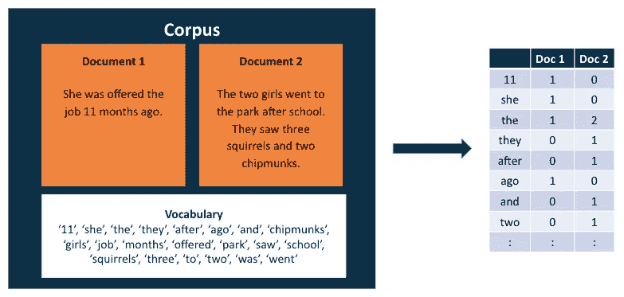

# 特征工程已经过时了吗？

> 原文：[`towardsdatascience.com/is-feature-engineering-dead-203e6a9e5751`](https://towardsdatascience.com/is-feature-engineering-dead-203e6a9e5751)

## **评估特征工程在现代数据科学中的角色**

 [Leah Berg and Ray McLendon](https://medium.com/@DataScienceRebalanced?source=post_page-----203e6a9e5751--------------------------------)

·发表于[Towards Data Science](https://towardsdatascience.com/?source=post_page-----203e6a9e5751--------------------------------) ·阅读时间 6 分钟·2023 年 1 月 10 日

--

图片由[Markus Spiske](https://unsplash.com/@markusspiske?utm_source=medium&utm_medium=referral)提供，来源于[Unsplash](https://unsplash.com/?utm_source=medium&utm_medium=referral)

深度学习是目前数据科学中最热门的话题之一——你好，[ChatGPT](https://openai.com/blog/chatgpt/)。处于这一领域前沿的数据科学家明白，深度学习与许多其他机器学习和人工智能领域有所不同。特征工程，即为模型创建和转换输入的过程，是这些关键区别之一。该领域的领导者如谷歌的软件工程师 Francois Chollet 表示，“深度学习消除了对特征工程的需求”（1）。

那么这是否意味着特征工程已经过时了？我不这么认为，原因如下。

# **特征工程 — 机器学习与深度学习的区别**

在我们深入探讨之前，首先需要了解在机器学习和深度学习中如何生成特征。在传统的机器学习中，你通常不会直接使用原始数据作为模型的输入。相反，你会对数据进行调整和转换，以提高模型的性能。

例如，如果你需要创建一个分类文档的模型，你可能会想用文档的文本作为特征，但你可能不会将原始文本直接输入模型。相反，你可能会将文本表示为词频向量。

这是一个将文本表示为词频向量的例子。图片由作者提供。

这个特征不是由模型本身创建的。数据科学家花时间理解问题，并创建数据的数值表示，使模型更容易学习当前任务。

从表面上看，这个字数统计可能看起来非常简单，你可能会怀疑是否需要人来创建这个特征。但当你通过各种步骤如去除标点符号、规范化文本和去除像“the”和“of”这样的停用词来清理数据集时，特征的字数统计与原始数据集上的统计结果大相径庭。所有这些特征工程步骤使得机器学习模型能够更好地从复杂数据（如文本）中的潜在噪声中提取信号。

相反，深度学习中没有特征工程。我第一次接触到这一点是通过卷积神经网络（CNNs）进行计算机视觉。在许多方面，为模型创建特征以区分图像中的猫和狗是一项艰巨的任务。但随着 CNN 的出现，计算机视觉领域的特征工程基本上变得过时。CNN 开创了一个新纪元，使机器学习模型能够确定适合任务的特征。

# **特征工程为何将长期存在**

尽管像 ChatGPT 这样的深度学习技术在主流新闻中引起了很多关注，我们能否依赖深度学习来解决需要机器学习的日常业务问题？正如生活中的许多事情一样，我认为答案是“视情况而定”。在计算机视觉的情况下，我认为特征工程已经过时，但这只是一个小众领域。让我们探讨一些我认为特征工程至关重要的领域。

## **数据分析**

在数据分析领域，特征工程仍然是工作的核心部分——只是没有叫这个名字。每天，我发现团队成员使用 Excel、Power BI 或 Tableau 在创建可视化之前对原始数据集进行计算。这些计算中的许多都是数据科学家所称的特征工程！

图片由 [Markus Winkler](https://unsplash.com/es/@markuswinkler?utm_source=medium&utm_medium=referral) 拍摄，来源于 [Unsplash](https://unsplash.com/?utm_source=medium&utm_medium=referral)

尽管数据分析师可能会计算两个数字系列的比率并将其绘制为线图供业务利益相关者审阅，但数据科学家可能会将该比率用作机器学习模型的特征。出于某种原因，数据分析师不会将这视为特征工程。

特征不仅仅用于帮助机器学习模型进行学习。它们也用于帮助人们学习。就像数据科学家一样，数据分析师也处理复杂多变的数据。这种现实意味着特征工程对于数据分析师从数据中提取特征、使可视化更具洞察力至关重要。

## **可解释性**

虽然深度学习模型可能能够自动生成特征，但这通常会牺牲可解释性。许多现实世界的业务问题需要可解释性。实际上，某些使用案例甚至法律上要求使用可解释的模型。

以信用行业为例。如果你有一个模型用来批准或拒绝贷款，你必须能够用通俗易懂的语言解释模型为何拒绝了某人的贷款。不幸的是，深度学习模型不可解释，因此信用行业的数据科学家通常需要使用需要特征工程的简单传统机器学习模型。

图片由[Scott Graham](https://unsplash.com/@homajob?utm_source=medium&utm_medium=referral)拍摄，来源于[Unsplash](https://unsplash.com/?utm_source=medium&utm_medium=referral)

特征工程使你能够创建和选择对人类更有意义且更具可解释性的特征。通过仔细选择和创建相关特征，你可以更容易理解模型如何得出其预测结果以及在不同场景下可能表现如何。

此外，可解释的模型通常更可信，并且更容易部署到生产环境，因为它们更透明且更易于维护。当模型不可解释时，可能很难理解它为何做出某些预测。这使得调试和改进模型变得具有挑战性，也难以识别和修复可能出现的问题。

## **数据质量**

无论是深度学习还是机器学习，模型的好坏取决于数据的质量——垃圾进，垃圾出。虽然许多数据科学家可能将特征工程视为构建模型过程中的一步，但它也可以帮助数据科学家提高数据集的质量。

我曾在多个项目中为数据质量监控构建功能。其中我最喜欢的一个是与风速计数据相关的项目。风速计可能因各种原因出现故障。我们用来识别坏数据的技术之一是计算相同高度风速计之间的比率，并将其与风向进行散点图分析。

图片由[Benjamin Sadjak](https://unsplash.com/@bemiii?utm_source=medium&utm_medium=referral)拍摄，来源于[Unsplash](https://unsplash.com/?utm_source=medium&utm_medium=referral)

这一组功能使我们能够识别出风速计的轴承何时出现故障。我们能够删除坏数据，并适当地提高模型的性能。

# **结论**

尽管深度学习领域取得了令人印象深刻的进展，但数据科学家和数据分析师构建功能的需求并未过时。在许多方面，这种需求现在比以往任何时候都更加迫切，尤其是在日益复杂的世界中。

特征工程使数据科学家和数据分析师能够将原始数据转换为更好地表示数据中的潜在结构和关系的形式。此外，它还使他们能够通过识别和解决可能影响模型性能或导致不正确分析的错误、不一致或缺失值来确保数据质量。最终，特征工程是一项对数据科学家和数据分析师都非常重要的技能，并且将继续存在。

# **参考文献**

1.  F. Chollet，《用 Python 进行深度学习》（2017），[`www.amazon.com/Deep-Learning-Python-Francois-Chollet/dp/1617294438`](https://www.amazon.com/Deep-Learning-Python-Francois-Chollet/dp/1617294438)
