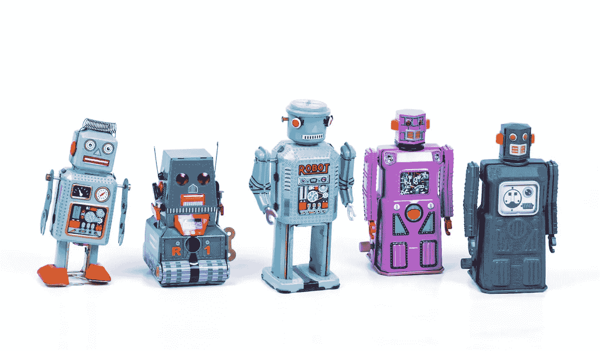

# 生成式 AI 是否值得其环境足迹？

> 原文：[`towardsdatascience.com/is-generative-ai-worth-its-environmental-footprint-8b6130ade14f?source=collection_archive---------5-----------------------#2023-10-31`](https://towardsdatascience.com/is-generative-ai-worth-its-environmental-footprint-8b6130ade14f?source=collection_archive---------5-----------------------#2023-10-31)

## 生成式 AI 可能会有显著的环境足迹，而这个故事讨论了我们可能获得的回报。

 [Kasper Groes Albin Ludvigsen](https://kaspergroesludvigsen.medium.com/?source=post_page-----8b6130ade14f--------------------------------)

·

[关注](https://medium.com/m/signin?actionUrl=https%3A%2F%2Fmedium.com%2F_%2Fsubscribe%2Fuser%2Fba0b31bed21a&operation=register&redirect=https%3A%2F%2Ftowardsdatascience.com%2Fis-generative-ai-worth-its-environmental-footprint-8b6130ade14f&user=Kasper+Groes+Albin+Ludvigsen&userId=ba0b31bed21a&source=post_page-ba0b31bed21a----8b6130ade14f---------------------post_header-----------) 发表在 [Towards Data Science](https://towardsdatascience.com/?source=post_page-----8b6130ade14f--------------------------------) ·8 min read·2023 年 10 月 31 日

--

图片由 Eric Krull 提供，来源于 Unsplash

生成式 AI 目前受到了广泛关注。ChatGPT 报道称拥有数亿用户，类似的功能也被声称整合到了从 Microsoft Word 和 Teams 到搜索引擎的多种数字产品中。

如果数十亿人开始广泛使用生成式 AI，其环境足迹可能会变得显著[1]。

## 普遍生成型人工智能的环境影响

### 如果数十亿人开始每天使用生成型人工智能技术，我们的环境会发生什么？

## 普遍生成型人工智能的环境影响

但我们从这项技术中获得的价值是否会超过潜在的环境成本？

这是我将在本文中尝试阐明的问题， outlining some perspectives on what we may stand to gain.

首先，我将提供一些关于生成型人工智能可能带来的生产力提升的观点。

接下来，我将讨论生成型人工智能是否会成为一种净正面或净负面的技术。

接下来，我将讨论生成型人工智能可能在多大程度上减少不平等。

最后，我将提供我的观点，探讨我们是否应该期待生成型人工智能加快绿色转型。

## 范围

请注意，以下内容***仅***涉及生成型人工智能。生成型人工智能不同于其他类型的人工智能。

同时请注意，我仅关注生成文本（包括代码）的生成型人工智能，排除图像和声音生成技术。

关于生成型人工智能的简单工作定义，请参见[2]。

# 生成型人工智能是否会提高我们的生产力？

让我们考虑一下生成型人工智能可能带来的生产力提升程度。一项关于 ChatGPT 对各种写作和分析任务的生产力影响的研究发现，使用 ChatGPT 的参与者在这些任务上花费的时间比未使用 ChatGPT 的对照组少了 40%。此外，根据同行评审，任务解决方案的质量提高了 18%[3]。

一项针对软件开发人员的调查显示，88%的受访者报告称，使用生成型人工智能工具*GitHub Co-Pilot*可以提高他们的生产力[4]。这一结果在一篇实证研究论文中得到了验证，该论文表明，在使用 Co-Pilot 实施一个 JavaScript 服务器时，生产力提高了 126%[5]。

正如尼尔森[6]所指出的，与 2007 年至 2019 年间美国 1.4%和欧盟 0.8%的年度劳动生产力平均增长率相比，这些数字令人震惊。

## ChatGPT 每次查询的能耗

### ChatGPT 回答一个问题需要消耗多少电力？

## ChatGPT 每次查询的能耗

但这些结果是否适用于研究研究的实验环境之外？我们是否可以期望类似的生产力提升？例如，实现一个 Javascript 服务器（Co-pilot 帮助完成的任务比原计划快了 124%）是否是软件开发中的一个代表性任务？我不知道，因为我从未做过这个任务，但我相当肯定，不同编程任务的生产力提升不会相同。我期望像前述这样的生产力提升可以在解决明确的编程任务时获得，这些任务包括编写大量的样板代码，但目前我预期生成性 AI 对于需要大量时间考虑问题后才知道问什么问题的任务的帮助会很小——如果有的话。因此，我预计编程任务的平均生产力提升将低于 126%。

随着生成性 AI 工具和我们使用它们的能力变得越来越成熟，我们可能会看到更高、更广泛的生产力提升。

这就留下了一个问题：社会愿意为这样的生产力提升支付什么环境成本？确定一个可接受的成本的一个方法是查看历史生产力提升的碳成本。我将这留给读者作为练习。

[## ChatGPT 的电力消耗，第二部分](https://kaspergroesludvigsen.medium.com/chatgpts-electricity-consumption-pt-ii-225e7e43f22b?source=post_page-----8b6130ade14f--------------------------------)

### 对 ChatGPT 成本的估算支持了 ChatGPT 每月使用数百万千瓦时的估计。

[kaspergroesludvigsen.medium.com](https://kaspergroesludvigsen.medium.com/chatgpts-electricity-consumption-pt-ii-225e7e43f22b?source=post_page-----8b6130ade14f--------------------------------)

# 生成性 AI 会成为一种净正面技术吗？

现在让我们讨论生成性 AI 是否会成为一种净积极技术的不同观点——即一种其足迹被其导致的减排所超越的技术。

反对广泛采用生成性 AI 的一个论点是：如果生成性 AI 不减少温室气体排放，它将是一种净负面技术——一种使用的排放量多于减少的技术。由于温室气体排放导致的气候变化，我们应该减少我们的全球碳足迹，而不是增加它。

但生成性 AI 会是净负面还是净正面呢？很容易想象它可以在某些地方节省消耗。例如，它可能减少我们搜索 Google 和加载网页的需求。但问题是进行一次 Google 搜索和加载一个网页的碳足迹是多少。这是一个复杂的问题。

关于进行一次 Google 搜索的电力消耗，网络上确实有一个数字，但据我所知，这个数字来自 2009 年。自那时以来，情况可能发生了很大变化，我想象今天的 Google 搜索是由更复杂且能耗更高的机器学习方法驱动的。然而，我确实预期 Google 搜索的能耗会低于 ChatGPT 的查询，尽管我认为差异可能小于某些地方提到的 10 倍[7]。

鉴于此，我怀疑并非所有生成型人工智能的查询都会节省足够的 Google 搜索量来弥补其环境成本。

我已经写了很多关于人工智能环境影响的内容，而我经常收到的评论之一是生成型人工智能将减少我们的整体资源消耗和碳足迹。除了上述情况之外，我仍然很难看到这种情况。但是请挑战这一点。

最近发表了一篇题为“AI 的碳排放低于人类的写作和插图”[8]的论文。论文主张生成型人工智能比人类更具能源效率。我将在即将发布的博客文章中分析这篇论文中的主张。

 [## 通过我的推荐链接加入 Medium - Kasper Groes Albin Ludvigsen

### 作为 Medium 的会员，你的部分会员费用将用于你阅读的作者，你可以完全访问每个故事…

kaspergroesludvigsen.medium.com](https://kaspergroesludvigsen.medium.com/membership?source=post_page-----8b6130ade14f--------------------------------)

# 生成型人工智能会减少不平等吗？

在我与人们讨论生成型人工智能环境影响的过程中，我听到一些人认为环境影响是值得的，因为他们期望这项技术会有助于减少不平等。是否可以期待这种情况并不明确。原因如下。

之前提到的关于 ChatGPT 对生产力影响的研究[3]发现，技能较低的人使用 ChatGPT 的生产力提升大于技能较高的人。因此，我们可能预期生成型人工智能的使用可以帮助提升受到结构性不平等影响的人群。

但是，不同工人群体在生成型人工智能提升生产力的程度上存在差异。以记者和木匠为例。对于写作的记者来说，生成型人工智能可以直接支持他们的主要产出（文章）的生产。而生成型人工智能不会直接帮助木匠建房子。所以似乎并不是所有工人群体都能平等地从生成型人工智能中受益。如果使用生成型人工智能带来的生产力提升导致工资上涨，我们可能会看到工人群体之间的不平等加剧。

这一观点得到了麻省理工学院的研究支持，其中一位经济学家发现，1980 年至 2016 年美国工资不平等增长的 50%至 70%是由自动化造成的[9]。

与此同时，国际货币基金组织（IMF）指出，人工智能可能会加大富国和穷国之间的差距[10]。

总而言之，上述研究表明，生成式人工智能可能有助于减少在生成式人工智能能够协助的任务中技能水平的不平等，但同时，它可能增加不同工人群体和国家之间的不平等。

 ## 如何估算和减少机器学习模型的碳足迹

### 两种简单的方法来估算机器学习模型的碳足迹以及 17 个减少碳足迹的建议

[towardsdatascience.com

# 生成式人工智能是否会加速绿色转型？

现在让我们考虑生成式人工智能在多大程度上能够加速绿色转型。显然，作为白领工人，绿色能源及相关领域的研究人员可能会因使用生成式人工智能而变得更高效。他们可能像其他人一样，写研究文章或编写代码的速度更快。但在可预见的未来，我个人不期待生成式人工智能系统如 ChatGPT 能直接促进绿色转型。我很难想象 ChatGPT—一个基于现有文本生成下一个最可能单词的通用文本生成工具—能够提出突破性的想法。不过，我希望我错了。如果你有不同的观点，请告诉我。

然而，我确实相信其他类型的人工智能可以帮助加速绿色转型或应对气候变化。例如，其他类型的人工智能可以帮助减少建筑能耗、打击森林砍伐、优化航运路线以减少能耗等。

# 结论

生成式人工智能的兴起引发了关于这项技术环境成本的讨论。本文的目的是阐明我们从生成式人工智能中可以获得什么，以便为关于生成式人工智能是否值得其环境足迹的辩论提供信息。

初步研究表明，使用生成式人工智能可能会提高某些任务的生产力，但尚不清楚这些发现是否会推广到其他环境。

研究还表明，生成式人工智能可以帮助减少同一职业中工人之间的技能不平等，但我认为它可能会导致不同职业工人之间的不平等加剧。此外，人工智能和自动化技术已被发现增加了国家之间的经济差距。

关于生成式人工智能是否会加速绿色转型，我个人的观点持怀疑态度。

总之，很明显生成性人工智能对生产力有积极影响，也可能对不平等有影响，但这需要付出环境代价。问题是：生成性人工智能的好处是否超过了成本？这本质上是一个价值判断——我希望你在阅读完这篇博客文章后，对这个问题有了更好的思考。

感谢阅读。

就这些！希望你喜欢这个故事。告诉我你的想法吧！

关注我，获取更多关于人工智能和可持续发展的内容，并[订阅](https://kaspergroesludvigsen.medium.com/subscribe)，以便我发布时通过电子邮件获取我的故事。

我有时也会写关于时间序列预测的文章。

也欢迎在[LinkedIn](https://www.linkedin.com/in/kaspergroesludvigsen)上联系我。

# 参考文献

[1] https://towardsdatascience.com/environmental-impact-of-ubiquitous-generative-ai-9e061bac6800

[2] https://www.mckinsey.com/featured-insights/mckinsey-explainers/what-is-generative-ai

[3] https://news.mit.edu/2023/study-finds-chatgpt-boosts-worker-productivity-writing-0714

[4] https://github.blog/2022-09-07-research-quantifying-github-copilots-impact-on-developer-productivity-and-happiness/

[5] https://arxiv.org/abs/2302.06590

[6] https://www.nngroup.com/articles/ai-tools-productivity-gains/

[7] https://www.cell.com/joule/fulltext/S2542-4351(23)00365-3?_returnURL=https%3A%2F%2Flinkinghub.elsevier.com%2Fretrieve%2Fpii%2FS2542435123003653%3Fshowall%3Dtrue

[8] https://arxiv.org/abs/2303.06219

[9] https://www.technologyreview.com/2022/04/19/1049378/ai-inequality-problem/

[10] https://www.imf.org/en/Blogs/Articles/2020/12/02/blog-how-artificial-intelligence-could-widen-the-gap-between-rich-and-poor-nations
