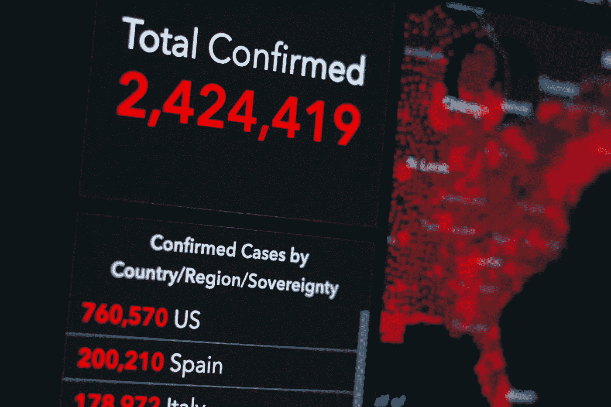

# 医疗分析适合你吗？

> 原文：[`towardsdatascience.com/is-healthcare-analytics-right-for-you-320897b34409`](https://towardsdatascience.com/is-healthcare-analytics-right-for-you-320897b34409)

## 你在这个领域面临的 3 个挑战，直到你退休的那一天

 [Stefany Goradia](https://stefanygoradia.medium.com/?source=post_page-----320897b34409--------------------------------)

·发布于 [Towards Data Science](https://towardsdatascience.com/?source=post_page-----320897b34409--------------------------------) ·阅读时间 7 分钟·2023 年 1 月 2 日

--

图片由 [KOBU Agency](https://unsplash.com/@kobuagency?utm_source=medium&utm_medium=referral) 提供，来源于 [Unsplash](https://unsplash.com/?utm_source=medium&utm_medium=referral)

目前，当你在 Indeed 上搜索“医疗分析”时，会返回超过 8,000 个职位列表。它们涵盖了从健康 IT 和信息学到数据分析师等多种职位。你还可以通过搜索特定类型的职位来找到更多工作机会，例如：收入周期、风险、质量、EPIC、基于价值的护理（VBC）、人口健康、利用管理等。

# 为什么有这么多健康分析职位？

医疗行业是一个快速增长和变化的行业，同时也高度受监管，复杂（且有些混乱），细节丰富，工作起来可能非常令人恼火，并且是每一个活着的人都必需的服务。

该领域最成功和充满热情的数据从业者深刻理解**数据**和**业务**或医疗系统内部运作的细微差别。这通常意味着最资深的人在医疗领域有着许多年丰富的经验，仿佛都是不可能智慧的神谕者。事实上，如果你在医疗行业工作了整个职业生涯，我保证你每天都会学到新东西。这并不意味着新进入医疗行业的人不会成功——实际上，我们需要更多带着其他行业新想法进入医疗行业的人！这只是意味着医疗领域不是那些疲惫不堪的人、寻求“快速成功”的人或只是想浅尝辄止的人，所以我们看到有相当多的员工流动，他们最终跳槽到其他行业，通常是在那些能赚到更多（有时更多得多）钱或面临更少障碍以获得结果的地方。

## 你必须真正热爱医疗保健（并且忍受一些痛苦）才能坚持留在这个领域。但正是这些挑战使医疗保健成为一个最好的保密秘密。

# 医疗保健是数据爱好者的*梦想！*

由 [Alexander Sinn](https://unsplash.com/@swimstaralex?utm_source=medium&utm_medium=referral) 拍摄于 [Unsplash](https://unsplash.com/?utm_source=medium&utm_medium=referral)

除了为你的工作提供意义之外，对于那些对数据有兴趣的人来说，它也可能带来经济上的回报——即使是刚刚起步的初学者也能获得奖励。入门级数据分析师的薪资通常在$80,000 以上，并且对于那些具备特定技能集（如数据科学、先进分析、特定健康 IT 系统（如 EPIC）或临床背景等）的人员，薪资可以迅速飙升到六位数的高端。对于那些已经在医疗保健行政或临床角色中的人来说，增加数据专业知识到你的简历中，可以轻松地将你定位于更高级别和更高薪资的职位。

医疗保健为分析和数据科学提供了巨大的机会，但这也伴随着重大挑战。这些挑战很多，但我将其简化为三个主要问题：信任、偏见，以及（惊喜！）糟糕的数据。

## 继续阅读，以确定医疗保健分析是否适合你。

# **第一大问题 — 缺乏信任：**

当涉及到人们的实际生命时，**任何**数据模型中的风险或不确定性都可能很难被接受——尤其是当模型方法缺乏解释性，这可能让医生或其他护理人员对结果的推导过程或影响结果的因素感到安慰时。还有一个变更管理的因素，这与数据模型的可靠性或洞察的有效性无关。如果你比较保守，创建风险模型或金融模型，你可能在信任领域会有更多成功，但可能会遇到更多的第二大问题。

# **第二大问题—偏见泛滥：**

通常当你想到偏见时，可能会想到一个人固有的假设，这些假设无意中塑造了数据模型或洞察的开发或解释。但偏见也可以指你正在处理的数据本身是固有的片面。在医疗保健中，这种情况被成倍放大，以下仅是*一些*因素：

+   **个人偏见：** 一个人的固有假设不经意间影响数据模型或洞察的发展或解释（显而易见）。但在医疗保健中，这可能意味着你甚至没想到的事情，比如“我想分析健康不平等，所以我会查看不同非洲裔美国人的结果如何与白人不同，并考虑社会经济因素、人口统计、种族/民族和疾病历史。” 看明白了吗？即使我们不认为自己有偏见，我们仍然倾向于基于我们所了解的轶事或之前分析过的内容来形成假设和分析。相反，我们需要专注于打破这种轶事偏见，利用数据识别**未知的未知**。这可能意味着新的和新颖的数据来源，添加你之前从未想到的输入或特征，或开发更多的无监督方法等。

+   **数据偏见：** 我们只知道我们四面墙内发生的事情（我们的数据仅反映我们的操作方式和已知的事物）；或者你的数据可能只反映某一特定群体或子集的患者，他们的行为非常特殊和不同——例如，分析医疗保险人群与医疗补助人群、雇主组与特定雇主之间的见解很可能无法转移。

+   **确认偏见：** 当客户要求数据洞察时，如果你的发现与他们轶事上或情感上认为准确或真实的内容不符，就会被忽视；类似地，人们倾向于倾向于确认他们假设的关键论点，以便为他们已经在心理上做出的决定提供理由，并忽视其他内容。即使他们声称以数据驱动，这也**非常**难以仅通过数据来克服。

# **关键问题#3 — 数据不一致和碎片化**

**惊喜！** 这不仅限于医疗保健，数据社区已经对此进行了多次讨论，因此我不会在这里重复。我不会说医疗保健的数据是所有数据中最脏的，尽管我可能会暗示…

知道你将不得不让你的手感到挫败，必须极其关注细节，不对任何结果解释做出假设，直到你理解数据和业务。这不是一个适合纯粹主义者或对模型创新更感兴趣的人，而不是理解数据、假设和解释或沟通的细微差别的地方。

## 医疗保健的变革不会发生在没有更好的数据系统、数据整合和数据共享的情况下。

这是显而易见的，已有很多文献记录并讨论过。但今天，它对潜在的医疗保健分析师有两层含义。

1.  要获得医疗保健所需的全新和创新的见解，并真正成为创新者，你需要来自许多不同系统的新数据，而不仅仅是你的电子病历（EMR）或索赔数据。为了获得这些数据，你将不得不在整个分析过程中花费 80-90%的时间扮演数据探索者、数据工程师和数据验证者的角色。这意味着……

1.  你**必须**对医疗保健分析充满好奇，善于合作，并在沙盒中友好相处。如果你想在医疗保健分析中取得进展，**简单来说，这里不再是数据封建主义或智力优越的地方。** 在未来的文章中，我将讨论为什么这种心态对那些不愿分享的医疗保健组织会自我限制——你需要的或想要的大量有意义的数据必须来自他人，如果你能让人们与你分享并一起合作，使其可用，更不用说可操作了。

# 这一切听起来是否不可能？可能是的。

为了提供背景，目前许多组织仍在努力链接自己患者的旅程，即使是在他们的四面墙之内——例如，从医生办公室/医疗小组访问（在一个 EMR 系统中），到医院访问（在不同的 EMR 系统中），到已安排的后续专家推荐预约，再到该人是否参加了这个后续预约——更不用说患者是否领取了处方、离开医院后立即去了一家麦当劳、回到一个充满有毒自来水的家中、在一个远离主要护理提供者的高山社区、在一个没有高速互联网或宽带的地区、在一个教育水平最低的州等等。社区健康和医疗保健在不断缓慢地迈向……

# 但这些看似不可逾越的挑战正是它如此令人兴奋的原因！

我们在所有这些领域还有很长的路要走，但我相信，凭借合适的人才、出现的新数据方法和重新焕发的合作热情，我们可以达到目标。我们看到医疗保健比以往任何时候都更加拥抱数据，数据科学的新方法带来了前所未见的新见解，而由于主要运营商和政府项目推出的新举措和计划，合作达到了前所未有的高水平。

医疗保健分析可能不适合那些容易疲倦的人，但它绝对适合那些深度好奇和顽强坚持的人。

那个人会是你吗？

[**在 Medium 上关注我**](https://medium.com/@stefanygoradia)以获取更多关于健康数据和医疗保健分析的内容。

[**在 LinkedIn 上联系**](https://www.linkedin.com/in/stefanygoradia/)以分享经验教训和数据驱动的方法，以便更好地决策。

[***Stefany Goradia***](https://www.linkedin.com/in/stefanygoradia/) *是* [*RS21*](https://rs21smarter.medium.com/) *健康实验室的副总裁，她的职业生涯专注于医疗分析的前线工作，并为内部和外部客户提供价值。她撰写了如何解读医疗数据、将其传达给利益相关者，以及如何利用这些数据来支持明智的决策和执行。*
