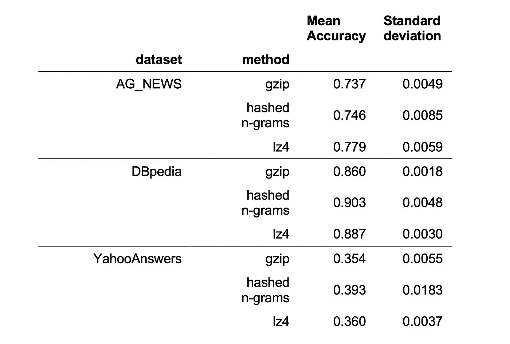

# 你需要的是压缩吗？

> 原文：[`towardsdatascience.com/is-it-compression-that-you-need-7aa544a328b1?source=collection_archive---------4-----------------------#2023-07-22`](https://towardsdatascience.com/is-it-compression-that-you-need-7aa544a328b1?source=collection_archive---------4-----------------------#2023-07-22)

## 更高效的基于压缩的主题分类实现

 [Matthias Minder](https://medium.com/@mtths.mndr?source=post_page-----7aa544a328b1--------------------------------)

·

[关注](https://medium.com/m/signin?actionUrl=https%3A%2F%2Fmedium.com%2F_%2Fsubscribe%2Fuser%2F6a3d24668b34&operation=register&redirect=https%3A%2F%2Ftowardsdatascience.com%2Fis-it-compression-that-you-need-7aa544a328b1&user=Matthias+Minder&userId=6a3d24668b34&source=post_page-6a3d24668b34----7aa544a328b1---------------------post_header-----------) 发布于 [Towards Data Science](https://towardsdatascience.com/?source=post_page-----7aa544a328b1--------------------------------) ·6 min read·2023 年 7 月 22 日

--

图片由 [Tomas Sobek](https://unsplash.com/es/@tomas_nz?utm_source=medium&utm_medium=referral) 提供，来源于 [Unsplash](https://unsplash.com/?utm_source=medium&utm_medium=referral)

最近发布的论文标题为*“低资源”文本分类：一种无参数分类方法与压缩器* [1]，最近引起了相当多的公众关注。他们的关键发现是，在某些情况下，他们可以通过简单的想法来超越大型语言模型如 BERT，即如果两个文本文件可以被压缩到更小的文件大小，它们就更相似（尽管关于他们结果的有效性存在一些争议，见[这篇博客文章](https://kenschutte.com/gzip-knn-paper/)和[这次讨论，包括作者的回复](https://github.com/bazingagin/npc_gzip/issues/3#issuecomment-1641679866)）。

他们方法的主要思想是，Bennet 等人定义的“信息距离”在文本分类中是一个好的距离度量。由于信息距离本身不可计算，他们使用归一化压缩距离（NCD）[3]来近似，它通过像 gzip 这样的“现实生活”数据压缩器来估计信息距离。NCD 具有更好的压缩器（即压缩比更好的压缩器）可以更好地估计真实信息距离的特性。

因此，自然期望更好的压缩器会在分类中实现更好的性能。但他们无法通过实验验证这一点；论文中考虑的最佳压缩器 bz2 在准确性方面表现不如 gzip。他们解释道：“[…] bz2 使用的 Burrows-Wheeler 算法通过在压缩过程中排列字符，忽略了字符顺序的信息” [1, p.6817]。这意味着仅凭压缩无法解释他们的发现，但与字符顺序也有关系。

这让我思考：他们的结果有多少是由于压缩，多少是由于两个文档之间的字符串比较？

为了调查这个问题，我将他们的结果与两种替代方案进行比较：（1）一个仅依赖于替换重复字符串的简单压缩器，以及（2）一个在查询文档和属于某些主题的所有文档之间显式进行子字符串匹配的算法。

**第一次消融：LZ4 能否完成任务？** 压缩算法 gzip 基于[DEFLATE](https://en.wikipedia.org/wiki/Deflate)，它使用[LZ77](https://en.wikipedia.org/wiki/LZ77_and_LZ78)和[霍夫曼编码](https://en.wikipedia.org/wiki/Huffman_coding)来压缩数据。让我们更详细地了解这两种算法，并思考它们在我们使用场景中的含义。

在压缩过程中，LZ77 使用一个滑动窗口来处理先前看到的数据。如果字符串重复，则存储字符串第一次出现的引用，而不是字符串本身。因此，如果我们将两个连接的文档的长度作为距离度量，文档会更接近，如果它们在滑动窗口大小（通常为 32KB）内有更多重叠的子串。

哈夫曼编码进一步压缩结果文本：它不是对每个字符使用 8 位，而是用更少的位表示频繁出现的字母，用更多的位表示不常出现的字母。如果我们将哈夫曼编码应用于连接的文档，那么如果两个文档使用频率相似的字符，压缩后的文档将会更小。

可以预期，匹配的子串在主题分类中比相似的字符频率更重要。因此，我通过观察使用[LZ4](https://en.wikipedia.org/wiki/LZ4_(compression_algorithm))算法[4]进行压缩时的性能，进行了一项消融研究（基本上是 LZ77，但有一个[在 python 中可用的快速实现](https://pypi.org/project/lz4/)）。由于 LZ4 的压缩比远低于 gzip，他们的解释表明 LZ4 的性能不如 gzip。然而，如果主要的工作是子串匹配，LZ4 将表现得与 gzip 一样好。

**更明确的算法** 为了进一步深入，我实现了一个简单的算法，明确地进行子串匹配：它将文档分配给具有最相似子串的主题（这里的子串是字符级 n-gram）。其工作原理如下：

文本编码：

1\. 提取文本中的所有字符 n-gram，范围为 5 ≤ n ≤ 50。

2\. 对提取的 n-gram，使用`hash(n_gram) % int(10e8)`在 python 中计算 8 位哈希代码（因为我想控制要跟踪的不同事物的数量）。

3\. 将其记录在集合中（因此丢失了有关某个代码出现次数的信息）。

训练：

1\. 计算给定主题的每个文本的哈希代码集合。

2\. 进行集合并，以获得在主题中出现的哈希代码集合。

推断：

1\. 对某些查询文本，计算其哈希 n-gram 的集合。

2\. 对于训练中遇到的每个主题，计算该主题集与查询集之间的交集大小。

3\. 将查询文本分配给交集最大的主题。

**实验和结果** 我在 100-shot 设置中对 gzip、lz4 和哈希 n-gram 算法进行了比较，共进行了 5 次实验，具体如他们的论文所述。对于这三种方法，我坚持他们的实验设置，以便重现他们报告的结果（再次说明，这可能导致准确性度量的夸大）。代码可以在[github](https://github.com/mattminder/npc_gzip)上找到。

你可以从[torchtext](https://pytorch.org/text/stable/datasets.html) ([AG_NEWS](http://groups.di.unipi.it/~gulli/AG_corpus_of_news_articles.html) [5]，[DBpedia](http://wikidata.dbpedia.org/develop/datasets) [6] 和 [YahooAnswers](https://github.com/LC-John/Yahoo-Answers-Topic-Classification-Dataset/tree/master/dataset) [5])中的三个数据集上查看性能，见下表：

我们看到 lz4 和哈希 n-gram 在所有三个考虑的数据集中都优于 gzip，其中哈希 n-gram 算法在 3 个数据集中的 2 个数据集中表现最好。但它仍然无法与 BERT 竞争，根据他们在 100-shot 设置中的论文，BERT 在 AG_NEWS 上的性能为 0.82，在 DBpedia 上接近 1。

这些结果具有重要的实际意义：在我们的实验中，基于 lz4 的算法运行速度比基于 gzip 的算法快大约 10 倍。更重要的是，哈希 n-gram 算法甚至在推理时改善了计算复杂度：你只需与每个主题集进行比较，而不是与文本语料库中的每个文档进行比较。

**我们从中学到了什么？** 我的结果表明，gzip 的显著性能可以归因于他们的方法隐式比较了字符级 n-gram。这一发现使得可以使用像 lz4 这样的更快的压缩器而不会有任何性能损失。此外，甚至可以重写他们的算法，使其在推理时具有与数据集大小无关的恒定复杂度，使他们的方法更接近于在大数据集上的实际应用。如果你想在实践中使用它，我已经开始按照我提出的算法的 scikit-learn API 进行实现，[请见此处](http://github.com/mattminder/long-tail-text-classifier)。

剩下的一个问题是，为什么这种方法比[TF-IDF](https://en.wikipedia.org/wiki/Tf%E2%80%93idf)方法表现更好，即使两者都在比较文档中的词汇？

也许考虑字符级 n-gram 在某些任务中比将文本拆分成单个词汇更有效。但更重要的是，这里使用的方法对所有 n-gram 赋予相等的权重，无论它们的出现次数。这意味着它给予所谓的长尾（即稀有）信息很多重要性，这显然对某些文本任务如主题检测很重要。注意，变换器网络在建模这种长尾信息上表现不佳（有关证据，请参见例如[5]），这也是这些非常简单的方法成为衡量你百万参数模型的一个非常有趣的基准的原因。

**参考文献** [1] Z. Jiang, M. Yang, M. Tsirlin, R. Tang, Y. Dai, J. Lin. “低资源”文本分类：一种无参数分类方法与压缩器 (2023), ACL 2023

[2] C. H. Bennett, P. Gács, M. Li, P. MB Vitányi 和 W. H. Zurek, 信息距离 (1998), IEEE 信息理论交易

[3] M. Li, X. Chen, X. Li, B. Ma 和 P. Vitányi, 相似性度量 (2004), IEEE 信息理论交易

[4] N. Kandpal, H. Deng, A. Roberts, E. Wallace, C. Raffel, 大型语言模型在学习长尾知识方面的困难 (2022), arxiv.org/abs/2211.08411

感谢 Joel Niklaus 和 Marcel Gygli 的讨论和反馈。
