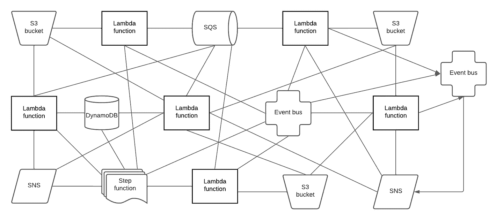
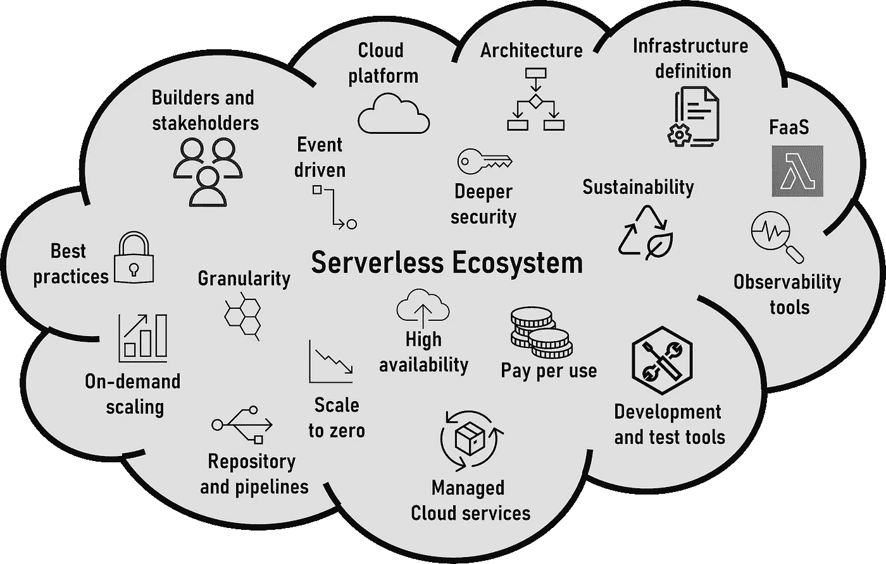
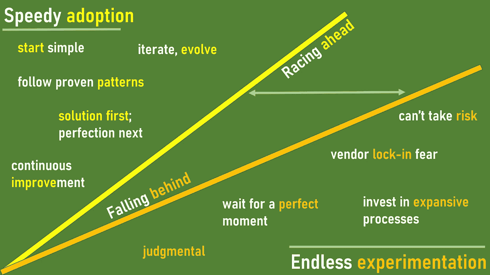
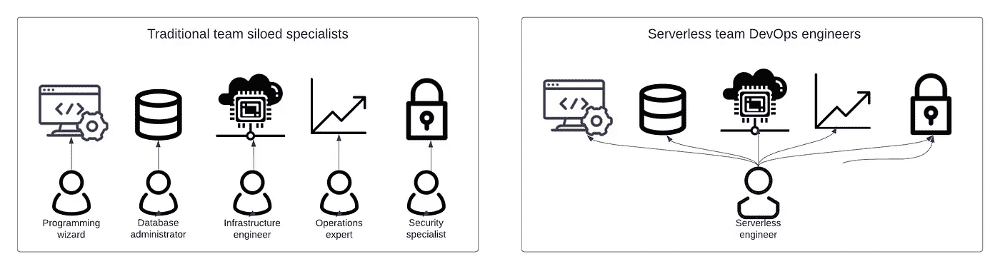

# 无服务器难以采纳吗？

> 原文：[`towardsdatascience.com/is-serverless-hard-to-adopt-56c35672b958?source=collection_archive---------2-----------------------#2023-11-20`](https://towardsdatascience.com/is-serverless-hard-to-adopt-56c35672b958?source=collection_archive---------2-----------------------#2023-11-20)

## 理解使您的无服务器采用成功的简单措施

 [Sheen Brisals](https://sbrisals.medium.com/?source=post_page-----56c35672b958--------------------------------)

·

[关注](https://medium.com/m/signin?actionUrl=https%3A%2F%2Fmedium.com%2F_%2Fsubscribe%2Fuser%2F33d1209889d5&operation=register&redirect=https%3A%2F%2Ftowardsdatascience.com%2Fis-serverless-hard-to-adopt-56c35672b958&user=Sheen+Brisals&userId=33d1209889d5&source=post_page-33d1209889d5----56c35672b958---------------------post_header-----------) 发表于 [Towards Data Science](https://towardsdatascience.com/?source=post_page-----56c35672b958--------------------------------) ·13 min read·Nov 20, 2023

--

Mikhail Nilov 拍摄的照片，来自[Pexels](https://www.pexels.com/photo/a-boy-wearing-long-sleeves-sweater-pulling-his-hair-7929277/)

一年多前，我们在奥地利塞默林的 9 月环境中某个高处徒步时，在我们的小径上的一个路口迷失了方向。由于路标不明确，我用手机寻找线索。在众多 Twitter（X）通知中，刚刚闪过保罗·约翰斯顿的文章[*学习无服务器（以及为什么难）*](https://pauldjohnston.medium.com/learning-serverless-and-why-it-is-hard-4a53b390c63d)。

在平常的日子里，我会立刻阅读它。但考虑到当前的位置以及引导家人走出树林的责任，我并不愿意为了无服务器牺牲赏心悦目的塞默林早晨。

我重读了这一点，在他的文章中，保罗勇敢地击中了许多钉子！我本想更早地加入，但是为了完成《*AWS 上的无服务器开发。构建企业级无服务器解决方案*》（O’Reilly, 2024）这本书，我在一年后来借了这把锤子，来打自己的一些钉子，从整体角度来看问题，而不仅仅是学习本身。

在这篇文章中，我将带你了解使用无服务器技术开发应用程序时成功的一些关键因素 — 无论是在商业产品开发、构建数据驱动的应用程序、AI 还是机器学习方面。

 [## 无服务器开发

### AWS 上的无服务器开发：构建企业级无服务器解决方案

[sbrisals.medium.com](https://sbrisals.medium.com/the-serverless-book-2209ee13e619?source=post_page-----56c35672b958--------------------------------)

# 驾驶汽车难吗？

1.  *驾驶* 手动变速汽车难吗？

1.  *学习* 手动变速汽车难吗？

答案因人而异。如果你已经开车几年，对第一个问题的回答将是否定的 ***no***。因为多年来，你已经熟悉了所有的操作，它们已经变得自然而不需要考虑。

然而，当你还是一名学习者时，你对第二个问题的回答肯定是 ***yes***。学习驾驶时，有许多事情需要考虑 —— 需要协调的动作、按顺序进行的活动以及需要并行进行的观察。所有这些都是在车辆运行时进行的。

**仅仅掌握方向盘技能并不足以使你称为一名司机。**

如果你现在考虑一个自动变速汽车，作为驾驶员的活动会有所减少，因为汽车的机械结构会处理某些动作（就像云提供商处理无服务器中的一些重活）。

我们日常生活中有很多挑战，但我们学习技能并跟随已验证的路径来提升自己。无服务器开发也不例外。它可能听起来有点简单（就像自动变速汽车），但它不会让你即刻启动引擎并飞驰而去。

一个混乱的无服务器实现。来源作者。

在技术上有很多错误的做法 —— 无服务器更是如此。使用无服务器服务构建混乱的事件驱动架构非常容易且时间短。但是，构建和开发一个模块化、可观察且可持续的解决方案需要知识和正确的技能。这并不意味着无服务器很难。

> 在技术领域中，有许多做错事的方法——尤其是在无服务器环境中。

# 如果你不理解其生态系统，无服务器将会很难。

一辆车有许多部件，从高层次到细节层次。车发动机主要作为一个整体来书写，但有多个组件。一个正常运转的汽车需要一个司机（忽略无人驾驶的情况）并搭载乘客。从某种程度上讲，所有这些共同构成了汽车的生态系统。

很多时候，许多人将无服务器描绘成一种架构蓝图、函数即服务（FaaS）或框架。对我而言，它超越了这些概念，远超我们通常想象的。无服务器，某种程度上，是一个技术生态系统。当你和我使用无服务器时，我们也成为其中的一部分——类似于司机和乘客成为汽车生态系统的一部分。

无服务器生态系统包含许多因素。来源作者。

如图所示，无服务器生态系统包含多个因素。无服务器技术带来了其独特的特性。云平台及其托管服务构成了基础。开发实践、工具和框架使流程更快地带来价值。业务利益相关者与工程师合作，为客户在无服务器上构建现代能力。所有这些以及更多内容都是生态系统的一部分。

上述描绘的目的是让你超越编写函数或讨论基础设施工具的思维。考虑一下无服务器给你的组织、团队和你个人带来的多样性，因为你在使用无服务器时将会身兼多职。随着我们成熟并成为无服务器生态系统的一部分，像[Lee Gilmore](https://twitter.com/LeeJamesGilmore)这样的想法比以前更为常见。

# 如果你以错误的心态开始，无服务器将会很难。

*几年前，一位工程师联系我寻求有关他无服务器旅程的指导。聊天几分钟后，很明显他希望以云无关的方式实现他的 Lambda 函数逻辑，以便他的无服务器应用程序可以在组织决策者希望切换时随时部署到不同的云提供商* ***如果及何时*** *决策者想要切换。*

*了解他的意图后，我询问了他对非 FaaS 服务的处理方法，以及他如何使其具有云无关性。他的解释是某种宏伟的六边形架构实现！*

*在通话快结束时，我意识到他还没有在生产环境中部署任何无服务器工作负载！*

尽管类似上述的思想和方法让董事会满意，但挑战和对业务的价值却未被评估。企业采用诸如无服务器这样的技术，以提高速度、增加流量并建立竞争优势。以上述心态接触无服务器就像是在追逐海市蜃楼，永远无法完成并交付任何东西。

工程师经常指出框架提供的多云配置作为例子（或借口）。事实上，工具提供这样的功能是为了让每个人都能使用它们，并且你不应该根据框架提供的内容做出多云决策。当这些错误的策略无法产生价值时，你会听到抱怨 - 切换到 Serverless 是困难的、令人困惑的，并且违反直觉 — 正如[保罗在他的文章中提到的](https://pauldjohnston.medium.com/learning-serverless-and-why-it-is-hard-4a53b390c63d)。

> 开发工具经常支持多云能力，但你不应该基于框架提供的内容做出多云决策。

# 如果你认为 Serverless 太简单，它就会变得困难。

*我被邀请参加一个会议，听取并批准一个 Serverless 架构提案。一个工程师展示了一个精心制作的虚拟板，并详细解释了他们的架构。Lambda 函数主导了解决方案，周围散布着一些 DynamoDB 表。我开始感到不舒服，并且抱歉地打断了谈话，问了这个问题 -*

*你以前构建过 Serverless 解决方案吗？*

*工程师回答说，是的！*

*在对设计中某些选择的几个“为什么”进行更多询问后，工程师承认之前他们只为简单功能编写了 Lambda 函数，而没有设计或构建事件驱动的微服务。*

我在这里的意图不是贬低工程师，而是强调我们在学习和使用新技术时都要经历的重要阶段。知道如何编写和操作 Lambda 函数绝对是正确的开始，但与此同时，你不应该认为 Serverless 中的一切都太容易了。这种态度会导致你实现混乱的 Serverless 应用程序。

我同意，对于新手来说，将问题分解为微服务、识别应用程序的同步和异步部分、以事件方式思考，或者设计可观察性都是复杂的。事实上，这些方面中的许多并不新鲜，也不特定于 Serverless。不同之处在于，过去的隔离团队结构中，作为程序员的你从未接触过或参与其中。

学车时，你需要经过多次课程才能在实际驾驶测试中感到自信。同样，评估你的 Serverless 技能并在工作中作为 Serverless 工程师进行必要的学习（在后面的部分讨论）是必要的。

# Serverless 是很难的，如果你排除工程师参与架构讨论。

我在指导团队时采用的方法是将一个服务或功能的开发所有权分配给一名或多名工程师 — 从想法到生产。他们从与产品团队、利益相关者和技术专家的早期交流开始，收集关于他们将要构建的解决方案的知识。他们参与必要的构思会议和问题分析，并在得到资深人员和专家指导后开始起草架构，然后发布一个[**解决方案设计文档**](https://medium.com/lego-engineering/the-significance-of-solution-design-in-serverless-developments-part-i-58e0ef9dd24)，供所有人审查。从这里开始，实施票据被创建并进入迭代开发和交付阶段。

[**无服务器开发中解决方案设计的重要性 — 第一部分**](https://medium.com/lego-engineering/the-significance-of-solution-design-in-serverless-developments-part-i-58e0ef9dd24)

### 它带来了什么，我们为什么需要它？

[**无服务器开发中解决方案设计的重要性 — 第一部分**](https://medium.com/lego-engineering/the-significance-of-solution-design-in-serverless-developments-part-i-58e0ef9dd24)

上述方法是有意为之的。尽管存在缺点和批评，但它为团队和工程师的职业成长带来了许多好处。要教育工程师并使他们成为无服务器生态系统的一部分，你必须停止向他们提供架构蓝图。相反，通过向他们提供思想和资源来与他们一起演进架构，使他们学习、开发和交付。

> 不要在架构师的象牙塔中设计你的无服务器架构，而是在你团队的引擎室中创建它们。

*曾经在一个组织中，进行了跨团队合作，以推出一个新功能。之前有几次构思会议，与一群人讨论后达成了一个高层提案，足够详细以在解决方案设计中详细描述。后来，几名工程师被指派一个票据来实现他们团队解决方案的一部分。然而，这些工程师从未参与过先前的会议，没有简要介绍，也没有看到捕捉到所有涂鸦、绘图和思绪的虚拟板。*

可以想象，上述工程师陷入了困境。无论工程师的能力如何以及问题的微不足道程度如何，请确保你的无服务器开发不是从 Visual Studio (VS) Code 开始的。如果你这样做，不能保证你的无服务器体验会更顺利。

> 无论工程师的能力如何以及问题的微不足道程度如何，你的无服务器开发不应该从 VS Code 开始。

# 如果你追求完美主义而不是实用主义，无服务器开发就会很困难。

在我的演讲中，我分享了一张幻灯片，展示了一个实际思维的团队如何借助无服务器加速，而试图通过悲观的观点使一切完美的纯主义团队则落后。

两种类型的无服务器采用派系。来源作者。

通常情况下，信息过载和没有实际引擎室经验的象牙塔架构师的完美主义会使你的无服务器采用变得困难，你的经验变得糟糕。

*我曾经在社区交流中听到过两支无服务器团队的故事。这两支团队有共同之处。它们都在各自的边界内运作 — 即有界上下文内 — 开发事件驱动的微服务，并且拥有明确定义的 API。*

*其中一支团队在单个生产 AWS 账户中拥有和运行它们的微服务（测试、QA、预发布等有单独的账户），将它们的 Lambda 函数放置在自定义 VPC 之外，并仅在必要时配置 VPC，将它们的 API 托管在 Amazon API Gateway 并配备必要的使用计划。他们的服务由 Amazon EventBridge 上的自定义事件总线协调。对于这支团队来说，开发、部署和运营新的微服务听起来是轻而易举的。*

*然而，第二支团队遵循纯主义思想，选择在不同的 AWS 账户中托管每个微服务，并将其 Lambda 函数部署在自定义的 VPC 内。此外，它们所有的 API 都托管在一个不同的网关着陆平台上。随着二十多个微服务的增加，它们在处理涉及的复杂性时陷入困境。*

当然，在我们做出不同选择和决策的情况下，我们应该评估并纠正课程，以避免陷入难以管理且无法回头的局面。

采用无服务器架构的主要动机之一是将繁重的工作交给云服务提供商，但如果我们的策略与无服务器的优势背道而驰，无服务器只会变得更加困难。

# 如果你侵蚀团队边界，无服务器将变得困难。

当涉及团队边界时，每个人都会考虑有界上下文（如领域驱动设计中的概念）。然而，其他边界对于自治的两披萨无服务器团队同样重要，如下所列。破坏边界将导致使你的无服务器经验变得困难的后果。

+   有界上下文边界

+   团队责任边界

+   团队所有权边界

+   源代码仓库边界

+   云账户边界

前三者相互依赖且重叠。如果你的团队是组织领域的有界上下文的保护者，你就处于一个很好的位置。在这种情况下，你的团队负责有界上下文边界内的所有事物，并拥有所有功能、服务和实现工件。

所有你拥有资产的实现工件都在一个仓库中，你的团队成员在其中贡献并共享。

AWS 云账户边界标志着您部署和操作云及无服务器资产的运营边界。

在理想的世界中，您的团队与这些边界之间会有一对一的映射，如下所示。

+   您的团队存在是因为有了有界上下文。

+   您的团队负责并拥有有界上下文中的所有内容。

+   您的团队有一个仓库，只有您的团队贡献。

+   您的团队在其专用的云账户中操作其拥有的所有内容。

**您作为无服务器工程师的生活尽可能简单和愉快！**

现在，让我们开始放松并打开边界，想象可能会发生的事情。

由于业务优先级和满足交付期望的需要，您将来自另一个团队的工程师*分享*对您团队边界的*责任*，迫使您团队的重点领域发生变化。

+   *您如何确保团队了解彼此的工作方式？*

+   *您如何确保代码质量保持一致？*

+   *您如何确保选择的 AWS 服务和架构模式是对齐的？*

+   *您如何确保操作责任没有漏洞？*

这些团队可以合作解决和缓解情况。但合作意味着更多的聊天、配对、审查、讨论、会议等，这些都会影响两个团队的关注和效率。

开放团队边界和共享责任，如果没有充分的考虑，可能会对组织产生负面影响。无服务器开发会变得更加困难，开发者体验也会变得令人沮丧。

# 如果不投入人员的成长，无服务器将变得困难。

我们周围充满了捷径。几条捷径可以教您编写 Lambda 函数。这种快餐式的学习方法只在食物存在的时间内有效。为了满足您的胃口，您需要不断订购更多的食物。

要在无服务器中取得成功，您必须不断学习。

[Paul 的文章](https://pauldjohnston.medium.com/learning-serverless-and-why-it-is-hard-4a53b390c63d) 主要关注学习以及进入无服务器领域的人们通常如何努力理解技术及其生态系统。正如 Paul 所描述的，对于一个新手来说，甚至单一用途的 Lambda 函数的概念本身也需要时间消化。

要在无服务器中取得成功，一旦掌握了单一用途的 Lambda 函数，您需要迈出许多步伐。几个领域充当您向成功目标迈进所需的跳板，并且您在此过程中积累了许多特质。

我经常强调无服务器如何为团队带来工程多样性。如果您想让无服务器变得简单，这种认识至关重要。

工程师应该得到引导、培养、指导或培训（或者你的组织中使用的术语），让他们理解利益相关者的需求，允许他们提出架构方案，灌输单一功能和微服务的好处，展示如何融入安全性，教授可观察性原则，让他们部署到生产环境，并标记他们为服务的所有者。这不会一夜之间实现，也不会仅通过看几段 YouTube 视频就能达成。这正是质量培训和长期人才成长战略发挥作用的地方。

传统的专业化专家与多样化的无服务器工程师。信息来源作者。

不要用企业官僚主义限制工程师。让他们自由学习新知识，参加会议，并参与技术研讨会和协作活动。

*我在一次会议上与一位工程经理交谈。她认为像 EventStorming 和架构 Katas 这样跨越几个小时或更长时间的研讨会是浪费时间，并影响团队的生产力。于是我问她，如果有几位机会被拒绝和不满的工程师请了一两天病假，她怎么处理生产力问题。她没有答案！*

无服务器训练营是装备工程师掌握无服务器技术生态基础的简单方法。一些组织已成功实施了这类项目。[Matt Coulter](https://www.linkedin.com/in/nideveloper/)，一个 AWS 英雄，曾提到 Liberty Mutual 公司成功为新员工实施的一个项目。组织经常因预算约束而将此类倡议降级，甚至未评估其带来的好处。

在无服务器培训中的一个挑战是课程大纲中技术、开发、架构和运营元素的质量和覆盖范围。在多个课程中，我听到了[Yan Cui](https://www.linkedin.com/in/theburningmonk/)的[《生产就绪的无服务器》](https://productionreadyserverless.com/)培训研讨会获得了很好的反馈。Yan 是 AWS 无服务器英雄，也是无服务器知识的强大力量。

 [## 生产就绪的无服务器

### 学习构建生产就绪无服务器应用的最佳实践。

productionreadyserverless.com](https://productionreadyserverless.com/?source=post_page-----56c35672b958--------------------------------)

> 让工程师理解利益相关者的需求，允许他们提出架构方案，灌输单一功能和微服务的好处，展示如何融入安全性，教授可观察性原则，让他们部署到生产环境，并标记他们为服务的所有者。

# 无服务器将变得更加简单…

就像驾驶随着驾驶时间的增加变得更好更容易一样，随着你积累经验并熟悉其生态系统，无服务器变得更加高效和愉悦。

*过山车并非每个人的最爱。寻求刺激的人们常给他人的最常见建议是 —* ***你必须学会放手！***

你必须学会相信无服务器技术，以利用它提供的无差别重型工作。如果 AWS 提供托管解决方案，请利用它们来增加业务价值。为什么要反其道而行之，构建你永远不需要的复杂解决方案？

从那些成功采用无服务器的人那里获取灵感。

要结束的时候，我找不到比[Momento 的](https://www.gomomento.com/) AWS re: Invent 2023 [社区派对](https://events.gomomento.com/en-us/mo-23reinvent)主题更好的短语 -

**相信无服务器！**

是的，相信无服务器，并学会放手！
