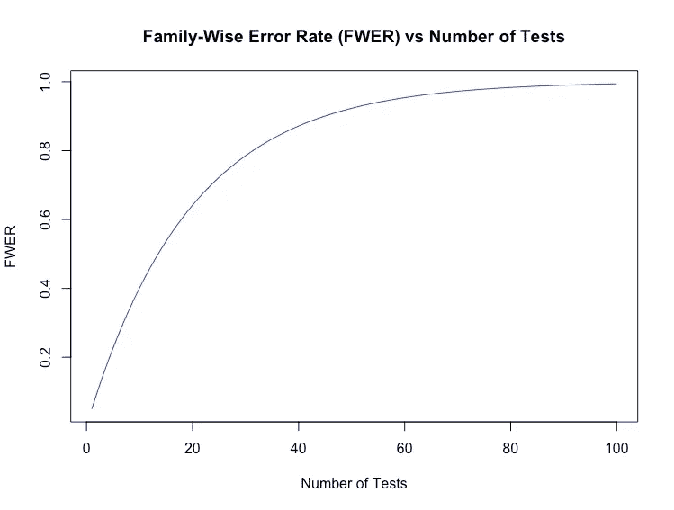
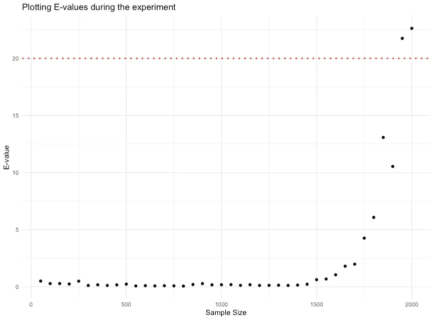
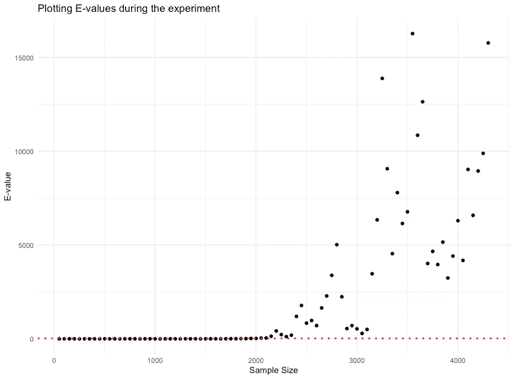
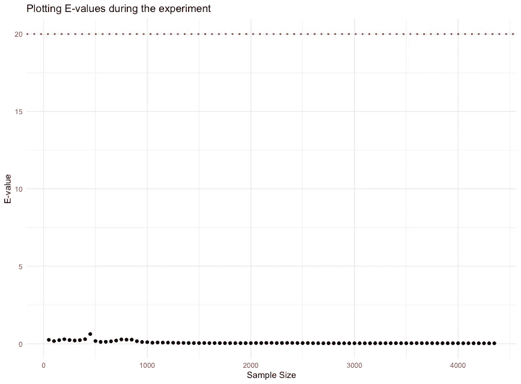

# **这是否是解决 P-hacking 的方案？**

> 原文：[`towardsdatascience.com/is-this-the-solution-to-p-hacking-a04e6ed2b6a7`](https://towardsdatascience.com/is-this-the-solution-to-p-hacking-a04e6ed2b6a7)


E 是新的 P 吗？图像由作者使用 Dall·E 创建。

## **e-值**，一种优于 p-值的替代方案

[](https://hennie-de-harder.medium.com/?source=post_page-----a04e6ed2b6a7--------------------------------)[](https://towardsdatascience.com/?source=post_page-----a04e6ed2b6a7--------------------------------) [Hennie de Harder](https://hennie-de-harder.medium.com/?source=post_page-----a04e6ed2b6a7--------------------------------)

·发表于 [Towards Data Science](https://towardsdatascience.com/?source=post_page-----a04e6ed2b6a7--------------------------------) ·阅读时间 11 分钟·2023 年 11 月 16 日

--

**在科学研究中，数据操控和结果窥探一直是存在的问题。研究人员经常为了发表文章而追求显著的 p-值，这可能导致提前停止数据收集或操控数据的诱惑。这种做法被称为 p-hacking，是** **我之前的帖子****的重点。如果研究人员决定故意更改数据值或伪造完整的数据集，我们也无能为力。然而，对于某些 p-hacking 的情况，可能存在解决方案！**

在这篇文章中，我们深入探讨了安全测试的话题。安全测试相比于旧的（当前的）假设测试方法具有一些强大的优势。例如，这种测试方法允许将多项研究的结果进行结合。另一个优势是你可以在任何时间选择性地停止实验。为了说明安全测试，我们将使用由提出该理论的研究人员开发的 R 包 [safestats](https://cran.r-project.org/package=safestats)。首先，我们将介绍 e-值并解释它们能解决的问题。由于其优势，e-值已经被 Netflix 和 Amazon 等公司使用。

> 我不会深入探讨理论的证明；相反，这篇文章采用了更实际的方法，展示了如何在自己的测试中使用 e-值。对于证明和安全测试的详细解释，[原始论文](https://arxiv.org/pdf/1906.07801.pdf)是一个很好的资源。

# **e-值简介**

在假设检验中，你可以在这里刷新相关知识，你评估是否保留原假设或接受备择假设。通常情况下，使用 p 值。如果 p 值小于预定的显著性水平 alpha，你就接受备择假设。

e 值的功能与 p 值不同，但有关联。e 值的最简单解释如下：**假设你在对抗原假设进行赌博。你投资 1 美元，回报值等于 E 美元。如果 e 值 E 在 0 到 1 之间，你输了，原假设成立。另一方面，如果 e 值高于 1，你赢了！原假设输掉了比赛。** 一个适中的 E 为 1.1 表示对原假设的证据有限，而一个巨大的 E，例如 1000，则表示压倒性的证据。

需要了解的一些 e 值要点：

+   e 值可以取*任何正值*，你可以在假设检验中将 e 值作为*p 值的替代方案*使用。

+   一个 e 值 E 可以通过关系 1/E = p 解释为传统的 p 值 p。注意：它不会给你和标准 p 值一样的结果，但你可以像解释 p 值那样*解释*它。

+   在传统的测试中，你有 alpha，也就是显著性水平。通常这个值为 0.05。e 值的工作方式略有不同，你可以将它们看作是对原假设的证据。e 值*越高*，对原假设的证据越多。

+   在使用 e 值的情况下，你*可以在任何时候 (!)* 停止数据收集并在测试期间得出结论。这被称为*e 过程*，使用 e 过程可以确保在可选停止下的有效性，并允许对统计证据进行连续更新。

> 有趣的事实：e 值并不像你想象的那么‘新’。关于它的[第一篇论文](https://www.mathnet.ru/php/archive.phtml?wshow=paper&jrnid=dan&paperid=40194&option_lang=eng)是 1976 年写的。当时这些值并没有被称为 e 值。


研究人员在对抗...一个假设？！图像由作者使用 Dall·E 3 创建。

# 我为什么要关心 e 值？

这是一个有效的问题。传统的 p 值有什么问题？是否需要用 e 值来替代它们？如果当前的测试方式没有问题，为什么要学习新的东西？

其实，p 值确实存在一些问题。传统 p 值受到大量批评。一些统计学家（超过 800 人）想要[完全放弃 p 值](https://media.nature.com/original/magazine-assets/d41586-019-00857-9/d41586-019-00857-9.pdf)。

让我们用一个经典的例子来说明原因。

想象一下你是一个制药公司的初级研究员。你需要测试公司开发的药物的有效性。你寻找测试候选人，其中一半人接受药物，而另一半则服用安慰剂。你确定了得出结论所需的测试候选人数量。

实验开始了，你在寻找新参与者时有些困难。你面临时间压力，你的老板经常问：“你有结果了吗？我们想把这个产品推向市场！”由于压力，你决定偷看结果并计算 p 值，尽管你还没有达到最小测试候选人数！看着 p 值，现在有两个选择：

+   p 值是 *不显著的*。这意味着你不能证明药物有效。显然，你不会分享这些结果！你多等一会儿，希望 p 值会变得显著…

+   是的！你发现了一个 *显著* 的 p 值！但你的下一步是什么？你停止实验吗？你继续直到达到正确的测试候选人数量吗？你将结果分享给你的老板吗？

一旦你查看了数据，可能会很诱人地想要更频繁地查看。你计算 p 值，有时它显著，有时则不显著… 这样做可能看起来无害，但实际上你是在破坏整个过程。


显著还是不显著？图像由作者使用 Dall·E 3 创建。

为什么在实验正式结束之前*只查看*数据和相应的 p 值几次是错误的？一个简单而直观的原因是，因为*如果你对其他结果做了什么*（例如，如果你发现显著的 p 值你就停止实验），你就是在干扰整个过程。

从理论角度来看：**你违反了第一类错误保证**。第一类错误保证是指你有多大的把握不会错误地拒绝一个真实的零假设（= 发现显著结果）。这就像是对你在没有狼的情况下哭狼的频率的承诺。这种情况发生的风险是 ≤ alpha。但这仅适用于一个实验！如果你更频繁地查看数据，你就不能再相信这个值了：第一类错误的风险会变得更高。

这涉及到 [多重比较问题](https://en.wikipedia.org/wiki/Multiple_comparisons_problem)。如果你做了多个独立的测试来证明相同的假设，你应该纠正 alpha 值，以保持第一类错误的风险较低。解决这个问题有不同的方法，比如 [Bonferroni 校正](https://en.wikipedia.org/wiki/Bonferroni_correction)、[Tukey 的范围检验](https://en.wikipedia.org/wiki/Tukey%27s_range_test) 或 [Scheffé 方法](https://en.wikipedia.org/wiki/Scheffé%27s_method)。



多个独立测试的家庭错误率。对于一个测试，它等于 alpha。注意，对于 10 个测试，错误率增加到了 40%，而对于 60 个测试，它达到了 95%。图像来源：作者。

总结：p 值可以使用，但研究人员可能会在样本量达到之前查看数据。这是错误的，会增加 I 型错误的风险。为了保证实验的质量和稳健性，e 值是更好的选择。由于 e 值的特性，你不需要怀疑这些实验（或者至少少一些，研究人员总是可以选择伪造数据 😢）。

# 使用 e 值的好处

如前所述，我们可以像使用 p 值一样使用 e 值。一个主要的区别在于，大的 e 值与低的 p 值是可以比较的。回想一下 1/E = p。如果你想像使用 p 值一样使用 e 值，并且使用显著性水平 0.05，则当 e 值高于 20（1/0.05）时，你可以拒绝原假设。

当然，e 值还有更多的使用案例和好处！如果有多个实验测试同一假设，我们可以将这些测试的 e 值相乘，得到一个新的 e 值，用于测试。这在 p 值中是无法做到的。但对于 e 值，这种方法是有效的。

你也可以在实验期间查看数据和结果。如果你想停止测试，因为结果看起来不够有希望，那也是可以的。另一个可能性是，如果结果看起来有希望，可以继续进行测试。

我们还可以使用 e 值创建*任何时候有效的置信区间*。这是什么意思？这意味着置信区间对任何样本大小（整个实验期间）都有效。它们会比常规置信区间稍宽，但好处是你可以在任何时候相信它们。

# 使用 safestats 包

在帖子最后一部分，我们将更加实际。让我们计算自己的 e 值。为此，我们使用 R 包 [safestats](https://cran.r-project.org/package=safestats)。要安装和加载它，请运行：

```py
install.packages("safestats")
library(safestats)
```

我们将解决的案例是经典的：我们将比较网站的不同版本。如果一个人购买了东西，我们记录成功（1）；如果一个人什么也没有购买，我们记录失败（0）。我们将旧版网站展示给 50% 的访客（A 组），将新版网站展示给另外 50%（B 组）。在这个用例中，我们将关注可能发生的不同情况。可能出现原假设为真的情况（网站之间没有差异或旧版网站更好），有时也可能是备择假设为真的情况（新版网站更好）。

创建安全测试的第一步是设定设计目标。在这个变量中，你需要为 `alpha`、`beta` 和 `delta` 指定值：

```py
designObj <- designSafeTwoProportions(
  na = 1,
  nb = 1,        # na and nb are of equal size so 1:1
  alpha = 0.05,  # significance level
  beta = 0.2,    # risk of type II error
  delta = 0.05,  # minimal effect we like to detect
)

designObj
```

在许多情况下，`delta` 设置为较高的数字。但对于比较具有大量流量的网站的不同版本，将其设置为较小的值是合理的，因为容易获得许多观察值。

输出如下：

```py
 Safe Test of Two Proportions Design

 na±2se, nb±2se, nBlocksPlan±2se = 1±0, 1±0, 4355±180.1204
              minimal difference = 0.05
                     alternative = twoSided
         alternative restriction = none
                 power: 1 - beta = 0.8
 parameter: Beta hyperparameters = standard, REGRET optimal
                           alpha = 0.05
decision rule: e-value > 1/alpha = 20

Timestamp: 2023-11-15 10:58:37 CET

Note: Optimality of hyperparameters only verified for equal group sizes (na = nb = 1)
```

你可以识别我们选择的值，但包还计算了 `nBlocksPlan` 参数。这是我们需要观察的数据点（块）的数量，它基于 delta 和 beta 参数。还需检查基于 `alpha` 值的决策规则。如果 `e-value` 大于 20（1 除以 0.05），我们拒绝原假设。

## 测试案例：备择假设为真

现在，让我们生成一些虚假数据：

```py
set.seed(10)
successProbA = 0.05  # success probability for A 5%
successProbB = 0.08  # success probability for B 8%
nTotal = designObj[["nPlan"]]["nBlocksPlan"]  # use the nBlocksPlan value as sample size
ya <- rbinom(n = nTotal, size = 1, prob = successProbA)
yb <- rbinom(n = nTotal, size = 1, prob = successProbB)
```


分布 A 和 B 的成功概率分别为 0.05 和 0.08。图像由作者提供。

现在是进行我们第一次安全测试的时候了！

```py
safe.prop.test(ya=ya, yb=yb, designObj=designObj)
```

输出为：

```py
 Safe Test of Two Proportions

data:  ya and yb. nObsA = 4355, nObsB = 4355

test: Beta hyperparameters = standard, REGRET optimal
e-value = 77658 > 1/alpha = 20 : TRUE
alternative hypothesis: true difference between proportions in group a and b is not equal to 0 

design: the test was designed with alpha = 0.05
for experiments with na = 1, nb = 1, nBlocksPlan = 4355
to guarantee a power = 0.8 (beta = 0.2)
for minimal relevant difference = 0.05 (twoSided) 
```

`e-value` 等于 77658，这意味着我们可以拒绝原假设。足够的证据来拒绝它！

可能会出现的问题是：“我们是否可以早点停止？”这就是 e-values 的一个好处。在达到计划样本量之前，允许查看数据，因此你可以随时决定停止或继续实验。我们可以绘制 e-values，例如每 50 个新样本的累计 e-values。前 40 个 e-values 图：



开始时没有反对原假设的证据，对应于低 e-values。但随着样本的增加，证据开始显现：e-values 超过了 20 的决策边界。图像由作者提供。

完整图：



我们可以确定：原假设应该被拒绝。除了最后一个 e-value。图像由作者提供。

## 测试案例：原假设为真

如果我们更改虚假数据，使得两个版本的成功概率相等（A 和 B 版本的成功概率均为 0.05），我们应该检测不到显著的 e- 或 p-值。版本 A 和 B 的分布看起来类似，原假设为真。这在 e-values 图中体现了出来：



无效果。图像由作者提供。

但如果我们将其与 p-values 进行比较呢？我们会多频繁地拒绝原假设，尽管实际上我们不应该？让我们测试一下。我们将实验重复 1000 次，看看在多少情况下我们拒绝了原假设，无论是对于 p-values 还是 e-values。

R 代码：

```py
pValuesRejected <- c()
eValuesRejected <- c()
alpha <- 0.05
ealpha <- 1/alpha

# repeat the experiment 1000 times, calculate the p-value and the e-value
for (i in seq(1, 1000, by = 1)) {
  # create data, use the same value of nTotal as before (4355)
  set.seed(i)
  ya <- rbinom(n = nTotal, size = 1, prob = 0.05)
  yb <- rbinom(n = nTotal, size = 1, prob = 0.05)

  # calculate the p-value, H0 rejected if it's smaller than alpha
  testresultp <- prop.test(c(sum(ya), sum(yb)), n=c(nTotal, nTotal))
  if (testresultp$p.value < alpha){
    pValuesRejected <- c(pValuesRejected, 1)
  } else{
    pValuesRejected <- c(pValuesRejected, 0)
  }

  # calculate the e-value, H0 rejected if it's bigger than 1/alpha
  testresulte <- safe.prop.test(ya=ya, yb=yb, designObj=designObj)
  if (testresulte[["eValue"]] > ealpha){
    eValuesRejected <- c(eValuesRejected, 1)
  } else{
    eValuesRejected <- c(eValuesRejected, 0)
  }
}
```

如果我们将 `pValuesRejected` 和 `eValuesRejected` 相加，输出为：

```py
> sum(pValuesRejected)
[1] 48
> sum(eValuesRejected)
[1] 0
```

p-value 在 48 个案例中显著（约 5%，这是我们期望的 alpha 为 0.05 时的结果）。另一方面，e-value 做得很好：它从未拒绝原假设。如果你之前还不确定是否使用 e-values，现在希望你相信了！

> 如果你对其他示例感兴趣，我可以推荐[safestats 包](https://cran.r-project.org/web/packages/safestats/index.html)中的[小插曲](https://cran.r-project.org/web/packages/safestats/index.html)。

# 结论

E-values 提供了一种比传统 p-values 更具吸引力的替代方案，具有多个优点。它们提供了在任何阶段继续或停止实验的灵活性。此外，它们的可组合性是一个优势，任何时候审查实验结果的自由也是一个大优点。p-values 和 e-values 的比较表明，e-values 更可靠；p-values 在没有显著差异时更容易错误地识别出显著差异。safestats R 包是实施这些稳健测试的有用工具。

我相信 e-values 的优点，并期待一个支持其实现的 Python 包的开发！😄

## 相关

[](/sneaky-science-data-dredging-exposed-26a445f00e5c?source=post_page-----a04e6ed2b6a7--------------------------------) ## 隐秘的科学：数据挖掘曝光

### 深入探讨 P-hacking 的动机和后果

towardsdatascience.com [](/how-to-compare-ml-solutions-effectively-28384e2cbca1?source=post_page-----a04e6ed2b6a7--------------------------------) ## 如何有效地比较机器学习解决方案？

### 提高将模型投入生产的机会

towardsdatascience.com [](/simplify-your-machine-learning-projects-ab171d19c9ef?source=post_page-----a04e6ed2b6a7--------------------------------) ## 简化你的机器学习项目

### 为什么在复杂模型上花费大量时间和精力是个坏主意，应该怎么做

towardsdatascience.com
