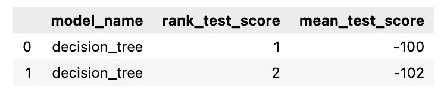
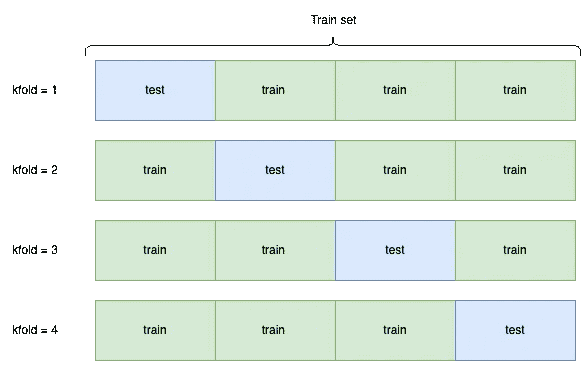
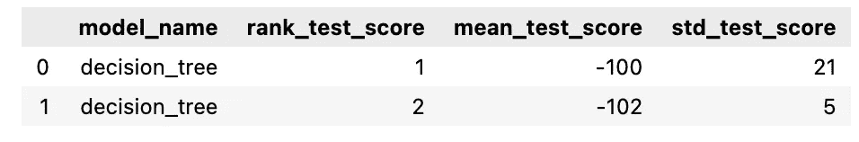
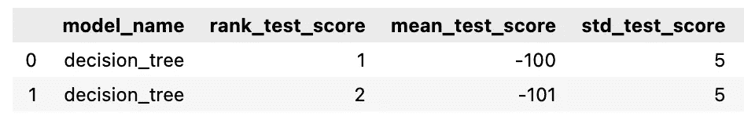
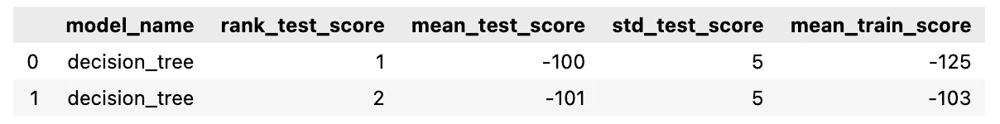
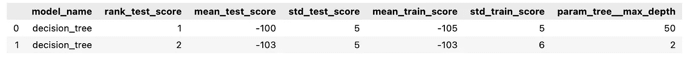
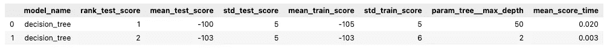

# 依赖 GridSearchCV 的最佳模型是一个错误

> 原文：[`towardsdatascience.com/its-a-mistake-to-trust-the-best-model-of-a-gridsearchcv-536a73e835ad`](https://towardsdatascience.com/its-a-mistake-to-trust-the-best-model-of-a-gridsearchcv-536a73e835ad)

## 通过四个例子解释了“最佳模型”实际上并不是最佳模型的情况

[](https://medium.com/@tomergabay?source=post_page-----536a73e835ad--------------------------------)[](https://towardsdatascience.com/?source=post_page-----536a73e835ad--------------------------------) [Tomer Gabay](https://medium.com/@tomergabay?source=post_page-----536a73e835ad--------------------------------)

·发布于[Towards Data Science](https://towardsdatascience.com/?source=post_page-----536a73e835ad--------------------------------) ·6 分钟阅读·2023 年 1 月 4 日

--


图片来源：[Choong Deng Xiang](https://unsplash.com/@dengxiangs?utm_source=medium&utm_medium=referral) 在[Unsplash](https://unsplash.com/?utm_source=medium&utm_medium=referral)

Scikit-learn 的`GridSearchCV`是一个常用的工具，用于优化机器学习模型的超参数。不幸的是，并不是每个人都能彻底分析它的输出，很多人只是使用`GridSearchCV`的最佳估计器。这意味着在很多情况下，你可能没有使用到真正的*最佳*估计器。让我们首先确定如何运行网格搜索，并检测它选择哪个估计器作为最佳。

一个非常基础的`GridSearchCV`可能看起来是这样的：

```py
import pandas as pd
from sklearn.model_selection import GridSearchCV, train_test_split
from sklearn.tree import DecisionTreeRegressor

df = pd.read_csv('data.csv')
X_train, X_test, y_train, y_test = train_test_split(df.drop('target'),
                                                    df['target'],
                                                    random_state=42)

model = DecisionTreeRegressor()
gridsearch = GridSearchCV(model, 
                          param_grid={'max_depth': [None, 2, 50]},
                          scoring='mean_absolute_error')

gridsearch.fit(X_train, y_train)
gridsearch.train(X_train, y_train)

# get the results. This code outputs the tables we'll see in the article
results = pd.DataFrame(gridsearch.cv_results_)

# what many data scientists do, while they shouldn't without analyzing first
Y_pred = gridsearch.best_estimator_.predict(X_test) 
```

在上面代码的底部，我提醒不要仅仅使用`best_estimator_`。因此，了解*scikit-learn*如何选择`GridSearchCV`的最佳估计器非常重要。我们只需要查看由`cv_results_`生成的`results`数据框中的一列，以确定为什么一个模型被选择为最佳：`mean_test_score`：



(作者提供的表格)

`mean_test_score`显示了该模型在测试集上的平均得分；例如，默认参数`cv=5`表示`mean_test_score`是模型在 5 个测试集上的测试得分的平均值。如果将`cv`改为 4，你会得到如下的训练-测试数据划分：



使用 cv=4 的交叉验证（图由作者提供）

默认情况下，`GridSearchCV` 选择 `mean_test_score` 最高的模型，并将其分配一个 `rank_test_score` 为 1\. 这也意味着当你通过 `gs.best_estimator_` 访问 `GridSearchCV` 的最佳估算器时，你将使用 `rank_test_score` 为 1 的模型。然而，有许多情况下 `rank_test_score` 为 1 的模型并不一定是最佳模型。让我们通过四个示例来说明‘最佳’模型并不是最优模型，并看看我们如何确定实际的最佳模型。

## 示例 #1：测试分数的标准差



如果我们查看上面的表格，我们可以看到‘最佳’模型的 `mean_test_score` 为 -100，`std_test_score` 为 21，这些分数以 [*均方误差*](https://en.wikipedia.org/wiki/Mean_absolute_error) 表示。因为这是一个误差分数，所以值越接近零，得分越好。‘第二最佳’模型的 `mean_test_score` 为 -102，`std_test_score` 为 5\. `std_test_score` 代表模型在测试集上的分数的标准差，这是一个绝对值，因此，离 0 越近，模型的表现越一致。尽管 #1 模型的均值稍好，但其标准差要大得多。这意味着模型的性能不够一致和可靠，并且通常这并不是理想的。这就是为什么在这个例子中我会选择模型 #2 而不是模型 #1，并且在大多数使用情况下你也应该这样做。

## 示例 #2：训练分数

现在让我们考虑两个在测试集上表现几乎相同的模型：



两个看似相同的决策树（作者提供的图片）

尽管这些模型的性能看起来几乎相同，但它们并不是相同的。为了检测这一点，我们必须将 `GridSearchCV` 的 `return_train_score` 参数从默认值 `False` 设置为 `True`：

```py
from sklearn.model_selection import GridSearchCV
from sklearn.tree import DecisionTreeClassifier

model = DecisionTreeClassifier()
param_grid = {...}

gridsearch = GridSearchCV(model, 
                          param_grid, 
                          scoring="mean_absolute_error", 
                          return_train_score=True)
```

现在如果我们在拟合和训练后运行 `gridsearch.cv_results_`，我们会注意到添加了多个列，其中一个列显示如下：`mean_train_score`：



带有训练分数的 cv_results_（作者提供的图片）

我们现在可以注意到，尽管两个模型在测试集上的表现似乎相同，但第二个模型在训练集上的表现实际上明显优于第一个模型。当然，这在某些情况下可能意味着过拟合，但在这里，均值训练分数与均值测试分数更一致，因此似乎没有暗示过拟合。一般来说，当两个模型在测试集上的表现相似时，考虑到训练分数时表现更一致的模型应该被优先选择。

## 示例 #3：模型复杂度

让我们考虑以下网格搜索结果：



cv_results_（作者提供的图片）

上述两个模型的测试和训练分数几乎相同。然而，在确认第一个模型是最佳模型之前，还有更多重要的信息需要考虑。在最后一列中，我们看到 `param_tree__max_depth`，它显示了每个模型决策树的树深度。‘最佳’模型的决策树深度为 50，而‘第二最佳’决策树的深度仅为 2。在这种情况下，我们可以选择第二个模型作为最佳模型，因为这个决策树更容易解释。例如，我们可以使用 `[sklearn.tree.plot_tree](https://scikit-learn.org/stable/modules/generated/sklearn.tree.plot_tree.html)` 绘制决策树，并查看一个非常简单且易于解释的树。一个深度为 50 的树几乎不可读且难以解释。作为经验法则，当两个模型在测试集和训练集上的表现相当时，应优先选择更简单的模型。

## 示例 #4：模型速度性能

我想展示的最后一个例子是关于速度性能的。假设我们有与示例 #3 相同的网格搜索结果，但添加了一个新列：`mean_score_time`。



现在，另一个原因出现了，我们可能会更喜欢第二个模型而不是第一个模型。第一个模型的运行时间是第二个模型的 6 倍以上，这可能是由于其额外的复杂性。当然，由于 `mean_score_time` 表示模型预测验证集的平均时间，这种差异似乎可以忽略不计。然而，想象一下一个需要基于每台机器数百个传感器预测机器故障的模型。对于这样的模型，如果需要在大量数据上进行实时预测，那么 *n* 个观测值上的 0.02 秒与 *n* 个观测值上的 0.003 秒之间的差异可能会产生显著影响。

# 结论

在这篇文章中，我们看到了四个示例，展示了为什么你不应该盲目相信 *scikit-learn* 的 `GridSearchCV` 的最佳估计器。我们不仅要依赖平均测试分数，还应该考虑交叉验证结果中的其他列，以确定哪个模型最好，尤其是在顶级模型的测试分数相似时。

如果你想了解更多关于机器学习和/或网格搜索的内容，请务必阅读这些相关文章：

[](/significantly-increase-your-grid-search-results-with-these-parameters-b096b3d158aa?source=post_page-----536a73e835ad--------------------------------) [## 使用这些参数显著提高你的网格搜索结果

### 使用 EstimatorSwitch 对任何机器学习管道步骤进行网格搜索。

[通过这些参数显著提高网格搜索结果](https://towardsdatascience.com/significantly-increase-your-grid-search-results-with-these-parameters-b096b3d158aa?source=post_page-----536a73e835ad--------------------------------) [一款备受期待的时间序列交叉验证器终于到来](https://towardsdatascience.com/a-highly-anticipated-time-series-cross-validator-is-finally-here-7dc99f672736?source=post_page-----536a73e835ad--------------------------------) [## 一款备受期待的时间序列交叉验证器终于到来

### 不均匀分布的时间序列数据不再是交叉验证的问题。

[一款备受期待的时间序列交叉验证器终于到来](https://towardsdatascience.com/a-highly-anticipated-time-series-cross-validator-is-finally-here-7dc99f672736?source=post_page-----536a73e835ad--------------------------------)
