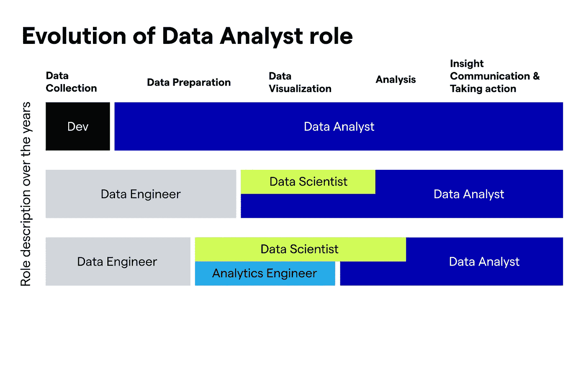
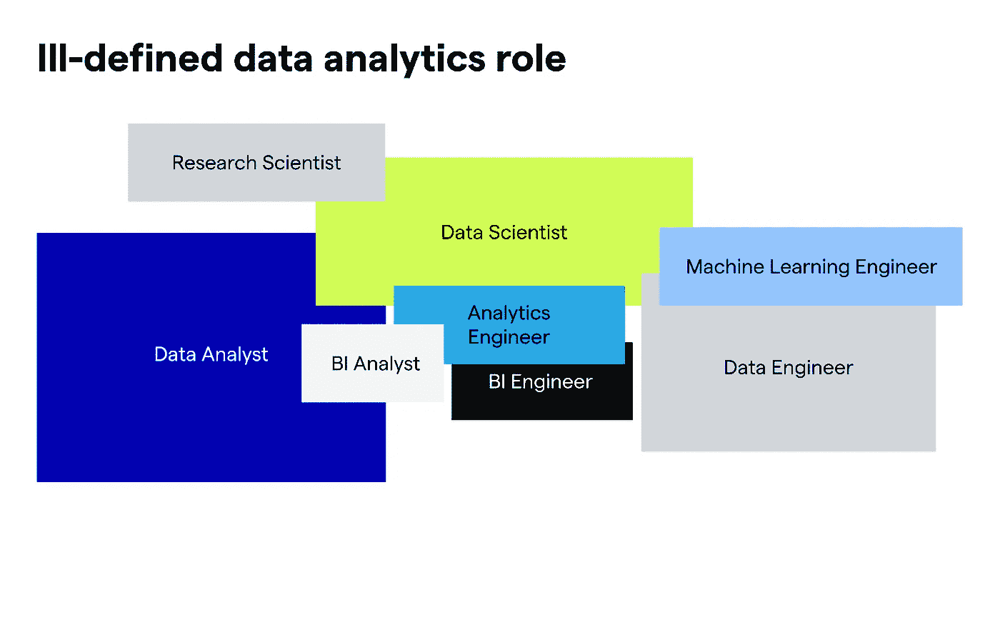
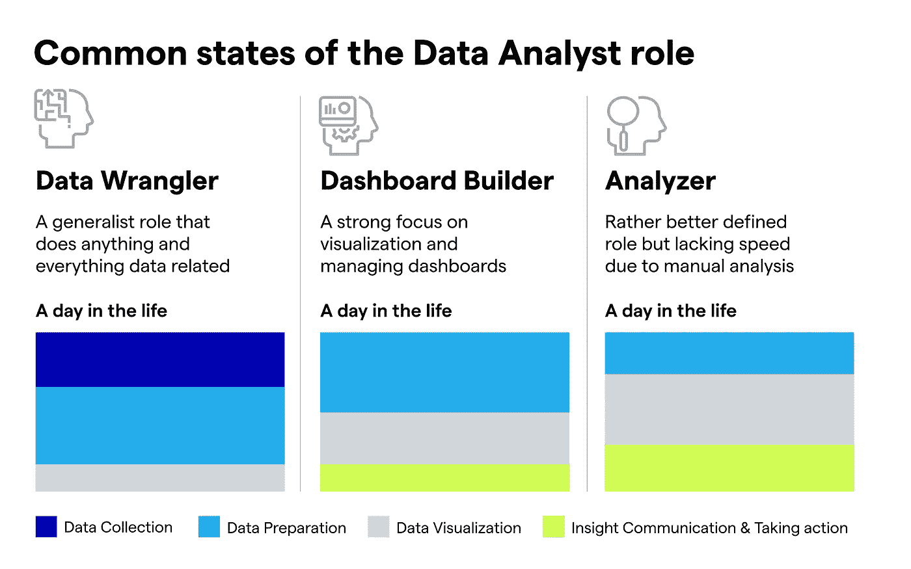

# 是时候提升数据分析师的角色了

> 原文：[`towardsdatascience.com/its-about-time-we-elevate-the-data-analyst-role-e2845d038233?source=collection_archive---------7-----------------------#2023-01-02`](https://towardsdatascience.com/its-about-time-we-elevate-the-data-analyst-role-e2845d038233?source=collection_archive---------7-----------------------#2023-01-02)

## 意见

## 数据分析师应成为依靠数据的可信顾问

 [João António Sousa](https://joao-antonio-sousa.medium.com/?source=post_page-----e2845d038233--------------------------------)

·

[关注](https://medium.com/m/signin?actionUrl=https%3A%2F%2Fmedium.com%2F_%2Fsubscribe%2Fuser%2Fab97905ce8fe&operation=register&redirect=https%3A%2F%2Ftowardsdatascience.com%2Fits-about-time-we-elevate-the-data-analyst-role-e2845d038233&user=Jo%C3%A3o+Ant%C3%B3nio+Sousa&userId=ab97905ce8fe&source=post_page-ab97905ce8fe----e2845d038233---------------------post_header-----------) 发表在 [Towards Data Science](https://towardsdatascience.com/?source=post_page-----e2845d038233--------------------------------) ·8 分钟阅读·2023 年 1 月 2 日

--

*注意：大多数数据和分析角色定义模糊。本文重点讨论数据分析师角色，通常被描述为 BI 分析师。根据组织的不同，业务分析师和数据科学家的角色也有些重叠。*

图片由 Freepik 提供

数据分析师的角色在过去几年中迅速演变。随着数据复杂性和业务期望的爆炸式增长，他们面临着许多挑战。

在早期和分析成熟度较低的公司中，数据分析师是一个通才角色。它负责几乎整个[数据与分析马拉松](https://www.forbes.com/sites/brentdykes/2022/01/12/data-analytics-marathon-why-your-organization-must-focus-on-the-finish/?sh=7c66be153c3b)。从准备和可视化，到分析和见解沟通。

数据分析领域的增长和创新改变了数据驱动的含义以及对数据分析师角色的要求。这导致了对专业角色的需求增加，并对最后一公里给予了强烈关注。这样，数据分析师更多地关注于分析、见解和决策。

数据分析师角色的演变 —— 作者图片

与此相关，Cassie Kozyrkov 将数据分析师的关键角色定义为“查找事实并为你提供灵感”，并通过指出“分析游戏完全是关于优化每分钟的灵感”来强调工作的高要求/节奏。

我通常将这一概念定义为“行动见解的速度”。

行动见解的速度在提升分析价值和帮助数据实现承诺方面起着关键作用。因此，它应该被定义为数据分析师的北极星指标。（了解更多关于加速见解速度的内容，请访问[这里](https://www.kausa.ai/blog/cost-of-reactive-analytics).）

然而，由于各种挑战，大多数公司还远未达到这一点。让我们深入探讨是什么阻碍了数据分析师的进步。

# 数据分析师的挑战

数据复杂性和业务期望都在上升。同时，传统的 BI 工具在过去 20 年中没有太大进展，造成了许多数据团队的差距。以下是今天的数据分析师面临的主要挑战：

## 定义不清的角色

在数据与分析领域普遍存在角色划分的问题。这不仅限于数据分析师。它的角色与数据科学家和 BI 分析师（有时也包括业务分析师）有显著的重叠。

数据角色的复杂格局 —— 作者图片

如果你查看大多数职位描述，它们会强调数据分析师的使命是提供见解。这本身非常模糊——这个角色是成为自助服务的推动者（即，回应业务请求和构建仪表板），还是提供建议？组织对数据分析师的角色有不同的愿景，从自助服务推动者（即，回应业务请求和构建仪表板）到数据驱动的可信业务顾问。

## 价值误解

数据分析师常被视为“二等公民”，感到在“技术”专长上被数据科学对手甩在了后面。数据科学角色与更高的薪酬和地位相关，这加剧了这一差距。

## 大部分时间用于应急处理和低附加值的任务

数据分析师花费大部分时间在低附加值的任务上，通常以非常被动的方式进行（例如，修复损坏的仪表板）。许多人主要作为“仪表板/报告工厂”运作，与业务脱节。

# 现状

这些挑战使数据与分析团队停滞不前，因为分析师产生了大量的输出，但业务结果却很少。在实践中，大多数数据分析师将大部分时间花在低附加值的任务上，主要关注描述性分析，仅呈现发生了什么。

以下是我所见的三种最常见的数据分析师状态的详细说明：

数据分析师角色的状态 — 作者提供的图像

## 状态 I — 数据整理员

你可以将“数据整理员”视为陷入数据分析师角色初始通才定义的数据分析师。他/她负责处理与数据相关的所有事务，包括从不同资源中提取数据、生成报告、清理数据和准备仪表板。因此，他们几乎没有时间专注于挖掘洞察，他们提供的价值被稀释了。

*结果:* 团队停留在“什么”上，只能识别业务表现中的变化，却无法回答“为什么”。分析的价值不明确，导致数据文化薄弱。

## 状态 II — 仪表板构建者

尽管“仪表板构建者”状态比“数据整理员”状态稍微发展了一些，但这些分析师仍未专注于可操作的洞察。他们的大部分时间用于可视化、构建和管理仪表板。他们被动地寻找洞察，以回答业务团队的问题或解决紧急情况。

*结果:* 分析师的价值未被充分发掘。决策过程存在显著偏差，阻碍了真实洞察的发现，同时分析师团队被临时请求所压倒。

## 状态 III — 分析师

这是一个成熟的状态，其中分析师的角色定义更为明确，公司数据文化也已较为强大。分析师的重点在于提供洞察，但他们无法跟上业务的节奏来发现这些洞察。他们通常还需要处理大量非分析师的工作。因此，需要增强分析工作流，以释放他们的时间，让他们主要集中在分析的最后阶段。

*结果:* 在重复任务上花费过多时间（例如，在仪表板上切割和分类）会阻碍行动洞察和业务影响的速度，导致机会的错失。

# 未来的数据分析师 — 业务顾问

与一些最具数据前瞻性的公司合作时，我见证了数据分析师能够带来的业务影响。这些进展从根本上改变了数据分析师在公司中的职能。他们参加每周的业务会议，呈现发生了什么，为什么会发生，以及*所以呢*，分享主动的业务解决方案。

数据分析师的主要目标是快速浏览庞大的数据集，与业务利益相关者联系，并挖掘潜在洞察。速度是他们的最高美德。

结果：公司能够把握自身动态，并以业务速度发现真实洞察。这激发了决策者为数据科学家选择最有价值的任务。我已识别出使数据分析师成为可信赖商业顾问的三个主要特征：

+   **合作伙伴关系** — 最优秀的团队将数据分析师嵌入到业务职能中，并与业务利益相关者非常紧密地合作。

+   **主动性** — 数据分析师通过在诊断分析上花费大量时间来分享主动的业务建议，而不仅仅是展示/描述发生了什么。他们会参加日常/每周/每月的业务回顾，解释关键指标变化的原因及潜在建议。

+   **领域/业务专业知识** — 理解业务和领域（例如，产品），以便将各方面连接起来并推动可操作的洞察。

## 所需条件

这种转变需要通过增强技术来实现，同时需要文化和人员的变革。这些是主要要求：

+   **增强** — 这是推动这一转变的主要因素。以业务速度提供可操作的洞察需要对传统 BI 工作流程进行增强，以消除速度与全面性的权衡 ([了解更多](https://medium.com/towards-data-science/the-analysts-dilemma-too-much-data-too-little-time-9b8774f74e20))。此外，为了成为可信赖的顾问，分析师不应花费大量时间在仪表盘上切割和处理数据。相反，他们应该专注于寻找真实洞察，利用 ML 进行统计测试，指引业务团队查找相关信息，并与他们紧密合作。这是征服分析最后一公里的唯一途径：提炼洞察，正确传达，并推动行动。

+   **业务和领域专业知识** — 数据分析师需要对所工作的业务和领域有很好的理解。因此，分析师在一个业务职能（例如，市场分析师）上专业化，并嵌入到相应职能（例如，市场团队）中越来越常见（阅读更多关于领域专业知识的重要性[这篇文章](https://counting.substack.com/p/how-do-we-actually-pull-stories-out)由 Randy Au 撰写）。

+   **软技能** — 要成为可信赖的顾问，数据分析师需要超越 SQL 语言等技术技能。商业头脑、沟通能力、倾听技能、好奇心、同理心和讲故事能力对于成为战略合作伙伴、发展领域专业知识以及推动建议和行动至关重要。

+   **数据文化**——合适的数据文化是关键，其中业务利益相关者将数据视为关键资产，并愿意与数据分析师紧密合作。推动这种文化需要数据团队通过关注业务价值来赢得对方的信任。

# 如何弥合差距。

这种演变需要心态、技能和文化的转变，这些都需要合适的流程和工具来支持。以下是几个具体的最佳实践：

## 工具——增强分析作为一种推动者。

+   增强现有工作流程，使分析师能够以业务速度获取详细洞察，并有足够的时间处理分析马拉松的最后一公里。

## 人员——发展专业知识，使分析师成为值得信赖的顾问。

+   将你的分析师嵌入业务职能中。

+   促进不同分析师之间的知识交流（包括跨功能）。

+   为技术和非技术事项（例如，如何进行根本原因分析，如何呈现洞察）制定最佳实践。

## 文化——发展你的数据文化以最大化价值。

+   促进一个以业务影响为中心的文化——开发一个衡量价值的框架，推广成功案例等。

+   通过提供背景和创建对齐，确保分析师发展领域和业务专长。

## 过程——支持整个转型。

+   开发一套流程，以促进业务和数据团队之间的知识转移（例如，数据研讨会、业务深入探讨）。

+   设立每周或每月的业务审查绩效，并让你的分析师参与其中。

# 提升你的数据分析师以最大化业务影响。

现在是数据与分析团队征服分析马拉松最后一公里的时候了。公司已经在数据收集、准备和可视化上投入了大量资源。现在是时候专注于终点线——数据分析、洞察沟通和更好的决策。提升你的数据分析师来征服这一最后一公里，并实现预期（和投资回报）。

—

*想法？请联系* [*João Sousa*](https://www.linkedin.com/in/joaoantoniosousa/)，*在* [*Kausa*](https://www.linkedin.com/company/kausa-ai/) *担任增长总监*。请关注更多关于如何掌握诊断分析并提高数据和分析价值的帖子。
