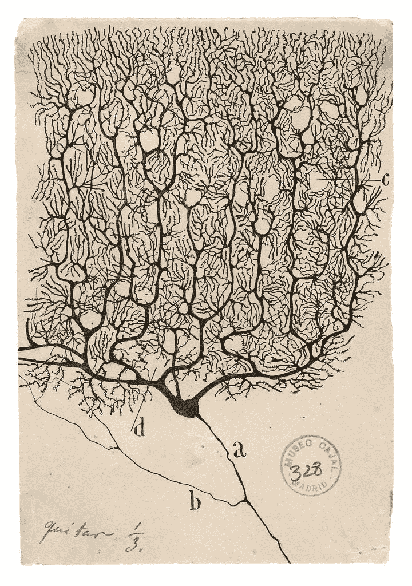
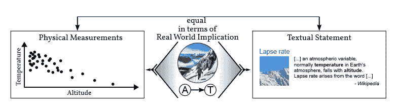
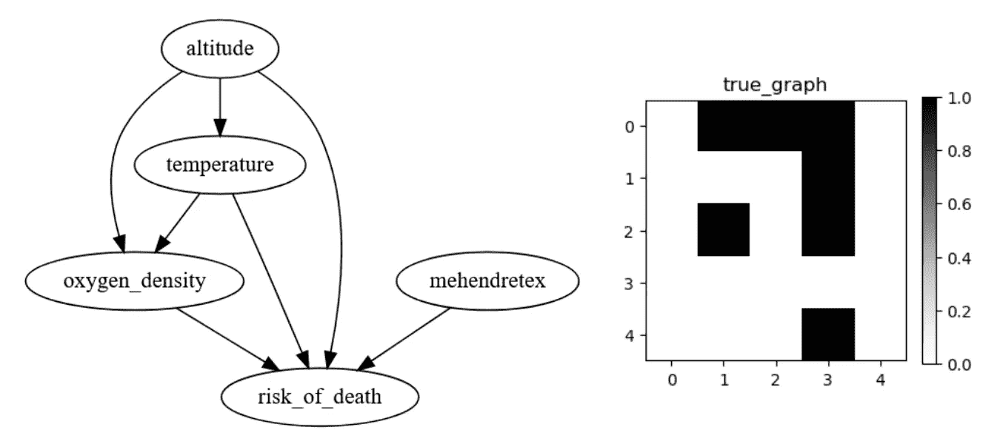
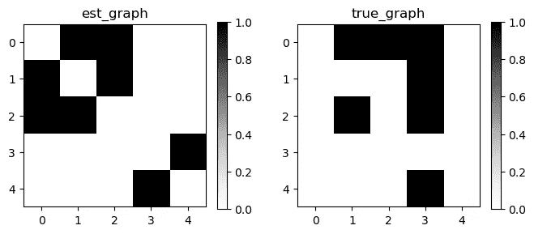
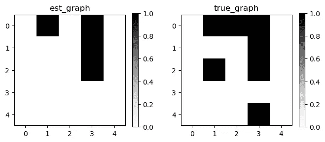
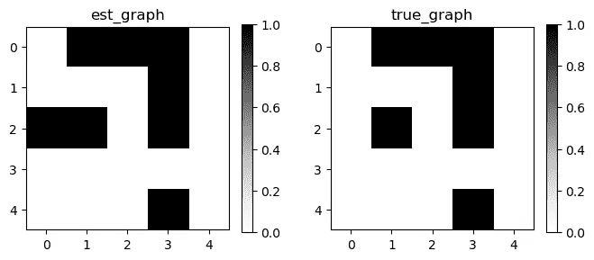
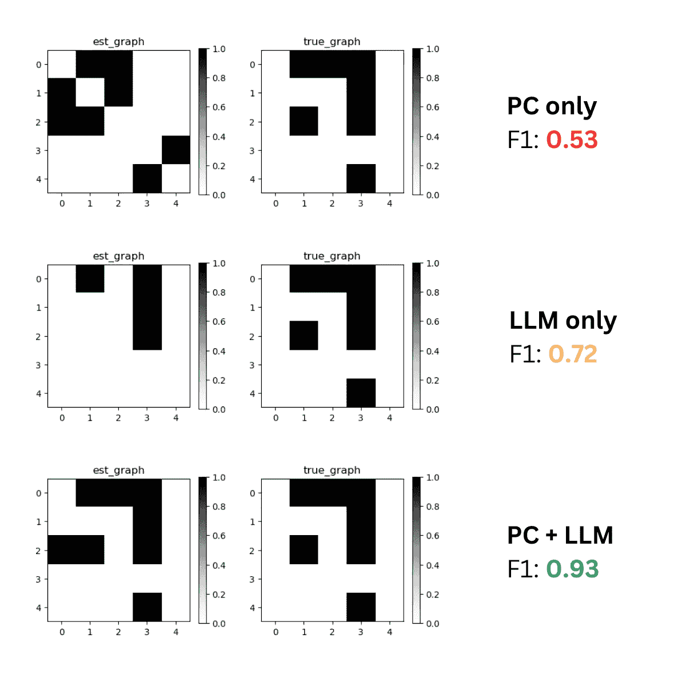

# 《发现者简：利用大语言模型增强因果发现（因果 Python）》

> 原文：[`towardsdatascience.com/jane-the-discoverer-enhancing-causal-discovery-with-large-language-models-causal-python-564a63425c93`](https://towardsdatascience.com/jane-the-discoverer-enhancing-causal-discovery-with-large-language-models-causal-python-564a63425c93)

## 一份实用指南，介绍如何利用大语言模型增强因果发现，减少幻觉风险（附 Python 代码）

[](https://aleksander-molak.medium.com/?source=post_page-----564a63425c93--------------------------------)[](https://towardsdatascience.com/?source=post_page-----564a63425c93--------------------------------) [Aleksander Molak](https://aleksander-molak.medium.com/?source=post_page-----564a63425c93--------------------------------)

·发布于 [Towards Data Science](https://towardsdatascience.com/?source=post_page-----564a63425c93--------------------------------) ·18 分钟阅读·2023 年 10 月 22 日

--


图片由 [Artem Podrez](https://www.pexels.com/@artempodrez/) 提供，来源于 [Pexels.com](http://pexels.com)

> “世界即一切存在的事物。”
> 
> **路德维希·维特根斯坦 — 《逻辑哲学论》（1922 年）**

婴儿在出生时无法理解运动的本质。

我们——人类——以及许多其他非人类动物，都天生拥有帮助我们了解环境的系统，但在我们出生时对环境本身知之甚少¹。

我们需要学习。

在这方面，我们与机器学习系统有相似之处。

早期心理学和*(原始)*神经科学对人类和其他非人类动物学习的发现，激发了构建可以从经验中学习的人工系统的灵感。

20 世纪 10 年代机器学习革命的最成功学习范式之一是监督学习。

经过监督训练的神经网络使我们在图像分类或机器翻译等长期存在的问题上取得了几十年的进展。

人类和其他非人类动物具备一种学习机制（在概念上²，但不一定在实施上）类似于监督学习³。

然而，婴儿和监督算法的学习方式之间也存在根本性差异。



**图 1.** 一幅 Purkinje 神经元的图画。这些是人脑中最大的神经元之一，可以在小脑中找到。图画由 Santiago Ramón y Cajal 绘制，约 1900 年。来源：[`commons.wikimedia.org/wiki/Category:Santiago_Ram%C3%B3n_y_`](https://commons.wikimedia.org/wiki/Category:Santiago_Ram%C3%B3n_y_Cajal)Cajal

# 扔物体*（但不要*对着你）

你有没有见过父母试图说服孩子停止乱扔玩具？一些父母倾向于将这种行为解读为粗鲁、破坏性或攻击性，但婴儿往往有一套非常不同的动机（[Molak, 2023](https://amzn.to/3M3R0YI)）。

他们正在进行系统实验，允许他们学习

物理定律和社会互动规则（[Gopnik, 2009](https://amzn.to/46z9Or1)）。

得益于这些行动，婴儿不仅可以通过观察静态数据（他们也可以这样做）来学习，还可以通过与世界互动来学习。

# 超越观察

与世界互动使孩子们能够建立世界模型。

世界模型是关于数据生成过程的假设。

一个足够丰富的世界模型可以帮助我们回答干预性（*哪个决定将导致最佳结果？*）和反事实（*如果我做了 X 而不是 Y，会发生什么？*）查询。

监督式机器学习模型（及其他基于关联原理的模型）不能直接回答这些问题⁴。

# 我们可以教机器回答因果查询吗？

简短的回答是“可以”。

有几种方法可以做到这一点。在这篇文章中，我们将仅限于机器不直接与环境互动的情况。

一个流行的因果查询是：“*如果我对一组具有某些特征* ***X*** *的个体进行治疗* ***T*** *，那么治疗的平均效果会是什么*”。

这被称为**异质处理效应**或**条件平均处理效应**（**CATE**）。

为了回答这种类型的查询，我们需要提供因果模型以及关于数据生成过程结构的额外信息。

后者通常以**有向无环图**（**DAG**）⁵的形式编码。

传统上，**DAG**（有向无环图）是（1）基于相关专家知识手动创建的，（2）使用自动化因果发现⁶，或（3）两者结合的过程，有时称为**人机交互因果发现**。

> 存在各种因果发现算法，每种算法利用的假设略有不同。请参见这篇文章以了解介绍：

[](/beyond-the-basics-level-up-your-causal-discovery-skills-in-python-now-2023-cabe0b938715?source=post_page-----564a63425c93--------------------------------) ## Causal Python — 提升你的 Python 因果发现技能（2023）

### …并解锁 Python 中最佳因果发现包的潜力！

[towardsdatascience.com

# 雨中舞蹈

构建一个表示我们感兴趣问题的有向无环图（DAG）的任务有时可能很具挑战性，尤其是当我们处理复杂且开放的系统时⁷。

企业在构建因果图时可能面临的一个挑战是收集专家知识的挑战。

收集专家知识可能代价昂贵，尤其是当我们打算以系统化的方式进行时。专家可能不容易获得，而且他们的时间可能很宝贵。

# 我想要大型语言模型

一些作者（例如 Kıcıman et al., 2023）提出，**大型语言模型**（**LLM**s）可能有潜力用于因果发现。

使用通用模型来获得因果结构的理解的前景令人心动——它为快速且具有成本效益的过程开辟了道路。

不幸的是，现成的语言模型（LLMs）在因果发现中的有效性似乎有限，因为它们表现出不可预测的失败模式、幻觉，并且无法区分变量之间的因果关系和非因果关系（Kıcıman et al., 2023; Zečević et al., 2023）。

在**因果强盗播客**这一集里，我们讨论了 LLMs 和因果推理中的问题。**仅音频**版本可在[这里](https://www.buzzsprout.com/2272512/13918140-causality-llms-abstractions-matej-zecevic-causal-bandits-ep-000)获取。

一种最近越来越受欢迎的应对 LLMs 幻觉和失败模式的方法是**检索增强生成**（**RAG**）。

RAG 是一组技术，它为模型提供外部知识来源（如文档或语料库），模型基于这些来源生成响应。

这种方法已被证明能[减少幻觉](https://www.pinecone.io/learn/retrieval-augmented-generation/)并帮助模型保持相关性。

> 要了解更多关于 RAG 及其重要性的内容，请参阅我同事[Anthony Alcaraz](https://medium.com/u/30bc9ffd2f4b?source=post_page-----564a63425c93--------------------------------)的这篇文章：

[## 为什么检索增强对企业 LLMs 至关重要，以及选择哪个当前模型？](https://ai.plainenglish.io/why-retrieval-augmentation-is-critical-for-enterprise-llms-and-which-current-model-to-choose-9ce5d9fa3817?source=post_page-----564a63425c93--------------------------------)

### 大型语言模型（LLMs）展示了在企业环境中彻底改变工作流程的巨大潜力。

[ai.plainenglish.io](https://ai.plainenglish.io/why-retrieval-augmentation-is-critical-for-enterprise-llms-and-which-current-model-to-choose-9ce5d9fa3817?source=post_page-----564a63425c93--------------------------------)

# 两种视角

LLMs 和传统因果发现算法在寻找因果结构的任务中存在根本差异。

传统的因果发现算法利用观测、干预或混合数据的组合以及以假设形式编码的归纳偏差，从数据中推断生成这些数据的过程的结构信息。

另一方面，LLM 完全不看（测量）数据。它们利用概念的学习语义表示并进行转换，以回答关于这些概念之间可能的因果关系的查询。

在这种情况下，LLM 的一个视角是，它们利用**因果事实的相关性**（有关详细信息，请参见 Zečević et al., 2023），以确定两个或多个实体之间的因果关系。



**图 2**。因果事实的文本和测量表示的上下文等效性。来源：[Zečević et al., 2023](https://arxiv.org/pdf/2308.13067.pdf)。

我们在这里讨论***事实的相关性***，因为 LLM 是以联想的方式进行训练的，因此通常无法期望它们基于因果合理的表示进行操作⁸。

好消息是 RAG 可以通过将模型响应集中于提供的语料库的上下文，减少失败模式和幻觉的风险。

这为 LLM 在因果发现过程中的更有意义的角色打开了道路。

# 文档和测量

让我们假设我们想为一个感兴趣的问题建立一个因果图。

我们在一段时间内测量了一组与此问题相关的变量。我们还有存储在多个文档中的关于该问题的专家知识。

我们可以简单地在测量数据上运行因果发现算法，但如果无法保证算法的假设得到满足，这样做是有风险的。这也意味着抛弃我们手头上宝贵的专家知识。

另一方面，我们可以使用 RAG-LLM 查询语料库并解析模型输出以获取图形。

这可能仍然有风险，因为即使有 RAG，我们也不能保证模型会正确回答查询。此外，语料库中的知识可能不完整，这意味着数据中存在的一些因果关系可能在语料库中没有反映出来。

# 想成为朋友吗？

一种替代方法可能是结合两种方法，三角测量语义和基于测量的视角。

一种实现方法是通过查询 RAG-LLM 系统从文本表示中提取因果关系，然后使用获得的信息作为专家知识，注入到仅在测量数据上操作的因果发现算法中。

想尝试一下吗？

# Mehendretex 能帮助登山者吗？

让我们将刚刚描述的想法付诸实践，看看它如何运作。

我使用了一个关于高度和温度关系的经典例子作为我们练习的灵感。

为了使任务更加有趣，我们将向问题中添加更多变量，并使其中一个完全陌生于 LLM（模型本身和文档语料库中都没有关于它的先验知识）。

我们将关注找到一组变量之间的因果结构，这些变量可能影响登山者的死亡风险。

为了找到结构，我们将使用合成测量数据⁹，并利用维基百科中提供的一些变量的先验知识（我们的语料库）。

问题陈述中的变量有：

+   海拔

+   温度

+   氧气密度

+   死亡风险

+   Mehendretex 的使用（我们虚构的处理方法）

后者变量——Mehendretex（现实中不存在类似的东西）——的功能是对我们系统中的 LLM 部分进行压力测试。

我们预计，在相关提示下，一个 RAG-LLM 会告诉我们，它不能对 Mehendretex 和任何其他变量之间的因果关系说**任何**话。

*图 3* 展示了我们问题的真实结构 DAG，以图形（左）和邻接矩阵（右）的形式表示。



**图 3.** 我们问题的真实结构表示为图形（左）和邻接矩阵（右）。矩阵中的黑色区域表示一条边，白色区域表示没有边。例如，坐标为 (4, 3) 的黑色方块表示从节点 4 到节点 3 有一条边。

# 我的 Python 在哪里？

让我们编写代码解决这个问题。

> **GitHub 仓库的链接见文章末尾。**

我们将使用`numpy`和`scipy`生成数据，[**gCastle**](https://github.com/huawei-noah/trustworthyAI/tree/master/gcastle) 将作为我们的因果发现库，OpenAI 的**GPT-4** 作为 LLM，[**LangChain**](https://www.langchain.com/) 作为框架，帮助我们将相关的维基百科文章提供给 GPT-4。

在此基础上，我们将导入`os`来管理 OpenAI 密钥，`itertools.combinations`来帮助我们生成 RAG-LLM 代理的变量对。

## 设置

让我们导入库：

```py
import os
from itertools import combinations

import numpy as np
from scipy import linalg 
from scipy import stats 

import matplotlib.pyplot as plt

from langchain.agents import load_tools, initialize_agent
from langchain.agents import AgentType

from langchain.chat_models import ChatOpenAI

from castle.common import GraphDAG
from castle.metrics import MetricsDAG
from castle.algorithms import PC

from castle.common.priori_knowledge import PrioriKnowledge
```

让我们设置 OpenAI 密钥：

```py
with open(r'my_folder/my_openai_key.dat') as f:
    key = f.read()

os.environ['OPENAI_API_KEY'] = key
```

## 数据生成

现在，让我们生成数据。

注意，我们仅生成虚构的**测量数据**。我们将使用的文本数据是实际的维基百科文章。

从这个意义上讲，我们在这个例子中使用**半合成**数据。

让我们从定义变量名称和索引之间的映射开始。这将帮助我们在后续中以矩阵格式编码从 LLM 获得的专家知识：

```py
all_vars = {
    'altitude': 0,
    'oxygen_density': 1,
    'temperature': 2,
    'risk_of_death': 3,
    'mehendretex': 4
}
```

接下来，我们设置样本大小，并根据*图 3*中展示的结构生成变量的合成测量数据：

```py
SAMPLE_SIZE = 1000

altitude = stats.halfnorm.rvs(scale=2000, size=SAMPLE_SIZE)
temperature = 25 - altitude / 100 + stats.norm.rvs(
    loc=0,
    scale=2,
    size=SAMPLE_SIZE
)

mehendretex = stats.halfnorm.rvs(size=SAMPLE_SIZE)

oxygen_density = np.clip(
    1 - altitude / 8000 
    - temperature / 50 
    + stats.norm.rvs(size=SAMPLE_SIZE) / 20,
    0, 
    1)

risk_of_death = np.clip(
    altitude / 20000 
    + np.abs(temperature) / 100 
    - oxygen_density / 5 
    - mehendretex / 5
    + stats.norm.rvs(size=SAMPLE_SIZE) / 10,
    0,
    1
)
```

请注意，为了使数据集更加逼真，我们使用了正态分布和半正态分布的组合，并与截断相结合。

这也将使因果发现算法的工作更加困难。

让我们将所有变量堆叠到一个矩阵中：

```py
dataset = np.stack(
    [
        altitude,
        oxygen_density,
        temperature,
        risk_of_death,
        mehendretex
    ]
).T
```

…并以矩阵形式定义*图 3*中的结构：

```py
true_dag = np.array(
    [
        [0, 1, 1, 1, 0],
        [0, 0, 0, 1, 0],
        [0, 1, 0, 1, 0],
        [0, 0, 0, 0, 0],
        [0, 0, 0, 1, 0]
    ]
)
```

## 算法因果发现

让我们通过将经典的 PC 算法应用于我们的测量数据来开始发现过程。

我们将使用 gCastle 实现的 PC 稳定变体：

```py
# PC discovery without LLM assist
pc = PC(variant='stable')
pc.learn(dataset)

# Vizualize
GraphDAG(
    est_dag=pc.causal_matrix, 
    true_dag=true_dag)

plt.show()

# Compute metrics
metrics = MetricsDAG(
    B_est=pc.causal_matrix, 
    B_true=true_dag)

print(metrics.metrics)
```

结果展示在*图 4*中：



**图 4**：将 PC 算法应用于我们的测量数据的结果。右侧是实际邻接矩阵；左侧是 PC 算法生成的矩阵。矩阵中的黑色“区域”表示一条边，白色区域表示没有边。例如，坐标为(2, 1)的黑色方块表示从节点 2 到节点 1 有一条边。

如我们所见，结果并不理想。算法正确识别了一些边（例如，`(4, 3)`、`(0, 1)`或`(0, 2)`），但许多边仍然未定向。

比如，在左侧的矩阵中，我们有一个边`(4, 3)`，但也有`(3, 4)`，这表明模型能够识别节点 3 和 4 之间的连接，但无法确定这一连接的方向。

了解我们数据集的基础结构，这并不令人惊讶，因为 PC 算法依赖于条件独立性测试，并且在某些结构配置下无法确定边的方向。

想了解更多关于 PC 的信息及其原因，请查看**这篇博客文章**进行介绍或我[**最近的因果建模书籍的第三部分**](https://amzn.to/46EW9yB)以获得更详细的处理。

当我们查看指标时，这张图的 F1 分数等于 0.53¹⁰。

## 定义一个 LLM 代理

让我们看看当我们将 RAG-LLM 代理添加到这个场景中会发生什么。

首先，我们将定义一个先验知识对象，然后用它来存储我们的代理提取的知识。

```py
# Instantiate the priori knowledge object
priori_knowledge = PrioriKnowledge(n_nodes=len(all_vars))
```

接下来，让我们实例化代理。

```py
llm = ChatOpenAI(
    temperature=0, 
    model='gpt-4')
```

我们将选择 GPT-4 作为我们的模型。我们将温度设置为`0`，以使模型输出尽可能保守。

让我们添加 LangChain 的工具，使模型能够访问维基百科：

```py
# Load tools
tools = load_tools(
    [
        "wikipedia"
    ], 
    llm=llm)
```

最后，让我们实例化代理：

```py
# Instantiate the agent
agent = initialize_agent(
    tools, 
    llm, 
    agent=AgentType.CHAT_ZERO_SHOT_REACT_DESCRIPTION,
    handle_parsing_errors=True,
    verbose=False)
```

我们将使用代理浏览维基百科页面，以寻找与我们问题相关的变量之间的因果关系信息。

从这个代理获得的发现将被传递给另一个 GPT-4 实例。

这个第二个 GPT-4 实例将负责解释初始输出，并将其转换为与我们之前的知识对象兼容的格式。

为了使代码更具可重用性，我们将其封装在一个函数中：

```py
def get_llm_info(llm, agent, var_1, var_2):

    out = agent(f"Does {var_1} cause {var_2} or the other way around?\
    We assume the following definition of causation:\
    if we change A, B will also change.\
    The relationship does not have to be linear or monotonic.\
    We are interested in all types of causal relationships, including\
    partial and indirect relationships, given that our definition holds.\
    ")

    print(out)

    pred = llm.predict(f'We assume the following definition of causation:\
    if we change A, B will also change.\
    Based on the following information: {out["output"]},\
    print (0,1) if {var_1} causes {var_2},\
    print (1, 0) if {var_2} causes {var_1}, print (0,0)\
    if there is no causal relationship between {var_1} and {var_2}.\
    Finally, print (-1, -1) if you don\'t know. Importantly, don\'t try to\
    make up an answer if you don\'t know.')

    print(pred)

    return pred
```

注意我们如何首先调用代理，使用一个提示，然后将这个代理的输出传递给另一个（非代理）LLM 实例，该实例使用另一个提示进行初始化。

在我的实验中，这种分层方法比仅使用单一代理获得了更好、更一致的结果。

我还注意到，重复向两个代理解释因果关系对改善结果有帮助。

在这两个提示中，我们使用 Pearl 的干预因果定义。此外，第一个提示指定我们对广泛的因果效应感兴趣，只要它们符合基本定义。

在实验中，后者在某些情况下帮助模型变得更加果断。

函数返回：

+   如果模型判断存在从`var_1`到`var_2`的因果边，则为`(0,1)`

+   如果模型判断因果方向是从`var_2`到`var_1`，则为`(1,0)`

+   如果模型判断`var_1`和`var_2`之间**没有**因果关系，则为`(0,0)`

+   如果模型不知道答案（请注意我们在提示中强调了模型如果不知道答案就不应给出答案），则为`(-1,-1)`

## LLM 增强的因果发现

我们现在准备使用我们的分层双提示系统从维基百科收集专家知识。

我们将遍历所有可能的变量组合，记录每个组合的模型回答，并将其存储在先验知识对象中：

```py
for var_1, var_2 in combinations(all_vars.keys(), r=2):
    print(var_1, var_2)
    out = get_llm_info(llm, agent, var_1, var_2)
    if out=='(0,1)':
        priori_knowledge.add_required_edges(
            [(all_vars[var_1], all_vars[var_2])]
        )

        priori_knowledge.add_forbidden_edges(
            [(all_vars[var_2], all_vars[var_1])]
        )

    elif out=='(1,0)':
        priori_knowledge.add_required_edges(
            [(all_vars[var_2], all_vars[var_1])]
        )
        priori_knowledge.add_forbidden_edges(
            [(all_vars[var_1], all_vars[var_2])]
        )

print('\nLLM knowledge vs true DAG')
priori_dag = np.clip(priori_knowledge.matrix, 0, 1)

GraphDAG(
    est_dag=priori_dag, 
    true_dag=true_dag)

plt.show()
```

请注意，我们仅在模型判断变量之间**存在**因果关系（输出为`(0,1)`或`(1,0)`）时，将信息从模型传递到先验知识对象，但当模型声称变量之间**没有**因果关系时，我们会跳过这一步。

这个决定基于观察到模型在声称存在因果影响时通常过于谨慎。

通过忽略模型的空结果，我们实质上允许因果发现算法在这种情况下决定是否存在关系。

让我们看看模型能够学到什么。

*图 5* 显示了我们的 LLM 代理与真实情况的对比结果。



**图 5.** 我们的 LLM 代理检索的先验知识（左）和真实情况图（右）。

正如我们所见，模型能够学到一些有用的知识，但未能重建整个图。这部分是因为维基百科没有包含我们设想的处理—Mehendretex 的信息。

让我们快速查看一下我们模型中涉及 Mehendretex 的一个日志：

```py
{'input': 'Does risk_of_death cause mehendretex or the other way around?    
We assume the following definition of causation:    
if we change A, B will also change.    
The relationship does not have to be linear or monotonic.    
We are interested in all types of causal relationships, including    
partial and indirect relationships, given that our definition holds.', 
'output': 'I\'m sorry, but I couldn\'t 
find any information on "mehendretex". 
Therefore, it\'s impossible to determine a causal relationship 
between "risk_of_death" and "mehendretex". 
Could you please provide more context or 
check if "mehendretex" is spelled correctly?'}
(-1, -1)
```

似乎模型正确回应了包含不在模型使用的语料库中的术语的查询（见上框中的**粗体**文本）。

我们现在准备将收集到的知识传递给因果发现算法：

```py
print('\nRunning PC')
# Instantiate the model with expert knowledge
pc_priori = PC(
    priori_knowledge=priori_knowledge,
    variant='stable'
)

# Learn
pc_priori.learn(dataset)

GraphDAG(
    est_dag=pc_priori.causal_matrix, 
    true_dag=true_dag)

plt.show()

# Compute metrics
metrics = MetricsDAG(
    B_est=pc_priori.causal_matrix, 
    B_true=true_dag)

print(metrics.metrics)
```

请注意，我们正在初始化 PC 算法的新实例，并将包含 LLM 收集到的知识的`priori_knowledge`对象传递给构造函数。

PC 现在将重新计算所有条件独立性测试的结果，但在确定边的方向时还会考虑先验知识。

准备好查看结果了吗？

*图 6* 显示了我们 RAG-LLM 诱导的 PC 算法的结果。



**图 6.** 使用基于 RAG-LLM 的先验知识的 PC 算法结果（左）与真实情况（右）。

这看起来非常好！

只有一条边保持无向：索引为`0`和`2`（海拔和温度）的节点之间的边，所有其他边都被正确定向。

该输出的 F1 分数为 0.93，比没有 LLM 帮助的 PC 提高了 40 个百分点。

## 总结结果

通过将传统的因果发现方法与 RAG-LLM 结合，我们能够获得比任何单一方法更好的结果。

*图 7* 总结了每个步骤的结果。



**图 7** 模型输出在每个阶段的邻接矩阵（左列）与真实值（右列）以及相应的 F1 分数值。

# 摘要

使用大型语言模型作为“知识解析器”，将文本信息转换为与传统因果发现算法兼容的格式，并扩展后者的能力，这一想法非常强大。

## 限制

我们在这篇博客文章中讨论的系统主要限制之一是 LLM 输出的不稳定性。我运行了大约 20 次这里呈现的过程，LLM 的决策在不同运行间并不总是保持一致（即使温度设置为零）。

PC 算法有一套理论保证，但这些保证仅适用于无限样本量，这在实际中当然是不可能的。此外，我们在这篇文章中使用的默认条件独立性测试并不十分强大，可能在更复杂的情况下表现不佳。

PC 算法要求数据中没有隐藏的混淆——这是一个不总是可以保证的条件，特别是在开放复杂系统中。

对于较大的数据集，运行 RAG-LLM 部分可能会迅速变得昂贵，因为系统可能在幕后对每对变量进行多个 API 调用。如果你决定为自己的用例运行代码，**要注意潜在的高 API 费用**。

我的建议是**在你的 OpenAI 账户中设定一个限制**，在开始实验之前。

## 进一步改进

自然地，这样的系统不必局限于维基百科作为外部知识来源，任何文档语料库都可以使用。

一些大型语言模型（LLM）输出的不稳定性可以通过创建更好的提示来潜在解决。

通过使用更通用的基于核的方法进行条件独立性测试，PC 算法的性能可以得到改善。如果数据适合，其他因果发现算法也可以替代 PC。

尤其是当无法排除隐藏混淆时，像**快速因果发现**（**FCI**）这样的算法可能是更好的选择。

对每对可能的变量进行 LLM 查询不可扩展，对于较大的数据集可能非常昂贵。一个潜在的预选择机制可以基于常规 LLM，评估两个变量是否有因果连接的可能性。在单个查询中结合多个变量可能有助于降低成本。

这个解决方案的缺点是它伴随着更高的幻觉风险，但在处理常见变量和关系时可能是有效的。

## 结论

Jane the Discoverer 是一个概念验证的想法。我认为它是一个因果助手，适用于小型到中型图。

出于教育目的，博客中的代码是以建议自主使用的方式编写的，但我发现人机交互范式更为有效。

恭喜你阅读完毕！

我们如何进一步改进 Jane？

在下面的评论区分享你的想法和建议，保持因果联系！

> 如果你喜欢这篇文章，你可能也会喜欢：
> 
> 🔸 [因果 Bandits 播客](https://causalbanditspodcast.com)
> 
> 🔸[因果 Python 每周](https://bit.ly/46FF2N4)通讯
> 
> **笔记本**与本文的**完整代码**可以在 GitHub 上找到：

[](https://github.com/AlxndrMlk/blogs-code/tree/main/Jane%20the%20Discoverer?source=post_page-----564a63425c93--------------------------------) [## blogs-code/Jane the Discoverer at main · AlxndrMlk/blogs-code

### 博客文章的代码。通过在 GitHub 上创建帐户来贡献 AlxndrMlk/blogs-code 的开发。

github.com](https://github.com/AlxndrMlk/blogs-code/tree/main/Jane%20the%20Discoverer?source=post_page-----564a63425c93--------------------------------)

# 脚注

¹ 我们可以争辩说，在出生的那一天，我们实际上对世界有所了解，因为许多研究表明胎儿可以学习和习惯（例如，James 等，2022）

² 联想学习在各个物种中普遍存在。即使在像[*C. elegans*](https://en.wikipedia.org/wiki/Caenorhabditis_elegans)这样的简单生物中也有出现。注意，在本文中我们使用术语*联想学习*来描述任何基于关联的学习，这不包括系统干预。这一定义可能与心理学和/或生物学中使用的一些定义不一致。

³ 我们可以在这里讨论在联想学习背景下动物与监督机器学习算法之间的实现差异及潜在的样本效率差异。附带说明，我认为样本效率的话题非常有趣。同时，我相信相关的答案比“一个孩子可以通过两个例子了解什么是狗，而 CNN 或 Transformer 架构需要数百万个例子”这样的流行说法要复杂得多。

⁴ 这也包括自监督学习和一些强化学习模型。

⁵ 通过使用更先进或更通用的识别方法，我们可以将其扩展到部分有向或循环图。

⁶ 因果发现是一系列方法，旨在从观察性、干预性或混合数据中恢复数据生成过程的结构。

为生产线建立一个文档完善且实际隔离于外部影响的图形通常比为公共政策优化建立图形要容易一些。在这两种极端情况之间还有许多其他情况。

⁸ 也就是说，如果我们可以在测试时进行干预，LLMs 可以学习主动（因果）策略。有关详细信息，请参见 [Lampinen 等（2023）](https://arxiv.org/pdf/2305.16183.pdf)。

⁹ 我们使用合成测量，以确保我们知道真实情况。

¹⁰ F1 分数不一定是比较图形结构时最具信息量的度量指标。然而，我决定在这里使用它，因为它是数据科学社区中相对被理解且非常流行的度量指标。我希望使用它（而不是像 SHD 这样的更专业的度量指标）能使这篇文章对更广泛的受众更具可及性。

# 参考文献

Gopnik, A. (2009). [*哲学婴儿：儿童的思维告诉我们关于真理、爱和生活意义的东西*](https://amzn.to/46z9Or1). 纽约：Farrar, Straus and Giroux.

Kıcıman, E., Ness, R., Sharma, A., & Tan, C. (2023). [因果推理与大型语言模型：为因果关系开辟新领域。](https://arxiv.org/pdf/2304.05524.pdf) *ArXiv.*

Lampinen, A. K., Chan, S. C. Y., Dasgupta, I., Nam, A. J., & Wang, J. X. (2023). [代理和语言模型中的主动因果策略的被动学习](https://arxiv.org/pdf/2305.16183.pdf). *ArXiv.*

Molak, A. (2023). [*Python 中的因果推断与发现：利用 DoWhy、EconML、PyTorch 等解锁现代因果机器学习的秘密*](https://amzn.to/3M3R0YI). Packt Publishing.

Stanovich, K., & West, R. (2000). 个人推理差异：对理性辩论的影响？*行为与脑科学,* *23*(5), 645–665\. doi:10.1017/S0140525X00003435

Zečević, M., Willig, M., Dhami, D. S., & Kersting, K. (2023). [因果鹦鹉：大型语言模型可能谈论因果关系但不具备因果能力](https://arxiv.org/pdf/2308.13067.pdf). *ArXiv.*

*这篇文章可能包含书籍的联盟链接。如果你通过这些链接购买书籍，作者将获得少量佣金。*
