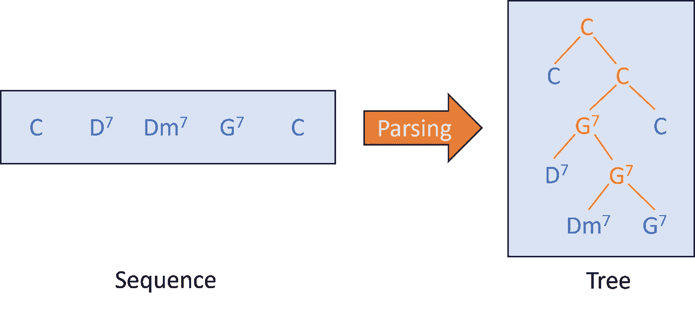
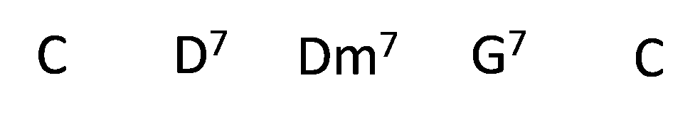
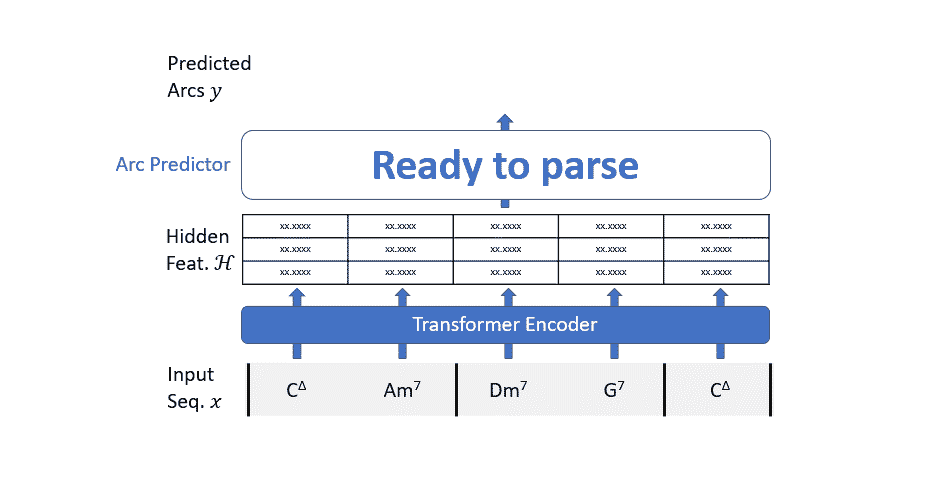

# 爵士和弦解析与变压器  

> 原文：[`towardsdatascience.com/jazz-chords-parsing-with-transformers-d75031a976f2`](https://towardsdatascience.com/jazz-chords-parsing-with-transformers-d75031a976f2)  

## 基于数据的树形音乐分析方法  

[](https://medium.com/@foscarin.francesco?source=post_page-----d75031a976f2--------------------------------)[](https://towardsdatascience.com/?source=post_page-----d75031a976f2--------------------------------) [Francesco Foscarin](https://medium.com/@foscarin.francesco?source=post_page-----d75031a976f2--------------------------------)  

·发布在 [Towards Data Science](https://towardsdatascience.com/?source=post_page-----d75031a976f2--------------------------------) ·阅读时间 11 分钟·2023 年 8 月 1 日  

--  

  

在这篇文章中，我总结了我的研究论文[“使用基于图的神经解码器预测音乐层级”](https://arxiv.org/abs/2306.16955)的一部分，该论文提出了一种能够解析爵士和弦序列的数据驱动系统。  

这项研究是**由于我对基于语法的解析**系统感到挫败而激发的（这些系统是处理音乐数据的唯一选择）：  

+   语法构建阶段需要大量的领域知识  

+   解析器在面对一些未见过的配置或嘈杂数据时会失败  

+   在单一语法规则中考虑多个音乐维度是具有挑战性的。  

+   目前没有一个得到广泛支持的活跃 Python 框架来帮助开发  

**我的方法**（受自然语言处理领域类似工作的启发），**不依赖于任何语法**，**对嘈杂输入产生部分结果**，**可以轻松处理多个音乐维度，并且在 PyTorch 中实现**。  

如果你不熟悉解析和语法，或者只是需要刷新你的知识，我现在会退后一步。  

*什么是“解析”？*

*解析*一词指的是预测/推断出一棵树（数学结构），其叶子节点是序列中的元素。  

  

*好吧，但我们为什么需要树呢？*  

让我们从以下的爵士和弦序列（《Take the A Train》的 A 部分）开始。  

  

在爵士音乐中，和弦通过复杂的感知关系系统连接。例如，Dm7 是对主和弦 G7 的预备。这意味着 Dm7 的作用不如 G7 重要，它可以在不同的和声重构中被省略。类似地，D7 是一个次级主和弦（主和弦的主和弦），也指向 G7。  

这种和声关系**可以用树来表达**，并且**对音乐分析或执行诸如再和声等任务非常有用**。然而，由于音乐作品中的和弦大多以序列形式存在，我们希望一个**能够自动构建这种树结构的系统**。

# 组成树与依赖树

在继续之前，我们需要区分两种类型的树。

音乐学家倾向于使用所谓的*组成树*，你可以在下面的图片中看到。组成树包含叶子（蓝色和弦——输入序列的元素），以及内部节点（橙色和弦——子叶的简化）。


而在这项工作中，我们考虑另一种树，称为*依赖树*。这种树没有内部节点，只有连接序列元素的有向弧。


我们可以通过一些稍后讨论的算法从组成树生成依赖树。

# 数据集

由于这是数据驱动的方法，我们需要一个和弦序列的数据集（输入数据），以及一个树的数据集（真实标签）用于训练和测试。我们使用的是 Jazz Treebank¹，公开在[这个](https://github.com/DCMLab/JazzHarmonyTreebank) GitHub 仓库中（它可以自由用于非商业应用，并且我获得了作者的许可在本文中使用它）。特别是，他们提供了一个包含所有和弦和注释的 JSON 文件。

我们将输入到系统中的每个和弦建模为三个特征：

1.  根节点，是[0..11]中的一个整数，其中 C -> 0，C# ->1，依此类推……

1.  基本形式是[0..5]中的一个整数，用于选择大调、小调、增和弦、半减和弦、减和弦和挂留和弦（sus）。

1.  扩展，是[0,1,2]中的一个整数，用于选择 6、次要 7 或大调 7。

要从和弦标签（一个字符串）中生成**和弦特征**，我们可以使用如下的正则表达式（注意，这段代码适用于这个数据集，因为在其他和弦数据集中格式可能会有所不同）。

```py
def parse_chord_label(chord_label):
  # Define a regex pattern for chord symbols
  pattern = r"([A-G][#b]?)(m|\+|%|o|sus)?(6|7|\⁷)?"
  # Match the pattern with the input chord
  match = re.match(pattern, chord_label)
  if match:
    # Extract the root, basic chord form and extension from the match obj
    root = match.group(1)
    form = match.group(2) or "M"
    ext = match.group(3) or ""
    return root, form, ext
  else:
    # Return None if the input is not a valid chord symbol
    raise ValueError("Invalid chord symbol: {}".format(chord_label))
```

最后，我们需要生成依赖树。JHT 数据集只包含组成树，以嵌套字典形式编码。我们导入它们，并通过递归函数将它们转换为依赖树。我们函数的机制可以描述如下。

我们从一个完全形成的组成树和一个没有任何依赖弧的依赖树开始，这个依赖树仅由标记为序列元素的节点组成。算法将所有内部树节点与其主要子节点（它们都具有相同的标签）进行分组，并使用每个组中所有次要子节点关系来创建组标签和次要子节点标签之间的依赖弧。

```py
def parse_jht_to_dep_tree(jht_dict):
    """Parse the python jazz harmony tree dict to a list of dependencies and a list of chord in the leaves.
    """
    all_leaves = []

    def _iterative_parse_jht(dict_elem):
        """Iterative function to parse the python jazz harmony tree dict to a list of dependencies."""
        children = dict_elem["children"]
        if children == []:  # recursion ending condition
            out = (
                [],
                {"index": len(all_leaves), "label": dict_elem["label"]},
            )
            # add the label of the current node to the global list of leaves
            all_leaves.append(dict_elem["label"])
            return out
        else:  # recursive call
            assert len(children) == 2 
            current_label = noast(dict_elem["label"])
            out_list = []  # dependency list
            iterative_result_left = _iterative_parse_jht(children[0])
            iterative_result_right = _iterative_parse_jht(children[1])
            # merge the dependencies lists computed deeper
            out_list.extend(iterative_result_left[0])
            out_list.extend(iterative_result_right[0])
            # check if the label correspond to the left or right children and return the corresponding result
            if iterative_result_right[1]["label"] == current_label: # default if both children are equal is to go left-right arch
                # append the dependency for the current node
                out_list.append((iterative_result_right[1]["index"], iterative_result_left[1]["index"]))
                return out_list, iterative_result_right[1]
            elif iterative_result_left[1]["label"] == current_label: 
                # print("right-left arc on label", current_label)
                # append the dependency for the current node
                out_list.append((iterative_result_left[1]["index"], iterative_result_right[1]["index"]))
                return out_list, iterative_result_left[1]
            else:
                raise ValueError("Something went wrong with label", current_label)

    dep_arcs, root = _iterative_parse_jht(jht_dict)
    dep_arcs.append((-1,root["index"])) # add connection to the root, with index -1
    # add self loop to the root
    dep_arcs.append((-1,-1)) # add loop connection to the root, with index -1
    return dep_arcs, all_leaves
```

# 依赖解析模型

我们的解析模型的工作机制相当简单：我们考虑所有可能的弧，并使用*弧预测器*（一个简单的二分类器）来预测该弧是否应该成为树的一部分。

然而，仅根据我们试图连接的两个和弦来做出这个选择是相当困难的。我们需要一些*上下文*。我们通过构建一个变换器编码器来提供这样的上下文。

总结而言，我们的解析模型分为两个步骤：

1.  输入序列通过变换器编码器传递，以丰富其上下文信息；

1.  一个二分类器评估所有可能的依赖弧图，以过滤掉不需要的弧。



变换器编码器遵循标准架构。我们使用可学习的嵌入层将每个分类输入特征映射到一个连续的多维空间中的点。然后将所有嵌入加在一起，因此网络可以“决定”每个特征使用的维度。

```py
import torch.nn as nn

class TransformerEncoder(nn.Module):
    def __init__(
        self,
        input_dim,
        hidden_dim,
        encoder_depth,
        n_heads = 4,
        dropout=0,
        embedding_dim = 8,
        activation = "gelu",
    ):
        super().__init__()
        self.input_dim = input_dim
        self.positional_encoder = PositionalEncoding(
            d_model=input_dim, dropout=dropout, max_len=200
        )
        encoder_layer = nn.TransformerEncoderLayer(d_model=input_dim, dim_feedforward=hidden_dim, nhead=n_heads, dropout =dropout, activation=activation)
        encoder_norm = nn.LayerNorm(input_dim)
        self.transformer_encoder = nn.TransformerEncoder(encoder_layer, num_layers=encoder_depth, norm=encoder_norm)
        self.embeddings = nn.ModuleDict({
                        "root": nn.Embedding(12, embedding_dim),
                        "form": nn.Embedding(len(CHORD_FORM), embedding_dim),
                        "ext": nn.Embedding(len(CHORD_EXTENSION), embedding_dim),
                        "duration": nn.Embedding(len(JTB_DURATION), embedding_dim,
                        "metrical": nn.Embedding(METRICAL_LEVELS, embedding_dim)
                    })

    def forward(self, sequence):
        root = sequence[:,0]
        form = sequence[:,1]
        ext = sequence[:,2]
        duration = sequence[:,3]
        metrical = sequence[:,4]
        # transform categorical features to embedding
        root = self.embeddings"root")
        form = self.embeddings"form")
        ext = self.embeddings"ext")
        duration = self.embeddings"duration")
        metrical = self.embeddings"metrical")
        # sum all embeddings
        z = root + form + ext + duration + metrical
        # add positional encoding
        z = self.positional_encoder(z)
        # reshape to (seq_len, batch = 1, input_dim)
        z = torch.unsqueeze(z,dim= 1)
        # run transformer encoder
        z = self.transformer_encoder(src=z, mask=src_mask)
        # remove batch dim
        z = torch.squeeze(z, dim=1)
        return z, ""

class PositionalEncoding(nn.Module):
    def __init__(self, d_model: int, dropout: float = 0.1, max_len: int = 500):
        super().__init__()
        self.dropout = nn.Dropout(p=dropout)
        position = torch.arange(max_len).unsqueeze(1)
        div_term = torch.exp(torch.arange(0, d_model, 2) * (-np.log(10000.0) / d_model))
        pe = torch.zeros(max_len, d_model)
        pe[:, 0::2] = torch.sin(position * div_term)
        pe[:, 1::2] = torch.cos(position * div_term)
        self.register_buffer('pe', pe)
    def forward(self, x: torch.Tensor) -> torch.Tensor:
        x = x + self.pe[:x.size(0)]
        return self.dropout(x)
```

弧预测器只是一个线性层，它的输入是两个和弦的隐藏特征的连接。由于矩阵乘法的强大功能，所有弧的分类步骤都是并行完成的。

```py
class ArcPredictor(nn.Module):
    def __init__(self, hidden_channels, activation=F.gelu, dropout=0.3):
        super().__init__()
        self.activation = activation
        self.root_linear = nn.Linear(1, hidden_channels) # linear to produce root features
        self.lin1 = nn.Linear(2*hidden_channels, hidden_channels)
        self.lin2 = nn.Linear(hidden_channels, 1)
        self.dropout = nn.Dropout(dropout)
        self.norm = nn.LayerNorm(hidden_channels)

    def forward(self, z, pot_arcs):
        # add column for the root element
        root_feat = self.root_linear(torch.ones((1,1), device=z.device))
        z = torch.vstack((root_feat,z))
        # proceed with the computation
        z = self.norm(z)
        # concat the embeddings of the two nodes, shape (num_pot_arcs, 2*hidden_channels)
        z = torch.cat([z[pot_arcs[:, 0]], z[pot_arcs[:, 1]]], dim=-1)
        # pass through a linear layer, shape (num_pot_arcs, hidden_channels)
        z = self.lin1(z)
        # pass through activation, shape (num_pot_arcs, hidden_channels)
        z = self.activation(z)
        # normalize
        z = self.norm(z)
        # dropout
        z = self.dropout(z)
        # pass through another linear layer, shape (num_pot_arcs, 1)
        z = self.lin2(z)
        # return a vector of shape (num_pot_arcs,)
        return z.view(-1)
```

我们可以将变换器编码器和弧预测器放在一个单独的 PyTorch 模块中，以简化其使用。

```py
class ChordParser(nn.Module):
    def __init__(self, input_dim, hidden_dim, num_layers, dropout=0.2, embedding_dim = 8, use_embedding = True, n_heads = 4):
        super().__init__()
        self.activation = nn.functional.gelu
        # initialize the encoder
        self.encoder = NotesEncoder(input_dim, hidden_dim, num_layers, dropout, embedding_dim, n_heads=n_heads)
        # initialize the decoder
        self.decoder = ArcDecoder(input_dim, dropout=dropout)

    def forward(self, note_features, pot_arcs, mask=None):
        z = self.encoder(note_features)
        return self.decoder(z, pot_arcs)
```

# 损失函数

作为损失函数，我们使用两个损失的和：

+   二元交叉熵损失：这个思想是将我们的问题视为一个二分类问题，每个弧都可以被预测或不被预测。

+   交叉熵损失：这个思想是将我们的问题视为一个多分类问题，在一个头 → 依赖弧中，我们需要预测所有其他和弦中哪个是正确的依赖。

```py
loss_bce = torch.nn.BCEWithLogitsLoss()
loss_ce = torch.nn.CrossEntropyLoss(ignore_index=-1)
total_loss = loss_bce + loss_ce
```

# 后处理

有一个问题我们仍然需要解决。在训练过程中，并没有强制要求预测的弧必须形成树结构。因此，我们可能会遇到像弧循环这样的无效配置。幸运的是，我们可以使用一种算法来确保这种情况不会发生：Eisner 算法。²

我们不再只是简单地假设弧存在的概率大于 0.5，而是将所有预测结果保存在一个大小为（和弦数，和弦数）的方形矩阵（*邻接矩阵*）中，然后在该矩阵上运行 Eisner 算法。

```py
# Adapted from https://github.com/HMJW/biaffine-parser
def eisner(scores, return_probs = False):
    """Parse using Eisner's algorithm.
    The matrix follows the following convention:
        scores[i][j] = p(i=head, j=dep) = p(i --> j)
    """
    rows, collumns = scores.shape
    assert rows == collumns, 'scores matrix must be square'
    num_words = rows - 1  # Number of words (excluding root).
    # Initialize CKY table.
    complete = np.zeros([num_words+1, num_words+1, 2])  # s, t, direction (right=1).
    incomplete = np.zeros([num_words+1, num_words+1, 2])  # s, t, direction (right=1).
    complete_backtrack = -np.ones([num_words+1, num_words+1, 2], dtype=int)  # s, t, direction (right=1).
    incomplete_backtrack = -np.ones([num_words+1, num_words+1, 2], dtype=int)  # s, t, direction (right=1).
    incomplete[0, :, 0] -= np.inf
    # Loop from smaller items to larger items.
    for k in range(1, num_words+1):
        for s in range(num_words-k+1):
            t = s + k
            # First, create incomplete items.
            # left tree
            incomplete_vals0 = complete[s, s:t, 1] + complete[(s+1):(t+1), t, 0] + scores[t, s]
            incomplete[s, t, 0] = np.max(incomplete_vals0)
            incomplete_backtrack[s, t, 0] = s + np.argmax(incomplete_vals0)
            # right tree
            incomplete_vals1 = complete[s, s:t, 1] + complete[(s+1):(t+1), t, 0] + scores[s, t]
            incomplete[s, t, 1] = np.max(incomplete_vals1)
            incomplete_backtrack[s, t, 1] = s + np.argmax(incomplete_vals1)
            # Second, create complete items.
            # left tree
            complete_vals0 = complete[s, s:t, 0] + incomplete[s:t, t, 0]
            complete[s, t, 0] = np.max(complete_vals0)
            complete_backtrack[s, t, 0] = s + np.argmax(complete_vals0)
            # right tree
            complete_vals1 = incomplete[s, (s+1):(t+1), 1] + complete[(s+1):(t+1), t, 1]
            complete[s, t, 1] = np.max(complete_vals1)
            complete_backtrack[s, t, 1] = s + 1 + np.argmax(complete_vals1)
    value = complete[0][num_words][1]
    heads = -np.ones(num_words + 1, dtype=int)
    backtrack_eisner(incomplete_backtrack, complete_backtrack, 0, num_words, 1, 1, heads)
    value_proj = 0.0
    for m in range(1, num_words+1):
        h = heads[m]
        value_proj += scores[h, m]
    if return_probs:
        return heads, value_proj
    else:
        return heads

def backtrack_eisner(incomplete_backtrack, complete_backtrack, s, t, direction, complete, heads):
    """
    Backtracking step in Eisner's algorithm.
    - incomplete_backtrack is a (NW+1)-by-(NW+1) numpy array indexed by a start position,
    an end position, and a direction flag (0 means left, 1 means right). This array contains
    the arg-maxes of each step in the Eisner algorithm when building *incomplete* spans.
    - complete_backtrack is a (NW+1)-by-(NW+1) numpy array indexed by a start position,
    an end position, and a direction flag (0 means left, 1 means right). This array contains
    the arg-maxes of each step in the Eisner algorithm when building *complete* spans.
    - s is the current start of the span
    - t is the current end of the span
    - direction is 0 (left attachment) or 1 (right attachment)
    - complete is 1 if the current span is complete, and 0 otherwise
    - heads is a (NW+1)-sized numpy array of integers which is a placeholder for storing the
    head of each word.
    """
    if s == t:
        return
    if complete:
        r = complete_backtrack[s][t][direction]
        if direction == 0:
            backtrack_eisner(incomplete_backtrack, complete_backtrack, s, r, 0, 1, heads)
            backtrack_eisner(incomplete_backtrack, complete_backtrack, r, t, 0, 0, heads)
            return
        else:
            backtrack_eisner(incomplete_backtrack, complete_backtrack, s, r, 1, 0, heads)
            backtrack_eisner(incomplete_backtrack, complete_backtrack, r, t, 1, 1, heads)
            return
    else:
        r = incomplete_backtrack[s][t][direction]
        if direction == 0:
            heads[s] = t
            backtrack_eisner(incomplete_backtrack, complete_backtrack, s, r, 1, 1, heads)
            backtrack_eisner(incomplete_backtrack, complete_backtrack, r+1, t, 0, 1, heads)
            return
        else:
            heads[t] = s
            backtrack_eisner(incomplete_backtrack, complete_backtrack, s, r, 1, 1, heads)
            backtrack_eisner(incomplete_backtrack, complete_backtrack, r+1, t, 0, 1, heads)
            return
```

# 结论

我提出了一种用于和弦序列依赖解析的系统，该系统使用变换器构建上下文和弦隐藏表示，并使用分类器来选择两个和弦是否应该通过弧连接。

相较于竞争系统，主要的优点在于该方法**不依赖于任何特定的符号语法**，因此它可以同时考虑多种音乐特征，利用序列上下文信息，并对噪声输入产生部分结果。

为了保持文章的适当长度，解释和代码都集中在系统中最有趣的部分。你可以在[这篇科学文章](https://arxiv.org/abs/2306.16955)中找到更完整的解释，所有代码都可以在[这个 GitHub 仓库](https://github.com/fosfrancesco/musicparser)中找到。

*(所有图片均由作者提供。)*

**参考文献**

1.  D. Harasim, C. Finkensiep, P. Ericson, T. J. O’Donnell, 和 M. Rohrmeier，“爵士和声树库”，载于国际音乐信息检索会议（ISMIR）论文集，2020 年，第 207–215 页。

1.  J. M. Eisner，“依存解析的三种新概率模型：一种探索”，载于国际计算语言学大会（COLING）论文集，1996 年。
