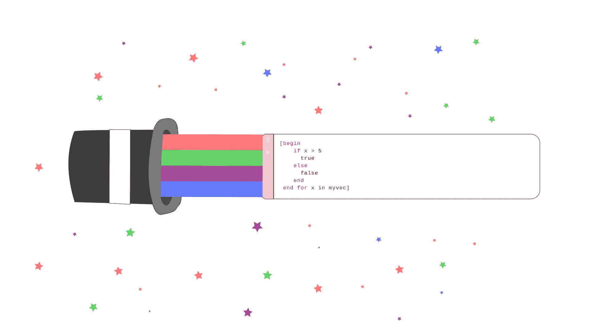

# Julia 魔法——鲜为人知的奥秘

> 原文：[`towardsdatascience.com/julia-magic-too-few-people-know-about-330a7039a11a?source=collection_archive---------3-----------------------#2023-10-15`](https://towardsdatascience.com/julia-magic-too-few-people-know-about-330a7039a11a?source=collection_archive---------3-----------------------#2023-10-15)

## Julia 编程语言的一些鲜为人知的能力。

 [Emma Boudreau](https://emmaccode.medium.com/?source=post_page-----330a7039a11a--------------------------------)

·

[关注](https://medium.com/m/signin?actionUrl=https%3A%2F%2Fmedium.com%2F_%2Fsubscribe%2Fuser%2Fea170050148c&operation=register&redirect=https%3A%2F%2Ftowardsdatascience.com%2Fjulia-magic-too-few-people-know-about-330a7039a11a&user=Emma+Boudreau&userId=ea170050148c&source=post_page-ea170050148c----330a7039a11a---------------------post_header-----------) 发表在 [Towards Data Science](https://towardsdatascience.com/?source=post_page-----330a7039a11a--------------------------------) ·10 分钟阅读·2023 年 10 月 15 日

--

（图片来源：作者）

## 介绍

就编程语言及其范式而言，Julia 的处理方式极为独特。与今天流行的众多其他多范式编程语言相比，Julia 在许多方面都有显著的不同。特别是在范式方面，或语言中的类型（用于存储数据）如何与语言中的函数或方法协作方面。有许多不同的解决方案被提出，每种语言通常都处于一个范畴——虽然不一定非常固定。大多数现代语言通过这些范式桥接了多种编程概念，这使得大多数现代编程语言都是多范式的。在这个框架下，Julia 语言也包括在内。

尽管 Julia 是一种多范式编程语言，但它建立在围绕多重分派的独特范式上。这并不是说这种范式完全新颖，这种范式的基础可以在标准元语言（SML）中找到。实际上，因为 Julia，我曾经回去尝试过那个语言——这是一段非常有趣的经历，如果你想了解更多发生了什么，这里有一个链接到那篇文章：
