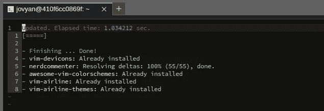
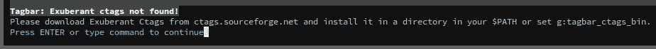
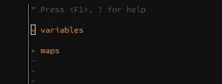
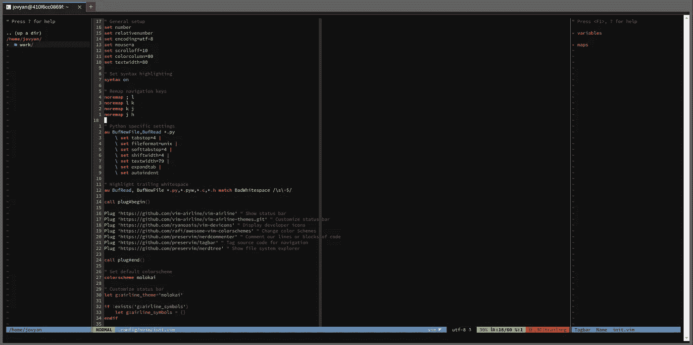
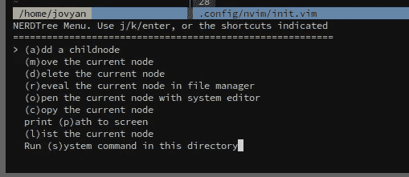

# Jupyter 已经拥有一个完美的文本编辑器：构建一个 Python IDE

> 原文：[`towardsdatascience.com/jupyter-already-has-a-perfect-text-editor-building-a-python-ide-20063044749b`](https://towardsdatascience.com/jupyter-already-has-a-perfect-text-editor-building-a-python-ide-20063044749b)

## 让 Jupyter 成为你的全能 IDE，提升你的 Python 开发体验

[](https://dpoulopoulos.medium.com/?source=post_page-----20063044749b--------------------------------)[](https://towardsdatascience.com/?source=post_page-----20063044749b--------------------------------) [Dimitris Poulopoulos](https://dpoulopoulos.medium.com/?source=post_page-----20063044749b--------------------------------)

·发表于[Towards Data Science](https://towardsdatascience.com/?source=post_page-----20063044749b--------------------------------) ·阅读时间 6 分钟·2023 年 3 月 8 日

--


图片由[Fotis Fotopoulos](https://unsplash.com/@ffstop?utm_source=medium&utm_medium=referral)提供，来源于[Unsplash](https://unsplash.com/?utm_source=medium&utm_medium=referral)。

> *本文是系列的第三部分。查看完整系列：* *第一部分**,* *第二部分*, *第四部分**.*

在系列的前几部分中，我们讨论了为什么许多开发者不认为 Jupyter 是一个完全整合的开发环境，以及缺乏一个强大的文本编辑器是主要原因之一。

因此，我们决定将 JupyterLab 视为一个可以从零开始创建我们自己的 Python IDE 的平台。将相同的理念扩展到其他编程语言仅需一次 Google 搜索。

为此，我们使用了 JupyterLab 的终端模拟器来安装 Neovim，并使其表现和外观类似于 VS Code。这样，我们可以构建一个 docker 镜像来打包整个工作空间，按我们的喜好进行定制。这个想法超越了 JupyterLab 和 Neovim。我们可以拥有一个配置好的工作环境，包括 Git 进行版本控制，pyenv 创建虚拟环境，以及 tmux 进行终端模拟。

在系列的前两部分中，我们安装了 Neovim，学习了我们的 Vim 绑定，并配置了编辑器的外观和基本设置。今天，我们将安装几个插件，使我们的文本编辑器更像一个 IDE。免得我们忘记，以下图片是我们最终目的地的“明信片”：


作者提供的图片

开始吧！

> [学习率](https://www.dimpo.me/newsletter)是一个针对对 ML 和 MLOps 世界感兴趣的人的新闻通讯。如果你想了解更多这样的主题，可以[在这里](https://www.dimpo.me/newsletter)订阅。每个月的最后一个星期日你将收到我的更新和对最新 MLOps 新闻及文章的思考！

# 基本插件

当你首次安装 Neovim 时，一些流行编辑器（如 VS Code）自带的功能是缺失的。但不用担心，社区已经构建了几乎所有你能想到的功能，并且通常很容易设置。

在上一篇文章中，我们看到如何为 Neovim 设置插件管理器，以便在安装插件时让我们的生活更轻松。现在，安装新插件的过程通常是：

1.  在`init.vim`配置文件中添加插件名称

1.  重启文本编辑器

1.  运行`:PlugInstall` Neovim 命令

1.  重启文本编辑器以应用新的插件

## NERDCommenter

掌握了这些知识后，让我们安装第一个插件——`[nerdcommenter](https://github.com/preservim/nerdcommenter)`。`nerdcommenter`是一个相对简单的插件，功能是注释或取消注释多行内容。要安装它，请在你的 Neovim 配置文件中添加以下行：

```py
https://github.com/preservim/nerdcommenter
```

如果你正在跟随这个系列（你应该这样做），那么你的`init.vim`文件现在应该是这样的：

```py
" General setup
set number
set relativenumber
set encoding=utf-8
set mouse=a
set scrolloff=10
set colorcolumn=80
set textwidth=80

" Set syntax highlighting
syntax on

" Remap navigation keys
noremap ; l
noremap l k
noremap k j
noremap j h

" Python specific settings
au BufNewFile,BufRead *.py
    \ set tabstop=4 |
    \ set fileformat=unix |
    \ set softtabstop=4 |
    \ set shiftwidth=4 |
    \ set textwidth=79 |
    \ set expandtab |
    \ set autoindent

" Highlight trailing whitespace
au BufRead, BufNewFile *.py,*.pyw,*.c,*.h match BadWhitespace /\s\+$/ 

call plug#begin()

Plug 'https://github.com/vim-airline/vim-airline' " Show status bar
Plug 'https://github.com/vim-airline/vim-airline-themes.git' " Customize status bar
Plug 'https://github.com/ryanoasis/vim-devicons' " Display developer icons
Plug 'https://github.com/rafi/awesome-vim-colorschemes' " Change color Schemes

call plug#end()

" Set default colorscheme
colorscheme molokai

" Customize status bar
let g:airline_theme='molokai'

if !exists('g:airline_symbols')
    let g:airline_symbols = {}
endif

" airline symbols
let g:airline_symbols.branch = ''
let g:airline_symbols.readonly = ''
let g:airline_symbols.maxlinenr = ''
```

为了避免再次复制粘贴整个文件，请记住每次添加新插件时，我们总是将其添加在`call plug#begin()`和`call plug#end()`指令之间。

接下来，重启编辑器并运行 Neovim 的`:PlugInstall`命令。你应该看到`vim-plug`（我们使用的插件管理器）安装了`nerdcommenter`工具以及其他插件：



作者提供的图片

你可以设置很多选项来决定`nerdcommenter`的行为，但我喜欢对像这样的简单插件保持简单。可能你应该记住的唯一快捷键是：

```py
<leader>c<space>
```

这个快捷键执行了`NERDCommenterToggle`命令。通常，`<leader>`键是正斜杠字符（`\`）。因此，要测试插件，选择多行并按`Shift + V`（Vim 的可视模式——学习你的 Vim 绑定！）然后按`\ + c + n`。

我说过我们要对这个插件保持简单。不过，有一个配置我喜欢设置：默认在注释分隔符后添加空格。因此，让我们在`init.vim`文件的末尾添加以下行，并重启编辑器以使其生效：

```py
" Customize NERDCommenter
let g:NERDSpaceDelims = 1 " Add spaces after comment delimiters by default
```

## Tagbar

[Tagbar](https://github.com/preservim/tagbar)是一个用于 Vim/Neovim 的代码大纲查看器。当处理包含多行代码的文件时，大纲查看器总是很方便。

要安装 Tagbar，请在 Neovim 配置文件中添加以下行，并按照通常的插件安装过程进行：

```py
Plug 'https://github.com/preservim/tagbar' " Tag source code for navigation
```

不过，当你尝试用`TagbarToggle`命令切换轮廓查看器时，你会收到这个警告：



图片作者

这是一个需要其他工具才能正常工作的插件。在这种情况下，错误信息表示它需要一个名为`exuberant-ctags`的包。因此，让我们先安装它：

```py
sudo apt update && sudo apt install exuberant-ctags
```

现在，我们可以重新启动编辑器，运行`:TagbarToggle`命令，一切应该能顺利运行：



作者提供的图片

好吧，我承认这不是最性感的轮廓，但等我们开始打开大型 Python 文件时再看看吧！

## NERDTree

另一个我们将详细探讨的有用插件是`[NERDTree](https://github.com/preservim/nerdtree)`。这个插件添加了一个文件浏览器，是开始使用全新 Neovim 安装时的首选插件之一。像往常一样，将以下行添加到你的配置文件中：

```py
Plug 'https://github.com/preservim/nerdtree' " Show file system explorer
```

安装插件后，你可以通过`:NERDTreeToggle`命令来使用它：



作者提供的图片

看起来我们越来越接近目标了！现在，`NERDTree`可以做很多事情，但我最喜欢的是它如何通过按`m`来操作文件系统。这样，你可以轻松地管理文件和文件夹，而无需离开文本编辑器：



作者提供的图片

## 在窗格之间导航

既然我们有了启动新窗格的插件，我们必须找到在它们之间导航的方法。为此，我喜欢使用以下配置：

```py
" Use ctrl-[jkl;] to select the active split
nmap fl :wincmd k<cr>
nmap fk :wincmd j<cr>
nmap fj :wincmd h<cr>
nmap f; :wincmd l<cr>
```

将这些添加到你的`init.vim`文件中，将允许你使用关键词`f`和标准 Vim 导航键来切换窗格（尽管我们已经重新映射了这些键）。

## 荣誉提名

我会给你推荐另外两个你可能想尝试的插件：

+   [vim-surround](https://github.com/tpope/vim-surround)

+   [fzf 模糊查找器](https://github.com/junegunn/fzf)

它们的名称都是自解释的，所以你的作业是根据需要安装和配置它们。

像往常一样，为了保存进度，请使用`docker commit`命令，就像我们在上一篇文章中做的那样。你可以在[DockerHub](https://hub.docker.com/layers/dpoulopoulos/jupyter/v0.0.2/images/sha256-eb969b56d5e83a60d45860a33e56e4ba79059329601370e0427028cb7935e19d?context=repo)找到我的镜像。

在下一篇文章中，我们将开始处理自动补全和格式化！

# 关于作者

我叫[Dimitris Poulopoulos](https://www.dimpo.me/?utm_source=medium&utm_medium=article&utm_campaign=neovim-core-plugins)，是一名为[Arrikto](https://www.arrikto.com/)工作的机器学习工程师。我为包括欧洲委员会、Eurostat、国际货币基金组织、欧洲中央银行、经济合作与发展组织和宜家在内的主要客户设计和实施了人工智能和软件解决方案。

如果你对阅读更多关于机器学习、深度学习、数据科学和数据操作的帖子感兴趣，请在[Medium](https://towardsdatascience.com/medium.com/@dpoulopoulos/follow)、[LinkedIn](https://www.linkedin.com/in/dpoulopoulos/)或在 Twitter 上关注[@james2pl](https://twitter.com/james2pl)。

所表达的观点完全是我个人的意见，不代表我的雇主的观点或意见。
