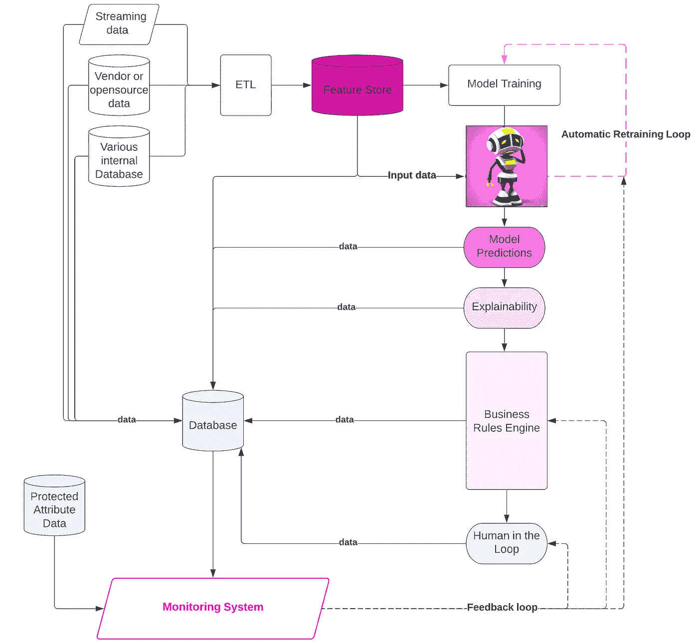
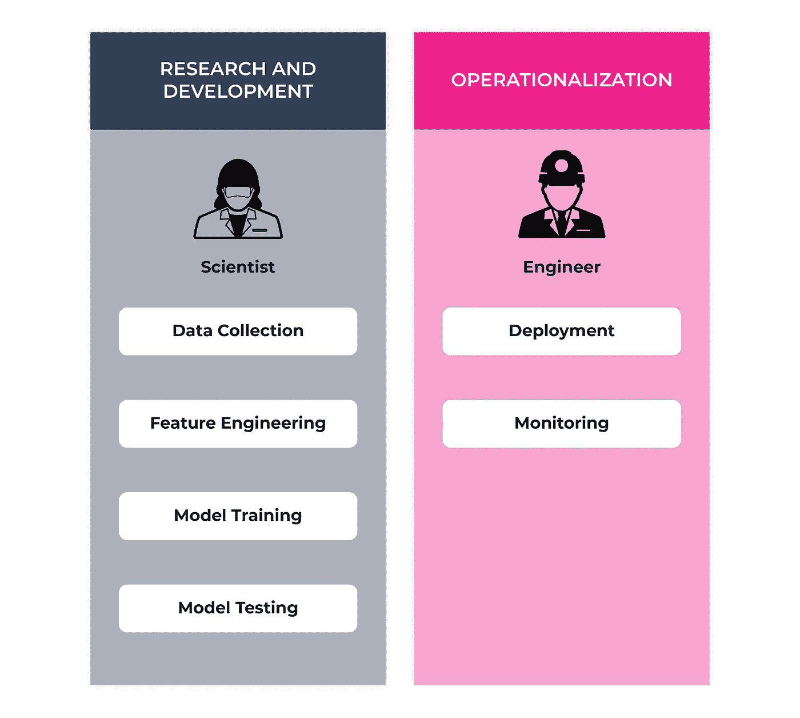

# 让机器人不偏离伦理轨道

> 原文：[`towardsdatascience.com/keeping-robots-from-going-off-the-ethical-rails-7dc089b53917?source=collection_archive---------16-----------------------#2023-04-13`](https://towardsdatascience.com/keeping-robots-from-going-off-the-ethical-rails-7dc089b53917?source=collection_archive---------16-----------------------#2023-04-13)

图片由作者使用 Dall-E 2 创建

## 构建透明的 AI 软件系统的关键

 [Claire Longo](https://statistician-in-stilettos.medium.com/?source=post_page-----7dc089b53917--------------------------------)

·

[关注](https://medium.com/m/signin?actionUrl=https%3A%2F%2Fmedium.com%2F_%2Fsubscribe%2Fuser%2F1f6936fe85bb&operation=register&redirect=https%3A%2F%2Ftowardsdatascience.com%2Fkeeping-robots-from-going-off-the-ethical-rails-7dc089b53917&user=Claire+Longo&userId=1f6936fe85bb&source=post_page-1f6936fe85bb----7dc089b53917---------------------post_header-----------) 发表在 [Towards Data Science](https://towardsdatascience.com/?source=post_page-----7dc089b53917--------------------------------) · 8 min 阅读 · 2023 年 4 月 13 日

--

AI 算法是一种具有自动化或执行通常需要人类智能的任务能力的软件系统。这些系统通常不仅仅包括一个训练好的模型。它们还可能包括明确的算法功能，例如业务规则，将模型的输出整合到更大的 AI 系统中，以完成端到端的任务。

为了正确实施伦理 AI 系统，用于部署模型的软件必须具备从端到端测量和缓解实时算法行为的能力。通过有意地构建审计 AI 的方法，我们可以确保好的机器人不会偏离轨道——如果发生偏离，我们将有工具来进行纠正。

# 伦理 AI 软件基础设施

那么，要将伦理融入 AI 的软件基础设施中需要什么？我们如何预先设计这些系统以确保能够审计 AI 模型的偏差？

一个真正可审计的 AI 系统应具备足够的透明度，以便用户和创作者可以回答“*数据输入模型、预测结果、以及在输出被使用前对其进行的调整是什么？”* 如果发现偏差或质量问题，可以利用伦理 AI 系统中的杠杆来缓解任何偏差或纠正出现的质量问题。

可审计的 AI 系统设计（作者绘图）

该提议的系统设计是一个通用基础设施，可适用于许多依赖实时 AI 的业务用例。

该设计提供了核心功能，确保模型以负责任、伦理和无偏的方式运行。它包括：

+   一个**数据收集系统**，覆盖所有系统生成的数据

+   一个**指标和监控系统**，用于跟踪模型性能和实时模型中的偏差，以提供数据和模型 ML 可观测性。

+   **多个杠杆来缓解潜在的偏差：** 一个针对性的模型再训练循环，用于更新模型以获得更好的数据，补充一个用于编程明确逻辑的规则引擎，例如模型覆盖或偏差缓解，以及一个人机交互的质量检查系统。

# 数据收集

完全审计 AI 系统所需的数据量非常庞大。它包括：

+   特性（模型输入）

+   预测（模型输出）

+   SHAP 或某种特征重要性表示，以提供逐点预测解释。这使我们能够追踪特定预测的原因。

+   任何用于增强预测的业务逻辑或规则

+   任何用于增强预测的人类决策

+   可以链接到预测以监控偏差的孤立人口数据

💡注意在此设计中保护的人口数据与系统隔离。这些数据仅用于测量模型性能以检测偏差，绝不应与模型输入混合，否则可能会导致偏差被编码到模型中。下面列出了一些核心属性需考虑。

作者绘图

# 偏差测量和监控

一旦收集了这些数据，指标和可视化工具可以用来量化和监控实时系统中的偏差趋势。需要考虑的标准公平性和偏差指标包括

+   召回率平衡：衡量模型对一个组与另一个组的“敏感性”或模型正确预测真实正类的能力。

+   假阳性率平衡：衡量模型在敏感组相对于基础组中错误预测正类的情况。

+   [差别影响](https://arize.com/blog-course/fairness-bias-metrics/#what-are-the-prevailing-model-fairness-metrics)：对受保护类别的不利待遇的定量度量

一个模型可能在平均水平上表现良好，但深入挖掘可以超越平均模型表现，隔离不同人口组的表现。按组分析准确性能提供模型对整体人群服务公平性的可见性。

# 偏见缓解

**规则引擎**，也称为基于规则的系统或专家系统，是一种使用预定义规则集来做决策或解决问题的算法。这些规则通常以 IF-THEN 语句表示，以结构化和有组织的方式捕捉领域特定的知识和专业技能。在实际 AI 应用中，模型预测通常会被输入到规则引擎中，围绕如何使用预测或如何增强预测进行业务决策。如果检测到偏见，可以编码新的规则来覆盖它。

许多 AI 系统包括一个自动化管道，用于收集新数据并在新数据上重新训练模型，以更新最新信息。这保持了模型的健康和性能。这种相同的重新训练循环可以用于从模型中去除偏见。可以以有针对性的方式收集重新训练数据，以专注于提供更多数据或更好的示例，让模型在失败的领域学习。

**人类在环**组件提供了在使用 AI 输出之前进行质量检查的能力。此功能也需要成为软件设计的一部分，以便可以收集人类决策数据，特别是在不能或不应该完全自动化的用例中。AI 通常在作为人类助手时最为有效，而不是一个完整的任务自动化工具。构建支持人类互动和决策的基础设施使我们能够在发现偏见或有害模式时进行覆盖。

# 等等，AI 中的偏见是什么？

那么，人工智能算法如何会有偏见、不公平或不道德呢？偏见通常不是硬编码的。它不是由软件工程师或数据科学家明确编写的。相反，算法通过扫描大量数据集自动学习。这些人工智能模型旨在从大量数据中学习模式，并将这些模式以数学方式编码。这些数学模式然后被保存为“模型”，用于对新数据进行推断。在这种范式下，这些模型如果提供的数据中存在有害和不公平的模式，就可能学习到这些有害的模式。它们会在预测时依赖这些模式，从而延续这些有害模式。由于互联网上的数据广泛存在，如果不加小心，旧的模式和历史偏见也可能被编码到这些模型中。

在考虑编码到人工智能算法中的模式时，有两种模式需要考虑。显式模式和隐式模式。显式模式是硬编码的规则。这些模式是组织的有意选择，通常表示为代码中的 IF-THEN 语句。隐式模式是模型从提供给它的数据中学习到的。

# 人工智能开发生命周期

为了进一步阐明这一讨论，了解**人工智能项目生命周期**的详细内容非常有帮助，以便了解可能引入偏见或质量问题的地方。人工智能项目生命周期有两个核心阶段：*研究与开发（R&D）*和*落地实施*。

作者提供的图示

## 研发阶段

作者使用 Dall-E 2 创建的图像

在研发阶段，科学家或研究人员致力于创建模型。他们收集原始数据，将数据转换为有意义的模型特征，实验和测试各种建模方法和参数，并根据优化特定结果的能力评估模型的性能。在这些步骤中，模型创建者会考虑许多因素来防止和测试模型中的偏见。他们努力收集无偏见的数据，并仔细测量模型在受保护人群中的表现，以确保公平。然而，偏见仍然可能渗入。因此，我们需要能够监控和跟踪模型上线后的行为。

## 落地实施阶段

作者使用 Dall-E 2 创建的图像

一旦模型创建完成，我们拥有了优良的机器人，项目将进入下一阶段——即将该优良机器人投入实际操作。这就是工程师的工作所在。这一开发阶段专注于将选定的模型转化为一个实用且功能齐全的系统，使最终用户可以访问、依赖并实时使用模型生成的预测。这个过程包括构建集成模型核心功能的软件系统，并遵循生产代码的最佳实践，确保系统具有可扩展性和可维护性。这是设计伦理人工智能的关键环节。该系统不仅可以基于模型生成预测，还可以在设计时考虑伦理人工智能来保护这些算法。

[可审计的人工智能系统](https://arize.com/blog-course/transparent-ethical-ai-software-systems/)从模型本身以及与模型输出使用相关的明确决策模式中收集数据。这使得能够全面了解算法的行为，并促进对整个系统的监控。

算法透明度应当在任何人工智能系统设计的最前沿。这意味着衡量和减轻偏见的能力需要融入软件中，而不是事后的考虑。如果部署的算法存在潜在的偏见而没有这些机制，将很难检测和纠正任何有害的模式。

# 结论

很可能许多人工智能系统在某个时点需要被审计，无论是为了偏见，还是仅仅为了可解释性或质量。通过深思熟虑地设计提供足够数据可见性和算法改进机会的基础设施，可以提前应对这个问题。让我们保持这些机器人不偏离轨道。

对这个主题的深入阅读，以下是我最喜欢的一些关于伦理人工智能的书籍和资源：

+   [伦理算法的总结与评论](https://hackernoon.com/a-summary-and-review-of-the-ethical-algorithm)

+   [隐形女性：一个为男性设计的世界中的数据偏见](https://carolinecriadoperez.com/book/invisible-women/) 由**卡罗琳·克里亚多-佩雷斯**撰写

+   [数学毁灭武器](https://www.penguinrandomhouse.com/books/241363/weapons-of-math-destruction-by-cathy-oneil/) 由**凯西·奥尼尔**撰写

+   [伦理机器：完全无偏见、透明且尊重的人工智能简明指南](https://www.reidblackman.com/ethical-machines/) 由**里德·布莱克曼**撰写
