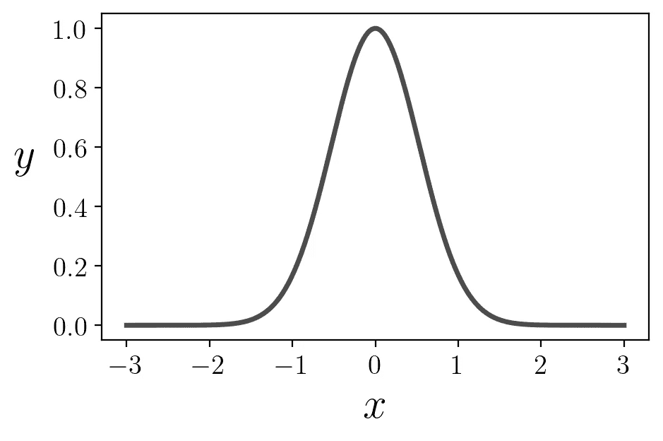
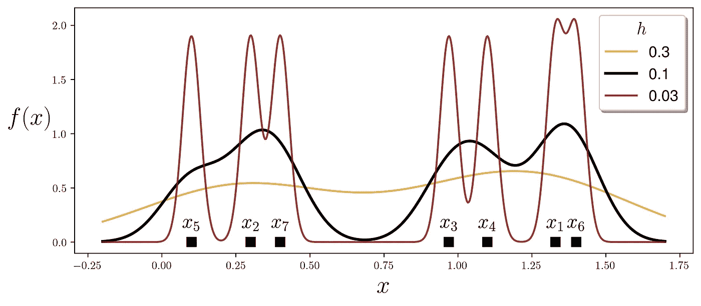

# 核密度估计逐步讲解

> 原文：[`towardsdatascience.com/kernel-density-estimation-explained-step-by-step-7cc5b5bc4517?source=collection_archive---------0-----------------------#2023-08-15`](https://towardsdatascience.com/kernel-density-estimation-explained-step-by-step-7cc5b5bc4517?source=collection_archive---------0-----------------------#2023-08-15)

## KDE 公式的直观推导

[](https://medium.com/@jaroslaw.drapala?source=post_page-----7cc5b5bc4517--------------------------------)[](https://towardsdatascience.com/?source=post_page-----7cc5b5bc4517--------------------------------) [Jaroslaw Drapala](https://medium.com/@jaroslaw.drapala?source=post_page-----7cc5b5bc4517--------------------------------)

·

[关注](https://medium.com/m/signin?actionUrl=https%3A%2F%2Fmedium.com%2F_%2Fsubscribe%2Fuser%2Fce6da4a69810&operation=register&redirect=https%3A%2F%2Ftowardsdatascience.com%2Fkernel-density-estimation-explained-step-by-step-7cc5b5bc4517&user=Jaroslaw+Drapala&userId=ce6da4a69810&source=post_page-ce6da4a69810----7cc5b5bc4517---------------------post_header-----------) 发表在 [Towards Data Science](https://towardsdatascience.com/?source=post_page-----7cc5b5bc4517--------------------------------) ·7 min read·2023 年 8 月 15 日[](https://medium.com/m/signin?actionUrl=https%3A%2F%2Fmedium.com%2F_%2Fvote%2Ftowards-data-science%2F7cc5b5bc4517&operation=register&redirect=https%3A%2F%2Ftowardsdatascience.com%2Fkernel-density-estimation-explained-step-by-step-7cc5b5bc4517&user=Jaroslaw+Drapala&userId=ce6da4a69810&source=-----7cc5b5bc4517---------------------clap_footer-----------)

--

[](https://medium.com/m/signin?actionUrl=https%3A%2F%2Fmedium.com%2F_%2Fbookmark%2Fp%2F7cc5b5bc4517&operation=register&redirect=https%3A%2F%2Ftowardsdatascience.com%2Fkernel-density-estimation-explained-step-by-step-7cc5b5bc4517&source=-----7cc5b5bc4517---------------------bookmark_footer-----------)

图片由 [Marcus Urbenz](https://unsplash.com/@marcusurbenz?utm_source=medium&utm_medium=referral) 提供，来源于 [Unsplash](https://unsplash.com/?utm_source=medium&utm_medium=referral)

# 介绍

为了感知数据分布，我们绘制概率密度函数（PDF）。当数据很好地符合常见的密度函数（例如正态分布、泊松分布、几何分布等）时，我们会感到满意。然后，可以使用 [最大似然方法](https://medium.com/@roiyeho/maximum-likelihood-855b6df92c43) 将密度函数拟合到数据上。


不幸的是，数据分布有时过于不规则，并不像任何常见的 PDF。在这种情况下，核密度估计器（KDE）提供了一种合理且视觉上愉悦的数据分布表示。


我将带你了解构建 KDE 的步骤，依靠你的直觉，而不是严格的数学推导。

# 核函数

理解 KDE 的关键是把它当作**由构建块组成的函数**，类似于不同的物体由乐高砖块构成。KDE 的独特之处在于它仅使用**一种砖块，称为核函数**（‘*一个砖块统治所有*’）。这种砖块的关键特性是能够移动和伸缩/收缩。**每个数据点都有一个砖块，KDE 是所有砖块的总和**。

> KDE 是由一种构建块组成的复合函数，称为核函数。
> 
> 核函数是对每个数据点单独评估的，这些部分结果被求和形成 KDE。

对 KDE 的第一步是仅关注一个数据点。如果让你为一个单一的数据点创建 PDF，你会怎么做？首先，取*x =* 0。最合逻辑的方法是使用一个在该点上正好峰值并随着距离衰减的 PDF。函数


这样就可以解决问题。



然而，由于 PDF 应该在曲线下具有单位面积，我们必须对结果进行重新缩放。因此，该函数必须除以 2*π*的平方根，并通过√2 进行伸缩（[3Blue1Brown](https://www.youtube.com/watch?v=cy8r7WSuT1I)提供了这些因素的优秀推导）：


最终，我们得到我们的乐高砖块，称为*核函数*，它是一个有效的 PDF：


这个核函数相当于均值为零、方差为单位的高斯分布。

我们先玩一会儿。我们将从学习如何沿* x *轴移动它开始。

取一个数据点*xᵢ -* 我们数据集*X*中的第*i*个点。通过减去参数可以实现平移：


为了使曲线更宽或更窄，我们只需在参数中加入一个常数*h*（即所谓的核带宽）。它通常作为分母引入：


然而，核函数下的面积因此乘以*h*。因此，我们必须通过除以*h*将其恢复到单位面积：


你可以选择任何*h*值。以下是它如何工作的一个示例。


*h* 越大，PDF 越宽。*h* 越小，PDF 越窄。

# 核密度估计器

考虑一些虚拟数据，以查看如何将方法扩展到多个点。

```py
# dataset
x = [1.33, 0.3, 0.97, 1.1, 0.1, 1.4, 0.4]

# bandwidth
h = 0.3
```

对于第一个数据点，我们简单使用：


我们可以对第二个数据点做同样的操作：


为了得到前两个点的单一 PDF，我们必须将这两个单独的 PDF 结合起来：


因为我们添加了两个单位面积的 PDF，所以曲线下的面积变为 2。为了恢复到 1，我们将其除以 2：


尽管可以使用函数 *f* 的完整签名以提高精度：


我们将只使用 *f*(*x*) 以使符号更加简洁。

这就是它对两个数据点的工作方式：


KDE 的最终步骤是考虑 *n* 个数据点


核密度估计器是：


让我们来享受一下重新发现的 KDE。

```py
import numpy as np
import matplotlib as plt

# the Kernel function
def K(x):
    return np.exp(-x**2/2)/np.sqrt(2*np.pi)

# dummy dataset
dataset = np.array([1.33, 0.3, 0.97, 1.1, 0.1, 1.4, 0.4])

# x-value range for plotting KDEs
x_range = np.linspace(dataset.min()-0.3, dataset.max()+0.3, num=600)

# bandwith values for experimentation
H = [0.3, 0.1, 0.03]
n_samples = dataset.size

# line properties for different bandwith values
color_list = ['goldenrod', 'black', 'maroon']
alpha_list = [0.8, 1, 0.8]
width_list = [1.7,2.5,1.7]

plt.figure(figsize=(10,4))
# iterate over bandwith values
for h, color, alpha, width in zip(H, color_list, alpha_list, width_list):
    total_sum = 0
    # iterate over datapoints
    for i, xi in enumerate(dataset):
        total_sum += K((x_range - xi) / h)
        plt.annotate(r'$x_{}$'.format(i+1),
                     xy=[xi, 0.13],
                     horizontalalignment='center',
                     fontsize=18,
                    )
    y_range = total_sum/(h*n_samples)
    plt.plot(x_range, y_range, 
             color=color, alpha=alpha, linewidth=width, 
             label=f'{h}')

    plt.plot(dataset, np.zeros_like(dataset) , 's', 
             markersize=8, color='black')

plt.xlabel('$x$', fontsize=22)
plt.ylabel('$f(x)$', fontsize=22, rotation='horizontal', labelpad=20)
plt.legend(fontsize=14, shadow=True, title='$h$', title_fontsize=16)
plt.show()
```



这里我们使用高斯核，但我鼓励你尝试其他核。有关常见核函数家庭的回顾，请参见 [这篇论文](https://www.scirp.org/pdf/ojapps_2013012216494836.pdf)。然而，当数据集足够大时，核的类型对最终输出没有显著影响。

# 使用 Python 库的 KDE

[seaborn 库](https://seaborn.pydata.org/generated/seaborn.kdeplot.html)利用 KDE 提供了数据分布的优美可视化。

```py
import seaborn as sns
sns.set()

fig, ax = plt.subplots(figsize=(10,4))

sns.kdeplot(ax=ax, data=dataset, 
            bw_adjust=0.3,
            linewidth=2.5, fill=True)

# plot datapoints
ax.plot(dataset, np.zeros_like(dataset) + 0.05, 's', 
        markersize=8, color='black')
for i, xi in enumerate(dataset):
    plt.annotate(r'$x_{}$'.format(i+1),
                 xy=[xi, 0.1],
                 horizontalalignment='center',
                 fontsize=18,
                )
plt.show()
```


Scikit learn 提供了 [KernelDensity](https://scikit-learn.org/stable/modules/generated/sklearn.neighbors.KernelDensity.html) 函数来完成类似的工作。

```py
from sklearn.neighbors import KernelDensity

dataset = np.array([1.33, 0.3, 0.97, 1.1, 0.1, 1.4, 0.4])

# KernelDensity requires 2D array
dataset = dataset[:, np.newaxis]

# fit KDE to the dataset
kde = KernelDensity(kernel='gaussian', bandwidth=0.1).fit(dataset)

# x-value range for plotting KDE
x_range = np.linspace(dataset.min()-0.3, dataset.max()+0.3, num=600)

# compute the log-likelihood of each sample
log_density = kde.score_samples(x_range[:, np.newaxis])

plt.figure(figsize=(10,4))
# put labels over datapoints
for i, xi in enumerate(dataset):
    plt.annotate(r'$x_{}$'.format(i+1),
                 xy=[xi, 0.07],
                 horizontalalignment='center',
                 fontsize=18)

# draw KDE curve
plt.plot(x_range, np.exp(log_density), 
         color='gray', linewidth=2.5)

# draw boxes representing datapoints
plt.plot(dataset, np.zeros_like(dataset) , 's', 
         markersize=8, color='black')

plt.xlabel('$x$', fontsize=22)
plt.ylabel('$f(x)$', fontsize=22, rotation='horizontal', labelpad=24)
plt.show()
```


Scikit learn 解决方案的优点在于它可以用作生成模型来生成合成数据样本。

```py
# Generate random samples from the model
synthetic_data = kde.sample(100)

plt.figure(figsize=(10,4))

# draw KDE curve
plt.plot(x_range, np.exp(log_density), 
         color='gray', linewidth=2.5)

# draw boxes representing datapoints
plt.plot(synthetic_data, np.zeros_like(synthetic_data) , 's', 
         markersize=6, color='black', alpha=0.5)

plt.xlabel('$x$', fontsize=22)
plt.ylabel('$f(x)$', fontsize=22, rotation='horizontal', labelpad=24)
plt.show()
```


# 结论

总结一下，KDE 使我们能够从任何数据创建一个视觉上吸引人的 PDF，而不需要对基础过程做任何假设。

KDE 的显著特点：

+   这是由单一类型的构建块组成的函数，称为**核函数**；

+   这是**非参数估计器**，这意味着它的功能形式由数据点决定；

+   生成的 PDF 的形状受到**核带宽** *h* 值的严重影响；

+   为了拟合数据集，**不需要优化技术**。

KDE 应用于多维数据是简单的。但这是另一个话题。

***除非另有说明，所有图片均由作者提供。***

# 参考文献

[1] S. Węglarczyk*,* [核密度估计及其应用](https://www.itm-conferences.org/articles/itmconf/pdf/2018/08/itmconf_sam2018_00037.pdf) (2018), ITM 网络会议，第 23 卷，EDP 科学出版社。

[2] Y. Soh, Y. Hae, A. Mehmood, R. H. Ashraf, I. Kim: 性能 [各种核密度估计函数的评估](https://www.scirp.org/pdf/ojapps_2013012216494836.pdf) (2013), 应用科学开放期刊，第 3 卷，第 58–64 页。
