# 内核：你需要了解的一切

> 原文：[`towardsdatascience.com/kernels-everything-you-need-to-know-f5d255d95785?source=collection_archive---------0-----------------------#2023-03-06`](https://towardsdatascience.com/kernels-everything-you-need-to-know-f5d255d95785?source=collection_archive---------0-----------------------#2023-03-06)

## 👨‍🏫 [数学](https://equipintelligence.medium.com/list/mathematics-demystified-7e4d1c18041f)

## 密度估计、点积、卷积及其他一切……

 [Shubham Panchal](https://equipintelligence.medium.com/?source=post_page-----f5d255d95785--------------------------------)

·

[关注](https://medium.com/m/signin?actionUrl=https%3A%2F%2Fmedium.com%2F_%2Fsubscribe%2Fuser%2Fd45a9465f044&operation=register&redirect=https%3A%2F%2Ftowardsdatascience.com%2Fkernels-everything-you-need-to-know-f5d255d95785&user=Shubham+Panchal&userId=d45a9465f044&source=post_page-d45a9465f044----f5d255d95785---------------------post_header-----------) 发表在 [Towards Data Science](https://towardsdatascience.com/?source=post_page-----f5d255d95785--------------------------------) ·14 min 阅读·2023 年 3 月 6 日

--

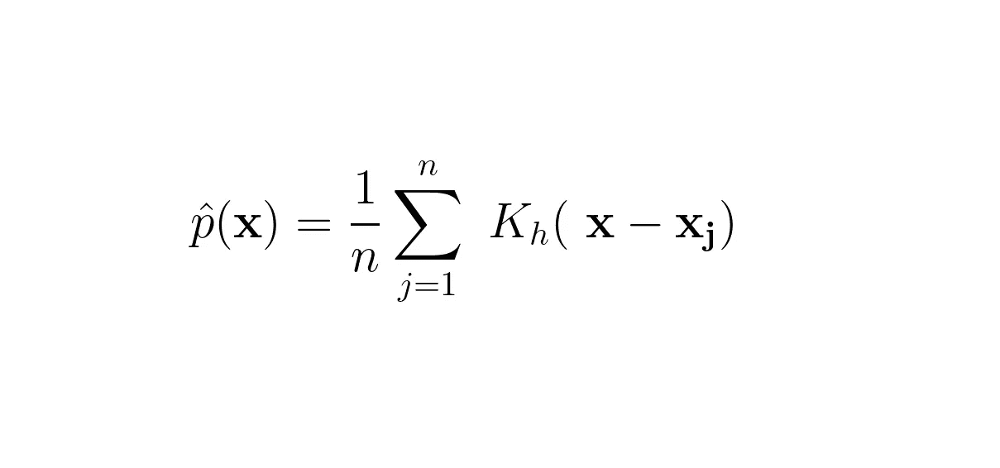

来源：作者提供的图片

内核或核函数是美丽的数学概念，用于机器学习和统计学中，形式各异。如果你是初学者，你可能会想知道内核的确切定义，但你可能会被互联网上各种博客/网站上解释的多种定义弄混。

核函数是一个令人困惑的概念，因为围绕它的知识在不同的应用中是分散的，缺乏一个将它们连接起来的常见直觉。这个（庞大的）博客旨在统一不同 ML 应用中使用的核函数的所有知识。就像大多数初学者一样，核函数让我困惑了很长时间，直到我培养出一种将所有环节连接起来的直觉。

我们从非参数模型开始我们的旅程，然后开始讨论不同类型的核函数及其在统计和机器学习中的典型应用。类似于核函数，我也尝试从数学角度解释 PCA，考虑所有的视角。你可以阅读一下：

 ## 主成分分析：你需要知道的一切

### 协方差、特征值、方差以及一切……

towardsdatascience.com

# 非参数模型

非参数模型是那些统计模型，它们的参数不会随着输入规模的增长而增加。需要注意的是，非参数模型并不是指‘*零参数模型*’，而是指它们使用的是一组固定的参数，也称为超参数，这些参数不会随着输入维度的增加而增加。一个简单的线性回归模型有参数***θ***，这些参数决定了超平面的*斜率*，其大小取决于输入***x***的维度。

方程 1\. 一个具有可调参数的简单线性回归模型，其参数大小取决于特征数**N**。函数**f**表示给定输入**x**的因变量**y**的期望值，即**E[y|x]**

接下来，考虑 KNN 模型，我们通过分析测试样本的***K***个最近邻的类别来确定测试样本的类别。如果***K = 1***，我们假设测试样本与最近邻属于同一类别。这个模型没有任何随着输入维度增加而增长的参数。对于一个简单的实现，即使在处理大规模输入（从维度角度看）时，我们也只需要一个单一的参数***K***。

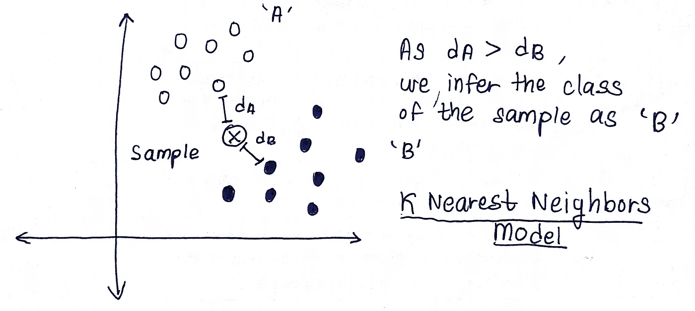

1\. K 最近邻模型工作原理的可视化描述。这里的假设是测试样本属于与 K 个最近邻相同的类别。图片来源：作者提供的图片

KNN 是一个非参数模型，它有一个由用户提供的超参数***K***。非参数模型乍一看可能是一个*明显的选择*，因为，

> 它们不对数据的分布做任何先验假设。例如，在*普通*线性回归中，它是一个参数模型，我们假设***Y***（因变量）在给定***X***（特征）的条件下服从高斯分布，其均值是特征的线性组合（其中权重是***θ***）和方差等于***σ²***。

2. 条件分布**Y**给定**X**和参数***θ*** *是一个正态分布，我们希望从***X***中捕捉均值*。常量方差是* [*同方差假设*](https://en.wikipedia.org/wiki/Homoscedasticity_and_heteroscedasticity) 的结果。

这可能并不总是成立，因为，

> 对于每个测试样本，他们需要将整个训练数据保存在内存中，这对 KNN 模型也是适用的。对于每个样本，我们需要计算它与每个训练样本的距离，因此我们需要检索/存储每个样本在内存中，这对于大型数据集甚至特征数量众多的小型数据集可能不可行。

非参数模型的基本思想是从数据中获取一些有用的见解，并用来解决给定的问题，而不通过可调参数对数据进行编码。

接下来，我们专注于核函数，它们在机器学习中有不同的使用场景，并且在每个上下文中稍有不同的含义。到目前为止，通过对这个博客的研究，以及我之前对核函数整体理解的尝试，我觉得核函数是提供给定数据点邻居信息的*机器*（作为*输入*提供给机器）。这些*局部*信息，即在考虑的数据点周围的邻近数据点的信息，然后用于解决给定的问题。一旦我们对每个数据点使用核函数，我们就能清楚地看到*数据局部的情况*。

我们将探讨核函数的这三个方面，它们是机器学习中具有主要应用的三个不同概念，

+   密度核函数

+   Mercer 核函数

+   图像处理中的核函数

# 密度核函数：用于密度估计的核函数

> 密度核函数、核密度估计、核回归

我们可以使用核函数通过用*训练*样本建模基础概率分布来估计给定*测试*样本的概率密度。‘测试’样本和‘训练’样本分别指未观测和已观测的样本，考虑到机器学习的术语。

对于连续随机变量***X***，我们可以在适当的范围内积分***X***的概率密度函数，比如从***x_1***到***x_2***，从而得到***X***在范围***[ x_1 , x_2 ]***内取值的概率。如果你对概率密度或随机变量的主题不太熟悉，这里是我关于概率分布的三部分系列，

## 密度核函数和核密度估计（KDE）

让我们从一个问题开始讨论。Panchal 博士住在一个拥挤的城市街区，四周都是房子。当地警方雇佣了一名侦探，其工作是确定博士家中居住的人数或其家属人数，以确保一切顺利。侦探不能按博士的门铃询问有多少家庭成员，因为这会警告博士如果有什么可疑的情况。

侦探会从 Panchal 博士房子的相邻房子开始询问，因为这些房子可以清楚地看到里面的情况。预计侦探会给予这些直接邻居的信息更高的权重/重要性。接下来，为了获得更多见解，侦探会询问那些稍微远离但可能对邻居有良好信息的房子。对于这些邻居提供的信息，侦探会给予较低的重要性，因为这些邻居的观察可能不如直接邻居（即邻近 Panchal 博士的房子）的观察准确。侦探会进行几轮这样的询问，逐渐减少重要性，远离 Panchal 博士的房子。

密度核函数类似于捕捉*邻近*点的信息。如果我们有一个数据集***D***，其中有***N***个样本，每个样本是一个实数，

上述代码片段中的核函数是一个 Epanechnikov（抛物线型）核函数。该核函数在这里具有一些特殊性质，

+   *性质 1*：核函数或侦探不在意 x 或某些邻居的房子位于哪个方向。来自右边两栋房子或左边两栋房子的获得的信息是相同的。

+   *性质 2*：核函数表示一个有效的概率密度函数（PDF），并且在整个实数域上积分为 1。

+   *性质 3*：核的支持是所有值***u***的集合，使得***K(u)***不等于 0。它表示侦探在从哪里收集信息时会给予一些非零的重要性。如果侦探决定在半径 5 公里内询问所有房屋，那么支持就是这个 5 公里圆圈内的所有房屋。

每种类型的核函数都会执行类似的任务来编码邻近信息，每种核函数会有不同的策略来实现这一点。与我们的侦探不同，他在离开 Panchal 博士的房子时逐渐减少了对询问的重视（高斯核会这样做），另一个侦探可能会继续对所有询问赋予相同的重要性，忽略到一定程度的距离（均匀核）。想象一下，从我们的数据集***D***来看，所有***x_i***的分布是，

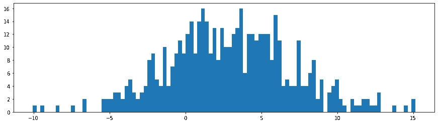

需要估计其概率密度的类似高斯分布

我们的目标是创建对 ***X*** 的概率分布的估计。我们通过在每个样本 ***x_i*** 处估计密度并使用核来收集邻近信息来实现这一目标。

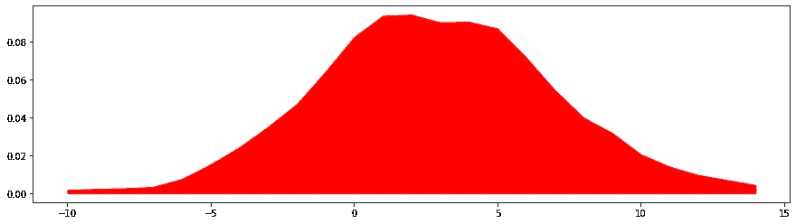

使用 KDE 估计概率密度

如果 ***x_i*** 离 ***x*** 较远，则 ***| x — x_i |*** 将有更大的值，从而使 ***K( x — x_i )*** 的值非常小，并减少 ***x_i*** 在确定 ***x*** 处的概率密度中的 *作用*。参数 ***h*** 是称为 *带宽* 的 *平滑参数*。***h*** 的值越大，预测的概率密度越平滑。

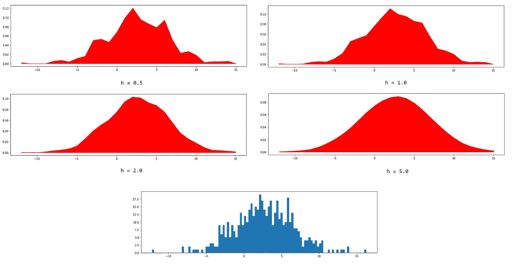

通过改变核的带宽获得的概率密度估计。最底部的图描绘了数据分布，通过增加核的带宽我们获得了更平滑的密度估计。这里用于估计的核是 **Epanechnikov/Parabolic** 核。

## 核回归

核回归是线性回归模型的非参数版本，我们在其中对结果变量的条件期望进行建模。在简单线性回归的情况下，我们通过将其表示为自变量的线性组合来直接建模条件期望 ***E[ Y | X ]***。这产生了一个判别模型，而核回归是一个生成模型，因为我们通过核密度估计建模联合概率分布 ***P( X , Y )*** 和 ***P( X )***。

推导一个没有额外参数的 **E[ Y | X ]** 估计量。在简单线性回归的情况下，**E[ Y | X ]** 将被建模为所有 **X_i** 的加权线性组合，其中权重是参数。

观察结果表达式时，你会发现预测结果 ***y_hat*** 是所有 ***y_i*** 的加权组合，其中权重由所有 ***x_i*** 的核函数值决定。

# 梅瑟核：高维空间中的点积

> 梅瑟核和正定性，梅瑟核在 SVM 中的应用

梅瑟核或正定核是将两个输入作为输入并产生一个实数的函数，该实数表征了这两个输入（或它们的高维表示）在某个其他空间中的接近度。事实证明，这些核在计算角度上很有用，因为它们帮助我们在高维空间中计算向量的点积，而无需显式地进行任何变换将我们的向量带入该高维空间。

## 梅瑟核

让我们通过定义核函数及其一些属性来开始讨论，

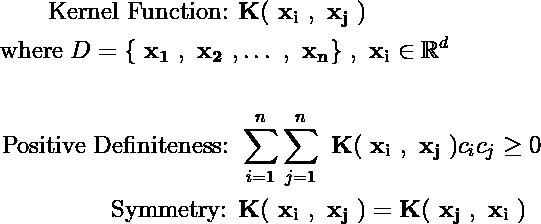

1.  Mercer 核是一个函数，它接受来自数据集***D***的两个数据点，并输出一个实数，表示这两个数据点在特征空间中的接近程度。

1.  如果我们在数据集***D***中有***n***个数据点，并对每对数据点应用 Mercer 核，并将结果输出整理成一个矩阵，我们会得到一个正定矩阵。这个矩阵描绘了数据点之间的相似性，称为 Gram 矩阵。

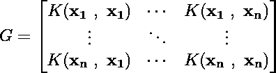

Gram 矩阵

正定矩阵因其谱属性而独特。它们具有正特征值，并且相应的特征向量形成一个正交规范基。对于 Mercer 核，我们有一个特殊的属性，可以使用该属性将核函数的值表示为两个转换向量的点积。

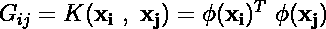

Gram 矩阵的每个条目可以描述为两个转换样本之间的点积。

可能会有一种直觉上的冲动去理解这个陈述，但它存在于 Hilbert 空间的神圣领域，需要另写一篇博客。目前，了解核函数的值可以用高维空间中两个向量的点积来描述，这是很好的。

Mercer 核提供了一种计算这两个高维向量之间点积的快捷方式，而无需显式计算这些向量。因此，我们可以利用高维空间的优势，这在机器学习中有时是有用的，特别是当样本不线性可分时。

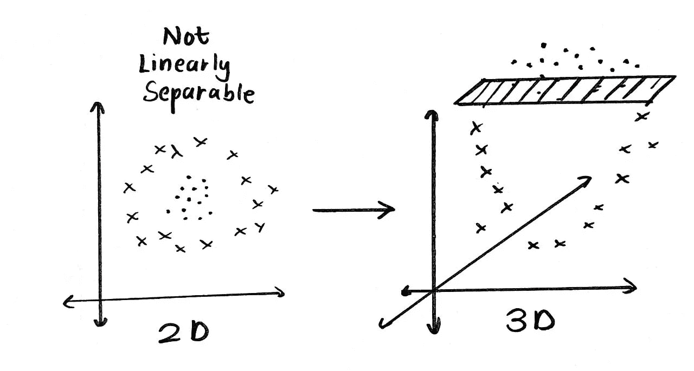

在低维空间中线性不可分的样本可能会在高维空间中找到一个最优的超平面。来源：作者图片

对于一些优化问题，如优化 SVM 时遇到的问题，我们需要计算两个高维向量之间的点积。使用核函数可以帮助我们轻松计算这个点积，而不需要对样本进行任何显式的转换。

# Mercer 核在 SVM 中的应用

SVM 是线性分类器，它通过拟合一个超平面，使得在两个类别的样本之间形成一个决策边界。为了确定最佳的超平面，即将样本划分为两个类别并最大化“边际”的超平面，我们需要解决一个包含目标函数（一个可以最大化或最小化的函数）以及一些约束条件的优化问题。

SVM 优化问题的推导在这些博客中得到了广泛的讨论，[Saptashwa Bhattacharyya](https://medium.com/u/9a3c3c477239?source=post_page-----f5d255d95785--------------------------------)的博客可以帮助我们进一步了解，

 ## 理解支持向量机：第二部分：核技巧；Mercer 定理

### 为什么使用核函数？

towardsdatascience.com

向量***w***和***b***描述了形成决策边界的超平面。支持向量之间的边际/宽度由下述第一个表达式给出。此外，我们会匹配 SVM 做出的预测与目标标签，更确切地说，就是***w.xi + b***和***yi***的符号。

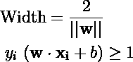

我们必须解决的优化问题是：

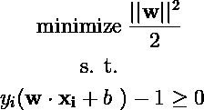

SVM 优化问题

我们通过拉格朗日乘数来解决这个优化问题，因此第一步是构建一个拉格朗日函数，并将其参数的偏导数设置为零。这将得到一个***w***的表达式，能够最小化拉格朗日函数。

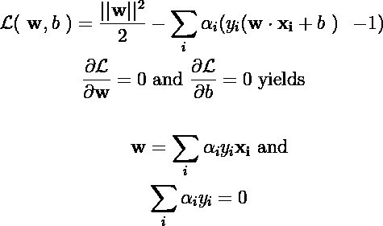

将拉格朗日函数的偏导数设置为零。

将这些结果代入拉格朗日函数后，我们得到一个清晰描述核函数作用的表达式。

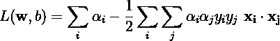

为了实现最佳超平面，我们需要计算数据集中样本对之间的点积。在某些情况下，找到一个最佳超平面是不可行的，因为样本可能不是线性可分的，即样本不能仅通过绘制一条线/平面来分成两个类别。我们可以通过增加样本的维度来发现一个分离超平面。

考虑一个特征映射***ϕ***，它将数据样本***x***转换为更高维度的特征，即***ϕ(x)***。在 SVM 的拉格朗日函数中，如果我们使用这些特征代替数据样本，我们需要计算

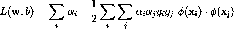

我们可以用一个核函数来替代特征的点积，该核函数对两个数据样本进行操作（而不是转换后的特征）。

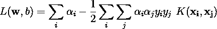

这种技术被广泛称为*核技巧*，是 Mercer 定理的直接结果。我们能够计算两个高维特征的点积，而无需显式地将数据样本转换到那个高维空间。随着维度的增加，我们在确定最佳超平面时具有更大的自由度。通过选择不同的核函数，可以控制特征所在空间的维度。

核函数具有更简单的表达式，如下所示，

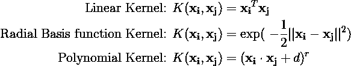

# 卷积的核: 图像处理

> 用于卷积和图像处理的核

核是固定大小的矩阵，用于在图像或特征图上卷积，以提取有用的信息。在图像处理中，核矩阵也称为卷积矩阵，用于对图像进行操作。每个核都有自己特定的操作，这在卷积后会改变图像。

## 卷积与核

卷积是一个数学算子，它接受两个函数并生成另一个函数。如果我们对两个函数或信号进行卷积，那么卷积的结果是一个表示两个函数之间重叠区域的函数。从数学上讲，卷积操作被定义为，

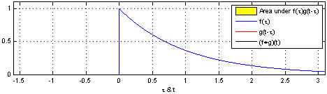

描述卷积操作的动画图，以及它的数学定义。这类似于在密度估计中进行的“核滑动”。我们将核滑过数据分布，收集“邻域信息”，然后在特定点估计密度。来源: [维基百科 — 卷积 (维基共享资源)](https://en.wikipedia.org/wiki/Convolution) — [CC BY-SA 3.0](https://creativecommons.org/licenses/by-sa/3.0/)

注意函数***g***在图上经过***x = 0***处墙壁时的卷积结果。结果突然变化并开始增加，这是由于***x = 0***周围邻域信息的变化。函数***g***，类似于我们在密度估计中研究的核，能够对核影响区域发生的变化做出反应。

从离散的角度来看，卷积操作是通过将核函数滑动到信号上，乘以信号和核的对应值，然后将所有这些乘积的总和放置到结果信号中来完成的。在数学意义上，考虑到离散信号的*求和*要比考虑连续信号上的*积分*更为合适。

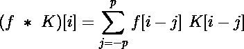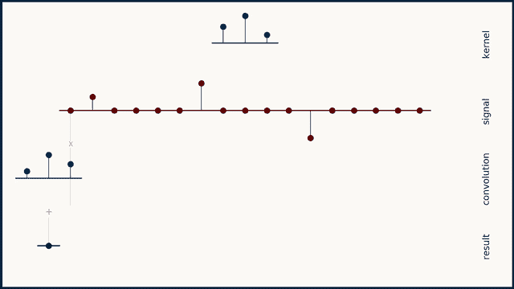

对一维离散信号执行卷积操作。上面的表达式显示了相同的数学公式。图像来源: [神经网络中的一维卷积 — Brandon Rohrer](https://e2eml.school/convolution_one_d.html)（创作共用许可证） — [CC0 1.0 Universal](https://creativecommons.org/publicdomain/zero/1.0/)

对于图像，我们将一个二维核滑动到给定的图像上并执行相同的操作。这里，核的运动将是二维的，与在一维信号上进行的一维（单向）核运动相对。输出将是一个矩阵，因为卷积操作也是在二维输入上执行的。

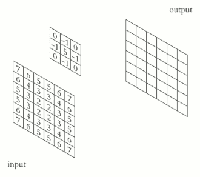

使用内核矩阵进行卷积。来源：[卷积 — 维基百科](https://en.wikipedia.org/wiki/Convolution)（创作共用许可证）— [CC BY-SA 3.0](https://creativecommons.org/licenses/by-sa/3.0/)

我们可以使用不同的内核从输入中提取各种特征或增强图像以进行进一步操作。例如，*锐化内核*会锐化图像中的边缘。许多其他内核在卷积过程中从图像中提取有趣的特征。

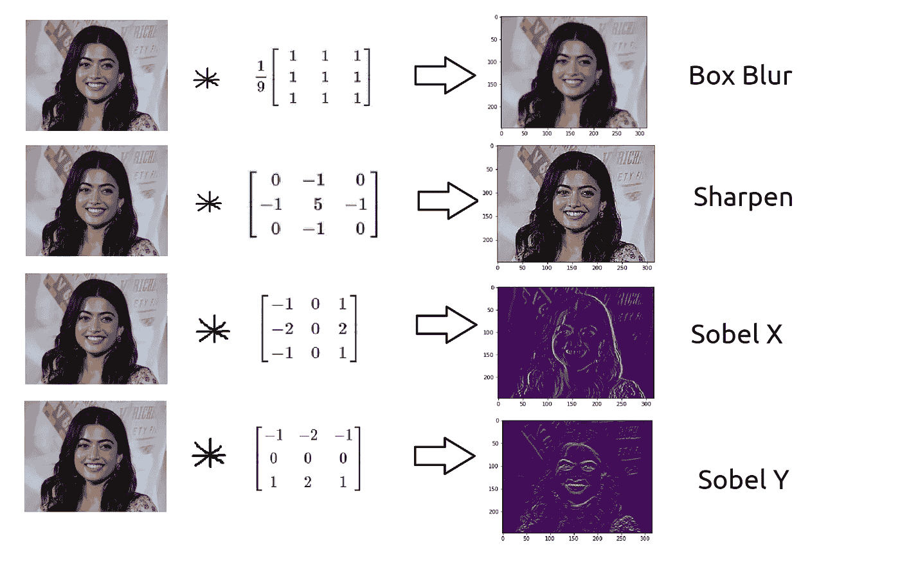

使用不同的内核在图像处理中执行卷积。来源：作者提供的图片

## CNN 中的内核

我们刚刚看到的内核是常量，但如果我们可以对内核进行参数化并控制提取哪些特征呢？这在卷积神经网络中会很有用，因为我们微调内核以最小化 NN 产生的整体损失。基于内核的非参数模型的概念在这里会减少，因为 CNN 可以拥有大量参数，但*邻域信息提取*的基本概念仍然有效。

这里的内核功能类似于*锐化*或 Sobel X 内核，但它将矩阵中的值视为参数，而不是固定的数字。这些可训练的内核通过反向传播进行优化，以减少 CNN 中的损失值。一个卷积层可以有许多这样的内核，统称为滤波器。

 ## 不，内核和滤波器并不相同

### 解决常见的混淆问题。

towardsdatascience.com 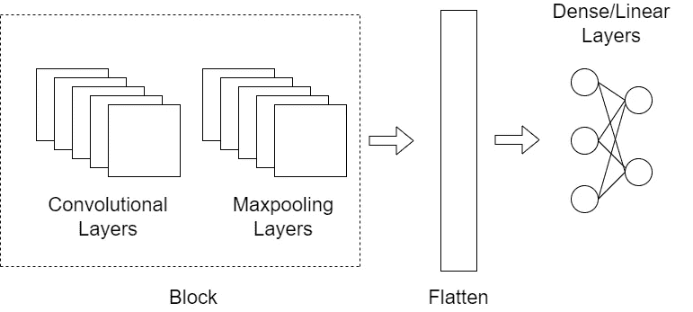

一个典型的卷积神经网络，包括最大池化和线性（全连接）层。卷积层和最大池化层从输入图像中提取特征，然后将这些特征传递给线性层。来源：作者提供的图片

第一个卷积层产生的输出传递到下一个层。这创建了一个分层特征提取过程，其中图像的低级特征由初始卷积层提取，高级特征则由最后的卷积层跟踪。这样的卷积堆栈与可训练的内核结合，使 CNN 能够以极高的精度识别图像中的物体，为现代计算机视觉开辟了新的领域。

# 结束

我希望这段关于内核世界的旅程能让你对这一概念感到着迷。内核在各种话题中经常引起混淆，但其核心思想始终如一，我们在博客中多次提到的就是*邻域特征提取*。与其使用参数捕捉数据中的模式，内核函数可以编码样本的相对接近度，从而捕捉数据中的趋势。然而，必须理解参数模型有其自身的优势，它们的使用并未过时。大多数神经网络模型是庞大的参数模型，具有数百万个参数，可以解决复杂的问题，如物体检测、图像分类、语音合成等。

> 除非另有说明，所有图像均由作者提供。
