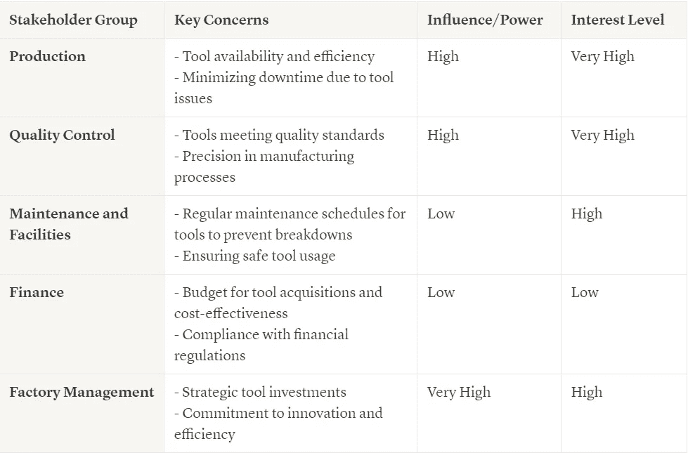
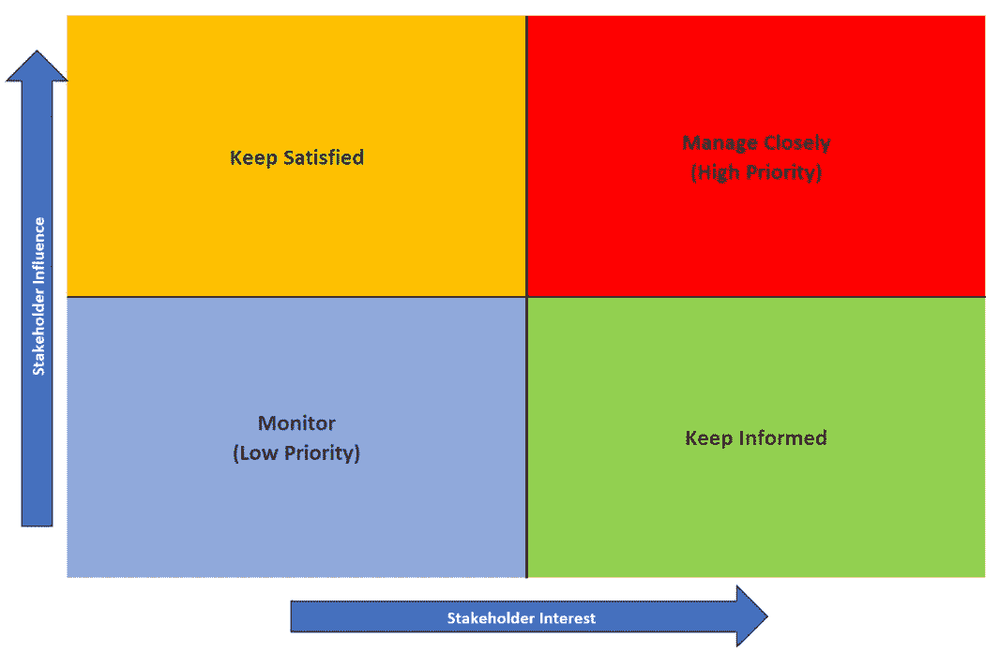
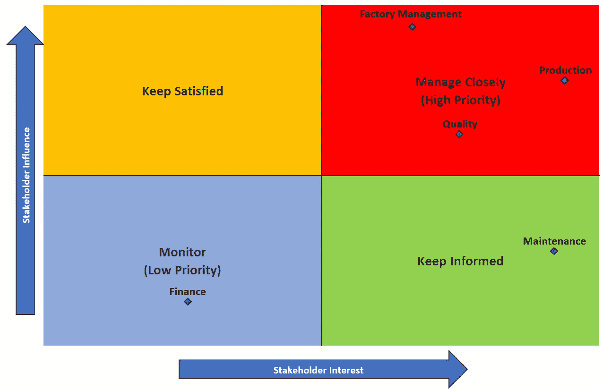

# 了解你的受众：技术演示准备指南

> 原文：[`towardsdatascience.com/know-your-audience-a-guide-to-preparing-for-technical-presentations-1a83fdb21050`](https://towardsdatascience.com/know-your-audience-a-guide-to-preparing-for-technical-presentations-1a83fdb21050)

## 一种结构化的方法来创建符合利益相关者需求和关注点的地址

 [John Lenehan](https://medium.com/@john_lenehan?source=post_page-----1a83fdb21050--------------------------------)

·发布在[Towards Data Science](https://towardsdatascience.com/?source=post_page-----1a83fdb21050--------------------------------) ·9 分钟阅读·2023 年 10 月 6 日

--

照片由[Wan San Yip](https://unsplash.com/@wansan_99?utm_source=medium&utm_medium=referral)拍摄，发布在[Unsplash](https://unsplash.com/?utm_source=medium&utm_medium=referral)上

将复杂话题有效地呈现给组织的能力是明显将数据专业人士与其他人区分开的技能。在处理复杂话题时，提炼复杂信息为清晰的解释至关重要，而这一努力的成功取决于弥合复杂性与理解之间的差距。这一点在讨论数据科学中的难题时尤为重要，例如深度学习算法、贝叶斯推断和降维（仅举几例）。

本文是关于准备演示材料系列中的第一篇文章，其中我将介绍我在创建演示文稿时用来将高层次主题转化为简单总结的策略和技巧。本系列将详细介绍我在考虑如何将演示文稿结构化以使其清晰、简洁和有效时所使用的各种方法。

照片由[Kristina Paparo](https://unsplash.com/@krispaparo?utm_source=medium&utm_medium=referral)拍摄，发布在[Unsplash](https://unsplash.com/?utm_source=medium&utm_medium=referral)上

我在这一系列中的建议可以分解为 3 个简单的原则，我在下面列出了这些原则：

1.  了解你的受众

1.  引导你的受众

1.  预期并准备回应

所有这些要点都是相互关联和相互依赖的——成功的演讲将结合所有三个要点，使观众能够理解你的关键信息，获取与他们相关的信息，并以令人满意的方式回答他们的问题和关切。掌握这三个关键指南，你可以确保技术演讲的成功。

在这篇文章中，我将重点讨论第一个指南——如何对你的观众有足够的理解，以便能够衡量他们的关键关切、对当前话题的基本了解水平以及对你即将进行的演讲的期望。这种准备水平在处理由不同动机的不同利益相关者组成的大型观众时是至关重要的，同时还要有效地传达复杂的源材料。

# 了解你的观众

在他关于军事战略的著名论文中，中国将军孙子写道：

> 如果你了解敌人并了解自己，你不必担心百战百胜的结果。

自然地，你的观众不是你的敌人（希望如此），但关键前提仍然相同——提前充分了解你的观众将使你能够充分准备你的演讲，应对可能出现的各种情况。考虑到这一点，我想提出一些理解观众需求的提示和技巧，以便在演讲前做好准备。

## 绘制图示

在准备演讲时，考虑一下谁将听这个演讲——你的观众的主要背景是什么？他们是该领域的专家，还是仅仅对材料有一个表面的了解？这个人群对项目的内部运作感兴趣，还是更关注结果而不太关注细节？这个观众群体是否包括组织中的高级决策者？

为了系统地回答这些问题，我喜欢应用广泛领域中使用的利益相关者管理技术——利益相关者矩阵和影响-兴趣网格。

[Miguel Henriques](https://unsplash.com/@miguel_photo?utm_source=medium&utm_medium=referral)拍摄的照片，来源于[Unsplash](https://unsplash.com/?utm_source=medium&utm_medium=referral)

首先定义什么是利益相关者——利益相关者是对项目或企业有影响的人（个人或团体）。在演讲的背景下，项目就是演讲本身——因此，利益相关者是任何对演讲结果有贡献或受到影响的人。这些人可以从直接处理演讲中显示的数据的数据分析师，到基于演讲建议做出决策的高管——识别所有可能受项目影响的个人或方是重要的，以便你可以在利益相关者矩阵中捕捉所有相关的关切。

利益相关者矩阵是一种相对简单的方法，用于绘制你关键听众的兴趣。它是一张描述每个利益相关者的关键关切、影响力和兴趣水平的表格，基本上绘制了他们在当前话题上的位置，以及他们在这一领域的影响力和兴趣。这在决定演讲方式和如何最佳展示信息时非常有用。

举例来说，假设你要在一个大型工厂内讲解工具利用趋势——最可能的听众将来自生产部门、质量控制、维护与设施、财务和高级管理层。你为这样的演讲准备的利益相关者矩阵可能如下图所示：

工具利用利益相关者矩阵（图片来源：作者）

一旦你草拟了利益相关者矩阵，并且对你的受众有了满意的理解，你现在可以将这些信息映射到影响-兴趣矩阵上，以获得每个利益相关者在当前话题上的视觉表示。

影响-兴趣矩阵是规划哪些利益相关者需要定制演示文稿的有效方法——右上角的利益相关者最为重要，需要紧密管理，而图表左下角的利益相关者则只需监控。下图很好地解释了这个概念：

空白兴趣-影响矩阵示例（图片来源：作者）

对于这个工具利用的例子，兴趣-影响矩阵看起来如下：

工具利用兴趣-影响矩阵（图片来源：作者）

根据上面的矩阵，你会得出结论：生产、质量和工厂管理是你在演讲时最重要的对象——然而，工厂管理的影响力较高，但对这个话题的兴趣不如生产或质量。财务在矩阵中的排名非常低，因此你不应该花太多时间考虑他们的兴趣。设施的影响力低但兴趣高——因为你需要他们的帮助来执行演示中做出的任何决定，保持他们的支持很重要。

## 考虑背景

现在你已经准备好了利益相关者分析，考虑一下你受众的最迫切关切是什么——确保在演讲时解决这些问题。了解你的演示目的，以便确定传达信息时应使用什么语调——你是在通知、说服还是教育你的听众？每一个目标都会导致对话题的略有不同的方法：

1.  通知——在传达过程中保持客观，遵循数据，优先考虑清晰性和准确性，避免得出具体结论

1.  说服——使用更多主观语言，用数据和统计支持你的主张，展示为什么这种观点相对于其他观点更为优秀。

1.  教育——详细解释术语，优先考虑简洁明了的表达，使用类比或隐喻来解释难以理解的概念。

继续以工具利用率的例子为例，假设背景是工厂中的工具利用率低——你的演讲目的是向利益相关者通报这一问题，并展示追踪这一问题的指标？还是说服工具所有者更有效地使用他们的工具？或者是教育工程团队保持高工具利用率的最佳实践？考虑这些问题并将其纳入利益相关者分析，以确保你的演讲传达出适当的语气和信息。

图片由[Campaign Creators](https://unsplash.com/@campaign_creators?utm_source=medium&utm_medium=referral)提供，来源于[Unsplash](https://unsplash.com/?utm_source=medium&utm_medium=referral)。

其次，注意你被分配的演讲时间——这将决定你在讲解时能够深入的细节。如果你有一小时的时间，那么应力求在这一小时内讲解重要细节并根据需要详细阐述。然而，如果你只能讲解 5 或 10 分钟，则必须坚持最相关的细节，立即而彻底地解决最重要的点。如果时间紧迫，不要重复旧内容——而是声明这些细节在其他论坛中已经讨论过（如有要求提供相关材料），然后转向最新的信息。

最后，准备材料时考虑观众的基础理解水平非常重要——避免花费过多时间在众所周知的点上，而应略过这些点，优先介绍对讨论更相关的新颖和有影响力的信息。问自己，这些信息是否能带来新的或重要的收获——如果是的话，那么在幻灯片中优先考虑这些信息。

## 相应地调整你的语言。

通常，选择一种语气并在整个演讲中坚持使用并不简单——你演讲中的每个点可能需要调整语气和方法，以实现预期的效果。在演讲的某些部分，你可能会向观众提供统计数据——在描述其他细节时，你可能会转为更具指导性的语气，以确保在继续之前这些概念得到良好理解。你可能会短暂转为说服性语气，来论证更具争议的观点，然后再返回信息性立场，讲解更多公认的声明。

将这一切结合在我们之前的类比中——在准备你的利益相关者矩阵并将其映射到影响-兴趣网格上时，你知道生产、质量和高级管理层是这次演示中最重要的利益相关者。维护部门也非常感兴趣，但他们的权力不如这些小组。财务在影响-兴趣网格上优先级较低，不值得过多考虑。

生产部门希望工具能够尽可能高效运行以最大化产出，而质量部门希望工具能够尽可能精确运行，以最小化产品中的潜在缺陷。高级管理层关心这两种结果，他们的目标是从工厂中输出大量高质量的产品。假设你的最终目标是提高工厂的使用率——根据这些信息，你需要准备哪些数据，以及你需要使用什么语气，以确保这次演示成功？

图片由[Reimond de Zuñiga](https://unsplash.com/@reimond_21?utm_source=medium&utm_medium=referral)拍摄，来源于[Unsplash](https://unsplash.com/?utm_source=medium&utm_medium=referral)

由于这个假设情境中的问题最终归结为产量与质量，因此这些是你在演讲中应重点强调的要点——准备数据以显示使用率的提高不会导致负面的质量影响。你将*通知*关键利益相关者这些机会（特别是生产和工厂管理层），并*教育*维护部门如何提高这些工具的使用率。

在使用率增加可能对质量产生影响的情况下，你的讲话语言必须变得更加*有说服力*，以说服质量部门在工具精度上做出让步。准备量化产量与质量影响之间权衡的数据，并确定这两个指标之间的最佳平衡点，以实现工厂中最高质量产品的最大产量。这将吸引工厂管理层，同时旨在安抚质量部门。很可能，质量部门会希望详细审查这一分析——为此准备支持材料。详细描述这点将使人明确你进行了彻底的分析，并应消除对你评估质量的任何疑虑。

# 结论

总结来说，了解你的听众是准备复杂主题高级演讲的一个关键方面。通过了解利益相关者的兴趣和影响力水平，可以制定针对性的消息，使其与听众产生共鸣，并最终在决策后产生影响。此外，策略性地使用语调增添了另一个层次的深度，塑造了利益相关者对材料的认知和参与度。当这些技巧在演讲中无缝整合时，演讲便成为了捕获听众注意力的高效工具，从而导致更成功和有影响力的结果。
