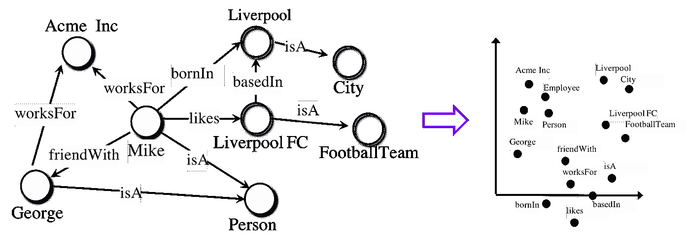
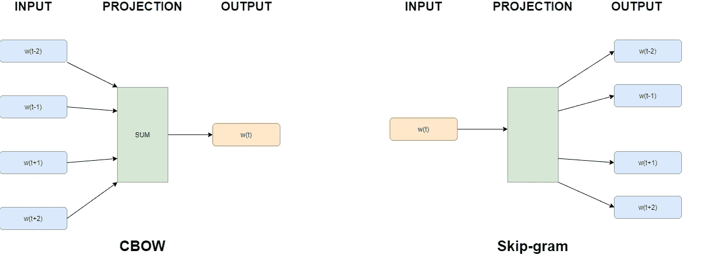
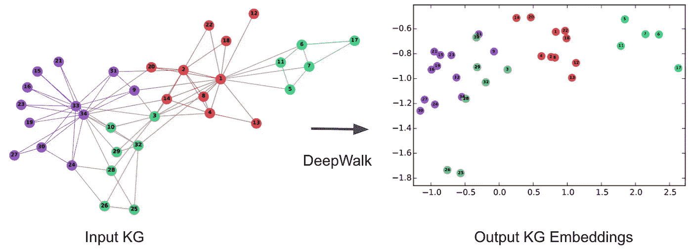
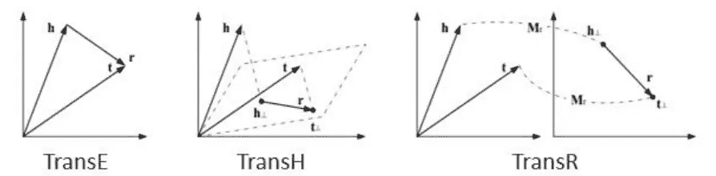
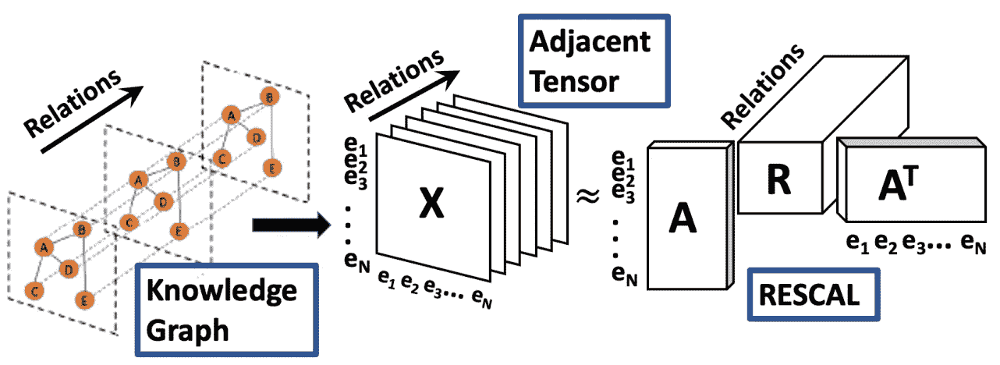
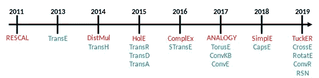

# 知识图谱嵌入基础

> 原文：[`towardsdatascience.com/knowledge-graph-embeddings-101-2cc1ca5db44f?source=collection_archive---------1-----------------------#2023-04-09`](https://towardsdatascience.com/knowledge-graph-embeddings-101-2cc1ca5db44f?source=collection_archive---------1-----------------------#2023-04-09)

## 知识图谱嵌入（KGE）算法的总结

 [Amine Dadoun](https://medium.com/@amine.dadoun?source=post_page-----2cc1ca5db44f--------------------------------)

·

[关注](https://medium.com/m/signin?actionUrl=https%3A%2F%2Fmedium.com%2F_%2Fsubscribe%2Fuser%2F338cc4ecc244&operation=register&redirect=https%3A%2F%2Ftowardsdatascience.com%2Fknowledge-graph-embeddings-101-2cc1ca5db44f&user=Amine+Dadoun&userId=338cc4ecc244&source=post_page-338cc4ecc244----2cc1ca5db44f---------------------post_header-----------) 发表在 [Towards Data Science](https://towardsdatascience.com/?source=post_page-----2cc1ca5db44f--------------------------------) ·7 分钟阅读·2023 年 4 月 9 日

--

[图片来源](https://pixabay.com/illustrations/artificial-intelligence-network-3706562/)。该图片根据 Pixabay 的内容许可可以自由使用。

在我们最新的一篇系列文章中，*如何基于图设计推荐系统？*我们介绍了一种新兴的推荐系统算法类别，即基于知识图谱的推荐系统。这些系统利用知识图谱的语义结构和知识图谱嵌入（KGE）算法的强大能力，为用户提供更精准的产品推荐。

# 什么是知识图谱嵌入？

如[前一篇文章](https://medium.com/@amine.dadoun/introduction-to-knowledge-graph-based-recommender-systems-34254efd1960)所述，知识图谱（KG）在表示结构化数据和整合来自不同来源的数据方面非常有效。然而，知识图谱三元组的符号化特性通常使得知识图谱在机器学习应用中难以操作。

知识图谱嵌入（KGE）是将 KG 元素表示为连续向量空间的一种表示方法。学习这些嵌入的目标是简化图元素（实体、关系）的操作，以用于预测任务，例如实体分类、链接预测或推荐系统。

大多数提出的方法仅依赖于图三元组，目的是将 KG 实体和关系嵌入到连续的向量空间中。这个想法是保留 KG 的固有结构并简化 KG 元素的使用。一旦 KG 元素被表示为嵌入，就使用评分函数来测量三元组的合理性（例如‘George’，‘是 A’，‘Person’）。

上图展示了节点和关系在二维向量空间中的嵌入表示。图片来源：[`docs.ampligraph.org/en/1.1.0/`](https://docs.ampligraph.org/en/1.1.0/)。Ampligraph 是一个免费的开源 Python 库，用于知识图谱嵌入。版权所有 AmpliGraph，许可证为 Apache 2.0。

# 受词嵌入启发

嵌入技术因 2013 年发布的 Word2vec [1] 而变得流行。Word2vec 通过训练一个浅层神经网络来预测词汇表中一个词的上下文，从而高效地学习词嵌入，关键思想是保留词的语义。图下所示的两种不同架构分别是 Continuous Bag-of-Words [2] (CBOW)，它实现了一个神经网络，其中输入是上下文词 wₜ₋ᵢ ,wₜ₋ᵢ₊₁ …wₜ₊ᵢ₋₁,wₜ₊ᵢ，而输出是预测的目标词 wₜ；另一个是 Skip-Gram [1]，它实现了一个两层神经网络，其中输入是目标词 wₜ，输出是上下文词。

CBOW 架构基于上下文预测当前词，而 Skip-gram 模型给定当前词预测周围词。图片来源：[Mikolov et al.](https://arxiv.org/abs/1301.3781)

按照相同的逻辑，*DeepWalk* [3] 和 *node2vec* [4] 的作者通过建议使用神经语言模型如 Word2vec 来构建图嵌入，将嵌入扩展到图中。在 DeepWalk 中，作者提出通过依赖图中的随机均匀游走来提取图中的节点序列——这些节点代表实体。这个节点序列可以看作是文本，然后应用 CBOW 或 SkipGram 来构建这些节点的嵌入。

DeepWalk 旨在在嵌入空间中保持图的局部结构。图像来源：[Bryan Perozzi, Rami Al-Rfou, Steven Skiena](https://arxiv.org/abs/1403.6652)

*Node2vec* 通过引入更复杂的随机游走策略进一步改进，这种策略可以更容易地适应多样的图连接模式，在链接预测和知识图谱补全任务中优于 DeepWalk。

# 利用知识图谱的属性

仅考虑图结构以编码 KG 元素仍然不够，因此出现了其他方法，也考虑图的属性和实体类型。在 [5] 中，作者将知识图谱嵌入算法分为两大类，即基于评分函数的***转换距离模型***，通过在向量空间中测量距离来评估三元组的可信度，通常是在执行转换操作后，以及基于相似度评分函数的***语义匹配模型***，通过匹配实体和关系的潜在表示的语义来评估三元组的可信度。

## 转换距离模型

对于第一类，TransE [6] 通常被提及为最常用的转换距离模型。TransE 在相同的空间 Rₘ 中表示实体和关系向量。给定一个三元组 (s,p,o)，关系被解释为一个转换向量 r，使得嵌入的实体 s（主体）和 o（客体）可以通过 p 以低误差连接，即，当三元组 (s,p,o) 在知识图谱中成立时，s + p ≈ o。换句话说，目标是最小化下面表示的评分函数。

TransH [6] 引入了关系特定的超平面，每个属性 p 在超平面上由其法向量 wₚ 表示。TransR [8] 采用了与 TransH 相同的思路，但不是将关系投影到超平面中，而是建议为每个关系创建一个特定的空间。下图表示了上述不同的转换距离模型的嵌入空间。

对于 TransE，无论关系如何，嵌入之间的距离都在相同的嵌入空间中计算，而对于 TransH 和 TransR，它们在关系特定的空间中计算。(h, r, t) 是 KG 中的一个三元组。图像来源：[Wang et al.](https://ieeexplore.ieee.org/document/8047276)

## 语义匹配模型

另一方面，*语义匹配模型*利用基于相似度的评分函数。在 [9] 中，作者提出了 RESCAL，这是一种将每个实体与一个向量关联起来以捕捉其潜在语义的模型。每个关系被表示为一个矩阵，模型化潜在因素之间的配对交互。三元组 (s, p, o) 的得分由一个双线性评分函数定义，通过基于 ALS 优化技术的张量分解来最小化。

RESCAL 方法的张量嵌入。图片来源：[Bhattarai 等](https://arxiv.org/pdf/2202.09512.pdf)

扩展 *RESCAL* 的其他方法出现了。NTN [10]（神经张量网络）是一种通过非线性层学习表示的神经网络。ER-MLP（多层感知器），其中每个关系（以及实体）都与一个向量关联。更具体地说，给定一个三元组 (s, p, o)，s、p 和 o 的向量嵌入在输入层中连接，并映射到一个非线性隐藏层。

其他方法也出现了，比如 *DistMul*，它通过用对角矩阵表示关系来简化 *RESCAL*，从而减少其复杂性，*ComplEX* 扩展了 *DistMul*，使用复数代替实数。近年来，许多方法出现了，旨在简化现有文献并提高现有知识图谱（KG）任务的算法准确性，如链接预测任务。这些方法采用了各种技术，如基于神经网络的模型、基于分解的模型和基于随机游走的模型等。

KGE 算法的发展。图片来源：[知识图谱嵌入](https://en.wikipedia.org/wiki/Knowledge_graph_embedding)

# 结论

总结来说，知识图谱嵌入算法已经成为表示和推理复杂结构化数据的强大工具。这些算法学习知识图谱中实体和关系的低维嵌入，从而允许高效地计算相似性和推理任务。

在这篇博客文章中，我们讨论了各种嵌入算法，包括 TransE、TransH、TransR、DistMult、ComplEx，并强调了它们的优缺点。总体而言，知识图谱嵌入算法在问答系统、推荐系统和自然语言处理等广泛应用中表现出巨大的潜力。随着领域的不断发展，我们可以期待看到更强大和有效的嵌入算法，它们能够处理越来越大和复杂的知识图谱。

在本系列的下一篇博客中，我们将介绍一些具体的推荐系统用例，其中 KGE 的使用有助于提高推荐准确性。

# 参考文献：

[1] Tomas Mikolov, Ilya Sutskever, Kai Chen, Greg Corrado, 和 Jeffrey Dean. 词汇和短语的分布式表征及其组合性。发表于第 26 届神经信息处理系统国际会议论文集——第 2 卷，NIPS’13，页码 3111–3119，美国纽约红钩，2013 年。Curran Associates Inc.

[2] Tomás Mikolov, Kai Chen, Greg Corrado, 和 Jeffrey Dean. 向量空间中词汇表征的高效估计。由 Yoshua Bengio 和 Yann LeCun 编辑，第 1 届国际学习表征会议，ICLR 2013，美国亚利桑那州斯科茨代尔，2013 年 5 月 2–4 日，研讨会论文集，2013 年。

[3] Bryan Perozzi, Rami Al-Rfou, 和 Steven Skiena. Deepwalk：社交表征的在线学习。发表于第 20 届 ACM SIGKDD 国际知识发现与数据挖掘会议论文集，页码 701–710，2014 年。

[4] Aditya Grover 和 Jure Leskovec. Node2vec：网络的可扩展特征学习。发表于第 22 届 ACM SIGKDD 国际知识发现与数据挖掘会议论文集，页码 855–864，美国纽约，2016 年。ACM 出版社。

[5] Nan Wang, Hongning Wang, Yiling Jia, 和 Yue Yin. 通过多任务学习解释性推荐于带有观点的文本数据。发表于第 41 届国际 ACM SIGIR 信息检索研究与发展会议，SIGIR ’18，页码 165–174，美国纽约，2018 年。计算机协会。

[6] Antoine Bordes, Nicolas Usunier, Alberto Garcia-Duran, Jason Weston, 和 Oksana Yakhnenko. 翻译嵌入用于建模多关系数据。由 C. J. C. Burges, L. Bottou, M. Welling, Z. Ghahramani, 和 K. Q. Weinberger 编辑，神经信息处理系统进展，第 26 卷，美国内华达州湖塔霍，2013 年。Curran Associates, Inc.

[7] Zhen Wang, Jianwen Zhang, Jianlin Feng, 和 Zheng Chen. 通过在超平面上转换进行知识图谱嵌入。发表于第二十八届 AAAI 人工智能会议论文集，AAAI’14，页码 1112–1119，加拿大魁北克市，2014 年。AAAI 出版社。

[8] Yankai Lin, Zhiyuan Liu, Maosong Sun, Yang Liu, 和 Xuan Zhu. 学习实体和关系嵌入以完成知识图谱。发表于第二十九届 AAAI 人工智能会议论文集，AAAI’15，页码 2181–2187，美国德克萨斯州奥斯汀，2015 年。AAAI 出版社。

[9] Maximilian Nickel, Volker Tresp, 和 Hans-Peter Kriegel. 一种用于多关系数据集体学习的三元模型。发表于第 28 届国际机器学习会议论文集，ICML’11，页码 809–816，美国威斯康星州麦迪逊，2011 年。Omnipress 出版社。

[10] Richard Socher, Danqi Chen, Christopher D Manning, 和 Andrew Ng. 使用神经张量网络进行知识库补全推理。由 C. J. C. Burges, L. Bottou, M. Welling, Z. Ghahramani, 和 K. Q. Weinberger 编辑，神经信息处理系统进展，第 26 卷，美国内华达州湖塔霍，2013 年。Curran Associates, Inc.
