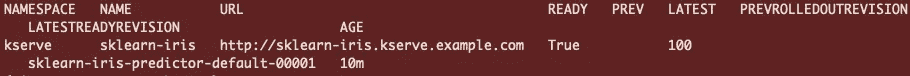
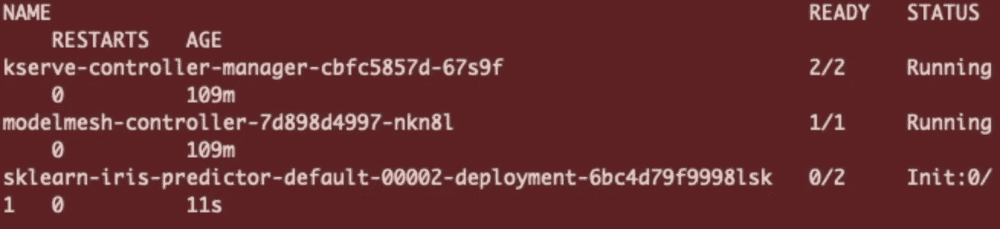

# KServe：基于 Kubernetes 的高可扩展机器学习部署

> 原文：[`towardsdatascience.com/kserve-highly-scalable-machine-learning-deployment-with-kubernetes-aa7af0b71202`](https://towardsdatascience.com/kserve-highly-scalable-machine-learning-deployment-with-kubernetes-aa7af0b71202)

## Kubernetes 模型推理变得简单。

[](https://medium.com/@lloyd.hamilton?source=post_page-----aa7af0b71202--------------------------------)[](https://towardsdatascience.com/?source=post_page-----aa7af0b71202--------------------------------) [Lloyd Hamilton](https://medium.com/@lloyd.hamilton?source=post_page-----aa7af0b71202--------------------------------)

·发表于 [Towards Data Science](https://towardsdatascience.com/?source=post_page-----aa7af0b71202--------------------------------) ·阅读时间 10 分钟·2023 年 5 月 29 日

--


图片来源于 [KServe](https://kserve.github.io/website/0.10/)

随着 chatGPT 的发布，避免利用机器学习的技术变得越来越困难。从你消息应用中的文本预测到智能门铃上的面部识别，机器学习（ML）几乎存在于我们今天使用的每一项技术中。

机器学习技术如何交付给消费者是组织在开发过程中必须面对的许多挑战之一。ML 产品的部署策略对产品的最终用户有着显著影响。这可能意味着你 iPhone 上的 Siri 和你网页浏览器中的 chatGPT 之间的区别。

在 ChatGPT 那光鲜的用户界面和过于自信的聊天对话背后，隐藏着部署大型语言 ML 模型所需的复杂机制。ChatGPT 建立在一个高度可扩展的框架上，旨在在其指数级采用过程中提供和支持该模型。实际上，实际的 ML 模型仅占整个项目的一小部分。这些项目通常是跨学科的，要求在数据工程、数据科学和软件开发方面的专业知识。因此，简化模型部署过程的框架在将模型推向生产中变得越来越重要，帮助组织节省时间和金钱。

如果没有合适的操作框架来支持和管理 ML 模型，组织在尝试扩大生产中的 ML 模型数量时通常会遇到瓶颈。

虽然在竞争激烈的 MLOps 工具市场中没有出现明显的赢家，但 KServe 正成为帮助组织满足 ML 模型可扩展性要求的越来越受欢迎的工具。

**注意：我与 KServe 没有任何关联，也没有获得赞助来撰写这篇文章。**

# 什么是 KServe？

KServe 是一个高度可扩展的机器学习部署工具包，适用于 Kubernetes。它是一个建立在 Kubernetes 之上的编排工具，利用了另外两个开源项目，Knative-Serving 和 Istio；稍后会详细介绍。


图片来源于 [KServe](https://kserve.github.io/website/0.10/)

KServe 通过将部署统一到一个资源定义中，显著简化了将 ML 模型部署到 Kubernetes 集群中的过程。它使得机器学习部署成为任何 ML 项目的一部分，易于学习，并最终降低了进入门槛。因此，使用 KServe 部署的模型比使用传统的 Kubernetes 部署（需要 Flask 或 FastAPI 服务）的模型更易于维护。

使用 KServe，无需在通过 HTTPS 将模型暴露到互联网之前将其封装在 FastAPI 或 Flask 应用程序中。KServe 内置了本质上复制这一过程的功能，但无需维护 API 端点、配置 Pod 副本或在 Kubernetes 中配置内部路由网络。你只需将 KServe 指向你的模型，它将处理其余的部分。

除了简化部署过程之外，KServe 还提供了许多功能，包括金丝雀部署、推理自动扩展和请求批处理。这些功能将不在本讨论范围之内。然而，本指南希望能够为进一步探索打下基础。

首先，让我们讨论 KServe 所依赖的两个关键技术，Istio 和 Knative。

# Istio

KServe 所带来的许多功能在没有 Istio 的情况下将很难实现。Istio 是一个服务网格，扩展了部署在 Kubernetes 中的应用程序。它是一个专门的基础设施层，增加了可观测性、流量管理和安全性等功能。对于熟悉 Kubernetes 的人来说，Istio 替代了通常在 Kubernetes 集群中找到的标准 Ingress 定义。

随着基于 Kubernetes 的系统规模扩大，管理流量和维护可观测性的复杂性也在增加。Istio 的一个最佳功能是能够集中控制服务级别的通信。这使得开发人员对服务之间的通信有更大的控制和透明度。

使用 Istio，开发人员不需要设计能够处理流量认证或授权的应用程序。最终，Istio 有助于减少部署应用程序的复杂性，使开发人员能够集中精力关注应用程序的关键组件。

通过利用 Istio 的网络功能，KServe 可以提供包括金丝雀部署、推理图和自定义变换器等功能。

# KNative

另一方面，Knative 是一个开源企业级解决方案，用于构建无服务器和事件驱动的应用程序。Knative 基于 Istio 构建，提供类似于 AWS Lambdas 和 Azure Functions 的无服务器代码执行能力。Knative 是一个与平台无关的解决方案，用于在 Kubernetes 中运行无服务器部署。

Knative 的一个最佳功能是缩放到零的特性。这是 KServe 能够扩展或缩小 ML 模型部署的关键组件，并且能够最大化资源利用率和节省成本。

# 我应该使用 KServe 吗？

KServe 和许多其他工具一样，并不是一个适合所有组织需求的一刀切解决方案。由于需要一定的 Kubernetes 经验，其入门成本较高。如果你刚刚开始使用 Kubernetes，有许多在线资源，我强烈建议查看 [DevOps](https://www.youtube.com/channel/UCFe9-V_rN9nLqVNiI8Yof3w) 频道的资源。不过，即使没有深入了解 Kubernetes，也可以学习使用 KServe。

KServe 在已经使用 Kubernetes 的组织中将是理想选择，这些组织已经具备了与 Kubernetes 相关的知识。它也适合那些希望摆脱或补充像 SageMaker 或 Azure Machine Learning 等托管服务的组织，以便对模型部署过程拥有更大的控制权。增加的所有权可以显著降低成本，并提高配置能力，以满足项目的具体要求。

尽管如此，正确的云基础设施决策将依赖于具体情况，因为基础设施需求在不同公司之间会有所不同。

# 先决条件

本指南将引导你完成设置 KServe 所需的步骤。你将了解如何安装 KServe 并服务你的第一个模型。

在继续之前，需要满足几个先决条件。你将需要以下内容：

+   [Kubectl](https://kubernetes.io/docs/tasks/tools/) 安装

+   [Helm](https://helm.sh/docs/intro/install/) 安装

+   [Kubectx](https://github.com/ahmetb/kubectx) 安装（可选）

## Kubernetes 集群

对于本教程，我推荐使用 [Kind](https://kind.sigs.k8s.io) 来实验 Kubernetes 集群。它是一个运行本地 Kubernetes 集群的工具，无需启动云资源。此外，如果你在多个集群之间工作，我强烈推荐使用 Kubectx 作为一个轻松切换 Kubernetes 上下文的工具。

然而，在运行生产工作负载时，你将需要访问一个完全功能的 Kubernetes 集群来配置 DNS 和 HTTPS。

在 Kind 中部署 Kubernetes 集群，使用：

```py
kind create cluster --name kserve-demo
```

切换到正确的 Kubernetes 上下文，使用：

```py
kubectx kind-kserve-demo
```

# 安装

以下步骤将安装 Istio v1.16、Knative Serving v1.7.2 和 KServe v0.10.0。这些版本最适合本教程，因为 Knative v1.8 及以后版本将需要 DNS 配置进行入口，这增加了当前教程范围之外的复杂性。

1.  Istio 安装。

```py
# Install istio
curl -L https://istio.io/downloadIstio | ISTIO_VERSION=1.16.0 TARGET_ARCH=x86_64 sh -
istioctl install --set profile=default -y
```

2\. 安装 KNative Serving。

```py
# Install the Knative Serving component
export KNATIVE_VERSION="v1.7.2"
kubectl apply -f https://github.com/knative/serving/releases/download/knative-$KNATIVE_VERSION/serving-crds.yaml
kubectl apply -f https://github.com/knative/serving/releases/download/knative-$KNATIVE_VERSION/serving-core.yaml

# Install istio-controller for knative
kubectl apply -f https://github.com/knative/net-istio/releases/download/knative-v1.7.0/net-istio.yaml
```

3\. 安装证书管理器。证书管理器用于管理 HTTPs 流量的有效证书。

```py
helm repo add jetstack https://charts.jetstack.io
helm repo update
helm install cert-manager jetstack/cert-manager --namespace cert-manager --create-namespace --version v1.11.0 --set installCRDs=true
```

4\. 为模型创建一个命名空间。

```py
kubectl create namespace kserve
```

5\. 克隆[KServe](https://github.com/kserve/kserve)仓库。

```py
git clone git@github.com:kserve/kserve.git
```

6\. 将 KServe 自定义资源定义和 KServe 运行时安装到集群中的模型命名空间。

```py
cd kserve
helm install kserve-crd charts/kserve-crd -n kserve
helm install kserve-resources charts/kserve-resources -n kserve
```

太好了！我们现在已经在集群上安装了 KServe。让我们开始部署吧！

# 第一个推理服务

为确保部署顺利，让我们部署一个演示推理服务。部署的源代码可以在[这里](https://kserve.github.io/website/0.10/get_started/first_isvc/#1-create-a-namespace)找到。

```py
kubectl apply -n kserve -f - <<EOF
apiVersion: "serving.kserve.io/v1beta1"
kind: "InferenceService"
metadata:
  name: "sklearn-iris"
spec:
  predictor:
    model:
      modelFormat:
        name: sklearn
      storageUri: "gs://kfserving-examples/models/sklearn/1.0/model"
EOF
```

上面的 yaml 资源定义部署了一个测试推理服务，该服务使用 SciKit-Learn 库训练的公开可用模型。KServe 支持许多不同的[机器学习库](https://kserve.github.io/website/0.10/modelserving/v1beta1/serving_runtime/)。这些包括 MLFlow、PyTorch 或 XGBoost 模型；每次发布时都会添加更多。如果这些现成的库都不符合你的要求，KServe 还支持[自定义预测器](https://kserve.github.io/website/0.10/modelserving/v1beta1/custom/custom_model/)。

可以通过获取命名空间中的可用 pod 来监控当前部署的状态。

```py
kubectl get pods -n kserve
```


图片由作者提供

如果在部署过程中遇到问题，请使用以下命令进行调试：

```py
kubectl describe pod <name_of_pod> -n kserve
```

我们还可以通过以下命令检查推理服务部署的状态：

```py
kubectl get isvc -A
```



图片由作者提供

如果推理服务标记为 true，我们就可以进行第一次预测了。

# 执行预测

为了进行预测，我们需要确定我们的 Kubernetes 集群是否运行在支持外部负载均衡器的环境中。

```py
kubectl get svc istio-ingressgateway -n istio-system
```

## **Kind 集群**

使用 Kind 部署的集群不支持外部负载均衡器，因此你将会有一个类似下面的入口网关。


Kind 外部负载均衡器（图片由作者提供）

在这种情况下，我们需要将 istio-ingressgateway 的端口转发，这样可以通过`localhost`访问它。

将 istio 入口网关服务的端口转发到`localhost`上的端口`8080`，使用以下命令：

```py
kubectl port-forward -n istio-system service/istio-ingressgateway 8080:80
```

然后用以下命令设置入口主机和端口：

```py
export INGRESS_HOST=localhost
export INGRESS_PORT=8080
```

## **Kubernetes 集群**

如果外部 IP 有效且不显示`<pending>`，我们就能够通过该 IP 地址在互联网上发送推理请求。


入口网关 IP 地址（图片由作者提供）

用以下命令设置入口主机和端口：

```py
export INGRESS_HOST=$(kubectl -n istio-system get service istio-ingressgateway -o jsonpath='{.status.loadBalancer.ingress[0].ip}')
export INGRESS_PORT=$(kubectl -n istio-system get service istio-ingressgateway -o jsonpath='{.spec.ports[?(@.name=="http2")].port}')
```

## 执行推理

准备一个用于推断请求的输入 `json` 文件。

```py
cat <<EOF > "./iris-input.json"
{
  "instances": [
    [6.8,  2.8,  4.8,  1.4],
    [6.0,  3.4,  4.5,  1.6]
  ]
}
EOF
```

然后使用 curl 执行推断：

```py
SERVICE_HOSTNAME=$(kubectl get inferenceservice sklearn-iris -n kserve -o jsonpath='{.status.url}' | cut -d "/" -f 3)
curl -v -H "Host: ${SERVICE_HOSTNAME}" -H "Content-Type: application/json" "http://${INGRESS_HOST}:${INGRESS_PORT}/v1/models/sklearn-iris:predict" -d @./iris-input.json 
```

请求将通过 istio-ingress 网关发送到 KServe 部署。如果一切正常，我们将从推断服务收到一个 `json` 回复，其中包含每个实例的预测值 `[1,1]`。


# 缩放到零

通过利用 Knative 的特性，KServe 支持缩放到零的能力。此功能通过将未使用的 Pods 缩放为零来有效管理集群中的有限资源。缩放到零的能力允许创建一个响应请求的反应系统，而不是一个始终运行的系统。这将使得在集群中部署更多的模型成为可能，相较于传统的部署配置。

然而，请注意，对于已缩放下来的 Pods，会有冷启动的惩罚。这将根据镜像/模型的大小和可用的集群资源而有所不同。如果集群需要扩展额外的节点，冷启动可能需要 5 分钟；如果模型已经缓存到节点上，冷启动可能需要 10 秒。

让我们修改现有的 scikit-learn 推断服务，通过定义 `minReplicas: 0` 来启用缩放到零。

```py
kubectl apply -n kserve -f - <<EOF
apiVersion: "serving.kserve.io/v1beta1"
kind: "InferenceService"
metadata:
  name: "sklearn-iris"
spec:
  predictor:
    minReplicas: 0
    model:
      modelFormat:
        name: sklearn
      storageUri: "gs://kfserving-examples/models/sklearn/1.0/model"
EOF
```

通过将 `minReplicas` 设置为 0，这将指示 Knative 在没有 HTTP 流量时将推断服务缩放为零。你会注意到，在 30 秒后，Sklearn-Iris 模型的 Pods 将会被缩放到零。

```py
kubectl get pods -n kserve
```


Sklearn-Iris 预测器缩放到零

要重新初始化推断服务，请向相同的端点发送预测请求。

```py
SERVICE_HOSTNAME=$(kubectl get inferenceservice sklearn-iris -n kserve -o jsonpath='{.status.url}' | cut -d "/" -f 3)
curl -v -H "Host: ${SERVICE_HOSTNAME}" "http://${INGRESS_HOST}:${INGRESS_PORT}/v1/models/sklearn-iris:predict" -d @./iris-input.json
```



这将触发 Pods 的冷启动初始化并返回一个预测结果。

# 结论

KServe 简化了机器学习部署的过程，并缩短了生产的路径。当与 Knative 和 Istio 结合使用时，KServe 具有高度的可定制性，并带来许多与托管云解决方案提供的功能相媲美的特性。

当然，将模型部署过程迁移到内部也有其固有的复杂性。然而，平台所有权的增加将提供更大的灵活性，以满足项目特定要求。凭借正确的 Kubernetes 专业知识，KServe 可以成为一个强大的工具，使组织能够轻松地在任何云提供商上扩展其机器学习部署，以满足不断增长的需求。
