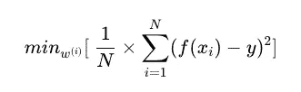
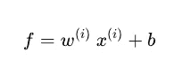
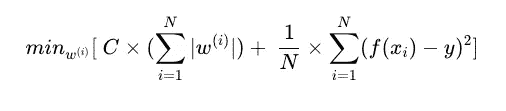
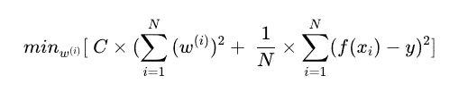
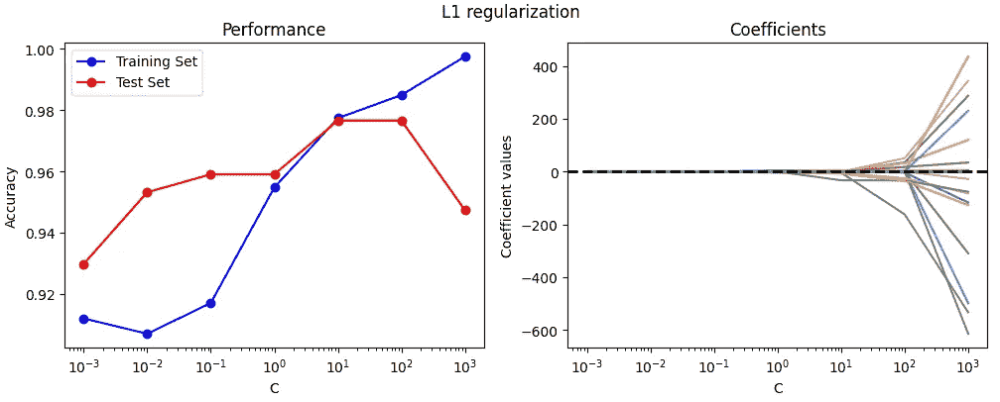
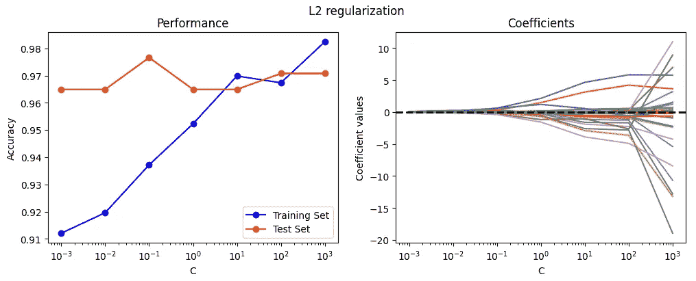

# L1 与 L2 正则化在机器学习中的比较：区别、优势及如何在 Python 中应用

> 原文：[`towardsdatascience.com/l1-vs-l2-regularization-in-machine-learning-differences-advantages-and-how-to-apply-them-in-72eb12f102b5`](https://towardsdatascience.com/l1-vs-l2-regularization-in-machine-learning-differences-advantages-and-how-to-apply-them-in-72eb12f102b5)

## *深入探讨 L1 和 L2 正则化技术，解释它们为何对防止模型过拟合至关重要*

[](https://medium.com/@theDrewDag?source=post_page-----72eb12f102b5--------------------------------)[](https://towardsdatascience.com/?source=post_page-----72eb12f102b5--------------------------------) [Andrea D'Agostino](https://medium.com/@theDrewDag?source=post_page-----72eb12f102b5--------------------------------)

·发表在 [Towards Data Science](https://towardsdatascience.com/?source=post_page-----72eb12f102b5--------------------------------) ·阅读时间 8 分钟·2023 年 2 月 23 日

--


图片由作者提供。

机器学习是一个在技术和工业领域经历巨大发展的学科。

得益于其算法和建模技术，我们可以构建能够从过去数据中学习、泛化并对新数据进行预测的模型。

然而，在某些情况下，**模型可能会过拟合训练数据，从而失去泛化能力**。这种现象称为*过拟合*。

对分析师来说，理解过拟合是什么以及为什么它是创建预测模型时的主要障碍之一是相当重要的。

过拟合的一个大致概念是这样的

> 当一个模型过于复杂或对训练数据拟合得过好时，它可能对这些特定数据非常准确，但对从未见过的数据的泛化能力差。**这意味着模型在现实生活中应用于新数据时将无效**。
> 
> 想了解更多关于过拟合的信息？阅读标题为 [*克服机器学习中的最大障碍：过拟合*](https://medium.com/towards-data-science/overcome-the-biggest-obstacle-in-machine-learning-overfitting-cca026873970) 的文章，该文章发表在 TDS 上。

**正则化技术可以用于防止过拟合。**

*正则化*一词涵盖了一组**简化预测模型的技术**。在这篇文章中，我们将重点介绍两种正则化技术，**L1 和 L2**，解释它们的区别，并展示如何在 Python 中应用它们。

# 什么是正则化，为什么它很重要？

简单来说，正则化模型意味着在训练阶段改变其学习行为。

正则化通过 **对模型复杂度施加惩罚** 来帮助防止过拟合——如果模型过于复杂，在训练过程中将受到惩罚，这有助于保持模型复杂性和对未见数据的泛化能力之间的良好平衡。

要添加 L1 或 L2 正则化，**我们将修改模型的损失函数**。这是学习算法在训练阶段试图优化的函数。

正则化通过分配一个基于模型复杂度增加的惩罚来发生。

以线性回归为例，MSE（均方误差——有关回归模型评估指标的更多信息请点击这里）是典型的损失函数，可以表示为



其中算法的目标是最小化预测值 *f(x)* 与观察值 *y* 之间的差异。

在方程中，*f(x)* 是回归线，这将等于



因此，算法将需要通过最小化 MSE 从训练集找出参数 *w* 和 *b* 的值。

> 如果一些参数 *w* 接近或等于零，则模型被认为较少复杂。

# L1 和 L2 正则化

现在让我们看看 L1 和 L2 正则化之间的区别。

## L1 正则化

L1 正则化，**也称为“套索”**，对模型权重的绝对值总和施加惩罚。

**这意味着对模型贡献不大的权重将被归零**，这可能导致自动特征选择（因为对应于不重要特征的权重实际上会被归零）。

这使得 L1 在特征选择问题和稀疏模型中尤其有用。

以上述 MSE 公式为例，L1 正则化看起来如下



其中 *C* 是一个 **控制正则化强度的模型超参数**。*C* 的值越高，我们的权重越会趋向于零。

行话中，这被称为 **稀疏模型**，其中大多数参数的值为零。

这里的风险是 **非常高的 *C* 值会导致模型欠拟合**，这与过拟合相反——即它不会捕捉到我们数据中的模式。

## L2 正则化

另一方面，L2 正则化，也称为 **岭回归正则化**，将权重的平方添加到正则化项中。

**这意味着较大的权重会被减少但不会被归零**，这导致与 L1 正则化相比，模型的变量较少但权重更分散。

L2 正则化在你有很多高度相关的变量时尤其有用，因为它倾向于“分散”权重到所有变量中，而不是只关注其中的一些。

如前所述，让我们看看初始方程如何变化以集成 L2。



L2 正则化可以提高模型的稳定性，尤其在训练数据噪声或不完整时，通过减少异常值或噪声对变量的影响。

# 如何在 Sklearn 和 Python 中应用正则化

在这个例子中，我们将看到如何将正则化应用于逻辑回归模型以解决分类问题。

**我们将看到性能如何随 C 值的变化而变化**，并比较模型对输入数据的拟合准确性。

我们将使用 Sklearn 中著名的 *乳腺癌数据集*。让我们首先看看如何导入它以及所有的库。

```py
import numpy as np
import pandas as pd
import matplotlib.pyplot as plt
from sklearn.linear_model import LogisticRegression
from sklearn.model_selection import train_test_split
from sklearn.metrics import accuracy_score

# import the dataset from sklearn
breast_cancer = load_breast_cancer()

# we create a variable "data" which contains the dataframe from the dataset
data = pd.DataFrame(data=breast_cancer['data'], columns=breast_cancer['feature_names'])
data['target'] = pd.Series(breast_cancer['target'], dtype='category')
```

作为分类问题，我们将使用准确率来衡量模型的性能。如果你有兴趣了解更多，请阅读我关于[如何衡量二分类模型性能](https://medium.com/towards-data-science/the-explanation-you-need-on-binary-classification-metrics-321d280b590f)的文章。

现在让我们创建一个函数来对 dataframe 上的 L1 和 L2 正则化进行比较。

```py
 def plot_regularization(df, reg_type='l1'):
 # we split our data into training and testing
    X = df.drop('target', axis=1)
    y = df['target']
    X_train, X_test, y_train, y_test = train_test_split(X, y, test_size=0.3, random_state=42)

 # we define the different values of C
    Cs = [0.001, 0.01, 0.1, 1, 10, 100, 1000]
    coefs = []
    test_scores = []
    train_scores = []
    for C in Cs:
     # we train the model for the different values of C
        clf = LogisticRegression(penalty=reg_type, C=C, solver='liblinear')
        clf.fit(X_train, y_train)
        # we save the performances
        coefs.append(clf.coef_.ravel())
        train_scores.append(clf.score(X_train, y_train))
        test_scores.append(clf.score(X_test, y_test))

    reg = reg_type.capitalize()

    # and create some charts
    fig, (ax1, ax2) = plt.subplots(ncols=2, figsize=(12, 4))
    ax1.plot(Cs, train_scores, 'b-o', label='Training Set')
    ax1.plot(Cs, test_scores, 'r-o', label='Test Set')
    plt.suptitle(f'{reg} regularization')
    ax1.set_xlabel('C')
    ax1.set_ylabel('Accuracy')
    ax1.set_xscale('log')
    ax1.set_title('Performance')
    ax1.legend()

    coefs = np.array(coefs)
    n_params = coefs.shape[1]
    for i in range(n_params):
        ax2.plot(Cs, coefs[:, i], label=X.columns[i])
    ax2.axhline(y=0, linestyle='--', color='black', linewidth=2)
    ax2.set_xlabel('C')
    ax2.set_ylabel('Coefficient values')
    ax2.set_xscale('log')
    ax2.set_title('Coefficients')
    plt.show()
```

我们通过观察 L1 正则化来应用这一逻辑。

```py
plot_regularization(data, 'l1')
```



L1 正则化如何影响模型性能。图像由作者提供。

我们看到 L1 正则化如何使模型系数在许多 C 值下接近于零。**根据模型，系数值最高的是预测中最重要的特征**。

我们也看到过拟合的开始——在*C=100*时，训练集的性能提高，而测试集的性能下降。

我们现在应用相同的函数来评估 L2 的效果。

```py
plot_regularization(data, 'l2')
```



L2 正则化如何影响模型性能。图像由作者提供。

系数总是大于零，**从而为最相关的特征创建了逐渐增加的权重分布**。我们注意到在*C=100*时有非常轻微的过拟合。

# 其他正则化技术

除了 L1 和 L2 正则化，还有其他正则化技术可以应用于机器学习模型。**其中包括 dropout 和 early stopping**。

## Dropout

Dropout 是一种在神经网络中减少过拟合的技术。**Dropout 通过在训练阶段随机关闭一些神经元来工作**，迫使神经网络找到其他方法来表示数据。

## Early stopping

Early stopping 是另一种用于避免机器学习模型过拟合的技术。**这种技术包括在验证集上的性能开始恶化时停止模型训练**。这可以防止模型过度学习训练数据而在未见过的数据上泛化效果不好。

> 想了解更多关于早停的信息？阅读标题为*TensorFlow 中的早停 - 防止神经网络过拟合*的文章，发表于 TDS

一般来说，通过使用正则化技术的组合可以避免过拟合。然而，最合适的技术选择将取决于数据集和所用机器学习模型的特性。

# 总结

总之，正则化是一种重要的机器学习技术，有助于提高模型性能**通过避免在训练数据上过拟合。**

L1 和 L2 正则化是最常用的技术，但根据上下文，还有其他可能有用的技术。例如，dropout 几乎总是出现在深度学习中，即神经网络中。

在我们的例子中，我们看到了正则化如何影响逻辑回归模型的性能，以及 C 的值如何影响正则化本身。我们还检查了 C 值变化时模型系数的变化，以及 L1 和 L2 正则化如何以不同的方式影响模型系数。

感谢您抽出时间阅读我的文章！😊

下次见！

**如果您想支持我的内容创作活动，请随时通过以下推荐链接加入 Medium 的会员计划**。我将获得您投资的一部分，您将能够无缝访问 Medium 上的数据科学等众多文章。

[](https://medium.com/@theDrewDag/membership?source=post_page-----72eb12f102b5--------------------------------) [## 通过我的推荐链接加入 Medium - Andrea D'Agostino

### 阅读 Andrea D'Agostino 的每个故事（以及 Medium 上其他数千名作者的故事）。您的会员费直接…

medium.com](https://medium.com/@theDrewDag/membership?source=post_page-----72eb12f102b5--------------------------------)

# 推荐阅读

对感兴趣的读者，这里有我推荐的每个与机器学习相关主题的书单。这些书在我看来是**必读的**，对我的职业生涯产生了重大影响。

*免责声明：这些是亚马逊附属链接。我将因推荐这些商品而从亚马逊获得少量佣金。您的体验不会改变，也不会额外收费，但这将帮助我扩大业务，并制作更多关于 AI 的内容。*

+   **机器学习简介**: [*Confident Data Skills: Master the Fundamentals of Working with Data and Supercharge Your Career*](https://amzn.to/3WZ51cE)由 Kirill Eremenko 著

+   **Sklearn / TensorFlow**: [*Hands-On Machine Learning with Scikit-Learn, Keras, and TensorFlow*](https://amzn.to/3jseVGb) 由 Aurelien Géron 著

+   **自然语言处理**: [*Text as Data: A New Framework for Machine Learning and the Social Sciences*](https://amzn.to/3l9FO22)由 Justin Grimmer 著

+   **Sklearn / PyTorch**: [*使用 PyTorch 和 Scikit-Learn 进行机器学习：用 Python 开发机器学习和深度学习模型*](https://amzn.to/3wYZf0e) 作者 Sebastian Raschka

+   **数据可视化**: [*用数据讲故事：商业专业人士的数据可视化指南*](https://amzn.to/3HUtGtB) 作者 Cole Knaflic

# 有用的链接（由我编写）

+   **了解如何在 Python 中执行顶级探索性数据分析**: *Python 中的探索性数据分析 — 步骤指南*

+   **学习 TensorFlow 的基础知识**: [*开始使用 TensorFlow 2.0 — 深度学习简介*](https://medium.com/towards-data-science/a-comprehensive-introduction-to-tensorflows-sequential-api-and-model-for-deep-learning-c5e31aee49fa)

+   **在 Python 中使用 TF-IDF 执行文本聚类**: [*使用 TF-IDF 在 Python 中进行文本聚类*](https://medium.com/mlearning-ai/text-clustering-with-tf-idf-in-python-c94cd26a31e7)
