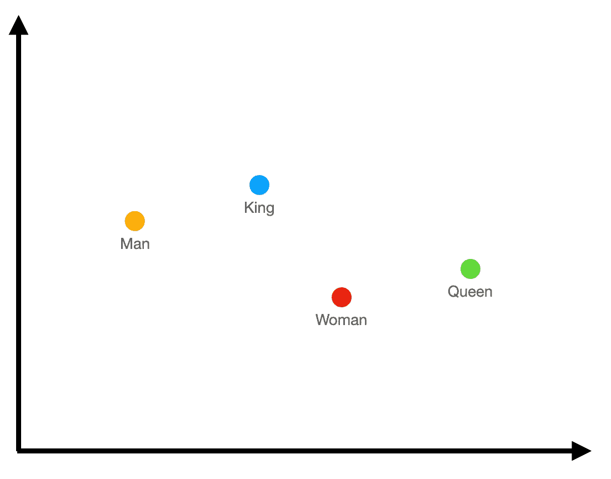
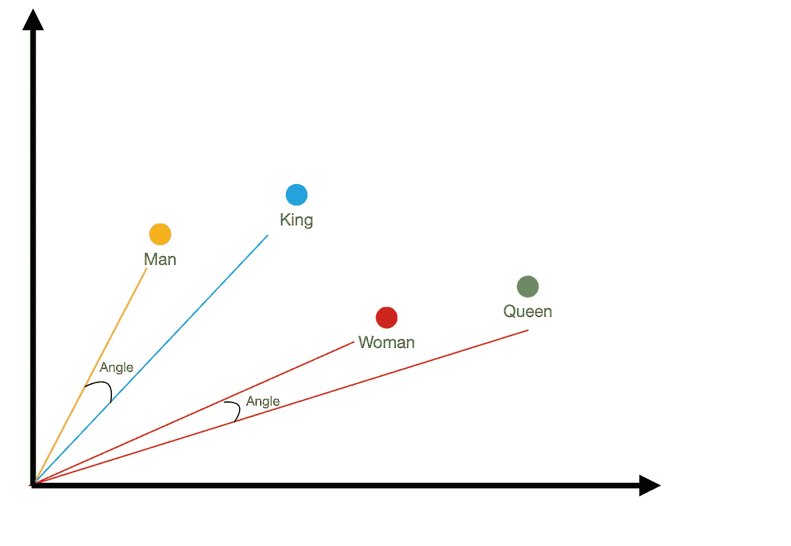

# 🦜🔗 LangChain：文档上的问答代理

> 原文：[`towardsdatascience.com/langchain-question-answering-agent-over-docs-18e5585bdbd3`](https://towardsdatascience.com/langchain-question-answering-agent-over-docs-18e5585bdbd3)


由 [Mike Alonzo](https://unsplash.com/@mikezo?utm_source=medium&utm_medium=referral) 提供的照片，来自 [Unsplash](https://unsplash.com/?utm_source=medium&utm_medium=referral)

## 了解嵌入和代理以构建问答应用

[](https://medium.com/@marcellopoliti?source=post_page-----18e5585bdbd3--------------------------------)[](https://towardsdatascience.com/?source=post_page-----18e5585bdbd3--------------------------------) [Marcello Politi](https://medium.com/@marcellopoliti?source=post_page-----18e5585bdbd3--------------------------------)

·发表于 [Towards Data Science](https://towardsdatascience.com/?source=post_page-----18e5585bdbd3--------------------------------) ·6 分钟阅读·2023 年 6 月 4 日

--

## 介绍

在自然语言处理领域，最常见的用例之一是**与文档相关的问答**。例如，想象一下将一个或多个 PDF 文件输入到机器中，然后询问与这些文件相关的问题。这可能很有用，比如当你需要为大学考试做准备时，并且想要向机器询问你不理解的内容。实际上，一个更高级的用例是让机器向你提问，进行一种模拟审问。

为了解决这个任务，已经做了大量研究并开发了许多工具，但今天我们可以利用大型语言模型（LLMs）的力量，例如 OpenAI 的 GPT-3 及更高版本。

LangChain 是一个非常新的库，它允许我们管理和创建基于 LLM 的应用程序。实际上，**LLM 只是一个更复杂的 AI 架构中的一部分**。当我们创建这样一个系统时，我们不仅需要向 OpenAI 模型提出查询并获得响应，还需要例如保存这个响应、正确结构化提示等。

在这篇文章中，我们将看到如何使用 LangChain 和 OpenAI 构建一个简单的文档问答应用。

## 嵌入

在这个应用中，我们将使用一个叫做 ChromaDB 的库。这是一个开源库，允许我们保存嵌入。这里可能会出现一个问题：**那么什么是嵌入？**

**嵌入不过是词（或文本）在向量空间中的投影**。

我尝试用更简单的方式来解释自己。假设我们有以下几个词可用：“king”，“queen”，“man”和“woman”。

我们根据经验直观地理解这些词之间的距离。例如，“man”在概念上比“queen”更接近“king”。但机器不具备直观能力，它们需要数据和指标来工作。所以我们做的是将这些词转化为笛卡尔空间中的数据，以便准确表示这种直观的距离概念。



嵌入示例（图片由作者提供）

在上面的图像中，我们有一个嵌入（虚拟）的示例。我们看到“Man”比其他单词更接近“King”，同样“woman”和“queen”也是如此。

另一个有趣的事情是**“man”和“king”之间的距离与“woman”和“queen”之间的距离是相同的**。所以某种程度上，这个嵌入确实捕捉到了这些词的本质。

另一个需要说明的事情是度量标准，即如何测量**距离**。在大多数情况下，这是使用**余弦相似度**来测量的，即使用两个嵌入之间角度的余弦值。



余弦相似度（图片由作者提供）

我在示例中的嵌入只有两个维度，两条轴。但现代算法如 BERT 创建的嵌入有**数百或数千条轴**，所以很难理解算法为什么将文本放置在空间中的特定位置。

在这个[演示](https://www.cs.cmu.edu/~dst/WordEmbeddingDemo/)中，你可以在 3 维空间中导航真实的嵌入，并查看单词彼此之间的距离。

## 让我们开始编程吧！

首先，我们需要安装一些库。我们肯定需要 Langchain 和 OpenAI 来实例化和管理 LLM。

然后我们将安装 ChromaDB 和 TikToken（后者是成功安装 ChromaDB 所必需的）

```py
!pip install langchain
!pip install openai
!pip install chromadb
!pip install tiktoken
```

现在我们需要一个我们要处理的文本文件。事实上，我们的目的是向 LLM 提问有关这个文件的内容。用 Python 下载文件非常简单，可以使用以下命令完成。

```py
import requests

text_url = 'https://raw.githubusercontent.com/hwchase17/chat-your-data/master/state_of_the_union.txt'
response = requests.get(text_url)

#let'extract only the text from the response
data = response.text
```

现在我们导入所有需要的类。

```py
from langchain.embeddings.openai import OpenAIEmbeddings
from langchain.embeddings.cohere import CohereEmbeddings
from langchain.text_splitter import CharacterTextSplitter
from langchain.vectorstores.elastic_vector_search import ElasticVectorSearch
from langchain.vectorstores import Chroma
```

显然，要使用 OpenAI 的模板，你必须输入你的个人 API KEY。如果你不知道怎么做，可以查看[我关于 Langchain 的上一篇文章](https://medium.com/towards-data-science/develop-applications-powered-by-language-models-with-langchain-d2f7a1d1ad1a)。

```py
import os
os.environ["OPENAI_API_KEY"] = "your_open_ai_key"
```

在实际应用中，你可能会有很多文本文件，你希望 LLM 找出这些文本中哪个包含你问题的答案。在这个简单的例子中，**我们将单个文本文件分成多个部分（块），并将每个部分视为不同的文档**。模型需要找出哪个部分包含我们问题的答案。我们通过使用下面的命令将文本分成多个部分，每部分分配一个最大长度。

```py
text_splitter = CharacterTextSplitter(chunk_size=1000, chunk_overlap=0)
texts = text_splitter.split_text(data)
```

```py
len(texts)
```

我们看到从原始文本创建了 64 个部分。

我们可以逐个打印不同的部分，因为它们被包含在一个列表中。

```py
texts[0],texts[1]
```

现在我们创建一个对象，用于保存创建的文本各个部分的嵌入。

```py
embeddings = OpenAIEmbeddings()
```

但我们希望**将嵌入保存到一个持久化的数据库中**，因为每次打开应用程序时重新创建它们会浪费资源。这就是 ChromaDB 帮助我们的地方。我们可以使用文本片段创建和保存嵌入，并为每个片段添加元数据。在这里，元数据将是命名每个文本片段的字符串。

```py
persist_directory = 'db'
docsearch = Chroma.from_texts(
    texts, 
    embeddings,
    persist_directory = persist_directory,
    metadatas=[{"source": f"{i}-pl"} for i in range(len(texts))]
    )
```

```py
from langchain.chains import RetrievalQAWithSourcesChain
```

现在我们希望将 docsearch 转变为检索，因为这将是它的目的。

```py
from langchain import OpenAI

#convert the vectorstore to a retriever
retriever=docsearch.as_retriever()
```

我们还可以查看检索器使用的距离度量，在这种情况下，默认的度量是相似度，如嵌入部分所解释的。

```py
retriever.search_type
```

最后，我们可以要求检索器选择最能回答我们查询的文档。如果有必要，检索器也可以选择多于一份文档。

```py
docs = retriever.get_relevant_documents("What did the president say about Justice Breyer")
```

现在我们来看一下他提取了多少文档以及这些文档的内容。

```py
len(docs)
```

```py
docs
```

现在我们可以创建一个代理。 **代理能够执行一系列步骤来独立完成用户的任务**。我们的代理需要去查看可用的文档，找出回答问题的文档，并返回该文档。

```py
#create the chain to answer questions
chain = RetrievalQAWithSourcesChain.from_chain_type(
    llm = OpenAI(temperature=0), 
    chain_type="stuff", 
    retriever=retriever,
    return_source_documents = True
    )
```

如果需要，我们还可以创建一个函数来后处理代理的输出，以使其更易读。

```py
def process_result(result):
  print(result['answer'])
  print("\n\n Sources : ",result['sources'] )
  print(result['sources'])
```

现在一切终于准备好了，我们可以使用我们的代理来回答我们的查询！

```py
question = "What did the president say about Justice Breyer"
result = chain({"question": question})
process_result(result)
```

# 结束语

在这篇文章中，我们介绍了 LangChain、ChromaDB 以及一些关于嵌入的解释。我们通过一个简单的例子展示了如何将多个文档或文档的部分的嵌入保存到持久化数据库中，并检索所需的部分来回答用户查询。

如果你觉得这篇文章有用，可以在 Medium 上关注我！ [😉](https://emojipedia.org/it/apple/ios-15.4/faccina-che-fa-l-occhiolino/)

# 结束

*马切洛·波利提*

[Linkedin](https://www.linkedin.com/in/marcello-politi/)、[Twitter](https://twitter.com/_March08_)、[Website](https://marcello-politi.super.site/)
