# 语言模型及其相关：Gorilla、HuggingGPT、TaskMatrix 及更多

> 原文：[`towardsdatascience.com/language-models-and-friends-gorilla-hugginggpt-taskmatrix-and-more-b88c1200afd3`](https://towardsdatascience.com/language-models-and-friends-gorilla-hugginggpt-taskmatrix-and-more-b88c1200afd3)

## 当我们给 LLMs 访问成千上万的深度学习模型时，会发生什么？

 [Cameron R. Wolfe, Ph.D.](https://wolfecameron.medium.com/?source=post_page-----b88c1200afd3--------------------------------)

·发表于 [Towards Data Science](https://towardsdatascience.com/?source=post_page-----b88c1200afd3--------------------------------) ·阅读时间 18 分钟·2023 年 9 月 4 日

--

（图片由 [Mike Arney](https://unsplash.com/@mikearney?utm_source=unsplash&utm_medium=referral&utm_content=creditCopyText) 提供，来自 [Unsplash](https://unsplash.com/photos/rJ5vHo8gr2U?utm_source=unsplash&utm_medium=referral&utm_content=creditCopyText)）

最近，我们见证了基础模型在深度学习研究中日益流行。预训练的大型语言模型（LLMs）引领了一个新范式，在这种范式中，一个模型可以用来——以令人惊讶的成功——解决许多不同的问题。然而，尽管通用 LLMs 很受欢迎，但任务特定的微调模型往往比利用基础模型的方法表现更佳。简单来说，*专业化模型仍然很难被超越*！话虽如此，我们可能会开始想知道，基础模型和专业深度学习模型的能力是否可以结合起来。在这次概述中，我们将研究近期的研究，这些研究通过学习调用其关联的 API，将 LLMs 与其他专业化深度学习模型结合起来。结果框架将语言模型作为一个集中控制器，用于制定解决复杂 AI 相关任务的计划，并将解决方案过程中的专业部分委派给更合适的模型。

> “通过仅提供模型描述，HuggingGPT 能够持续且方便地整合来自 AI 社区的各种专家模型，而无需改变任何结构或提示设置。这种开放和持续的方式使我们离实现人工通用智能更进一步。” *— 引自 [2]*

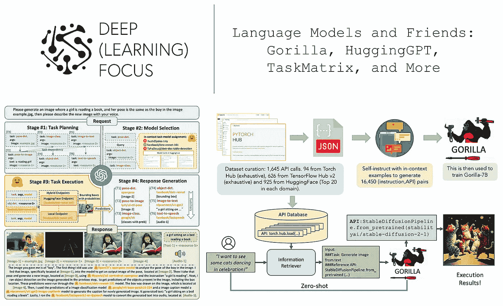

（引自 [2, 3]）

# 背景

在探索语言模型如何与其他深度学习模型集成之前，我们需要涵盖一些背景概念，如 LLM 工具、信息检索和自我指导 [11]。有关语言模型的更多通用背景信息，请查看以下资源。

+   语言建模基础（GPT 和 GPT-2） [[link](https://cameronrwolfe.substack.com/p/language-models-gpt-and-gpt-2)]

+   语言模型规模的重要性（GPT-3） [[link](https://cameronrwolfe.substack.com/p/language-model-scaling-laws-and-gpt)]

+   现代 [[link](https://cameronrwolfe.substack.com/p/modern-llms-mt-nlg-chinchilla-gopher)] 和专业 [[link](https://cameronrwolfe.substack.com/p/specialized-llms-chatgpt-lamda-galactica)] LLMs

+   基础的 [[link](https://cameronrwolfe.substack.com/p/practical-prompt-engineering-part)] 和高级的 [[link](https://cameronrwolfe.substack.com/p/advanced-prompt-engineering)] 提示工程

## 使用工具与 LLMs

> “通过赋予 LLMs 使用工具的能力，我们可以访问更广泛且不断变化的知识库，并完成复杂的计算任务。” *— 摘自[3]*

尽管语言模型拥有许多令人印象深刻的能力，但它们并不完美，不能独立完成所有任务。在许多情况下，将现有模型与工具（例如搜索引擎、计算器、日历等）结合使用，可以大幅扩展它们的能力范围。在之前的综述中，我们探讨了 Toolformer [1]——一种用于教会 LLMs 使用一小组简单文本 API 的微调技术——以及如何在不费太大力气的情况下使用工具来提高 LLMs 的表现；更多细节请见[这里](https://cameronrwolfe.substack.com/p/teaching-language-models-to-use-tools)。

尽管像 Toolformer 这样的模型很有效，但它们只考虑了一小组非常简单的 API。这些 API 仅仅触及了可以提供给 LLMs 的工具总数的表面。例如，想象一下，如果我们能够将 LLM 与任何通过互联网提供的 API 集成——*我们可能会解锁一个全新的应用和可能性的领域*！

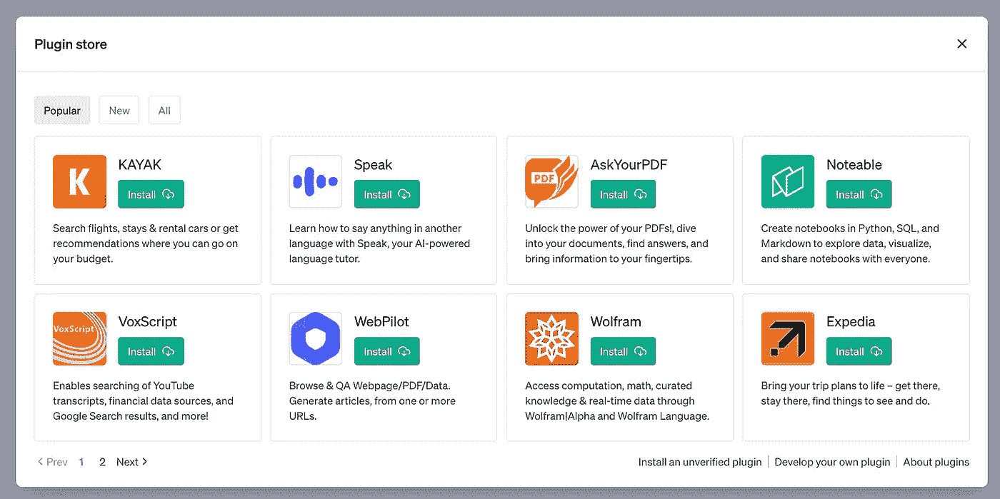

ChatGPT Plus 插件商店中的热门应用

**（几乎）任何事都有可能！** 这种将语言模型与各种在线 API 广泛接入的趋势正在通过 ChatGPT 插件商店进行探索；见上文。通过利用这些 API，我们可以做的不仅仅是为 LLMs 提供简单的工具，如计算器！我们可以轻松想到几个通过这种方法变得可能的高影响力应用。例如，我们可以使用集成工具的语言模型进行：

+   制定假期行程并预订所有必要的票和预订

+   策划并购买本周的食品杂货清单以便路边取货

+   查找并预订即将到来的周末餐厅的桌子

+   在任何电子商务商店发现并购买相关产品

可能性范围几乎是无限的！通过将语言作为一种标准化的交流媒介，我们可以与基础模型如 ChatGPT 合作，完成令人惊讶的复杂任务。我们所要做的就是[提示模型](https://cameronrwolfe.substack.com/i/123558334/using-tools-is-getting-easier)生成与我们请求相关的 API 调用。

**深度学习 API。** 在本概述中，我们将考虑将 LLMs 与一种特定类型的 API 集成——这些 API 提供对平台如[HuggingFace](https://huggingface.co/)上的开源深度学习模型的访问。AI/ML 社区对开源软件给予了高度重视，这意味着许多最强大的深度学习模型在线上免费提供。通常，这些模型附带有良好撰写的描述，称为[模型卡](https://huggingface.co/docs/hub/model-cards)，可以用来为 LLM 提供任何模型所需的所有信息。然后，这些模型可以通过基本的提示技术轻松与 LLM 集成。

## 自我指令框架

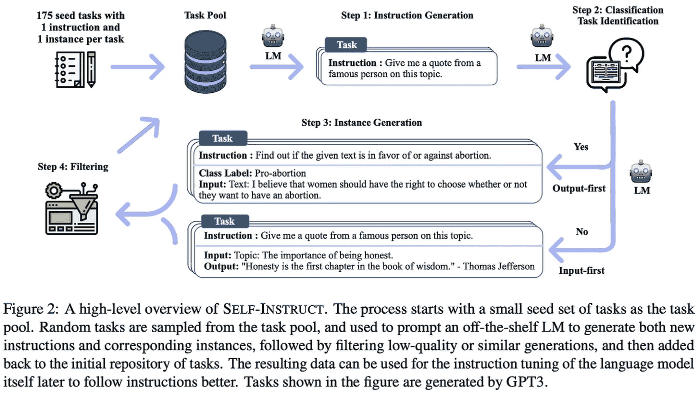

（来自[11]）

自我指令框架，在[11]中提出，开创了利用大型语言模型（LLMs）通过生成合成的[指令调优](https://twitter.com/cwolferesearch/status/1652064977493057545?s=20)数据来进行自我训练的想法。这些数据可以用于微调。从与特定任务或指令相关的单一输入-输出对开始，自我指令会提示一个现成的 LLM 生成新的任务，以及与每个任务相关的有效指令和响应。在进行过滤以去除低质量数据后，我们可以在生成的指令调优数据集上对任何语言模型进行微调。有趣的是，我们发现，基于这些数据进行微调的模型往往能达到与那些在人工策划数据集上训练的模型相匹配的性能。尽管自我指令效果良好，[Alpaca](https://cameronrwolfe.substack.com/i/114077195/alpaca-an-instruction-following-llama-model) [12]也提出了一些对整体框架的改进；详情见[这里](https://github.com/tatsu-lab/stanford_alpaca#data-generation-process)。

## 信息检索

正如我们在之前的概述中看到的，基础语言模型的质量往往随着[规模的增加而提升](https://twitter.com/cwolferesearch/status/1635693551584522256?s=20)——大型预训练数据集和模型会带来最佳结果。然而，我们只能在语言模型中固定的权重集合中存储有限的信息。*即使是大规模模型也有有限数量的参数*。此外，现代 LLM 的有限上下文窗口限制了我们只能将少量信息注入到模型的提示中。那么，*如果我们想让 LLM 访问大量的信息库，该怎么办*？我们需要采用某种形式的信息检索。

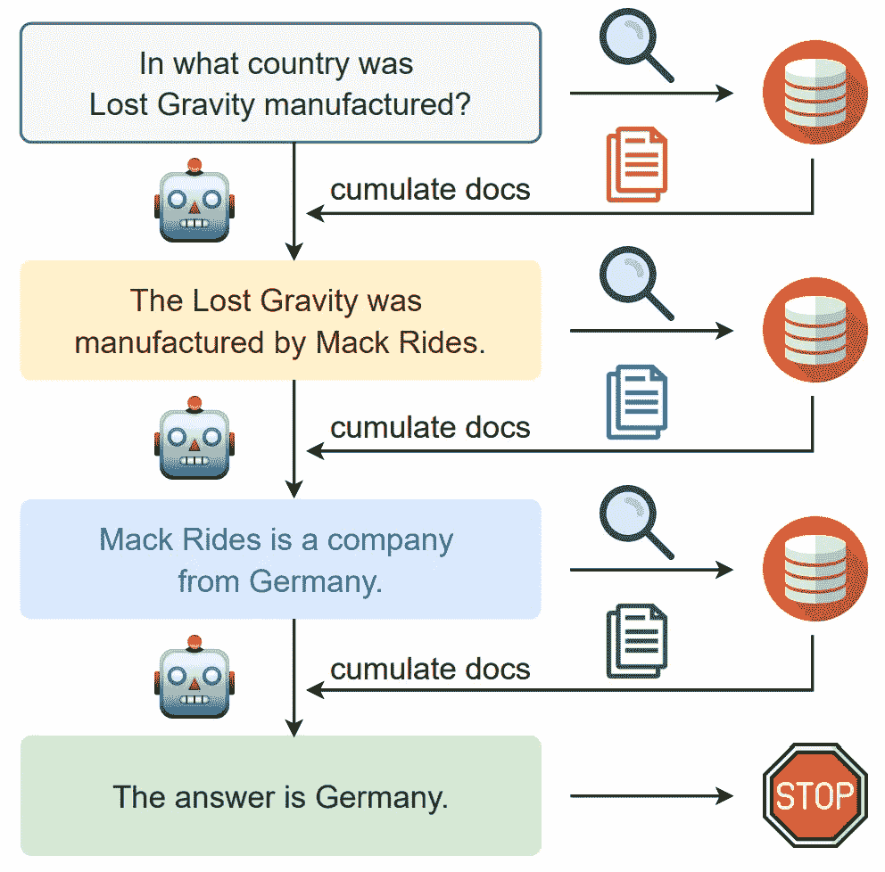

（来自[13]）

**向量数据库。** 一种流行的信息检索形式可以通过将 LLM 与存储大量文本信息的向量数据库集成来完成。在高级别上，这种与向量数据库（例如，[Pinecone](https://www.pinecone.io/)、[Milvus](https://milvus.io/)、[Weaviate](https://weaviate.io/)、[Redis](https://redis.io/docs/stack/search/reference/vectors/)等）的集成包括：

1.  将文本分块成小部分。

1.  为每个文本片段生成[嵌入](https://platform.openai.com/docs/guides/embeddings)。

1.  将这些嵌入存储在向量数据库中。

1.  执行[向量相似性搜索](https://www.pinecone.io/learn/what-is-similarity-search/)（基于这些嵌入）来查找相关的文本片段以包含在提示中。

最终结果是，我们可以快速找到相关的文本信息，作为提示中的额外上下文，使 LLM 能够利用超出其[上下文窗口](https://cameronrwolfe.substack.com/i/117151147/what-is-prompt-engineering)的额外信息。尽管我们仍然无法将所有信息提供给模型，但我们可以使用向量相似性搜索快速识别最相关的部分。

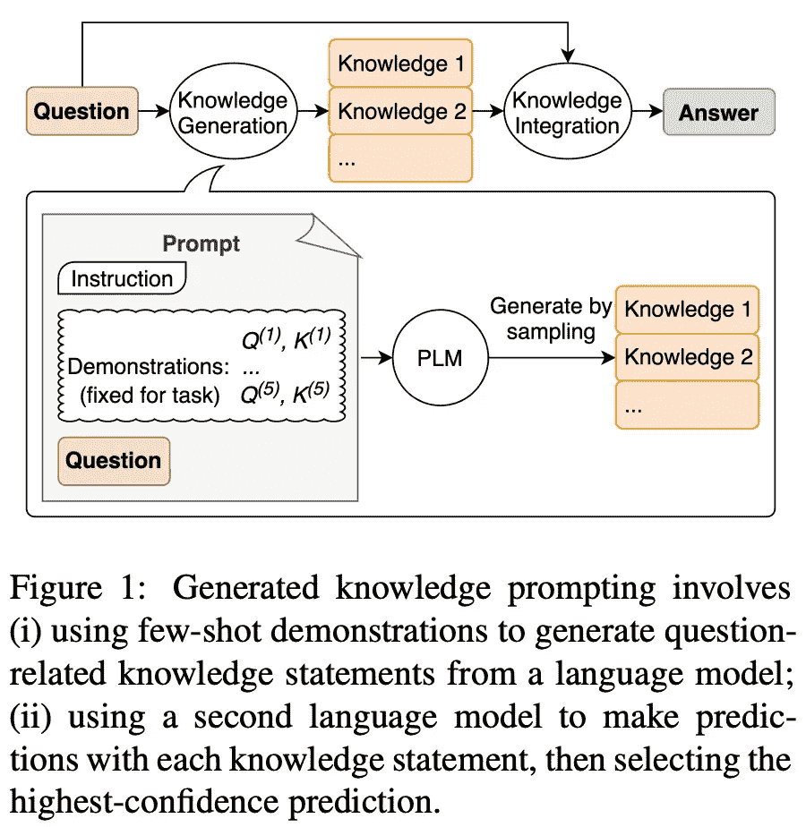

（来自[14]）

**这就是唯一的方法吗？** 许多其他方法已被提出用于信息检索——这方面有一个专门的（非常活跃的）研究领域。我们甚至可以使用 LLMs 生成相关信息（而不是检索）通过[生成知识提示](https://cameronrwolfe.substack.com/i/118401596/knowledge-augmentation)；见上文。文章[这里](https://jxmo.io/posts/retrieval)很好地总结了现有的信息检索技术。总体而言，存在许多不同的技术，我们有很多选择来决定如何用外部信息源来增强 LLM。

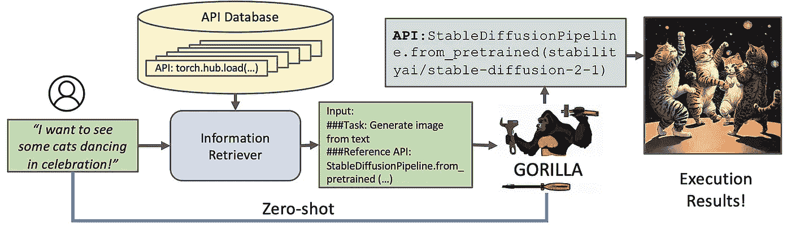

（来自[3]）

**我们为什么要关心这个问题？** 信息检索非常重要，但我们可能会想知道这与将 LLMs 与其他深度学习模型整合的主题有何相关。好吧，*如果我们想要提供对任何在线可用模型的访问呢？* 在像 HuggingFace 这样的 ML 社区中，有成千上万的模型！因此，我们不能为所有这些模型提供描述给 LLM。相反，我们需要使用某种形式的信息检索来确定我们应该包含在 LLM 提示中的最相关的模型子集；见上文。

# 将 LLMs 与其他模型集成

现在我们已经掌握了一些相关背景信息，我们将查看最近的出版物，这些出版物增强了 LLMs 与其他深度学习模型的结合。虽然每种方法有所不同 [2, 3]，但所有这些技术的目标都是教会 LLM 如何调用与其他专业模型相关的 API。然后，LLM 可以作为一个控制器（或大脑），通过规划和将子任务委派给不同的 API 来协调问题的解决。

## [HuggingGPT: 用 ChatGPT 及其在 Hugging Face 的朋友解决 AI 任务](https://arxiv.org/abs/2303.17580) [2]

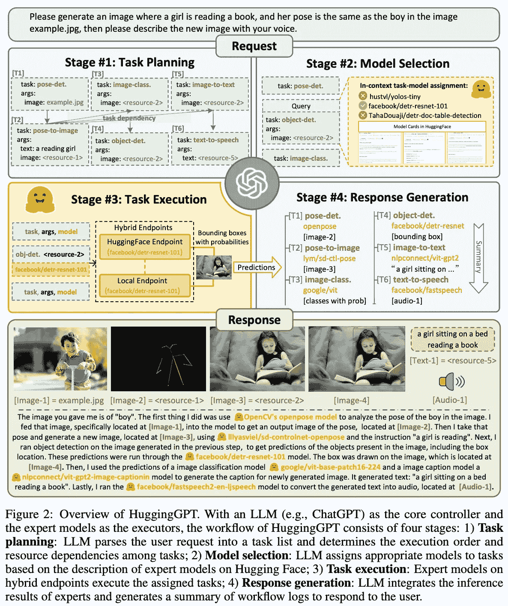

(来自 [2])

最近 LLMs 变得流行，但近年来深度学习研究已经产生了多种非常有用的模型，用于解决特定任务，如图像识别、视频动作检测、文本分类等等。这些模型不同于语言模型，它们是狭义的专家，这意味着它们可以在固定的输入输出格式下准确地解决特定任务。但它们对于超出其训练解决的特定任务范围的内容没有用处。*如果我们想将这些模型重新利用作为解决更多开放式 AI 相关任务的组件呢？*

> “LLMs [可以] 作为一个控制器来管理现有的 AI 模型以解决复杂的 AI 任务，而语言可以是一个通用接口来实现这一点。” *— 来自 [2]*

在 [2] 中，作者探索了将 LLMs 用作连接深度学习模型的通用接口。HuggingGPT [2] 的灵感来自于允许 LLM 与具有不同专业能力的外部模型进行协调的想法。简单来说，LLM 作为问题解决系统的“大脑”，计划如何解决问题，并协调不同深度学习模型之间的努力，这些模型解决了该问题所需的子任务。为了教会 LLM 如何做到这一点，我们需要每个模型的高质量描述。幸运的是，我们不需要进行任何提示工程来创建这些描述——它们通过像 HuggingFace 这样的 ML 社区 [广泛提供](https://huggingface.co/docs/hub/model-cards#what-are-model-cards)！

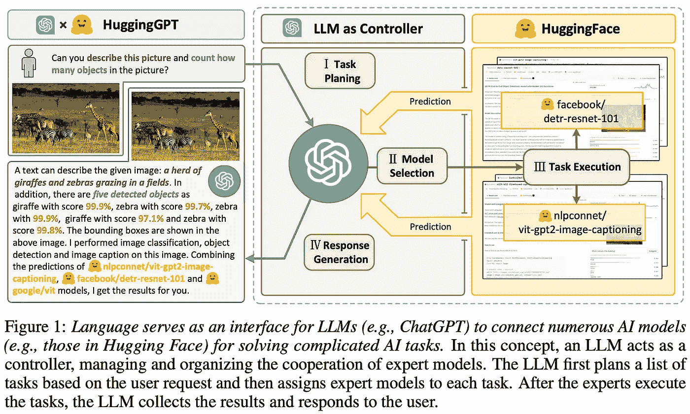

(来自 [2])

**这怎么运作？** HuggingGPT [2] 将问题分解为四个部分：

+   *任务规划*：使用 LLM 将用户请求分解为可解决的任务。

+   *模型选择*：从 HuggingFace 中选择用于解决任务的模型。

+   *任务执行*：运行每个选定的模型并将结果返回给 LLM。

+   *响应生成*：使用 LLM 为用户生成最终响应。

正如我们可能预期的那样，利用在线模型的能力赋予了 HuggingGPT 解决各种复杂问题的能力！

> “HuggingGPT 可以根据用户请求自动生成计划，并使用外部模型，因此可以整合多模态感知能力并处理多个复杂的 AI 任务。” *— 来自 [2]*

相当令人印象深刻的是，HuggingGPT 完全不需要微调就能学习如何协调和使用这些模型！相反，它利用了 [少量学习](https://cameronrwolfe.substack.com/i/117151147/few-shot-learning) 和 [指令提示](https://cameronrwolfe.substack.com/i/117151147/instruction-prompting) 来执行解决问题所需的每一个任务；见下文。为了使这些提示发挥良好效果，我们需要一个 [可调节](https://twitter.com/cwolferesearch/status/1645535868021805056?s=20) 的 LLM（例如 ChatGPT 或 GPT-4），它能够严格遵守指令并执行严格的输出格式（例如，将问题分解为 json 格式的任务）。

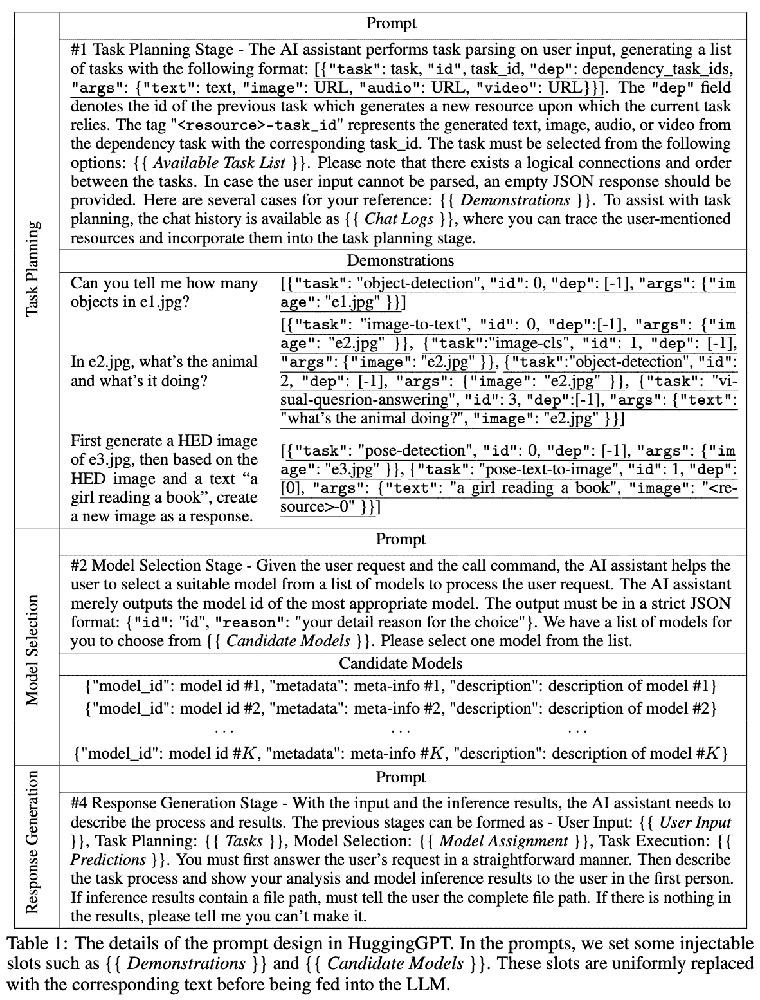

（来源 [2]）

值得注意的是，我们应当观察到，供 HuggingGPT 使用的可用模型集直接注入到任务规划提示中；见上例。显然，网上有太多模型可用，无法将它们全部包含在提示中。为了决定应将哪些模型作为选项包含在提示中，HuggingGPT 根据任务类型（即，它们是否解决与当前问题相关的任务）选择一组模型，根据下载量（即，在 HuggingFace 上下载或使用该模型的用户数量）对它们进行排名，然后将排名前 `K` 的模型提供给 LLM 作为选项。

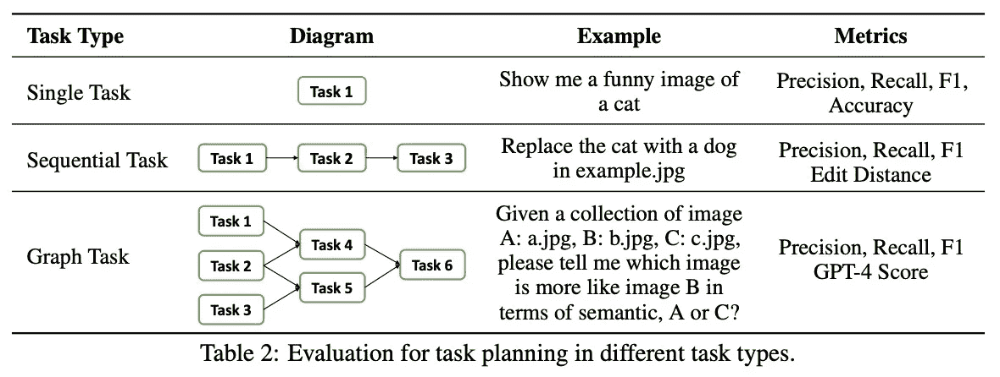

（来源 [2]）

**资源依赖。** 在 HuggingGPT 将用户请求分解为几个解决步骤后，我们需要在指定的计划中执行每个模型。然而，当我们执行 HuggingGPT 指定的每个模型时，一些模型可能依赖于其他模型的输出，这在 [2] 中被称为“资源依赖”。为了处理这些情况，具有依赖关系的模型会等待它们所依赖的模型的输出后再执行。没有依赖关系的模型可以并行执行，从而加快 HuggingGPT 的任务执行步骤。有趣的是，LLM 生成的任务规划结构不仅改变了每个模型的执行顺序，还改变了我们评估 HuggingGPT 输出的方式。例如，[2] 中的作者使用 GPT-4 来评估更复杂任务计划的质量；见上文。

**它表现得好吗？** 在 [2] 中对 HuggingGPT 的评估专注于评估几个不同 LLM 的任务规划能力，因为任务规划的质量在很大程度上决定了 HuggingGPT 整体问题解决框架的成功。如下面的图所示，像 GPT-3.5 这样的 LLM（以及在一定程度上较弱的模型）似乎能够有效地将用户请求分解为有效的任务计划。

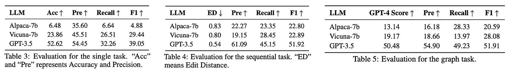

（来源 [2]）

需要大量工作来改进对这些技术的评估 — [2] 中提供的分析远非全面。此外，尽管 HuggingGPT 表现良好，但它只考虑了一小部分直接注入 LLM 提示中的、文档完善的模型 API。与微调相比，这一框架需要大量的提示工程来有效运作。尽管我们避免了对微调数据集的需求，但这一框架在很大程度上依赖于基础模型的能力。因此，我们可能会想：*我们如何将这种方法推广到更多模型中以更可靠地工作？*

## [猩猩：与大量 API 连接的大型语言模型](https://arxiv.org/abs/2305.15334) [3]

> “支持可能数百万个不断变化的 API 的网络规模集合需要重新思考我们整合工具的方法。” *— 引自 [3]*

将 LLM 与一组较小且固定的其他模型进行整合是很酷的，但*如果我们能够教会 LLM 使用任何在线可用的模型 API 呢？* 为此，我们可以使用检索技术 *i)* 识别相关模型 API 和 *ii)* 将它们的文档提供给 LLM。通过这种方法，LLM 将能够访问比少量精心挑选的工具更多的资源！而是，模型可以访问云中不断变化的大量 API。然而，尽管如此，即便是强大的 LLM（例如，[GPT-4](https://openai.com/research/gpt-4) 或 [Claude](https://www.anthropic.com/index/introducing-claude)）也难以以这种方式利用 API，因为它们倾向于传递不正确的参数或虚构调用不存在的 API；见下文。

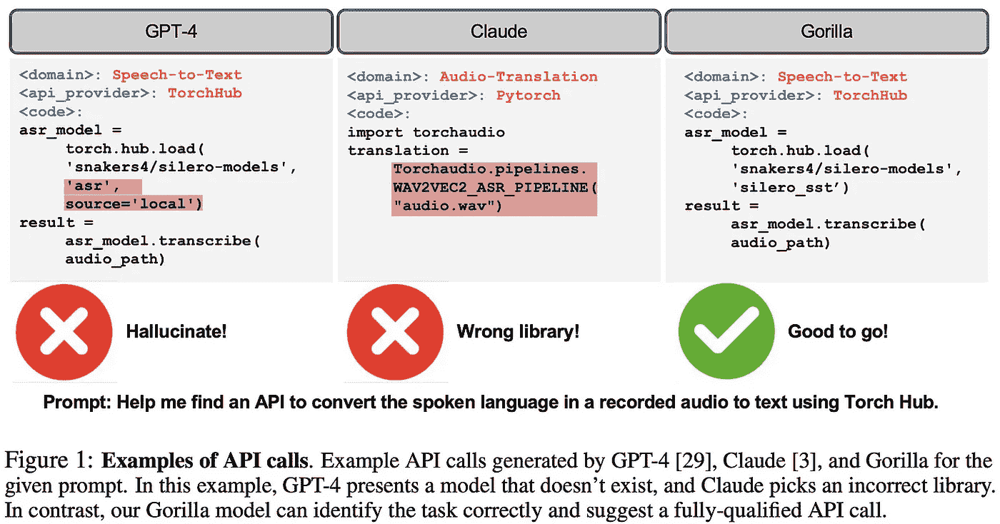

（引自 [3]）

在 [3] 中，作者采用了基于自我指导 [11] 框架的微调方法，以使 LLM 更有能力利用大量外部深度学习 API。超越像 HuggingGPT [2] 这样的提案， [3] 中的作者考虑了超过 1,600 个不同的模型 API。这些模型 API 的集合比之前工作的模型 API 要大得多，功能重叠（即，许多模型执行类似的任务），甚至包括一些文档不完美的模型。为了学习如何利用这些 API， [3] 的工作在一个有效 API 调用的大型数据集上对 [LLaMA-7B](https://cameronrwolfe.substack.com/p/llama-llms-for-everyone) [5] 模型进行了微调。最终的模型，能够有效利用这些 API，被称为猩猩。

**创建数据集。** 为了微调 Gorilla，我们利用 [HuggingFace Hub](https://huggingface.co/docs/hub/index)、[PyTorch Hub](https://pytorch.org/hub/) 和 [TensorFlow Hub](https://www.tensorflow.org/hub) 创建了一个大规模的 API 调用语料库。在所有三个中心中，选择了总共 1,645 个模型 API，涵盖了从计算机视觉到音频、强化学习等多个领域。在将每个 API 的相关信息存储在一个 json 对象中（即包含领域、框架、功能描述和 API 签名等信息）后，我们可以通过使用 GPT-4 生成十个用户问题提示和相关回答来遵循自我指导的方法。经过过滤错误的 API 调用后，结果就是一个大数据集，涵盖了利用不同模型 API 解决各种问题的实际用例。这个数据集非常适合微调 LLM；见下文。

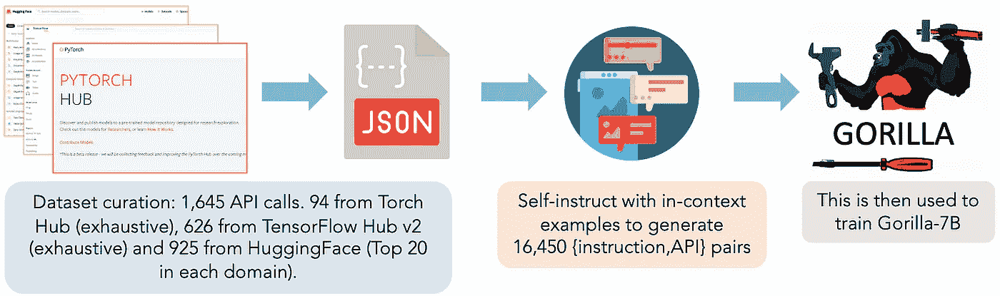

(来源 [3])

**检索感知的微调。** 不同于执行“普通”的监督微调，Gorilla 利用了一种“检索感知”的微调变体。这听起来可能很高端，但实际实现非常简单！对于微调数据集中的每次模型 API 调用，我们在数据中添加了最新的 API 文档。然后，我们在测试时采取类似的方法，将 API 文档附加到我们的提示中，这教会 LLM 动态确定每个 API 的正确使用方法；见下文。

(来源 [3])

检索感知微调是一种技术，教会 LLM 在确定如何解决问题时更好地利用 API 文档。这种动态方法允许 LLM：

+   在测试时适应 API 文档中的实时变化

+   发展改进的 [上下文学习](https://cameronrwolfe.substack.com/i/123558334/different-types-of-learning) 能力以进行 API 调用

+   通过更好地关注 API 文档中的信息来减少幻觉

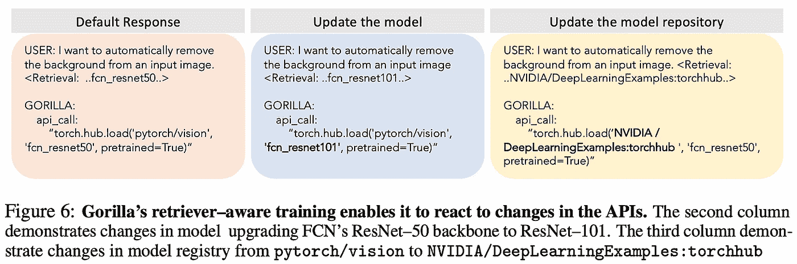

(来源 [3])

检索感知的微调使 Gorilla 成为利用各种不同深度学习模型的极其强大的接口——生成的 LLM 可以使用大量不同的 API 来解决问题。此外，*模型实际上可以适应任何 API 的文档变化！* 请参见上图以获取适应 API 文档变化的示例。

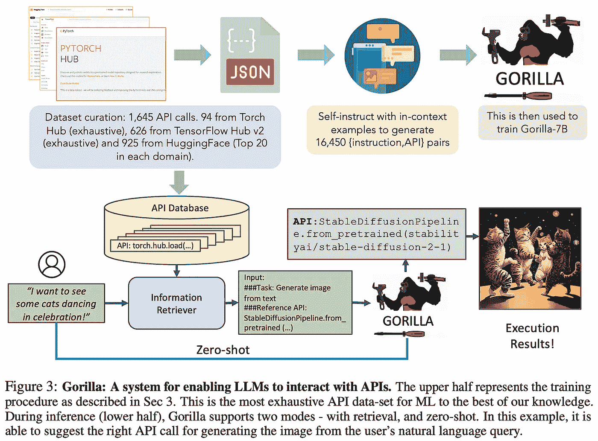

(来源 [3])

**使用 Gorilla。** 尽管我们知道在构建微调数据集时应该在提示中包含哪些 API，但当我们在推理过程中接收到用户的任意提示时，并不知道应该使用哪个合适的 API。为了确定正确的 API，我们可以采用信息检索技术，*i)* 嵌入用户的提示（或其他相关信息），以及 *ii)* 执行向量相似性搜索以找到最相关的 API 文档。通过这种方式，我们可以轻松高效地确定用于解决问题的最佳 API。或者，我们可以通过将用户的提示直接传递给模型，而无需任何信息检索或额外信息，以零-shot 方式使用 Gorilla。无论哪种方式，Gorilla 的目标都是生成准确的调用，以使用最合适的 API 来解决用户的提示；详见上文。

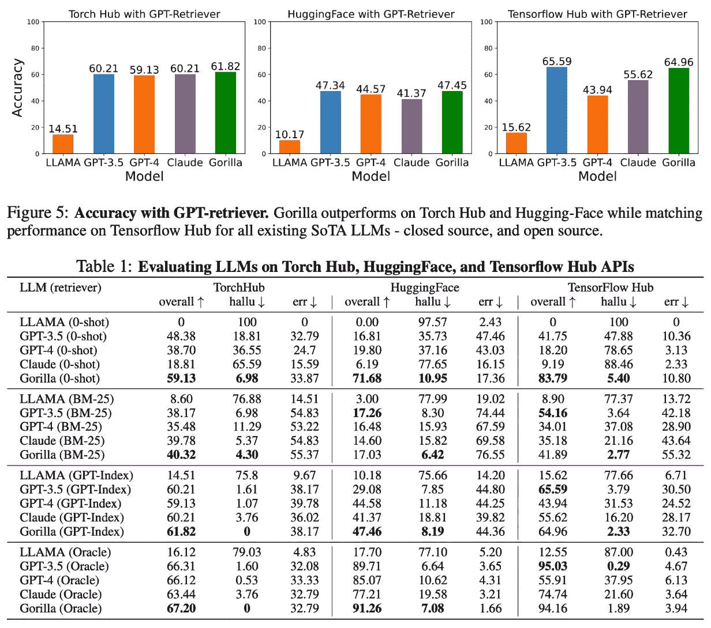

（来自 [3]）

如上实验结果所示，Gorilla 是一个极其有能力的深度学习 API 接口。与更大、更强大的模型（例如 GPT-3.5、Claude 和 GPT-4）相比，我们发现 Gorilla 在生成准确的 API 调用方面更具能力，这意味着模型产生虚假的 API 调用的情况较少，并且更倾向于传递正确的输入参数！

## 其他值得注意的技术……

HuggingGPT [2] 和 Gorilla [3] 在过去几个月中获得了大量公众认可和讨论，但也有许多其他技术被提出，考虑使用 LLMs 来协调多个不同深度学习模型的工作。下面概述了一些其他有趣的技术。

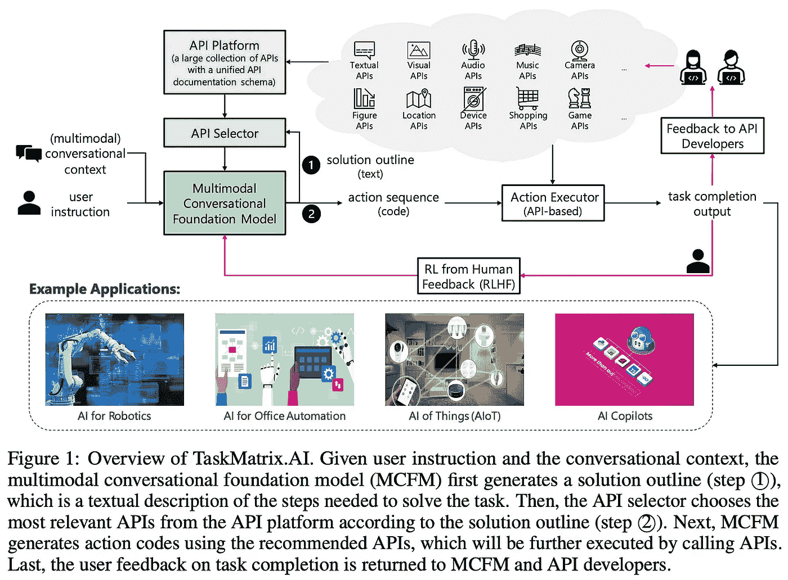

（来自 [7]）

**TaskMatrix [7]** 是一篇立场论文——这意味着它对一个显著问题提出了立场或观点——考虑了将[基础模型](https://crfm.stanford.edu/)（例如，像 ChatGPT 这样的 LLMs）与数百万种不同的 API 进行集成。值得注意的是，这项工作认为基础模型缺乏解决专业任务所需的领域知识，但已有许多现有的、任务特定的模型可以以令人印象深刻的准确性解决指定的任务。由于兼容性问题，将这些专业/专家模型与 LLM 集成可能会很困难，但[7]中的作者广泛讨论并考虑了这一想法。在许多方面，HuggingGPT 和 Gorilla 是[7]中讨论的想法的实际实现。

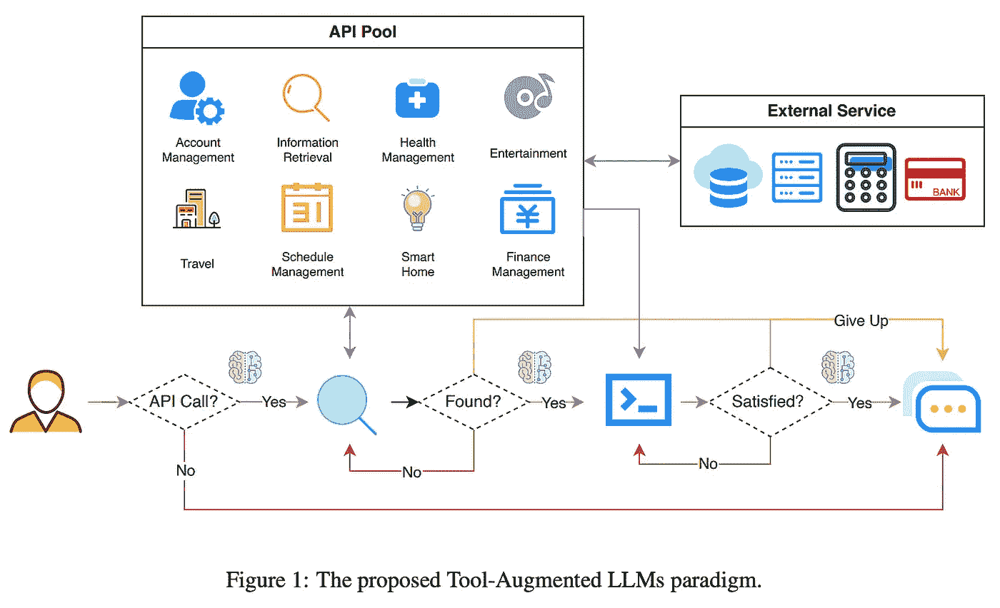

（来自 [8]）

**API Bank [8]** 提供了一个更好的基准来评估工具增强的 LLM。特别是，该基准考虑了 50 多个通常与 LLM 集成的 API 和 264 个标注对话——包括总计 568 次 API 调用——以配合这些工具。该基准旨在评估 LLM 创建任务计划（即，逐步指南，说明要执行哪些 API 调用）、确定正确的 API 以及执行 API 调用以回答提供的问题的能力。毫无意外，初步实验显示，GPT-4 在利用外部工具回答用户提供的问题方面具有最强的能力。尽管这项工作没有特别考虑深度学习模型 API，但所使用的任务框架与本综述中看到的方法相似。

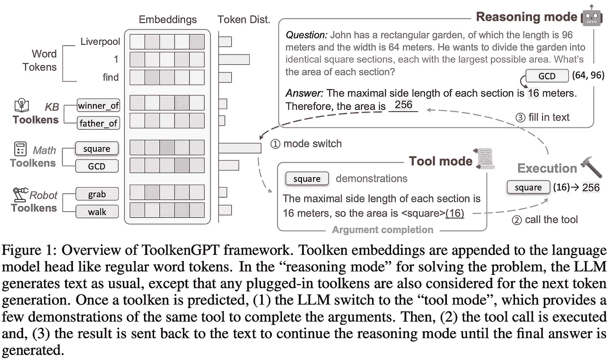

（来自 [9]）

**ToolkenGPT [9]** 尝试通过为每个工具分配一个特定的令牌——以及相关的[token embedding](https://twitter.com/cwolferesearch/status/1659608479089278978?s=20)——来减轻工具跟随基础模型的微调要求，使 LLM 能够以类似生成普通词令牌的方式生成工具请求。这种方法被发现对于利用各种外部工具非常灵活。

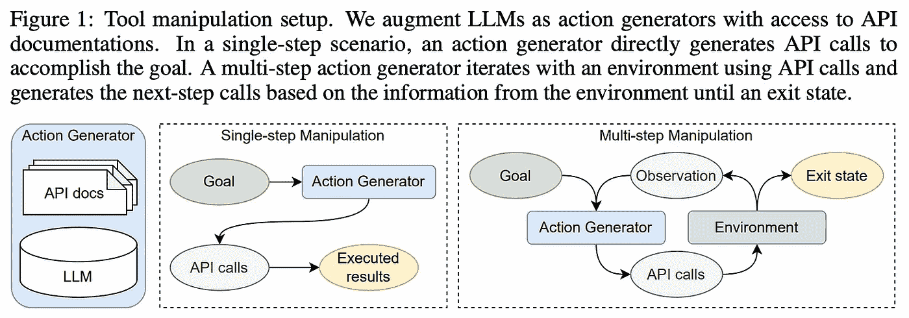

（来自 [10]）

**使用开源 LLM 的工具操作 [10]。** 在大多数情况下，我们发现闭源 LLM（例如，GPT-4）更具[可操控性](https://twitter.com/cwolferesearch/status/1645535868021805056?s=20)，因此能够更好地操作外部工具。然而，在 [10] 中，作者分析了开源 LLM 是否可以通过微调来匹配强大闭源 LLM 在这一特定技能上的表现。各种开源 LLM 通过人类反馈和监督进行优化，以提升其工具跟随能力。有趣的是，我们看到在充分微调的情况下，若干开源模型可以与 GPT-4 达到竞争性表现。在本综述中，我们看到像 Gorilla 这样的模型表明，给定正确的微调程序，开源 LLM（例如，LLaMA）可以非常强大。

# 结束语

> “目前迫切需要一种机制，可以利用基础模型提出任务解决方案的框架，然后自动将框架中的一些子任务与具有特殊功能的现成模型和系统进行匹配，以完成这些任务。” *— 来自 [7]*

在这个概述中，我们已经看到，LLM 能够通过其 API 与其他深度学习模型集成。以 HuggingGPT [2] 为例，这可以通过一种上下文学习方法实现，其中我们向 LLM 提供现有模型及其功能的描述。然而，值得注意的是，HuggingGPT 最适合与强大的闭源模型如 ChatGPT 一起使用。如果我们想要教会开源模型（例如，LLaMA）在解决复杂问题时调用深度学习模型 API，我们需要采用 Gorilla [3] 提出的微调方法。无论如何，这些技术都非常强大，因为它们在狭窄专家模型和基础模型的优势之间取得了平衡。我们可以通过依赖 LLM 进行高级推理和形成问题解决计划，同时将某些子任务委派给更可靠和准确的专业模型，从而发挥两者的优势。

## 与我联系！

非常感谢您阅读这篇文章。我是 [Cameron R. Wolfe](https://cameronrwolfe.me/)，[Rebuy](https://www.rebuyengine.com/) 的 AI 总监。我研究深度学习的经验和理论基础。如果您喜欢这个概述，请订阅我的 [Deep (Learning) Focus newsletter](https://cameronrwolfe.substack.com/)，在这里我通过从基础上概述相关主题来帮助读者理解 AI 研究。您还可以在 [X](https://twitter.com/cwolferesearch) 和 [LinkedIn](https://www.linkedin.com/in/cameron-r-wolfe-ph-d-04744a238/) 上关注我，或者查看我在 Medium 上的 [其他文章](https://medium.com/@wolfecameron)！

## 参考文献

[1] Schick, Timo, 等. “Toolformer: Language models can teach themselves to use tools.” *arXiv preprint arXiv:2302.04761* (2023).

[2] Shen, Yongliang, 等. “Hugginggpt: Solving ai tasks with chatgpt and its friends in huggingface.” *arXiv preprint arXiv:2303.17580* (2023).

[3] Patil, Shishir G., 等. “Gorilla: Large Language Model Connected with Massive APIs.” *arXiv preprint arXiv:2305.15334* (2023).

[4] Wei, Jason, 等. “Chain of thought prompting elicits reasoning in large language models.” *arXiv preprint arXiv:2201.11903* (2022).

[5] Touvron, Hugo, 等. “Llama: Open and efficient foundation language models.” *arXiv preprint arXiv:2302.13971* (2023).

[6] Wang, Yizhong, 等. “Self-Instruct: Aligning Language Model with Self Generated Instructions.” *arXiv preprint arXiv:2212.10560* (2022).

[7] Liang, Yaobo, 等. “Taskmatrix. ai: Completing tasks by connecting foundation models with millions of apis.” *arXiv preprint arXiv:2303.16434* (2023).

[8] Li, Minghao, 等. “Api-bank: A benchmark for tool-augmented llms.” *arXiv preprint arXiv:2304.08244* (2023).

[9] Hao, Shibo, 等. “ToolkenGPT: Augmenting Frozen Language Models with Massive Tools via Tool Embeddings.” *arXiv preprint arXiv:2305.11554* (2023).

[10] Xu, Qiantong, 等. “On the Tool Manipulation Capability of Open-source Large Language Models.” *arXiv preprint arXiv:2305.16504* (2023).

[11] 王一中等人. “Self-Instruct: 将语言模型与自生成指令对齐.” *arXiv 预印本 arXiv:2212.10560* (2022)。

[12] 塔奥里等人. “斯坦福 Alpaca: 一种跟随指令的 LLaMA 模型.” (2023)。

[13] 特里维迪等人. “将检索与思维链推理交替用于知识密集型多步骤问题.” *arXiv 预印本 arXiv:2212.10509* (2022)。

[14] 刘嘉诚等人. “生成知识提示用于常识推理.” *arXiv 预印本 arXiv:2110.08387* (2021)。
