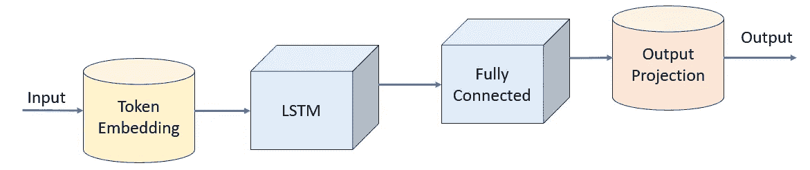
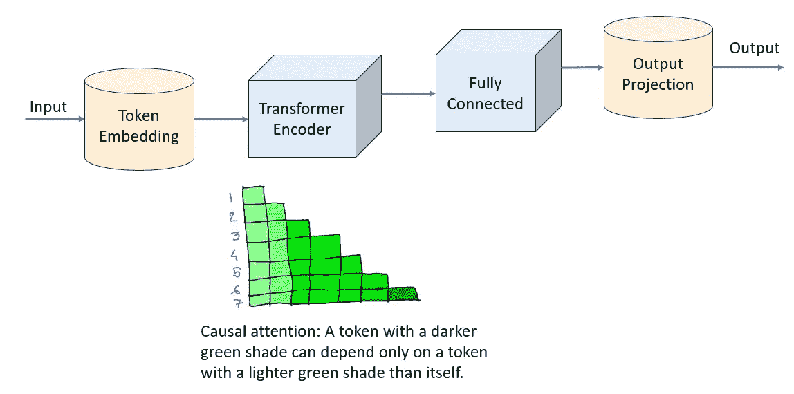

# 用于句子补全的语言模型

> 原文：[`towardsdatascience.com/language-models-for-sentence-completion-6a5298a85e43?source=collection_archive---------5-----------------------#2023-09-15`](https://towardsdatascience.com/language-models-for-sentence-completion-6a5298a85e43?source=collection_archive---------5-----------------------#2023-09-15)

## 语言模型的实际应用，选择最可能的单词来扩展一个英文句子

[](https://medium.com/@dhruvbird?source=post_page-----6a5298a85e43--------------------------------)[](https://towardsdatascience.com/?source=post_page-----6a5298a85e43--------------------------------) [Dhruv Matani](https://medium.com/@dhruvbird?source=post_page-----6a5298a85e43--------------------------------)

·

[关注](https://medium.com/m/signin?actionUrl=https%3A%2F%2Fmedium.com%2F_%2Fsubscribe%2Fuser%2F63f5d5495279&operation=register&redirect=https%3A%2F%2Ftowardsdatascience.com%2Flanguage-models-for-sentence-completion-6a5298a85e43&user=Dhruv+Matani&userId=63f5d5495279&source=post_page-63f5d5495279----6a5298a85e43---------------------post_header-----------) 发表在[Towards Data Science](https://towardsdatascience.com/?source=post_page-----6a5298a85e43--------------------------------) ·13 分钟阅读·2023 年 9 月 15 日[](https://medium.com/m/signin?actionUrl=https%3A%2F%2Fmedium.com%2F_%2Fvote%2Ftowards-data-science%2F6a5298a85e43&operation=register&redirect=https%3A%2F%2Ftowardsdatascience.com%2Flanguage-models-for-sentence-completion-6a5298a85e43&user=Dhruv+Matani&userId=63f5d5495279&source=-----6a5298a85e43---------------------clap_footer-----------)

--

[](https://medium.com/m/signin?actionUrl=https%3A%2F%2Fmedium.com%2F_%2Fbookmark%2Fp%2F6a5298a85e43&operation=register&redirect=https%3A%2F%2Ftowardsdatascience.com%2Flanguage-models-for-sentence-completion-6a5298a85e43&source=-----6a5298a85e43---------------------bookmark_footer-----------)

图片由[Brett Jordan](https://unsplash.com/@brett_jordan?utm_source=medium&utm_medium=referral)拍摄，来源于[Unsplash](https://unsplash.com/?utm_source=medium&utm_medium=referral)

与[Naresh Singh](https://medium.com/@brocolishbroxoli)共同撰写。

# 目录

**介绍**

**问题陈述**

**头脑风暴解决方案**

+   算法与数据结构

+   NLP（自然语言处理）

+   深度学习（神经网络）

**LSTM 模型**

+   分词

+   PyTorch 模型

+   使用模型修剪无效建议

+   计算下一个单词的概率

**变换器模型**

**结论**

# 介绍

语言模型如 GPT 最近变得非常流行，并被用于各种文本生成任务，例如在 ChatGPT 或其他对话式 AI 系统中。这些语言模型非常庞大，通常超过数十亿个参数，需要大量计算资源和金钱来运行。

在英语语言模型的背景下，这些大型模型是[过度参数化的](https://www.reddit.com/r/MachineLearning/comments/ib4rth/d_why_does_models_like_gpt3_or_bert_dont_have/)，因为它们使用模型的参数来记忆和学习我们世界的各个方面，而不仅仅是建模英语语言。如果我们有一个仅需理解语言及其结构的应用，我们很可能可以使用一个更小的模型。

运行训练模型推理的完整代码可以在[这个笔记本中找到](https://github.com/dhruvbird/ml-notebooks/blob/main/next_word_probability/inference-next-word-probability.ipynb)。

# 问题陈述

假设我们正在构建一个滑动键盘系统，尝试预测你在手机上输入的下一个词。根据滑动模式的轨迹，用户的意图词有很多可能性。然而，这些可能的词中许多不是英语中的实际单词，可以被排除。即使在这个初步修剪和排除步骤之后，仍然有许多候选词，我们需要选择一个作为对用户的建议。

为进一步修剪候选列表，我们可以使用基于深度学习的语言模型，查看提供的上下文，并告诉我们哪个候选词最有可能完成这个句子。

例如，如果用户输入了句子*“我已经安排好了”*，然后划出如下面所示的模式


然后，用户可能意图的英语单词包括：

1.  混乱

1.  会议

然而，如果我们考虑一下，用户可能更可能意图“会议”而不是“混乱”，因为句子前面的单词是“安排”。

根据我们目前所知道的一切，我们有哪些选项可以通过编程方式进行修剪？让我们在下面的章节中头脑风暴一些解决方案。

# 头脑风暴解决方案

## 算法与数据结构

基于第一原则，似乎合理从数据语料库开始，找到一对一对出现的单词，并训练一个[马尔可夫模型](https://en.wikipedia.org/wiki/Markov_model)来预测这一对在句子中出现的概率。你会发现这种方法有两个显著的问题。

1.  **空间利用**：英语中有[25 万到 100 万词](https://www.merriam-webster.com/help/faq-how-many-english-words)，这还不包括不断增长的众多专有名词。因此，任何传统的软件解决方案在建模词对同时出现的概率时，必须维护一个 250k*250k = 625 亿词对的查找表，这显得有些过于庞大。许多词对可能出现的频率并不高，可以被修剪。即使在修剪之后，也有很多词对需要关注。

1.  **完整性**：仅仅编码一对词的概率并不能解决眼前的问题。例如，当你只查看最近的一对词时，之前的句子上下文完全丧失。在句子*“你今天怎么样”*中，如果你想查看“coming”之后的词，你会有很多以“coming”开头的词对。这会忽略该词之前的整个句子上下文。可以想象使用词三元组等，但这会加剧上述提到的空间利用问题。

让我们将注意力转移到一种利用英语语言特性的解决方案上，看看这是否能帮到我们。

## NLP（自然语言处理）

历史上，[NLP（自然语言处理）](https://en.wikipedia.org/wiki/Natural_language_processing)领域涉及理解句子的[词性（POS）](https://www.englishclub.com/grammar/parts-of-speech.php)，并利用这些信息来进行修剪和预测决策。可以想象使用与每个词相关的 POS 标签来确定句子中的下一个词是否有效。

然而，计算句子的词性是一个复杂的过程，需要对语言有专门的理解，这在[NLTK 词性标注的页面](https://www.nltk.org/book/ch05.html)中有所体现。

接下来，我们来看看一种基于深度学习的方法，这种方法需要大量标记数据，但构建时不需要太多语言专业知识。

## 深度学习（神经网络）

随着深度学习的出现，NLP（自然语言处理）领域发生了翻天覆地的变化。随着 LSTM 和基于 Transformer 的语言模型的发明，解决方案往往涉及将一些高质量的数据投入到模型中，并训练其预测下一个词。

本质上，这就是 GPT 模型正在做的。GPT（生成预训练变换器）模型被训练来预测给定句子前缀后的下一个词（标记）。

给定句子前缀*“这真是太棒了”*，模型很可能会提供以下作为该句子后续词的高概率预测。

1.  天

1.  经验

1.  世界

1.  生活

同样，后续词完成句子前缀的概率可能较低。

1.  红色

1.  鼠标

1.  行

[Transformer 模型架构](https://en.wikipedia.org/wiki/Transformer_(machine_learning_model))是像 ChatGPT 这样的系统的核心。然而，对于学习英语语言语义的更受限的用例，我们可以使用一种更便宜的模型架构，如[LSTM（长短期记忆）](https://en.wikipedia.org/wiki/Long_short_term_memory)模型。

# LSTM 模型

让我们构建一个简单的 LSTM 模型，并训练它根据标记的前缀预测下一个标记。现在，你可能会问什么是标记。

## 标记化

对于语言模型，标记通常可以意味着

1.  单个字符（或单个字节）

1.  目标语言中的整个单词

1.  介于 1 和 2 之间。这通常被称为子词

将单个字符（或字节）映射到一个标记上是非常有限制的，因为我们把这个标记过度负荷到包含大量关于它出现的上下文的信息。这是因为字符“c”例如，出现在许多不同的单词中，要预测在看到字符“c”后下一个字符，需要仔细查看前面的上下文。

将单个单词映射到一个标记上也是有问题的，因为英语本身有大约 25 万到 100 万个单词。此外，当语言中添加了一个新单词时会发生什么呢？我们是否需要回去重新训练整个模型以考虑这个新单词？

子词标记化被认为是 2023 年的行业标准。它将经常一起出现的字节子串分配给唯一的标记。通常，语言模型有几千（比如 4,000）到几十万（比如 60,000）个唯一标记。确定什么构成标记的算法由[BPE（字节对编码）算法](https://huggingface.co/learn/nlp-course/chapter6/5?fw=pt)m 决定。

选择我们词汇表中的唯一标记数量（称为词汇大小）时，我们需要注意以下几点：

1.  如果我们选择的标记太少，我们就回到了每个字符一个标记的情况，模型很难学到有用的东西。

1.  如果我们选择的标记太多，我们会遇到模型的嵌入表超越模型其他部分的权重，从而使模型在受限环境中部署变得困难。嵌入表的大小将取决于我们为每个标记使用的维度。使用 256、512、786 等大小并不罕见。如果我们使用 512 的标记嵌入维度，并且有 100k 个标记，我们会得到一个在内存中使用 200MiB 的嵌入表。

因此，在选择词汇大小时我们需要找到一个平衡点。在这个例子中，我们选择了 6600 个标记，并用 6600 的词汇大小训练了我们的标记器。接下来，让我们看看模型定义本身。

## PyTorch 模型

模型本身是相当简单的。我们有以下层：

1.  词汇嵌入（词汇表大小=6600，嵌入维度=512），总大小约为 15MiB（假设嵌入表的数据类型为 4 字节 float32）

1.  LSTM（层数=1，隐藏维度=786）总大小约为 16MiB

1.  多层感知器（786 到 3144 到 6600 维）总大小约为 93MiB

完整的模型大约有 31M 可训练参数，总大小约为 120MiB。



这是模型的 PyTorch 代码。

```py
class WordPredictionLSTMModel(nn.Module):
    def __init__(self, num_embed, embed_dim, pad_idx, lstm_hidden_dim, lstm_num_layers, output_dim, dropout):
        super().__init__()
        self.vocab_size = num_embed
        self.embed = nn.Embedding(num_embed, embed_dim, pad_idx)
        self.lstm = nn.LSTM(embed_dim, lstm_hidden_dim, lstm_num_layers, batch_first=True, dropout=dropout)
        self.fc = nn.Sequential(
            nn.Linear(lstm_hidden_dim, lstm_hidden_dim * 4),
            nn.LayerNorm(lstm_hidden_dim * 4),
            nn.LeakyReLU(),
            nn.Dropout(p=dropout),

            nn.Linear(lstm_hidden_dim * 4, output_dim),
        )
    #

    def forward(self, x):
        x = self.embed(x)
        x, _ = self.lstm(x)
        x = self.fc(x)
        x = x.permute(0, 2, 1)
        return x
    #
#
```

这是使用 torchinfo 的模型摘要。

LSTM 模型摘要

```py
=================================================================
Layer (type:depth-idx) Param #
=================================================================
WordPredictionLSTMModel - 
├─Embedding: 1–1 3,379,200
├─LSTM: 1–2 4,087,200
├─Sequential: 1–3 - 
│ └─Linear: 2–1 2,474,328
│ └─LayerNorm: 2–2 6,288
│ └─LeakyReLU: 2–3 - 
│ └─Dropout: 2–4 - 
│ └─Linear: 2–5 20,757,000
=================================================================
Total params: 30,704,016
Trainable params: 30,704,016
Non-trainable params: 0
=================================================================
```

**解读准确率**：在 P100 GPU 上对 1200 万句英语句子进行大约 8 小时训练后，我们达到了 4.03 的损失值，top-1 准确率为 29%，top-5 准确率为 49%。这意味着模型在 29%的情况下能够正确预测下一个词汇，在 49%的情况下，训练集中下一个词汇是模型前五个预测中的一个。

**我们的成功指标应该是什么？** 虽然我们模型的 top-1 和 top-5 准确率数字并不令人印象深刻，但对于我们的问题，它们并不那么重要。我们的候选词是一个适合滑动模式的小词汇集合。我们希望模型能够选择一个理想的候选词来完成句子，使其在语法和语义上都连贯。由于我们的模型通过训练数据学习语言的*本质*，我们期望它对连贯的句子赋予更高的概率。例如，如果我们有句子 *“棒球运动员”* 和可能的补全候选词（“跑了”、“游泳”、“躲藏”），那么“跑了”是比其他两个更好的后续词。因此，如果我们的模型以比其他词更高的概率预测“跑了”，那么它就能满足我们的需求。

**解读损失值**：4.03 的损失值意味着预测的负对数似然值为 4.03，这意味着正确预测下一个词汇的概率为 e^-4.03 = 0.0178 或 1/56。一个随机初始化的模型通常有大约 8.8 的损失值，这是-log_e(1/6600)，因为模型随机预测 1/6600 个词汇（6600 是词汇表的大小）。虽然 4.03 的损失值可能看起来并不理想，但重要的是要记住，训练后的模型比未训练（或随机初始化）的模型要好约 120 倍。

接下来，让我们看看如何利用这个模型来改进我们的滑动键盘的建议功能。

## 使用模型来修剪无效的建议

我们来看一个实际的例子。假设我们有一个部分句子 *“我认为”*，用户做出如下图中蓝色的滑动模式，从“o”开始，经过“c”和“v”之间，结束于“e”和“v”之间。


这个滑动模式可能表示的一些词汇是

1.  结束

1.  十月（October 的缩写）

1.  冰

1.  我已经（省略了撇号）

在这些建议中，最可能的一个可能是*“I’ve”*。让我们将这些建议输入到我们的模型中，看看它输出什么。

```py
[I think] [I've] = 0.00087
[I think] [over] = 0.00051
[I think] [ice] = 0.00001
[I think] [Oct] = 0.00000
```

等号后的值是词作为句子前缀有效完成的概率。在这种情况下，我们看到词“*I’ve*”被分配了最高的概率。因此，它是最可能跟随句子前缀“I think”的词。

接下来你可能会问，我们如何计算这些下一个词的概率。让我们来看看。

## 计算下一个词的概率

为了计算一个词是否为句子前缀的有效完成，我们以评估（推理）模式运行模型，并输入标记化的句子前缀。我们还在词前添加一个空格前缀来标记化词。这是因为 HuggingFace 预标记器在词的开头用空格拆分词，所以我们希望确保我们的输入与 HuggingFace 标记器使用的标记化策略一致。

假设候选词由 3 个标记 T0、T1 和 T2 组成。

1.  我们首先用原始标记化的句子前缀运行模型。对于最后一个标记，我们检查预测 T0 标记的概率。我们将其添加到“probs”列表中。

1.  接下来，我们对前缀+T0 进行预测，并检查 T1 的概率。我们将此概率添加到“probs”列表中。

1.  接下来，我们对前缀+T0+T1 进行预测，并检查 T2 的概率。我们将此概率添加到“probs”列表中。

“probs”列表包含生成 T0、T1 和 T2 标记的单独概率。由于这些标记对应于候选词的标记化，我们可以将这些概率相乘，以获得候选词作为句子前缀的完成的组合概率。

计算完成概率的代码如下所示。

```py
 def get_completion_probability(self, input, completion, tok):
      self.model.eval()
      ids = tok.encode(input).ids
      ids = torch.tensor(ids, device=self.device).unsqueeze(0)
      completion_ids = torch.tensor(tok.encode(completion).ids, device=self.device).unsqueeze(0)
      probs = []
      for i in range(completion_ids.size(1)):
          y = self.model(ids)
          y = y[0,:,-1].softmax(dim=0)
          # prob is the probability of this completion.
          prob = y[completion_ids[0,i]]
          probs.append(prob)
          ids = torch.cat([ids, completion_ids[:,i:i+1]], dim=1)
      #
      return torch.tensor(probs)
  #
```

下面我们可以看到更多示例。

```py
[That ice-cream looks] [really] = 0.00709
[That ice-cream looks] [delicious] = 0.00264
[That ice-cream looks] [absolutely] = 0.00122
[That ice-cream looks] [real] = 0.00031
[That ice-cream looks] [fish] = 0.00004
[That ice-cream looks] [paper] = 0.00001
[That ice-cream looks] [atrocious] = 0.00000

[Since we're heading] [toward] = 0.01052
[Since we're heading] [away] = 0.00344
[Since we're heading] [against] = 0.00035
[Since we're heading] [both] = 0.00009
[Since we're heading] [death] = 0.00000
[Since we're heading] [bubble] = 0.00000
[Since we're heading] [birth] = 0.00000

[Did I make] [a] = 0.22704
[Did I make] [the] = 0.06622
[Did I make] [good] = 0.00190
[Did I make] [food] = 0.00020
[Did I make] [color] = 0.00007
[Did I make] [house] = 0.00006
[Did I make] [colour] = 0.00002
[Did I make] [pencil] = 0.00001
[Did I make] [flower] = 0.00000

[We want a candidate] [with] = 0.03209
[We want a candidate] [that] = 0.02145
[We want a candidate] [experience] = 0.00097
[We want a candidate] [which] = 0.00094
[We want a candidate] [more] = 0.00010
[We want a candidate] [less] = 0.00007
[We want a candidate] [school] = 0.00003

[This is the definitive guide to the] [the] = 0.00089
[This is the definitive guide to the] [complete] = 0.00047
[This is the definitive guide to the] [sentence] = 0.00006
[This is the definitive guide to the] [rapper] = 0.00001
[This is the definitive guide to the] [illustrated] = 0.00001
[This is the definitive guide to the] [extravagant] = 0.00000
[This is the definitive guide to the] [wrapper] = 0.00000
[This is the definitive guide to the] [miniscule] = 0.00000

[Please can you] [check] = 0.00502
[Please can you] [confirm] = 0.00488
[Please can you] [cease] = 0.00002
[Please can you] [cradle] = 0.00000
[Please can you] [laptop] = 0.00000
[Please can you] [envelope] = 0.00000
[Please can you] [options] = 0.00000
[Please can you] [cordon] = 0.00000
[Please can you] [corolla] = 0.00000

[I think] [I've] = 0.00087
[I think] [over] = 0.00051
[I think] [ice] = 0.00001
[I think] [Oct] = 0.00000

[Please] [can] = 0.00428
[Please] [cab] = 0.00000

[I've scheduled this] [meeting] = 0.00077
[I've scheduled this] [messing] = 0.00000
```

这些示例展示了词在句子中的前面完成的概率。候选词按概率降序排列。

由于 Transformer 模型正逐渐取代 LSTM 和 RNN 模型用于基于序列的任务，让我们看看一个用于相同目标的 Transformer 模型会是什么样的。

# Transformer 模型

基于 Transformer 的模型是一种非常流行的架构，用于训练语言模型以预测句子中的下一个词。我们将使用的具体技术是因果注意力机制。我们将仅使用因果注意力训练[PyTorch 中的 Transformer 编码器层](https://pytorch.org/docs/stable/generated/torch.nn.TransformerEncoder.html#torch.nn.TransformerEncoder)。因果注意力意味着我们允许序列中的每个标记仅查看它之前的标记。这类似于单向 LSTM 层在仅向前训练时所使用的信息。



我们将看到的 Transformer 模型直接基于 PyTorch 中的 [nn.TransformerEncoder](https://pytorch.org/docs/stable/generated/torch.nn.TransformerEncoder.html#torch.nn.TransformerEncoder) 和 [nn.TransformerEncoderLayer](https://pytorch.org/docs/stable/generated/torch.nn.TransformerEncoderLayer.html#torch.nn.TransformerEncoderLayer)。

```py
import math

def generate_src_mask(sz, device):
    return torch.triu(torch.full((sz, sz), True, device=device), diagonal=1)
#

class PositionalEmbedding(nn.Module):
    def __init__(self, sequence_length, embed_dim):
        super().__init__()
        self.sqrt_embed_dim = math.sqrt(embed_dim)
        self.pos_embed = nn.Parameter(torch.empty((1, sequence_length, embed_dim)))
        nn.init.uniform_(self.pos_embed, -1.0, 1.0)
    #

    def forward(self, x):
        return x * self.sqrt_embed_dim + self.pos_embed[:,:x.size(1)]
    #
#

class WordPredictionTransformerModel(nn.Module):
    def __init__(self, sequence_length, num_embed, embed_dim, pad_idx, num_heads, num_layers, output_dim, dropout, norm_first, activation):
        super().__init__()
        self.vocab_size = num_embed
        self.sequence_length = sequence_length
        self.embed_dim = embed_dim
        self.sqrt_embed_dim = math.sqrt(embed_dim)
        self.embed = nn.Sequential(
            nn.Embedding(num_embed, embed_dim, pad_idx),
            PositionalEmbedding(sequence_length, embed_dim),
            nn.LayerNorm(embed_dim),
            nn.Dropout(p=0.1),
        )

        encoder_layer = nn.TransformerEncoderLayer(
            d_model=embed_dim, nhead=num_heads, dropout=dropout, batch_first=True, norm_first=norm_first, activation=activation,
        )
        self.encoder = nn.TransformerEncoder(encoder_layer, num_layers=num_layers)
        self.fc = nn.Sequential(
            nn.Linear(embed_dim, embed_dim * 4),
            nn.LayerNorm(embed_dim * 4),
            nn.LeakyReLU(),
            nn.Dropout(p=dropout),

            nn.Linear(embed_dim * 4, output_dim),
        )
    #

    def forward(self, x):
        src_attention_mask = generate_src_mask(x.size(1), x.device)
        x = self.embed(x)
        x = self.encoder(x, is_causal=True, mask=src_attention_mask)
        x = self.fc(x)
        x = x.permute(0, 2, 1)
        return x
    #
#
```

我们可以用这个模型代替之前使用的 LSTM 模型，因为它的 API 是兼容的。这个模型在训练相同数量的数据时需要更长的时间，但性能相当。

Transformer 模型更适合长序列。在我们的例子中，序列长度为 256。完成下一个单词所需的大部分上下文通常是局部的，因此我们这里并不需要 Transformers 的强大能力。

# 结论

我们看到如何使用基于 LSTM（RNN）和 Transformer 模型的深度学习技术解决非常实际的 NLP 问题。并非所有语言任务都需要使用拥有数十亿参数的模型。对于需要建模语言本身而不是记忆大量信息的专业应用，可以使用更小的模型，这些模型比我们现在常见的大型语言模型更容易部署和更高效。

除了第一张图片外，所有的图片都是由作者创建的。
