# PageRank 的可视化解释

> 原文：[`towardsdatascience.com/large-graph-analysis-with-pagerank-e571e3dec8ed?source=collection_archive---------9-----------------------#2023-08-09`](https://towardsdatascience.com/large-graph-analysis-with-pagerank-e571e3dec8ed?source=collection_archive---------9-----------------------#2023-08-09)

## 了解 Google 搜索引擎如何根据链接结构对文档进行排名

 [Vyacheslav Efimov](https://medium.com/@slavahead?source=post_page-----e571e3dec8ed--------------------------------)

·

[关注](https://medium.com/m/signin?actionUrl=https%3A%2F%2Fmedium.com%2F_%2Fsubscribe%2Fuser%2Fc8a0ca9d85d8&operation=register&redirect=https%3A%2F%2Ftowardsdatascience.com%2Flarge-graph-analysis-with-pagerank-e571e3dec8ed&user=Vyacheslav+Efimov&userId=c8a0ca9d85d8&source=post_page-c8a0ca9d85d8----e571e3dec8ed---------------------post_header-----------) 发表在 [Towards Data Science](https://towardsdatascience.com/?source=post_page-----e571e3dec8ed--------------------------------) ·14 分钟阅读·2023 年 8 月 9 日

--

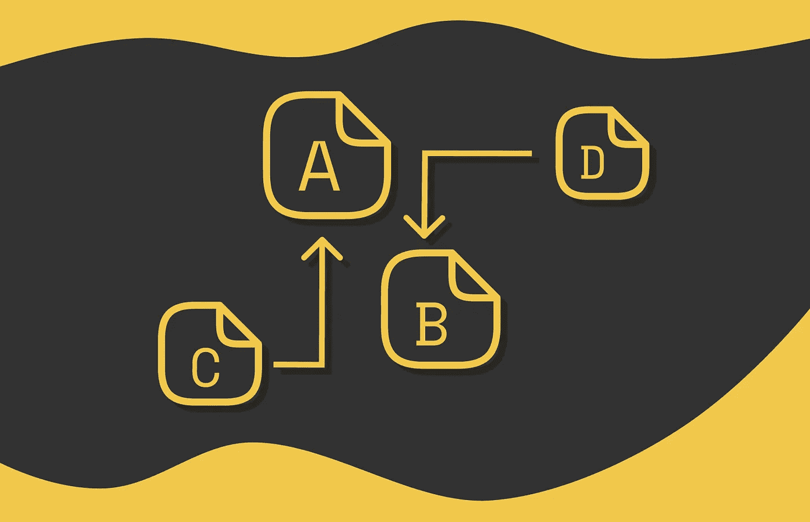

排名是机器学习中的一个重要问题。给定一组文档，目标是根据特定标准对它们进行排序。排名在信息检索系统中广泛使用，用于排序搜索结果，或在推荐系统中筛选出可能对特定用户感兴趣的内容。

根据具体问题和目标，存在大量的排名算法。我们将在本文中研究的算法名为[**PageRank**](https://arxiv.org/pdf/1002.2858.pdf)。它的主要目标是通过利用关于连接性的信息对一组文档（网页）进行排名。分配给每个网页的排名表示它的重要性：排名越高，重要性越高。该算法基于两个假设，我们将在下一节中讨论。

# 假设

我们可以通过做出两个假设来定义网页的“重要性”一词。

> 如果有许多其他网页指向某个网页，那么该网页的重要性就会很高。

假设我们有一篇热门的研究论文以及许多其他文章通过引用或结果链接到它。主要是，这使得给这篇文章赋予较大重要性是有意义的。另一方面，如果有一个未知的网页没有其他资源的链接，似乎将低重要性分配给该页面是合乎逻辑的。

实际上，我们还应该关注入站链接的质量。

> 一个网页的重要性与指向它的网页的重要性成正比。

如果一个页面最初被维基百科上的高质量文章引用，那么这样的链接应该具有更大的权重。相反，当一个完全不知名的资源指向另一个网页时，它通常不会有高的重要性。

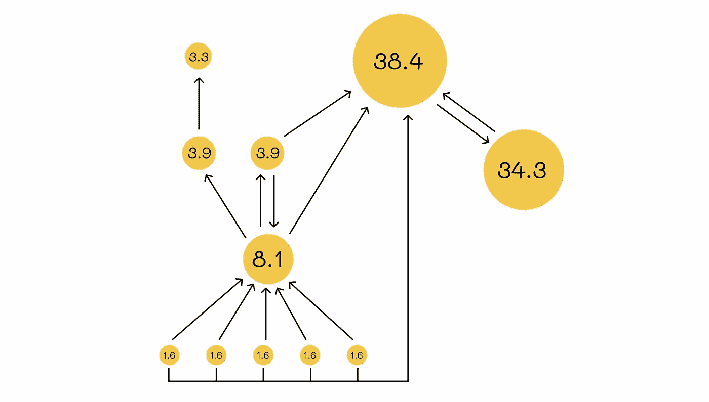

来自[官方论文](https://arxiv.org/pdf/1002.2858.pdf)的 PageRank 算法的重要性分布示例。得分被标准化为总和为 100。具有 38.4 值的节点由于有大量其他节点指向它而具有如此高的重要性。另一方面，重要性为 34.3 的节点只有一个入站链接，但由于其唯一的输入链接来自另一个有影响力的节点，它的重要性仍然相对较高。重要性为 1.6 的节点没有任何入站链接。

# 正式定义

假设一个节点的重要性等于所有入站链接权重的总和。

想象一个重要性为*rᵢ*的节点*i*，它有*k* 个出站链接。我们如何确定每个链接的权重？最直接的方法是将节点的重要性平均分配给所有出站链接。这样，每个出站链接将获得*rᵢ / k*的权重。

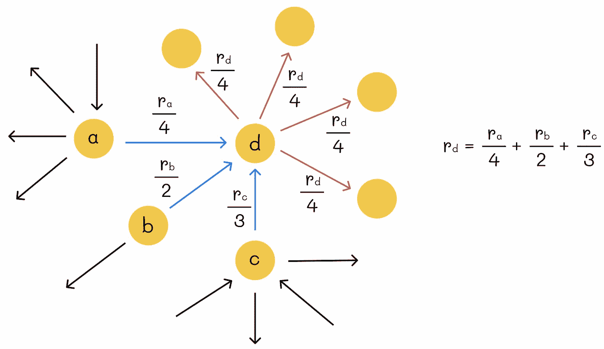

节点排名计算示例

节点的排名等于入站节点的排名总和除以它们的总出度。

给定一个 *n* 个网页的图，我们可以创建一个 *n* 个线性方程的系统来找到图的权重。然而，这样的系统可能有无限多个解。这就是为什么我们应该添加另一个约束条件以强加唯一解。顺便说一下，PageRank 添加了归一化条件，即所有节点的重要性之和等于 1。

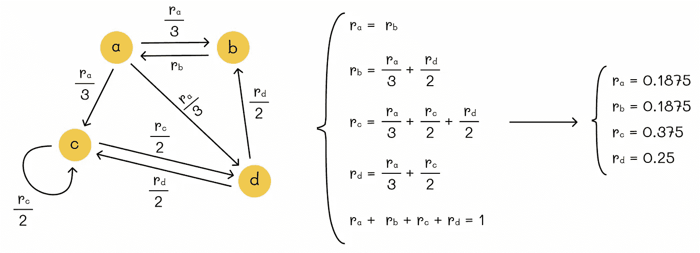

寻找描述图结构的线性方程组的解

我们已经提出了一个解决方案，但它不可扩展。即使使用高斯消元法，我们的复杂度也达到了 *O(n³)*。考虑到分析的网页数量 *n* 可以达到数十亿，我们需要想出一种更高效的方法。

首先，让我们简化表示法。为此，我们引入了邻接方阵 *G*，它将包含每对链接网页的链接权重（如果两个网页没有链接，我们将在相应的矩阵元素中放置 0）。更正式地：

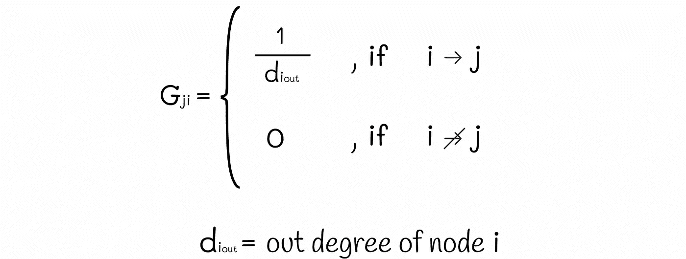

矩阵元素 G[j][i] 的定义

矩阵 *G* 被称为**随机矩阵**，因为它的每一列的总和为 1。

接下来，我们定义排名向量 *r*，其 *i* -th 元素等于页面 *i* 的排名（重要性）。该向量所有元素的总和也等于 1。我们的**最终目标**是找到这个向量 *r* 的值。

# PageRank 方程

让我们看看如果将矩阵 *G* 乘以向量 *r* 会发生什么。根据上一节的图示，我们可以看到结果仍然是相同的向量 *r*！

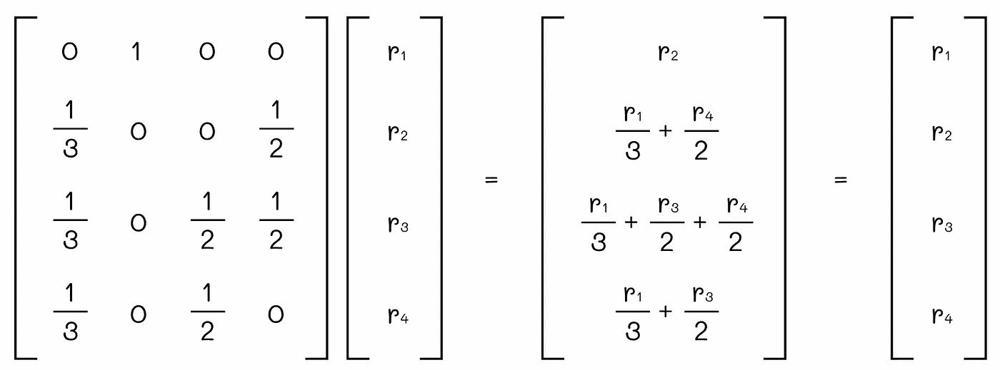

将矩阵 G 乘以向量 r 再次得到向量 r

为什么会这样？这只是巧合吗？请记住，矩阵 *G* 的 *i* -th 行包含所有输入链接到页面 *i* 的权重。当我们将 *i* -th 行的 *j* -th 元素乘以 *r[j]* 时，我们实际上得到的是组件 r*j* / *d[j]out* —— 从节点 *j* 流向 *i* 的重要性。如果节点 *i* 和 *j* 之间没有链接，则相应的组件设置为 0。逻辑上，*i* -th 行与向量 *r* 的乘积的最终结果将等于从图的任何连接节点流向节点 *i* 的所有重要性的总和。根据定义，这个值等于节点 *i* 的排名。一般来说，我们可以写出以下方程：

PageRank 方程

因此，我们的目标是找到一个向量 *r*，使其在与输入矩阵 *G* 相乘时保持不变。

# 特征向量

我们可以通过回顾线性代数中关于特征向量的理论来找到上述方程的解。给定一个矩阵 *A*，如果存在一个数 *α* 使得下列方程成立，则向量 *v* 被称为**特征向量**：

特征值定义

数字 *α* 被称为 **特征值**。我们可以注意到，PageRank 方程对应于特征值方程，其中 *A = G, v = r* 和 *α = 1*。通常，任何方阵都有多个特征值和特征向量，但由于我们的矩阵 *G* 是随机的，理论上它的最大特征值等于 1。

# 幂迭代

寻找矩阵特征向量的最流行的方法之一是 **幂迭代** 方法。它包括用一些值（我们将使用 *1 / n*，其中 *n* 是网页数量）初始化初始向量 *r*，然后不断计算 *G * r* 的值，并将该值重新分配给 *r*。如果在任何迭代中，向量 *r* 和 *G * r* 之间的距离小于某个阈值 *ε*，我们就停止算法，因为它已经成功收敛。

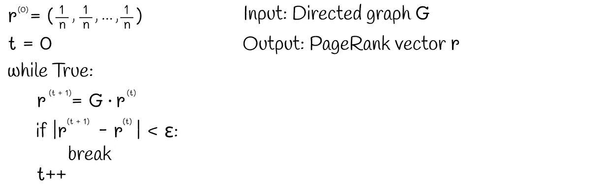

PageRank 算法

在上述示例中，我们可以看到，通过将 *ε* 设置为 0.0005，算法在仅 9 次迭代中正确收敛：

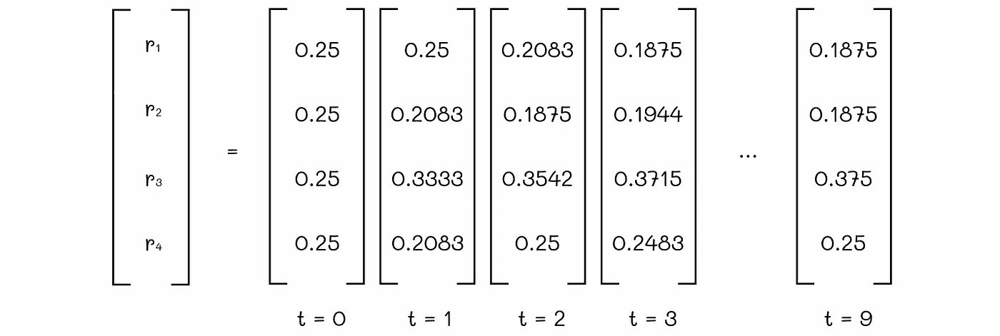

显然，这只是一个玩具示例，但在实际中，这种方法对于更多变量也能很好地工作。

# 随机游走

想象一个游览者（行走者）在时刻 *t* 位于图的任何节点上。我们用 *p(t)* 表示一个向量，其中 *i* 位置的分量等于游览者在时刻 *t* 出现在节点 *i* 的概率。然后，游览者随机（以相等的概率）选择另一个链接到当前节点的节点，并在时刻 *t + 1* 移动到那里。最终，我们希望找到时刻 *t + 1* 的分布向量 *p(t + 1)*。

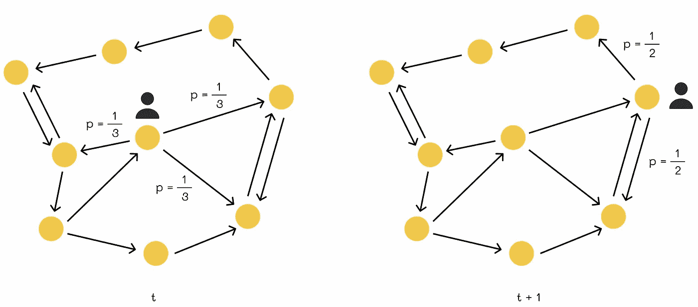

游览者的随机游走

我们可以注意到，游览者在时刻 *t + 1* 出现于节点 *i* 的概率是游览者之前在相邻节点 *j* 的概率总和（所有链接到 *i* 的节点）乘以从节点 *j* 移动到 *i* 的概率。

+   我们已经知道游览者在时刻 t 出现在节点 *j* 的概率：*p(t)[j]*。

+   从节点 *j* 到 *i* 的移动概率等于 *G[j][i]*。

通过汇总这些概率，我们得到 *p(t + 1)[i]* 的值。为了找到所有图节点的 *p(t + 1)* 值，我们可以将相同的方程写成矩阵形式：

这个方程的形式与我们之前为 PageRank 得到的完全相同！*这意味着这两个问题有相同的解决方案和解释。*

在某个时刻，分布向量 *p(t)* 会收敛：*p(t + 1) = M * p(t) = p(t)*。在这种情况下，收敛后的向量 *p(t)* 被称为 **平稳分布**。在所有后续时刻，驻留在任何给定节点的概率不会改变。

> 节点的 PageRank 得分等于游览者通过随机游走图后，未来会出现在该节点的概率。

# 收敛

描述的图遍历过程通常被称为“**马尔可夫链**”。在马尔可夫链理论中存在一个定理，指出：

> 在图结构的某些条件下，稳态分布是唯一的，并且可以通过任意初始概率分布在 t = 0 时到达。

在以下部分中，我们将更深入地探讨实现唯一收敛所需满足的条件。结果表明，并非所有图都能实现唯一收敛。

原则上，我们希望避免两种情况。

## 死胡同

没有出链接的节点称为**死胡同**。这种节点的问题在于它们会使总权重从网络中泄漏。以下是一个示例：

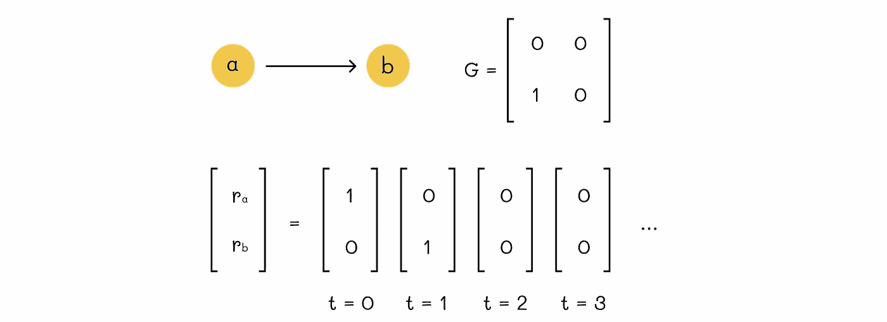

死胡同问题。在时刻 t = 2，权重泄漏。在时刻 t = 3，排名向量收敛。

## 蜘蛛陷阱

如果一组节点没有指向该组外其他节点的出链接，则该组节点形成**蜘蛛陷阱**。基本上，一旦进入这些节点，就无法离开这个节点组。蜘蛛陷阱会导致以下两个问题：

+   算法从不收敛。

+   形成蜘蛛陷阱的节点组吸收了所有图的权重。结果，这些节点的权重非常高，而其他节点的权重为 0。

第一个问题如下面的图所示：

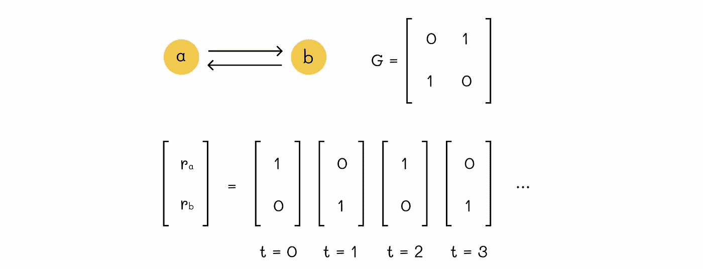

蜘蛛陷阱问题。从时刻 t = 0 开始，1 和 0 的排名在两个节点之间无限交替。结果，算法从不收敛。

权重的吸收在下图中展示。虽然在下面的玩具示例中可能看起来不是一个严重的问题，但想象一个有数百万网页的网络，其中几个网页形成了蜘蛛陷阱。因此，这几个页面将分配所有可用的权重，而所有其他网页的权重将被设置为 0。显然，这不是我们在现实中通常期望的情况。

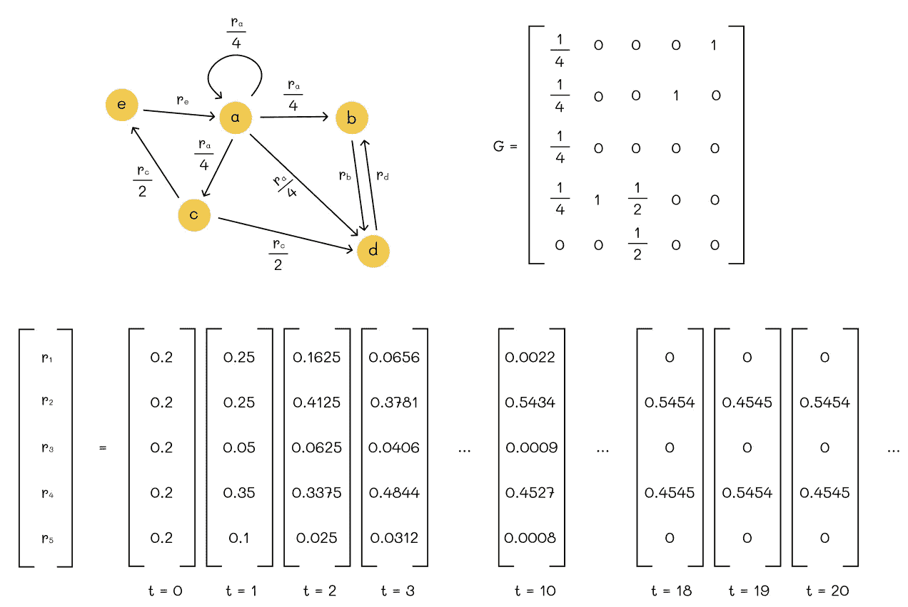

节点 b 和 d 形成了一个蜘蛛陷阱。结果，在时刻 t = 18 时，它们已经吸收了所有的权重，而其他节点的权重为零。从此时开始，权重在节点 b 和 d 之间交替，使得算法发散。

## 传送

Google 提出的一个解决方案是在每次移动前添加以下条件：

+   以概率 *β*，移动到另一个链接的节点。

+   以概率 *(1 — β)*，通过**传送**移动到一个随机节点。

参数 *β* 被称为 **衰减因子**。原始 PageRank 算法的作者建议选择 *β = 0.85*，这意味着平均来说，冲浪者在 5 次过渡后会随机跳到另一个节点。这个想法是，如果冲浪者陷入了蜘蛛陷阱，那么经过一段时间，它最终会通过传送门离开那里。

下图显示了传送门如何帮助处理蜘蛛陷阱问题。如果冲浪者走到节点 *c*，那么它将永远停留在那里。引入传送门（蓝线）有助于消除这个问题，确保在一段时间后，冲浪者将不得不移动到另一个随机节点。

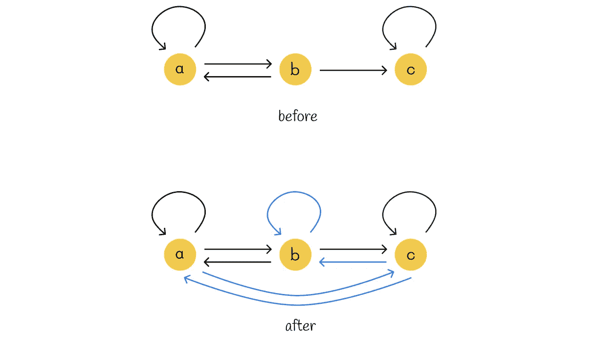

传送门（蓝线）消除了蜘蛛陷阱问题

然而，对于死胡同节点，我们需要稍微修改方法。从上述一个例子中，我们知道死胡同会导致图中的重要性泄漏。这种现象可以在幂迭代方法中观察到，当秩向量因为初始矩阵 *G* 中的零列而变成全零。最终，我们可以做的是：

> 每当冲浪者到达一个死胡同节点时，它应该立即跳到图中的一个随机节点（概率相等）。

实际上，我们可以修改初始矩阵 *G* 来满足这一声明：我们只需将所有死胡同节点的列中的所有元素的零替换为 *1 / n*。下面的示例演示了这一原理。

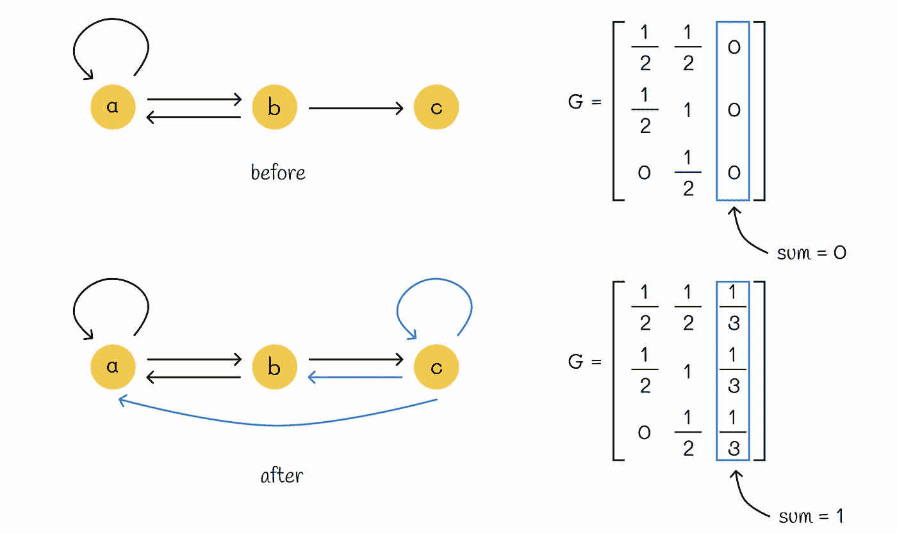

节点 *c* 是一个死胡同节点，在矩阵 *G* 中对应一列全零的列。将 *n = 3* 个传送门从 *c* 添加到图中的所有节点，会使从 *c* 到任何节点的移动概率 *p = 1 / 3*。为了考虑这一点，我们用 *1 / 3* 填充矩阵 *G* 中与节点 c 对应的列。

我们可以注意到，添加传送门后，所有矩阵列的和现在等于 1。换句话说，矩阵 *G* 变成了随机链。这是一个重要的属性，我们将在后面使用。

## 收敛条件

马尔可夫链理论中存在一个关键定理定义了收敛条件。

> 对于任何起始向量，转移矩阵 G 会收敛到一个唯一的正定平稳分布向量 r，如果对应于 G 的链是随机的、非周期性的和不可约的。

让我们回顾一下这个定理中的最后三个属性，并检查引入的传送门是否解决了上述问题。

> 一个链 G 被称为随机链，如果其每一列的和等于 1。

如上所述，将传送门添加到死胡同节点消除了矩阵中的零列，使所有列的和等于 1。这个条件已经满足。

> 一个链 G 被称为周期链，如果存在一个数字 k > 1，使得任何一对节点之间的路径长度总是 k 的倍数。否则，链被称为非周期链。

这个条件意味着返回到同一状态的次数必须是 *k* 的倍数。在非周期性的情况下，返回会在不规则的时间发生。基本上，这个条件涉及到蜘蛛陷阱问题。由于我们已经通过添加传送门解决了蜘蛛陷阱问题，因此链 *G* 是非周期的。

> 如果从任意一个节点到任何其他节点的过渡概率始终大于 0，则链 G 被称为不可约的。

这个条件意味着任意两个节点之间总是存在一个链接，因此不可能卡在任何一个节点上。换句话说，矩阵 *G* 需要包含所有非零元素。我们将在下一节中看到如何通过连接图中的所有节点来满足这个条件。

## 修改算法

Google 提出的 PageRank 算法以初始矩阵 *G* 为基础，通过将死胡同的传送门添加到其他节点来调整它。这确保了随机性。为了保证非周期性和不可约性，它然后对每个节点添加之前描述的条件：

+   以 *β* 的概率，移动到另一个链接节点。

+   以 *(1 — β)* 的概率，移动到一个随机节点。

在数学上，这导致每个节点的以下等级方程：

PageRank 的向量方程

我们可以将这个方程转换成矩阵形式：

Google 的 PageRank 矩阵方程

矩阵 R 必须满足唯一平稳分布 r 存在的必要条件，而这个分布需要被找到。

让我们绘制修改后的图和上面某个示例的相应转移矩阵 R：

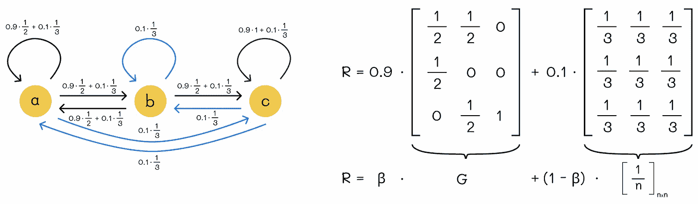

从原始链接矩阵 G 和传送门矩阵组成的矩阵 R。在这个例子中 *β = 0.9*。

# 提高效率

我们唯一剩下的问题是如何存储转移矩阵 *R*。记住 *R* 是一个大小为 *n x n* 的方阵，其中 *n* 是网页的数量。目前，Google 拥有超过 250 亿个网页！矩阵 R 不含任何零，因此它是密集的，这意味着我们必须完全存储它。假设每个矩阵元素需要 4 字节存储。存储矩阵 *R* 所需的总内存大小等于 *(25 * 10⁹)² * 4*（字节）*~ 3 * 10²¹*（字节）。这是一个巨大的内存大小！我们需要想出另一种方法，将其至少减少几个数量级。

首先，我们可以简单地注意到，添加传送门等同于将初始矩阵 *G* 的元素减少 *(1 — β)*% 并均匀分配到每个节点。牢记这一点，我们可以将 PageRank 的矩阵方程转换成另一种格式：

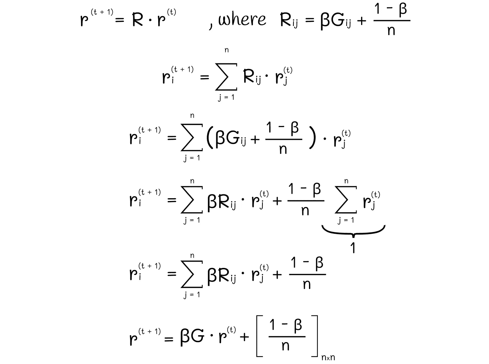

转换 PageRank 方程

让我们看一下最后得到的方程。*G*是初始链接矩阵，大多数元素都等于 0。为什么会这样？实际上，如果你查看任何网页，它可能只包含最多几十个指向其他网页的链接。考虑到有超过 250 亿个网页，我们得到的总链接数相对于网页数量是极其少的。因此，*G*中有很多零，*G*是稀疏的。

存储稀疏矩阵所需的内存远远少于密集矩阵。假设每个网页平均链接到其他 40 个网页。现在存储矩阵 G 所需的总字节数变为*25 * 10⁹ * 40*（字节）* = 10¹²*（字节）* = 1*（TB）。结果是，我们只需要 1TB 来存储*G*。与之前相比，这是一个巨大的改进！

实际上，在每次迭代中，我们只需计算矩阵*G*与向量*r*的乘积，将其乘以*β*，并在结果向量的每个元素中加上常数*(1 — β) / n*。

结果 PageRank 方程

还要记住，如果初始链*G*包含死节点，那么每次迭代时向量*r*的总和将小于 1。为了解决这个问题，只需对其进行重新归一化，使得所有向量组件的总和为 1。

# 完整算法

在下图中，我们可以看到 PageRank 算法的完整版本。在每次迭代中，排名更新分为两个阶段。第一阶段仅根据初始矩阵*G*进行更新。然后我们将排名向量的组件汇总到变量*s*中。这样，*(1 — s)*的值就是单个节点的总输入排名减少的值。为了弥补这一点，在第二阶段，我们考虑了传送，并将它们从一个节点添加到所有节点中，值为*(1 — s) / n*。

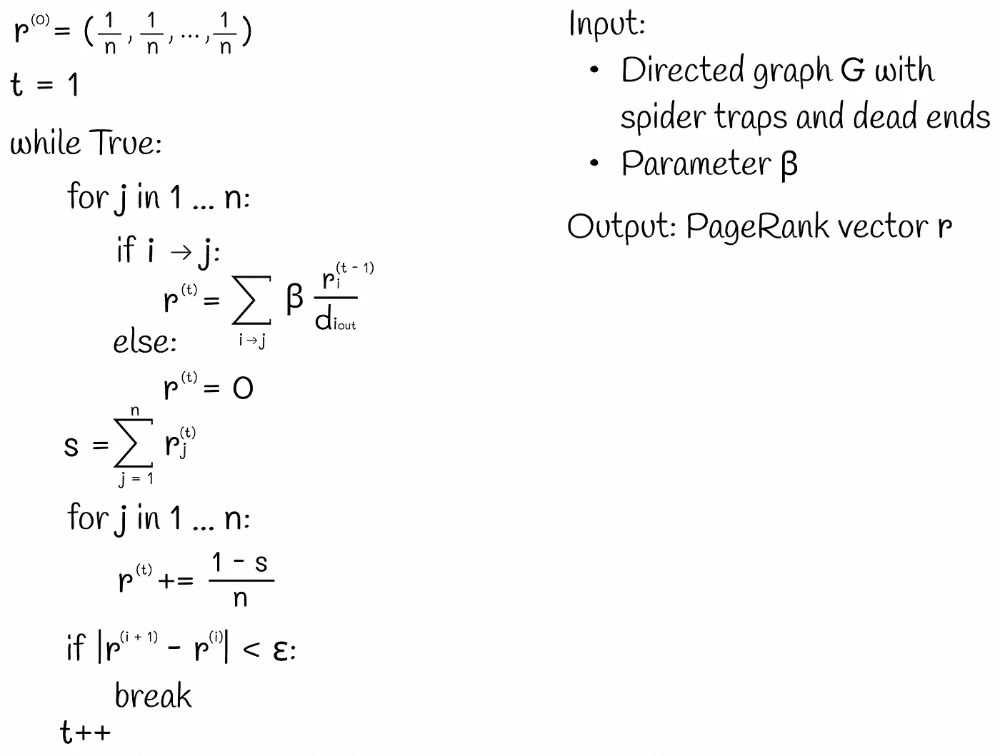

完整的 PageRank 算法

# 结论

在本文中，我们探讨了 PageRank 算法的不同公式，以最终得出其优化版本。尽管存在并发展了其他用于排名搜索结果的方法，PageRank 仍然是 Google 搜索引擎背后最有效的算法之一。

# 参考文献

本文的逻辑结构基于斯坦福大学关于[大图](http://snap.stanford.edu/class/cs246-2022/slides/09-pagerank.pdf)的讲座。

+   [大型图分析：链接分析，PageRank](http://snap.stanford.edu/class/cs246-2022/slides/09-pagerank.pdf)

+   [大规模数据集的挖掘 | Jure Leskovec, Anand Rajaraman, Jeff Ullman](http://www.mmds.org)

+   [PageRank: 站在巨人的肩膀上](https://arxiv.org/pdf/1002.2858.pdf)

*除非另有说明，否则所有图片均由作者提供*
