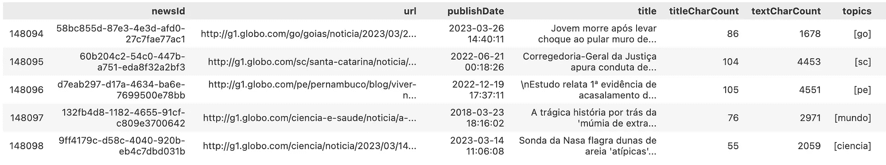
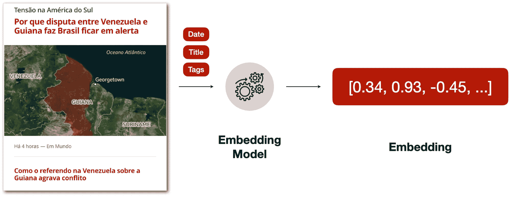

# 大型语言模型和向量数据库在新闻推荐中的应用

> 原文：[`towardsdatascience.com/large-language-models-and-vector-databases-for-news-recommendations-6f9348fd4030?source=collection_archive---------1-----------------------#2023-12-14`](https://towardsdatascience.com/large-language-models-and-vector-databases-for-news-recommendations-6f9348fd4030?source=collection_archive---------1-----------------------#2023-12-14)


图片由 [Roman Kraft](https://unsplash.com/@iamromankraft?utm_source=medium&utm_medium=referral) 提供，来自 [Unsplash](https://unsplash.com/?utm_source=medium&utm_medium=referral)

## *将 LLMs 应用到生产环境中，使用 Sentence Transformers 和 Qdrant*

[](https://medium.com/@guedes.joaofelipe?source=post_page-----6f9348fd4030--------------------------------)[](https://towardsdatascience.com/?source=post_page-----6f9348fd4030--------------------------------) [João Felipe Guedes](https://medium.com/@guedes.joaofelipe?source=post_page-----6f9348fd4030--------------------------------)

·

[关注](https://medium.com/m/signin?actionUrl=https%3A%2F%2Fmedium.com%2F_%2Fsubscribe%2Fuser%2F259f985d397f&operation=register&redirect=https%3A%2F%2Ftowardsdatascience.com%2Flarge-language-models-and-vector-databases-for-news-recommendations-6f9348fd4030&user=Jo%C3%A3o+Felipe+Guedes&userId=259f985d397f&source=post_page-259f985d397f----6f9348fd4030---------------------post_header-----------) 发表在 [Towards Data Science](https://towardsdatascience.com/?source=post_page-----6f9348fd4030--------------------------------) ·8 分钟阅读·2023 年 12 月 14 日[](https://medium.com/m/signin?actionUrl=https%3A%2F%2Fmedium.com%2F_%2Fvote%2Ftowards-data-science%2F6f9348fd4030&operation=register&redirect=https%3A%2F%2Ftowardsdatascience.com%2Flarge-language-models-and-vector-databases-for-news-recommendations-6f9348fd4030&user=Jo%C3%A3o+Felipe+Guedes&userId=259f985d397f&source=-----6f9348fd4030---------------------clap_footer-----------)

--

[](https://medium.com/m/signin?actionUrl=https%3A%2F%2Fmedium.com%2F_%2Fbookmark%2Fp%2F6f9348fd4030&operation=register&redirect=https%3A%2F%2Ftowardsdatascience.com%2Flarge-language-models-and-vector-databases-for-news-recommendations-6f9348fd4030&source=-----6f9348fd4030---------------------bookmark_footer-----------)

大型语言模型（LLMs）随着最近生成 AI 工具如 Chat-GPT、Bard 等的发布，引起了机器学习社区的全球关注。这些解决方案的核心思想之一是计算非结构化数据（如文本和图像）的数值表示，并在这些表示之间找到相似性。

然而，将所有这些概念应用到生产环境中有其自身的一系列机器学习工程挑战：

+   如何快速生成这些表示？

+   如何将它们存储在合适的数据库中？

+   如何在生产环境中快速计算相似性？

在本文中，我介绍了两种旨在解决这些问题的开源解决方案：

+   [**Sentence Transformers**](https://www.sbert.net/) **[1]**：一种基于文本信息的嵌入生成技术；

+   [**Qdrant**](https://qdrant.tech/)：一个能够存储嵌入并提供易于查询接口的向量数据库。

这些工具应用于 NPR [2]，一个新闻门户推荐数据集（在 [Kaggle](https://www.kaggle.com/datasets/joelpl/news-portal-recommendations-npr-by-globo) 上公开可用），该数据集旨在支持学术界开发推荐算法。在文章结束时，你将看到如何：

+   使用 Sentence Transformers 生成新闻嵌入

+   使用 Qdrant 存储嵌入

+   查询嵌入以推荐新闻文章

本文的所有代码均可在 [Github](https://github.com/guedes-joaofelipe/vector-search-api) 上获取。

# 1\. 使用 Sentence Transformers 生成嵌入

首先，我们需要找到一种将输入数据转换为向量的方法，我们称之为嵌入（如果你想深入了解嵌入的概念，我推荐阅读 Boykis 的文章 [What Are Embeddings?](https://vickiboykis.com/what_are_embeddings/about.html) [3]）。

那么让我们来看看我们可以使用 NPR 数据集处理什么样的数据：

```py
import pandas as pd

df = pd.read_parquet("articles.parquet")
df.tail()
```



来自 NPR 的示例数据（作者生成的图像）

我们可以看到 NPR 拥有一些有趣的文本数据，如文章的 *标题* 和 *正文* 内容。我们可以在嵌入生成过程中使用它们，如下图所示：



嵌入生成过程（作者提供的图像）

一旦我们定义了输入数据的文本特征，我们需要建立一个嵌入模型来生成我们的数值表示。幸运的是，我们可以在 [HuggingFace](https://huggingface.co/) 等网站上寻找适合特定语言或任务的预训练模型。在我们的示例中，我们可以使用 [*neuralmind/bert-base-portuguese-cased*](https://huggingface.co/neuralmind/bert-base-portuguese-cased) 模型，该模型为以下任务在巴西葡萄牙语上进行过训练：

+   命名实体识别

+   **句子文本相似性**

+   识别文本蕴含

从代码方面来看，我们如何翻译嵌入生成过程：

```py
from sentence_transformers import SentenceTransformer

model_name = "neuralmind/bert-base-portuguese-cased"
encoder = SentenceTransformer(model_name_or_path=model_name)

title = """
  Paraguaios vão às urnas neste domingo (30) para escolher novo presidente
"""

sentence = title

sentence_embedding = encoder.encode(sentence)
print (sentence_embedding)
# output: np.array([-0.2875876, 0.0356041, 0.31462672, 0.06252239, ...])
```

所以，给定一个示例输入数据，我们可以将*title*和*tags*内容连接成一个文本，并传递给编码器生成文本嵌入。

我们可以对 NPR 数据集中所有其他文章应用相同的过程：

```py
def generate_item_sentence(item: pd.Series, text_columns=["title"]) -> str:
    return ' '.join([item[column] for column in text_columns])

df["sentence"] = df.apply(generate_item_sentence, axis=1)
df["sentence_embedding"] = df["sentence"].apply(encoder.encode)
```

> **注意**：请注意，根据你机器的处理能力，这个过程可能会花费更多时间。

一旦我们获得了所有新闻文章的嵌入，我们需要定义一种策略来存储它们。

# 2. 存储嵌入

由于生成嵌入可能是一个耗费资源的过程，我们可以使用向量数据库来存储这些嵌入，并根据不同的策略执行查询。

有几种向量数据库软件可以实现这个任务，但本文将使用**Qdrant**，这是一款开源解决方案，提供了适用于流行编程语言的 API，如*Python*、*Go*和*Typescript*。要对这些向量数据库进行更好的比较，请查看这篇[文章](https://www.datacamp.com/blog/the-top-5-vector-databases)[4]。

## 设置 Qdrant

为了处理所有 Qdrant 操作，我们需要创建一个指向向量数据库的客户端对象。Qdrant 允许你创建一个免费的服务层级来测试与数据库的远程连接，但为了简便起见，我将创建并本地保存数据库：

```py
from qdrant_client import QdrantClient
client = QdrantClient(path="./qdrant_data")
```

一旦建立了这个连接，我们可以在数据库中创建一个集合，以存储新闻文章的嵌入：

```py
from qdrant_client import models
from qdrant_client.http.models import Distance, VectorParams

client.create_collection(
    collection_name = "news-articles",
    vectors_config = models.VectorParams(
        size = encoder.get_sentence_embedding_dimension(),
        distance = models.Distance.COSINE,
    ),
)

print (client.get_collections())
# output: CollectionsResponse(collections=[CollectionDescription(name='news-articles')])
```

请注意，向量配置参数用于创建集合。这些参数告诉 Qdrant 向量的一些属性，如它们的*size*和比较向量时使用的*distance*度量（我将使用余弦相似度，但你也可以使用其他策略，如[内积或欧氏距离](https://qdrant.tech/documentation/concepts/search/#metrics)）。

## 生成向量点

在最终填充数据库之前，我们需要创建适当的对象以进行上传。在 Qdrant 中，向量可以使用[*PointStruct*](https://qdrant.tech/documentation/concepts/points/)类进行存储，你可以使用这个类定义以下属性：

+   ***id***：向量的 ID（在 NPR 的情况下，是*newsId*）

+   ***vector***：表示向量的 1 维数组（由嵌入模型生成）

+   ***payload***：包含任何其他相关元数据的字典，这些数据后来可以用于在集合中查询向量（在 NPR 的情况下，文章的*title*、*body*和*tags*）

```py
from qdrant_client.http.models import PointStruct

metadata_columns = df.drop(["newsId", "sentence", "sentence_embedding"], axis=1).columns

def create_vector_point(item:pd.Series) -> PointStruct:
    """Turn vectors into PointStruct"""
    return PointStruct(
        id = item["newsId"],
        vector = item["sentence_embedding"].tolist(),
        payload = {
            field: item[field]
            for field in metadata_columns
            if (str(item[field]) not in ['None', 'nan'])
        }
    )

points = df.apply(create_vector_point, axis=1).tolist()
```

## 上传向量

最后，在所有项目都转换为点结构后，我们可以将它们分批上传到数据库：

```py
CHUNK_SIZE = 500
n_chunks = np.ceil(len(points)/CHUNK_SIZE)

for i, points_chunk in enumerate(np.array_split(points, n_chunks)):
    client.upsert(
        collection_name="news-articles",
        wait=True,
        points=points_chunk.tolist()
    )
```

# 3. 查询向量

现在，集合已经填充了向量，我们可以开始查询数据库。我们可以用多种方式输入信息来查询数据库，但我认为有 2 种非常有用的输入方式：

+   输入文本

+   输入向量 ID

## 3.1 使用输入向量查询向量

假设我们建立了这个向量数据库以供搜索引擎使用。在这种情况下，我们期望用户输入的是一个文本输入，我们必须返回最相关的项目。

由于向量数据库中的所有操作都是用……向量来完成的，因此我们首先需要将用户输入的文本转换为向量，以便我们可以根据该输入找到相似的项目。回顾一下，我们使用了句子变换器将文本数据编码成嵌入，因此我们可以使用同样的编码器为用户的输入文本生成数值表示。

由于 NPR 包含新闻文章，我们假设用户输入了*“唐纳德·特朗普”*以了解美国选举：

```py
query_text = "Donald Trump"
query_vector = encoder.encode(query_text).tolist()
print (query_vector)
# output: [-0.048, -0.120, 0.695, ...]
```

一旦计算出输入查询向量，我们可以在集合中搜索最接近的向量，并定义我们希望从这些向量中获得什么样的输出，如其*newsId*、*标题*和*主题：*

```py
from qdrant_client.models import Filter
from qdrant_client.http import models

client.search(
    collection_name="news-articles",
    query_vector=query_vector,
    with_payload=["newsId", "title", "topics"],
    query_filter=None
)
```

> **注意**：默认情况下，Qdrant 使用近似最近邻搜索快速扫描嵌入，但[你也可以进行全面扫描并获取准确的最近邻](https://qdrant.tech/documentation/concepts/search/#search-api)——只是请注意，这是一项成本更高的操作。

执行此操作后，以下是生成的输出标题（为更好理解已翻译成英文）：

+   **输入句子**：*唐纳德·特朗普*

+   **输出 1**：*巴拉圭人在本周日（30 日）去投票选举新总统*

+   **输出 2**：*选民表示拜登和特朗普不应在 2024 年竞选，路透/益普索民调显示*

+   **输出 3**：*记者指控特朗普在 1990 年代对她进行性虐待*

+   **输出 4**：*迈克·彭斯，特朗普的前副总统，法院作证可能使前总统陷入困境*

看起来除了带来与特朗普本人相关的新闻外，嵌入模型还成功地表示了与总统选举相关的主题。注意在第一个输出中，除了总统选举，没有直接提到输入词“*唐纳德·特朗普*”。

此外，我遗漏了一个*query_filter*参数。如果你想指定输出必须满足某些条件，这个工具非常有用。例如，在新闻门户中，通常重要的是仅筛选出最新的文章（例如过去 7 天内）。因此，你可以查询符合最低发布时间戳的新闻文章。

> **注意：** 在新闻推荐的背景下，有多个值得关注的方面，如公平性和多样性。这是一个开放的话题，但如果你对此领域感兴趣，可以查看[NORMalize Workshop](https://sites.google.com/view/normalizeworkshop/home)上的文章。

## 3.2 使用输入向量 ID 查询向量

最后，我们可以让向量数据库“推荐”更接近某些期望的向量 ID，但远离不希望的向量 ID。期望的和不希望的 ID 分别称为*正例*和*负例*，它们被视为推荐的种子。

例如，假设我们有以下正 ID：

```py
seed_id = '8bc22460-532c-449b-ad71-28dd86790ca2'
# title (translated): 'Learn why Joe Biden launched his bid for re-election this Tuesday'
```

然后我们可以请求类似于这个示例的项目：

```py
client.recommend(
    collection_name="news-articles",
    positive=[seed_id],
    negative=None,
    with_payload=["newsId", "title", "topics"]
)
```

在运行此操作后，以下是翻译后的输出标题：

+   **输入项：** *了解乔·拜登为什么在本周二宣布竞选连任*

+   **输出 1：** *拜登宣布他将竞选连任*

+   **输出 2：** *美国：拜登竞选连任的 4 个原因*

+   **输出 3：** *选民表示拜登和特朗普不应该在 2024 年参选，路透社/艾普索斯民调显示*

+   **输出 4：** *拜登顾问的失言引发对选举后可能出现第二届政府的疑虑*

# 结论

本文展示了如何将 LLM 和向量数据库结合起来以提供推荐。特别是使用了句子变换器来生成来自 NPR 数据集的文本新闻文章的数值表示（嵌入）。一旦这些嵌入被计算出来，它们可以填充像 Qdrant 这样的向量数据库，从而根据多种策略方便地查询向量。

在本文中的示例之后可以进行大量改进，例如：

+   测试其他嵌入模型

+   测试其他距离度量

+   测试其他向量数据库

+   使用基于编译的编程语言如 Go 来提高性能

+   创建一个 API 以提供推荐

换句话说，可能会出现许多想法来改善 LLM 的推荐机器学习工程。因此，如果你想分享你对这些改进的想法，请随时通过[这里](https://www.linkedin.com/in/joao-felipe-guedes/)给我发消息 :)

# 关于我

我是[Globo](https://www.globo.com/)的高级数据科学家，这是一家巴西媒体技术公司。作为公司推荐团队的一员，我身边有一个令人惊叹和才华横溢的团队，他们付出了很多努力，通过数字产品如[G1](https://g1.globo.com/)、[GE](https://ge.globo.com/)、[Globoplay](https://globoplay.globo.com/)等为数百万用户提供个性化内容。如果没有他们不可或缺的知识，这篇文章是不可能完成的。

# 参考文献

[1] N. reimers 和 I. Gurevych, [Sentence-BERT: 使用 Siamese BERT 网络的句子嵌入](http://arxiv.org/abs/1908.10084) (2019), 计算语言学协会。

[2] J. Pinho, J. Silva 和 L. Figueiredo, [NPR: 新闻门户推荐数据集](https://sites.google.com/view/normalizeworkshop/contributions?authuser=0) (2023), ACM 推荐系统会议

[3] V. Boykis, [什么是嵌入？](https://vickiboykis.com/what_are_embeddings/)，个人博客

[4] M. Ali, [前 5 大向量数据库](https://www.datacamp.com/blog/the-top-5-vector-databases) (2023), DataCamp 博客
