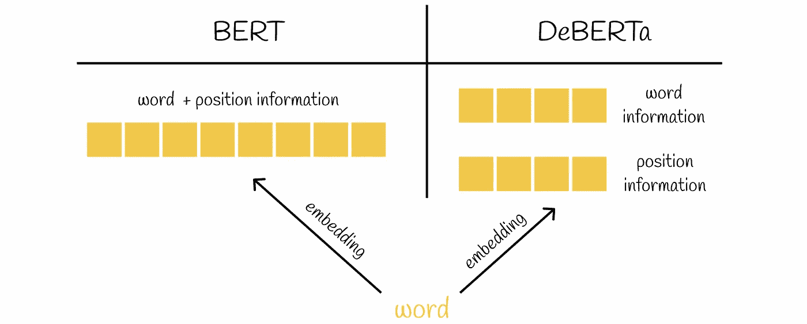
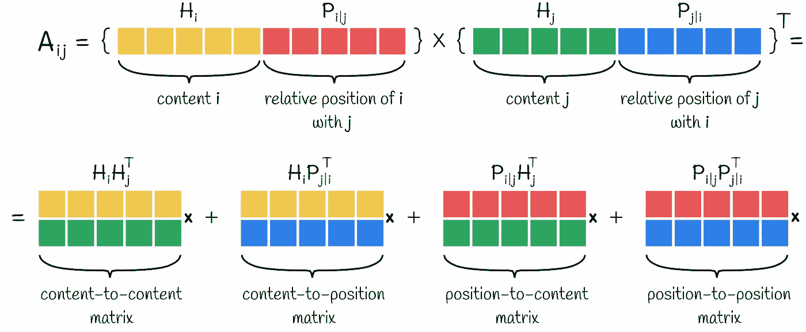
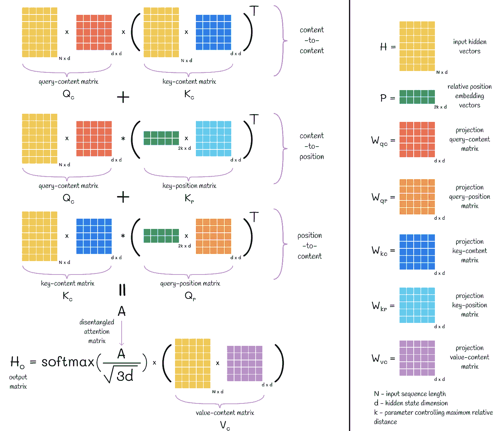
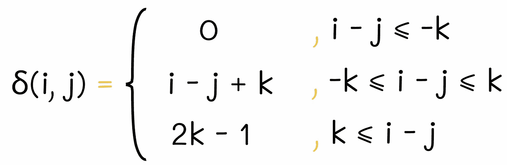
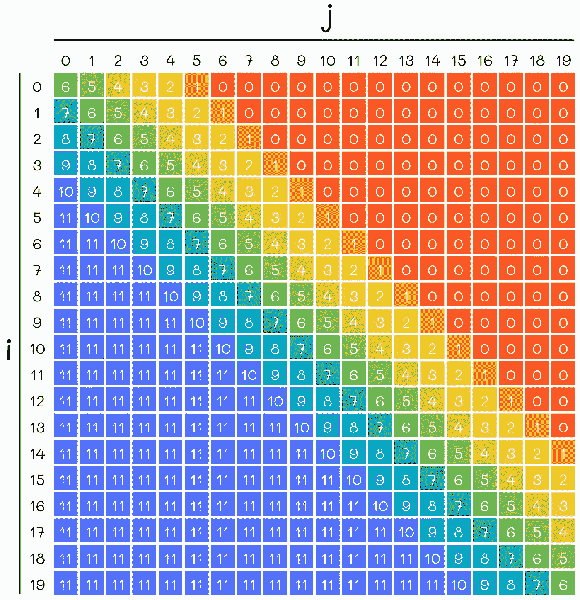
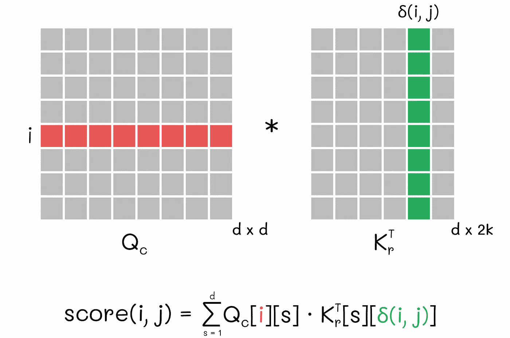
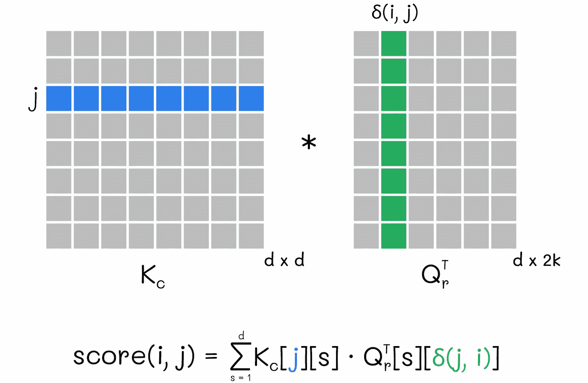
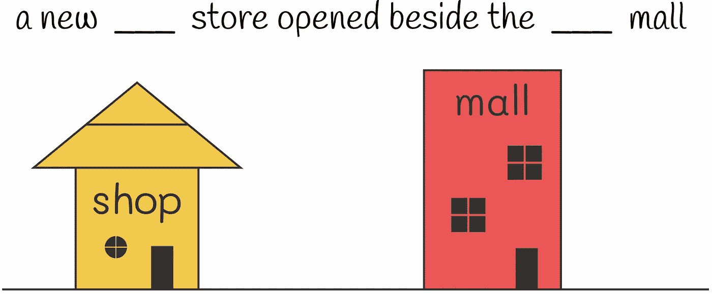
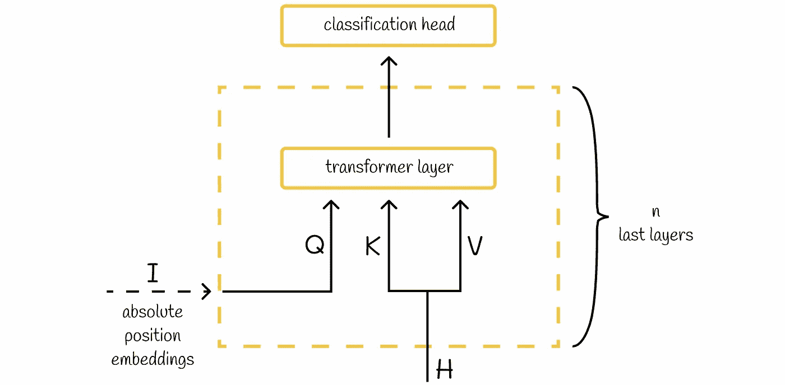
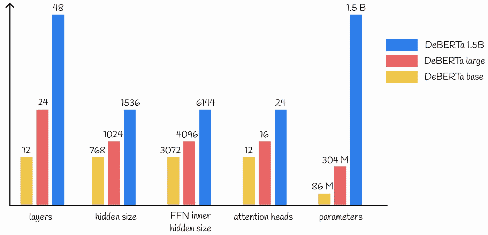

# 大语言模型：DeBERTa — 解码增强型 BERT 与解耦注意力

> 原文：[`towardsdatascience.com/large-language-models-deberta-decoding-enhanced-bert-with-disentangled-attention-90016668db4b?source=collection_archive---------2-----------------------#2023-11-28`](https://towardsdatascience.com/large-language-models-deberta-decoding-enhanced-bert-with-disentangled-attention-90016668db4b?source=collection_archive---------2-----------------------#2023-11-28)

## 探索 Transformers 中注意力机制的高级版本

 [Vyacheslav Efimov](https://medium.com/@slavahead?source=post_page-----90016668db4b--------------------------------)

·

[关注](https://medium.com/m/signin?actionUrl=https%3A%2F%2Fmedium.com%2F_%2Fsubscribe%2Fuser%2Fc8a0ca9d85d8&operation=register&redirect=https%3A%2F%2Ftowardsdatascience.com%2Flarge-language-models-deberta-decoding-enhanced-bert-with-disentangled-attention-90016668db4b&user=Vyacheslav+Efimov&userId=c8a0ca9d85d8&source=post_page-c8a0ca9d85d8----90016668db4b---------------------post_header-----------) 发表在 [Towards Data Science](https://towardsdatascience.com/?source=post_page-----90016668db4b--------------------------------) ·9 分钟阅读·2023 年 11 月 28 日

--

# 介绍

近年来，BERT 已成为许多自然语言处理任务中的首选工具。它在处理、理解信息和构建高精度词嵌入方面的卓越能力达到了最先进的水平。

众所周知，BERT 基于从 Transformer 架构中衍生出的**注意力**机制。注意力是现在大多数大语言模型的关键组成部分。

 ## 大型语言模型：BERT — 基于 Transformer 的双向编码表示

### 了解 BERT 如何构建最先进的嵌入

towardsdatascience.com

然而，在机器学习领域，新的思想和方法不断发展。2021 年，BERT 类模型中出现了一种创新技术，称为“**解耦注意力**”。这一概念的实现催生了 **DeBERTa**——一种融合了解耦注意力的模型。虽然 DeBERTa 只引入了一对新的架构原则，但与其他大型模型相比，其在顶级 NLP 基准测试中的改进是显著的。

在本文中，我们将参考原始的 [DeBERTa 论文](https://arxiv.org/pdf/2006.03654.pdf)，并覆盖理解其工作原理所需的所有细节。

# 1\. 解耦注意力

在原始的 Transformer 块中，每个 token 都由一个单一的向量表示，该向量以逐元素嵌入和的形式包含关于 token 内容和位置的信息。这种方法的缺点是潜在的信息丢失：模型可能无法区分一个词本身还是它的位置对某个嵌入向量分量的重要性。

BERT 和 DeBERTa 中的嵌入构造。与将所有信息存储在一个向量中的方法不同，DeBERTa 使用两个独立的向量来存储词和位置的嵌入。

DeBERTa 提出了一个新颖的机制，其中相同的信息存储在两个不同的向量中。此外，注意力计算算法也被修改，以显式考虑 token 内容和位置之间的关系。例如，词汇 *“research”* 和 *“paper”* 在彼此接近时的相关性远大于它们在不同文本部分出现时的相关性。这个例子清楚地说明了为什么也需要考虑内容到位置的关系。

解耦注意力的引入需要修改注意力分数的计算。事实证明，这一过程非常简单。计算两个嵌入之间的交叉注意力分数，每个嵌入由两个向量组成，可以简单地分解为四个子向量的成对乘积之和：

计算两个嵌入向量之间的交叉注意力分数。

相同的方法可以推广到矩阵形式。从图中，我们可以观察到四种不同类型的矩阵（向量），每种矩阵代表内容和位置信息的某种组合：

+   *内容到内容* 矩阵；

+   *内容到位置* 矩阵；

+   *位置到内容* 矩阵；

+   *位置到位置* 矩阵。

> 可以观察到位置到位置的矩阵没有存储任何有价值的信息，因为它没有关于单词内容的细节。这就是为什么在解耦注意力中会忽略这个术语的原因。

对于其余三个术语，最终输出的注意力矩阵计算方式与原始 Transformer 相似。

DeBERTa 中输出解耦注意力的计算

尽管计算过程看起来类似，但有一对细微差别需要考虑。

从上面的图示中，我们可以注意到用于表示*查询内容 Qc 和键位置 Krᵀ 矩阵*与*键内容 Kc 和查询位置 Qrᵀ 矩阵*之间乘法的符号***与普通矩阵乘法符号*x*不同。实际上，这并非偶然，因为在 DeBERTa 中提到的矩阵对的乘法方式略有不同，以考虑到令牌的相对位置。

+   根据普通矩阵乘法规则，如果 *C = A x B*，则元素 *C[i][j]* 通过 *A* 的第 *i* 行与 *B* 的第 *j* 列的逐元素乘法来计算。

+   在 DeBERTa 的特殊情况下，如果 *C = A * B*，则 *C[i][j]* 计算为 *A* 的第 *i* 行与 *B* 的 *δ(i, j)* 列的乘积，其中 *δ* 表示索引 *i* 和 *j* 之间的相对距离函数，其定义如下：

索引 i 和 j 之间的相对距离定义。*k* 是一个超参数，用于控制最大可能的相对距离。图片由作者采用。

*k* 可以被视为一个超参数，用于控制索引 *i* 和 *j* 之间的最大可能相对距离。在 DeBERTa 中，*k* 被设置为 512。为了更好地理解公式，我们可以绘制一个热图，展示不同索引的 *i* 和 *j* 的相对距离（*k = 6*）。

例如，如果 *k = 6*，*i = 15* 和 *j = 13*，则 *i* 和 *j* 之间的相对距离 *δ* 等于 8。为了获得索引 *i = 15* 和 *j = 13* 的内容到位置评分，在查询内容 *Qc* 和键位置 *Kr* 矩阵的乘法中，*Qc* 的第 15 行应乘以 *Kr*ᵀ 的第 8 列。

内容到位置的评分计算用于令牌 *i* 和 *j*

然而，对于位置到内容的评分，算法的工作方式稍有不同：这次算法在矩阵乘法中使用的是 *δ(j, i)* 的值，而不是 *δ(i, j)*。正如论文的作者所解释的：“*这是因为* *对于给定的位置 i，位置到内容计算的是键内容在 j 的注意力权重相对于位置 i 的查询，因此相对距离是 δ(j, i)*”。

位置到内容的得分计算对于令牌 i 和 j

> δ(i, j) ≠ δ(j, i)，即 δ 不是对称函数，这意味着 i 和 j 之间的距离与 j 和 i 之间的距离不同。

在应用 softmax 转换之前，注意力得分会被一个常数 *√(3d)* 除以，以便更稳定地训练。这个缩放因子不同于原始 Transformer 中使用的（*√d*）。这个 *√*3 倍的差异由 DeBERTa 注意力机制中 3 个矩阵的求和导致的较大幅度（而不是 Transformer 中的单个矩阵）所证明。

# 2\. 增强的掩码解码器

解耦注意力仅考虑内容和相对位置。然而，没有关于绝对位置的信息被考虑，这可能在最终预测中扮演重要角色。DeBERTa 论文的作者给出了一个具体的例子：句子“*a new store opened beside the new mall*”被送入 BERT，掩盖的单词是“*store*”和“*mall*”用于预测。虽然掩盖的单词具有相似的含义和局部上下文（形容词“*new*”），但它们在句子中代表完全不同的角色。如果没有关于掩盖单词的起始和结束位置的完整信息，正确恢复原始句子变得更加困难。

来自 [DeBERTa 论文](https://arxiv.org/pdf/2006.03654.pdf) 的文本示例。仅使用解耦注意力，模型无法正确恢复原始短语。

为了更好地理解这个问题，假设你知道实际上是商场先开了，商店在它之后开张。然后你需要填入句子 *a new ___ store opened beside the new ___*。作为一个英语使用者，你知道任何在 *opened beside* 后面的词语，从语法上看意味着它先开张。同时，任何在这些词之前的词则晚开张。因此，你自信地分别填入 *store* 和 *mall*。为什么对你来说这很容易做到？因为作为人类，你自然会考虑被掩盖单词的绝对位置。

现在假设你对掩盖单词的绝对位置一无所知。因此，你将无法使用关于 *opened beside* 构造周围的语法词序的提示。结果是，尽管有单词的语义含义和局部上下文，你仍然无法给出正确的答案。这对于模型而言是类似的情况，当它无法访问绝对位置时。

在语言中可以有许多类似的例子，这就是为什么将 **绝对位置** 纳入模型中至关重要。

在 BERT 中，输入嵌入考虑了绝对位置。谈到 DeBERTa，它在所有 Transformer 层之后但在应用 softmax 层之前纳入了绝对位置。实验表明，在所有 Transformer 层中捕捉相对位置，并且只有在引入绝对位置后，模型性能有所提升。研究人员表示，反向处理可能会阻止模型学习足够的相对位置信息。

## 架构

根据 [论文](https://arxiv.org/pdf/2006.03654.pdf)，增强掩码解码器（EMD）有两个输入块：

+   *H* — 来自前一层 Transformer 的隐藏状态。

+   *I* — 解码所需的任何信息（例如，隐藏状态 *H*、绝对位置嵌入或来自前一层 EMD 的输出）。

DeBERTa 中的增强掩码解码器。图片由作者提供。

通常，一个模型中可以有多个 *n* EMD 块。如果是这样，它们会按照以下规则构建：

+   每个 EMD 层的输出是下一层 EMD 层的输入 *I*；

+   最后一层 EMD 层的输出被送入语言模型头。

对于 DeBERTa，EMD 层的数量设置为 *n = 2*，位置嵌入用于第一层 EMD 层中的 *I*。

NLP 中另一个常用技术是跨不同层共享权重，目的是减少模型复杂度（例如，[ALBERT](https://medium.com/towards-data-science/albert-22983090d062)）。这一思想也在 DeBERTa 的 EMD 块中得到实现。

 ## 大型语言模型，ALBERT — 用于自监督学习的轻量级 BERT

### 理解 BERT 架构选择背后的基本技术，以产生紧凑且高效的模型

[towardsdatascience.com

> 当 I = H 且 n = 1 时，EMD 等同于 BERT 解码器层。

# DeBERTa 设置

## 消融研究

实验表明，DeBERTa 中引入的所有组件（位置到内容的注意力、内容到位置的注意力和增强掩码解码器）都提高了性能。去除任何一个组件都会导致指标降低。

## 尺度不变的精细调优

此外，作者提出了一种新的对抗算法，称为“**尺度不变精细调优**”，以提高模型的泛化能力。其思想是对输入序列加入小的扰动，使模型对对抗样本更具弹性。在 DeBERTa 中，扰动应用于标准化的输入词嵌入。对于更大的精细调优 DeBERTa 模型，这种技术效果更佳。

## DeBERTa 变体

DeBERTa 的论文展示了三种模型。它们之间的比较见下图。

DeBERTa 变体

## 数据

对于预训练，DeBERTa 的基础版和大型版使用了以下数据集的组合：

+   English Wikipedia + BookCorpus (16 GB)

+   OpenWebText（公开 Reddit 内容：38 GB）

+   Stories (31 GB)

数据去重后，结果数据集的大小减少到 78 GB。对于 DeBERTa 1.5B，作者使用了两倍以上的数据（160 GB），且词汇量达到了 128K。

> 相比之下，其他大型模型如 RoBERTa、XLNet 和 ELECTRA 在 160 GB 数据上进行预训练。同时，DeBERTa 在各种 NLP 任务中展现了与这些模型相当或更优的性能。

说到训练，DeBERTa 在每一步使用 2K 样本进行了一百万步的预训练。

# Conclusion

我们已经深入探讨了 DeBERTa 架构的主要方面。凭借解耦的注意力机制和增强的掩码编码算法，DeBERTa 已成为许多数据科学家在 NLP 流水线中的极受欢迎的选择，也是许多 Kaggle 竞赛中的获胜要素。另一个关于 DeBERTa 的令人惊讶的事实是，它是首批在 SuperGLUE 基准测试中超越人类的 NLP 模型之一。这一单一证据足以得出结论：DeBERTa 将在 LLM 历史上长时间存在。

# Resources

+   [DeBERTa: 解码增强的 BERT，带有解耦注意力](https://arxiv.org/pdf/2006.03654.pdf)

*除非另有说明，否则所有图片均由作者提供*
