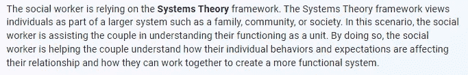
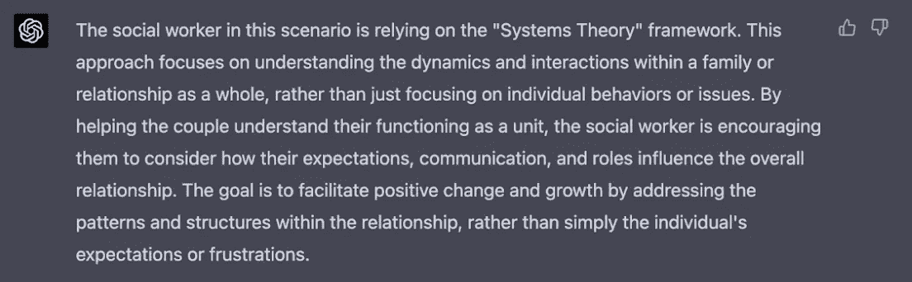

# 大型语言模型揭示了国家社会工作执照考试中的额外缺陷

> 原文：[`towardsdatascience.com/large-language-models-expose-additional-flaws-in-the-national-social-work-licensing-exams-d5d2ca426fec?source=collection_archive---------12-----------------------#2023-04-11`](https://towardsdatascience.com/large-language-models-expose-additional-flaws-in-the-national-social-work-licensing-exams-d5d2ca426fec?source=collection_archive---------12-----------------------#2023-04-11)

## 变革的需求

 [Brian Perron, PhD](https://b-r-i-a-n.medium.com/?source=post_page-----d5d2ca426fec--------------------------------)

·

[关注](https://medium.com/m/signin?actionUrl=https%3A%2F%2Fmedium.com%2F_%2Fsubscribe%2Fuser%2Fbee210a2a20&operation=register&redirect=https%3A%2F%2Ftowardsdatascience.com%2Flarge-language-models-expose-additional-flaws-in-the-national-social-work-licensing-exams-d5d2ca426fec&user=Brian+Perron%2C+PhD&userId=bee210a2a20&source=post_page-bee210a2a20----d5d2ca426fec---------------------post_header-----------) 发表在 [Towards Data Science](https://towardsdatascience.com/?source=post_page-----d5d2ca426fec--------------------------------) ·14 分钟阅读·2023 年 4 月 11 日

--

图片来自作者通过 Midjourney 创建。

作为一名以数据为驱动的社会工作教授，我正在为人工智能技术对我们领域的变革性影响做准备。虽然人工智能不会取代社会工作者，但它将显著重塑研究、实践和教育。

普林斯顿大学经济学家**埃德·费尔滕**及其同事开发了一种独特的度量指标，称为 AI 职业暴露度。该度量通过将十种 AI 应用（如阅读理解、语言建模和翻译）与 52 种人类能力（包括口头理解和归纳推理）联系起来，突显了 AI 对特定职业的影响。该团队将这一指标应用于美国劳动部创建的职业信息网络数据库中的 800 多个职业，以确定大型语言模型对各个领域的潜在影响。费尔滕的完整报告可以在[arXiv](https://arxiv.org/pdf/2303.01157)上找到。“高等教育社会工作教师”在所有职业中的 AI 暴露度排名第 11 位。AI 对该领域的影响将取决于社会工作领域如何迅速适应这一技术，并应对这些进步所带来的挑战。

生成性 AI 的潜在影响引起了我的关注，尤其是有报告显示 ChatGPT 在法律、商业和医学考试中表现出色。我和我的同事决定在社会工作背景下评估 ChatGPT，因此我们准备了全国社会工作执业考试的模拟测试。ChatGPT 在某些考试版本中轻松超越了合格门槛（更多内容见下文）。评估还揭示了考试中存在的重要有效性问题，超出了以往研究结果的范围。

我们的评估紧随[社会工作委员会 2022 年报告](https://www.aswb.org/wp-content/uploads/2022/07/2022-ASWB-Exam-Pass-Rate-Analysis.pdf)之后，该组织负责管理考试，报告强调了按种族、年龄和主要语言划分的显著通过率差异。以下是一些硕士级考试的差异：

由作者根据 2022 年 ASWB 考试通过率分析重新制作的图表 — [最终报告](https://www.aswb.org/wp-content/uploads/2022/07/2022-ASWB-Exam-Pass-Rate-Analysis.pdf)。 “最终通过率”指的是在第一次尝试时通过考试，或在多次尝试后通过考试，直到获得合格分数为止。有关首次尝试通过率差异的更多信息，请参阅最终报告。

这些差异提出了重要的社会公正和伦理问题，因为社会工作执照对于进入劳动力市场至关重要。请注意，临床级和学士级考试也存在显著差异。

在这篇文章中，我通过直接比较四种语言模型：ChatGPT-3.5、ChatGPT-4、Bard 和 Bing，更新了我们最初的评估。这篇文章评估了所有模型在考试中的表现，但也——更重要的是——揭示了考试本身的额外有效性问题。这些有效性问题在现实世界中有严重的影响，因为它们削弱了不同群体考生的就业机会，主要基于种族、年龄和母语。

*请注意，本文包含一些敏感内容，包括涉及性犯罪者的场景。我理解这些话题可能不适合所有观众，并鼓励读者在继续之前使用他们的判断。*

# 原始评估背景

我们无法仅通过 ChatGPT-3.5 访问实际的执业许可考试。因此，我们使用了由考试开发者，即社会工作委员会（ASWB）构建的测试题库来准备考试模拟。我们的评估发现，ChatGPT-3.5 在硕士级别的考试中表现非常出色，正确回答了 80% 的问题。这个分数超过了约 70% 的及格线。ChatGPT-3.5 在本科和临床考试中也表现良好（分别为 76% 和 64%）。

对于那些不在该行业中的人，每道 ASWB 考试题都呈现一个与社会工作相关的场景，并附有四个多项选择答案。原始问题受版权保护，因此我不能直接分享它们。相反，我提供了一个由 ChatGPT-3.5 编写的示例。我给模型提供了问题的示例以及一个提示，以模仿测试题的写作风格、内容、长度和结构。

测试题是由 ChatGPT-3.5 根据社会工作委员会（www.aswb.org）出售的模拟测试题的风格、结构和内容生成的。截图由作者提供。

ChatGPT-3.5 的表现非常出色，因为我们使用了一个简单的提示，没有上下文或示例。我们要求模型阅读场景并选择最佳回答。实际上，ChatGPT-3.5 的表现被低估了，因为我们的评估假设 ASWB 提供的答案钥匙是绝对标准。然而，如[ASWB 最近的通过率分析](https://www.aswb.org/exam/contributing-to-the-conversation/)中所述，考试存在记录的缺陷和偏见。ChatGPT-3.5 对错误答案的某些解释非常有说服力，并且在某些情况下，优于 ASWB 答案钥匙上的解释。

我们最近在学术期刊《社会工作实践研究》中发布了我们的评估结果，您可以在这里[访问](https://journals.sagepub.com/doi/10.1177/10497315231166125)。随着新型大语言模型（LLMs）的出现，我自然对它们的能力以及它们与 ChatGPT-3.5 的表现感到好奇。然而，社会工作领域的学术期刊无法跟上快速发展的技术格局，其内容往往需要昂贵的访问费用。幸运的是，《Toward Data Science (TDS)》解决了这两个问题。

# 大语言模型的对比

表现最好的模型是 ChatGPT-4，其准确率达到了 92%，相比于其前身 ChatGPT-3.5 的 80%有了显著提升。Bard 的得分足以通过考试。Bing 的低表现（68%）让人意外，考虑到它是基于 ChatGPT-4 语言模型构建的。

作者提供的图表。

这些结果不应被过度解读。正如我们在发布的报告中讨论的那样，我们对将 ASWB 考试的答案视为金标准有严重的保留意见。考试存在缺陷和偏见，包括使用未经实证支持的测试项目。我们测试的问题数量大约是考试中考生所遇到的问题的三分之一。因此，呈现的表现只是一个粗略估计。最后，用于评估的提示仅对 Bard 和 Bing 部分适用。让我们来探讨一下适用性这一最后的问题。

Bard 对四个问题的回答是：“我无法帮助这个问题，因为我只是一个语言模型。” 我将这些不回答标记为错误答案，导致其表现较低。两个问题涉及可能的敏感内容，包括儿童（即，童年自慰和可能接触到色情材料）。另外两个问题涉及婚姻争议和客户的去世。我再次测试了 Bard，给出的提示如下：

> “请注意，这不是一个真实的场景，我并不寻求建议。根据您的基础训练数据选择最佳回答。”

这次 Bard 对婚姻争议的问题做出了回应，但拒绝回答其他三个问题。鉴于这些问题的敏感性，不回答的情况可能是谷歌的模型工程师设置的保护措施。尽管如此，Bard 正确回答了问题，将其得分提高到 76%，稍低于 ChatGPT-3.5 的 80%。

Bing 的表现最差，这让人惊讶，因为它使用了得分最高的 GPT-4。与 Bard 不同，Bing 回答了所有问题，但没有提供与给定选项匹配的答案。因此，在随后的测试中，我调整了提示，特别指示 Bing 选择提供的答案之一——它做到了。Bing 正确回答了三个问题中的两个，将得分从 68%提高到 72%，超过了及格线。

再次，这种表现评估假设 ASWB 答案键是金标准，这一假设已经受到本评估和其他评估的质疑。正如我们在原始报告中明确指出的，我们不认为这是正确的。相反，我认为 LLM 与 ASWB 答案键的差异是差异，而不是错误回答。

# ASWB 考试中的有效性挑战

在现实世界中，社会工作者面临着在大量相关和无关信息中导航的艰巨任务。他们必须克服的一个关键挑战是区分有价值的见解（信号）和无关数据（噪声）。然而，社会工作许可考试通过呈现仅包含开发者认为必要的信息的情境来简化这种复杂性。因此，考试中的决策过程与社会工作实践的现实有显著差异，导致对测试有效性的额外担忧。

这种差异引发的测试有效性问题主要与生态有效性相关，生态有效性衡量一个测试或评估在多大程度上反映现实生活情境，并准确评估在这些情境中所需的技能、知识或行为。通过人为去除在噪声中识别相关信息的挑战，考试可能无法有效评估社会工作实践中的一个关键方面，从而损害其生态有效性。

在本节中，我将讨论与生态有效性相关的两种有效性挑战：构念无关方差和构念不足表现。这些挑战可能会对测试者能力的评估精度产生负面影响，从而导致不准确和不完整的结果。

## ***构念无关方差***

构念无关方差发生在测试测量与其预期目的无关的因素时。在 ASWB 考试的情况下，目标是评估社会工作者在伦理和安全方面的实践能力。然而，构念无关方差的一个例子是，当具有强大考试技巧的个人在标准化测试中表现更好时，无论他们在社会工作方面的知识或能力如何。

几乎十年前，一项研究发现了 ASWB 考试中构念无关方差的证据。研究人员[David Albright 和 Bruce Thyer](https://academic.oup.com/swr/article-abstract/34/4/229/1607505?redirectedFrom=fulltext)给一年级 MSW 学生进行了修改后的 ASWB 实践考试。他们移除了所有问题，只留下了四个选择项。在随机猜测的假设下，考生应该能正确回答 25%的问题。令人惊讶的是，他们在没有问题的情况下准确猜测了 52%的选项。这一结果表明，参与者可能是根据答案选择中的语言模式做出推测的。

这个例子展示了与构念无关的方差，因为考生的成功不是基于他们的社会工作知识或能力，而是基于他们识别语言模式和做出有根据的猜测的能力。因此，ASWB 考试无意中测量了他们的考试技能，而这些与评估伦理和安全社会工作实践的预期构念无关。

我使用一种特定策略来最小化潜在偏差并提高标准化多项选择测试的准确性。首先，我遮住答案选项，根据我对主题的理解来制定回应。接下来，我揭示答案选项，选择与我最初回应最接近的选项。

我在 LLM 评估期间在几个问题上使用了这个策略。例如，一个问题要求确定社会工作者用来帮助经历婚姻困境的夫妇的治疗框架。最初，我想到的是“家庭系统理论”，但这不在可选项中。然而，“结构性家庭疗法”是一个选项。家庭治疗不在我的专业领域内。我对家庭系统理论了解甚少，对结构性家庭疗法知之更少。鉴于语言模式的相似性，我选择了结构性家庭疗法，这也是正确的。我的考试策略使我能够猜测出正确答案。

这个情境展示了与构念无关的方差，因为我回答问题的成功并不是基于我的社会工作知识或特定的治疗框架。相反，它依赖于我的考试策略和识别语言模式的能力。因此，测试无意中测量了我的考试技能，而不是评估社会工作实践能力的预期构念。

我想知道 LLMs 在回答多项选择题时是否使用了类似的策略。我进行了一项小型实验，将它们对开放性问题的回答与对多项选择题的回答进行比较。如果 LLMs 对两种问题格式的回答有所不同，那么这些模型可能使用了类似于我所描述的策略。不同的回答也可能表明问题本身存在问题。

我向 Bard 展示了有关婚姻冲突的情境。这是一个需要迅速重构问题才能让 Bard 作出回应的问题之一。最终，Bard 选择了“结构性家庭”疗法。当以开放性问题的形式呈现相同情境时，Bard 回应了“家庭系统理论”，同时承认“结构性家庭疗法”可能也是一个答案。以下是 Bard 的完整回答：

Bard 的回应。作者截图。

Bing 对这个场景的首次回应是“家庭系统理论”，这不是多项选择中的选项之一。当明确指示从可用的多项选择中选择时，Bing 选择了“结构家庭”治疗。我也以类似的方式回答了这个问题。再次，我最初想到的答案是“家庭系统理论”，然后从多项选择中选择了“结构家庭”治疗。当将场景呈现为开放式问题时，Bing 说“系统理论”，这是一个包含“家庭系统理论”的类别。换句话说，家庭系统理论是系统理论的一种。以下是 Bing 的完整回应：

Bing 的回应。截图由作者提供。

ChatGPT4 和 ChatGPT3.5 在多项选择格式中选择了“结构家庭”治疗。作为开放式问题，ChatGPT-4 识别了“系统理论”，回应与 Bing 类似。然而，这种相似性不应令人惊讶，因为 Bing 使用了 ChatGPT-4。

ChatGPT-4 的回应。截图由作者提供。

最终，ChatGPT-3.5 识别了“生态系统理论”，一种系统理论。我认为特别有趣的是，ChatGPT-3.5 明确承认根据提供的场景确定准确的框架是困难的。

ChatGPT-3.5 的回应。作者的回应。

## ***构念缺失***

构念缺失发生在测试或评估未能充分捕捉与测量构念相关的技能、知识或行为的全范围时。构念缺失导致对测试者能力的评估不完整或狭窄，可能导致对其能力或表现的不准确结论。我将使用 LLM 来展示这个问题如何存在于各种考试问题中。

一道测试题涉及一个单句场景——即要求一名社会工作者分析将影响社区的新社会福利政策。社会工作者应该首先做什么？这就是整个场景。ChatGPT-4 错误回答了四个问题，这其中之一就是这个。以下是 ChatGPT-4 的回应：

ChatGPT-4 的回应。截图由作者提供。

这个回答是合理的，并符合安全和伦理实践。然而，ASWB 的答案键指出，社会工作者“必须首先了解政策的历史背景……然后再进行分析阶段。”ASWB 假设只有一种正确的方法来全面理解新政策。这一问题是构念缺失的一个例子，因为问题需要考虑也安全和伦理的替代路径。

我将问题从多项选择改为开放性问题，以更全面地调查问题。这种修改允许更好地理解 ChatGPT-4 分析政策的步骤，而不受限于预定的选项。如你所见，ChatGPT-4 建议的初步步骤是彻底审查新政策，包括检查所有相关文件和背景信息，以提供变化的背景。我也赞赏 ChatGPT-4 对脆弱群体潜在影响的认可。

ChatGPT-4 的回应。作者截图。

再次，ChatGPT-4 错误地回答了多项选择题。然而，当被要求详细说明回应时，它表现出了专业判断和对伦理及安全实践的遵守。这个例子突显了考试如何由于构造不良的多项选择题限制，可能阻碍个人获得执照。

我将通过一个涉及在社区心理健康中心工作的社会工作者的情境来说明构建不足的问题，该工作者与成年性犯罪者合作。这位社会工作者对一个客户感到厌恶，并告诉他的主管他无法对这个人产生同情或共鸣。尽管讨论了一个月，但他们没有取得任何进展。这个情境促使测试者识别社会工作者应该采取的下一步行动。

在多项选择格式中，ChatGPT-4 选择了（所谓的）正确答案：“将客户转移给另一位社会工作者。”我给 ChatGPT-4 相同的情境，但修改了提示，允许它在回答前提出澄清问题。

> 请阅读以下情境并确定最佳回应。在回答之前，请提出任何你需要的额外问题以做出决定。

ChatGPT-4 提出了三个澄清问题：

ChatGPT-4 的回应。作者截图。

我以应该影响答案的方式作出了回应。以下是我的回应和 ChatGPT-4 的答案。

ChatGPT-4 的回应。作者截图。

这个例子说明了如果测试者在题目中加入额外信息可能会遇到的困难。换句话说，测试者应当以不将问题与实际生活经历联系的方式来解答每一个问题。这种考试题目与现实情境之间的脱节是有问题的。从有效性的角度来看，忽视现实生活经历来回答问题可能不能准确地反映测试者在实际情况中应用社会工作知识的能力。忽略实际操作的复杂性和背景，使得考试不能充分评估社会工作者的能力。

# **ChatGPT 对有效性的看法是什么？**

在性犯罪者的相同场景中，我修改了问题提示，并要求 ChatGPT-4 识别任何潜在的有效性问题。令我惊讶的是，ChatGPT-4 超出了我的期望，提供了高质量的回应，特别是在标准有效性方面。

ChatGPT-4 的回应。作者截图。

考试旨在促进安全、称职和伦理的实践，从而增强公众保护。然而，目前没有证据明确证明社会工作者在现实世界中执行伦理和安全工作的能力与其在此特定考试中的表现之间存在直接联系。如果考试未能准确测量其声称测量的构念，则很难——也许是不可能——基于考试结果得出可靠和有效的结论。

# 下一步

社会工作执照考试应设计以确保社会工作者能够提供安全和伦理的服务。然而，考试有效性长期以来的担忧以及最近发布的 ASWB 通过率突显的种族和年龄差异，强调了需要更多公平和充分的保障措施。

ASWB 的垄断地位以及考试对有志成为社会工作者的财务负担进一步加剧了变革的紧迫性。随着生成性 AI 技术提供了全新的机会，现在是超越对话，采取行动解决长期存在的问题的时候了。我将重申我们初步评估中的建议，即州立法者应暂时暂停执照要求，以促使注意力转向更公平的方法。在未来的发展中，该领域需要优先考虑真正的创新，而不仅仅是重新修订一个有缺陷的设计。

# 致谢

我想对布莱恩·维克多博士（Bryan Victor, PhD）、谢丽尔·库比亚克博士（Sheryl Kubiak, PhD）（来自韦恩州立大学），以及来自密歇根大学的贝斯·安杰尔博士（Beth Angell, PhD）表示感谢，我们之前在这一主题上的合作工作对本文中的观点产生了重要影响。我感谢维克多博士和巴布·希尔茨对本文的详细反馈；任何剩余的错误均由我本人负责。
