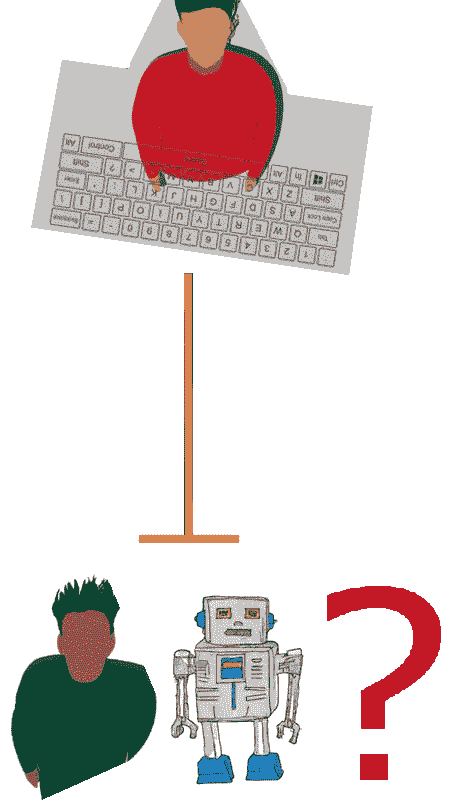
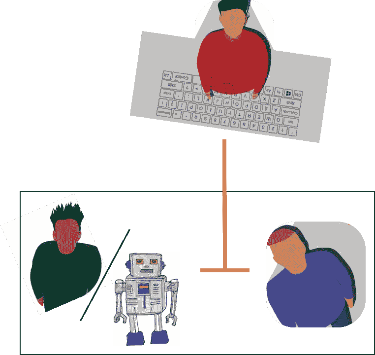
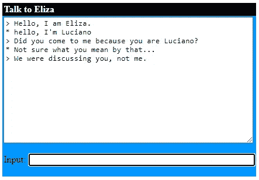
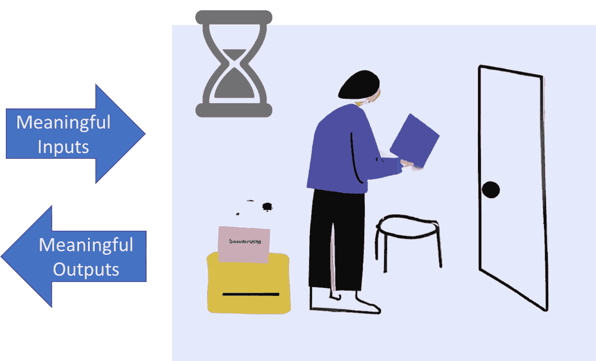

# 大型语言模型在图灵测试和中文房间论证下的考量

> 原文：[`towardsdatascience.com/large-language-models-in-light-of-the-turing-test-and-the-chinese-room-argument-f0b34585280e`](https://towardsdatascience.com/large-language-models-in-light-of-the-turing-test-and-the-chinese-room-argument-f0b34585280e)

## 继续探讨最现代科技、AI 的哲学层面以及科幻小说之间的前沿话题

 [LucianoSphere (Luciano Abriata, PhD)](https://lucianosphere.medium.com/?source=post_page-----f0b34585280e--------------------------------)

·发表于 [Towards Data Science](https://towardsdatascience.com/?source=post_page-----f0b34585280e--------------------------------) ·阅读时长 9 分钟·2023 年 8 月 3 日

--

红色的那个人是在和另一个人交流还是和机器交流？本文讨论了现代大型语言模型在这个问题的背景下，这直接涉及“智能”是什么。本文中的所有其他图示均由作者使用 Dall-E-2 生成。

**AI 近期成为热点话题，ChatGPT、Bard 及其他大型 AI 语言模型在自然语言对话方面取得了显著进展。让我们探讨 AI 的历史以及它最早和最著名的测试和思想实验之一：*图灵测试* 和 *中文房间论证*，并在现代语言模型的背景下讨论它们的观点。**

这篇分析延续了我之前写的一篇文章，似乎在读者中引起了相当大的兴趣：

 ## 如果口头和书面交流使人类发展了智能……那语言模型怎么回事？

### 我们是否也是随机的鹦鹉，只是训练得更好？AI 语言模型是否沿袭了人类的…

towardsdatascience.com

# 现代大型语言模型、图灵测试以及中文房间论证

我们刚刚迈过 21 世纪的前二十年，我们有像 ChatGPT 和 Bard 这样的语言模型，坦白说，当世纪初开始时，我们甚至不曾想到这些模型可能会出现。这些模型使用先进的机器学习技术来吞噬大量文本，然后通过应用从训练文本中“学习”的模式来执行高度复杂的与文本相关的任务，形式上是一种用户与计算机模型之间的自然对话。

这些模型一出现就令人震惊，因为它们似乎真的很“智能”。如果你觉得我在夸张，那是因为你被像我一样对科学和技术过于投入的人包围了……但只需去问问这些圈子之外的人。

尽管有人声称现代语言模型可能通过图灵测试（见下节），但理解这种测试的局限性至关重要。最重要的是，图灵测试依赖于**智能的幻觉**，而不是涉及任何实际理解的真正智能。此外，鉴于此，发现一个程序通过测试真的那么令人惊讶吗？

现代大型语言模型只是一个统计模型，它读取输入的标记并输出一个新的标记集合，这些标记集合具有非常好的语法，甚至还有一些有意义的内容。虽然它们能够进行连贯和上下文恰当的对话，确实令人惊讶，但这完全无法等同于真正的理解，更不用说意识了。然而，除了在最新版本中，它们会不断地重复警告你它是一个语言模型，我认为我们都可以相当确信 ChatGPT 能够完美地欺骗任何人，让他们认为它是另一个人——也就是说，它可以通过定义的图灵测试。然而，“中文房间论证”则认为语言模型只是根据在大量训练数据集中观察到的模式来处理语言输入并生成响应，但它当然缺乏对意义的真正理解，即使在某些条件下一些语言模型似乎能够通过类似于逻辑思维的步骤来解决问题。你同意吗？还是不同意？

> 关于如何区分模拟行为和人工智能系统中的真正认知能力的辩论仍在继续。即使是一个基本的、达成共识的智能定义也仍在追寻中。

# “图灵测试”和聊天机器人的演变

图灵测试以著名数学家、逻辑学家和密码学家**艾伦·图灵**的名字命名，是用来判断机器是否能够表现出与人类无法区分的行为的测试。图灵被广泛认为是计算机科学之父，他在第二次世界大战期间在破解纳粹恩尼格码方面发挥了关键作用，这一点在电影《模仿游戏》中得到了很好的展现，这一概念与测试的理念直接相关。

在 1950 年发表的开创性论文《计算机 Machinery and Intelligence》中，图灵提出了一个基本问题，即机器是否能够思考或表现出智能。由于定义智能本身就是一个令人望而却步的挑战，图灵没有被定义机器是什么或智能包含什么而困扰，而是选择了一种更简单和实用的方法：确定一台机器是否能够在对话中令人信服地模仿人类。这导致了图灵测试的概念，也称为“模仿游戏”——电影标题也由此而来。

在“模仿游戏”中，两个人，一男一女，分别待在不同的房间里。第三个人，即审问者，与这两位个体互动，旨在仅通过书面消息确定他们的性别。图灵建议将“模仿游戏”中的一个参与者替换为机器，并评估审问者是否能够根据他们的回应区分人类和机器。

原始提出的图灵测试方案可以简化为一个人和另一个实体进行对话，并尝试确定对方是人还是机器，如引导照片所示。

然而，进行图灵测试存在挑战。没有固定的规则或标准来通过测试，因此对特定机器是否成功展示了类似人类的行为存在不同的意见。早期尝试，如 1966 年约瑟夫·魏岑鲍姆的 ELIZA，旨在通过用通用问题或观察回应用户输入来模拟对话。虽然 ELIZA 成功地欺骗了一些评委，但它更像是一个巧妙编程的聊天机器人，而不是一个真正智能的实体。实际上，你可以与它聊天，你会很快意识到它远不如 ChatGPT、Bard 或任何其他现代 AI 聊天机器人“智能”。

你可以在线尝试的 Eliza 机器人示例（链接在文章末尾）。

其他值得注意的图灵测试尝试包括 PARRY，一个模拟偏执型精神分裂症的 AI 程序，以及 Eugene Goostman，一个设计为乌克兰青少年的聊天机器人。虽然它们取得了一些成功，但最终还是依赖于操控语言而没有真正理解它。并不是说 ChatGPT 能理解它所说的内容……但去尝试这些旧聊天机器人，你会明白我的意思！

# “中国房间论证”和 AI 是否真的能理解它所读到和写的内容的可能性

1980 年，哲学家约翰·塞尔提出的“中国房间论证”挑战了通过图灵测试即等同于真正的智能或理解的观念。今天看来这似乎非常合理，但将这些想法应用于现代大型语言模型时会变得非常有趣，如我们之前所预期的那样。

**Searle**提出了一个被称为“**中文房间**”的思想实验。设想一个人被放在一个房间里，房间里充满了装有中文符号的篮子。这个人对中文没有任何了解，但拥有一本包含逐步指令的手册，用于正确组合这些符号。我们不关心这个手册是如何创建的，重点在于这些指令可以完美地生成有序的输出符号系列，使其作为对给定输入集的响应完全合理。

根据**中文房间实验**的方案，一个能对特定输入产生有意义输出的黑箱，无论任务看起来多么复杂，都不一定需要理解它在做什么，尽管它从外部看起来非常智能，但并不一定意味着具有任何形式的智能。

从房间外部，人们发送符号组合作为问题。房间内的人按照手册的指示，回应相应的符号组合。这是没有理解回应的含义；实际上，这个人甚至不在乎理解：他或她只是按照手册的指示来解释如何根据收到的输入来构建输出。然而，对于房间外的观察者来说，出于实际原因，这个房间整体上表现得像是理解了语言。

结论是，尽管这个房间内的人能使外面的人相信他或她理解中文，但按定义来说，这个人并不真正理解语言。**Searle**的论点质疑那些通过**图灵测试**的 AI 系统是否真正拥有智能，还是只是通过机械地操作符号或语言来模拟智能——正是我们之前推测的那种情况。这一观点挑战了**图灵**关于“**强 AI**”的信念，后者在某种程度上断言，一个正确编程的机器可以真正思考并拥有思想。

批评者对这种思想实验进行了广泛的辩论，有些人提出了“系统反应”理论，认为房间内的占有人类似于计算机的中央处理器。塞尔反驳说，理解不能仅仅从系统的部分中产生。另一个反对意见认为，具有传感器和与环境互动能力的机器人可能会像人类儿童一样学习语言，这与我之前讨论的这里和[这里](https://medium.com/predict/humans-as-super-advanced-stochastic-parrots-36d3e66e1353)的观点相似。塞尔认为，感官输入也将包括机器可以操作但无法理解的符号。但那……这难道也适用于我们人类吗？毕竟，我们从感官的符号输入中建立了一个现实，这些输入被信念、先入之见和经验所扭曲。你甚至不能确定这个现实对每个人来说是否相同，但我们可以以看似“智能”的方式交换信息。

抛开讨论，图灵测试仍然是人工智能发展中的一个重要里程碑，像 OpenAI 的 ChatGPT、Google 的 Bard 或 Meta 的 Llama 这样的语言模型展示了在模拟类人对话方面的显著进展，甚至可能会通过测试。但中国房间论点仍然存在，警告我们不要过早地将这种行为与真正的智能等同起来，这一点看似合理但需要特别强调，尤其是在你讨论或听到那些远离技术的人的讨论时，他们中的许多人已经把“人工智能”中的“智能”部分当成了现实。

> 随着研究和技术的进步，政策需要跟上，以缓解人工智能语言模型的负面影响；公众需要了解这些含义——“人工”，“智能”，“技术”，“生命”

人工智能的未来可能会看到一些进展，这些进展模糊了模拟智能与真正理解之间的界限，但目前我们必须认识到这种区别。继续探索人工智能的潜力并了解其局限性对于在各个领域促进负责任和伦理的应用至关重要，同时也值得推动科学与科幻之间的界限，甚至涉及生命本质的问题。

# 相关文献及进一步阅读

图灵原始文章提出了图灵测试：

 [## I.-计算机械与智能

### 我提议考虑这样一个问题：“机器能思考吗？”这应该从定义这一问题的意义开始……

academic.oup.com](https://academic.oup.com/mind/article/LIX/236/433/986238?source=post_page-----f0b34585280e--------------------------------)

约翰·塞尔讨论中文房间论证的文章：

 [## 心智、大脑和程序 | 行为与脑科学 | 剑桥核心

### 心智、大脑和程序 - 第 3 卷 第 3 期

www.cambridge.org](https://www.cambridge.org/core/journals/behavioral-and-brain-sciences/article/abs/minds-brains-and-programs/DC644B47A4299C637C89772FACC2706A?source=post_page-----f0b34585280e--------------------------------)

中文房间论证由《大英百科全书》解释：

 [## 中文房间论证 | 定义、机器智能、约翰·塞尔、图灵测试、反对意见等…

### 中文房间论证，由美国哲学家**约翰·塞尔**提出的思想实验，首次发表于他的期刊…

www.britannica.com](https://www.britannica.com/topic/Chinese-room-argument?source=post_page-----f0b34585280e--------------------------------)

与像 Eliza 和 Parry 这样的早期流行聊天机器人聊天 - 期待不到像 ChatGPT 或 Bard 这样的效果！：

[## Eliza，计算机治疗师

### 与 Eliza 聊天！

psych.fullerton.edu](https://psych.fullerton.edu/mbirnbaum/psych101/eliza.htm?source=post_page-----f0b34585280e--------------------------------)  [## Bot Libre

### Bot Libre 是一个免费的开源平台，适用于聊天机器人和网页、移动端、社交媒体的人工智能…

www.botlibre.com](https://www.botlibre.com/bot?instance=857177&dynamicChat=Chat&source=post_page-----f0b34585280e--------------------------------)

我的一些其他文章，您可能会感兴趣：

 ## Gato，来自 Deepmind 的最新成果。迈向真正的人工智能？

### Gato 可以玩游戏、生成文本、处理图像和控制机器人手臂。它的体积也不大。是否真正的人工智能…

towardsdatascience.com  ## 在击败物理学建模原子和分子后，机器学习现在正在与…

### 将两种最佳的世界结合起来

[towardsdatascience.com

[***www.lucianoabriata.com***](https://www.lucianoabriata.com/) *我撰写和拍摄关于我广泛兴趣范围内的一切内容：自然、科学、技术、编程等。* [***成为 Medium 会员***](https://lucianosphere.medium.com/membership) *以访问所有故事（平台的附属链接，通过这些链接我会获得少量收入，但不会对你产生费用），以及* [***订阅以通过邮件获取我的新故事***](https://lucianosphere.medium.com/subscribe) ***。要* ***咨询小型工作*** *请查看我的* [***服务页面***](https://lucianoabriata.altervista.org/services/index.html)*。你可以* [***在这里联系我***](https://lucianoabriata.altervista.org/office/contact.html)***。***
