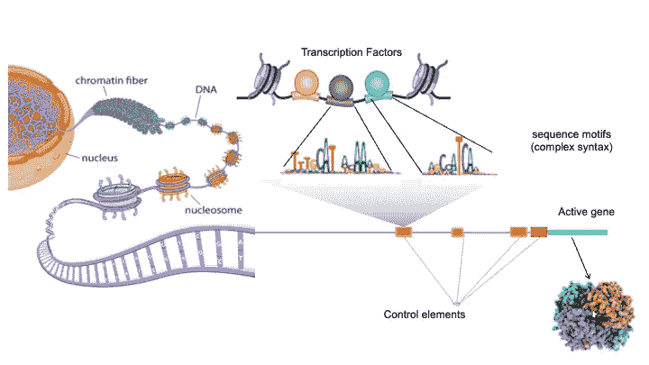

# 大型语言模型在分子生物学中的应用

> 原文：[`towardsdatascience.com/large-language-models-in-molecular-biology-9eb6b65d8a30?source=collection_archive---------0-----------------------#2023-06-02`](https://towardsdatascience.com/large-language-models-in-molecular-biology-9eb6b65d8a30?source=collection_archive---------0-----------------------#2023-06-02)

## 破解生物学的语言，从 DNA 到细胞再到人类健康

 [Serafim Batzoglou](https://medium.com/@serafimbatzoglou?source=post_page-----9eb6b65d8a30--------------------------------)

·

[关注](https://medium.com/m/signin?actionUrl=https%3A%2F%2Fmedium.com%2F_%2Fsubscribe%2Fuser%2Fccf342949c4&operation=register&redirect=https%3A%2F%2Ftowardsdatascience.com%2Flarge-language-models-in-molecular-biology-9eb6b65d8a30&user=Serafim+Batzoglou&userId=ccf342949c4&source=post_page-ccf342949c4----9eb6b65d8a30---------------------post_header-----------) 发表在 [Towards Data Science](https://towardsdatascience.com/?source=post_page-----9eb6b65d8a30--------------------------------) · 40 分钟阅读 · 2023 年 6 月 2 日

--

**作者提供的图像，使用 Midjourney 生成，提示为“DNA”。**

# 引言

我们是否能破解分子生物学的语言？在这里，我认为我们距离拥有准确的计算模型，模拟从 DNA 到基因表达再到蛋白质的主要生物分子信息通道只有几年时间，这些模型能与实验准确度相媲美，并可用于医学和药物发现。

自从 1996 年开始我的博士研究以来，计算生物学界已经接受了“生物学正在成为一种计算科学”的口号。我们的终极目标是以类似于工程学科的精确性和可重复性来预测细胞内的生物分子的活动，以及我们身体内的细胞。我们的目标是创建生物系统的计算模型，从而在计算机上进行准确的生物分子实验。深度学习，尤其是大型语言模型（LLMs）以及负担得起的大规模数据生成的最新进展，正在将这一愿景逐步变为现实。

LLMs 已经被证明在建模人类语言方面具有非凡的能力，表现出诸如通过律师资格考试、编写代码、以多样风格创作诗歌等惊人壮举，甚至可以说让图灵测试变得过时。然而，它们在建模生物分子系统方面的潜力甚至可能超越它们在建模人类语言方面的能力。人类语言反映了人类的思维，给我们带来了内在的优势，而分子生物学则复杂、混乱且反直觉。尽管生物分子系统的组成混乱，但它们却是稳健且可重复的，由数百万个组件组成，这些组件以经过数十亿年进化的方式相互作用。由此产生的系统极为复杂，超出了人类的理解能力。生物学家们通常依赖于一些简单的规则，这些规则只有 60%或 80%的时候有效，从而导致了易于理解但不完整的叙述。我们生成庞大的生物分子数据的能力目前已超出了我们理解这些系统的能力。

本文将概述一些基于深度学习的语言模型在分子生物学领域的最新突破。我们将讨论这些进展如何在未来几年内与直接在大规模生物分子和人群健康数据上训练 LLMs 相结合，推动该领域向前发展。鉴于 LLMs 和深度学习比分子生物学更为广泛的受众，我们首先简要介绍 LLMs，然后更详细地介绍分子生物学，接着描述一些近期在分子生物学领域的 LLM 进展，最后展望未来。

在我们讨论的核心是生物学中正在进行的范式转变。尽管“范式转变”这个术语经常被滥用，但在这里确实非常恰当。传统上，生物学是假设驱动的：研究人员识别模式，提出假设，设计实验或研究以测试这些假设，并根据结果调整他们的理论。这种方法正在逐渐被数据驱动的建模方法所取代。在这种新兴的范式中，研究人员从假设无关的大规模数据生成开始，然后训练一个像 LLM 这样的模型，或者将数据整合到现有的 LLM 中。一旦 LLM 能够准确地模拟系统，接近实验复制中看到的保真度，研究人员可以询问 LLM 以提取关于系统的见解，并识别出底层的生物学原则。这种转变将越来越明显，并允许精确地对生物分子系统进行建模，超出人类能力所及的细微度。

# 大语言模型

**作者提供的图片，使用 Midjourney 创建。**

大语言模型（LLM）是一种通过审查大量文本数据获得生成与人类语言相仿文本能力的神经网络类型。它运行在“自我监督”的原则上，模型学习基于先前单词预测句子中接下来的单词。这个过程使 LLM 能够识别文本中的模式、关系和上下文，从而使其能够回答查询、生成新内容，甚至进行预测。LLM 可以被视为高级的自动补全形式，预测你可能要输入的下一个单词，但具有出人意料的能力，表现得好像它们对语言、上下文和含义有着扎实的理解。这使它们能够跨多种主题生成连贯而富有知识性的响应。

语言模型的发展看到每一代新的模型都具有增强的建模能力。让我们简要地介绍一下主要类型的语言模型及其独特特征：

1.  **Word grams:** 这些基本模型根据训练数据中词对或词袋（无序词组）的频率来预测句子中的下一个单词。它们忽略上下文或词序，导致生成的文本是不连贯的句子，与人类文本几乎没有相似之处。

1.  **CNNs (Convolutional Neural Networks):** 这些模型通过考虑固定窗口内相邻单词之间的关系来分析文本数据。窗口可以非常宽，使用类似扩展的技术。虽然 CNN 在识别局部模式方面表现出色，但在捕捉长距离依赖或理解复杂的句子结构方面则显得不足。

1.  **LSTM（长短期记忆网络）：** 这些是能够存储和处理来自文本早期部分信息的递归神经网络（RNN）的变体。LSTM 在理解上下文和处理长距离依赖方面优于 CNN，但在复杂句子和长文本方面仍然存在不足。

1.  **注意力机制** 使模型在进行预测时能够集中于输入的相关部分。一些注意力“头”允许模型在预测下一个词时关注前面文本的不同部分。它们的功能类似于你在长篇文章中重新访问关键点或细节的方式，使模型能够回顾文本中的相关部分，并将这些信息融入当前的上下文中。变换器是一类实现注意力机制的语言模型。

1.  **大型语言模型（LLMs）：** 如 GPT-3 这样的模型是利用注意力机制的变换器，并在大量数据上进行训练。它们的巨大规模使得学习文本中的复杂模式、关系和上下文成为可能。LLMs 代表了当前最先进的语言模型，能够在广泛的主题上生成非常准确和连贯的回应。

有两个使用变换器架构并在该领域引入重大突破的 LLM 值得特别提及：BERT 和 GPT 系列。

**BERT（双向编码器表示从变换器）**（Devlin 等，2018）是谷歌在 2018 年推出的一系列 LLM，并开源，代码可在 GitHub 上获取，并发布了多个预训练模型。BERT 使用 **掩蔽语言建模** 进行训练。其思想是随机隐藏或“掩蔽”输入标记的某些百分比，然后预测这些被掩蔽的标记。这迫使模型从输入的左右两侧理解上下文（因此称为“双向”）。BERT 训练还使用了下一句预测任务。在训练过程中，模型会接收到一对句子，并必须预测该对句子中的第二个句子是否是原始文档中的下一句。

**GPT（生成预训练变换器）** 是由 OpenAI 推出的一系列 LLM。与 BERT 不同，GPT 使用传统的语言建模任务——自动补全进行训练：预测句子中的下一个词。与 BERT 不同，GPT 在训练过程中只关注左侧上下文（或先前的标记），因此它是单向的。GPT 是一个生成模型，在涉及文本生成的任务中表现特别强大，如写作、生成诗歌或完成句子。最新一代 GPT，即 GPT-4，在多个领域的各种任务中表现出色，导致它被描述为展现出一些通用智能的火花（Bubeck 等，2023）。值得注意的是，并不是每个人都认为 GPT 和类似的 LLM 表现出通用智能。引用 Rodney Brooks 的话，“不要把表现与能力混淆” ([`spectrum.ieee.org/amp/gpt-4-calm-down-2660261157`](https://spectrum.ieee.org/amp/gpt-4-calm-down-2660261157))。然而，正如我们将在本文中看到的，这并不是它们在分子生物学中有效应用的限制。

# 遗传法则

人类或其他任何生物的生物轨迹，从胚胎发育到其整个生命周期，是遗传与环境之间复杂的相互作用：个体的 DNA 与个体所暴露的环境之间的对话（图 1）。

**图 1\. 基因型-表型-环境。** 个体的表型是个体的 DNA 与环境之间的对话。图像由作者提供。

分子生物学的中心法则描述了遗传信息在生物体内的流动。这些遗传信息的来源是我们的 DNA，它在我们体内每个细胞的核内都有一个精确的副本。人类 DNA 由约 30 亿个核苷酸组成，排列在 23 条染色体上，其中 22 条是常染色体，1 条是性染色体，分别为 X 或 Y。每个人拥有两个几乎相同的人类基因组副本：一个由母亲遗传，一个由父亲遗传。我们体内大约 30 万亿个细胞中的每一个都在其细胞核内保留了一个几乎相同的母系和父系基因组副本。

**图 2\. 人类染色体。** 染色质以层级螺旋结构紧密包装。在底层，146 对核苷酸缠绕在组蛋白上，类似于珠子。组蛋白然后被螺旋状缠绕并超螺旋形成一个紧凑的染色体，这个染色体适合于细胞核内。图像来源于 VectorMine，iStock 内容许可协议。

基因组中包含大约 20,000 个基因，这些基因是负责蛋白质合成的 DNA 片段。基因组中约有 1%编码蛋白质，其余部分包括控制基因表达的区域、基因内部不编码蛋白质的区域、对 DNA 结构有贡献的区域，以及“垃圾”区域，这些自私的 DNA“学会”了自我复制。

分子生物学的中心法则描述了从基因组到基因表达以及随后的蛋白质生产的分子信息流，这是生命的基本构件。

**图 3. 分子生物学的中心法则。** 我们的 DNA 由大约 20,000 个基因和基因间区域组成。基因在细胞内通过**转录**过程被表达，将基因复制成单链分子 mRNA，以及**翻译**过程，将 mRNA 序列翻译成由氨基酸组成的蛋白质序列。因此，DNA 片段的 4 个字母的核苷酸代码被翻译成蛋白质序列的 20 种氨基酸代码。然后，蛋白质序列在三维空间中折叠成功能性蛋白质结构。图片由作者提供。

蛋白质合成包括三个主要步骤：**转录**（图 3）、**剪接**（图 4）和**翻译**。在转录过程中，与基因对应的 DNA 片段作为模板被复制成名为信使 RNA（mRNA）的分子。mRNA 分子经过剪接，这一过程将某些片段剪切掉或剪接出来，其余片段被连接在一起形成成熟的 mRNA。被剪切的区域称为**内含子**，而保留的区域，即**外显子**，构成了 mRNA 的蛋白质编码部分。每个成熟的 mRNA 由平均 7 个外显子组装而成，尽管在人体内的数量从 1 到 79 不等，例如人类的肌营养不良蛋白基因。剪接在高级生物中至关重要，因为一个基因可以通过在剪接过程中组装不同的外显子组合，产生多种不同的蛋白质。20,000 个基因产生了大约 70,000 种已知的标准剪接形式，以及大量的稀有或异常剪接形式。每种蛋白质变体的表达时机是细胞分子控制工具包的一部分。

**图 4. mRNA 的剪接。** 在人类和其他真核生物中，转录与翻译之间的一个重要过程是剪接。mRNA 的某些区域被切除，这些区域称为内含子，其余部分则按顺序粘合在一起，称为外显子。相同的基因可以以多种方式进行剪接，从而产生不同的剪接形式，增加了蛋白质的多样性。图片由作者提供。

转录后，mRNA 被运送到细胞的蛋白质合成机制，即**核糖体**，在那里发生翻译。在翻译过程中，mRNA 序列按三核苷酸一组进行解码，这些组称为密码子。每个密码子对应于 20 种氨基酸中的一种，这些氨基酸是蛋白质的基本构建块。这些氨基酸被链接在一起形成蛋白质序列，随后折叠成一个功能性三维蛋白质结构。

蛋白质是生命的基本构件，在几乎所有生物过程中的作用都至关重要。它们提供了细胞的结构组件，作为酶催化化学反应，并在细胞内部促进沟通和运输。

**基因调控**（图 5）涉及决定基因在细胞内何时、何地以及以何种数量表达的复杂过程。这确保了正确的蛋白质在正确的数量上及时生产。基因调控发生在不同的层次上，包括染色质的结构化、化学修饰以及特定蛋白质（称为转录因子）的作用。

**图 5. 基因调控。** 基因的启动子区域，即基因起始点的上游（左侧）区域，包含包括与某些称为转录因子的蛋白质结合的基序在内的控制元素。这些转录因子在招募 RNA 聚合酶和控制基因的表达时间、位置和数量方面发挥作用。开放的染色质是转录发生所必需的。图片改编自 Anshul Kundaje 的演示文稿，并在此处获得许可。

**转录因子（TFs）** 是在基因调控中发挥重要作用的蛋白质。它们结合到基因附近或基因内的特定 DNA 序列上，这些序列被称为转录因子结合位点，从而影响 RNA 聚合酶的招募，RNA 聚合酶是负责 mRNA 合成的酶。因此，转录因子调节目标基因的表达，确保基因在响应不同细胞信号和环境条件下的适当表达。转录因子本身也受到转录因子的调节，形成复杂的基因调控途径。

**启动子和增强子** 是在基因表达调控中发挥作用的 DNA 区域。启动子位于基因起始点的邻近区域（在化学方向上位于基因起始点的上游或左侧），而增强子则是较远的调控元件，位于内含子内或基因间。启动子和增强子都含有多个转录因子结合位点。在转录因子的协助下，基因的启动子和增强子形成三维结构，招募并调控负责 mRNA 合成的 RNA 聚合酶。

**染色质结构**（图 2）是 DNA 和蛋白质（组蛋白）的混合物，组成了我们的染色体。为了紧凑地容纳在每个细胞的细胞核中，DNA 绕着被称为组蛋白的蛋白质缠绕。组蛋白是由四个组蛋白蛋白质副本组装成的四聚体结构。每个这样的结构绕着 146 对核苷酸的 DNA 缠绕，形成一种念珠状的结构，随后折叠成更高阶的螺旋结构，即染色质。染色质的组织决定了哪些 DNA 区域对基因表达是可及的。要发生基因表达，染色质必须展开。相反，紧密打包的染色质则阻止基因表达。

**组蛋白修饰** 是指一些化学修饰，例如乙酰化或甲基化，这些修饰可以影响组蛋白珠子，从而影响染色质结构和基因可及性。这些修饰可以促进或抑制基因表达，具体取决于修饰的类型和位置。它们也是组蛋白密码的一部分，组蛋白密码是一种表观遗传密码，即在 DNA 遗传密码上叠加的额外编码层。（“epi-”是一个希腊词根，意为“在……之上”。）

**DNA 甲基化** 是一种化学修饰，其中一个甲基基团被添加到 DNA 分子上，通常在特定的胞嘧啶碱基处。甲基化可以通过影响转录因子的结合或改变染色质结构来影响基因表达，使其更加紧凑，减少转录的可及性。甲基化和其他 DNA 化学修饰也是表观遗传密码的一部分。基因调控是一个动态过程，特定于每种细胞类型。我们身体内的不同细胞展示了独特的基因表达谱，使它们能够执行特化的功能。通过精确控制基因表达，细胞可以响应环境刺激，维持稳态，并执行生命所需的复杂过程。

**信息的双向流动。** 传统上，中心法则被描述为单向信息流动：DNA 到 RNA 到蛋白质。然而，这种情况存在例外，我们对其潜在机制的了解仍在不断发展，这一主题超出了本简要综述的范围。值得提及一些例外。 (1) 逆转录的发现，即 RNA 被转化回 DNA 的过程，挑战了中心法则的单向性。这个过程由酶逆转录酶促进，并在逆转录病毒中很常见，例如 HIV。 (2) DNA 还可以转录成其他 RNA 分子，而不仅仅是 mRNA，例如转运 RNA（tRNA）、核糖体 RNA（rRNA）以及其他类型的非编码 RNA，这为遗传信息的流动增加了另一层复杂性。 (3) 最后，有关表观遗传学的证据不断增加，表观遗传学机制如 DNA 甲基化和组蛋白修饰，以及对表观遗传变化是否可以遗传的研究。

# 我们 DNA 的变异

每个人都在其一生中，从受孕到现在，都受到其 DNA 与环境影响之间复杂相互作用的生物学塑造。我们的 DNA，加上女性生殖系统，确保我们出生为人类，而不是例如黑猩猩，虽然它们的 DNA 与我们的 DNA 有 98.8%的相似性。任何两个成年人共享超过 99.9%的相同 DNA。然而，我们的 DNA 变异决定了我们所有特征的遗传，包括对健康和疾病的遗传贡献。

**DNA 变异的起源。** 产生 DNA 变异的主要机制是通过两个父母的基因组之间的突变，以及两位父母共同贡献给后代基因组的生殖系基因组。在人类中，孩子的 DNA 与父母的 DNA 相比，大约包含 50-100 个突变；这些突变中的大多数来自父亲，并且与父亲的年龄有关（Kong et al. 2012）。生殖系突变主要驱动遗传变异，占据了我们与例如黑猩猩和松鼠等物种的差异。大多数这些新变异是良性的，要么对表型没有影响，要么产生的影响既无利也无害。少数变异可能是有害的，特别是如果它们损坏了一个功能区域，这可能是蛋白质编码区、调控区，甚至与染色质结构相关。更少数的变异可能是有益的，例如，某个变异恰好改善了一个功能元素。

**选择。** 有害变异，或有害的基因突变，通常使一个有机体在进化上“适应性”降低，适应性定义为预期的存活后代数量。随着时间的推移，有害变异倾向于从种群中被统计学上淘汰。因此，在人类中常见的遗传变异——那些在至少 1%的人群中发现的变异——要么是良性的，要么是导致晚年才表现出来的疾病，这些变异超出了自然选择的范围。这也是为什么稀有变异通常比常见变异更可能是有害的原因。

**共 alescence 和 DNA 序列保守性。** 在较长的进化时间跨度中，如人类与黑猩猩或狗之间的时间，选择对 DNA 的影响非常有意义。以今天的任何两个人为例。例如，我和我的狗 Murzik（一只马尔济斯和贵宾犬混种）。取任何共享的 DNA 区域，例如我们与狗共享的大多数人类基因。取我母系的那一个基因副本，以及 Murzik（假设）的父系那一个基因副本。它们的相似度约为 84%。现在如果我们追溯这个区域的历史（我母亲从她的母亲那里继承了它，她又从她的父亲那里继承，以此类推；Murzik 的父亲从他的母亲那里继承了它，她又从她的母亲那里继承，以此类推），最终这两个区域会**融合**：存在一个祖先哺乳动物个体，他有两个孩子都继承了完全相同的 DNA 片段：其中一个孩子导致了我，另一个孩子导致了 Murzik。16%的序列差异反映了数百万代之间发生的所有生殖系突变，这些突变使我们与这个共同的祖先曾祖父分离。重要的是，发生在基因重要部分的突变往往使个体适应性降低，因此不太可能导致今天的我或 Murzik。因此，DNA 区域中更保守的部分更可能具有功能重要性，而不那么保守的部分更可能耐受突变。

**图 6\. 人类基因组测序的成本。** 图中不包括过去两年，期间成本大幅下降。使用最新仪器的成本今天低至$200。Wetterstrand KA. DNA 测序成本：来自 NHGRI 基因组测序计划（GSP）的数据。可访问： [**www.genome.gov/sequencingcostsdata**](https://www.genome.gov/sequencingcostsdata)。访问时间：2023 年 5 月 25 日。

**数据生成。** 自 30 多年前启动人类基因组计划以来，已经开发了大量 DNA 测序技术，使得 DNA 数据的生成既快速又具成本效益。如今，一个完整的人类基因组的测序费用低至 200 美元（图 6）。值得注意的是，用于测序整个基因组的技术也能生成关于多种分子功能的数据，例如涉及分子生物学核心教义的功能。例如，通过将 DNA 测序与单细胞微流控技术结合，研究人员可以测量生物样本中数千个单独细胞内每个基因的转录水平。基于测序的方法可以揭示染色质结构、组蛋白修饰、转录因子与 DNA 的结合以及其他关键的分子信息。如何实现这些超出了本文的范围，但简而言之，具有特定兴趣属性的短 DNA 片段——例如结合某种转录因子或是开放的可及染色质的一部分——会在实验中被分离并测序。

除了 DNA 测序，其他技术如质谱（MS）和基于亲和力的蛋白质组学也能测量生物样本中所有蛋白质的水平。虽然 X 射线晶体学的通量较低，但它提供了蛋白质的高分辨率 3D 结构。

在过去的 20 至 30 年里，我们测量分子功能的能力已经显著超越了摩尔定律的进展，主要是因为 DNA 测序技术的进步，这些技术还使得各种分子读取方法得以实现，如基因表达、染色质可及性和组蛋白修饰。这种数据生成的迅速进展使科学家能够在生物样本中测量大多数遗传学方面，通常具备单细胞或空间精度。

**图 7\. 全基因组关联研究目录。** 最新版本的标志性图示总结了迄今为止已知的 23 条染色体上的位点与表型之间的所有关联。来源：[`www.ebi.ac.uk/gwas/`](https://www.ebi.ac.uk/gwas/)。图示可以实时浏览，关联信息是公开可用的。图示在 CC0 下提供：[`www.ebi.ac.uk/gwas/docs/about`](https://www.ebi.ac.uk/gwas/docs/about)。

**将变异与功能关联起来**。二十多年来，研究人员一直致力于通过将个体基因组中的遗传变异与特定表型（如某种疾病的存在或缺失）进行关联，以阐明基因功能和疾病的分子机制。这些研究被称为全基因组关联研究（GWAS），通过识别与研究表型显著相关的基因组位置（可能是基因或调控区域）来进行。GWAS 目录（https://www.ebi.ac.uk/gwas/），一个公共资源，目前包含了超过 6,300 篇出版物和 515,000 个这样的关联（见图 7）。当测量的表型不是二元的，而是可以量化的实体，如身高时，可以在基因组变异与表型之间进行回归分析，所识别的遗传位点称为定量性状位点。除了像疾病状态、身高或发色等宏观表型，遗传变异还可以与分子表型相关，如基因表达水平（导致表达定量性状位点或 eQTLs）、蛋白质丰度（结果为蛋白质定量性状位点或 pQTLs）以及几乎所有其他分子测量。这些分析提供了对调控细胞功能和人体生理的分子机制的宝贵见解。然而，正如我们将要讨论的，这些传统的关联分析可能会被 LLMs 的应用所超越。

# 分子生物学中的语言模型

在过去几年中，我们在建模分子生物学中心法则的每一步方面取得了显著进展。虽然我们尚未完全将分子生物学转变为计算科学，也未将医学和人类健康变为工程学科，但目前的势头表明，仅仅需要大量额外的数据和进一步的发展，我们就能实现这一愿景。这一进展在某种程度上与其他 AI 应用领域有所不同。个人而言，我认为人工通用智能（AGI），即使是小型哺乳动物水平的 AGI，仍然在视野之外。此外，组合学、离散算法和

为了说明这一点，让我们审视一些最近在分子生物学中心法则不同阶段的深度学习突破。

*注意：我在以下一些工作中是合著者，特别是 SpliceAI 和 PrimateAI-3D 方法。因此，我的阐述可能存在偏见。*

## 预测基因结构

根据分子生物学的基本教义，DNA 的主要功能是编码基因，这些基因转录并翻译成蛋白质。每个基因中翻译成蛋白质的特定片段由剪接机制决定；这些片段在基因组的大多数基因中都得到了良好的注释。然而，突变可能会干扰剪接的精确边界，即剪接位点。罕见的突变会干扰剪接，可能显著影响所产生的蛋白质功能，因为它们通常会产生完全不同的蛋白质序列。因此，它们占大约 10% 的罕见遗传疾病（Jaganathan 等，2019）。预测剪接位点和推断基因结构因此是一个基本的计算任务，对遗传疾病的诊断具有重要意义。事实上，这是我在博士期间探讨的第一个问题之一，并且在整个职业生涯中持续发表相关研究。关于剪接位点预测的文献非常广泛。然而，直到 2018 年左右，这个问题仍然是一个重大挑战，最好的方法的准确度约为 30%，这一水平不足以用于遗传诊断等应用。

**图 8\. SpliceAI 模型。** 图像由 Kishore Jaganathan 创建，已获许可。

2019 年，Illumina AI 实验室（Jaganathan 等，2019）推出了 SpliceAI。SpliceAI 并不使用 transformer 技术或作为 LLM，而是采用早期的语言建模技术，其中语言是 DNA 序列。它是一个深度残差 CNN，利用扩张卷积有效扩展其处理的窗口大小。它接受 10,000 个核苷酸窗口的人类基因组作为输入，预测内含子-外显子边界的准确位置，即所谓的供体和受体位点——外显子-内含子和内含子-外显子的边界。就精确度-召回率曲线下的面积（PR-AUC）而言，SpliceAI 在整个人类基因组中的得分为 0.98，而之前的最佳得分为 0.23。重要的是，SpliceAI 足够准确，可以在计算机上进行突变分析：它可以人工改变 DNA 的任何位置，并确定该变化是否在 10,000 个核苷酸范围内引入或消除了剪接位点。因此，它可以用于辅助遗传诊断：对于具有遗传疾病的患者，例如患有儿科疾病的年轻个体，可以汇总所有在父母身上未出现的变异，并将每个变异输入 SpliceAI 以询问它是否可能改变邻近基因的剪接，从而破坏基因的功能。迄今为止，它已解决了在 Genomics England 100,000 基因组项目背景下的数百个之前未解决的罕见未诊断儿科疾病案例（Farh K，个人通讯）。

SpliceAI 是如何实现高准确性的？简而言之，它学习了 DNA 序列的复杂生物分子特性，这些特性可靠地引导剪接机械到剪接位点。这些特性之前未知或仅不精确地了解；SpliceAI 的深度残差网络具有足够的容量来准确捕捉这些特性。这提出了一个有趣的问题：如何提取 SpliceAI 学到的生物分子规则，以深入了解其潜在的生物分子机制？一般来说，神经网络是黑箱，不解释如何做出预测。然而，存在用于探测网络和提取其关注特征的技术。SpliceAI 团队进行了这样的分析，并描述了大量学到的特征（Jaganathan et al. 2019）。

## 预测蛋白质结构

分子生物学的中心法则讲述了我们的 DNA 中的信息如何产生蛋白质，这些蛋白质是生命的基本构建块。蛋白质序列直接从拼接的 mRNA 序列中根据遗传密码翻译出来，然后折叠成功能性 3D 形状——蛋白质结构。根据蛋白质序列预测蛋白质结构，被称为蛋白质折叠问题，长期以来被认为是分子生物学的**圣杯**，因其重要性极大且难度似乎难以逾越。蛋白质结构的黄金标准是 X 射线晶体学的实验数据，由于生产高质量蛋白质晶体的困难和衍生蛋白质结构所需的复杂数据处理，这些数据难以获得。尽管结构预测方法的准确性未能接近 X 射线晶体学，计算预测仍然是研究的重点。

**图 9\. CASP 竞赛中蛋白质结构预测的准确性结果。** 每种方法都在结构此前未知且在竞赛结束时通过实验确定的多种蛋白质中进行评分。评分反映了氨基酸的百分比，这些氨基酸几乎完美地匹配实验确定的结构。尽管许多年来方法的准确率徘徊在 40% 或更低，AlphaFold 2 已实现 89% 的准确率，这接近实验级别的准确度。图像来源于作者。

半年一度的比赛，CASP（蛋白质结构预测的关键评估），一直在跟踪该领域的进展。在 2019 年的比赛中，DeepMind 的 AlphaFold 方法在准确性上相比之前的基准取得了巨大的飞跃。2021 年，AlphaFold 2（Jumper et al. 2021）又实现了另一项重要的飞跃，几乎达到了 X 射线晶体学的准确性。随后，DeepMind 与欧洲分子生物学实验室（EMBL）合作，基于 AlphaFold2 发布了一个全面的开源数据库，称为 AlphaFold 蛋白质结构数据库。该数据库提供了各种生物体的高准确性结构预测，包括人类蛋白质、模式生物和重要病原体。这些预测的结构有望加速研究，并为生物过程、药物发现和疾病理解提供宝贵的见解。截至目前，数据库中已有 214,683,829 个蛋白质结构。从本质上讲，曾经的分子生物学圣杯现在由于深度学习而接近被解决。AlphaFold 2 无论从哪个角度来看，都是一项重大的科学进步。

> “[DeepMind 的蛋白质折叠 AI 解决了一个存在了 50 年的生物学重大挑战](https://www.technologyreview.com/2020/11/30/1012712/deepmind-protein-folding-ai-solved-biology-science-drugs-disease/)” Will Heaven，技术评论，2020 年 11 月 30 日

**图 10\. AlphaFold 2 的架构\. 图片经 AlphaFold 团队（Jumper et al. 2021）许可使用。 (a)** AlphaFold 在 CASP14 数据集上的表现。 **(b)** AlphaFold 对目标 T1049（PDB 6Y4F，蓝色）的预测与实验结构（绿色）对比。 **(c)** CASP14 目标 T1056（PDB 6YJ1）。一个预测准确的锌结合位点的例子。 **(d)** CASP 目标 T1044（PDB 6VR4），一个 2,180 氨基酸的单链，预测准确。 **(e)** 模型架构。详细解释请参阅原始论文。

AlphaFold 如何实现如此显著的准确性？其方法值得总结（见图 10）。AlphaFold 论文中使用的技术与徐锦波及其同事们早期开发的方法（Wang et al 2017）有相似之处。该方法结合了卷积神经网络对蛋白质序列的操作和成对共进化特征。该特征识别不同物种中相关蛋白质序列上共变的序列位置对，以预测蛋白质序列中的 2D 接触图。接触图是对序列中每对位置的评分，指示这两个位置在 3D 中可能相邻的可能性。AlphaFold 2 方法在这些算法基础上进行了改进，经过专业工程设计和训练，显著提高了结构预测的准确性。AlphaFold2 引入了几个额外的创新改进：（1）基于 Transformer LLM 架构，增强了其捕捉蛋白质序列中长距离相互作用的能力。（2）引入了一种新的基于能量的评分，Amber 能量，在结构优化步骤中直接优化 3D 蛋白质结构，允许在结构优化步骤中进行端到端的可微分处理。（3）通过整合多序列比对（MSA）数据，改进了共进化特征的利用，增强了模型识别同源蛋白质序列中保守结构特征的能力。（4）通过在第一个模型输出上训练的第二个模型进行的精细化阶段，调整了预测的蛋白质结构，从而实现更准确和一致的预测。

**图 11\. 预测（蓝色）和实验确定的（绿色）蛋白质结构。** 图片经 AlphaFold 团队许可使用。（Jumper et al. 2021, Varadi et al. 2021）。

自 AlphaFold 问世以来，深度学习在蛋白质结构预测、建模和设计应用方面的进展突飞猛进。ESMFold（Lin et al. 2023）是一种用于蛋白质结构预测的 LLM，提供高达 60 倍的加速而不损失准确性。ProteinGenerator（Lyayuga Lisanza et al. 2023）是基于 RoseTTAfold（Baek et al. 2021）蛋白质结构预测方法的序列空间扩散模型，由同一实验室开发。ProteinGenerator 同时生成满足任何给定序列和结构特性的蛋白质序列及其伴随结构，作者通过实验证明。RosettaFold2（Baek et al. 2023）结合了 AlphaFold2 和 RosettaFold 的特性，在改进计算效率的同时提供了与 AlphaFold2 可比的准确性。我们正处在蛋白质设计的创新之初，未来将在药物设计和生物工程方面取得突破性进展。

一个重要的结论是，尽管几十年的基础研究，包括蛋白质结构能量最小化和蛋白质动力学建模，未能提供准确的结构预测，但实际折叠的复杂分子信息存在于数据中，且 LLMs 能够学习这些信息。

## 预测蛋白质变异的影响

超过 400 万个基因组中的位置在任何两个个体之间存在差异，其中有超过 20,000 个变异位点位于蛋白质编码区域。绝大多数这种遗传变异是良性的，并显著贡献于人类观察到的表型多样性。然而，这些遗传多样性中的一小部分是有害的，并导致遗传疾病。了解遗传变异的影响并将其分类为良性或有害，对于遗传疾病的诊断、药物开发的基因靶点识别以及疾病的分子机制理解都有直接应用。不幸的是，绝大多数变异是“意义不确定的变异”（VUSs），它们对疾病的影响尚不清楚。对这些变异进行注释是人类遗传学中一个关键的未解问题。

**图 12\. 灵长类动物谱系。** 人类最亲近的亲属是大猿。我们与黑猩猩和倭黑猩猩的共同祖先大约在 500 万到 700 万年前分开，与大猩猩的分开时间稍长。我们与黑猩猩的 DNA 相似度为 98.8%，与大猩猩为 98.4%，与猩猩为 97%。像图中的谱系树展示了现存物种的进化历史。例如，大猿包括人类、黑猩猩和倭黑猩猩，它们大约在 500 万到 700 万年前从人类谱系分裂开来，东部和西部大猩猩大约在 800 万年前分裂，猩猩大约在 1500 万到 1900 万年前分裂。我们下一个最亲近的亲属是非洲和亚洲猴子。比较物种间的 DNA 序列时，功能重要的位置，若发生突变则可能导致遗传疾病，更可能被保守。相反，我们在今天的灵长类动物与我们基因组之间观察到差异的位置，更可能对突变有容忍性，并且在突变时不导致遗传疾病。图像由 Lukas Kuderna 生成并获得许可。

确定给定变异是否良性，或至少不太有害的一个重要线索来自将人类遗传学与近亲如黑猩猩和其他灵长类动物的遗传学进行比较（图 12）。我们的人类基因组与其他灵长类动物的基因组非常相似：例如，与黑猩猩的基因组相似度为 98.8%，与大猩猩的基因组相似度为 98.4%，与猩猩的基因组相似度为 97%。进化上保守的蛋白质平均上更为相似。我们的生物学也非常相似，当人类蛋白质中的突变是致命的或导致严重遗传病时，相应的灵长类动物蛋白质中的相同突变也可能是有害的。相反，在健康的灵长类动物中观察到的蛋白质变异在人体中也可能是良性的。因此，我们能访问的灵长类基因组越多，我们就能获得关于人类基因组的信息：我们可以编制一个在灵长类动物中频繁观察到的蛋白质变异列表，并推测这些变异在人体中可能是良性的。因此，寻找导致严重遗传病的突变应该从不在此列表中的突变开始。

灵长类动物蛋白质中的变异列表永远无法足够用于将人类突变分类为良性或致病性。简单来说，将有太多良性人类突变没有机会出现在灵长类动物的变异列表中。然而，这份列表可以以更具生产力的方式利用：通过观察在蛋白质序列和结构中倾向于耐受变异的模式以及倾向于不耐受变异的模式。通过学习区分这两类蛋白质位置，我们可以获得注释变异为可能良性或可能致病的能力。

由 Kyle Farh 领导的 Illumina AI 实验室开发了 SpliceAI 方法，采用这种方法对人类蛋白质中的变异进行注释（Gao 等人，2023 年）。最初，他们与其他团队合作，收集了灵长类动物的血液样本，并对他们能够接触到的尽可能多的灵长类动物进行了基因组测序，包括 233 个不同灵长类物种中的 809 个个体。这一测序工作是一个重要的保护举措：一些灵长类动物物种濒临灭绝，保存这些物种的遗传信息对基础科学以及人类遗传学的研究至关重要。

团队在灵长类动物中确定了 430 万个常见蛋白变体的目录，对应的蛋白质也存在于人类中。然后，他们构建了一个转换器，学习区分人类蛋白质中良性和致病性变体。这是通过学习灵长类动物变体通常出现的蛋白质位置模式，与灵长类动物变体通常不出现的蛋白质位置形成对比来实现的。这个转换器名为 PrimateAI-3D，是前一个深度学习工具 PrimateAI（Sundaram 等人，2018 年）的新版本，由同一实验室开发。PrimateAI-3D 利用了蛋白质序列数据以及通过 AlphaFold 和 HHpred 等工具实验重建或计算预测的蛋白质 3D 模型，分辨率为 2 埃。 （图 13）。

**图 13\. PrimateAI-3D 的架构。** 人类蛋白质结构被体素化，与多序列比对一起作为输入传递给三维卷积神经网络，预测目标残基的所有可能点突变的致病性。该网络使用三个组成部分的损失函数进行训练：（1）语言模型使用周围多序列比对预测缺失的人类或灵长类动物氨基酸；（2）三维卷积“填空”模型预测 3D 结构中缺失的氨基酸；（3）基于分类观察变异与具有匹配统计特性的随机变异之间的语言模型分数进行训练。图由 Tobias Hemp 创建，并获得授权包含。

在人类注释变异及其影响的 ClinVar 数据集中，PrimateAI-3D 实现了 87.3%的召回率和 80.2%的精确度，AUC 为 0.843，这在最先进的方法中表现最佳，尽管与其他方法不同，它并未在 ClinVar 上进行训练。此外，检查 ClinVar 各个版本的更正暗示了 PrimateAI-3D 和 ClinVar 存在分歧的一些变异中，PrimateAI-3D 的召回可能是正确的。

PrimateAI-3D 可用于罕见疾病的诊断，它能够优先考虑可能有害的变异，并筛选出可能无害的变异。另一个应用是发现与复杂疾病相关的基因：在某一特定疾病的患者队列中，可以寻找根据 PrimateAI-3D 预测可能有害的变异，然后在队列中的特定基因中寻找这些变异的丰度。表现出这种模式的基因，即在某一特定疾病患者中受到许多可能有害的变异影响的基因，被认为有一种遗传“负担”，这是一种可能在疾病中发挥作用的信号。Gao 和 PrimateAI-3D 团队的同事们采用这一方法研究了几种遗传疾病，发现了许多之前未被认识到与这些疾病相关的基因。利用 PrimateAI-3D，Fiziev 等人（2023）开发了改进的罕见变异多基因风险评分（PRS）模型，以识别高风险个体。他们还将 PrimateAI-3D 整合到 UK Biobank 的罕见变异负担测试中，识别出了有前景的新药物靶点候选者。

## 基因调控建模

如前所述，基因调控的复杂过程涉及许多相互作用的分子组件：DNA 染色质结构、DNA 包绕的组蛋白中的化学修饰、转录因子与启动子和增强子结合、涉及启动子、增强子、结合的转录因子以及 RNA 聚合酶招募的 3D DNA 结构的建立。从理论上讲，基因附近的精确 DNA 序列携带了触发这一机制所需的所有信息，以确保在正确的时间、适量的情况下，在适当的细胞类型中启动。实际上，仅凭 DNA 序列预测基因表达是一项艰巨的任务。然而，语言模型最近在这一领域取得了重大进展。

**基因调控信息的数据生成。** 在过去二十年中，基因组研究人员付出了巨大的努力，生产适合理解基因调控的大规模分子数据。已经开发了数百种不同的检测方法，用于揭示中心法则的各个方面，这里无法一一列举。以下是获得的一些信息示例，均与人类细胞系或组织类型相关（前者通常是永生化细胞系，后者通常来源于已故捐赠者）：（1）识别整个基因组中具有开放染色质的精确位置和具有紧密堆积染色质的位置。与此相关的两种检测方法是 DNAse-seq 和 ATAC-seq。（2）准确定位基因组中一个特定转录因子结合的所有位置。（3）识别基因组中一个特定组蛋白化学修饰发生的所有位置。（4）确定特定基因的 mRNA 水平，即特定基因的表达水平。这种数据已经从众多人类和小鼠细胞系中获得。总的来说，已经在多年的国际项目如 ENCODE、modENCODE、Roadmap Epigenomics、Human Cell Atlas 等中收集了几千次这样的实验。每个实验在整个基因组中都有数万到数十万个数据点。

一系列语言模型，最终形成了基于变压器的 Enformer 工具（Avsek 等人，2021），已经被开发用来接受基因附近的 DNA 序列作为输入，并输出基因组中任何基因的细胞类型特异性表达水平。Enformer 的训练任务如下：给定一个包含 100,000 个核苷酸的基因组区域和一个特定细胞类型，它被训练来预测该区域的每种实验数据类型，包括开放或紧密堆积的染色质状态、当前的组蛋白修饰、特定结合的转录因子和基因表达水平。语言模型非常适合这个任务：与掩蔽语言建模不同，Enformer 以监督方式进行训练，从 DNA 序列中同时预测所有轨迹。通过整合注意力机制，它可以有效地汇总来自远离区域的信息（最多 100,000 个核苷酸），以预测给定位置的状态。实际上，Enformer 学习了这些多样分子实体之间的所有复杂关联。

**图 14\. Enformer 与早期系统 Basenji2 的预测与实验结果的比较。** 图像已获得对应作者 Ziga Avsec 的许可。

Enformer 仅通过序列预测基因表达表现相当不错。如果我们使用特定实验测定（例如 CAGE 实验）在同一细胞系中测量所有基因的基因表达，同一实验的两次重复通常在平均 0.94 的相关性水平上。一个达到这一水平的计算方法可能会减少收集实验数据的需求。Enformer 目前并未完全达到这一水平，其与实验数据的相关性仅为 0.85，这相当于两个实验复制的误差的三倍。然而，随着数据的积累和模型的改进，这一性能有望得到改善。值得注意的是，Enformer 能够预测由不同个体的突变或通过 CRISPR 实验引入的人为突变引起的基因表达变化。然而，它仍然存在一些局限性，例如在预测远端增强子（距离基因起始位置较远的增强子）的效果方面表现不佳（Karollus 等人，2023 年），以及正确确定个人变异在基因表达中的影响方向（Sasse 等人，2023 年）。这些缺点可能是由于训练数据不足所致。随着数据生成步伐的加快，预计在可预见的未来，我们将拥有能够以实验水平精度从序列预测基因表达的大型语言模型（LLMs），并因此准确和全面地描绘参与分子生物学中心法则的复杂分子机制的模型。

如上所述，细胞内的 DNA 呈复杂的分层三维染色质结构，这在基因调控中起到作用，因为只有开放染色质内的基因才会被表达。Orca（Zhou 2022）是一种最近的语言模型，基于卷积编码器-解码器架构，从 Hi-C 实验提供的接近数据预测 3D 基因组结构。这些数据集跨越细胞系或组织样本的整个基因组，在这些数据中，接近的基因组位置会被揭示为将 DNA 片段粘合到每个区域的 DNA 片段。Orca 模型是一个分层多级卷积编码器和多级解码器，用于预测从 4kb 到 1024kb 分辨率的 9 个级别的 DNA 结构，适用于与最长人类染色体长度相当的输入 DNA 序列。

## 基础模型

基础模型是大型深度学习架构，如 OpenAI 的基于 Transformer 的 GPT 模型，它们编码了来自多源的大量知识。研究人员和从业者可以针对特定任务对这些预训练模型进行微调，从而为各种下游应用提供高性能系统。在分子生物学中已经开始出现几种基础模型。在这里，我们将简要介绍两种刚刚作为 biorXiv 预印本出现的模型。*（因为这些论文尚未经同行评审，我们暂时不报告它们与其他最先进方法的比较表现。）*

**scGPT** 是为单细胞转录组学、染色质可及性和蛋白质丰度设计的基础模型。该模型是在来自 1000 万个人类细胞的单细胞数据上训练的。每个细胞包含大约 20,000 个人类基因的表达值。该模型学习这个大型细胞 × 基因矩阵的嵌入，这些嵌入提供了对潜在细胞状态和活跃生物通路的洞见。作者们创新地将 GPT 方法论适应到这个非常不同的环境中（图 15）。具体来说，在基因组中基因的顺序，不像在句子中单词的顺序那样具有意义。因此，虽然 GPT 模型是训练来预测下一个词，但在单细胞数据中，“下一个基因”的概念是不清楚的。作者们通过训练模型根据基因提示（已知基因值的集合）和细胞提示生成数据来解决这个问题。从已知的基因开始，模型预测剩余的基因以及它们的置信度值。对于 K 次迭代，将它们分成 K 个箱，置信度值最高的 1/K 个基因作为下一次迭代的已知基因。训练完成后，scGPT 可以针对多个下游任务进行微调：批次校正、细胞注释（其中地面真实是各种细胞类型的注释集合）、扰动预测（预测在给定一组基因实验扰动后的细胞状态）、多组学（其中每个层次，转录组、染色质组、蛋白质组，被视为不同的语言）、生物通路预测等等。

-   **图 15\. scGPT 概述。** A. scGPT 的工作流程。该模型在来自细胞图谱的大量细胞上进行训练，然后针对聚类、批次校正、细胞注释、扰动预测和基因网络推断等下游应用进行微调。B. 输入嵌入。有基因令牌、基因表达值和条件令牌。C. Transformer 层。图像由王博提供。

**核苷酸变换器**是一个基础模型，专注于原始 DNA 序列。这些序列被分割成每个六个字符的词（长度为 6 的 k-mer），并使用 BERT 方法进行训练。训练数据包括参考人类基因组、3200 个额外的多样化人类基因组以捕捉人类基因组学中的变异，以及 850 个其他物种的基因组。然后将核苷酸变换器应用于 18 个下游任务，这些任务包括许多之前讨论的任务：启动子预测、剪接位点供体和受体预测、组蛋白修饰等。预测通过探测完成，其中不同层的嵌入作为简单分类器（如逻辑回归或感知器）的特征，或者通过轻量、计算上不昂贵的微调来实现。

# 展望未来

解读连接我们基因组与体内各种细胞中的复杂生物分子途径的生物分子代码，并随后与环境互动结合到我们的生理功能，并不需要 AGI。虽然有许多 AI 任务可能会出现在未来，但我认为理解分子生物学并将其与人类健康联系起来并不是其中之一。LLMs 已经足够满足这一总体目标。

这里有一些我们没有要求 AI 做的任务。我们并没有要求它生成新内容；而是要求它学习现有生物系统的复杂统计特性。我们没有要求它以目标导向的方式导航复杂环境，维持内部状态，形成目标和子目标，或通过与环境的互动学习。我们没有要求它解决数学问题或发展深层反事实推理。然而，我们确实期望它学习一步因果关系：如果发生某种突变，特定基因会失效。如果这个基因表达不足，级联中的其他基因会增加或减少。通过简单的一步因果关系，这些关系可以通过在不同模态（如 DNA 变异、蛋白质丰度和表型）之间的相关性进行三角测量（这是一种称为孟德尔随机化的技术）以及越来越普遍的大规模扰动实验来学习，LLMs 将有效地建模细胞状态。这一联系从基因组一端延伸到表型另一端。

总之，今天的 LLMs 已经足够先进，能够对分子生物学进行建模。进一步的方法学改进始终受欢迎。然而，障碍不再是深度学习方法；更重要的障碍是数据。

幸运的是，数据变得越来越便宜且丰富。DNA 测序技术的进步将测序一个人类基因组的成本从第一个基因组的 30 亿美元，降至几年前约 1000 美元，现在更低至 200 美元。这些成本下降同样适用于所有以 DNA 测序为主要读出的分子检测，包括用于定量基因表达、染色质结构、组蛋白修饰、转录因子结合等的检测，以及过去 10-20 年中开发的数百种其他巧妙检测。单细胞技术、蛋白质组学、代谢组学、脂质组学及其他-组学检测的进一步创新，允许对 DNA 与人类生理之间的各种分子层进行越来越详细和高效的测量。

**图 16\. 英国生物库。** 英国生物库是一个大规模的生物医学数据库和研究资源，包含约 50 万名英国志愿者的深入遗传和健康信息。这些参与者在 2006–2010 年招募时年龄均在 40 至 69 岁之间。收集的数据包括血液、尿液和唾液样本，详细的参与者背景、生活方式和健康信息，以及通过健康记录获取的随后的医疗历史。对于一部分参与者，还收集了成像数据（大脑、心脏、腹部、骨骼和关节）。470,000 人的外显子组数据于 2022 年 6 月发布，所有人的全基因组数据预计将在 2023 年底前发布。图片由英国生物库提供，并获得许可使用。

那么，这些数据如何整合在一起呢？一种关键的数据倡议是将大量志愿参与者集合起来，以深入探索他们的-omic 数据、表型和健康记录。一个领先的例子是**英国生物库项目（UKB）**，这是一个大规模生物库、生物医学数据库和研究资源，包含来自 50 万名英国参与者的全面遗传和健康信息（见图 16）。参与者的生物样本已在广泛同意下收集，并持续生成大量数据。几乎所有参与者的外显子（基因组中编码蛋白质的部分）已被释放，整个基因组的数据也将随之发布。此外，包括 COVID-19 抗体数据、代谢组学、端粒、影像学、基因型、临床测量、初级护理、疼痛问卷等在内的各种数据类型均可获得。额外的数据类型也在不断添加。UKB 数据对任何研究目的的研究者开放。**All Of Us**是美国的一个类似倡议，截至目前已对 25 万名参与者的基因组进行了测序。**FinnGen**（芬兰基因组计划）旨在创建一个包含 50 万芬兰参与者的类似生物库，这极具价值，因为在基因上更为同质的队列中进行遗传研究要容易得多。**deCODE Genetics**在冰岛领导了类似的努力，超过三分之二的冰岛成年人口参与了这一计划。还有其他已测序参与者的队列，包括由 Regeneron Pharmaceuticals（一个私人倡议）测序的数百万个外显子，以及全球许多国家的多项国家级倡议。

癌症特别是一种基因组疾病，许多公司正在建立大量关于癌症患者和癌症样本的基因组信息，以及额外的临床信息。虽然覆盖这一领域超出了范围，但值得一提的是**Tempus**，一家基于人工智能的精准医学公司，拥有大量不断增长的癌症临床和分子数据，**Foundation Medicine**，一家提供全面基因组分析检测的分子信息公司，用以识别患者癌症中的分子变化，并与相关靶向治疗、免疫治疗和临床试验匹配，以及**GRAIL**和**Guardant Health**，这两家开创性的诊断公司专注于通过“液体活检”或分析患者血液样本中的基因组内容来早期检测肿瘤，这些样本中常常含有癌细胞的分子脱落。每家公司都有大量不断增长的患者队列数据。

除了这些队列倡议，还有许多其他大规模的数据倡议。值得注意的是，人类细胞图谱项目已经为来自 6,300 名捐献者的 4200 万个人类细胞生成了基因表达数据。ENCODE 项目，作为一个庞大的功能基因组数据集，涵盖了数百个人类细胞系和各种分子量，生成了关于基因表达、染色质可及性、转录因子结合、组蛋白标记、DNA 甲基化等的数据。

LLMs 完美适用于整合这些数据。展望未来，我们可以设想一个庞大的 LLM 跨越所有这些数据集进行整合。那么，这样一个模型的架构和训练可能会是什么样的呢？让我们进行一个思想实验，尝试拼凑出它的全貌：

+   基因组中的基因，包括像不同异构体这样的重要变异，进行标记化处理。

+   不同类型的细胞和组织被进行标记化处理。

+   人类表型，如疾病状态、临床指征和药物治疗依从性，也被进行标记化处理。

+   DNA 序列在固定长度的核苷酸水平上进行标记化处理。

+   基因组中的位置性信息将基因与核苷酸内容连接起来。

+   蛋白质序列使用氨基酸字母表进行标记化处理。

+   来自人类细胞图谱和其他单细胞数据集的数据以类似 GPT 的自回归方式或类似 BERT 的掩码语言建模方式训练 LLM，突出细胞类型特异性和细胞状态特异性的基因通路。

+   ENCODE 和类似的数据教会 LLM 将不同的分子信息层如原始 DNA 序列及其变异、基因表达、甲基化、组蛋白修饰、染色质可及性等以细胞类型特异的方式关联起来。每一层都是一种独特的“语言”，具有不同的丰富性和词汇量，提供独特的信息。LLM 学会在这些语言之间进行翻译。

+   PrimateAI-3D 的非人类灵长类基因组学倡议以及其他物种测序工作等项目为 LLM 提供了关于人类基因组中突变潜在良性或有害效应的知识。

+   整个蛋白质组，包括蛋白质变异，丰富了蛋白质的 3D 结构信息，这些信息要么是实验获得的，要么是由 AlphaFold、RoseTTAfold 和其他结构预测方法预测的。

+   来自英国生物库（UKB）及其他队列的数据使 LLM 能够将基因组变异信息和其他分子数据与人类健康信息相关联。

+   LLM 利用参与者的完整临床记录来理解常规实践及其效果，并将其与所有数据集中的其他“语言”关联起来。

+   LLM 利用基础生物学、遗传学、分子科学和临床实践的广泛现有文献，包括所有已知的基因与表型的关联。

开发这样的 LLM 是一项重大的挑战，与 GPT 系列的 LLM 不同。这需要技术创新来表示和整合各种信息层，并扩大模型处理的 token 数量。这样的 LLM 具有广泛的潜在应用。列举几项：

+   **临床诊断。** 它可以利用所有可用的患者信息，包括其基因组、其他测量、完整的临床历史和家庭健康信息，帮助医生做出准确的诊断，即使是对罕见疾病。它在诊断罕见疾病和癌症亚型时尤其有用。

+   **药物开发。** LLM 可以帮助识别不同临床指示的有前景的基因和通路靶点，预测对某些药物可能有反应的个体，以及那些不太可能受益的个体，从而提高临床试验的成功率。它还可以协助药物分子开发和药物重新定位。

+   **基础分子生物学。** 每个分子信息层将以类似语言翻译的方式与其他层连接，LLM 将被探测以提供显著的预测能力。虽然深度学习模型的解释是一个挑战，但研究社区不断取得令人印象深刻的进展，致力于使 AI 可解释。在 OpenAI4 的最新进展中，GPT-4 刚刚被部署来解释 GPT-2 的每个神经元的行为。*(https://openai.com/research/language-models-can-explain-neurons-in-language-models)*

+   **额外实验的建议。** 该模型可以用于识别训练数据中的“空白”，例如细胞类型、分子层次，或特定遗传背景或疾病指示的个体，这些在其他数据中预测的置信度较低。

在开发这些技术时，必须考虑潜在的风险，包括与**患者隐私**和临床实践相关的风险。患者隐私仍然是一个重大关注点。这对于 LLM 尤其如此，因为根据模型的能力，原则上可以通过包含部分数据的提示或其他信息来检索用于训练模型的参与者数据。因此，在用参与者数据训练 LLM 时，特别重要的是要获得针对这些模型预期用途和访问的适当知情同意。

然而，许多人，如英国生物银行队列中的参与者，愿意慷慨地分享他们的数据和生物样本，为研究和社会提供了巨大的好处。至于临床实践，目前尚不清楚 LLM 是否可以独立用于诊断和治疗建议。这些模型的主要目的是辅助，而非取代医疗专业人员，提供强大的工具以便医生验证和审计医学信息。引用 Isaac Kohane 的话：“信任，但要验证”（Lee, Goldberg, Kohane 2023）。

那么，完全实施一个大型语言模型（LLM）以桥接遗传学、分子生物学和人类健康的障碍是什么呢？主要障碍是数据的可获得性。功能基因组数据的生产，如来自 ENCODE 和人类细胞图谱的数据，需要加快进度。幸运的是，生成这些数据的成本正在迅速下降。同时，多组学队列和临床数据必须被生产并公开获取。这个过程需要参与者的同意，同时考虑到合法的隐私问题。然而，除了不可剥夺的隐私权之外，还有一个同样重要的参与者数据透明权：许多人*想要*通过分享他们的数据来做出贡献。这在罕见遗传疾病和癌症患者中尤为真实，他们希望通过贡献研究和治疗发展来帮助其他患者。英国生物银行的成功证明了参与者在数据共享方面的慷慨，旨在对人类健康产生积极影响。

# 结论

分子生物学不是一组整洁的概念和明确的原则，而是经过数亿年的试错积累而成的数万亿个小事实的集合。人类生物学家擅长讲述故事，将这些事实转化为描述和故事，这有助于直观理解和实验规划。然而，要将生物学转变为计算科学，需要大量数据的获取和具有适当容量的计算模型来从数据中提取这些数万亿个生物学事实。凭借 LLM 和数据获取速度的加快，我们确实离拥有准确的计算预测模型来连接我们的 DNA、细胞生物学和健康还差几年的时间。我们可以合理地预计，在接下来的 5-10 年内，大量生物医学诊断、药物发现和健康寿命公司和项目将使这些模型在人体健康和医学中得到应用，产生巨大的影响。我们也很可能会见证跨越从基因组到医学信息的开放基础模型的发展。这些模型将极大地加速研究和创新，并促进精准医学。

# 致谢

我要感谢 Eric Schadt 和 Bo Wang 对本文的许多建议和修改。我还要感谢 Anshul Kundaje、Bo Wang 和 Kyle Farh 提供的想法、意见和图表。我还要感谢 Lukas Kuderna 为本手稿创建了灵长目系统发育图。我是 Seer, Inc 的雇员，但这里表达的所有观点都是我自己的。

# **参考文献**

Avsek Z 等人。通过整合远程相互作用从序列有效地预测基因表达。《自然方法》2021 年。

Baek M 等人。使用三轨神经网络准确预测蛋白质结构和相互作用。《科学》2021 年。

Baek M 等人。使用 RoseTTAFold2 高效准确地预测蛋白质结构。biorXiv doi: [`doi.org/10.1101/2023.05.24.542179`](https://doi.org/10.1101/2023.05.24.542179)，2023 年。

Bubeck S 等人。具有 GPT-4 的人工智能通用智能的火花：初步实验。[arXiv:2303.12712](https://arxiv.org/abs/2303.12712)，2023 年。

Cui 等人。scGPT：利用生成式人工智能构建单细胞多组学的基础模型。biorXiv [`doi.org/10.1101/2023.04.30.538439`](https://doi.org/10.1101/2023.04.30.538439)，2023 年。

Dalla-Torre H 等人。核苷酸变换器：构建和评估人类基因组学的稳健基础模型。biorXiv [`doi.org/10.1101/2023.01.11.523679`](https://doi.org/10.1101/2023.01.11.523679)，2023 年。

Devlin J 等人。BERT：用于语言理解的深度双向转换器的预训练。[arXiv:1810.04805](https://arxiv.org/abs/1810.04805)，2018 年。

Fiziev P 等人。罕见的穿透突变导致常见疾病的严重风险。《科学》2023 年。

Gao 等人。人类和灵长目可容许基因变异的景观。《科学》2023 年。

Jaganathan 等人。使用深度学习从原始序列预测剪接。《细胞》2019 年。

Jumper，J.，Evans，R.，Pritzel，A. *等人*。使用 AlphaFold 高度准确地预测蛋白质结构。*自然* **596**，2021 年 583-589 页。

Karollus 等人。当前基于序列的模型捕捉启动子中的基因表达决定因素，但大多数忽略远端增强子。《基因组生物学》2023 年。

Kong 等人。新生突变率及父亲年龄对疾病风险的重要性。《自然》2012 年。

Lee P，Goldberg C，Kohane I. 医学界的人工智能革命：GPT-4 及其后续。Pearson，2023 年。

Lin Z 等人。用语言模型预测原子级蛋白质结构的进化尺度。《科学》2023 年。

Lyayuga Lisanza S 等人。使用 RoseTTAFold 序列空间扩散的蛋白序列和结构的联合生成。biorXiv [`doi.org/10.1101/2023.05.08.539766`](https://doi.org/10.1101/2023.05.08.539766)，2023 年。

Sasse 等人。使用序列-表达深度神经网络，个性化基因表达预测有多远？biorXiv [`doi.org/10.1101/2023.03.16.532969`](https://doi.org/10.1101/2023.03.16.532969)，2023 年。

Sundaram 等人。使用深度神经网络预测人类突变的临床影响。《自然遗传学》2018 年。

Varadi M 等. AlphaFold 蛋白质结构数据库：通过高精度模型大幅扩展蛋白质序列空间的结构覆盖。核酸研究，2021 年。

Wang S 等. 通过超深度学习模型准确预测蛋白质接触图。PLoS 计算生物学，2017 年。

Wolfram S. ChatGPT 在做什么……以及它为何有效？Wolfram 媒体公司，2023 年。

Zhou J. 基于序列的三维基因组结构建模，从千碱基到染色体尺度。自然遗传学，2022 年。
