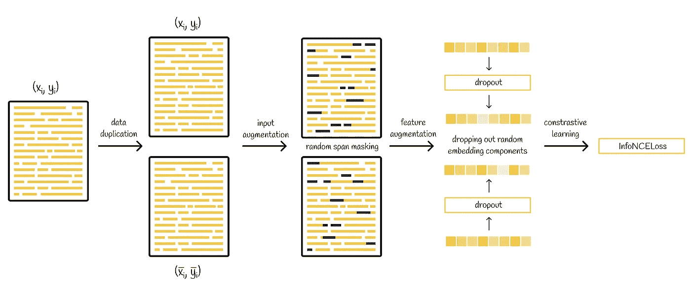
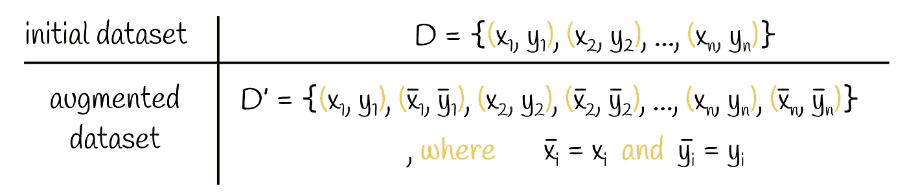
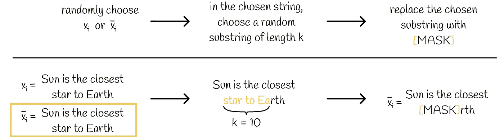
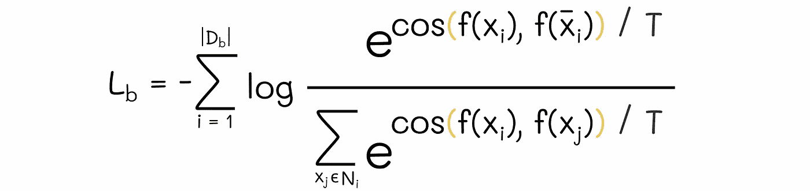

# 大型语言模型，MirrorBERT——将模型转化为通用的词汇和句子编码器

> 原文：[`towardsdatascience.com/large-language-models-mirrorbert-transforming-models-into-universal-lexical-and-sentence-511bd592da48?source=collection_archive---------10-----------------------#2023-12-12`](https://towardsdatascience.com/large-language-models-mirrorbert-transforming-models-into-universal-lexical-and-sentence-511bd592da48?source=collection_archive---------10-----------------------#2023-12-12)

## 了解镜像增强如何生成数据，并在语义相似性任务中提升 BERT 的性能

 [Vyacheslav Efimov](https://medium.com/@slavahead?source=post_page-----511bd592da48--------------------------------)

·

[关注](https://medium.com/m/signin?actionUrl=https%3A%2F%2Fmedium.com%2F_%2Fsubscribe%2Fuser%2Fc8a0ca9d85d8&operation=register&redirect=https%3A%2F%2Ftowardsdatascience.com%2Flarge-language-models-mirrorbert-transforming-models-into-universal-lexical-and-sentence-511bd592da48&user=Vyacheslav+Efimov&userId=c8a0ca9d85d8&source=post_page-c8a0ca9d85d8----511bd592da48---------------------post_header-----------) 发表在 [Towards Data Science](https://towardsdatascience.com/?source=post_page-----511bd592da48--------------------------------) ·7 分钟阅读·2023 年 12 月 12 日

--

# 介绍

毫无疑问，类似 BERT 的模型在现代自然语言处理应用中扮演着基础性角色。尽管它们在下游任务上的表现非常出色，但大多数模型在特定问题上并不是那么完美，需要进行微调。从原始预训练模型构建的嵌入通常会导致指标远离最先进的结果。同时，微调是一个繁重的过程，通常需要至少几千个标注数据样本才能使模型更好地理解领域数据。在某些情况下，当我们无法简单地收集已标注的数据或数据价格高昂时，这一问题就会变得很棘手。

**MirrorBERT** 旨在克服上述问题。与标准的微调算法不同，MirrorBERT 通过智能地增强初始数据而不依赖外部知识来进行自我监督。这种方法使 MirrorBERT 在 *语义相似性问题* 上表现出可比的性能。此外，通过使用其创新的对比学习技术，MirrorBERT 可以在不到一分钟的时间内将像 BERT 或 [RoBERTa](https://medium.com/towards-data-science/roberta-1ef07226c8d8) 这样的预训练模型转换为通用词汇编码器！

## 大型语言模型：RoBERTa — 一种鲁棒优化的 BERT 方法

### 了解用于 BERT 优化的关键技术

towardsdatascience.com

借助官方的 [MirrorBERT 论文](https://arxiv.org/pdf/2104.08027.pdf)，我们将深入了解其关键细节，以理解其内部工作原理。所获得的知识是通用的，因为讨论的技术也可以用于处理相似性任务的其他 NLP 模型。

# 方法论

简单来说，MirrorBERT 是与 BERT 模型相同的模型，只不过在其学习过程中引入了几个步骤。让我们逐一讨论这些步骤。

MirrorBERT 学习过程

## 1\. 自我重复

如其名称所示，MirrorBERT 只是简单地重复初始数据。

自我重复

然后，这些重复的数据用于进一步构建相同字符串的两种不同嵌入表示。

## 2\. 数据增强

论文的作者提出了两种直观的技术，这些技术略微修改了数据集文本。根据他们的说法，在绝大多数情况下，这些文本破坏不会改变其含义。

## 2.1\. 输入增强

给定一对字符串 (xᵢ, x̄ᵢ)，算法随机选择其中一个，并应用 **随机跨度掩码**，即用 [MASK] 令牌随机替换文本中固定长度 *k* 的子字符串。

通过随机跨度掩码进行输入增强

## 2.2\. 特征增强

> 随机跨度掩蔽操作在句子/短语级别。为了使模型也能在词级任务中表现良好，还需要另一种机制来处理较短的文本片段。特征增强通过使用 dropout 解决了这个问题。

**Dropout** 过程指的是在某一网络层中关闭一定百分比的 *p* 神经元。这可以视为将网络中对应的神经元置零的等效操作。

论文的作者建议使用 dropout 进行数据增强。当一对字符串 (xᵢ, x̄ᵢ) 传递到具有 dropout 层的网络中时，如果每次前向传递时 dropout 层总是禁用不同的神经元，则它们的输出表示会略有不同。

使用 dropout 进行特征增强的一个很棒的方面是 dropout 层已经包含在 BERT / RoBERTa 架构中，这意味着无需额外的实现！

> 虽然随机跨度掩蔽仅应用于数据集中的每第二个对象，但 dropout 是应用于所有对象的。

## 3\. 对比学习

> **对比学习** 是一种机器学习技术，旨在学习数据表示，使得相似的对象在嵌入空间中彼此接近，而不相似的对象彼此远离。

对比学习实现的一种方法是使用 **对比损失函数**。MirrorBERT 选择的损失函数是 ***InfoNCELoss***。让我们理解它是如何工作的。

**InfoNCELoss**

初看起来，*InfoNCELoss* 的公式可能令人畏惧，所以让我们一步步逐渐理解。

1.  两个向量之间的余弦相似度衡量它们彼此对齐的程度，取值范围从 -1 到 1，值越大表示相似度越高。

两个向量之间的余弦相似度

2\. 为了更好地理解下一步，必须了解 *InfoNCELoss* 使用了 softmax 转换，其中温度参数 T 控制输出 softmax 分布的平滑度。这就是为什么相似度除以 T。

> 关于 softmax 温度的更多信息，请参阅 [这篇文章](https://medium.com/towards-data-science/distilbert-11c8810d29fc) 以了解更详细的解释。

余弦相似度除以温度

3\. 与标准 softmax 公式一样，预测（相似度）会被转换为指数形式。

余弦相似度的指数

4\. 在普通的 softmax 公式中，分子包含了类别概率的指数，而分母则是所有分布概率的指数和。在 *InfoNCELoss* 中，类似度的公式也遵循类似的逻辑：

+   分子包含两个稍微修改的相同字符串 (xᵢ, x̄ᵢ) 的指数相似度，可以被视为 *正例*。

+   分母包括 xᵢ与所有其他数据集字符串 xⱼ之间的指数相似度之和，这可以看作是*所有负面样本*的集合。

余弦相似度的 softmax 公式。Nᵢ表示除 xᵢ和 x̄ᵢ之外的所有数据集字符串。

5. 在理想情况下，我们希望相同字符串（xᵢ，x̄ᵢ）之间的相似度高，而 xᵢ与其他字符串 xⱼ之间的相似度低。如果这是真的，则上述公式中的分子会增加，而分母会减少，从而使整个表达式增大。

损失函数的工作方式是相反的：在理想情况下，它们取较小的值，而在较差的情况下，它们会对模型进行严厉惩罚。为了使上述公式与这一损失原则兼容，让我们在整个表达式前添加*负对数*。

负的 softmax 相似度对数。这个表达式可以看作是单个字符串 xᵢ的损失值。

6. 上一步的表达式已经对应于单个字符串 xᵢ的损失值。由于数据集由多个字符串组成，我们需要考虑所有这些字符串。为此，我们需要对所有字符串求和这个表达式。

InfoNCELoss

得到的公式正是*InfoNCELoss*！

> InfoNCELoss 试图将相似的对象聚集在一起，同时在嵌入空间中推开不相似的对象。
> 
> [SBERT](https://medium.com/towards-data-science/sbert-deb3d4aef8a4)中使用的三元组损失是对比学习损失的另一个示例。

 ## 大型语言模型：SBERT — Sentence-BERT

### 了解 siamese BERT 网络如何准确地将句子转换为嵌入

towardsdatascience.com

# 训练资源

关于 MirrorBERT 的一个令人惊讶的事实是，它不需要大量的数据进行微调。此外，这些数据不需要是外部的，因为整个训练过程是自监督的。

> 研究人员报告称，为了微调词汇表示，他们仅使用每种语言中最频繁的 1 万词汇。对于句子级任务，使用 1 万个句子。

# 训练细节

MirrorBERT 训练的细节如下：

+   温度在句子级任务中设置为*T = 0.04*，在词汇级任务中设置为*T = 0.2*。

+   在随机跨度掩蔽中，*k*设置为 5。

+   Dropout 设置为*p = 0.1*。

+   使用 AdamW 优化器，学习率为*2e-5*。

+   批量大小设置为 200（或 400 个重复样本）。

+   词汇模型训练 2 个周期，句子级模型训练 1 个周期。

+   不同于对所有输出标记表示进行均值池化，创建了[CLS]标记表示。

> 单次 MirrorBERT 训练周期仅需 10–20 秒。

# 评估

作者通过应用镜像微调在一组基准测试上评估了指标。结果在三种任务类型上进行了报告：词汇级别、句子级别和跨语言。在每种任务中，MirrorBERT 展现了与其他 BERT 类微调模型相当的性能。

> 结果还显示，10k 到 20k 的训练样本范围是微调的最优范围。随着训练样本数量的增加，模型的性能逐渐下降。

# 结论

镜像微调实际上就像一个魔法咒语：与繁重的微调程序不同，镜像框架所需的时间要少得多，而且不需要外部数据，其性能与 BERT、SBERT 或 RoBERTa 等其他微调模型在语义相似性任务上相当。

因此，MirrorBERT 可以将类似 BERT 的预训练模型转变为通用编码器，以高效捕捉语言知识。

# 资源

+   [快速、有效且自监督：将掩蔽语言模型转化为通用词汇和句子编码器](https://arxiv.org/pdf/2104.08027.pdf)

*除非特别说明，所有图像均由作者提供*
