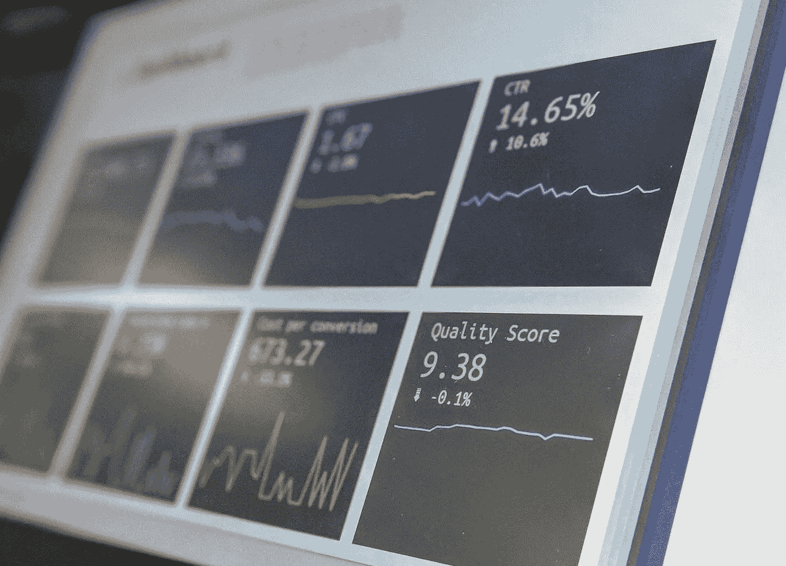

# 数据质量的层次

> 原文：[`towardsdatascience.com/layers-of-data-quality-320bf3770db5`](https://towardsdatascience.com/layers-of-data-quality-320bf3770db5)

## 解决数据问题的地点和方法

 [查德·艾森贝格](https://medium.com/@cisenbe?source=post_page-----320bf3770db5--------------------------------)

·发表于[Towards Data Science](https://towardsdatascience.com/?source=post_page-----320bf3770db5--------------------------------) ·阅读时间 8 分钟·2023 年 7 月 18 日

--

图片来源：[斯蒂芬·道森](https://unsplash.com/@dawson2406?utm_source=medium&utm_medium=referral)于[Unsplash](https://unsplash.com/?utm_source=medium&utm_medium=referral)

随着对生成性人工智能和大型语言模型的兴趣激增，数据质量也重新受到关注。并不是说这个领域需要太多帮助：像[Monte Carlo](https://www.montecarlodata.com/)、[Soda](https://www.soda.io/)、[Bigeye](https://www.bigeye.com/)、[Sifflet](https://www.siffletdata.com/)、[Great Expectations](https://greatexpectations.io/)和[dbt Labs](https://www.getdbt.com/)等公司一直在开发各种解决方案，从专有的到开源的。虽然这些解决方案中的一些是直接竞争对手，但它们并不全是解决相同的问题。例如，定义一个明确的[dbt 测试](https://docs.getdbt.com/docs/build/tests)以确保某一列包含唯一值，与对指标进行异常检测（例如，你的 dim_orders 过程一天生成了 500,000 条记录，而通常是 50,000 条）的情况是非常不同的。数据可能以各种显著而复杂的方式失败。

你可能听说过数据质量的维度；我特别喜欢[理查德·法恩沃斯](https://medium.com/u/74abb61a4947?source=post_page-----320bf3770db5--------------------------------)的见解¹，但一个简单的谷歌搜索会得到数十种不同的看法。然而，核心思想是数据在某些方面可能是“正确的”，但在其他方面却是错误的。如果你的数据是正确的但却迟到，它还有价值吗？如果这些数据从客观上来看是错误的，但却是[一致的](https://benn.substack.com/p/all-i-want-is-to-know-whats-different)²呢？这是数据产品管理中的一个重要方面，以及识别你的利益相关者的优先事项。

很多人关注数据的格式错误、缺失、延迟、不完整等问题，却很少关注数据质量问题的根本原因。我们花费了过多的时间测试和观察数据本身，而不是寻求改进产生、转化和使用这些数据的系统。我想深入探讨这些数据质量问题的“层面”、解决方案以及应该参与解决这些问题的团队。

# 第 1 层：数据生产

所有数据都来源于某处，而源头通常是数据质量问题的根本原因。遵循“垃圾进，垃圾出”的原则，你无法从糟糕的源系统数据中制造出有用的数据产品。

这一层有三个基本的数据质量问题来源：模式漂移、语义漂移以及系统可用性和可靠性。它们都非常重要，但会导致不同的数据质量故障。更重要的是，它们需要不同的解决方案，通常不同的团队需要参与解决这些问题。

模式变化在许多方面是最容易识别和解决的。如果产品工程师（无论是内部还是通过供应商）更改了你使用的表的模式，你的下游流程可能会中断。由于 SaaS API 遵循更成熟的变更管理协议，这种情况在 SaaS API 中较少出现。不过，这并不是对开发者的贬低；通常，这些内部团队甚至不知道下游团队正在使用他们的数据资产。打破 ETL 流程的模式变化通常是组织沟通不畅的症状。

语义漂移更具隐蔽性，对整个企业的影响也更广泛。如果你的开发团队更改了某个字段的度量单位怎么办？或者如果他们更改了通过下拉菜单填充字段的值怎么办？你的产品并不是唯一暴露的东西。像 SFDC、Zuora、NetSuite 和 Zendesk 这样的企业系统的运营团队也可能更改他们使用操作系统的方式，这可能会产生影响。数据质量问题也可能完全是偶然的；我想我们都见过因错别字而输入了数十亿美元交易的可怜销售代表。更有趣的是，你可能会遇到模式变化和语义漂移的结合；例如，*is_enterprise_customer* 替代了 *customer_type* 字段中的有效值‘Enterprise’。与模式变化一样，沟通是缺失的一环。

最终，源系统的可用性和可靠性也是一个问题。如果源系统宕机，数据可能在一段时间内无法生成。根据架构的不同，数据可能仍会生成，但用于检索的端点可能会宕机。在这些情况下，数据质量故障与模式变化和语义漂移的性质完全不同。

[Chad Sanderson](https://medium.com/u/552b7bc2d1de?source=post_page-----320bf3770db5--------------------------------) 一直是 [数据契约](https://dataproducts.substack.com/p/data-contracts-for-the-warehouse)³ 概念的倡导者：数据从（通常是）操作系统发出的正式、程序化强制定义。数据契约是解决模式变化和某些类型语义漂移的良好起点。请注意，数据契约不涉及 SaaS 运维团队；他们需要一个单独的变更管理系统。

产品团队熟悉如 [Datadog](https://www.datadoghq.com/) 和 [Splunk](https://www.splunk.com/) 等可观测性和监控解决方案。SaaS 供应商通常有状态门户，并且一些提供服务中断时的通知。挑战在于，这些系统故障经常不会超出其开发和/或运维团队，即使它们对下游数据团队至关重要。创建良好的流程以在整个组织中沟通故障和问题与提供我们初始可见性的可观测性系统同样重要。

**干预措施**：数据契约、通信渠道、变更管理、系统可观测性和监控**以及**向下游消费者的通信

**首选团队**：产品工程师、SaaS 系统操作员（例如，AR 专家、客户经理）、平台工程师、平台操作员（例如，SaaS 管理员、SaaS 商业分析师）

# 第 2 层：数据处理 — 提取/转换

假设源系统数据是原始的，或者至少足够干净以供使用。仍然有很多问题可能发生。这次，我们面临三方面的挑战：开发中的逻辑错误、低韧性设计和平台稳定性。

在开发数据管道时，有时我们会出现错误。也许 Airflow 任务没有建立正确的依赖关系，或者分析工程师在连接操作中犯了错误。具体错误的结果可能是管道完全崩溃（通常以戏剧性和火爆的方式）；然而，微妙的逻辑错误可能在系统中存在多年，可能会时常轻微影响指标，或者偶尔以重大方式影响指标。

在需求收集过程中，了解利益相关者的优先级至关重要。在某些情况下，如果数据缺失或存在某种质量问题，管道失败是至关重要的。在其他情况下，交付速度比绝对准确性更重要。另一方面，显示部分或不完整的数据是否可以，还是只有在数据经过处理后的某个时间段才展示所有数据？数据产品团队和利益相关者之间的对齐不一致可能意味着我们没有满足期望。

然后，还有一个现实问题，与产品和 SaaS 解决方案一样，我们的数据管道实际上运行在平台上。如果 Snowflake 宕机怎么办？如果 BigQuery 或 EMR 中有影响资源分配的错误怎么办？这些情况会发生，尽管平台团队可能知道，但下游团队仍存在沟通/可见性差距。

解决方案虽然丰富，但实施起来并不一定容易。像[单元测试](https://medium.com/towards-data-science/the-sql-unit-testing-landscape-2023-7a8c5f986dd3)和集成测试这样的策略对在生产前捕捉错误至关重要。数据领域的工具仍然滞后于更广泛的软件工程生态系统，数据团队文化也在追赶中。

另一方面，许多适用于源系统的可观察性解决方案也适用于数据处理系统。然而，关键点在于确保这种可见性在整个组织中共享。可以通过通知渠道或仪表板进行沟通，但无论采取何种方式，我们都需要确保受影响的团队知道发生了什么。

同样值得指出的是，数据生产者引起的相同问题也适用于核心资产开发者；他们的消费者，如分析师、数据科学家和 BI 开发者，也同样容易受到模式变化、语义漂移和系统（ETL）故障的影响。

**干预措施**：单元测试、集成测试、清晰的设计文档、沟通渠道、变更管理

**首选团队**：数据工程师、分析工程师、数据平台工程师

# 第三层：数据消费 — 分析、人工智能和机器学习

在数据和信息之间的最后一公里，仍然有很多出错的空间。在这里，问题更多的是关于数据如何被理解和使用，而不是如何处理、生产和转化数据。具体来说，我想关注应用技术中的错误和对数据本身的误解。

统计学、机器学习和人工智能是复杂的。真的非常复杂。在选择模型时，有很多因素需要考虑：变量是连续的还是离散的、数据分布、异方差性、样本大小等，甚至还有数十种其他因素。即使你做出了所有正确的决策，*也可能*会在你的[机器学习库](https://github.com/scikit-learn/scikit-learn/issues/26502)中出现 obscure 实现错误。

数据使用者也可能不了解上游数据的背景。也许他们没有查看数据目录，或者根本没有数据目录。熟悉数据资产是关键，但并不总是足以避免这些错误，并*最终*得出不正确的结论。

此外，无法保证业务中的某个人会正确解读仪表板、分析或报告。这也不一定是出于恶意。大多数数据使用者在数据领域之外有其他工作。数据团队通常深陷细节，以至于未能理解哪些指标可能不够明确。

你可能已经注意到这里的主题是以人为本的解决方案。被聘用从事高级分析和机器学习角色的人员需要接受正确的培训和积累经验才能成功。至于在既有资产基础上创建产品，数据目录甚至仅仅与数据资产拥有者的对话也可以提供巨大帮助。最后，确保像仪表板和报告这样的文档清晰至关重要，而温馨交接和利益相关者教育则更为理想。

**干预措施**：数据目录、仪表板标签、利益相关者教育、从业者教育和培训

**主要团队**：数据分析师、数据科学家、BI 开发人员、机器学习工程师

# 结论

虽然认识到数据可能出现错误的不同方式（维度）很重要，但同样重要的是理解数据错误的具体方式和位置（层次）。我们讨论了源头错误（层次 1）、数据处理过程中的错误（层次 2）以及使用过程中的错误（层次 3）。我们还讨论了干预措施以及哪些团队离问题和解决方案最近。

数据质量对于从数据中获得价值至关重要，无论是通过分析、自动化还是外部数据产品。数据质量维度帮助我们识别数据在哪些方面存在问题；它是否过时？是否有误？但同样重要的是理解数据为何出现问题。了解“为何”可以为我们提供解决方案的洞察，无论是立即纠正还是长期的系统性修正。

¹理查德·法恩沃斯。 (2020 年 6 月 28 日)。 *数据质量的六个维度——以及如何应对它们*。 `towardsdatascience.com/the-six-dimensions-of-data-quality-and-how-to-deal-with-them-bdcf9a3dba71`

²本·斯坦西尔。 (2023 年 6 月 9 日)。 *我只想知道有什么不同*。 [`benn.substack.com/p/all-i-want-is-to-know-whats-different`](https://benn.substack.com/p/all-i-want-is-to-know-whats-different)

³查德·桑德森。 (2023 年 1 月 25 日)。 *仓库的数据合同*。 [`dataproducts.substack.com/p/data-contracts-for-the-warehouse`](https://dataproducts.substack.com/p/data-contracts-for-the-warehouse)
